# Software Design Specification (SDS)

## 깃라잡이

**Team information:**
|    **Project title**    |                                                                                                                  깃라잡이                                                                                                                   |
| :---------------------: | :------------------------------------------------------------------------------------------------------------------------------------------------------------------------------------------------
|         **학번**          |                                                                                                                 **이름**                                                                                                                  |
|        22111138         |                                                                                                                   오원창                                                                                                                   |
|        22212006         |                                                                                                                   박솔                                                                                                                    |
|        22112018         |                                                                                                                   김관호                                                                                                                   |
|        22313542         |                                                                                                                   정동현                                                                                                                   |
|        22112084         |                                                                                                                   김동규                                                                                                                   |
|        22112110         |                                                                                                                   김성민     
---

## Revision history

| Revision date | Version # | Description | Author |
|---------------|-----------|-------------|--------|
| 11/07/2025    | 1.00      | 1차완성 | Author name |
| | | | |
| | | | |
| | | | |
| | | | |
---

## Contents
1. Introduction  -------------------[Introduction](#1-introduction)
2. Use case analysis  --------------[Use case analysis](#2-use-case-analysis)
3. Class diagram  ------------------[Class diagram](#3-class-diagram)
4. Sequence diagram  ---------------[Sequence diagram](#4-sequence-diagram)
5. State machine diagram  ----------[State machine diagram](#5-state-machine-diagram)
6. User interface prototype  -------[User interface prototype](#6-user-interface-prototype)
7. Implementation requirements  ----[Implementation requirements](#7-implementation-requirements)
8. Glossary  -----------------------[Glossary](#8-glossary)
9. References  ---------------------[References](#9-references)

---

## Authors for each section

- Introduction – 김관호, 김동규, 김성민, 박솔, 오원창, 정동현
- Use case analysis – 김성민, 김동규
- Class diagram – 김관호, 박솔, 오원창, 정동현
- Sequence diagram – 김관호, 박솔, 오원창, 정동현
- State machine diagram – 오원창
- User interface prototype – 정동현 
- Implementation requirements – 김관호, 김동규, 김성민, 박솔, 오원창, 정동현
- Glossary – 김관호, 김동규, 김성민, 박솔, 오원창, 정동현
- References – 김관호, 김동규, 김성민, 박솔, 오원창, 정동현

---

## 1. Introduction
본 문서는 우리 조가 개발하고자 하는 시스템인 깃라잡이의 설계 명세서(SDS)이다. 깃라잡이는 오픈소스에 처음 기여해보는 입문자에게 쉽게 참여하고 학습할 수 있도록 지원하는 플랫폼이다.

본 문서에서는 깃라잡이의 기능적 요구사항을 실현하기 위한 설계를 다양한 관점에서 제시한다. Use Case 분석은 사용자 관점에서 제공되는 주요 기능을 설명하고, Class Diagram은 시스템의 구조적 관점을, Sequence Diagram과 State Machine Diagram은 시스템의 동적 동작을 나타낸다. 또한 User Interface 설계를 통해 실제 사용자의 화면 구성과 상호작용을 시각적으로 표현하였다.

깃라잡이는 good-first-issue와 같은 사용자가 참여하기 적합한 이슈를 추천하고 튜토리얼을 제공함으로서 오픈소스 기여에 조금 더 흥미를 가지고 참여해봄으로서 건전하고 활발한 오픈소스 생태계를 목표로 한다. 또한 여러 사용자가 모여 스터디를 이루어 일정관리와 커뮤니케이션을 통해 이용의 어려움을 최소화하며 자유게시판, QnA게시판등을 통해 플램폼 전역에서의 의사소통이 가능하다.

---

## 2. Use case analysis
- Use case diagram
- 

## 회원관리
1. GitHub OAuth 회원가입
2. 로그인 (GitHub OAuth 재로그인)
3. 내 프로필 조회
4. 프로필 수정
5. 소프트 삭제(계정 탈퇴)
6. 로그아웃
7. 토큰 재발급

## 스터디 관리
8. 스터디 생성
9. 스터디 수정
10. 스터디 삭제
11. 스터디 목록 조회
12. 스터디 상세 조회
13. 스터디 참여 신청
14. 스터디 참여 승인/거절
15. 스터디 탈퇴
16. 스터디 강퇴
17. 스터디 일정 등록
18. 스터디 일정 수정
19. 스터디 일정 삭제
20. 스터디 실시간 채팅
21. 스터디 화상채팅방 생성
22. 스터디 화상채팅방 종료
23. 스터디 화상채팅방 입장
24. 스터디 화상채팅방 퇴장

## 알림
25. 알림 내역 조회
26. 알림 목록 삭제

## 게시판
27. 게시글 작성
28. 게시글 수정
29. 게시글 삭제
30. 게시글 목록 조회
31. 게시글 상세 조회
32. 댓글 작성
33. 댓글 삭제

## 오픈소스 이슈 관리
37. Good First Issue 이슈 목록 조회

## 기여도 및 도전과제
38. Good First Issue 검색: GitHub API를 통해 초보자용 이슈를 검색한다.
39. 내 기여도 조회: GitHub GraphQL API로 커밋/PR/이슈 통계를 조회하고 점수와 뱃지를 계산한다.
40. 도전과제 목록 조회: 현재 나의 기여도에 따른 도전과제 달성 현황(진행률)을 확인한다.
41. 도전과제 자동 달성: 기여도 갱신 시 조건이 충족된 도전과제를 자동으로 완료 처리한다.

## Todo List
42. 할 일(Todo) 등록: 개발 목표나 할 일을 생성한다.
43. 할 일 목록 조회: 무한 스크롤 방식으로 할 일 목록을 조회한다.
44. 할 일 체크 토글: 할 일의 완료 여부를 변경한다.
45. 할 일 일괄 삭제: 완료된 할 일들을 선택하여 한 번에 삭제한다.

---
## 회원 관리

### **Use case #1 : GitHub OAuth 회원가입**
#### GENERAL CHARACTERISTICS
- **Summary**  
  사용자가 “GitHub 로그인” 버튼을 클릭하면 GitHub OAuth 인증을 수행하고,
GitHub에서 전달받은 GitHub ID를 기반으로 자동으로 UserEntity를 생성한다.
이미 존재하는 GitHub ID일 경우 회원가입을 수행하지 않고 바로 로그인 처리한다.
GitHub OAuth 회원가입 과정은 JWT 발급까지 포함된 단일 프로세스이며,
따로 “회원가입 후 로그인” 절차가 존재하지 않는다.

- **Scope**  
  깃라잡이

- **Level**  
  User level  

- **Author**  
  박솔

- **Last Update**  
  2025. 10. 16

- **Status**  
  Design

- **Primary Actor**  
  Non-member User (비회원 사용자)

- **Preconditions**  
  1. 사용자는 GitHub 계정을 보유하고 있으며 GitHub 인증에 정상적으로 접근할 수 있어야 한다.
  2. 서버는 GitHub OAuth App(Client ID / Client Secret)과 연결된 상태여야 한다.
  3. 백엔드는 다음 엔드포인트를 제공한다.
   - GET /api/auth/github/login : GitHub 인증 요청
   - GET /api/auth/github/callback : GitHub Access Token & user info 처리
  4. Supabase PostgreSQL DB 연결이 정상이어야 한다.

- **Trigger**  
  사용자가 “GitHub 로그인” 버튼 클릭 → GitHub OAuth 흐름 시작.

- **Success Post Condition**  
  1. GitHub에서 제공한 github_id로 새로운 UserEntity가 자동 생성됨.
   - githubId: GitHub API에서 받은 고유 ID
   - isAdmin = false
   - createdAt = now
   - deletedAt = null
   - commitCount, issueCount, prCount = 0
  2. 생성된 유저는 DB(users 테이블)에 저장된다.
  3. 서버는 유저 정보 기반으로 JWT AccessToken + RefreshToken을 발급해 클라이언트에 반환한다.
  4. 사용자는 로그인된 상태로 서비스 메인 페이지로 이동한다.

- **Failed Post Condition**  
 1.  GitHub Access Token이 정상 발급되지 않음 (“GitHub 액세스 토큰이 응답에 없습니다.” 오류 포함)
  2.GitHub API 호출 실패
  3. DB 저장 실패
  4. OAuth redirect URL 오류
   → UserEntity 생성 X / JWT 발급 X
 클라이언트는 GitHub 오류 팝업 또는 ‘다시 시도’ 안내 메시지를 표시한다.

#### MAIN SUCCESS SCENARIO
| Step | Action                                                                                                |
| ---- | ----------------------------------------------------------------------------------------------------- |
| S    | 사용자가 “GitHub 로그인” 버튼을 클릭한다.                                                                           |
| 1    | 클라이언트는 GitHub Authorization Endpoint로 리다이렉트한다.                                                        |
| 2    | 사용자는 GitHub에서 로그인 및 권한 동의를 완료한다.                                                                      |
| 3    | GitHub은 `authorization_code`를 서버의 `/callback` URL로 전달한다.                                              |
| 4    | 서버의 `GithubAuthService`는 code를 이용해 GitHub Access Token을 요청한다.                                         |
| 5    | GitHub Access Token 획득 성공 시, 서버는 GitHub User API를 호출한다.                                               |
| 6    | GitHub API 응답에서 `github_id`(고유 식별자)를 추출한다.                                                            |
| 7    | 서버는 DB에서 `githubId`가 존재하는지 조회한다.  - 존재하면 → 기존 계정으로 로그인 처리  - 존재하지 않으면 → 새로운 `UserEntity`를 생성한다. |
| 8    | 생성된(or 조회된) UserEntity 정보를 기반으로 JWT AccessToken & RefreshToken을 생성한다.                                 |
| 9    | 서버는 200 OK와 함께 JWT 및 사용자 정보를 클라이언트에 반환한다.                                                             |
| 10   | 클라이언트는 로그인 성공 상태로 메인 화면 또는 대시보드로 이동한다.                                                                |

#### EXTENSION SCENARIOS
| Step | Branching Action                                                                           |
| ---- | ------------------------------------------------------------------------------------------ |
| 4a   | GitHub Access Token 응답에 `access_token`이 없으면 “GitHub 액세스 토큰이 응답에 없습니다.” 오류 반환(현재 네가 만난 오류). |
| 5a   | GitHub API 서버 장애 또는 rate limit 초과 시 “GitHub 사용자 정보를 가져올 수 없습니다.” 오류 반환.                    |
| 7a   | DB 조회 중 장애 발생 시 “계정 정보를 확인할 수 없습니다.” 메시지를 반환하고 OAuth 프로세스를 종료한다.                           |
| 7b   | UserEntity 저장 실패 시 트랜잭션 롤백 후 “회원 생성 과정에서 오류가 발생했습니다.” 안내.                                  |
| 8a   | JWT 생성 오류 시 클라이언트는 로그인 실패 메시지를 표시한다.                                                       |
| 9a   | 응답 파싱 실패 시 클라이언트는 “로그인 처리 중 오류가 발생했습니다.” 메시지를 표시하고 다시 시도하도록 한다.                            |

#### RELATED INFORMATION
- **Performance**: 회원가입 전체 과정(요청 ~ 응답)은 평균 5초 이내에 완료되어야 한다.
비밀번호 암호화 및 DB 저장은 1초 이내 처리되는 것을 목표로 한다.
- **Frequency**: 신규 사용자마다 최초 1회 실행.
동일 이메일로 중복 가입은 허용하지 않는다.
- **Concurrency**: 최대 500명 동시 가입 요청을 처리할 수 있도록 API 서버 및 DB connection pool을 설정한다.
- **Due Date**: 2025. 11. 01 (예정)

### **Use case #2 : 로그인 (GitHub OAuth 재로그인)**
#### GENERAL CHARACTERISTICS
- **Summary**    
  기존에 users 테이블에 등록된 GitHub 사용자가 다시 “GitHub 로그인”을 통해 접속하는 기능이다.
서버는 GitHub OAuth를 통해 github_id를 확인하고, DB에서 해당 UserEntity를 조회한 뒤
회원가입 과정 없이 곧바로 JWT Access/Refresh Token을 발급한다.
- **Scope**  
  깃라잡이

- **Level**  
  User level

- **Author**  
  박솔

- **Last Update**  
  2025. 10. 16

- **Status**  
  Design

- **Primary Actor**  
  Registered User (기존 가입자, GitHub 계정 연동 사용자)

- **Preconditions**  
  - 사용자의 github_id가 이미 users 테이블에 등록되어 있어야 한다.
  - 서버는 GitHub OAuth App 및 Supabase PostgreSQL DB와 정상 연결 상태여야 한다.
  - 백엔드는 다음 엔드포인트를 제공한다.
     - GET /api/auth/github/login
     - GET /api/auth/github/callback
       
- **Trigger**  
  사용자가 "GitHub 로그인" 버튼을 클릭했을 때 프로세스가 시작된다.
  
- **Success Post Condition**  
 -  users 테이블에서 기존 UserEntity가 조회된다.
 -  서버는 해당 유저 정보를 기반으로 JWT AccessToken 및 RefreshToken을 생성한다.
 -  클라이언트는 로그인 상태가 되며, 메인 화면 혹은 대시보드로 이동한다.
  
- **Failed Post Condition** 
   - GitHub OAuth 실패, GitHub Access Token 미수신, DB 조회 실패 등으로 인해 로그인에 실패한다.
   - JWT는 발급되지 않는다.
   - 클라이언트는 “로그인에 실패했습니다. 다시 시도해 주세요.” 등 안내 메시지를 표시한다.

  
#### MAIN SUCCESS SCENARIO
| Step | Action                                                                                              |
| Step | Action                                                                   |
| ---- | ------------------------------------------------------------------------ |
| S    | 사용자가 “GitHub 로그인” 버튼을 클릭한다.                                              |
| 1    | 클라이언트는 `GET /api/auth/github/login`으로 요청을 보내거나, GitHub 로그인 URL로 리다이렉트한다. |
| 2    | 사용자는 GitHub 로그인 및 권한 동의를 완료한다.                                           |
| 3    | GitHub은 `authorization_code`를 서버의 `/api/auth/github/callback`으로 전달한다.    |
| 4    | `GithubAuthService`는 이 code로 GitHub Access Token을 요청한다.                  |
| 5    | Access Token 획득 후, GitHub User API를 호출해 `github_id`를 가져온다.               |
| 6    | 서버는 `UserRepository.findByGithubId(githubId)`로 기존 유저를 조회한다.              |
| 7    | 유저가 존재하면, 해당 `UserEntity` 기반으로 JWT AccessToken 및 RefreshToken을 생성한다.     |
| 8    | 서버는 200 OK와 함께 토큰 및 유저 정보를 클라이언트에 반환한다.                                  |
| 9    | 클라이언트는 로그인 상태로 전환하고, 메인/대시보드 화면으로 이동시킨다.                                 |

#### EXTENSION SCENARIOS
| Step | Branching Action                                                                      |
| ---- | ------------------------------------------------------------------------------------- |
| 4a   | GitHub Access Token 응답에 토큰이 없을 경우, “GitHub 액세스 토큰이 응답에 없습니다.” 메시지를 반환하고 로그인 절차를 중단한다. |
| 5a   | GitHub User API 호출 실패 시, “GitHub 사용자 정보를 가져올 수 없습니다.” 메시지를 반환한다.                      |
| 6a   | `githubId`로 조회되는 사용자가 없을 경우, UC #1(회원가입 – GitHub OAuth 자동 생성) 플로우로 분기하여 신규 계정을 생성한다.  |
| 7a   | JWT 생성 중 서버 내부 오류 발생 시, “로그인 처리 중 문제가 발생했습니다.” 메시지를 반환한다.                             |

#### RELATED INFORMATION
- **Performance**:
로그인 요청 ~ 토큰 발급까지 평균 3초 이내 처리.
JWT 생성은 평균 100ms 이내를 목표로 한다.

- **Frequency**:
  일반 사용자는 하루에 수회 로그인 가능.
  세션 유지 전략(토큰 만료 시간)에 따라 로그인 빈도는 변경될 수 있다.

- **Concurrency**:최소 수백 건의 동시 로그인 요청을 처리할 수 있도록 API 서버 및 DB

- **Due Date**: 2025. 11. 01 (예정)

### **Use case #3 : 내 프로필 조회**
#### GENERAL CHARACTERISTICS
- **Summary**    
  - 로그인된 사용자가 자신의 프로필 정보를 조회하는 기능이다.
DB의 users 테이블에서 현재 인증된 사용자의 UserEntity를 조회하고,
응답 DTO를 통해 GitHub ID, 관리자 여부, 생성일, 통계 정보 등을 반환한다.
- **Scope**  
  깃라잡이

- **Level**  
  User level  

- **Author**  
  박솔

- **Last Update**  
  2025. 10. 16

- **Status**  
  Design

- **Primary Actor**  
  Registered User (로그인된 사용자)
  
- **Preconditions**  
  - 사용자는 유효한 JWT AccessToken을 보유한 로그인 상태여야 한다.
  - 서버는 토큰 검증 필터 혹은 Security 설정을 통해 인증된 사용자 정보를 조회할 수 있어야 한다.
  - 백엔드는 GET /api/users/me와 같은 엔드포인트를 통해 현재 사용자 조회 기능을 제공한다.
  
- **Trigger**  
  사용자가 “내 프로필” 버튼 또는 메뉴를 클릭했을 때.
  
- **Success Post Condition**  
  - DB에서 현재 사용자에 해당하는 UserEntity를 조회한다.
  - 서버는 UserProfileResponseDto 같은 형태로 프로필 정보를 반환한다.
  - 클라이언트는 프로필 화면에 유저 정보를 표시한다.
  
- **Failed Post Condition** 
  - 토큰이 유효하지 않거나 만료된 경우, 프로필 정보를 반환하지 못한다.
  - 삭제(soft delete)된 사용자일 경우, 조회를 제한할 수 있다.
  - 클라이언트는 로그인 재요청 또는 오류 메시지를 표시한다.
  
#### MAIN SUCCESS SCENARIO
| Step | Action                                                                     |
| ---- | -------------------------------------------------------------------------- |
| S    | 사용자가 “내 프로필” 메뉴를 클릭한다.                                                     |
| 1    | 클라이언트는 저장된 JWT AccessToken을 포함하여 `GET /api/users/me` 요청을 보낸다.              |
| 2    | 서버는 인증 필터를 통해 토큰을 검증하고, 현재 사용자 ID(또는 githubId)를 확인한다.                      |
| 3    | 서버는 `UserRepository.findById()` 또는 `findByGithubId()`로 `UserEntity`를 조회한다. |
| 4    | 서버는 조회한 엔티티를 `UserProfileResponseDto`로 변환한다.                               |
| 5    | 서버는 200 OK와 함께 프로필 정보를 응답한다.                                               |
| 6    | 클라이언트는 수신한 정보(닉네임, GitHub ID, 통계 정보 등)를 화면에 렌더링한다.                         |

#### EXTENSION SCENARIOS
| Step | Branching Action                                                         |
| ---- | ------------------------------------------------------------------------ |
| 2a   | 토큰이 누락되거나 만료된 경우, 서버는 401 Unauthorized를 반환한다. 클라이언트는 로그인 페이지로 이동시킨다.     |
| 3a   | 해당 유저가 `deletedAt`이 설정된 소프트 삭제 상태일 경우, “탈퇴 처리된 계정입니다.” 메시지와 함께 접근을 차단한다. |

#### RELATED INFORMATION
- **Performance**:
  - 프로필 조회 요청은 평균 2초 이내에 처리되어야 한다.
  - DB 조회 및 DTO 변환은 1초 이내에 완료되는 것을 목표로 한다.

- **Frequency**:
  - 사용자가 마이페이지에 접근할 때마다 실행될 수 있다.
  - 일반적으로 세션당 여러 번 조회가 발생할 수 있다.

- **Concurrency**:
  - 다수의 사용자가 동시에 자신의 프로필을 조회하더라도 성능 저하가 없어야 한다.

- **Due Date**: 2025. 11. 01 (예정)

### **Use case #4 : 내 프로필 수정**
#### GENERAL CHARACTERISTICS
- **Summary**    
  - 로그인된 사용자가 자신의 프로필 정보를 수정하는 기능이다.
예를 들어 닉네임, 자기소개(bio), 프로필 이미지 등의 변경 요청을 서버에 전달하고,
서버는 해당 UserEntity와 관련 부가 정보 테이블을 수정 후 최신 상태를 반환한다.

- **Scope**  
  깃라잡이

- **Level**  
  User level  

- **Author**  
  박솔

- **Last Update**  
  2025. 10. 16

- **Status**  
  Design

- **Primary Actor**  
  Registered User (로그인된 사용자)

- **Secondary Actor**
  GitHub
  
- **Preconditions**  
  - 사용자가 유효한 JWT를 가지고 로그인된 상태여야 한다.
  - 백엔드는 PATCH /api/users/me 또는 PUT /api/users/me 로 프로필 수정 API를 제공한다.
  
- **Trigger**  
  -사용자가 “프로필 수정” 버튼을 눌러 수정 폼을 제출할 때.
  
- **Success Post Condition**  
  - DB에 저장된 유저의 프로필 관련 정보가 요청값으로 갱신된다.
  - 서버는 갱신된 프로필 정보를 응답 DTO로 반환한다.
  
- **Failed Post Condition** 
  - 유효성 검증 실패, 권한 오류, DB 예외 발생 시 변경이 반영되지 않는다.
  - 기존 프로필 정보는 그대로 유지된다.
  
#### MAIN SUCCESS SCENARIO
| Step | Action                                                                      |
| ---- | --------------------------------------------------------------------------- |
| S    | 사용자가 “프로필 수정” 화면에서 닉네임/자기소개 등을 입력하고 “저장” 버튼을 누른다.                           |
| 1    | 클라이언트는 수정된 값들을 `UserProfileUpdateDto` JSON 형태로 `PATCH /api/users/me`에 전송한다. |
| 2    | 서버는 JWT를 검증해 현재 사용자 정보를 확인한다.                                               |
| 3    | 서버는 `UserRepository.findById()`로 해당 `UserEntity`를 조회한다.                     |
| 4    | 서버는 전달된 DTO의 값을 엔티티(또는 별도 Profile 엔티티)에 반영한다.                               |
| 5    | 서버는 변경된 엔티티를 저장한다.                                                          |
| 6    | 서버는 저장 결과를 `UserProfileResponseDto`로 만들어 반환한다.                              |
| 7    | 클라이언트는 성공 메시지와 함께 최신 프로필 정보를 다시 표시한다.                                       |

#### EXTENSION SCENARIOS
| Step | Branching Action                                               |
| ---- | -------------------------------------------------------------- |
| 2a   | JWT가 유효하지 않으면 서버는 401 Unauthorized를 반환하고, 클라이언트는 로그인을 다시 요구한다. |
| 4a   | 닉네임 길이 초과 등 유효성 검증 실패 시, 서버는 400 Bad Request와 오류 메시지를 반환한다.    |
| 5a   | DB 저장 중 예외 발생 시, 서버는 “프로필 수정 중 오류가 발생했습니다.” 메시지를 반환한다.         |

#### RELATED INFORMATION
- **Performance**:
  - 프로필 수정 요청은 평균 3초 이내에 처리되어야 한다.
  - DB 업데이트 및 트랜잭션 커밋은 1초 이내를 목표로 한다.

- **Frequency**: 
  - 사용자는 필요 시 여러 번 프로필 정보를 수정할 수 있다.
  - 일반적으로 닉네임/프로필 이미지는 빈번하지 않게 변경된다고 가정한다.

- **Concurrency**:
  - 동일 사용자가 여러 기기에서 동시에 프로필 수정을 시도할 경우, 마지막 요청의 값으로 저장되는 것을 기본 동작으로 한다.

- **Due Date**: 2025. 11. 01 (예정)

### **Use case #5 : 계정 탈퇴 (소프트 삭제)**
#### GENERAL CHARACTERISTICS
- **Summary**   
  - 사용자가 서비스 탈퇴를 요청할 경우, 실제 DB 레코드를 삭제하지 않고 UserEntity.deletedAt에 현재 시각을 기록하는 방식으로 소프트 삭제(비활성화) 처리한다.
  - 소프트 삭제된 사용자는 더 이상 로그인 및 서비스 이용이 불가능하다.
- **Scope**  
  깃라잡이

- **Level**  
  User level  

- **Author**  
  박솔

- **Last Update**  
  2025. 10. 16

- **Status**  
  Design

- **Primary Actor**  
  Registered User (로그인된 사용자)

- **Preconditions**  
  - 사용자는 로그인된 상태여야 한다.
  - 서버는 DELETE /api/users/me 또는 POST /api/users/me/deactivate 엔드포인트를 제공한다.
  
- **Trigger**  
  - 사용자가 “계정 탈퇴” 버튼을 클릭하고, 탈퇴 여부를 최종 확인했을 때 프로세스가 시작된다.
  
- **Success Post Condition**  
  -  해당 사용자의 UserEntity.deletedAt가 현재 시각으로 설정된다.
  - 이후 이 계정은 로그인 및 주요 기능 사용이 불가능하다.
  
- **Failed Post Condition** 
  - DB 예외 또는 권한 문제로 인해 deletedAt이 설정되지 않는다.
  - 계정은 여전히 활성 상태로 남는다.
  
#### MAIN SUCCESS SCENARIO
| Step | Action                                                      |
| ---- | ----------------------------------------------------------- |
| S    | 사용자가 “계정 탈퇴” 버튼을 클릭한다.                                      |
| 1    | 클라이언트는 확인 다이얼로그(“정말 탈퇴하시겠습니까?”)를 표시하고, 사용자가 확인을 누른다.        |
| 2    | 클라이언트는 JWT를 포함하여 `DELETE /api/users/me` 요청을 서버로 전송한다.       |
| 3    | 서버는 JWT를 검증하고 현재 사용자 정보를 확인한다.                              |
| 4    | 서버는 `UserRepository.findById()`로 `UserEntity`를 조회한다.        |
| 5    | 서버는 `user.softDelete()`를 호출하여 `deletedAt`에 현재 시각을 기록한다.     |
| 6    | 서버는 변경된 엔티티를 저장하고, 200 OK 또는 204 No Content를 반환한다.          |
| 7    | 클라이언트는 “계정이 탈퇴 처리되었습니다.” 메시지를 표시하고, 로그인 화면 또는 랜딩 페이지로 이동한다. |

#### EXTENSION SCENARIOS
| Step | Branching Action                                                         |
| ---- | ------------------------------------------------------------------------ |
| 3a   | JWT가 만료되었거나 유효하지 않을 경우, 서버는 401을 반환하고 탈퇴 요청을 거부한다.                       |
| 5a   | 이미 `deletedAt`이 설정된 계정이 다시 탈퇴를 시도한 경우, 서버는 “이미 탈퇴 처리된 계정입니다.” 메시지를 반환한다. |
| 6a   | DB 예외 발생 시, “계정 탈퇴 처리 중 오류가 발생했습니다.” 메시지를 반환한다.                          |

#### RELATED INFORMATION

- **Performance**:
  - 계정 탈퇴 요청은 평균 3초 이내에 처리되어야 한다.
  - soft delete 처리는 단일 row 업데이트로 1초 이내에 완료되는 것을 목표로 한다.

- **Frequency**: 
  - 일반적으로 사용자당 0~1회 실행되는 희소 이벤트이다.
  - 탈퇴 후에는 해당 계정으로의 재로그인이 제한된다(로그인 로직에서 추가 처리 가능).

- **Concurrency**:
  - 동시에 여러 탈퇴 요청이 들어올 가능성은 낮으나, 동일 사용자가 여러 기기에서 거의 동시에 탈퇴를 시도할 경우 마지막 요청 기준으로 처리된다고 본다.

- **Due Date**: 2025. 11. 01 (예정)

### **Use case #6 : 로그아웃**
#### GENERAL CHARACTERISTICS
- **Summary**   
  - 현재 로그인된 사용자가 로그아웃을 수행하는 기능이다. 서버는 저장된 RefreshToken(예: DB/Redis)을 무효화하거나 삭제하고, 클라이언트는 로컬 스토리지/쿠키에 저장된 JWT를 제거한다.
- **Scope**  
  깃라잡이

- **Level**  
  User level  

- **Author**  
  박솔

- **Last Update**  
  2025. 10. 16

- **Status**  
  Design

- **Primary Actor**  
  Registered User (로그인된 사용자)

- **Preconditions**  
  - 사용자는 로그인된 상태여야 한다.
  - 서버는 POST /api/auth/logout 엔드포인트를 제공한다.
  
- **Trigger**  
  - 사용자가 “로그아웃” 버튼을 클릭했을 때.
  
- **Success Post Condition**  
  -  서버에 저장된 해당 사용자의 RefreshToken 정보가 무효화/삭제된다.
  - 클라이언트는 로컬에 저장된 AccessToken/RefreshToken을 제거한다.
  - 사용자는 비로그인 상태로 전환된다.
  
- **Failed Post Condition** 
  - 서버가 RefreshToken 정보를 찾지 못하거나, 내부 오류로 삭제하지 못하는 경우
  → 클라이언트는 토큰을 제거하고 화면 상에서는 로그아웃 처리하되, 서버 측 세션/토큰 상태는 일부 남아 있을 수 있다.

  
#### MAIN SUCCESS SCENARIO
| Step | Action                                                                |
| ---- | --------------------------------------------------------------------- |
| S    | 사용자가 “로그아웃” 버튼을 클릭한다.                                                 |
| 1    | 클라이언트는 저장된 JWT(특히 RefreshToken)를 포함해 `POST /api/auth/logout` 요청을 보낸다. |
| 2    | 서버는 토큰을 검증하고, 해당 사용자/RefreshToken을 식별한다.                              |
| 3    | 서버는 DB/Redis 등에서 해당 RefreshToken 레코드를 삭제하거나 블랙리스트에 등록한다.              |
| 4    | 서버는 200 OK 또는 204 No Content를 반환한다.                                   |
| 5    | 클라이언트는 로컬/세션 스토리지 또는 쿠키에 저장된 AccessToken/RefreshToken을 삭제한다.          |
| 6    | 클라이언트는 로그인 페이지 또는 메인 비로그인 화면으로 이동한다.                                  |

#### EXTENSION SCENARIOS
| Step | Branching Action                                                           |
| ---- | -------------------------------------------------------------------------- |
| 2a   | 토큰이 누락되었을 경우, 서버는 401을 반환할 수 있으며, 클라이언트는 일단 로컬 토큰을 삭제하고 로그인 화면으로 보낸다.      |
| 3a   | 서버에 해당 RefreshToken 정보가 없는 경우(이미 로그아웃했거나 만료 등), 서버는 단순 성공 응답(멱등 처리)을 반환한다. |

#### RELATED INFORMATION

- **Performance**:
  - 로그아웃 요청은 서버에서 수행하는 작업(RefreshToken 삭제, 블랙리스트 등록 등)이 단순하므로
평균 1초 이내에 응답하는 것을 목표로 한다.
  - 네트워크 상태가 정상일 경우, 대부분의 요청은 500ms 이내 처리될 수 있어야 한다.

- **Frequency**: 
  - 일반 사용자는 세션 종료 시 1회 로그아웃을 수행하는 것이 일반적이다.
  - 브라우저/클라이언트에 토큰이 저장되는 구조이므로, 자주 접속하는 사용자 기준 하루 1~3회 정도 로그아웃이 발생할 수 있다.
  - 자동 로그아웃(토큰 만료)은 이 Use case에 포함하지 않고, 별도의 만료/재발급 정책으로 관리한다.

- **Concurrency**:
  - 로그아웃은 주로 피크 시간대(업무/스터디 종료 시각 등)에 몰릴 수 있으므로, 최소 수백 명(예: 500명 이상)이 동시에 로그아웃 요청을 보내도 DB/Redis의 토큰 삭제/무효화 처리에 병목이 생기지 않도록 설계해야 한다.
  - 특히 RefreshToken 저장소(예: Redis)의 쓰기 처리량(write throughput) 을 고려해 connection pool, timeout, 재시도 정책을 적절히 설정한다.

- **Due Date**: 2025. 11. 01 (예정)

### **Use case #7 : 토큰 재발급 (Refresh Token)**
#### GENERAL CHARACTERISTICS
- **Summary**    
  로그인 상태에서 Access Token이 만료되었을 때, 클라이언트가 보유중인 유효한 Refresh Token을 서버에 전송하여 새로운 Access Token (및 필요 시 새로운 Refresh Token)을 재발급받는 과정이다. 서버는 Refresh Token의 유효성을 검증하고 새로운 JWT를 생성한다.

- **Scope**  
  깃라잡이

- **Level**  
  User level 

- **Author**  
  박솔
  
- **Last Update**  
  2025. 10. 16

- **Status**  
  Design

- **Primary Actor**  
  Registered User (로그인된 사용자)

- **Preconditions**  
  - 사용자는 만료된 AccessToken과 유효한 RefreshToken을 보유하고 있어야 한다.
  - 백엔드는 POST /api/auth/refresh 엔드포인트를 제공한다.
  - 서버는 RefreshToken을 DB/Redis에 저장 및 검증할 수 있어야 한다.
  
- **Trigger**  
  클라이언트에서 API 호출 시 401(AccessToken 만료) 응답을 받았을 때,
자동 또는 수동으로 토큰 재발급 요청을 보낸다.
- **Success Post Condition**  
  - 서버는 RefreshToken의 유효성을 검증하고, 새로운 AccessToken(및 필요 시 RefreshToken)을 생성하여 반환한다.
  - 클라이언트는 기존 토큰을 새 토큰으로 교체한다.
  
- **Failed Post Condition** 
  - RefreshToken이 만료, 위조, DB에 없음 등의 이유로 유효하지 않다면 재발급이 실패한다.
  - 클라이언트는 로그인 페이지로 리다이렉트하여 전체 로그인 절차를 다시 수행해야 한다.

#### MAIN SUCCESS SCENARIO
| Step | Action                                                              |
| ---- | ------------------------------------------------------------------- |
| S    | 클라이언트가 API 요청 중 401(만료) 응답을 받고, 토큰 재발급을 시도한다.                       |
| 1    | 클라이언트는 저장된 RefreshToken을 포함해 `POST /api/auth/refresh` 요청을 서버로 전송한다. |
| 2    | 서버는 RefreshToken의 서명 유효성 및 만료 여부를 검증한다.                             |
| 3    | 서버는 DB/Redis에 저장된 RefreshToken과 비교하여 동일한지 확인한다.                     |
| 4    | 검증에 성공하면, 서버는 새로운 AccessToken(및 경우에 따라 RefreshToken도 갱신)을 생성한다.     |
| 5    | 서버는 200 OK와 함께 새 토큰들을 응답한다.                                         |
| 6    | 클라이언트는 기존 토큰을 새 토큰으로 교체하고, 중단된 요청을 재시도할 수 있다.                       |

#### EXTENSION SCENARIOS
| Step | Branching Action                                                      |
| ---- | --------------------------------------------------------------------- |
| 2a   | RefreshToken 자체가 만료된 경우, 서버는 401 또는 403을 반환하고 “다시 로그인하세요.” 메시지를 전달한다. |
| 3a   | DB/Redis에 해당 RefreshToken이 없거나 이미 폐기된 경우, 서버는 재발급을 거부한다.              |
| 4a   | 새로운 토큰 생성 중 서버 오류가 발생하면, “토큰 재발급 중 오류가 발생했습니다.” 메시지를 반환한다.            |

#### RELATED INFORMATION
- **Performance**:
  - 토큰 재발급 요청은 평균 2초 이내에 처리되어야 한다.
  - JWT 서명 검증 및 재생성은 수십 ms 수준에서 완료되는 것을 목표로 한다.

- **Frequency**:
  - 사용자 세션이 길어질수록 토큰 재발급 요청 빈도가 증가할 수 있다.
  - Access Token 만료 주기(예: 1시간)에 따라 사용자는 하루에 여러 번 해당 UC를 수행할 수 있다.
- **Concurrency**:
  - 여러 사용자가 동시에 토큰 재발급을 요청하더라도, 서버는 안정적으로 JWT 검증 및 생성 로직을 처리할 수 있어야 한다.

- **Due Date**: 2025. 11. 01 (예정)

---

## 스터디 관리
### **Use case #7 : 스터디 생성**
#### GENERAL CHARACTERISTICS
- **Summary**    
  사용자가 오픈소스 학습이나 프로젝트 협업을 위한 스터디를 새로 개설하는 기능이다.  

- **Scope**  
  깃라잡이

- **Level**  
  User level  

- **Author**  
  정동현

- **Last Update**  
  2025. 10. 12

- **Status**  
  Design

- **Primary Actor**  
  User

- **Preconditions**  
  사용자는 깃라잡이에 로그인한 상태여야 한다.
  
- **Trigger**  
  사용자가 “스터디 생성” 버튼을 클릭하여 새 스터디를 개설하려고 할 때
  
- **Success Post Condition**  
  새 스터디가 데이터베이스에 성공적으로 등록된다.
  스터디를 개설한 유저는 "스터디장"권한을 얻는다.
  생성된 스터디는 스터디 목록 및 상세 페이지에서 조회 가능해진다.
  스터디 생성 완료 메시지가 표시되며, 스터디 홈 화면으로 이동한다.
  
- **Failed Post Condition** 
  필수 입력 항목 누락, 중복된 스터디명, 서버 오류 등의 이유로 스터디 생성이 완료되지 않는다.
  오류 메시지가 표시되고, 사용자는 수정 후 다시 시도할 수 있다.
  
#### MAIN SUCCESS SCENARIO
| Step | Action                                       |
| ---- | -------------------------------------------- |
| S    | 사용자가 "스터디 생성" 버튼을 클릭한다.                      |
| 1    | 사용자가 스터디 생성 버튼을 클릭할 때 시작된다.                  |
| 2    | 사용자는 스터디명, 주제, 소개, 모집 인원, 기술 스택 등의 정보를 입력한다. |
| 3    | 사용자가 저장 버튼을 누르면 시스템은 입력값을 검증한다.              |
| 4    | 검증이 완료되면 시스템은 새로운 스터디 정보를 데이터베이스에 저장한다.      |
| 5    | 스터디 생성 완료 메시지를 표시하고 스터디 상세 페이지로 이동한다.        |
| 6    | 스터디가 성공적으로 생성되면 종료된다.                        |

#### EXTENSION SCENARIOS
| Step | Branching Action                           |
| ---- | ------------------------------------------ |
| 2a   | 필수 정보 누락 시 입력 오류 메시지를 표시하고 입력 단계로 되돌아간다.   |
| 3a   | 스터디명이 중복되면 오류 메시지를 표시하고 저장을 중단한다.          |
| 3b   | 형식 오류 발생 시 수정 안내 메시지를 표시한다.                |
| 4a   | 서버 또는 DB 오류 시 “생성 중 오류 발생” 메시지를 표시하고 종료한다. |
| 4b   | 로그인 세션 만료 시 로그인 페이지로 이동한다.                 |
| 5a   | 페이지 이동 실패 시 목록 페이지로 대체 이동한다.               |

  
#### RELATED INFORMATION

- **Performance**: １초 이내

- **Frequency**:사용자가 신규 스터디 개설 시에만 수행

- **Concurrency**: 동시 요청시 순차적 생성

- **Due Date**: 2025. 11. 07

### **Use case #8 : 스터디 수정**
#### GENERAL CHARACTERISTICS
- **Summary**    
  스터디장이 스터디의 정보, 상태를 변경할 수 있는 기능이다.
  
- **Scope**  
  깃라잡이

- **Level**  
  User level  

- **Author**  
  정동현

- **Last Update**  
  2025. 10. 14

- **Status**  
  Design

- **Primary Actor**  
  User

- **Preconditions**  
  사용자가 스터디장 권한을 가지고 있어야 한다
  
- **Trigger**  
  스터디장이 스터디 상세화면에서 "정보 수정"을 클릭할 때.
  
- **Success Post Condition**  
  수정된 스터디 정보가 데이터베이스에 저장되고, 최신 내용이 화면에 반영된다.
  
- **Failed Post Condition** 
  수정이 반영되지 않고 오류 메시지가 표시된다.
  
#### MAIN SUCCESS SCENARIO
| Step | Action                                           |
| ---- | ------------------------------------------------ |
| S    | 스터디장이 스터디 상세 페이지에서 "정보 수정" 버튼을 클릭한다.             |
| 1    | 스터디장이 수정 버튼을 클릭할 때 시작된다.                         |
| 2    | 시스템은 스터디장 권한을 확인하고, 기존 스터디 정보를 수정 가능한 입력창에 표시한다. |
| 3    | 스터디장은 스터디명, 설명, 모집 구분 등의 항목을 수정한다.               |
| 4    | 스터디장이 저장 버튼을 클릭하면 시스템은 입력값의 유효성을 검사한다.           |
| 5    | 검증이 완료되면 시스템은 변경된 정보를 데이터베이스에 반영한다.              |
| 6    | 수정 완료 메시지를 표시하고 갱신된 스터디 상세 페이지를 보여준다.            |
| 7    | 수정이 성공적으로 완료되면 종료된다.                             |

| Step | Branching Action                                                       |
| ---- | ---------------------------------------------------------------------- |
| 2a   | 스터디장이 아닌 사용자가 접근하면 “권한이 없습니다.” 메시지를 표시하고 요청을 차단한다.                     |
| 3a   | 필수 항목이 비어 있으면 “필수 정보를 입력해주세요.” 메시지를 표시하고 수정 단계로 되돌아간다.                 |
| 4a   | 잘못된 입력 형식이 포함된 경우 “입력 형식이 올바르지 않습니다.” 메시지를 표시하고 재입력을 요청한다.             |
| 5a   | 데이터베이스 오류 발생 시 “수정 중 오류가 발생했습니다.” 메시지를 표시하고 과정을 종료한다.                  |
| 6a   | 페이지 갱신 중 오류가 발생하면 “수정은 완료되었으나 페이지 갱신에 실패했습니다.” 메시지를 표시하고 목록 페이지로 이동한다. |

   
#### RELATED INFORMATION
- **Performance**: 일반적인 수정 요청은 1초 이내에 완료된다.

- **Frequency**: 스터디 정보 변경이 필요할 때 비정기적으로 수행된다.

- **Concurrency**: 동시에 여러 사용자가 수정 요청을 할 가능성은 낮다.

- **Due Date**: 2025. 11. 07

### **Use case #9 : 스터디 삭제**
#### GENERAL CHARACTERISTICS
- **Summary**  
  스터디장이 자신이 개설한 스터디를 삭제하는 기능이다.

- **Scope**  
  깃라잡이
  
- **Level**  
  User level  

- **Author**  
  정동현
 
- **Last Update**  
  2025. 10. 13

- **Status**  
  Design

- **Primary Actor**  
  User

- **Preconditions**  
  스터디장 권한을 가지고 있어야 한다.

- **Trigger**  
  스터디장이 "스터디 삭제"버튼을 클릭한 경우
  
- **Success Post Condition**  
  스터디와 관련된 모든 정보가 삭제되고, 스터디 목록 화면으로 이동한다.
  
- **Failed Post Condition** 
  권한이 없거나 오류가 발생하면 삭제되지 않고 오류 메시지가 표시된다.
  
#### MAIN SUCCESS SCENARIO
| Step | Action                                         |
| ---- | ---------------------------------------------- |
| S    | 스터디장이 스터디 상세 페이지에서 "스터디 삭제" 버튼을 클릭한다.          |
| 1    | 사용자가 스터디 삭제 버튼을 클릭할 때 시작된다.                    |
| 2    | 시스템은 스터디장 권한을 확인하고, 삭제 여부를 묻는 확인창을 표시한다.       |
| 3    | 사용자가 삭제를 확정하면 시스템은 해당 스터디의 데이터를 데이터베이스에서 삭제한다. |
| 4    | 시스템은 삭제 완료 메시지를 표시하고 스터디 목록 페이지로 이동시킨다.        |
| 5    | 스터디가 성공적으로 삭제되면 종료된다.                          |
  
| Step | Branching Action                                                          |
| ---- | ------------------------------------------------------------------------- |
| 2a   | 스터디장이 아닌 사용자가 삭제를 시도하면 “삭제 권한이 없습니다.” 메시지를 표시하고 요청을 차단한다.                 |
| 2b   | 사용자가 삭제 확인창에서 ‘취소’를 선택하면 삭제 과정을 중단하고 상세 페이지로 되돌아간다.                       |
| 3a   | 데이터베이스 오류로 삭제가 실패하면 “스터디 삭제 중 오류가 발생했습니다.” 메시지를 표시하고 과정을 종료한다.            |
| 4a   | 페이지 이동 중 오류가 발생하면 “삭제는 완료되었으나 페이지 이동에 실패했습니다.” 메시지를 표시하고 목록 페이지로 대체 이동한다. |

  

#### RELATED INFORMATION

- **Performance**: 삭제 요청 후 1초 이내로 처리되며, 관련 데이터가 즉시 반영된다.

- **Frequency**: 스터디 운영 종료 시 또는 불필요할 때 간헐적으로 발생한다.

- **Concurrency**: 동시에 여러 삭제 요청이 발생할 가능성은 매우 낮다.

- **Due Date**: 2025. 11. 07

### **Use case #10 : 스터디 목록 조회**
#### GENERAL CHARACTERISTICS
- **Summary**   
  사용자가 개설된 모든 스터디의 목록을 조회하는 기능이다.

- **Scope**  
  깃라잡이

- **Level**  
  User level  

- **Author**  
  정동현

- **Last Update**  
  2025. 10. 13

- **Status**  
  Design

- **Primary Actor**  
  User

- **Preconditions**  
  사용자가 로그인 상태여야 한다.
  
- **Trigger**  
  사용자가 "스터디 찾기"버튼을 누를 경우
  
- **Success Post Condition**  
  등록된 스터디 목록을 화면에 출력한다.
  
- **Failed Post Condition** 
  서버 오류나 네트워크 장애로 목록을 불러오지 못하면 오류 메시지를 표시한다.
  
#### MAIN SUCCESS SCENARIO
| Step | Action                                |
| ---- | ------------------------------------- |
| S    | 사용자가 "스터디 조회"를 클릭한다.                  |
| 1    | 사용자가 스터디 목록 페이지에 접근할 때 시작된다.          |
| 2    | 시스템은 데이터베이스에서 등록된 모든 스터디 정보를 조회한다.    |
| 3    | 조회된 스터디 목록을 이름과 주제로 정렬하여 화면에 표시한다.    |
| 4    | 사용자는 관심 있는 스터디를 선택하여 상세 조회로 이동할 수 있다. |
| 5    | 스터디 목록이 성공적으로 표시되면 종료된다.              |

#### EXTENSION SCENARIOS
| Step | Branching Action                                                  |
| ---- | ----------------------------------------------------------------- |
| 2a   | 데이터베이스 연결 오류 발생 시 “스터디 목록을 불러올 수 없습니다.” 메시지를 표시하고 과정을 종료한다.       |
| 2b   | 등록된 스터디가 없는 경우 “등록된 스터디가 없습니다.” 메시지를 표시한다.                        |
| 3a   | 정렬 기준 오류나 필터 조건이 잘못된 경우 기본 정렬 기준으로 목록을 표시한다.                      |
| 4a   | 네트워크 오류로 상세 페이지 이동이 실패하면 “페이지 이동에 실패했습니다.” 메시지를 표시하고 목록 화면을 유지한다. |

#### RELATED INFORMATION
- **Performance**: 목록 조회는 평균 1초 이내에 완료된다.

- **Frequency**: 사용자가 스터디 탐색 시 자주 발생한다.

- **Concurrency**: 다수 사용자가 동시에 조회하더라도 문제없이 처리된다.

- **Due Date**: 2025. 11. 07

### **Use case #11 : 스터디 상세 조회**
#### GENERAL CHARACTERISTICS
- **Summary**    
  사용자가 선택한 스터디의 상세 정보를 조회하는 기능이다.

- **Scope**  
  깃라잡이

- **Level**  
  User level

- **Author**  
  정동현

- **Last Update**  
  2025. 10. 13

- **Status**  
  Design

- **Primary Actor**  
  User

- **Preconditions**  
  사용자가 로그인 상태여야 한다.

- **Trigger**  
  사용자가 스터디 목록에서 특정 스터디를 클릭할 때.
  
- **Success Post Condition**  
  시스템이 해당 스터디의 상세 정보를 화면에 표시한다.
  
- **Failed Post Condition** 
  스터디 정보가 존재하지 않거나 서버 오류가 발생하면 오류 메시지를 표시한다.
  
#### MAIN SUCCESS SCENARIO
| Step | Action                             |
| ---- | ---------------------------------- |
| S    | 사용자가 스터디 목록에서 특정 스터디를 클릭한다.        |
| 1    | 사용자가 스터디를 선택할 때 시작된다.              |
| 2    | 시스템은 해당 스터디의 상세 정보를 데이터베이스에서 조회한다. |
| 3    | 조회된 정보를 화면에 표시한다.                  |
| 4    | 사용자는 표시된 상세 페이지에서 참가 신청을 할 수 있다.   |
| 5    | 스터디 정보가 정상적으로 표시되면 종료된다.           |

#### EXTENSION SCENARIOS
| Step | Branching Action                                                             |
| ---- | ---------------------------------------------------------------------------- |
| 2a   | 데이터베이스 오류로 스터디 정보를 불러오지 못한 경우 “스터디 정보를 조회할 수 없습니다.” 메시지를 표시하고 목록 페이지로 되돌아간다. |
| 2b   | 선택한 스터디가 존재하지 않거나 삭제된 경우 “존재하지 않는 스터디입니다.” 메시지를 표시하고 목록 페이지로 이동한다.           |
| 3a   | 조회된 정보 일부가 손상되었거나 누락된 경우 기본 값으로 대체하여 화면에 표시한다.                               |
| 4a   | 네트워크 오류나 세션 만료로 신청 버튼이 비활성화되면 “로그인이 필요한 서비스입니다.” 메시지를 표시한다.                  |

#### RELATED INFORMATION
- **Performance**: 상세 조회는 1초 이내로 완료되며, 화면 로딩은 즉시 이루어진다.

- **Frequency**: 사용자가 관심 있는 스터디를 선택할 때 자주 발생한다.

- **Concurrency**: 여러 사용자가 동시에 동일 스터디를 조회해도 문제없이 처리된다.

- **Due Date**: 2025. 11. 07

### **Use case #12 : 스터디 참여 신청**
#### GENERAL CHARACTERISTICS
- **Summary**    
  사용자가 스터디에 참여 신청을 하는 기능이다.
  
- **Scope**  
  깃라잡이

- **Level**  
  User level  

- **Author**  
  정동현

- **Last Update**  
  2025. 10. 14

- **Status**  
  Design

- **Primary Actor**  
  User

- **Preconditions**  
  사용자는 로그인 상태이며, 해당 스터디의 멤버가 아니어야 한다.
  
- **Trigger**  
  사용자가 스터디 상세 페이지에서 "스터디 참여 신청" 버튼을 클릭할 때.
  
- **Success Post Condition**  
  참여 신청 정보가 스터디장에게 알림으로 전송된다.
  
- **Failed Post Condition** 
  요청이 처리되지 않고 오류 메시지가 표시된다.
  
#### MAIN SUCCESS SCENARIO

| Step | Action                                      |
| ---- | ------------------------------------------- |
| S    | 사용자가 스터디 상세 페이지에서 "스터디 참여 신청" 버튼을 클릭한다.     |
| 1    | 사용자가 가입 신청 버튼을 클릭할 때 시작된다.                  |
| 2    | 시스템은 스터디에 속한 유저인지 확인한다.                     |
| 3    | 시스템은 신청 가능한 상태일 경우 스터디장에게 새 참여 신청 알림을 전송한다. |
| 4    | 사용자에게 "참여 신청이 완료되었습니다." 메시지를 표시한다.          |
| 5    | 신청이 정상적으로 접수되면 종료된다.                        |

#### EXTENSION SCENARIOS
| Step | Branching Action                                                        |
| ---- | ----------------------------------------------------------------------- |
| 2a   | 사용자가 이미 해당 스터디의 멤버일 경우 “이미 참여 중인 스터디입니다.” 메시지를 표시하고 요청을 중단한다.           |
| 2b   | 사용자가 이전에 신청했으나 승인 대기 상태일 경우 “이미 신청이 접수되었습니다.” 메시지를 표시한다.                |
| 3a   | 알림 전송 중 오류가 발생하면 “신청은 완료되었으나 알림 전송에 실패했습니다.” 메시지를 표시한다.                 |
| 4a   | 데이터베이스 오류나 서버 문제로 신청이 저장되지 않으면 “참여 신청 처리 중 오류가 발생했습니다.” 메시지를 표시하고 종료한다. |
| 4b   | 로그인 세션이 만료된 상태라면 “로그인이 필요한 서비스입니다.” 메시지를 표시하고 로그인 페이지로 이동한다.            |

  
#### RELATED INFORMATION
- **Performance**: 신청 요청은 평균 1초 이내로 처리된다.

- **Frequency**: 스터디 참여를 희망하는 사용자가 있을 때 수시로 발생한다.

- **Concurrency**: 여러 사용자가 동시에 신청해도 정상적으로 처리되도록 설계된다.

- **Due Date**: 2025. 11. 07

### **Use case #13 : 스터디 참여 승인/거절**
#### GENERAL CHARACTERISTICS
- **Summary**    
  스터디장이 참여 신청 목록을 확인하고, 신청자의 스터디 참여를 승인하거나 거절하는 기능이다.

- **Scope**  
  깃라잡이

- **Level**  
  User level  
  
- **Author**  
  정동현
  
- **Last Update**  
  2025. 10. 14

- **Status**  
  Design
  
- **Primary Actor**  
  User

- **Preconditions**  
  스터디장 권한을 가지고 있어야하며, 스터디에 참여 신청이 존재해야 한다.
  
- **Trigger**  
  스터디장이 알림 또는 스터디 상세 페이지에서 신청자 목록을 확인하고 "승인" 또는 "거절" 버튼을 클릭할 때.
  
- **Success Post Condition**  
  승인: 신청자가 스터디 멤버로 등록되고, 승인 알림이 전송된다.
  거절: 신청자에게 거절 알림이 전송된다.
  
- **Failed Post Condition** 
  요청이 처리되지 않고 오류 메시지가 표시된다.
  
#### MAIN SUCCESS SCENARIO
| Step | Action                                  |
| ---- | --------------------------------------- |
| S    | 스터디장이 스터디 참여 신청 목록을 확인한다.               |
| 1    | 스터디장이 스터디 참여 신청 목록에 접근할 때 시작된다.         |
| 2    | 시스템은 스터디장 권한을 확인하고, 대기 중인 신청자 목록을 표시한다. |
| 3    | 스터디장이 신청자 옆의 "승인" 또는 "거절" 버튼을 클릭한다.     |
| 4    | 선택된 동작에 따라 신청자의 상태를 "승인" 또는 "거절"로 변경한다. |
| 5    | 처리 결과를 신청자에게 알림으로 전송한다.                 |
| 6    | 참여 신청에 대한 처리가 완료되면 종료된다.                |

#### EXTENSION SCENARIOS
| Step | Branching Action                                                |
| ---- | --------------------------------------------------------------- |
| 2a   | 스터디장이 아닌 사용자가 접근하면 “권한이 없습니다.” 메시지를 표시하고 접근을 차단한다.              |
| 3a   | 스터디장이 이미 처리된 신청자를 다시 승인 또는 거절하려 할 경우 “이미 처리된 신청입니다.” 메시지를 표시한다. |
| 4a   | 데이터베이스 오류로 상태 변경이 실패하면 “처리 중 오류가 발생했습니다.” 메시지를 표시하고 과정을 종료한다.   |
| 5a   | 알림 전송 실패 시 “처리는 완료되었으나 알림 전송에 실패했습니다.” 메시지를 표시한다.               |
| 5b   | 네트워크 오류로 응답이 지연되면 “요청이 지연되고 있습니다.” 메시지를 표시하고 자동 새로고침을 유도한다.     |

  
#### RELATED INFORMATION
- **Performance**: 승인 또는 거절 처리 결과는 1초 이내로 반영된다.

- **Frequency**: 신규 참여 신청이 있을 때마다 발생한다.

- **Concurrency**: 여러 신청자가 동시에 처리될 수 있으나 충돌 가능성은 낮다.

- **Due Date**: 2025. 11. 07

### **Use case #14 : 스터디 탈퇴**
#### GENERAL CHARACTERISTICS
- **Summary**    
  스터디에 속한 사용자가 스터디를 탈퇴하는 기능이다.

- **Scope**  
  깃라잡이

- **Level**  
  User level  

- **Author**  
  정동현

- **Last Update**  
  2025. 10. 14

- **Status**  
  Design

- **Primary Actor**  
  User

- **Preconditions**  
  해당 스터디 멤버에 등록되어 있어야 한다.
  
- **Trigger**  
  사용자가 스터디 상세 페이지에서 "스터디 탈퇴" 버튼을 클릭할 때.
  
- **Success Post Condition**  
  사용자가 스터디 멤버 목록에서 제거된다.
  
- **Failed Post Condition** 
  탈퇴가 정상적으로 처리되지 않고 오류메시지를 표시된다.
  
#### MAIN SUCCESS SCENARIO
| Step | Action                                          |
| ---- | ----------------------------------------------- |
| S    | 사용자가 스터디 상세 페이지에서 "스터디 탈퇴" 버튼을 클릭한다.            |
| 1    | 사용자가 스터디 탈퇴 버튼을 클릭할 때 시작된다.                     |
| 2    | 시스템은 사용자의 로그인 상태와 스터디 멤버 여부를 확인한다.              |
| 3    | 시스템은 사용자에게 탈퇴 여부를 묻는 팝업창을 표시한다.                 |
| 4    | 사용자가 "확인"버튼을 누르면 시스템은 해당 사용자를 스터디 멤버 목록에서 제거한다. |
| 5    | 탈퇴 완료 팝업 메시지를 표시하고 스터디 목록 페이지로 이동시킨다.           |
| 6    | 탈퇴가 성공적으로 처리되면 종료된다.                            |

#### EXTENSION SCENARIOS
| Step | Branching Action                                                          |
| ---- | ------------------------------------------------------------------------- |
| 2a   | 로그인되지 않은 사용자가 탈퇴를 시도하면 “로그인이 필요한 서비스입니다.” 메시지를 표시하고 로그인 페이지로 이동한다.        |
| 2b   | 스터디 멤버가 아닌 사용자가 탈퇴를 시도하면 “스터디 멤버가 아닙니다.” 메시지를 표시하고 요청을 중단한다.              |
| 3a   | 사용자가 팝업창에서 ‘취소’를 선택하면 탈퇴 과정을 중단하고 상세 페이지로 되돌아간다.                          |
| 4a   | 데이터베이스 오류로 멤버 제거에 실패하면 “탈퇴 처리 중 오류가 발생했습니다.” 메시지를 표시하고 과정을 종료한다.          |
| 5a   | 페이지 이동 중 오류가 발생하면 “탈퇴는 완료되었으나 페이지 이동에 실패했습니다.” 메시지를 표시하고 목록 페이지로 대체 이동한다. |

  
#### RELATED INFORMATION
- **Performance**: 탈퇴 요청은 1초 이내에 처리된다.

- **Frequency**: 사용자가 스터디를 나가거나 종료할 때 가끔 발생한다.

- **Concurrency**: 동시에 여러 명이 탈퇴하더라도 문제없이 처리된다.

- **Due Date**: 2025. 11. 07

### **Use case #15 : 스터디 강퇴**
#### GENERAL CHARACTERISTICS
- **Summary**    
  스터디 리더가 특정 스터디 구성원을 강제로 탈퇴시키는 기능

- **Scope**  
  깃라잡이

- **Level**  
  User level  

- **Author**  
  김동규

- **Last Update**  
  2025. 10. 16

- **Status**  
  Design

- **Primary Actor**  
  User (팀 리더)

- **Preconditions**  
  스터디 리더 계정으로 로그인되어 있어야 한다.
  스터디가 존재하고, 강퇴 대상 사용자가 그 스터디의 구성원이어야 한다.
  리더 권한이 존재 해야한다.
  
- **Trigger**  
  사용자(리더)가 스터디 상세 페이지에서 "스터디 강퇴" 버튼을 클릭할 때.
  
- **Success Post Condition**  
  사용자가 스터디 멤버 목록에서 제거된다.
  강퇴된 사용자에게 알림이 전송된다.
  
- **Failed Post Condition** 
  권한이나 서버 오류 발생 시 오류 메시지가 표시된다.
  
#### MAIN SUCCESS SCENARIO
| Step | Action                                          |
| ---- | ----------------------------------------------- |
| S    | 리더가 스터디 구성원 목록에서 특정 사용자의 '강퇴' 버튼을 클릭한다.            |
| 1    | 시스템이 리더의 권한을 검증한다.                     |
| 2    | 시스템은 '정말 강퇴하시겠습니까?' 확인 메시지를 띄운다.              |
| 3    | 리더가 '확인'을 누른다.                 |
| 4    | 시스템은 해당 사용자를 스터디 멤버 목록에서 제거한다.     |
| 5    | 시스템은 강퇴된 사용자에게 알림을 전송한다.           |
| 6    | "구성원이 강퇴되었습니다." 메시지를 표시한다.                            |

#### EXTENSION SCENARIOS

| Step | Branching Action |
| ---- | ---------------- |
|   1a | 리더가 아닌 사용자가 강퇴 기능을 실행할 경우 "권한이 없습니다."를 출력한다. |
|   2a   | 리더가 '취소'를 선택하면 강퇴 요청이 취소된다.        |
  
#### RELATED INFORMATION

- **Performance**:

- **Frequency**:

- **Concurrency**:

- **Due Date**: 2025. 11. 07

### **Use case #16 : 스터디 일정 등록**
#### GENERAL CHARACTERISTICS
- **Summary**    
  사용자가 참여 중인 스터디의 새로운 일정을 등록하는 기능

- **Scope**  
  깃라잡이

- **Level**  
  User level  

- **Author**  
  김동규

- **Last Update**  
  2025. 10. 16

- **Status**  
  Design

- **Primary Actor**  
  User (리더 또는 권한자)

- **Preconditions**  
  사용자는 로그인 상태여야 한다
  해당 스터디 멤버에 등록되어 있어야 한다.
  일정등록 권한이 있어야 한다
  
- **Trigger**  
  사용자가 "일정 등록" 버튼을 클릭할 때.
  
- **Success Post Condition**  
  입련한 일정 정보가 저장되고 스터디 캘린더에 반영된다.
  등록 완료 메시지가 표시된다.
  
- **Failed Post Condition** 
  필수 입력값 누락시 오류 메시지가 표시된다.
  
#### MAIN SUCCESS SCENARIO
| Step | Action                                          |
| ---- | ----------------------------------------------- |
| S    | 사용자가 스터디 상세 페이지에서 "일정 등록" 버튼을 클릭한다.            |
| 1    | 시스템은 일정 등록 폼(날짜, 시간, 장소, 메모 등)을 표시한다.                    |
| 2    | 사용자는 일정 정보를 입력 후 '저장' 버튼을 클릭한다.
| 3    | 시스템은 입력값을 검증한다.              |
| 4    | 일정 등록이 성공하면 스터디 캘린더에 해당 일정이 표시된다.                 |
| 5    | 시스템은 '일정이 등록되었습니다.' 메시지를 표시한다. |
| 6    | 스터디 멤버들에게 알림이 전송된다.           |                            
  
#### EXTENSION SCENARIOS
| Step | Branching Action |
| 2a | 필수 입력 항목이 누락되면 '저장' 버튼이 비활성화된다.|
|      |                  |
|      |                  |

#### RELATED INFORMATION
- **Performance**:

- **Frequency**:

- **Concurrency**:

- **Due Date**: 2025. 11. 07

### **Use case #17 : 스터디 일정 수정**
#### GENERAL CHARACTERISTICS
- **Summary**    
  기존에 등록된 스터디 일정을 수정하는 기능이다.

- **Scope**  
  깃라잡이

- **Level** 
  User level  

- **Author**  
  김동규

- **Last Update**  
  2025. 10. 16

- **Status**  
  Design

- **Primary Actor**  
  User (스터디 리더 또는 권한자)

- **Preconditions**  
  사용자는 로그인 상태여야 한다
  수정하려는 일정이 존재해야 하고 권한이 있어야 한다.
  
- **Trigger**  
  사용자가 "수정" 버튼을 클릭할 때.
  
- **Success Post Condition**  
  수정된 일정 정보가 반영된다.
  
- **Failed Post Condition** 
  일정수정이 정상적으로 처리되지 않고 오류메시지가 표시된다.
  
#### MAIN SUCCESS SCENARIO
| Step | Action                                          |
| ---- | ----------------------------------------------- |
| S    | 사용자가 "수정" 버튼을 클릭한다.            |
| 1    | 시스템은 해당 일정의 기존 정보를 수정 폼에 표시한다.                    |
| 2    | 사용자는 변경할 내용을 입력하고 '저장' 버튼을 클릭한다.              |
| 3    | 시스템은 변경 사항을 검증한다.                 |
| 4    | 시스템은 수정된 정보를 업데이트 하고 변경사항을 반영한다. |
| 5    | 시스템이 "일정 수정 완료" 메시지를 표시한다          |
| 6    | 스터디 멤버에게 알림을 전송한다.                            |

#### EXTENSION SCENARIOS
| Step | Branching Action |
| ---- | ---------------- |
|   2a   |  필수 입력 항목 누락 시 저장이 제한된다.                |
|      |                  |
  

#### RELATED INFORMATION

- **Performance**:

- **Frequency**:

- **Concurrency**:

- **Due Date**: 2025. 11. 07

### **Use case #18 : 스터디 일정 삭제**
#### GENERAL CHARACTERISTICS
- **Summary**    
  기존에 등록된 스터디 일정을 삭제하는 기능이다.

- **Scope**  
  깃라잡이

- **Level**  
  User level  

- **Author**  
  김동규

- **Last Update**  
  2025. 10. 16

- **Status**  
  Design

- **Primary Actor**  
  User (스터디 리더 또는 권한자)

- **Preconditions**  
  사용자는 로그인 상태여야 한다
  수정하려는 일정이 존재해야 하고 권한이 있어야 한다.
  
- **Trigger**  
  사용자가 "삭제" 버튼을 클릭할 때.
  
- **Success Post Condition**  
  일정이 데이터베이스에서 삭제되고 화면에서 즉시 제거된다.
  
- **Failed Post Condition** 
  일정삭제가 정상적으로 처리되지 않고 오류메시지가 표시된다.
  
#### MAIN SUCCESS SCENARIO
| Step | Action                                          |
| ---- | ----------------------------------------------- |
| S    | 사용자가 "삭제" 버튼을 클릭한다.            |
| 1    | 시스템은 "정말 삭제하시겠습니까?" 확인 팝업을 표시한다.                   |
| 2    | 사용자가 삭제를 확정한다.             |
| 3    | 시스템은 해당 일정을 데이터베이스에서 삭제한다.               |
| 4    | 삭제가 완료되면 화면에서 즉시 반영된다. |
| 5    | 시스템이 "일정 삭제 완료" 메시지를 표시한다.         |
| 6    | 스터디 멤버에게 알림을 전송한다.                            |  
  
#### EXTENSION SCENARIOS
| Step | Branching Action |
| ---- | ---------------- |
|   1a   |  '취소' 선택 시 삭제 요청이 취소된다.             |
|      |                  |    

#### RELATED INFORMATION
- **Performance**:

- **Frequency**:

- **Concurrency**:

- **Due Date**: 2025. 11. 07

### **Use case #19 : 스터디 실시간 채팅**

#### GENERAL CHARACTERISTICS
- **Summary**    
  스터디 팀원들이 동일한 채팅방에서 실시간으로 메시지를 주고받을 수 있는 기능

- **Scope**  
  깃라잡이

- **Level**  
  User level  

- **Author**  
  김동규

- **Last Update**  
  2025. 10. 25

- **Status**  
  Design

- **Primary Actor**  
  User

- **Preconditions**  
  로그인되어 있어야 한다.
  해당 스터디에 가입 되어 있어야 한다.

- **Trigger**  
  사용자가 스터디 페이지 내에서 "채팅방 입장" 버튼을 눌렀을 때
  
- **Success Post Condition**  
  스터디 팀원 간 실시간 메시지 송수신이 가능하다. 새로운 메시지가 갱신 된다.
  
- **Failed Post Condition** 
  네트워크 오류 발생 시 오류 메시지를 출력한다.
  
#### MAIN SUCCESS SCENARIO
| Step | Action                                          |
| ---- | ----------------------------------------------- |
| S    | 사용자가 스터디 페이지에서 "채팅방 입장" 버튼을 클릭한다.           |
| 1    | 사용자는 웹소켓 연결을 통해 채팅방에 입장한다.            |
| 2    | 사용자가 메시지를 입력하고 "전송"버튼을 클릭한다.   |
| 3    | 시스템은 메시지를 서버로 전송하고, 채팅방 내 모든 사용자에게 실시간으로 메시지를 전파한다.       |
| 4    | 새로운 메시지가 전송될 때마다 채팅창이 자동으로 갱신되고, 최근 메시지로 스크롤 된다.       |
  
#### EXTENSION SCENARIOS

| Step | Branching Action |
| ---- | ---------------- |
|  2A    |  네트워크 불안정으로 연결이 끊어진 경우- 시스템은 "연결이 끊어졌습니다" 메시지를 표시하고 재연결을 시도한다.               |
|  3A    |    메시지 전송 실패 시- 시스템은 "전송 실패" 경고 메시지를 표시한다.               |

#### RELATED INFORMATION

- **Performance**:
최대 100명까지 동시입장 가능, 전송 지연시간은 1초 이내

- **Frequency**:

- **Concurrency**:
여러 스터디의 채팅방이 각각 동시에 운영될 수 있으며, 각 방은 독립적이다.
- **Due Date**:

### **Use case #20 : 스터디 화상채팅방 생성**
#### GENERAL CHARACTERISTICS
- **Summary**    
  스터디 구성원들이 참여할 수 있는 화상채팅방을 새로 개설하는 기능

- **Scope**  
  깃라잡이

- **Level**  
  User level  

- **Author**  
  김동규

- **Last Update**  
  2025. 10. 16

- **Status**  
  Design

- **Primary Actor**  
  User

- **Preconditions**  
  사용자는 로그인 상태여야 한다
  스터디가 존재해야 한다.
  
- **Trigger**  
  사용자가 스터디 페이지에서 "화상채팅방 생성" 버튼을 클릭할 때.
  
- **Success Post Condition**  
  화상채팅방이 생성되고, 고유 방 ID가 발급된다.
  스터디 구성원들에게 "화상 채팅방 개설" 알림이 전송된다.
  
- **Failed Post Condition** 
  화상채팅방 개설이 정상적으로 처리되지 않고 오류메시지가 표시된다.
  
#### MAIN SUCCESS SCENARIO
| Step | Action                                          |
| ---- | ----------------------------------------------- |
| S    | 사용자가 스터디 페이지에서 '화상채팅방 생성' 버튼을 클릭한다.           |
| 1    | 시스템은 새로운 화상채팅방을 생성한다.                   |
| 2    | 고유한 방 ID와 접근 URL을 발급한다.              |
| 3    | 생성된 방 정보를 데이터베이스에 저장한다.                |
| 4    | 스터디 구성원들에게 화상채팅방 초대 알림을 전송한다. |
| 5    | 시스템은 "화상채팅방이 생성되었습니다." 메시지를 표시한다.        |
  
#### EXTENSION SCENARIOS
| Step | Branching Action |
| ---- | ---------------- |
|      |                  |
|      |                  |
  
#### RELATED INFORMATION

- **Performance**:

- **Frequency**:

- **Concurrency**:

- **Due Date**:

### **Use case #21 : 스터디 화상채팅방 종료**

#### GENERAL CHARACTERISTICS
- **Summary**    
  화상채팅이 끝난 후 세션을 종료하는 기능

- **Scope**  
  깃라잡이

- **Level**  
  User level  

- **Author**  
  김동규

- **Last Update**  
  2025. 10. 16

- **Status**  
  Design

- **Primary Actor**  
  User

- **Preconditions**  
  방 생성자로 로그인 되어있어야 한다.
  해당 화상채팅방이 활성화된 상태여야 한다.

- **Trigger**  
  사용자가 화상채팅 중 "종료" 버튼을 클릭했을 때
  
- **Success Post Condition**  
  화상채팅방 세션이 종료되고, 모든 사용자가 퇴장 처리된다.
  
- **Failed Post Condition** 
  화상채팅방 종료가 정상적으로 처리되지 않고 오류메시지가 표시된다.
  
#### MAIN SUCCESS SCENARIO
| Step | Action                                          |
| ---- | ----------------------------------------------- |
| S    | 사용자가 화상채팅 인터페이스에서 '종료' 버튼을 클릭한다.           |
| 1    | 시스템은 현재 화상채팅 세션을 종료하고 모든 사용자를 강제 퇴장 시킨다.            |
| 2    | 고유한 방 ID와 접근 URL을 발급한다.              |
| 3    | 시스템은 "화상채팅방이 종료되었습니다." 메시지를 표시한다.        |
  
#### EXTENSION SCENARIOS

| Step | Branching Action |
| ---- | ---------------- |
|      |                  |
|      |                  |
  
#### RELATED INFORMATION

- **Performance**:

- **Frequency**:

- **Concurrency**:

- **Due Date**:

### **Use case #22 : 스터디 화상채팅방 입장**
#### GENERAL CHARACTERISTICS
- **Summary**    
  스터디 구성원이 생성된 화상채팅방에 입장하는 기능

- **Scope**  
  깃라잡이

- **Level**  
  User level  

- **Author**  
  김동규

- **Last Update**  
  2025. 10. 16

- **Status**  
  Design

- **Primary Actor**  
  User

- **Preconditions**  
  로그인 상태여야 한다.
  해당 스터디의 구성원이어야 하며, 화상채팅방이 활성 상태여야 한다.
  
- **Trigger**  
  사용자가 스터디 페이지 또는 초대 알림에서 "입장" 버튼을 클릭했을 때 시작된다.
  
- **Success Post Condition**  
  사용자가 화상채팅방에 정상적으로 입장하고, 오디오·비디오 스트림이 연결된다.
  
- **Failed Post Condition** 
  방이 존재하지 않거나 이미 종료된 경우 입장이 거부된다.
  
#### MAIN SUCCESS SCENARIO
| Step | Action                                          |
| ---- | ----------------------------------------------- |
| S    | 사용자가 스터디 페이지에서 '화상채팅방 입장' 버튼(또는 URL)을 클릭한다.        |
| 1    | 시스템은 사용자 로그인 및 스터디 참여 여부를 검증한다.         |
| 2    | 시스템은 해당 방의 활성 상태를 확인한다.             |
| 3    | 사용자가 방에 연결되고, 오디오/비디오 스트림이 초기화 된다.       |
| 4    | 시스템은 참가자 목록에 해당 사용자를 추가한다.       |
| 5    | "화상채팅방에 입장했습니다." 메시지가 표시된다.      |
  
#### EXTENSION SCENARIOS
| Step | Branching Action |
| ---- | ---------------- |
|   1a   |      비회원일 경우 로그인 페이지로 이동한다            |
|   1a   |      스터디 구성원이 아닐 경우 "입장 권한이 없습니다" 메시지를 표시한다.            |
|   2a   |      이미 종료된 경우 "화상채팅방이 종료되었습니다." 메시지를 표시한다.           |
|   3a   |      네트워크 오류 발생 시 '재접속' 옵션을 제공한다.           |
  
#### RELATED INFORMATION

- **Performance**:

- **Frequency**:

- **Concurrency**:

- **Due Date**:

### **Use case #23 : 스터디 화상채팅방 퇴장**

#### GENERAL CHARACTERISTICS
- **Summary**    
  사용자가 진행 중인 화상채팅방에서 퇴장하는 기능이다.

- **Scope**  
  깃라잡이

- **Level**  
  User level  

- **Author**  
  김성민

- **Last Update**  
  2025. 10. 17

- **Status**  
  Design

- **Primary Actor**  
  User

- **Preconditions**  
  사용자가 로그인 상태이며 활성화된 화상채팅방에 참여 중이어야 한다.

- **Trigger**  
  사용자가 화상채팅방 인터페이스에서 '퇴장' 버튼을 클릭했을 때
  
- **Success Post Condition**  
  사용자가 세션에서 정상적으로 분리되고 참가자 목록에서 제거된다.
  
- **Failed Post Condition** 
  네트워크/서버 오류로 퇴장이 완료되지 않으면 오류 메세지를 표시한다.
  
#### MAIN SUCCESS SCENARIO
| Step | Action                             |
| ---- | ---------------------------------- |
| S    | 사용자가 화상채팅방 화면에서 '퇴장' 버튼을 클릭한다.        |
| 1    | 시스템은 로그인 및 참여 상태를 검증한다.             |
| 2    | 시스템은 사용자의 화상채팅 세션 연결을 안전하게 종료한다.  |
| 3    | 시스템은 참가자 목록에서 사용자를 제거하고 남은 참가자에게 퇴장 알림을 전송한다.                 |
| 4    | 시스템은 사용자를 스터디 상세 페이지로 이동시키고 “퇴장했습니다.” 메시지를 표시한다.   |

#### EXTENSION SCENARIOS
| Step | Branching Action |
|  1a  | 이미 세션이 종료된 경우 안내 메시지만 표시한다. |
|  2a  | 네트워크 장애 발생 시 로컬 UI에서 “ 네트워크 오류발생 ” 상태 표시 후 재시도 옵션을 제공한다.          |
|  3a  | 퇴장 후 품질 평가(선택 사항) 팝업을 노출하여 피드백을 받는다.             |
  
#### RELATED INFORMATION

- **Performance**: 퇴장 처리 < 1초, 알림 전송 지연 < 2초

- **Frequency**: 세션 종료 시 사용자 수만큼 발생 가능

- **Concurrency**: 다중 퇴장 이벤트 동시 처리 가능해야 함

- **Due Date**: 2025. 11 .01 (예정)

## 알림
### **Use case #24 : 알림내역 조회**
#### GENERAL CHARACTERISTICS
- **Summary**    
  로그인한 사용자가 자신의 시스템 알림(멘션, 시스템 공지, 댓글/이슈 업데이트 등) 내역을 조회하는 기능이다.

- **Scope**  
  깃라잡이
  
- **Level**  
  User level  

- **Author**  
  박솔

- **Last Update**  
  2025. 10. 16

- **Status**  
  Design
  
- **Primary Actor**  
  User

- **Preconditions**  
 - 사용자가 깃라잡이에 계정이 등록되어 있어야 한다.
 - 사용자별 알림 데이터가 존재해야 한다(읽음/안읽음 상태 포함).
  
- **Trigger**  
 사용자가 상단 벨 아이콘 또는 “알림” 메뉴를 클릭한다.
  
- **Success Post Condition**  
  - 알림 리스트가 최신순으로 표시되고, 페이지네이션/필터가 동작한다.
  - 알림 클릭 시 해당 상세 화면으로 이동하고 읽음 처리된다.
  
- **Failed Post Condition** 
  조회 실패 시 오류 메시지를 표시하고 재시도 UI를 제공한다.
  
#### MAIN SUCCESS SCENARIO
| Step | Action |
| ---- | ------ |
| S    | 사용자가 상단의 벨 아이콘(또는 “알림” 메뉴)을 클릭한다.  |
| 1    | 시스템은 사용자 인증 상태(JWT/세션)를 확인한다.   |
| 2    | 시스템은 DB에서 사용자 알림을 최신순으로 조회하고, 기본 페이지 크기(N개)로 반환한다. |
| 3    | 시스템은 알림 드롭다운(또는 전용 페이지)에 리스트를 렌더링한다. |
| 4    |사용자는 필터(모두/읽지 않음/유형/기간)와 정렬 옵션을 적용할 수 있다.|
| 5    |사용자가 특정 알림을 클릭하면 관련 대상(이슈/댓글/프로필 등) 상세 화면으로 이동한다.|
| 6    |시스템은 클릭한 알림을 읽음 처리로 업데이트한다(배치 또는 실시간).|
| 7    |사용자는 무한 스크롤/“더 보기”로 추가 알림을 로드할 수 있다.|
| 8    |프로세스가 종료된다.|

#### EXTENSION SCENARIOS
| Step | Branching Action |
| ---- | ---------------- |
|  1a    |인증 만료 → “로그인이 필요합니다.” 알림 후 로그인 페이지로 이동.|
|   2a   |DB/네트워크 오류 → “알림을 불러올 수 없습니다.” + 재시도 버튼.|
|  3a    |알림 없음 → “새 알림이 없습니다.” 플레이스홀더 표시.|
|  5a    |대상 리소스가 삭제/권한 없음 → “대상을 표시할 수 없습니다.” 메시지와 홈으로 안내.|
|  6a    |읽음 처리 실패 → UI 롤백 후 재시도 안내(네트워크 복구 시 재시도).|  

#### RELATED INFORMATION

- **Performance**: 첫 페이지 로드 p95 ≤ 300ms, 추가 로드 p95 ≤ 200ms.

- **Frequency**: 잦음(일상적 사용 시 수회/일).

- **Concurrency**: 동시 조회 3,000 RPS 지원.

- **Due Date**: 2025. 11. 01 (예정)

### **Use case # : 알림내역 모두 삭제**
#### GENERAL CHARACTERISTICS
- **Summary**    
  사용자가 자신의 알림함을 비우는 기능이다.

- **Scope**  
  깃라잡이
  
- **Level**  
  User level  

- **Author**  
  정동현

- **Last Update**  
  2025. 10. 28

- **Status**  
  Design
  
- **Primary Actor**  
  User

- **Preconditions**  
 사용자는 로그인을 한 상태이다.
  
- **Trigger**  
 사용자가 알림함에서 "모두 삭제"버튼을 누른다.
  
- **Success Post Condition**  
  알림함이 성공적으로 비워진다.
  
- **Failed Post Condition** 
  알림 목록이 기존 상태로 유지된다.
  
#### MAIN SUCCESS SCENARIO
| Step | Action                                  |
| ---- | --------------------------------------- |
| S    | 사용자가 알림함을 연다.                           |
| 1    | 사용자가 "모두 삭제" 버튼을 클릭한다.                  |
| 2    | 시스템은 사용자에게 모두 삭제 확인 팝업을 표시한다.           |
| 3    | 사용자가 "확인"을 선택한다.                        |
| 4    | 시스템은 사용자의 알림 목록을 삭제한다.                  |
| 5    | 사용자에게 삭제 완료 팝업을 표시하고 알림 목록을 빈 상태로 갱신한다. |
| 6    | 갱신이 완료되면 종료된다.                          |

#### EXTENSION SCENARIOS
| Step | Branching Action |
| ---- | ---------------- |
|||
|||

#### RELATED INFORMATION

- **Performance**: 첫 페이지 로드 p95 ≤ 300ms, 추가 로드 p95 ≤ 200ms.

- **Frequency**: 잦음(일상적 사용 시 수회/일).

- **Concurrency**: 동시 조회 3,000 RPS 지원.

- **Due Date**: 2025. 11. 01 (예정)

---

## 게시판
### **Use case #25 : 게시글 작성**
#### GENERAL CHARACTERISTICS
- **Summary**    
  사용자가 게시판에 새로운 게시글을 등록하는 기능이다.

- **Scope**  
  깃라잡이

- **Level**  
  User level  

- **Author**  
  김관호

- **Last Update**  
  2025. 12. 04

- **Status**  
  (Code: PostController.java - @PostMapping, PostManagementService.java - createPost)

- **Primary Actor**  
  User

- **Preconditions**  
  사용자는 유효한 Github ID를 보유해야 하며, 시스템은 이를 기반으로 사용자(USER 테이블)를 조회하거나 자동 생성한다.

- **Trigger**  
  사용자가 '새 글 작성' 버튼 클릭 후 제목/본문(PostCreationRequest)을 작성하고 저장 버튼을 클릭할 때.
  
- **Success Post Condition**  
  게시글 데이터가 POST 테이블에 저장되고, user_id는 작성자의 user_id를 참조한다.
  
- **Failed Post Condition** 
  검증/저장 실패 시 오류 메시지를 출력한다.
  
#### MAIN SUCCESS SCENARIO
| Step | Action                             |
| ---- | ---------------------------------- |
| S    | 사용자가 제목/본문(필수)을 입력하고 "저장"을 클릭한다.        |
| 1    | 시스템(클라이언트)이 Github ID와 요청 DTO를 담아 POST /api/posts 요청을 전송한다.             |
| 2    | 시스템(백엔드)이 Github ID를 기반으로 USER 엔티티를 조회/생성하여 작성자의 user_id를 획득한다. |
| 3    | PostManagementService가 획득한 user_id와 PostCreationRequest의 title, content를 사용하여 POST 엔티티를 생성하고 저장한다. |
| 4    | 저장된 Post 정보를 바탕으로 PostResponse를 반환하며 201 Created 응답을 전송한다.  |

#### EXTENSION SCENARIOS
| Step | Branching Action                   |
| ---- | ---------------------------------- |
|  2a  | 사용자 조회/생성에 실패할 경우 서버 에러를 출력한다 (500 Internal Server Error). |
|  3a  | 필수값 누락/길이 제한 초과의 경우 에러 메시지를 출력한다 (400 Bad Request, DTO 검증 필요).         |

#### RELATED INFORMATION
- **Performance**: 저장 < 300ms 

- **Frequency**: 보통 (게시판 활성화 정도에 따라 달라짐)

- **Concurrency**: 중요 (동시 다발적인 게시글 작성 시, 트랜잭션(@Transactional)을 통해 데이터 무결성 보장. 주로 DB 락에 의존.)

- **Due Date**: 2025. 12 .04

### **Use case #26 : 게시글 수정**
#### GENERAL CHARACTERISTICS
- **Summary**    
  게시글 작성자가 기존 게시글의 제목 또는 본문을 수정하는 기능이다.

- **Scope**  
  깃라잡이
  
- **Level**  
  User level  

- **Author**  
  김관호

- **Last Update**  
  2025. 12. 04

- **Status**  
  (Code: PostController.java - @PutMapping, PostManagementService.java - updatePost)

- **Primary Actor**  
  Post Author (게시글 작성자)

- **Preconditions**  
  수정 요청 시 전달된 githubId에 해당하는 user_id가 수정하려는 POST 레코드의 user_id와 일치해야 한다.
  
- **Trigger**  
  작성자가 상세 화면에서 '수정' 버튼을 클릭하고 제목/본문(PostUpdateRequest)을 수정한 뒤 '저장' 버튼을 클릭할 때.
  
- **Success Post Condition**  
  POST 테이블의 해당 레코드의 title과 content가 갱신되며, updated_at 필드가 현재 시간으로 갱신된다.
  
- **Failed Post Condition** 
  게시글이 없거나 작성자가 아닐 경우 오류 메시지를 출력한다.
  
#### MAIN SUCCESS SCENARIO
| Step | Action                             |
| ---- | ---------------------------------- |
| S    | 작성자가 게시글 내용을 수정하고 '저장' 버튼을 클릭한다.     |
| 1    | 시스템(클라이언트)이 Github ID와 수정 DTO를 담아 PUT /api/posts/{postId} 요청을 전송한다.         |
| 2    | PostManagementService가 postId로 POST를 조회한 후, 요청 사용자(currentUserId)와 게시글의 user_id를 비교하여 권한을 검증한다.|
| 3    | 권한 확인 후, Post 엔티티의 update 메서드를 호출하여 내용을 갱신하고 트랜잭션 종료 시 자동 저장된다.            |
| 4    | 수정된 Post 정보를 바탕으로 PostResponse를 반환하며 200 OK 응답을 전송한다.           |

#### EXTENSION SCENARIOS
| Step | Branching Action                   |
| ---- | ---------------------------------- |
|  2a  | 게시글을 찾을 수 없는 경우, 404 Not Found를 반환한다 (NoSuchElementException 처리).|
|  2b  | 요청한 사용자가 작성자가 아닌 경우, AccessDeniedException을 발생시켜 권한 없음을 알린다 (403 Forbidden/500 Internal Server Error로 처리될 수 있음).   |

#### RELATED INFORMATION
- **Performance**: 수정 < 300ms

- **Frequency**: 낮음 (작성 빈도보다 낮음)

- **Concurrency**: 중요 (동일 게시글에 대한 동시 수정 요청은 최신 데이터 반영을 위해 트랜잭션 격리 수준(@Transactional) 관리가 필요함.)

- **Due Date**: 2025. 12 .04

### **Use case #27 : 게시글 삭제**
#### GENERAL CHARACTERISTICS
- **Summary**    
  게시글 작성자가 해당 게시글을 삭제하는 기능이다.

- **Scope**  
  깃라잡이

- **Level**  
  User 

- **Author**  
  김관호

- **Last Update**  
  2025. 12. 04

- **Status**  
  (Code: PostController.java - @DeleteMapping, PostManagementService.java - deletePost)

- **Primary Actor**  
  Post Author (게시글 작성자)

- **Preconditions**  
  삭제 요청 시 전달된 githubId에 해당하는 user_id가 삭제하려는 POST 레코드의 user_id와 일치해야 한다.
  
- **Trigger**  
  작성자가 상세 화면에서 '삭제' 버튼 클릭 후 확인 팝업에서 '예'를 클릭할 때.
  
- **Success Post Condition**  
  POST 테이블의 해당 레코드의 deleted_at 필드가 현재 시간으로 갱신된다 (Soft Delete).
  
- **Failed Post Condition** 
  게시글이 없거나 작성자가 아닐 경우 오류 메시지를 출력한다.
  
#### MAIN SUCCESS SCENARIO
| Step | Action                             |
| ---- | ---------------------------------- |
| S    | 작성자가 게시글 삭제를 요청하고 확인한다.      |
| 1    | 시스템(클라이언트)이 Github ID를 담아 DELETE /api/posts/{postId} 요청을 전송한다.           |
| 2    | PostManagementService가 게시글을 조회하고, 요청한 사용자의 userId와 게시글 작성자의 userId가 일치하는지 확인하여 권한을 검증한다.  |
| 3    | 권한 확인 후, POST 엔티티의 Soft Delete 설정 (@SQLDelete)에 따라 DB에서 해당 post_id 레코드의 deleted_at 필드를 업데이트하여 논리적으로 삭제한다.   |
| 4    | 204 No Content 응답을 전송하고 클라이언트는 목록 화면으로 이동한다.             |

#### EXTENSION SCENARIO
| Step | Branching Action                   |
| ---- | ---------------------------------- |
|  2a  | 게시글을 찾을 수 없는 경우, 404 Not Found를 반환한다 (NoSuchElementException 처리). |
|  2b  | 요청한 사용자가 작성자가 아닌 경우, AccessDeniedException을 발생시켜 권한 없음을 알린다.  |

#### RELATED INFORMATION

- **Performance**: 삭제 < 300ms

- **Frequency**: 낮음 

- **Concurrency**: 보통 (단일 게시글에 대한 동시 삭제 요청은 빈번하지 않음. 트랜잭션으로 충분함.)

- **Due Date**: 2025. 12 .04
 
### **Use case #28 : 게시글 목록 조회**
#### GENERAL CHARACTERISTICS
- **Summary**    
  사용자가 게시판에 등록된 게시글 목록을 페이지 단위로 조회하는 기능이다.

- **Scope**  
  깃라잡이

- **Level**  
  User

- **Author**  
  김관호

- **Last Update**  
  2025. 12. 04

- **Status**  
  (Code: PostController.java - @GetMapping, PostQueryService.java - getPosts)
  
- **Primary Actor**  
  Anyone (누구나)

- **Preconditions**  
  별도의 로그인이나 권한이 필요하지 않다.
  
- **Trigger**  
  사용자가 게시판 페이지로 이동하거나, 목록에서 페이지네이션 버튼을 클릭할 때.
  
- **Success Post Condition**  
  POST 테이블에서 deleted_at이 NULL인 레코드만 조회된다 (@Where(clause = "deleted_at IS NULL") 적용).
  
- **Failed Post Condition** 
  서버 오류 또는 잘못된 페이징 파라미터로 인해 조회에 실패할 경우 오류 메시지를 출력한다.
  
#### MAIN SUCCESS SCENARIO
| Step | Action                             |
| ---- | ---------------------------------- |
| S    | 사용자가 게시판 목록 페이지로 접근한다.      |
| 1    | 시스템(클라이언트)이 page, size, 정렬 기준을 쿼리 파라미터로 담아 GET /api/posts 요청을 전송한다.          |
| 2    | PostQueryService가 POST 테이블을 조회 시, Soft Delete 조건에 맞는 레코드만 Pageable에 따라 페이징하여 조회한다.|
| 3    | COMMENT 테이블에서 post_id를 기준으로 각 게시글의 댓글 수(COUNT(comment_id))를 일괄 조회한다.      |
| 4    | Post와 조회된 정보를 매핑하여 PostResponse 목록을 생성하고, 페이징 정보와 함께 PostPageResponse로 반환한다.       |
| 5    | 클라이언트가 목록을 받아 화면에 출력한다.    |

#### EXTENSION SCENARIO
| Step | Branching Action                   |
| ---- | ---------------------------------- |
|  1a  | page, size 등의 파라미터가 유효하지 않은 경우 400 Bad Request 응답을 받는다. |
|  2a  | 조회 결과가 없는 경우 (게시글이 없는 경우) 빈 목록(List<PostResponse>)을 반환한다.  |

#### RELATED INFORMATION

- **Performance**: 조회 < 1000ms (목표: 목록 로드 속도 최적화가 핵심. N+1 문제 해결로 성능 확보)

- **Frequency**: 높음 (가장 빈번하게 발생하는 기능)

- **Concurrency**: 매우 중요 (읽기 기능이므로 @Transactional(readOnly = true)를 사용하여 동시성을 높이고 성능을 최적화함)

- **Due Date**: 2025. 12 .04

  ### **Use case #29 : 게시글 상세 조회**
#### GENERAL CHARACTERISTICS
- **Summary**    
  사용자가 특정 게시글의 상세 내용과 해당 게시글에 달린 댓글 목록을 조회하는 기능이다.

- **Scope**  
  깃라잡이

- **Level**  
  User

- **Author**  
  김관호

- **Last Update**  
  2025. 12. 04

- **Status**  
  (Code: PostController.java - @GetMapping("/{postId}"), PostQueryService.java - getPostDetail)

- **Primary Actor**  
  Anyone (누구나)

- **Preconditions**  
  조회할 게시글이 존재해야 한다.
  
- **Trigger**  
  사용자가 게시글 목록에서 특정 제목을 클릭하거나, 상세 페이지 URL로 직접 접근할 때.
  
- **Success Post Condition**  
  시글 상세 내용과 댓글 목록(PostDetailResponse)이 반환된다. 게시글의 조회수가 1 증가한다.
  
- **Failed Post Condition** 
  게시글을 찾을 수 없는 경우 오류 메시지를 출력한다.
  
#### MAIN SUCCESS SCENARIO
| Step | Action                             |
| ---- | ---------------------------------- |
| S    | 사용자가 특정 게시글의 상세 조회를 요청한다.      |
| 1    | 시스템(클라이언트)이 GET /api/posts/{postId} 요청을 전송한다.            |
| 2    | PostQueryService가 해당 postId의 게시글을 조회하고, post.incrementViewCount()를 호출하여 조회수를 1 증가시킨다.|
| 3    | COMMENT 테이블에서 해당 게시글(post_id)을 참조하는 모든 댓글(COMMENT)을 조회한다 (Soft Delete가 적용된 댓글만 조회됨).  |
| 4    | 조회된 POST와 COMMENT 레코드들의 user_id를 사용하여 USER 테이블에서 github_id 정보를 일괄적으로 조회한다.      |
| 5    | 조회된 정보를 바탕으로 CommentResponse 목록을 포함하는 PostDetailResponse를 반환한다.    |

#### EXTENSION SCENARIO
| Step | Branching Action                   |
| ---- | ---------------------------------- |
|  2a  | 게시글을 찾을 수 없는 경우, 404 Not Found를 반환한다 (NoSuchElementException 처리). |
|  3a  | 댓글이 없는 경우 빈 목록(List<CommentResponse>)을 반환한다. |

#### RELATED INFORMATION

- **Performance**: 조회/업데이트 < 500ms

- **Frequency**: 중간 

- **Concurrency**: 중요 (게시글 조회수 증가(쓰기 작업)가 포함되므로, 조회/업데이트 작업에 대한 트랜잭션 무결성이 필요함.)

- **Due Date**: 2025. 12 .04 

### **Use case #30 : 댓글 작성**
#### GENERAL CHARACTERISTICS
- **Summary**    
  사용자가 특정 게시글에 새로운 댓글을 등록하는 기능이다.

- **Scope**  
  깃라잡이

- **Level**  
  User

- **Author**  
  김관호 

- **Last Update**  
  2025. 12. 04

- **Status**  
  (Code: CommentController.java - @PostMapping, CommentManagementService.java - createComment)

- **Primary Actor**  
  User

- **Preconditions**  
  사용자가 유효한 Github ID를 보유해야 한다. 댓글을 달 POST 레코드가 존재해야 한다.
  
- **Trigger**  
  사용자는 유효한 Github ID를 보유해야 하며, 댓글을 달 게시글이 존재해야 한다.
  
- **Success Post Condition**  
  댓글 데이터가 COMMENT 테이블에 저장되며, post_id와 user_id는 각각 게시글과 작성자의 ID를 참조한다.
  
- **Failed Post Condition** 
  검증/저장 실패 시 오류 메시지를 출력한다.
  
#### MAIN SUCCESS SCENARIO
| Step | Action                             |
| ---- | ---------------------------------- |
| S    | 사용자가 댓글 내용(CommentCreationRequest)을 입력하고 "등록"을 클릭한다.       |
| 1    | 시스템(클라이언트)이 Github ID와 요청 DTO를 담아 POST /api/posts/{postId}/comments 요청을 전송한다.           |
| 2    | 시스템(백엔드, CommentController)이 Github ID를 사용하여 사용자를 조회/자동 생성한다 (findOrCreateUser). |
| 3    | CommentManagementService가 요청된 postId와 작성자의 userId, content를 사용하여 COMMENT 엔티티를 생성하고 저장한다.    |
| 4    | 저장된 Comment 정보와 작성자 Github ID를 포함하는 CommentResponse를 반환하며 201 Created 응답을 전송한다.   |

#### EXTENSION SCENARIOS
| Step | Branching Action |
|------|------------------|
|  2a  | 사용자 조회/생성에 실패할 경우 서버 에러를 출력한다 (500 Internal Server Error). |
|  3a  | 필수값 누락/길이 제한 초과의 경우 에러 메시지를 출력한다 (400 Bad Request, DTO 검증 필요).      |

#### RELATED INFORMATION
- **Performance**: 저장 < 300ms

- **Frequency**: 중

- **Concurrency**: 보통 (동일 게시글에 대한 댓글 동시 작성 가능. 트랜잭션을 통한 무결성 보장이 핵심.)

- **Due Date**: 2025. 12 .04

### **Use case #32 : 댓글 삭제**
#### GENERAL CHARACTERISTICS
- **Summary**    
  댓글 작성자가 본인이 작성한 댓글을 삭제하는 기능이다.

- **Scope**  
  깃라잡이

- **Level**  
  User

- **Author**  
  김관호

- **Last Update**  
  2025. 12. 04

- **Status**  
  (Code: CommentController.java - @DeleteMapping, CommentManagementService.java - deleteComment)

- **Primary Actor**  
  Comment Author (댓글 작성자)

- **Preconditions**  
  삭제 요청 시 전달된 githubId에 해당하는 user_id가 삭제하려는 COMMENT 레코드의 user_id와 일치해야 한다.
  
- **Trigger**  
  작성자가 댓글 옆의 '삭제' 버튼을 클릭하고 확인 팝업에서 '예'를 클릭할 때.
  
- **Success Post Condition**  
  COMMENT 테이블의 해당 레코드의 deleted_at 필드가 현재 시간으로 갱신된다 (Soft Delete).
  
- **Failed Post Condition** 
  댓글이 없거나 작성자가 아닐 경우 오류 메시지를 출력한다.
  
#### MAIN SUCCESS SCENARIO
| Step | Action                             |
| ---- | ---------------------------------- |
| S    | 작성자가 댓글 삭제를 요청하고 확인한다.       |
| 1    | 시스템(클라이언트)이 Github ID를 담아 DELETE /api/posts/{postId}/comments/{commentId} 요청을 전송한다.           |
| 2    | CommentManagementService가 commentId로 COMMENT를 조회한 후, 요청 사용자(currentUserId)와 댓글의 user_id를 비교하여 권한을 검증한다. |
| 3    | 권한 확인 후, comment.softDelete()를 호출하여 소프트 삭제를 수행한다 (DB에는 @SQLDelete에 따라 deletedAt이 갱신됨).  |
| 4    | 204 No Content 응답을 전송한다.  |

#### EXTENSION SCENARIOS
| Step | Branching Action |
|------|------------------|
|  2a  | 댓글을 찾을 수 없는 경우, 404 Not Found를 반환한다 (NoSuchElementException 처리).|
|  2b  | 요청한 사용자가 작성자가 아닌 경우, AccessDeniedException을 발생시켜 권한 없음을 알린다.      |

#### RELATED INFORMATION
- **Performance**: 삭제 < 300ms

- **Frequency**: 비교적 낮음 (비매너 댓글 신고 처리 시 관리자에 의해 빈번할 수는 있으나 일반 유저 기준 낮음.)

- **Concurrency**: 낮음 (동일 댓글에 대한 동시 삭제 요청은 발생하기 어려우므로, 단일 트랜잭션의 무결성에 중점)

- **Due Date**: 2025. 12 .04 

---
  
## 오픈소스 이슈 관리
### **Use case #37 : Good First Issue 검색**
#### GENERAL CHARACTERISTICS
- **Summary** 사용자가 키워드를 입력하여 GitHub의 'good first issue' 라벨이 붙은 초보자용 이슈를 검색하는 기능

- **Scope** 깃라잡이

- **Level** User level  

- **Author** 오원창  

- **Last Update** 2025. 11. 30.  

- **Status** Design

- **Primary Actor** User

- **Preconditions** 사용자가 깃라잡이에 로그인한 상태여야 한다.

- **Trigger** 사용자가 ‘이슈 검색’ 화면에서 키워드를 입력할 때  

- **Success Post Condition** 검색 조건(키워드, good first issue 라벨)에 맞는 GitHub 이슈 목록이 화면에 표시된다.  

- **Failed Post Condition** GitHub API 호출 실패 또는 네트워크 오류로 인해 검색 결과를 불러오지 못한다.  

#### MAIN SUCCESS SCENARIO
| Step | Action |
|------|--------|
| S | 사용자가 이슈를 검색한다. |
| 1 | 이 Use case는 사용자가 키워드를 입력하고 검색을 요청할 때 시작된다. |
| 2 | 시스템은 GitHub Search API를 호출하여 `label:"good first issue"` 조건과 키워드를 포함한 이슈를 조회한다. |
| 3 | 조회된 이슈 목록(제목, URL, 작성자 등)을 가공하여 사용자 화면에 표시한다. |
| 4 | 이 Use case는 검색 결과 목록이 정상적으로 표시되면 종료된다. |

#### EXTENSION SCENARIOS
| Step | Branching Action |
|------|------------------|
| 2 | 2a. 외부 API 호출 실패 시  …2a1. “이슈 정보를 불러오는 데 실패했습니다.” 라는 오류 메시지를 출력한다. |

#### RELATED INFORMATION
- **Performance**: ≤ 3 seconds (GitHub API 응답 속도에 의존)  
- **Frequency**: 수시로 발생  
- **Concurrency**: 제한 없음  
- **Due Date**: 2025. 11. 30.

## 기여도 및 도전과제
### **Use case #38 : 내 기여도 조회**
#### GENERAL CHARACTERISTICS
- **Summary** GitHub API를 통해 사용자의 최신 활동(커밋, PR, 이슈)을 조회하고, 이를 바탕으로 점수와 뱃지를 계산하여 보여주는 기능  

- **Scope** 깃라잡이  

- **Level** User level  

- **Author** 오원창  

- **Last Update** 2025. 11. 30.  

- **Status** Design

- **Primary Actor** User

- **Preconditions** 사용자의 GitHub ID가 시스템에 연동되어 있어야 한다.  

- **Trigger** 사용자가 ‘마이페이지’ 또는 ‘기여도 확인’ 메뉴에 진입할 때  

- **Success Post Condition** 최신 기여 횟수가 DB에 업데이트되고, 계산된 점수에 따른 뱃지 등급(Bronze~Ruby)이 화면에 표시된다.  

- **Failed Post Condition** GitHub API 연동 실패로 최신 정보를 가져오지 못하는 경우, 기존 DB에 저장된 정보를 표시하거나 오류 메시지를 출력한다.  

#### MAIN SUCCESS SCENARIO
| Step | Action |
|------|--------|
| S | 사용자가 자신의 기여도를 조회한다. |
| 1 | 이 Use case는 사용자가 기여도 조회 화면에 진입할 때 시작된다. |
| 2 | 시스템은 사용자의 GitHub ID를 이용해 GraphQL API를 호출하여 커밋, PR, 이슈 횟수를 조회한다. |
| 3 | 조회된 통계 데이터를 DB에 갱신하고, 활동 점수를 계산하여 적절한 뱃지 등급을 산정한다. |
| 4 | 사용자의 기여 횟수(Stats)와 획득한 뱃지(Badge) 정보를 화면에 표시한다. |
| 5 | 이 Use case는 기여도 정보가 정상적으로 표시되면 종료된다. |

#### EXTENSION SCENARIOS
| Step | Branching Action |
|------|------------------|
| 2 | 2a. GitHub ID가 없는 경우  …2a1. “GitHub 계정 연동이 필요합니다.” 메시지를 표시한다. |

#### RELATED INFORMATION
- **Performance**: ≤ 2 seconds  
- **Frequency**: 사용자당 하루 수 회  
- **Concurrency**: 제한 없음  
- **Due Date**: 2025. 11. 30.

### **Use case #39 : 도전과제 목록 조회**
#### GENERAL CHARACTERISTICS
- **Summary** 사용자가 현재 도전과제의 목록과 나의 달성 현황(진행률)을 확인하는 기능  

- **Scope** 깃라잡이  

- **Level** User level  

- **Author** 오원창  

- **Last Update** 2025. 11. 30.  

- **Status** Design

- **Primary Actor** User

- **Preconditions** 사용자가 로그인 상태여야 한다.  

- **Trigger** 사용자가 ‘도전과제 리스트’ 메뉴를 클릭할 때  

- **Success Post Condition** 전체 도전과제 목록과 함께 각 과제의 목표 횟수 대비 현재 사용자의 횟수가 표시된다.  

- **Failed Post Condition** 시스템 오류로 목록을 불러오지 못한다.  

#### MAIN SUCCESS SCENARIO
| Step | Action |
|------|--------|
| S | 사용자가 도전과제 목록을 조회한다. |
| 1 | 이 Use case는 사용자가 도전과제 메뉴에 접근할 때 시작된다. |
| 2 | 시스템은 DB에서 모든 도전과제 정보와 사용자의 현재 활동 횟수(커밋, PR 등)를 조회한다. |
| 3 | 각 과제별로 달성 여부(완료/미완료)와 진행률을 계산하여 목록 형태로 표시한다. |
| 4 | 이 Use case는 목록이 정상적으로 렌더링되면 종료된다. |

#### EXTENSION SCENARIOS
| Step | Branching Action |
|------|------------------|
| 2 | 2a. DB 연결 실패 시  …2a1. “도전과제 정보를 불러올 수 없습니다.” 메시지를 표시한다. |

#### RELATED INFORMATION
- **Performance**: ≤ 1 second  
- **Frequency**: 수시로 발생  
- **Concurrency**: 제한 없음  
- **Due Date**: 2025. 11. 30.

### **Use case #40 : 도전과제 자동 달성**
#### GENERAL CHARACTERISTICS
- **Summary** 사용자의 기여도 정보가 갱신될 때, 조건이 충족된 도전과제를 시스템이 자동으로 ‘완료’ 처리하는 기능  

- **Scope** 깃라잡이  

- **Level** System level (Backend Process)  

- **Author** 오원창  

- **Last Update** 2025. 11. 30.  

- **Status** Design

- **Primary Actor** System

- **Preconditions** 기여도 조회(Use case #38)가 성공적으로 수행되어 최신 통계 데이터가 확보되어야 한다.  

- **Trigger** 기여도 정보 갱신 직후 시스템 내부적으로 호출된다.  

- **Success Post Condition** 목표 횟수를 달성한 도전과제에 대해 `UserChallenge` 데이터가 생성되고 완료 상태(Completed)로 저장된다.  

- **Failed Post Condition** DB 업데이트 실패 시 달성 처리가 누락될 수 있다.  

#### MAIN SUCCESS SCENARIO
| Step | Action |
|------|--------|
| S | 시스템이 도전과제 달성 여부를 판단한다. |
| 1 | 이 Use case는 기여도 정보가 갱신된 직후 자동으로 시작된다. |
| 2 | 시스템은 미완료된 도전과제들의 목표 조건과 현재 사용자의 활동 횟수를 비교한다. |
| 3 | 조건(예: 커밋 100회)을 충족한 과제가 있다면, 해당 과제를 ‘완료’ 상태로 DB에 저장한다. |
| 4 | 이 Use case는 모든 과제에 대한 체크가 끝나면 종료된다. |

#### EXTENSION SCENARIOS
| Step | Branching Action |
|------|------------------|
| 3 | 3a. 이미 완료된 과제인 경우  …3a1. 중복 처리를 하지 않고 건너뛴다. |

#### RELATED INFORMATION
- **Performance**: < 500ms (Internal Transaction)  
- **Frequency**: 기여도 조회 시마다 수행  
- **Concurrency**: Transaction 관리 필요  
- **Due Date**: 2025. 11. 30.

## Todo 리스트
### **Use case #41 : 할 일(Todo) 등록**
#### GENERAL CHARACTERISTICS
- **Summary** 사용자가 개인적인 개발 목표나 할 일을 등록하는 기능  

- **Scope** 깃라잡이  

- **Level** User level  

- **Author** 오원창  

- **Last Update** 2025. 11. 30.  

- **Status** Design

- **Primary Actor** User

- **Preconditions** 사용자가 로그인 상태여야 한다.  

- **Trigger** 사용자가 할 일 입력창에 내용을 입력하고 ‘등록’ 버튼을 클릭할 때  

- **Success Post Condition** 새로운 할 일이 DB에 저장되고, 할 일 목록의 최상단에 추가된다.  

- **Failed Post Condition** 내용이 비어있거나 시스템 오류 시 등록되지 않는다.  

#### MAIN SUCCESS SCENARIO
| Step | Action |
|------|--------|
| S | 사용자가 할 일을 등록한다. |
| 1 | 이 Use case는 사용자가 내용을 입력하고 엔터 키 또는 등록 버튼을 누를 때 시작된다. |
| 2 | 시스템은 입력된 내용을 받아 유효성을 검증(공백 여부 등)한다. |
| 3 | 검증이 통과되면 `Todo` 데이터를 생성하여 DB에 저장한다. |
| 4 | 저장된 할 일 정보를 화면 목록에 즉시 추가하여 표시한다. |
| 5 | 이 Use case는 등록된 할 일이 화면에 나타나면 종료된다. |

#### EXTENSION SCENARIOS
| Step | Branching Action |
|------|------------------|
| 2 | 2a. 내용이 없는 경우  …2a1. “할 일 내용을 입력해주세요.” 경고 메시지를 표시한다. |

#### RELATED INFORMATION
- **Performance**: ≤ 1 second  
- **Frequency**: 수시로 발생  
- **Concurrency**: 제한 없음  
- **Due Date**: 2025. 11. 30.

### **Use case #42 : 할 일 목록 조회**
#### GENERAL CHARACTERISTICS
- **Summary** 사용자가 등록한 할 일 목록을 최신순으로 조회하는 기능 (무한 스크롤 지원)  

- **Scope** 깃라잡이  

- **Level** User level  

- **Author** 오원창  

- **Last Update** 2025. 11. 30.  

- **Status** Design

- **Primary Actor** User

- **Preconditions** 사용자가 로그인 상태여야 한다.  

- **Trigger** 사용자가 메인 화면 또는 할 일 관리 섹션에 진입할 때  

- **Success Post Condition** 사용자의 할 일 목록이 최신순으로 슬라이스(Slice) 형태로 로드되어 표시된다.  

- **Failed Post Condition** 시스템 오류로 목록을 불러오지 못한다.  

#### MAIN SUCCESS SCENARIO
| Step | Action |
|------|--------|
| S | 사용자가 할 일 목록을 확인한다. |
| 1 | 이 Use case는 할 일 관리 화면이 로드될 때 시작된다. |
| 2 | 시스템은 사용자의 ID로 등록된 할 일을 생성일 역순(최신순)으로 조회한다. |
| 3 | 페이징 처리가 적용된 목록 데이터를 사용자에게 반환한다. |
| 4 | 사용자가 스크롤을 내리면 다음 페이지의 데이터를 추가로 로드한다. |
| 5 | 이 Use case는 데이터 로딩이 완료되면 종료된다. |

#### EXTENSION SCENARIOS
| Step | Branching Action |
|------|------------------|
| 2 | 2a. 등록된 할 일이 없는 경우  …2a1. “등록된 할 일이 없습니다.” 메시지를 표시한다. |

#### RELATED INFORMATION
- **Performance**: ≤ 1 second  
- **Frequency**: 매우 빈번함  
- **Concurrency**: 제한 없음  
- **Due Date**: 2025. 11. 30.

### **Use case #43 : 할 일 체크 토글**
#### GENERAL CHARACTERISTICS
- **Summary** 사용자가 등록된 할 일의 완료 여부(Check/Uncheck)를 변경하는 기능  

- **Scope** 깃라잡이  

- **Level** User level  

- **Author** 오원창  

- **Last Update** 2025. 11. 30.  

- **Status** Design

- **Primary Actor** User

- **Preconditions** 할 일 목록이 조회되어 있어야 하며, 본인이 작성한 할 일이어야 한다.  

- **Trigger** 사용자가 할 일 항목의 체크박스를 클릭할 때  

- **Success Post Condition** DB에서 해당 할 일의 `isChecked` 상태가 반전되고 화면에 반영된다.  

- **Failed Post Condition** 본인 소유가 아니거나 삭제된 항목일 경우 변경되지 않는다.  

#### MAIN SUCCESS SCENARIO
| Step | Action |
|------|--------|
| S | 사용자가 할 일을 완료 처리한다. |
| 1 | 이 Use case는 사용자가 할 일의 체크박스를 클릭할 때 시작된다. |
| 2 | 시스템은 요청된 할 일의 소유자가 현재 사용자인지 검증한다. |
| 3 | 검증이 통과되면 해당 할 일의 완료 상태를 토글(True <-> False)하여 DB에 저장한다. |
| 4 | 변경된 상태가 화면 UI(취소선 등)에 반영된다. |
| 5 | 이 Use case는 UI 업데이트가 완료되면 종료된다. |

#### EXTENSION SCENARIOS
| Step | Branching Action |
|------|------------------|
| 2 | 2a. 소유자가 아닌 경우  …2a1. “권한이 없습니다.” 오류를 반환하고 변경을 거부한다. |

#### RELATED INFORMATION
- **Performance**: < 500ms  
- **Frequency**: 빈번함  
- **Concurrency**: Optimistic Locking 고려 가능 (현재는 단순 Update)  
- **Due Date**: 2025. 11. 30.

### **Use case #44 : 할 일 일괄 삭제**
#### GENERAL CHARACTERISTICS
- **Summary** 사용자가 선택한(주로 완료된) 여러 개의 할 일을 한 번에 삭제하는 기능  

- **Scope** 깃라잡이  

- **Level** User level  

- **Author** 오원창  

- **Last Update** 2025. 11. 30.  

- **Status** Design

- **Primary Actor** User

- **Preconditions** 삭제할 할 일 항목들이 선택되어 있어야 한다.  

- **Trigger** 사용자가 완료된 항목들을 선택하고 ‘일괄 삭제’ 버튼을 클릭할 때  

- **Success Post Condition** 요청된 할 일들이 DB에서 삭제되고 목록에서 사라진다.  

- **Failed Post Condition** 시스템 오류 또는 권한 문제로 삭제에 실패한다.  

#### MAIN SUCCESS SCENARIO
| Step | Action |
|------|--------|
| S | 사용자가 완료된 할 일들을 정리한다. |
| 1 | 이 Use case는 사용자가 ‘선택 삭제’ 또는 ‘일괄 삭제’ 버튼을 누를 때 시작된다. |
| 2 | 시스템은 요청된 할 일 ID 목록을 받아, 실제 사용자가 소유한 항목인지 필터링한다. |
| 3 | 본인 소유로 확인된 할 일들을 DB에서 일괄 삭제(Batch Delete)한다. |
| 4 | 삭제된 항목들을 화면 목록에서 제거한다. |
| 5 | 이 Use case는 목록 갱신이 완료되면 종료된다. |

#### EXTENSION SCENARIOS
| Step | Branching Action |
|------|------------------|
| 2 | 2a. 삭제할 대상이 없는 경우  …2a1. 별도의 동작 없이 종료한다. |

#### RELATED INFORMATION
- **Performance**: ≤ 1 second  
- **Frequency**: 가끔 발생  
- **Concurrency**: 제한 없음  
- **Due Date**: 2025. 11. 07.

---

## 3. Class diagram
### 유저 관리

```mermaid
classDiagram
    direction LR

    %% =========================
    %% 도메인(Entity)
    %% =========================
    class UserEntity {
        <<entity>>
        - Long userId
        - String githubId
        - boolean isAdmin
        - Instant createdAt
        - Instant deletedAt
        - int commitCount
        - int issueCount
        - int prCount
        + void changeAdmin(boolean isAdmin)
        + void softDelete()
        + boolean isDeleted()
        + void updateStats(int commitCount, int issueCount, int prCount)
    }

    %% =========================
    %% DTOs
    %% =========================
    class AuthTokens {
        - String accessToken
        - String refreshToken
    }

    class GithubAuthDto {
        - String code
        - String state
        - String accessToken
    }

    class GithubProfileDto {
        - Long id
        - String login
        - String avatarUrl
        - String bio
        - String email
    }

    class UserLoginDto {
        - String email
        - String password
    }

    class UserRegisterDto {
        - String email
        - String password
        - String nickname
        - String bio
    }

    class UserResponseDto {
        - Long userId
        - String githubId
        - boolean admin
        - int commitCount
        - int issueCount
        - int prCount
        - Instant createdAt
        - Instant deletedAt
        + static UserResponseDto from(UserEntity user)
    }

    class UserUpdateDto {
        - String nickname
        - String profileImg
        - String bio
    }

    UserResponseDto --> UserEntity : from()

    %% =========================
    %% Repository
    %% =========================
    class UserRepository {
        <<interface>>
        + Optional~UserEntity~ findByGithubId(String githubId)
        + boolean existsByGithubId(String githubId)
        %% JpaRepository 기본 CRUD 상속
    }

    UserRepository --> UserEntity : manages

    %% =========================
    %% Security / JWT
    %% =========================
    class JwtTokenProvider {
        - Key key
        - long accessTokenValidityInMs
        - long refreshTokenValidityInMs
        + String generateAccessToken(Long userId, String role)
        + String generateRefreshToken(Long userId)
        + boolean validateToken(String token)
        + Long getUserIdFromToken(String token)
        + Authentication getAuthentication(String token)
    }

    class CustomJwtUserPrincipal {
        - Long userId
        + Long getUserId()
    }

    JwtTokenProvider --> CustomJwtUserPrincipal : creates

    class JwtAuthenticationFilter {
        - JwtTokenProvider tokenProvider
        + void doFilterInternal(req, res, chain)
        - String resolveToken(req)
    }

    class JwtAuthenticationEntryPoint {
        + void commence(req, res, ex)
    }

    class JwtAccessDeniedHandler {
        + void handle(req, res, ex)
    }

    class CustomUserDetails {
        - Long userId
        - String githubId
        - boolean admin
        - Collection~GrantedAuthority~ authorities
        - boolean accountNonLocked
        - boolean accountNonExpired
        - boolean credentialsNonExpired
        - boolean enabled
        + String getUsername()
        + String getPassword()
        + Collection~GrantedAuthority~ getAuthorities()
        + boolean isAccountNonExpired()
        + boolean isAccountNonLocked()
        + boolean isCredentialsNonExpired()
        + boolean isEnabled()
        + static CustomUserDetails from(UserEntity user)
    }

    class CustomUserDetailsService {
        - UserRepository userRepository
        + UserDetails loadUserByUsername(String username)
    }

    class SecurityConfig {
        - JwtTokenProvider jwtTokenProvider
        - JwtAuthenticationEntryPoint authenticationEntryPoint
        - JwtAccessDeniedHandler accessDeniedHandler
        + CorsConfigurationSource corsConfigurationSource()
        + PasswordEncoder passwordEncoder()
        + SecurityFilterChain filterChain(HttpSecurity http)
    }

    class SecurityUtil {
        + static Long getCurrentUserId()
    }

    JwtAuthenticationFilter --> JwtTokenProvider : uses
    SecurityConfig --> JwtAuthenticationFilter : registers
    SecurityConfig --> JwtAuthenticationEntryPoint : uses
    SecurityConfig --> JwtAccessDeniedHandler : uses
    CustomUserDetailsService --> UserRepository : uses
    SecurityUtil --> CustomJwtUserPrincipal : reads principal

    %% =========================
    %% Service 계층
    %% =========================
    class AuthService {
        - UserRepository userRepository
        - JwtTokenProvider jwtTokenProvider
        + AuthTokens issueTokensForUser(UserEntity user)
        + AuthTokens refresh(String refreshToken)
        + void logout(Long userId)
    }

    class GithubAuthService {
        - String clientId
        - String clientSecret
        - String redirectUri
        - UserRepository userRepository
        - AuthService authService
        - RestTemplate restTemplate
        + String buildAuthorizeUrl()
        + String exchangeCodeForAccessToken(String code)
        + String fetchGithubLogin(String accessToken)
        + AuthTokens loginWithGithub(GithubAuthDto dto)
        - UserEntity createUserFromGithubLogin(String githubLogin)
    }

    class UserService {
        - UserRepository userRepository
        + UserResponseDto getMyProfile()
        + UserResponseDto getByGithubId(String githubId)
        + void deleteMyAccount()
    }

    AuthService --> UserRepository : uses
    AuthService --> JwtTokenProvider : uses

    GithubAuthService --> UserRepository : uses
    GithubAuthService --> AuthService : uses
    GithubAuthService --> GithubAuthDto : uses
    GithubAuthService --> AuthTokens : returns
    GithubAuthService --> UserEntity : creates

    UserService --> UserRepository : uses
    UserService --> UserResponseDto : returns
    UserService --> SecurityUtil : uses

    %% =========================
    %% Controller 계층
    %% =========================
    class AuthController {
        - GithubAuthService githubAuthService
        - AuthService authService
        + ResponseEntity~String~ getGithubAuthorizeUrl()
        + ResponseEntity~AuthTokens~ githubCallback(String code, String state)
        + ResponseEntity~AuthTokens~ loginWithGithub(GithubAuthDto dto)
        + ResponseEntity~AuthTokens~ refresh(Map~String,String~ body)
        + ResponseEntity~Void~ logout(Map~String,Object~ body)
    }

    class GithubAuthController {
        - GithubAuthService githubAuthService
        + ResponseEntity~String~ getAuthorizeUrl()
        + ResponseEntity~AuthTokens~ callback(String code, String state)
        + ResponseEntity~AuthTokens~ loginWithGithub(GithubAuthDto dto)
    }

    class UserController {
        - UserService userService
        + ResponseEntity~UserResponseDto~ getMyProfile()
        + ResponseEntity~UserResponseDto~ getByGithubId(String githubId)
        + ResponseEntity~Void~ deleteMyAccount()
    }

    AuthController --> GithubAuthService : uses
    AuthController --> AuthService : uses
    GithubAuthController --> GithubAuthService : uses
    UserController --> UserService : uses

    %% =========================
    %% 기타 관계
    %% =========================
    AuthService --> AuthTokens : returns
    AuthController --> AuthTokens : returns
    GithubAuthController --> AuthTokens : returns

```

#### Entity Class

| Class Name        | UserEntity                         |         |            |
| ----------------- | ---------------------------------- | ------- | ---------- |
| Class Description | GitHub 계정 기반 사용자 정보를 저장하고 관리하는 엔티티 |         |            |
| 구분        | Name        | Type    | Visibility | Description                                   |
| --------- | ----------- | ------- | ---------- | --------------------------------------------- |
| Attribute | userId      | Long    | Private    | PK, 자동 증가(`IDENTITY`), ERD: `user_id`         |
| Attribute | githubId    | String  | Private    | GitHub 로그인 ID, 고유값, ERD: `github_id`          |
| Attribute | isAdmin     | boolean | Private    | 관리자 여부, ERD: `is_admin`                       |
| Attribute | createdAt   | Instant | Private    | 생성 시간, 최초 생성 시 자동 세팅, ERD: `created_at`       |
| Attribute | deletedAt   | Instant | Private    | 소프트 삭제 시간, 삭제되지 않은 경우 null, ERD: `deleted_at` |
| Attribute | commitCount | int     | Private    | 커밋 횟수, ERD: `commit_count`                    |
| Attribute | issueCount  | int     | Private    | 이슈 개수, ERD: `issue_count`                     |
| Attribute | prCount     | int     | Private    | PR 개수, ERD: `pr_count`                        |
| 구분       | Name       | Description                                   |
| -------- | ---------- | --------------------------------------------- |
| Callback | onCreate() | `@PrePersist` — createdAt 자동 세팅 및 통계 필드 0 초기화 |
| 구분     | Name                                                      | Return Type | Description                      |
| ------ | --------------------------------------------------------- | ----------- | -------------------------------- |
| Method | changeAdmin(boolean isAdmin)                              | void        | 사용자의 관리자 여부 변경                   |
| Method | softDelete()                                              | void        | 현재 시간을 deletedAt에 기록하여 소프트 삭제 처리 |
| Method | isDeleted()                                               | boolean     | deletedAt이 null이 아니면 탈퇴한 사용자로 판단 |
| Method | updateStats(int commitCount, int issueCount, int prCount) | void        | GitHub 통계 일괄 업데이트                |

#### DTO Class

| Class Name        | AuthTokens                             |        |            |
| ----------------- | ----------------------------------------- | ------ | ---------- |
| Class Description | 인증 후 발급되는 Access Token / Refresh Token 묶음 DTO |        |            |
| 구분        | Name         | Type   | Visibility | Description                        |
| --------- | ------------ | ------ | ---------- | ---------------------------------- |
| Attribute | accessToken  | String | Private    | 클라이언트 요청에 사용되는 JWT Access Token    |
| Attribute | refreshToken | String | Private    | Access Token 갱신용 JWT Refresh Token |

| Class Name        | GithubAuthDto                             |        |            |
| ----------------- | ----------------------------------------- | ------ | ---------- |
| Class Description | 깃허브 OAuth 인증 시 전달되는 인증 코드 및 상태 정보를 담는 DTO |        |            |
| 구분        | Name        | Type   | Visibility | Description                          |
| --------- | ----------- | ------ | ---------- | ------------------------------------ |
| Attribute | code        | String | Private    | GitHub 인증 과정에서 받은 authorization code |
| Attribute | state       | String | Private    | CSRF 방지용 state 값                     |
| Attribute | accessToken | String | Private    | GitHub에서 발급한 OAuth Access Token      |

| Class Name        | GithubProfileDto              |         |            |
| ----------------- | ----------------------------- | ------- | ---------- |
| Class Description | GitHub 사용자 프로필 정보를 담는 DTO |         |            |
| 구분        | Name      | Type   | Visibility | Description                |
| --------- | --------- | ------ | ---------- | -------------------------- |
| Attribute | id        | Long   | Private    | GitHub numeric id (고유 번호)  |
| Attribute | login     | String | Private    | GitHub username (로그인 ID)   |
| Attribute | avatarUrl | String | Private    | GitHub 프로필 이미지 URL         |
| Attribute | bio       | String | Private    | GitHub 프로필 소개 문구           |
| Attribute | email     | String | Private    | GitHub 이메일 (비공개 시 null 가능) |

| Class Name        | UserLoginDto                           |        |            |
| ----------------- | ------------------------------------- | ------ | ---------- |
| Class Description | 일반 이메일/비밀번호 기반 로그인 요청 DTO |        |            |
| 구분        | Name     | Type   | Visibility | Description               |
| --------- | -------- | ------ | ---------- | ------------------------- |
| Attribute | email    | String | Private    | 사용자 로그인 이메일               |
| Attribute | password | String | Private    | 사용자 비밀번호(평문, 서버에서 암호화 처리) |

| Class Name        | UserRegisterDto                           |        |            |
| ----------------- | ------------------------------------- | ------ | ---------- |
| Class Description | 일반 이메일/비밀번호 기반 로그인 요청 DTO |        |            |
| 구분        | Name     | Type   | Visibility | Description            |
| --------- | -------- | ------ | ---------- | ---------------------- |
| Attribute | email    | String | Private    | 회원가입 이메일(로그인 ID)       |
| Attribute | password | String | Private    | 회원 비밀번호(저장 전 해시 처리 예정) |
| Attribute | nickname | String | Private    | 서비스 내에서 사용할 닉네임        |
| Attribute | bio      | String | Private    | 한 줄 소개 / 자기소개          |

| Class Name        | UserResponseDto                           |        |            |
| ----------------- | ------------------------------------- | ------ | ---------- |
| Class Description | 클라이언트로 반환하는 사용자 정보 응답 DTO |        |            |
| 구분        | Name        | Type    | Visibility | Description              |
| --------- | ----------- | ------- | ---------- | ------------------------ |
| Attribute | userId      | Long    | Private    | 사용자 PK                   |
| Attribute | githubId    | String  | Private    | 사용자 GitHub ID (연동 계정)    |
| Attribute | admin       | boolean | Private    | 관리자 여부                   |
| Attribute | commitCount | int     | Private    | 누적 커밋 수                  |
| Attribute | issueCount  | int     | Private    | 누적 이슈 개수                 |
| Attribute | prCount     | int     | Private    | 누적 PR 개수                 |
| Attribute | createdAt   | Instant | Private    | 계정 생성 시각                 |
| Attribute | deletedAt   | Instant | Private    | 계정 삭제(탈퇴) 시각, 미탈퇴 시 null |
| 구분     | Name                  | Return Type     | Description                              |
| ------ | --------------------- | --------------- | ---------------------------------------- |
| Method | from(UserEntity user) | UserResponseDto | UserEntity를 기반으로 응답 DTO로 변환하는 정적 팩토리 메서드 |

| Class Name        | UserUpdateDto                           |        |            |
| ----------------- | ------------------------------------- | ------ | ---------- |
| Class Description | 마이페이지 등에서 사용자 프로필 수정 요청에 사용하는 DTO |        |            |
| 구분        | Name       | Type   | Visibility | Description     |
| --------- | ---------- | ------ | ---------- | --------------- |
| Attribute | nickname   | String | Private    | 변경할 닉네임         |
| Attribute | profileImg | String | Private    | 변경할 프로필 이미지 URL |
| Attribute | bio        | String | Private    | 변경할 자기소개/한 줄 소개 |

#### Repository Class

| Class Name        | UserRepository                                           |                      |            |
| ----------------- | -------------------------------------------------------- | -------------------- | ---------- |
| Class Description | UserEntity에 대한 CRUD 및 사용자 검색용 JPA Repository |                      |            |
| 구분     | Name                              | Return Type          | Description        |
| ------ | --------------------------------- | -------------------- | ------------------ |
| Method | findByGithubId(String githubId)   | Optional<UserEntity> | github_id로 사용자 조회  |
| Method | existsByGithubId(String githubId) | boolean              | github_id 존재 여부 확인 |

#### Security Class

| Class Name        | JwtTokenProvider                          |        |            |
| ----------------- | ----------------------------------------- | ------ | ---------- |
| Class Description | JWT Access/Refresh 토큰 생성·검증·파싱 담당         |        |            |
| 구분        | Name                     | Type | Visibility | Description      |
| --------- | ------------------------ | ---- | ---------- | ---------------- |
| Attribute | key                      | Key  | Private    | 서명 검증용 Key 객체    |
| Attribute | accessTokenValidityInMs  | long | Private    | 액세스토큰 유효 시간(ms)  |
| Attribute | refreshTokenValidityInMs | long | Private    | 리프레시토큰 유효 시간(ms) |
| 구분     | Name                                          | Return Type    | Description                            |
| ------ | --------------------------------------------- | -------------- | ---------------------------------------- |
| Method | generateAccessToken(Long userId, String role) | String         | Access Token 생성                          |
| Method | generateRefreshToken(Long userId)             | String         | Refresh Token 생성                         |
| Method | validateToken(String token)                   | boolean        | JWT 서명 및 만료 검증                           |
| Method | getUserIdFromToken(String token)              | Long           | JWT Payload에서 userId(subject) 추출         |
| Method | getAuthentication(String token)               | Authentication | SecurityContext에 넣을 Authentication 객체 생성 |

| Class Name        | JwtAuthenticationFilter                                              |                  |            |
| ----------------- | -------------------------------------------------------------------- | ---------------- | ---------- |
| 구분        | Name          | Type             | Visibility    | Description   |
| --------- | ------------- | ---------------- | ------------- | ------------- |
| Attribute | tokenProvider | JwtTokenProvider | Private/Final | JWT 생성·검증 제공자 |
| 구분     | Name                                 | Return Type | Description                                 |
| ------ | ------------------------------------ | ----------- | ------------------------------------------- |
| Method | doFilterInternal(...)                | void        | JWT 검증 후 SecurityContext에 Authentication 저장 |
| Method | resolveToken(HttpServletRequest req) | String      | Authorization 헤더에서 Bearer Token 추출          |

| Class Name        | JwtAuthenticationEntryPoint                                     |                        |            |
| ----------------- | -------------------------------------------------------- | ---------------------- | ---------- |
| 구분                    | Name                            | Type | Visibility |
| --------------------- | ------------------------------- | ---- | ---------- |
| **Class Name**        | JwtAuthenticationEntryPoint     |      |            |
| **Class Description** | 인증 실패(401 Unauthorized) 시 처리 담당 |      |            |
| 구분     | Name          | Return Type | Description       |
| ------ | ------------- | ----------- | ----------------- |
| Method | commence(...) | void        | 인증 실패 시 401 응답 전송 |

| Class Name        | JwtAccessDeniedHandler                                           |                             |            |
| ----------------- | --------------------------------------------------------- | --------------------------- | ---------- |
| 구분                    | Name                         | Type | Visibility |
| --------------------- | ---------------------------- | ---- | ---------- |
| **Class Name**        | JwtAccessDeniedHandler       |      |            |
| **Class Description** | 인가 실패(403 Forbidden) 시 처리 담당 |      |            |
| 구분     | Name        | Return Type | Description       |
| ------ | ----------- | ----------- | ----------------- |
| Method | handle(...) | void        | 권한 부족 시 403 응답 전송 |

| Class Name        | CustomUserDetailsService            |      |            |
| ----------------- | -------------------------------------- | ---- | ---------- |
| 구분                    | Name                                       | Type | Visibility |
| --------------------- | ------------------------------------------ | ---- | ---------- |
| **Class Name**        | CustomUserDetailsService                   |      |            |
| **Class Description** | GitHub ID 기반 사용자 조회(UserDetailsService 구현) |      |            |
| 구분        | Name           | Type           | Visibility    | Description        |
| --------- | -------------- | -------------- | ------------- | ------------------ |
| Attribute | userRepository | UserRepository | Private/Final | 사용자 조회용 Repository |
| 구분     | Name                                | Return Type | Description                             |
| ------ | ----------------------------------- | ----------- | --------------------------------------- |
| Method | loadUserByUsername(String githubId) | UserDetails | github_id로 유저 조회 후 CustomUserDetails 생성 |

| Class Name        | CustomUserDetails                |      | ---------- |
| ----------------- | ------------------------------------- | ---- | ---------- |
| 구분                    | Name                                             | Type | Visibility |
| --------------------- | ------------------------------------------------ | ---- | ---------- |
| **Class Name**        | CustomUserDetails                                |      |            |
| **Class Description** | UserEntity를 Spring Security의 UserDetails로 변환한 객체 |      |            |
| 구분        | Name                  | Type                                   | Visibility | Description             |
| --------- | --------------------- | -------------------------------------- | ---------- | ----------------------- |
| Attribute | userId                | Long                                   | Private    | 사용자 PK                  |
| Attribute | githubId              | String                                 | Private    | GitHub ID (username 대체) |
| Attribute | admin                 | boolean                                | Private    | 관리자 여부                  |
| Attribute | authorities           | Collection<? extends GrantedAuthority> | Private    | 역할/권한                   |
| Attribute | accountNonLocked      | boolean                                | Private    | 계정 잠김 여부                |
| Attribute | accountNonExpired     | boolean                                | Private    | 계정 만료 여부                |
| Attribute | credentialsNonExpired | boolean                                | Private    | 자격 만료 여부                |
| Attribute | enabled               | boolean                                | Private    | 활성화 여부(탈퇴 user=false)   |
| 구분     | Name                      | Return Type       | Description          |
| ------ | ------------------------- | ----------------- | -------------------- |
| Method | from(UserEntity user)     | CustomUserDetails | 엔티티 → UserDetails 변환 |
| Method | getAuthorities()          | Collection        | 권한 반환                |
| Method | getUsername()             | String            | GitHub ID 반환         |
| Method | getPassword()             | String            | (OAuth만 사용 → null)   |
| Method | isAccountNonLocked()      | boolean           | 잠김 여부                |
| Method | isAccountNonExpired()     | boolean           | 만료 여부                |
| Method | isCredentialsNonExpired() | boolean           | 자격증명 만료 여부           |
| Method | isEnabled()               | boolean           | 계정 활성 여부             |

| Class Name        | SecurityConfig                                      |                        |            |
| ----------------- | -------------------------------------------------------- | ---------------------- | ---------- |
| 구분                    | Name                               | Type | Visibility |
| --------------------- | ---------------------------------- | ---- | ---------- |
| **Class Name**        | SecurityConfig                     |      |            |
| **Class Description** | Spring Security 설정(필터, 권한, CORS 등) |      |            |
| 구분        | Name                     | Type                        | Visibility    | Description  |
| --------- | ------------------------ | --------------------------- | ------------- | ------------ |
| Attribute | jwtTokenProvider         | JwtTokenProvider            | Private/Final | JWT Provider |
| Attribute | authenticationEntryPoint | JwtAuthenticationEntryPoint | Private/Final | 401 에러 처리    |
| Attribute | accessDeniedHandler      | JwtAccessDeniedHandler      | Private/Final | 403 에러 처리    |
| 구분     | Name                           | Return Type             | Description            |
| ------ | ------------------------------ | ----------------------- | ---------------------- |
| Method | corsConfigurationSource()      | CorsConfigurationSource | CORS 설정 생성             |
| Method | passwordEncoder()              | PasswordEncoder         | BCrypt PasswordEncoder |
| Method | filterChain(HttpSecurity http) | SecurityFilterChain     | 전체 Security 설정 로직      |

| Class Name        | SecurityUtil                                    |                        |            |
| ----------------- | -------------------------------------------------------- | ---------------------- | ---------- |
| 구분                    | Name                                          | Type | Visibility |
| --------------------- | --------------------------------------------- | ---- | ---------- |
| **Class Name**        | SecurityUtil                                  |      |            |
| **Class Description** | SecurityContext에서 현재 로그인한 userId를 가져오는 유틸 클래스 |      |            |
| 구분     | Name               | Return Type | Description                            |
| ------ | ------------------ | ----------- | -------------------------------------- |
| Method | getCurrentUserId() | Long        | SecurityContext의 principal에서 userId 추출 |

#### Service Class

| Class Name        | AuthService                                                        |            |            |
| ----------------- | ------------------------------------------------------------------ | ---------- | ---------- |
| Class Description | GitHub 로그인, 로그아웃, 토큰 재발급 등 인증 관련 핵심 로직 담당                          |            |            |
| 구분        | Name             | Type             | Visibility      | Description         |
| --------- | ---------------- | ---------------- | --------------- | ------------------- |
| Attribute | userRepository   | UserRepository   | Private / Final | 사용자 조회용 JPA 리포지토리   |
| Attribute | jwtTokenProvider | JwtTokenProvider | Private / Final | JWT 생성 및 검증 담당 컴포넌트 |
| 구분     | Name                                | Return Type | Description                                                                      |
| ------ | ----------------------------------- | ----------- | -------------------------------------------------------------------------------- |
| Method | issueTokensForUser(UserEntity user) | AuthTokens  | GitHub OAuth 등을 통해 확보된 UserEntity 기반으로 역할(is_admin) 확인 후 Access/Refresh 토큰 세트 발급 |
| Method | refresh(String refreshToken)        | AuthTokens  | 전달받은 Refresh Token을 검증 후, 유저 상태를 확인하고 새 Access/Refresh Token 재발급                 |
| Method | logout(Long userId)                 | void        | 현재 구조에서는 stateless JWT 이므로 별도 처리 없이 로그아웃 훅 제공(추후 블랙리스트/저장소 도입 시 확장 가능)           |

| Class Name        | GithubAuthService                                                           |            |            |
| ----------------- | --------------------------------------------------------------------------- | ---------- | ---------- |
| Class Description | 깃허브 OAuth 인증 절차 및 GitHub 사용자 정보 연동 로직 수행                                    |            |            |
| 구분        | Name           | Type           | Visibility      | Description                               |
| --------- | -------------- | -------------- | --------------- | ----------------------------------------- |
| Attribute | clientId       | String         | Private         | GitHub OAuth Client ID (환경설정에서 주입)        |
| Attribute | clientSecret   | String         | Private         | GitHub OAuth Client Secret (환경설정에서 주입)    |
| Attribute | redirectUri    | String         | Private         | GitHub OAuth Redirect URI                 |
| Attribute | userRepository | UserRepository | Private / Final | GitHub 로그인(github_id) 기준 사용자 조회/저장용 리포지토리 |
| Attribute | authService    | AuthService    | Private / Final | 인증 토큰 발급 로직(AuthTokens 생성) 담당 서비스         |
| Attribute | restTemplate   | RestTemplate   | Private / Final | GitHub API 호출용 HTTP 클라이언트                 |
| 구분     | Name                                          | Return Type | Description                                                                                    |
| ------ | --------------------------------------------- | ----------- | ---------------------------------------------------------------------------------------------- |
| Method | buildAuthorizeUrl()                           | String      | 프론트에서 GitHub 로그인 버튼 클릭 시 사용할 `https://github.com/login/oauth/authorize` URL 생성                 |
| Method | exchangeCodeForAccessToken(String code)       | String      | GitHub가 넘겨준 인가 코드(code)를 이용해 Access Token으로 교환                                                 |
| Method | fetchGithubLogin(String accessToken)          | String      | GitHub API(`/user`) 호출로 프로필 조회 후 `login` 값을 github_id로 사용                                      |
| Method | loginWithGithub(GithubAuthDto dto)            | AuthTokens  | ① accessToken 없으면 code로 교환 → ② GitHub login 조회 → ③ 기존 유저 조회 or 신규 생성 → ④ AuthService 통해 JWT 발급 |
| Method | createUserFromGithubLogin(String githubLogin) | UserEntity  | GitHub로 처음 로그인한 사용자를 ERD 규칙에 맞게 생성 후 저장 (is_admin=false, 통계 0, createdAt=now 등)                |

| Class Name        | UserService                                        |                 |            |
| ----------------- | -------------------------------------------------- | --------------- | ---------- |
| Class Description | 사용자 정보 조회, 탈퇴(소프트 삭제) 등 일반 사용자 관리 로직 담당            |                 |            |
| 구분        | Name           | Type           | Visibility      | Description          |
| --------- | -------------- | -------------- | --------------- | -------------------- |
| Attribute | userRepository | UserRepository | Private / Final | 사용자 조회/저장용 JPA 리포지토리 |
| 구분     | Name                           | Return Type     | Description                                                     |
| ------ | ------------------------------ | --------------- | --------------------------------------------------------------- |
| Method | getMyProfile()                 | UserResponseDto | SecurityContext의 userId를 기준으로 내 프로필과 GitHub 통계 정보를 조회하여 DTO로 반환 |
| Method | getByGithubId(String githubId) | UserResponseDto | github_id 기준 사용자 정보를 조회하여 DTO로 반환(관리자/내부용)                      |
| Method | deleteMyAccount()              | void            | 현재 로그인한 사용자를 조회 후 soft delete(`user.softDelete()`) 수행           |

#### Controller Class

| Class Name        | AuthController                                                  |                            |            |
| ----------------- | --------------------------------------------------------------- | -------------------------- | ---------- |
| Class Description | GitHub 로그인, 로그아웃, 토큰 재발급 요청을 처리하는 컨트롤러                          |                            |            |
| 구분        | Name              | Type              | Visibility      | Description                   |
| --------- | ----------------- | ----------------- | --------------- | ----------------------------- |
| Attribute | githubAuthService | GithubAuthService | Private / Final | GitHub OAuth 및 로그인 처리 서비스     |
| Attribute | authService       | AuthService       | Private / Final | 토큰 재발급, 로그아웃 등 인증 비즈니스 로직 서비스 |
| 구분     | Name                                      | Return Type                | Description                                                                                 |
| ------ | ----------------------------------------- | -------------------------- | ------------------------------------------------------------------------------------------- |
| Method | getGithubAuthorizeUrl()                   | ResponseEntity<String>     | 프론트에서 GitHub 로그인 버튼 클릭 시, GitHub 인증 페이지로 이동할 authorize URL 반환 (`GET /github/authorize-url`) |
| Method | githubCallback(String code, String state) | ResponseEntity<AuthTokens> | GitHub에서 콜백으로 넘겨준 code/state로 GitHub 인증 및 JWT 발급 수행 (`GET /github/callback`)                |
| Method | loginWithGithub(GithubAuthDto dto)        | ResponseEntity<AuthTokens> | SPA 환경 등에서 code를 body로 받아 GitHub 로그인 처리 (`POST /github/login`)                              |
| Method | refresh(Map<String,String> body)          | ResponseEntity<AuthTokens> | 리프레시 토큰을 이용해 Access/Refresh 토큰 재발급 (`POST /refresh`)                                        |
| Method | logout(Map<String,Object> body)           | ResponseEntity<Void>       | 로그아웃 요청 처리, 필요 시 userId 기반 후처리 가능 (`POST /logout`)                                          |

| Class Name        | GithubAuthController                                                  |                            |            |
| ----------------- | --------------------------------------------------------------- | -------------------------- | ---------- |
| Class Description | GitHub OAuth 로그인 전용 엔드포인트를 제공하는 컨트롤러                          |                            |            |
| 구분        | Name              | Type              | Visibility      | Description                  |
| --------- | ----------------- | ----------------- | --------------- | ---------------------------- |
| Attribute | githubAuthService | GithubAuthService | Private / Final | GitHub OAuth 인증 및 로그인 처리 서비스 |
| 구분     | Name                                | Return Type                | Description                                                                |
| ------ | ----------------------------------- | -------------------------- | -------------------------------------------------------------------------- |
| Method | getAuthorizeUrl()                   | ResponseEntity<String>     | GitHub 로그인 버튼 클릭 시 사용할 authorize URL 반환 (`GET /authorize-url`)             |
| Method | callback(String code, String state) | ResponseEntity<AuthTokens> | GitHub OAuth 콜백 처리, code/state로 로그인 후 JWT 토큰 반환 (`GET /callback`)          |
| Method | loginWithGithub(GithubAuthDto dto)  | ResponseEntity<AuthTokens> | 프론트에서 이미 code → accessToken 교환 완료 후 accessToken만 보내는 경우 처리 (`POST /login`) |

| Class Name        | UserController                                 |                                 |            |
| ----------------- | ---------------------------------------------- | ------------------------------- | ---------- |
| Class Description | 현재 사용자 정보 조회, 계정 탈퇴 요청을 처리하는 컨트롤러              |                                 |            |
| 구분        | Name        | Type        | Visibility      | Description                    |
| --------- | ----------- | ----------- | --------------- | ------------------------------ |
| Attribute | userService | UserService | Private / Final | 사용자 정보 조회 및 계정 삭제 로직을 처리하는 서비스 |
| 구분     | Name                           | Return Type                     | Description                                                       |
| ------ | ------------------------------ | ------------------------------- | ----------------------------------------------------------------- |
| Method | getMyProfile()                 | ResponseEntity<UserResponseDto> | 현재 로그인한 사용자의 프로필 정보 조회 (`GET /me`)                                |
| Method | getByGithubId(String githubId) | ResponseEntity<UserResponseDto> | github_id 기준 특정 사용자 정보 조회 (관리자용 예시) (`GET /by-github/{githubId}`) |
| Method | deleteMyAccount()              | ResponseEntity<Void>            | 현재 로그인한 사용자의 소프트 삭제(탈퇴) 처리 (`DELETE /me`)                         |

### 스터디 관리
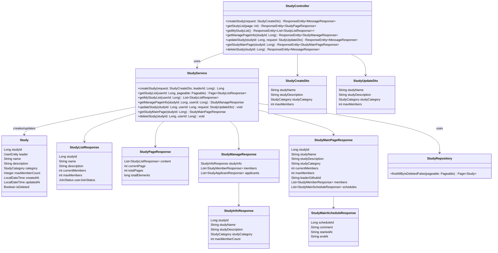
```mermaid
classDiagram
    %% ===========================
    %% Controller
    %% ===========================
    class StudyController {
        +createStudy(request: StudyCreateDto) ResponseEntity~MessageResponse~
        +getStudyList(page: int) ResponseEntity~StudyPageResponse~
        +getMyStudyList() ResponseEntity~List~StudyListResponse~~
        +getManagePageInfo(studyId: Long) ResponseEntity~StudyManageResponse~
        +updateStudy(studyId: Long, request: StudyUpdateDto) ResponseEntity~MessageResponse~
        +getStudyMainPage(studyId: Long) ResponseEntity~StudyMainPageResponse~
        +deleteStudy(studyId: Long) ResponseEntity~MessageResponse~
    }

    %% ===========================
    %% Service
    %% ===========================
    class StudyService {
        +createStudy(request: StudyCreateDto, leaderId: Long) Long
        +getStudyList(userId: Long, pageable: Pageable) Page~StudyListResponse~
        +getMyStudyList(userId: Long) List~StudyListResponse~
        +getManagePageInfo(studyId: Long, userId: Long) StudyManageResponse
        +updateStudy(studyId: Long, userId: Long, request: StudyUpdateDto) void
        +getStudyMainPage(studyId: Long) StudyMainPageResponse
        +deleteStudy(studyId: Long, userId: Long) void
    }

    %% ===========================
    %% Entity
    %% ===========================
    class Study {
        Long studyId
        UserEntity leader
        String name
        String description
        StudyCategory category
        Integer maxMemberCount
        LocalDateTime createdAt
        LocalDateTime updatedAt
        Boolean isDeleted
    }

    %% ===========================
    %% DTOs
    %% ===========================
    class StudyCreateDto {
        String studyName
        String studyDescription
        StudyCategory studyCategory
        int maxMembers
    }

    class StudyListResponse {
        Long studyId
        String name
        String description
        int currentMembers
        int maxMembers
        JoinStatus userJoinStatus
    }

    class StudyPageResponse {
        List~StudyListResponse~ content
        int currentPage
        int totalPages
        long totalElements
    }

    class StudyUpdateDto {
        String studyName
        String studyDescription
        StudyCategory studyCategory
        int maxMembers
    }

    class StudyInfoResponse {
        Long studyId
        String studyName
        String studyDescription
        StudyCategory studyCategory
        int maxMemberCount
    }

    class StudyMainPageResponse {
        Long studyId
        String studyName
        String studyDescription
        String studyCategory
        int currentMembers
        int maxMembers
        String leaderGithubId
        List~StudyMemberResponse~ members
        List~StudyMainScheduleResponse~ schedules
    }

    class StudyMainScheduleResponse {
        Long scheduleId
        String comment
        String startedAt
        String endAt
    }

    class StudyManageResponse {
        StudyInfoResponse studyInfo
        List~StudyMemberResponse~ members
        List~StudyApplicantResponse~ applicants
    }

    %% ===========================
    %% Repository
    %% ===========================
    class StudyRepository {
        +findAllByIsDeletedFalse(pageable: Pageable) Page~Study~
    }

    %% ===========================
    %% Relations
    %% ===========================

    %% Controller → Service
    StudyController --> StudyService : uses

    %% Service → Repository
    StudyService --> StudyRepository : uses

    %% Service → Entity
    StudyService --> Study : creates/updates

    %% Service → DTO outputs
    StudyService --> StudyListResponse
    StudyService --> StudyPageResponse
    StudyService --> StudyManageResponse
    StudyService --> StudyMainPageResponse

    %% Create/Update inputs
    StudyController --> StudyCreateDto
    StudyController --> StudyUpdateDto

    %% Response DTOs
    StudyManageResponse --> StudyInfoResponse
    StudyMainPageResponse --> StudyMainScheduleResponse

```

#### Entity Class
| Class Name        | StudyEntity          |               |            |
| ----------------- | -------------------- | ------------- | ---------- |
| Class Description | 스터디의 기본 정보를 저장하는 엔티티 |               |            |
| 구분                | Name                 | Type          | Visibility |
| Attribute         | studyId              | Long          | Private    |
|                   | leader               | UserEntity    | Private    |
|                   | name                 | String        | Private    |
|                   | description          | String        | Private    |
|                   | category             | StudyCategory | Private    |
|                   | maxMemberCount       | Integer       | Private    |
|                   | createdAt            | LocalDateTime | Private    |
|                   | updatedAt            | LocalDateTime | Private    |
|                   | isDeleted            | Boolean       | Private    |
| Operations        |                      |               |            |

#### Controller Class
| Class Name        | StudyController                                     |                                         |            |
| ----------------- | --------------------------------------------------- | --------------------------------------- | ---------- |
| Class Description | 스터디 생성, 수정, 삭제, 조회 등 스터디 관리 요청을 처리하는 REST 컨트롤러      |                                         |            |
| 구분                | Name                                                | Type                                    | Visibility |
| Attribute         | studyService                                        | StudyService                            | Private    |
| 구분                | Name                                                | Type                                    | Visibility |
| Operations        | createStudy(request: StudyCreateDto)                | ResponseEntity<MessageResponse>         | Public     |
|                   | getStudyList(page: int)                             | ResponseEntity<StudyPageResponse>       | Public     |
|                   | getMyStudyList()                                    | ResponseEntity<List<StudyListResponse>> | Public     |
|                   | getManagePageInfo(studyId: Long)                    | ResponseEntity<StudyManageResponse>     | Public     |
|                   | updateStudy(studyId: Long, request: StudyUpdateDto) | ResponseEntity<MessageResponse>         | Public     |
|                   | getStudyMainPage(studyId: Long)                     | ResponseEntity<StudyMainPageResponse>   | Public     |
|                   | deleteStudy(studyId: Long)                          | ResponseEntity<MessageResponse>         | Public     |

#### Service Class
| Class Name        | StudyService                                                      |                               |            |
| ----------------- | ----------------------------------------------------------------- | ----------------------------- | ---------- |
| Class Description | 스터디 생성, 수정, 삭제, 조회 등 스터디 관리 전반의 비즈니스 로직 수행                        |                               |            |
| 구분                | Name                                                              | Type                          | Visibility |
| Attribute         | studyRepository                                                   | StudyRepository               | Private    |
|                   | studyMemberRepository                                             | StudyMemberRepository         | Private    |
|                   | userRepository                                                    | UserRepository                | Private    |
|                   | studyMemberService                                                | StudyMemberService            | Private    |
|                   | studyScheduleRepository                                           | StudyScheduleRepository       | Private    |
|                   | scheduleParticipateRepository                                     | ScheduleParticipateRepository | Private    |
| 구분                | Name                                                              | Type                          | Visibility |
| Operations        | createStudy(request: StudyCreateDto, leaderId: Long)              | Long                          | Public     |
|                   | getStudyList(userId: Long, pageable: Pageable)                    | Page<StudyListResponse>       | Public     |
|                   | getMyStudyList(userId: Long)                                      | List<StudyListResponse>       | Public     |
|                   | getManagePageInfo(studyId: Long, userId: Long)                    | StudyManageResponse           | Public     |
|                   | updateStudy(studyId: Long, userId: Long, request: StudyUpdateDto) | void                          | Public     |
|                   | getStudyMainPage(studyId: Long)                                   | StudyMainPageResponse         | Public     |
|                   | deleteStudy(studyId: Long, userId: Long)                          | void                          | Public     |

#### Repository Class
| Class Name        | StudyRepository                                                    |             |            |
| ----------------- | ------------------------------------------------------------------ | ----------- | ---------- |
| Class Description | Study 엔티티에 대한 CRUD 및 조회 기능을 제공하는 인터페이스                             |             |            |
| 구분                | Name                                                               | Type        | Visibility |
| Operations        | findAllByIsDeletedFalse(Pageable pageable) 삭제되지 않은 전체 스터디 목록 조회 | Page<Study> | Public     |

#### DTO Class
| Class Name        | StudyCreateDto              |               |            |
| ----------------- | --------------------------- | ------------- | ---------- |
| Class Description | 스터디 생성 요청 시 전달되는 정보를 담는 DTO |               |            |
| 구분                | Name                        | Type          | Visibility |
| Attribute         | studyName 스터디 이름         | String        | Private    |
|                   | studyDescription 스터디 설명  | String        | Private    |
|                   | studyCategory 스터디 카테고리   | StudyCategory | Private    |
|                   | maxMembers 최대 인원         | int           | Private    |

| Class Name        | StudyListResponse            |            |            |
| ----------------- | ---------------------------- | ---------- | ---------- |
| Class Description | 스터디 목록 조회 시 개별 항목으로 사용되는 DTO |            |            |
| 구분                | Name                         | Type       | Visibility |
| Attribute         | studyId                      | Long       | Private    |
|                   | name                         | String     | Private    |
|                   | description                  | String     | Private    |
|                   | currentMembers               | int        | Private    |
|                   | maxMembers                   | int        | Private    |
|                   | userJoinStatus               | JoinStatus | Private    |

| Class Name        | StudyPageResponse         |                         |            |
| ----------------- | ------------------------- | ----------------------- | ---------- |
| Class Description | 페이징된 스터디 목록데이터를 담는 DTO    |                         |            |
| 구분                | Name                      | Type                    | Visibility |
| Attribute         | content 현재 페이지 스터디 리스트 | List<StudyListResponse> | Private    |
|                   | currentPage               | int                     | Private    |
|                   | totalPages                | int                     | Private    |
|                   | totalElements             | long                    | Private    |

| Class Name        | StudyUpdateDto          |               |            |
| ----------------- | ----------------------- | ------------- | ---------- |
| Class Description | 스터디 정보 수정 요청 시 전달되는 DTO |               |            |
| 구분                | Name                    | Type          | Visibility |
| Attribute         | studyName               | String        | Private    |
|                   | studyDescription        | String        | Private    |
|                   | studyCategory           | StudyCategory | Private    |
|                   | maxMembers              | int           | Private    |

| Class Name        | StudyInfoResponse                |               |            |
| ----------------- | -------------------------------- | ------------- | ---------- |
| Class Description | 스터디 관리 페이지에서 스터디 기본 정보를 제공하는 DTO |               |            |
| 구분                | Name                             | Type          | Visibility |
| Attribute         | studyId                          | Long          | Private    |
|                   | studyName                        | String        | Private    |
|                   | studyDescription                 | String        | Private    |
|                   | studyCategory                    | StudyCategory | Private    |
|                   | maxMemberCount                   | int           | Private    |

| Class Name        | StudyMainPageResponse               |                                 |            |
| ----------------- | ----------------------------------- | ------------------------------- | ---------- |
| Class Description | 스터디 메인 페이지 조회 시 필요한 모든 정보를 포함하는 DTO |                                 |            |
| 구분                | Name                                | Type                            | Visibility |
| Attribute         | studyId                             | Long                            | Private    |
|                   | studyName                           | String                          | Private    |
|                   | studyDescription                    | String                          | Private    |
|                   | studyCategory                       | String                          | Private    |
|                   | currentMembers                      | int                             | Private    |
|                   | maxMembers                          | int                             | Private    |
|                   | leaderGithubId                      | String                          | Private    |
|                   | members                             | List<StudyMemberResponse>       | Private    |
|                   | schedules                           | List<StudyMainScheduleResponse> | Private    |

| Class Name        | StudyMainScheduleResponse     |        |            |
| ----------------- | ----------------------------- | ------ | ---------- |
| Class Description | 스터디 메인 페이지에서 일정 조회 시 사용하는 DTO |        |            |
| 구분                | Name                          | Type   | Visibility |
| Attribute         | scheduleId                    | Long   | Private    |
|                   | comment                       | String | Private    |
|                   | startedAt                     | String | Private    |
|                   | endAt                         | String | Private    |

### 스터디 멤버 관리

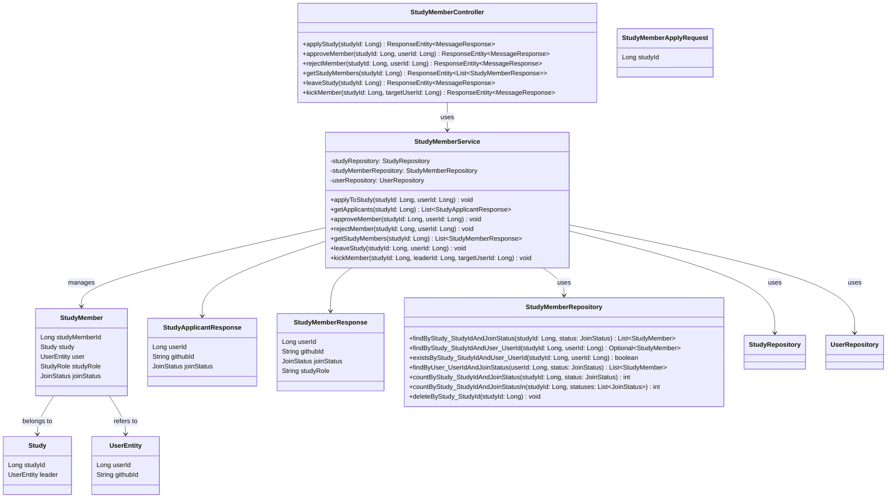
```mermaid
classDiagram

    %% ===========================
    %% Controller
    %% ===========================
    class StudyMemberController {
        +applyStudy(studyId: Long) ResponseEntity~MessageResponse~
        +approveMember(studyId: Long, userId: Long) ResponseEntity~MessageResponse~
        +rejectMember(studyId: Long, userId: Long) ResponseEntity~MessageResponse~
        +getStudyMembers(studyId: Long) ResponseEntity~List~StudyMemberResponse~~
        +leaveStudy(studyId: Long) ResponseEntity~MessageResponse~
        +kickMember(studyId: Long, targetUserId: Long) ResponseEntity~MessageResponse~
    }

    %% ===========================
    %% Service
    %% ===========================
    class StudyMemberService {
        +applyToStudy(studyId: Long, userId: Long) void
        +getApplicants(studyId: Long) List~StudyApplicantResponse~
        +approveMember(studyId: Long, userId: Long) void
        +rejectMember(studyId: Long, userId: Long) void
        +getStudyMembers(studyId: Long) List~StudyMemberResponse~
        +leaveStudy(studyId: Long, userId: Long) void
        +kickMember(studyId: Long, leaderId: Long, targetUserId: Long) void

        -studyRepository: StudyRepository
        -studyMemberRepository: StudyMemberRepository
        -userRepository: UserRepository
    }

    %% ===========================
    %% Entity
    %% ===========================
    class StudyMember {
        Long studyMemberId
        Study study
        UserEntity user
        StudyRole studyRole
        JoinStatus joinStatus
    }

    %% ===========================
    %% DTOs
    %% ===========================

    class StudyApplicantResponse {
        Long userId
        String githubId
        JoinStatus joinStatus
    }

    class StudyMemberResponse {
        Long userId
        String githubId
        JoinStatus joinStatus
        String studyRole
    }

    class StudyMemberApplyRequest {
        Long studyId
    }

    %% ===========================
    %% Repository
    %% ===========================
    class StudyMemberRepository {
        +findByStudy_StudyIdAndJoinStatus(studyId: Long, status: JoinStatus) List~StudyMember~
        +findByStudy_StudyIdAndUser_UserId(studyId: Long, userId: Long) Optional~StudyMember~
        +existsByStudy_StudyIdAndUser_UserId(studyId: Long, userId: Long) boolean
        +findByUser_UserIdAndJoinStatus(userId: Long, status: JoinStatus) List~StudyMember~
        +countByStudy_StudyIdAndJoinStatus(studyId: Long, status: JoinStatus) int
        +countByStudy_StudyIdAndJoinStatusIn(studyId: Long, statuses: List~JoinStatus~) int
        +deleteByStudy_StudyId(studyId: Long) void
    }

    %% 외부 엔티티(관계만 표시)
    class Study {
        Long studyId
        UserEntity leader
    }

    class UserEntity {
        Long userId
        String githubId
    }

    %% ===========================
    %% Relationships
    %% ===========================

    %% Controller → Service
    StudyMemberController --> StudyMemberService : uses

    %% Service → Repository
    StudyMemberService --> StudyMemberRepository : uses
    StudyMemberService --> StudyRepository : uses
    StudyMemberService --> UserRepository : uses

    %% Service → Entity
    StudyMemberService --> StudyMember : manages

    %% DTO outputs
    StudyMemberService --> StudyApplicantResponse
    StudyMemberService --> StudyMemberResponse

    %% Entity relations
    StudyMember --> Study : belongs to
    StudyMember --> UserEntity : refers to


```

#### Entity Class
| Class Name        | StudyMemberEntity               |            |            |
| ----------------- | ------------------------------- | ---------- | ---------- |
| Class Description | 스터디에 참여하는 멤버의 역할 및 상태를 저장하는 엔티티 |            |            |
| 구분                | Name                            | Type       | Visibility |
| Attribute         | studyMemberId                   | Long       | Private    |
|                   | study                           | Study      | Private    |
|                   | user                            | UserEntity | Private    |
|                   | studyRole                       | StudyRole  | Private    |
|                   | joinStatus                      | JoinStatus | Private    |
| Operations        |                                 |            |            |

#### Contoller Class
| Class Name        | StudyMemberController                         |                                           |            |
| ----------------- | --------------------------------------------- | ----------------------------------------- | ---------- |
| Class Description | 스터디 멤버 관련 기능(신청/승인/거절/탈퇴/강퇴)을 처리하는 REST 컨트롤러  |                                           |            |
| 구분                | Name                                          | Type                                      | Visibility |
| Attribute         | studyMemberService                            | StudyMemberService                        | Private    |
| 구분                | Name                                          | Type                                      | Visibility |
| Operations        | applyStudy(studyId: Long)                     | ResponseEntity<MessageResponse>           | Public     |
|                   | approveMember(studyId: Long, userId: Long)    | ResponseEntity<MessageResponse>           | Public     |
|                   | rejectMember(studyId: Long, userId: Long)     | ResponseEntity<MessageResponse>           | Public     |
|                   | getStudyMembers(studyId: Long)                | ResponseEntity<List<StudyMemberResponse>> | Public     |
|                   | leaveStudy(studyId: Long)                     | ResponseEntity<MessageResponse>           | Public     |
|                   | kickMember(studyId: Long, targetUserId: Long) | ResponseEntity<MessageResponse>           | Public     |

#### Service Class
| Class Name        | StudyMemberService                                            |                              |            |
| ----------------- | ------------------------------------------------------------- | ---------------------------- | ---------- |
| Class Description | 스터디 멤버의 신청, 승인, 거절, 탈퇴, 강퇴 등 멤버 관리 로직을 처리                     |                              |            |
| 구분                | Name                                                          | Type                         | Visibility |
| Attribute         | studyRepository                                               | StudyRepository              | Private    |
|                   | studyMemberRepository                                         | StudyMemberRepository        | Private    |
|                   | userRepository                                                | UserRepository               | Private    |
| 구분                | Name                                                          | Type                         | Visibility |
| Operations        | applyToStudy(studyId: Long, userId: Long)                     | void                         | Public     |
|                   | getApplicants(studyId: Long)                                  | List<StudyApplicantResponse> | Public     |
|                   | approveMember(studyId: Long, userId: Long)                    | void                         | Public     |
|                   | rejectMember(studyId: Long, userId: Long)                     | void                         | Public     |
|                   | getStudyMembers(studyId: Long)                                | List<StudyMemberResponse>    | Public     |
|                   | leaveStudy(studyId: Long, userId: Long)                       | void                         | Public     |
|                   | kickMember(studyId: Long, leaderId: Long, targetUserId: Long) | void                         | Public     |

#### Repository Class
| Class Name        | StudyMemberRepository                                                                             |                       |            |
| ----------------- | ------------------------------------------------------------------------------------------------- | --------------------- | ---------- |
| Class Description | 스터디 멤버 정보를 저장·조회·삭제·검증하는 데이터 접근 레이어 인터페이스                                                         |                       |            |
| 구분                | Name                                                                                              | Type                  | Visibility |
| Operations        | countByStudy_StudyIdAndJoinStatus(studyId: Long, status: JoinStatus) 특정 스터디의 승인된 멤버 수 조회       | int                   | Public     |
|                   | findByStudy_StudyIdAndUser_UserId(studyId: Long, userId: Long) 스터디-유저 관계 조회                    | Optional<StudyMember> | Public     |
|                   | existsByStudy_StudyIdAndUser_UserId(studyId: Long, userId: Long) 가입 여부 확인                      | boolean               | Public     |
|                   | findByStudy_StudyIdAndJoinStatus(studyId: Long, joinStatus: JoinStatus) 특정 상태(APPLIED 등) 멤버 조회 | List<StudyMember>     | Public     |
|                   | findByStudy_StudyIdAndJoinStatusNot(studyId: Long, joinStatus: JoinStatus) 특정 상태를 제외한 멤버 조회    | List<StudyMember>     | Public     |
|                   | countByStudy_StudyIdAndJoinStatusIn(studyId: Long, statuses: List<JoinStatus>) 여러 상태 멤버 수 조회   | int                   | Public     |
|                   | findByUser_UserIdAndJoinStatus(userId: Long, joinStatus: JoinStatus) 특정 유저의 참여 스터디 목록 조회       | List<StudyMember>     | Public     |
|                   | deleteByStudy_StudyId(studyId: Long) 특정 스터디 멤버 전체 삭제                                           | void                  | Public     |

#### DTO Class
| Class Name        | StudyApplicantResponse                 |            |            |
| ----------------- | -------------------------------------- | ---------- | ---------- |
| Class Description | 가입 대기중(APPLIED) 멤버의 목록을 조회할 때 응답하는 DTO |            |            |
| 구분                | Name                                   | Type       | Visibility |
| Attribute         | userId                                 | Long       | Private    |
|                   | githubId                               | String     | Private    |
|                   | joinStatus                             | JoinStatus | Private    |

| Class Name        | StudyMemberResponse            |            |            |
| ----------------- | ------------------------------ | ---------- | ---------- |
| Class Description | 스터디의 승인된 멤버 목록을 조회할 때 사용되는 DTO |            |            |
| 구분                | Name                           | Type       | Visibility |
| Attribute         | userId                         | Long       | Private    |
|                   | githubId                       | String     | Private    |
|                   | joinStatus                     | JoinStatus | Private    |
|                   | studyRole                      | String     | Private    |

| Class Name        | StudyMemberApplyRequest    |      |            |
| ----------------- | -------------------------- | ---- | ---------- |
| Class Description | 스터디 참여 신청 시 필요한 정보를 담는 DTO |      |            |
| 구분                | Name                       | Type | Visibility |
| Attribute         | studyId                    | Long | Private    |

#### 스터디 일정 관리

```mermaid
classDiagram

    %% ===========================
    %% Controller
    %% ===========================
    class StudyScheduleController {
        +createSchedule(studyId: Long, request: StudyScheduleCreateRequest) ResponseEntity~MessageResponse~
        +participate(studyId: Long, scheduleId: Long) ResponseEntity~MessageResponse~
        +getSchedules(studyId: Long) ResponseEntity~List~ScheduleListResponse~~
    }

    %% ===========================
    %% Service
    %% ===========================
    class StudyScheduleService {
        +createSchedule(studyId: Long, userId: Long, request: StudyScheduleCreateRequest) Long
        +participate(studyId: Long, scheduleId: Long, userId: Long) void
        +getScheduleList(studyId: Long, userId: Long) List~ScheduleListResponse~

        -studyRepository: StudyRepository
        -studyMemberRepository: StudyMemberRepository
        -studyScheduleRepository: StudyScheduleRepository
        -scheduleParticipantRepository: ScheduleParticipateRepository
    }

    %% ===========================
    %% Entities
    %% ===========================
    class StudySchedule {
        Long scheduleId
        Study study
        String comment
        LocalDateTime startedAt
        LocalDateTime endAt
        LocalDateTime createdAt
        LocalDateTime deletedAt
    }

    class ScheduleParticipate {
        Long participateId
        StudySchedule schedule
        UserEntity user
    }

    %% ===========================
    %% DTOs
    %% ===========================
    class StudyScheduleCreateRequest {
        String comment
        LocalDateTime startedAt
        LocalDateTime endAt
    }

    class ScheduleListResponse {
        Long scheduleId
        String comment
        String startedAt
        String endAt
        int participateCount
        int totalMemberCount
        boolean isParticipated
    }

    %% ===========================
    %% Repository
    %% ===========================
    class StudyScheduleRepository {
        +findByStudy_StudyId(studyId: Long) List~StudySchedule~
        +findAllByStudy_StudyId(studyId: Long) List~StudySchedule~
        +deleteByStudy_StudyId(studyId: Long) void
    }

    class ScheduleParticipateRepository {
        +existsBySchedule_ScheduleIdAndUser_UserId(scheduleId: Long, userId: Long) boolean
        +countBySchedule_ScheduleId(scheduleId: Long) int
        +deleteBySchedule_Study_StudyId(studyId: Long) void
        +deleteBySchedule_ScheduleId(scheduleId: Long) void
    }

    %% 외부 엔티티 (참조만 표시)
    class Study {
        Long studyId
        UserEntity leader
    }

    class UserEntity {
        Long userId
        String githubId
    }

    class StudyMember {
        Long studyMemberId
        Study study
        UserEntity user
        JoinStatus joinStatus
    }

    %% ===========================
    %% Relationships
    %% ===========================
    StudyScheduleController --> StudyScheduleService : uses

    StudyScheduleService --> StudyRepository : uses
    StudyScheduleService --> StudyMemberRepository : uses
    StudyScheduleService --> StudyScheduleRepository : uses
    StudyScheduleService --> ScheduleParticipateRepository : uses

    StudyScheduleService --> StudyScheduleCreateRequest
    StudyScheduleService --> ScheduleListResponse

    StudySchedule --* Study : belongs to
    ScheduleParticipate --* StudySchedule : belongs to
    ScheduleParticipate --> UserEntity : refers to
    StudySchedule --> Study : refers to

```

#### Entity Class
| Class Name        | StudyScheduleEntity      |               |            |
| ----------------- | ------------------------ | ------------- | ---------- |
| Class Description | 특정 스터디에 등록된 일정을 저장하는 엔티티 |               |            |
| 구분                | Name                     | Type          | Visibility |
| Attribute         | scheduleId               | Long          | Private    |
|                   | study                    | Study         | Private    |
|                   | comment                  | String        | Private    |
|                   | startedAt                | LocalDateTime | Private    |
|                   | endAt                    | LocalDateTime | Private    |
|                   | createdAt                | LocalDateTime | Private    |
|                   | deletedAt                | LocalDateTime | Private    |
| Operations        |                          |               |            |

| Class Name        | ScheduleParticipateEntity   |               |            |
| ----------------- | --------------------------- | ------------- | ---------- |
| Class Description | 특정 일정에 참여한 유저의 정보를 저장하는 엔티티 |               |            |
| 구분                | Name                        | Type          | Visibility |
| Attribute         | participateId               | Long          | Private    |
|                   | schedule                    | StudySchedule | Private    |
|                   | user                        | UserEntity    | Private    |
| Operations        |                             |               |            |

#### Controller Class
| Class Name        | StudyScheduleController                                                         |                                            |            |
| ----------------- | ------------------------------------------------------------------------------- | ------------------------------------------ | ---------- |
| Class Description | 스터디 일정 생성, 참여, 조회 등 일정 관련 요청을 처리하는 REST 컨트롤러                                    |                                            |            |
| 구분                | Name                                                                            | Type                                       | Visibility |
| Attribute         | studyScheduleService                                                            | StudyScheduleService                       | Private    |
| 구분                | Name                                                                            | Type                                       | Visibility |
| Operations        | createSchedule(studyId: Long, request: StudyScheduleCreateRequest) 스터디 일정 생성 | ResponseEntity<MessageResponse>            | Public     |
|                   | participate(studyId: Long, scheduleId: Long) 일정 참여 요청 처리                     | ResponseEntity<MessageResponse>            | Public     |
|                   | getSchedules(studyId: Long) 스터디 일정 목록 조회                                     | ResponseEntity<List<ScheduleListResponse>> | Public     |

#### Service Class
| Class Name        | StudyScheduleService                                                                          |                               |            |
| ----------------- | --------------------------------------------------------------------------------------------- | ----------------------------- | ---------- |
| Class Description | 스터디 일정 생성, 참여, 목록 조회 등 스터디 일정 관련 핵심 비즈니스 로직 처리                                                |                               |            |
| 구분                | Name                                                                                          | Type                          | Visibility |
| Attribute         | studyRepository                                                                               | StudyRepository               | Private    |
|                   | studyMemberRepository                                                                         | StudyMemberRepository         | Private    |
|                   | studyScheduleRepository                                                                       | StudyScheduleRepository       | Private    |
|                   | scheduleParticipantRepository                                                                 | ScheduleParticipateRepository | Private    |
| 구분                | Name                                                                                          | Type                          | Visibility |
| Operations        | createSchedule(studyId: Long, userId: Long, request: StudyScheduleCreateRequest) 스터디 일정 생성 | Long                          | Public     |
|                   | participate(studyId: Long, scheduleId: Long, userId: Long) 스터디 일정 참여                       | void                          | Public     |
|                   | getScheduleList(studyId: Long, userId: Long) 스터디 일정 목록 조회                                  | List<ScheduleListResponse>    | Public     |

#### Repository Class
| Class Name        | StudyScheduleRepository                                  |                     |            |
| ----------------- | -------------------------------------------------------- | ------------------- | ---------- |
| Class Description | 스터디 일정 정보를 조회/삭제하는 데이터 접근 인터페이스                          |                     |            |
| 구분                | Name                                                     | Type                | Visibility |
| Operations        | findByStudy_StudyId(Long studyId) 특정 스터디의 전체 일정 조회    | List<StudySchedule> | Public     |
|                   | deleteByStudy_StudyId(Long studyId) 스터디 삭제 시 일정 전체 삭제 | void                | Public     |
|                   | findAllByStudy_StudyId(Long studyId) 전체 일정 조회         | List<StudySchedule> | Public     |

| Class Name        | ScheduleParticipateRepository                                             |         |            |
| ----------------- | ------------------------------------------------------------------------- | ------- | ---------- |
| Class Description | 일정 참여 여부 검증 및 참여자 수 조회/삭제 기능을 제공하는 Repository 인터페이스                       |         |            |
| 구분                | Name                                                                      | Type    | Visibility |
| Operations        | existsBySchedule_ScheduleIdAndUser_UserId(scheduleId, userId) 참여 여부 확인 | boolean | Public     |
|                   | countBySchedule_ScheduleId(scheduleId) 일정 참여자 수 조회                     | int     | Public     |
|                   | deleteBySchedule_Study_StudyId(studyId) 스터디 삭제 시 참여 기록 삭제              | void    | Public     |
|                   | deleteBySchedule_ScheduleId(scheduleId) 일정 삭제 시 참여 기록 삭제               | void    | Public     |

#### Dto Class
| Class Name        | StudyScheduleCreateRequest |               |            |
| ----------------- | -------------------------- | ------------- | ---------- |
| Class Description | 스터디 일정 생성 요청 시 전달되는 요청 DTO |               |            |
| 구분                | Name                       | Type          | Visibility |
| Attribute         | comment                    | String        | Private    |
|                   | startedAt                  | LocalDateTime | Private    |
|                   | endAt                      | LocalDateTime | Private    |

| Class Name        | ScheduleListResponse              |         |            |
| ----------------- | --------------------------------- | ------- | ---------- |
| Class Description | 스터디 일정 목록 조회 시 각 일정 정보를 담는 응답 DTO |         |            |
| 구분                | Name                              | Type    | Visibility |
| Attribute         | scheduleId                        | Long    | Private    |
|                   | comment                           | String  | Private    |
|                   | startedAt                         | String  | Private    |
|                   | endAt                             | String  | Private    |
|                   | participateCount                  | int     | Private    |
|                   | totalMemberCount                  | int     | Private    |
|                   | isParticipated                    | boolean | Private    |

### 게시판

### Entity Class
| Class Name        | UserEntity   |               |            |
| ----------------- | ------------ | ------------- | ---------- |
| Class Description | 시스템 사용자 계정 정보를 관리하는 엔티티 |               |            |
| 구분 | Name | Type | Visibility |
| Attribute | user_id 사용자 고유 ID (PK)| Long | private |
|  | github_id GitHub 인증 식별자 | String | private |
| 구분 | Name | Type | Visibility |
| Operations | findOrCreateUser(githubId) (Controller/Service 헬퍼)<br사용자 조회/자동 생성 | UserEntity | public |

| Class Name        | Post |               |            |
| ----------------- | ------------ | ------------- | ---------- |
| Class Description | 일반 커뮤니티 게시글 데이터를 저장하는 엔티티 |               |            |
| 구분 | Name | Type | Visibility |
| Attribute | post_id 게시글 식별자(PK) | Long | private |
|  | user_id 작성자 식별자(FK) | Long | private |
|  | title 게시글 제목 | String | private |
|  | viewCount 게시글 조회수 | int | private |
| 구분 | Name | Type | Visibility |
| Operations | incrementViewCount() 게시글의 조회수를 1 증가 | void | public |
|  | update(title, content) 게시글 제목/내용 수정 | void | Public |

| Class Name        | Comment |               |            |
| ----------------- | ------------ | ------------- | ---------- |
| Class Description | 게시글에 종속되는 댓글 데이터를 저장하는 엔티티 |               |            |
| 구분 | Name | Type | Visibility |
| Attribute | comment_id 댓글 식별자(PK)| Long | private |
|  | post_id 원본 게시글 식별자(FK) | Long | private |
|  | user_id 작성자 식별자(FK) | Long | private |
|  | content 댓글 내용 | String| private |
| 구분 | Name | Type | Visibility |
| Operations | softDelete() 댓글을 논리적으로 삭제 처리 | void | public |

### Control Class
| Class Name        | PostManagementService |               |            |
| ----------------- | ------------ | ------------- | ---------- |
| Class Description | 게시글의 작성, 수정, 삭제와 관련된 모든 업무 로직을 담당하는 제어 클래스 |       |            |
| 구분 | Name | Type | Visibility |
| Attribute | postRepository 게시글 데이터 접근 객체 | PostRepository | private |
| 구분 | Name | Type | Visibility |
| Operations | createPost(Long userId, PostCreationRequest data) 게시글 작성을 처리 | Post | public |
|  | updatePost(Long userId, Long postId, PostUpdateRequest data) 게시글 수정을 처리 | Post | Public |
|  | deletePost(Long userId, Long postId) 게시글 삭제를 처리 | void | Public |

| Class Name        | PostQueryService |               |            |
| ----------------- | ------------ | ------------- | ---------- |
| Class Description | 게시글의 목록 조회 및 상세 조회와 관련된 모든 읽기 로직을 담당하는 제어 클래스 |       |            |
| 구분 | Name | Type | Visibility |
| Attribute | postRepository 게시글 데이터 접근 객체 | PostRepository | private |
|  | commentRepository 댓글 데이터 접근 객체 | CommentRepository | private |
|  | userRepository 사용자 데이터 접근 객체 | UserRepository | private |
| 구분 | Name | Type | Visibility |
| Operations | getPostList(int page, int size) 게시글 목록 조회를 처리 | Page<PostResponse> | public |
|  | getPostDetail(Long postId) 게시글 상세 조회를 처리 | PostDetailResponse | Public |

| Class Name        | CommentManagementService |               |            |
| ----------------- | ------------ | ------------- | ---------- |
| Class Description | 댓글의 작성, 삭제와 관련된 모든 로직을 담당하는 제어 클래스 |       |            |
| 구분 | Name | Type | Visibility |
| Attribute | commentRepository 댓글 데이터 접근 객체 | CommentRepository | private |
| 구분 | Name | Type | Visibility |
| Operations | createComment(Long postId, Long userId, CommentCreationRequest request) 댓글 작성을 처리 | Comment | public |
|  | updateComment(User user, Long commentId, String content) 댓글 수정을 처리 | Comment | Public |
|  | deleteComment(Long userId, Long commentId) 댓글 삭제를 처리 | Void | Public |

### Boundary Class
| Class Name        | PostController |               |            |
| ----------------- | ------------ | ------------- | ---------- |
| Class Description | 게시글 관련 REST API 요청을 처리하는 경계 클래스 (API Layer) |       |            |
| 구분 | Name | Type | Visibility |
| Attribute | postQueryService 목록 조회/상세조회 로직을 호출할 제어 객체 | PostQueryService | private |
| Attribute | postManagementService 게시글 작성/수정/삭제 로직을 호출할 제어 객체 | PostManagementService | private |
| Attribute | userRepository 사용자를 조회하거나 생성하는 데이터 접근 객체 | userRepository | private |
| 구분 | Name | Type | Visibility |
| Operations | getPosts(page, size) 게시글 목록 조회 | ResponseEntity<PostPageResponse> | public |
|  | getPostDetail(postId) 게시글 상세 조회 | ResponseEntity<PostDetailResponse> | Public |
|  | createPost(githubId, request) 게시글 작성 | ResponseEntity<PostResponse> | Public |
|  | updatePost(postId, githubId, request) 게시글 수정 | ResponseEntity<PostResponse> | Public |
|  | deletePost(postId, githubId) 게시글 삭제 | ResponseEntity<Void> | Public |

| Class Name        | CommentController |               |            |
| ----------------- | ------------ | ------------- | ---------- |
| Class Description | 댓글 관련 REST API 요청을 처리하는 경계 클래스 (API Layer) |       |            |
| 구분 | Name | Type | Visibility |
| Attribute | commentManagementService 댓글 작성/삭제 로직을 호출할 제어 객체 | CommentManagementService | private |
| Attribute | userRepository 사용자를 조회하거나 생성하는 데이터 접근 객체 | userRepository | private |
| 구분 | Name | Type | Visibility |
| Operations | createComment(postId, githubId, request) 댓글 작성 | ResponseEntity<CommentResponse> | public |
|  | deleteComment(postId, commentId, githubId) 댓글 삭제 | ResponseEntity<Void> | Public |

### DTO Class
| Class Name        | PostCreationRequest |               |            |
| ----------------- | ------------ | ------------- | ---------- |
| Class Description | 게시글 작성 요청 시 클라이언트로부터 받는 데이터를 담는 DTO (Controller -> Service 입력) |       |      |
| 구분 | Name | Type | Visibility |
| Attribute | title | String | public |
| Attribute | content | String | public |
| 구분 | Name | Type | Visibility |
| Operations | 없음 | - | - |

| Class Name        | PostUpdateRequest |               |            |
| ----------------- | ------------ | ------------- | ---------- |
| Class Description | 게시글 수정 요청 시 클라이언트로부터 받는 데이터를 담는 DTO (Controller -> Service 입력) |       |      |
| 구분 | Name | Type | Visibility |
| Attribute | title | String | public |
| Attribute | content | String | public |
| 구분 | Name | Type | Visibility |
| Operations | 없음 | - | - |

| Class Name        | PostResponse |               |            |
| ----------------- | ------------ | ------------- | ---------- |
| Class Description | 게시글 목록 및 생성/수정 결과 응답 시 사용되는 DTO |       |      |
| 구분 | Name | Type | Visibility |
| Attribute | postId | Long | public |
| Attribute | title | String | public |
| Attribute | userId | Long | public |
| Attribute | authorGithubId | String | public |
| Attribute | viewCount | int | public |
| Attribute | commentCount | int | public |
| Attribute | content | String | public |
| Attribute | createdAt | LocalDateTime | public |
| Attribute | updatedAt | LocalDateTime | public |
| 구분 | Name | Type | Visibility |
| Operations | from(Post post, String githubId, int commentCount) | PostResponse | public static |
|  | from(Post post)) | PostResponse | public static |

| Class Name        | PostPageResponse |               |            |
| ----------------- | ------------ | ------------- | ---------- |
| Class Description | 게시글 목록 조회 시 페이징 정보를 포함하여 응답하는 DTO |       |      |
| 구분 | Name | Type | Visibility |
| Attribute | posts | List<PostResponse> | public |
| Attribute | currentPage | int | public |
| Attribute | totalPages | int | public |
| Attribute | totalElements | long | public |
| Attribute | hasNext | boolean | public |
| Attribute | hasPrevious | boolean | public |
| 구분 | Name | Type | Visibility |
| Operations | from(Page<PostResponse> postPage) | PostPageResponse | public static |

| Class Name        | PostDetailResponse |               |            |
| ----------------- | ------------ | ------------- | ---------- |
| Class Description | 게시글 상세 조회 시 게시글 정보와 댓글 목록을 포함하여 응답하는 DTO |       |      |
| 구분 | Name | Type | Visibility |
| Attribute | (PostResponse 속성 포함) | (PostResponse Type) | public |
| Attribute | comments | List<CommentResponse> | public |
| 구분 | Name | Type | Visibility |
| Operations | from(Post post, String authorGithubId, List<CommentResponse> commentResponses) | PostDetailResponse | public static |

| Class Name        | CommentCreationRequest |               |            |
| ----------------- | ------------ | ------------- | ---------- |
| Class Description | 댓글 작성 요청 시 클라이언트로부터 받는 데이터를 담는 DTO |       |      |
| 구분 | Name | Type | Visibility |
| Attribute | content | String | public |
| 구분 | Name | Type | Visibility |
| Operations | 없음 | - | - |

| Class Name        | CommentResponse |               |            |
| ----------------- | ------------ | ------------- | ---------- |
| Class Description | 댓글 조회 및 작성 결과 응답 시 사용되는 DTO |       |      |
| 구분 | Name | Type | Visibility |
| Attribute | commentId | Long | public |
| Attribute | postId | Long | public |
| Attribute | content | String | public |
| Attribute | userId | Long | public |
| Attribute | authorGithubId | String | public |
| Attribute | createdAt | LocalDateTime | public |
| 구분 | Name | Type | Visibility |
| Operations | from(Comment comment, String githubId) | CommentResponse | public static |

### Repository Class
| Class Name        | PostRepository |               |            |
| ----------------- | ------------ | ------------- | ---------- |
| Class Description | Post 엔티티의 데이터베이스 접근을 담당하는 JPA Repository 인터페이스 |       |      |
| 구분 | Name | Type | Visibility |
| Attribute | 없음 | - | - |
| 구분 | Name | Type | Visibility |
| Operations | findById(Long id) | Optional<Post> | public |
| Operations | findAll(Pageable pageable) | Page<Post> | public |
| Operations | save(Post post) | Post | public |

| Class Name        | CommentRepository |               |            |
| ----------------- | ------------ | ------------- | ---------- |
| Class Description | Comment 엔티티의 데이터베이스 접근을 담당하는 JPA Repository 인터페이스 |       |      |
| 구분 | Name | Type | Visibility |
| Attribute | 없음 | - | - |
| 구분 | Name | Type | Visibility |
| Operations | findById(Long id) | Optional<Comment> | public |
| Operations | findByPostId(Long postId) | List<Comment> | public |
| Operations | countCommentsByPostIds(List<Long> postIds) | List<Object[]> | public |
| Operations | save(Comment comment) | Comment | public |

| Class Name        | UserRepository |               |            |
| ----------------- | ------------ | ------------- | ---------- |
| Class Description | UserEntity의 데이터베이스 접근을 담당하며, 사용자 인증/정보 조회에 사용되는 JPA Repository 인터페이스 |       |      |
| 구분 | Name | Type | Visibility |
| Attribute | 없음 | - | - |
| 구분 | Name | Type | Visibility |
| Operations | findByGithubId(String githubId) | Optional<UserEntity> | public |
| Operations | findAllByUserIdIn(List<Long> userIds) | List<UserEntity> | public |
| Operations | save(UserEntity user) | UserEntity | public |

### 오픈소스 이슈 관리
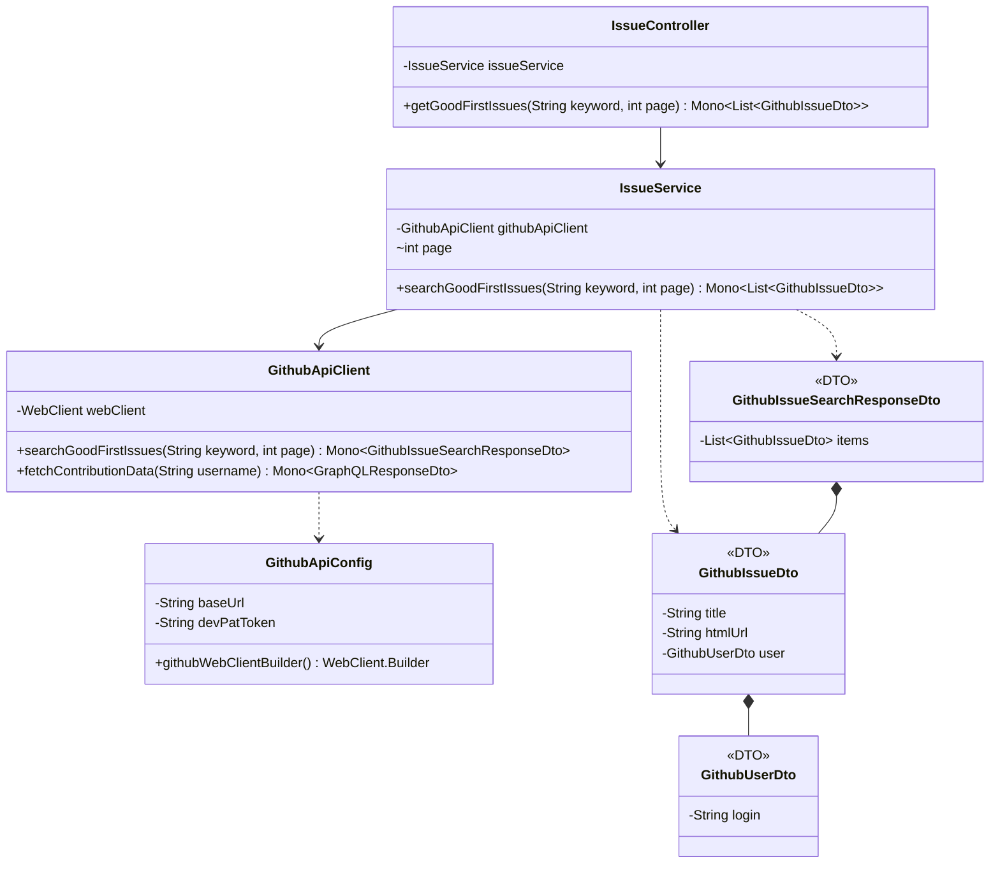
```mermaid
classDiagram
    direction TB
    class IssueController {
        -IssueService issueService
        +getGoodFirstIssues(String keyword, int page) Mono~List~GithubIssueDto~~
    }

    class GithubApiClient {
        -WebClient webClient
        +searchGoodFirstIssues(String keyword, int page) Mono~GithubIssueSearchResponseDto~
        +fetchContributionData(String username) Mono~GraphQLResponseDto~
    }

    class GithubApiConfig {
        -String baseUrl
        -String devPatToken
        +githubWebClientBuilder() WebClient.Builder
    }

    class IssueService {
        -GithubApiClient githubApiClient
        ~int page
        +searchGoodFirstIssues(String keyword, int page) Mono~List~GithubIssueDto~~
    }

    class GithubIssueSearchResponseDto {
        <<DTO>>
        -List~GithubIssueDto~ items
    }

    class GithubIssueDto {
        <<DTO>>
        -String title
        -String htmlUrl
        -GithubUserDto user
    }

    class GithubUserDto {
        <<DTO>>
        -String login
    }

    IssueController --> IssueService

    IssueService --> GithubApiClient

    GithubApiClient ..> GithubApiConfig

    IssueService ..> GithubIssueSearchResponseDto
    IssueService ..> GithubIssueDto

    GithubIssueSearchResponseDto *-- GithubIssueDto
    GithubIssueDto *-- GithubUserDto
```
#### Entity Class
| Class Name | GithubIssueSearchResponseDto |   |   |
|---|---|---|---|
| Class Description | GitHub 검색 API의 응답 전체를 매핑하는 DTO |   |   |
| 구분 | Name | Type | Visibility |
| Attribute | totalCount | Integer | Private |
|  | incompleteResults | Boolean | Private |
|  | items | List<GithubIssueDto> | Private |
| 구분 | Name | Type | Visibility |
| Operations | 없음 |  |  |

| Class Name | GithubIssueDto |   |   |
|---|---|---|---|
| Class Description | GitHub의 개별 이슈 정보를 표현하는 DTO |   |   |
| 구분 | Name | Type | Visibility |
| Attribute | id | String | Private |
|  | title | String | Private |
|  | state | String | Private |
|  | htmlUrl | String | Private |
|  | comments | Integer | Private |
|  | createdAt | Instant | Private |
|  | updatedAt | Instant | Private |
|  | user | GithubUserDto | Private |
|  | labels | Set<IssueLabel> | Private |
| 구분 | Name | Type | Visibility |
| Operations | 없음 |  |  |

| Class Name | GithubUserDto |   |   |
|---|---|---|---|
| Class Description | GitHub 이슈 작성자의 정보를 담는 DTO |   |   |
| 구분 | Name | Type | Visibility |
| Attribute | id | String | Private |
|  | login | String | Private |
|  | avatarUrl | String | Private |
| 구분 | Name | Type | Visibility |
| Operations | 없음 |  |  |

#### Boundary Class
| Class Name | IssueController |   |   |
|---|---|---|---|
| Class Description | 이슈 검색 요청을 처리하는 API 엔드포인트 |   |   |
| 구분 | Name | Type | Visibility |
| Attribute | issueService | IssueService | Private |
| 구분 | Name | Type | Visibility |
| Operations | searchIssues() | ResponseEntity | Public |

| Class Name | GithubApiClient |   |   |
|---|---|---|---|
| Class Description | GitHub REST API 호출(WebClient) 담당 |   |   |
| 구분 | Name | Type | Visibility |
| Attribute | webClient | WebClient | Private |
| 구분 | Name | Type | Visibility |
| Operations | searchGoodFirstIssues() | GithubIssueSearchResponseDto | Public |

| Class Name | GithubApiConfig |   |   |
|---|---|---|---|
| Class Description | GitHub API URL 및 인증 설정 |   |   |
| 구분 | Name | Type | Visibility |
| Attribute | baseUrl | String | Private |
|  | token | String | Private |
| 구분 | Name | Type | Visibility |
| Operations | webClient() | WebClient | Public |

#### Control Class
| Class Name | IssueService |   |   |
|---|---|---|---|
| Class Description | Good First Issue 검색 비즈니스 로직 |   |   |
| 구분 | Name | Type | Visibility |
| Attribute | githubApiClient | GithubApiClient | Private |
| 구분 | Name | Type | Visibility |
| Operations | search() | List<GithubIssueDto> | Public |

### 도전과제
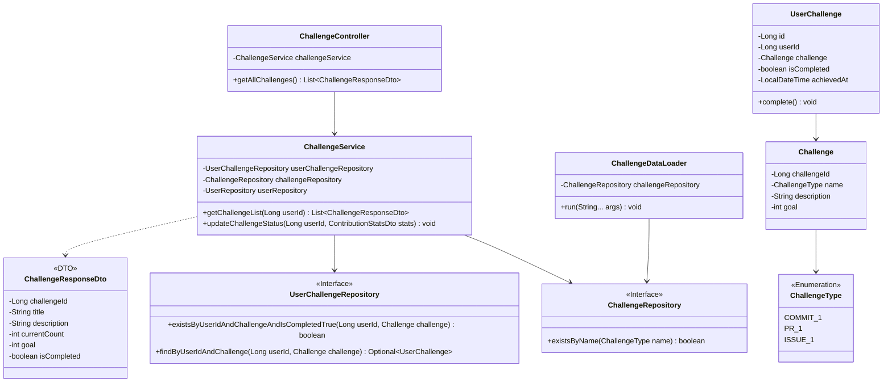
```mermaid
classDiagram
    direction TB
    class ChallengeController {
        -ChallengeService challengeService
        +getAllChallenges() List~ChallengeResponseDto~
    }
    class ChallengeService {
        -UserChallengeRepository userChallengeRepository
        -ChallengeRepository challengeRepository
        -UserRepository userRepository
        +getChallengeList(Long userId) List~ChallengeResponseDto~
        +updateChallengeStatus(Long userId, ContributionStatsDto stats) void
    }
    class ChallengeRepository {
        <<Interface>>
        +existsByName(ChallengeType name) boolean
    }
    class UserChallengeRepository {
        <<Interface>>
        +existsByUserIdAndChallengeAndIsCompletedTrue(Long userId, Challenge challenge) boolean
        +findByUserIdAndChallenge(Long userId, Challenge challenge) Optional~UserChallenge~
    }
    class ChallengeDataLoader {
        -ChallengeRepository challengeRepository
        +run(String... args) void
    }
    class Challenge {
        -Long challengeId
        -ChallengeType name
        -String description
        -int goal
    }
    class UserChallenge {
        -Long id
        -Long userId
        -Challenge challenge
        -boolean isCompleted
        -LocalDateTime achievedAt
        +complete() void
    }
    class ChallengeResponseDto {
        <<DTO>>
        -Long challengeId
        -String title
        -String description
        -int currentCount
        -int goal
        -boolean isCompleted
    }
    class ChallengeType {
        <<Enumeration>>
        COMMIT_1
        PR_1
        ISSUE_1
    }

    ChallengeController --> ChallengeService
    ChallengeService --> ChallengeRepository
    ChallengeService --> UserChallengeRepository
    ChallengeDataLoader --> ChallengeRepository
    
    UserChallenge --> Challenge
    Challenge --> ChallengeType
    ChallengeService ..> ChallengeResponseDto
```

#### Entity Class
| Class Name | Challenge |   |   |
|---|---|---|---|
| Class Description | 도전과제의 메타데이터를 관리하는 엔티티 |   |   |
| 구분 | Name | Type | Visibility |
| Attribute | id | Long | Private |
|  | title | String | Private |
|  | description | String | Private |
|  | targetCount | Integer | Private |
|  | type | ChallengeType | Private |
| 구분 | Name | Type | Visibility |
| Operations | isCompletedBy(int count) | boolean | Public |

| Class Name | UserChallenge |   |   |
|---|---|---|---|
| Class Description | 사용자별 도전과제 달성 상태를 관리하는 엔티티 |   |   |
| 구분 | Name | Type | Visibility |
| Attribute | id | Long | Private |
|  | userId | Long | Private |
|  | challengeId | Long | Private |
|  | progressCount | Integer | Private |
|  | completed | Boolean | Private |
| 구분 | Name | Type | Visibility |
| Operations | increaseProgress() | void | Public |
|  | complete() | void | Public |

| Class Name | ChallengeType(Enum) |   |   |
|---|---|---|---|
| Class Description | 도전과제 종류 Enum |   |   |
| 구분 | Name | Type | Visibility |
| Attribute | FIRST_COMMIT | Enum | Public |
|  | TEN_COMMITS | Enum | Public |
|  | FIRST_PR | Enum | Public |
| 구분 | Name | Type | Visibility |
| Operations | 없음 |  |  |

| Class Name | ChallengeResponseDto |   |   |
|---|---|---|---|
| Class Description | 도전과제 진행 상황을 반환하는 DTO |   |   |
| 구분 | Name | Type | Visibility |
| Attribute | challengeId | Long | Private |
|  | title | String | Private |
|  | progress | Integer | Private |
|  | target | Integer | Private |
|  | completed | Boolean | Private |
| 구분 | Name | Type | Visibility |
| Operations | 없음 |  |  |

#### Boundary Class
| Class Name | ChallengeController |   |   |
|---|---|---|---|
| Class Description | 도전과제 조회 API 엔드포인트 |   |   |
| 구분 | Name | Type | Visibility |
| Attribute | challengeService | ChallengeService | Private |
| 구분 | Name | Type | Visibility |
| Operations | getMyChallenges() | ResponseEntity | Public |

| Class Name | ChallengeDataLoader |   |   |
|---|---|---|---|
| Class Description | 서버 시작 시 도전과제 데이터를 초기 적재 |   |   |
| 구분 | Name | Type | Visibility |
| Attribute | challengeRepository | ChallengeRepository | Private |
| 구분 | Name | Type | Visibility |
| Operations | run() | void | Public |

| Class Name | ChallengeRepository |   |   |
|---|---|---|---|
| Class Description | 도전과제 메타데이터 DB 접근 |   |   |
| 구분 | Name | Type | Visibility |
| Attribute | 없음 |  |  |
| 구분 | Name | Type | Visibility |
| Operations | findAll() | List<Challenge> | Public |
|  | save() | Challenge | Public |

| Class Name | UserChallengeRepository |   |   |
|---|---|---|---|
| Class Description | 사용자 도전과제 현황 DB 접근 |   |   |
| 구분 | Name | Type | Visibility |
| Attribute | 없음 |  |  |
| 구분 | Name | Type | Visibility |
| Operations | findByUserId() | List<UserChallenge> | Public |
|  | save() | UserChallenge | Public |

#### Control Class
| Class Name | ChallengeService |   |   |
|---|---|---|---|
| Class Description | 도전과제 진행 및 완료 처리 로직 |   |   |
| 구분 | Name | Type | Visibility |
| Attribute | challengeRepository | ChallengeRepository | Private |
|  | userChallengeRepository | UserChallengeRepository | Private |
| 구분 | Name | Type | Visibility |
| Operations | checkCondition() | boolean | Public |
|  | complete() | void | Public |
|  | getAllChallenges() | List<ChallengeResponseDto> | Public |

### 기여도
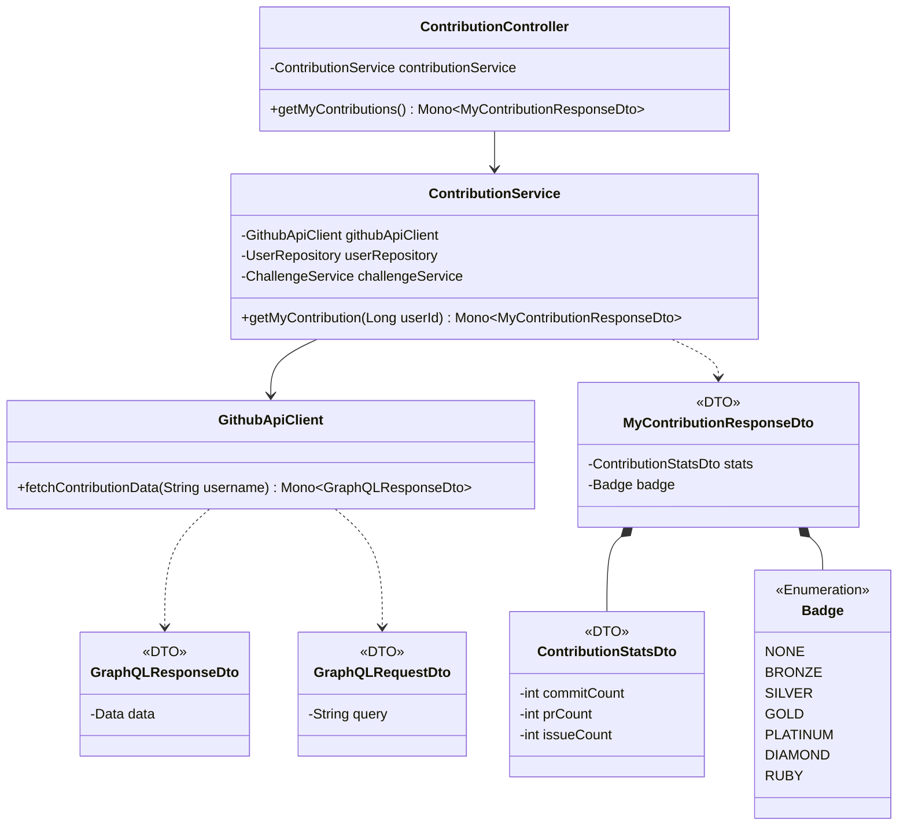
```mermaid
classDiagram
    direction TB
    class ContributionController {
        -ContributionService contributionService
        +getMyContributions() Mono~MyContributionResponseDto~
    }
    class ContributionService {
        -GithubApiClient githubApiClient
        -UserRepository userRepository
        -ChallengeService challengeService
        +getMyContribution(Long userId) Mono~MyContributionResponseDto~
    }
    class GithubApiClient {
        +fetchContributionData(String username) Mono~GraphQLResponseDto~
    }
    class MyContributionResponseDto {
        <<DTO>>
        -ContributionStatsDto stats
        -Badge badge
    }
    class ContributionStatsDto {
        <<DTO>>
        -int commitCount
        -int prCount
        -int issueCount
    }
    class GraphQLResponseDto {
        <<DTO>>
        -Data data
    }
    class GraphQLRequestDto {
        <<DTO>>
        -String query
    }
    class Badge {
        <<Enumeration>>
        NONE
        BRONZE
        SILVER
        GOLD
        PLATINUM
        DIAMOND
        RUBY
    }

    ContributionController --> ContributionService
    ContributionService --> GithubApiClient
    
    ContributionService ..> MyContributionResponseDto
    MyContributionResponseDto *-- ContributionStatsDto
    MyContributionResponseDto *-- Badge
    
    GithubApiClient ..> GraphQLResponseDto
    GithubApiClient ..> GraphQLRequestDto
```

#### Entity Class
| Class Name | Badge(Enum) |   |   |
|---|---|---|---|
| Class Description | 기여도 점수 기반 뱃지 Enum |   |   |
| 구분 | Name | Type | Visibility |
| Attribute | NONE | Enum | Public |
|  | BRONZE | Enum | Public |
|  | SILVER | Enum | Public |
|  | GOLD | Enum | Public |
|  | PLATINUM | Enum | Public |
| 구분 | Name | Type | Visibility |
| Operations | 없음 |  |  |

| Class Name | MyContributionResponseDto |   |   |
|---|---|---|---|
| Class Description | 기여도 산정 결과 응답 DTO |   |   |
| 구분 | Name | Type | Visibility |
| Attribute | badge | Badge | Private |
|  | score | Integer | Private |
|  | stats | ContributionStatsDto | Private |
| 구분 | Name | Type | Visibility |
| Operations | 없음 |  |  |

| Class Name | ContributionStatsDto |   |   |
|---|---|---|---|
| Class Description | 활동별 통계 정보 DTO |   |   |
| 구분 | Name | Type | Visibility |
| Attribute | commitCount | Integer | Private |
|  | pullRequestCount | Integer | Private |
|  | issueCount | Integer | Private |
| 구분 | Name | Type | Visibility |
| Operations | 없음 |  |  |

| Class Name | GraphQLResponseDto |   |   |
|---|---|---|---|
| Class Description | GitHub GraphQL 응답 DTO |   |   |
| 구분 | Name | Type | Visibility |
| Attribute | data | Object | Private |
| 구분 | Name | Type | Visibility |
| Operations | 없음 |  |  |

| Class Name | GraphQLRequestDto |   |   |
|---|---|---|---|
| Class Description | GitHub GraphQL 요청 DTO |   |   |
| 구분 | Name | Type | Visibility |
| Attribute | query | String | Private |
|  | variables | Map<String, Object> | Private |
| 구분 | Name | Type | Visibility |
| Operations | 없음 |  |  |

#### Boundary Class
| Class Name | ContributionController |   |   |
|---|---|---|---|
| Class Description | 기여도 조회 API |   |   |
| 구분 | Name | Type | Visibility |
| Attribute | contributionService | ContributionService | Private |
| 구분 | Name | Type | Visibility |
| Operations | getMyContribution() | ResponseEntity | Public |

#### Control Class
| Class Name | ContributionService |   |   |
|---|---|---|---|
| Class Description | 활동 집계, 점수 계산, 뱃지 산정, 도전과제 동기화 로직 |   |   |
| 구분 | Name | Type | Visibility |
| Attribute | githubApiClient | GithubApiClient | Private |
|  | challengeService | ChallengeService | Private |
| 구분 | Name | Type | Visibility |
| Operations | calculateContribution() | MyContributionResponseDto | Public |
|  | computeBadge() | Badge | Public |
|  | updateChallenges() | void | Public |

### To-do 리스트
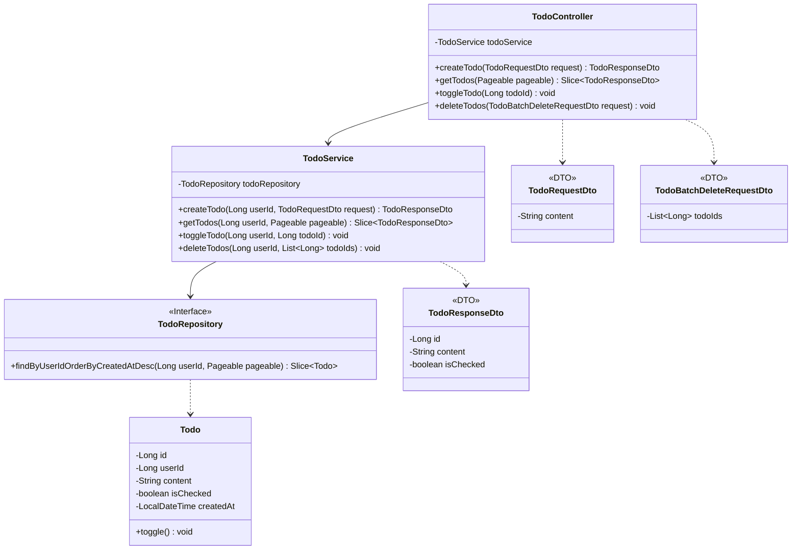
```mermaid
classDiagram
    direction TB
    class TodoController {
        -TodoService todoService
        +createTodo(TodoRequestDto request) TodoResponseDto
        +getTodos(Pageable pageable) Slice~TodoResponseDto~
        +toggleTodo(Long todoId) void
        +deleteTodos(TodoBatchDeleteRequestDto request) void
    }
    class TodoService {
        -TodoRepository todoRepository
        +createTodo(Long userId, TodoRequestDto request) TodoResponseDto
        +getTodos(Long userId, Pageable pageable) Slice~TodoResponseDto~
        +toggleTodo(Long userId, Long todoId) void
        +deleteTodos(Long userId, List~Long~ todoIds) void
    }
    class TodoRepository {
        <<Interface>>
        +findByUserIdOrderByCreatedAtDesc(Long userId, Pageable pageable) Slice~Todo~
    }
    class Todo {
        -Long id
        -Long userId
        -String content
        -boolean isChecked
        -LocalDateTime createdAt
        +toggle() void
    }
    class TodoRequestDto {
        <<DTO>>
        -String content
    }
    class TodoResponseDto {
        <<DTO>>
        -Long id
        -String content
        -boolean isChecked
    }
    class TodoBatchDeleteRequestDto {
        <<DTO>>
        -List~Long~ todoIds
    }

    TodoController --> TodoService
    TodoService --> TodoRepository
    TodoRepository ..> Todo
    
    TodoController ..> TodoRequestDto
    TodoController ..> TodoBatchDeleteRequestDto
    TodoService ..> TodoResponseDto
```
#### Entity Class
| Class Name | Todo |   |   |
|---|---|---|---|
| Class Description | 사용자 Todo 엔티티 |   |   |
| 구분 | Name | Type | Visibility |
| Attribute | id | Long | Private |
|  | userId | Long | Private |
|  | title | String | Private |
|  | description | String | Private |
|  | completed | Boolean | Private |
|  | createdAt | Instant | Private |
| 구분 | Name | Type | Visibility |
| Operations | toggle() | void | Public |

| Class Name | TodoRequestDto |   |   |
|---|---|---|---|
| Class Description | Todo 생성 DTO |   |   |
| 구분 | Name | Type | Visibility |
| Attribute | title | String | Private |
|  | description | String | Private |
| 구분 | Name | Type | Visibility |
| Operations | 없음 |  |  |

| Class Name | TodoResponseDto |   |   |
|---|---|---|---|
| Class Description | Todo 조회 DTO |   |   |
| 구분 | Name | Type | Visibility |
| Attribute | id | Long | Private |
|  | title | String | Private |
|  | description | String | Private |
|  | completed | Boolean | Private |
| 구분 | Name | Type | Visibility |
| Operations | 없음 |  |  |

| Class Name | TodoBatchDeleteRequestDto |   |   |
|---|---|---|---|
| Class Description | Todo ID 배열을 통한 일괄 삭제 요청 DTO |   |   |
| 구분 | Name | Type | Visibility |
| Attribute | ids | List<Long> | Private |
| 구분 | Name | Type | Visibility |
| Operations | 없음 |  |  |

#### Boundary Class
| Class Name | TodoController |   |   |
|---|---|---|---|
| Class Description | Todo CRUD 기능을 제공하는 API 엔드포인트 |   |   |
| 구분 | Name | Type | Visibility |
| Attribute | todoService | TodoService | Private |
| 구분 | Name | Type | Visibility |
| Operations | create() | ResponseEntity | Public |
|  | getTodos() | ResponseEntity | Public |
|  | update() | ResponseEntity | Public |
|  | delete() | ResponseEntity | Public |

| Class Name | TodoRepository |   |   |
|---|---|---|---|
| Class Description | Todo 엔티티 DB 접근 레이어 |   |   |
| 구분 | Name | Type | Visibility |
| Attribute | 없음 |  |  |
| 구분 | Name | Type | Visibility |
| Operations | save() | Todo | Public |
|  | findByUserId() | List<Todo> | Public |
|  | deleteById() | void | Public |

#### Control Class
| Class Name | TodoService |   |   |
|---|---|---|---|
| Class Description | Todo 비즈니스 로직(소유자 검증·토글·CRUD) |   |   |
| 구분 | Name | Type | Visibility |
| Attribute | todoRepository | TodoRepository | Private |
| 구분 | Name | Type | Visibility |
| Operations | create() | Todo | Public |
|  | update() | Todo | Public |
|  | delete() | void | Public |
|  | toggle() | Todo | Public |

---
## 4. Sequence diagram
## 유저
### 1. GitHub OAuth 회원가입

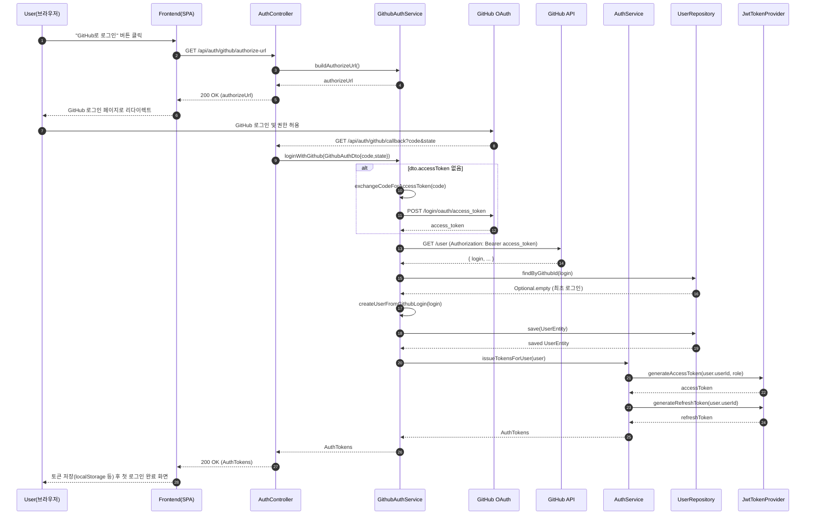
```mermaid
sequenceDiagram
    autonumber
    participant U as User(브라우저)
    participant FE as Frontend(SPA)
    participant AC as AuthController
    participant GAS as GithubAuthService
    participant GH as GitHub OAuth
    participant GAPI as GitHub API
    participant AS as AuthService
    participant UR as UserRepository
    participant JTP as JwtTokenProvider

    U->>FE: "GitHub로 로그인" 버튼 클릭
    FE->>AC: GET /api/auth/github/authorize-url
    AC->>GAS: buildAuthorizeUrl()
    GAS-->>AC: authorizeUrl
    AC-->>FE: 200 OK (authorizeUrl)
    FE-->>U: GitHub 로그인 페이지로 리다이렉트

    U->>GH: GitHub 로그인 및 권한 허용
    GH-->>AC: GET /api/auth/github/callback?code&state
    AC->>GAS: loginWithGithub(GithubAuthDto{code,state})

    alt dto.accessToken 없음
        GAS->>GAS: exchangeCodeForAccessToken(code)
        GAS->>GH: POST /login/oauth/access_token
        GH-->>GAS: access_token
    end

    GAS->>GAPI: GET /user (Authorization: Bearer access_token)
    GAPI-->>GAS: { login, ... }

    GAS->>UR: findByGithubId(login)
    UR-->>GAS: Optional.empty (최초 로그인)

    GAS->>GAS: createUserFromGithubLogin(login)
    GAS->>UR: save(UserEntity)
    UR-->>GAS: saved UserEntity

    GAS->>AS: issueTokensForUser(user)
    AS->>JTP: generateAccessToken(user.userId, role)
    JTP-->>AS: accessToken
    AS->>JTP: generateRefreshToken(user.userId)
    JTP-->>AS: refreshToken
    AS-->>GAS: AuthTokens
    GAS-->>AC: AuthTokens
    AC-->>FE: 200 OK (AuthTokens)
    FE-->>U: 토큰 저장(localStorage 등) 후 첫 로그인 완료 화면


```

사용자가 웹 서비스에서 “GitHub로 로그인” 버튼을 클릭하면, 프론트엔드는 먼저 백엔드의 GET /api/auth/github/authorize-url 엔드포인트를 호출해 GitHub 인증 페이지로 이동할 수 있는 authorize URL을 요청한다. AuthController는 내부적으로 GithubAuthService.buildAuthorizeUrl()을 호출하여 GitHub OAuth 인증 URL을 생성해 프론트엔드에 전달한다. 프론트엔드는 해당 URL로 리다이렉트시켜 사용자를 GitHub 로그인 화면으로 보내고, 사용자는 GitHub 계정으로 로그인 및 권한 허용을 진행한다.

GitHub 로그인에 성공하면 GitHub는 등록된 redirect URI로 code와 state를 포함하여 백엔드로 콜백 요청을 보낸다. 이때 AuthController.githubCallback()이 호출되며, 컨트롤러는 전달받은 code/state 값을 GithubAuthDto에 담아 GithubAuthService.loginWithGithub()에 넘긴다.

GithubAuthService는 우선 DTO에 accessToken이 없는 경우 GitHub 토큰 발급 엔드포인트(https://github.com/login/oauth/access_token)에 client_id, client_secret, code, redirect_uri를 담아 POST 요청을 보내 액세스토큰을 받아온다. 이어서 이 액세스 토큰을 이용하여 GitHub API의 /user 엔드포인트를 호출해 사용자의 GitHub 프로필 정보를 조회하고, 이 중 login 값을 가져와 서비스에서 사용하는 github_id로 활용한다.

그 다음 UserRepository.findByGithubId()를 호출하여 해당 github_id가 이미 존재하는지 조회한다. 최초 로그인이라면 해당 값이 없기 때문에, GithubAuthService는 createUserFromGithubLogin()을 호출하여 새로운 UserEntity를 생성한다. 이때 관리자 여부는 기본적으로 false이며, commit/issue/pr 통계는 모두 0으로 초기화되고 created_at 값이 현재 시각으로 설정된다. 생성된 엔티티는 DB에 저장된다.

사용자 엔터티가 준비되면, GithubAuthService는 AuthService.issueTokensForUser()를 호출해 Access Token과 Refresh Token을 발급받는다. AuthService는 JWT 생성기 JwtTokenProvider를 사용하여, userId와 역할(is_admin 여부)을 포함한 Access Token과 Refresh Token을 각각 생성한다. 생성된 토큰 세트(AuthTokens)는 다시 컨트롤러를 통해 프론트엔드로 반환되며, 프론트는 이 토큰을 저장하여 최초 회원가입 및 로그인 과정을 마친다.

### 2. 로그인 (GitHub OAuth 재로그인)
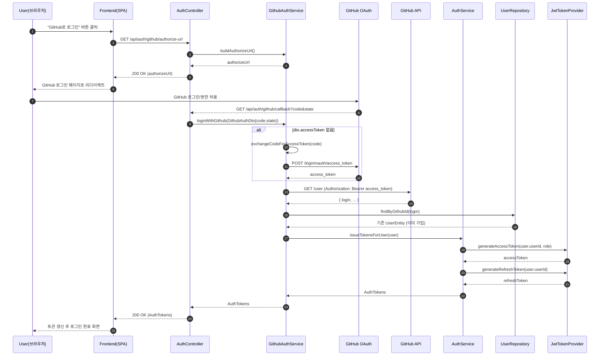
```mermaid
sequenceDiagram
    autonumber
    participant U as User(브라우저)
    participant FE as Frontend(SPA)
    participant AC as AuthController
    participant GAS as GithubAuthService
    participant GH as GitHub OAuth
    participant GAPI as GitHub API
    participant AS as AuthService
    participant UR as UserRepository
    participant JTP as JwtTokenProvider

    U->>FE: "GitHub로 로그인" 버튼 클릭
    FE->>AC: GET /api/auth/github/authorize-url
    AC->>GAS: buildAuthorizeUrl()
    GAS-->>AC: authorizeUrl
    AC-->>FE: 200 OK (authorizeUrl)
    FE-->>U: GitHub 로그인 페이지로 리다이렉트

    U->>GH: GitHub 로그인/권한 허용
    GH-->>AC: GET /api/auth/github/callback?code&state
    AC->>GAS: loginWithGithub(GithubAuthDto{code,state})

    alt dto.accessToken 없음
        GAS->>GAS: exchangeCodeForAccessToken(code)
        GAS->>GH: POST /login/oauth/access_token
        GH-->>GAS: access_token
    end

    GAS->>GAPI: GET /user (Authorization: Bearer access_token)
    GAPI-->>GAS: { login, ... }

    GAS->>UR: findByGithubId(login)
    UR-->>GAS: 기존 UserEntity (이미 가입)

    GAS->>AS: issueTokensForUser(user)
    AS->>JTP: generateAccessToken(user.userId, role)
    JTP-->>AS: accessToken
    AS->>JTP: generateRefreshToken(user.userId)
    JTP-->>AS: refreshToken
    AS-->>GAS: AuthTokens
    GAS-->>AC: AuthTokens
    AC-->>FE: 200 OK (AuthTokens)
    FE-->>U: 토큰 갱신 후 로그인 완료 화면


```

재로그인 흐름은 회원가입과 거의 동일하게 시작된다. 사용자는 “GitHub로 로그인” 버튼을 클릭하고, 프론트엔드는 백엔드에서 authorize URL을 받아 GitHub 인증 페이지로 이동시킨다. GitHub에서 code/state를 전달하며 콜백 요청을 보내면, 백엔드는 code를 accessToken으로 교환하여 GitHub 계정 정보를 다시 읽어온다.

가장 큰 차이는 이 시점 이후이다. GithubAuthService.loginWithGithub()은 GitHub에서 넘어온 login 값을 기준으로 UserRepository.findByGithubId()를 조회하고, 이번에는 DB에 이미 저장된 기존 사용자 엔터티가 존재하므로 새롭게 생성하지 않는다. 이후 기존 사용자 정보로 AuthService.issueTokensForUser()를 호출해 JWT 토큰 세트를 새로 발급받는다. 프론트는 새로운 Access Token과 Refresh Token을 저장하여 로그인 상태가 갱신된다.

즉, 재로그인 과정에서는 회원가입이 발생하지 않고, 이미 등록된 사용자의 인증만 수행하는 방식으로 작동한다.

### 3. 내 프로필 조회
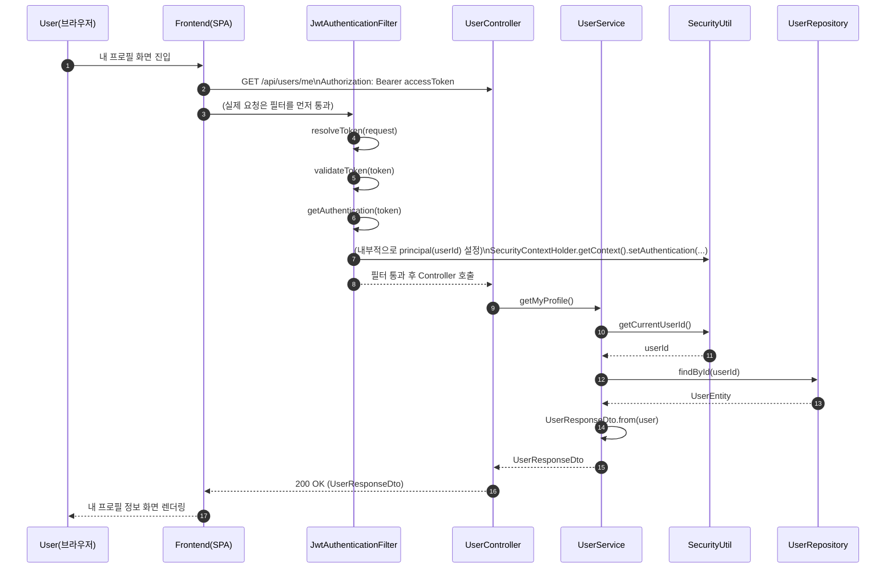
```mermaid
sequenceDiagram
    autonumber
    participant U as User(브라우저)
    participant FE as Frontend(SPA)
    participant JF as JwtAuthenticationFilter
    participant UC as UserController
    participant US as UserService
    participant SU as SecurityUtil
    participant UR as UserRepository

    U->>FE: 내 프로필 화면 진입
    FE->>UC: GET /api/users/me\nAuthorization: Bearer accessToken

    %% 필터 체인에서 JWT 인증
    FE->>JF: (실제 요청은 필터를 먼저 통과)
    JF->>JF: resolveToken(request)
    JF->>JF: validateToken(token)
    JF->>JF: getAuthentication(token)
    JF->>SU: (내부적으로 principal(userId) 설정)\nSecurityContextHolder.getContext().setAuthentication(...)
    JF-->>UC: 필터 통과 후 Controller 호출

    UC->>US: getMyProfile()
    US->>SU: getCurrentUserId()
    SU-->>US: userId

    US->>UR: findById(userId)
    UR-->>US: UserEntity

    US->>US: UserResponseDto.from(user)
    US-->>UC: UserResponseDto
    UC-->>FE: 200 OK (UserResponseDto)
    FE-->>U: 내 프로필 정보 화면 렌더링


```

사용자가 “내 프로필” 화면에 접근할 때 프론트엔드는 저장된 Access Token을 Authorization 헤더에 담아 GET /api/users/me 요청을 보낸다. 이 요청은 컨트롤러에 도달하기 전에 먼저 JwtAuthenticationFilter를 통과한다. 필터는 요청 헤더에서 Bearer 토큰을 추출하고, JwtTokenProvider.validateToken()을 통해 토큰의 유효성을 검증한다. 유효한 토큰이면, 토큰에서 추출한 userId를 기반으로 Authentication 객체를 생성하여 SecurityContextHolder에 저장한다.

필터 통과 후 UserController.getMyProfile()이 호출되며, 내부적으로 UserService.getMyProfile()을 실행한다. UserService는 SecurityUtil.getCurrentUserId()를 호출해 현재 SecurityContext에 저장된 userId를 가져온 뒤, 해당 userId로 DB에서 UserEntity를 조회한다. 조회된 엔터티는 UserResponseDto.from() 메서드를 통해 응답용 DTO로 변환되며, 사용자에게 프로필 정보(깃허브 통계 포함)를 전달한다.

### 4. 내 프로필 수정
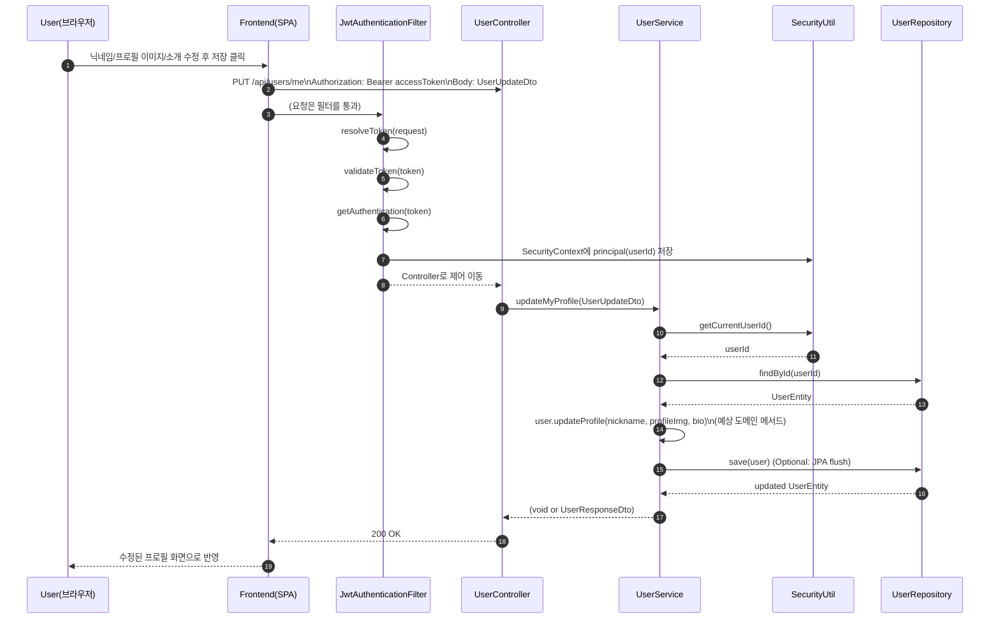
```mermaid
sequenceDiagram
    autonumber
    participant U as User(브라우저)
    participant FE as Frontend(SPA)
    participant JF as JwtAuthenticationFilter
    participant UC as UserController
    participant US as UserService
    participant SU as SecurityUtil
    participant UR as UserRepository

    U->>FE: 닉네임/프로필 이미지/소개 수정 후 저장 클릭
    FE->>UC: PUT /api/users/me\nAuthorization: Bearer accessToken\nBody: UserUpdateDto

    %% JWT 필터 인증
    FE->>JF: (요청은 필터를 통과)
    JF->>JF: resolveToken(request)
    JF->>JF: validateToken(token)
    JF->>JF: getAuthentication(token)
    JF->>SU: SecurityContext에 principal(userId) 저장
    JF-->>UC: Controller로 제어 이동

    UC->>US: updateMyProfile(UserUpdateDto)
    US->>SU: getCurrentUserId()
    SU-->>US: userId

    US->>UR: findById(userId)
    UR-->>US: UserEntity

    US->>US: user.updateProfile(nickname, profileImg, bio)\n(예상 도메인 메서드)
    US->>UR: save(user) (Optional: JPA flush)
    UR-->>US: updated UserEntity

    US-->>UC: (void or UserResponseDto)
    UC-->>FE: 200 OK
    FE-->>U: 수정된 프로필 화면으로 반영


```

사용자가 닉네임, 프로필 이미지, 자기소개 등의 정보를 수정한 뒤 “저장” 버튼을 누르면, 프론트엔드는 수정 내용을 담은 UserUpdateDto를 포함하여 Authorization 헤더와 함께 PUT 혹은 PATCH /api/users/me 요청을 보낸다. 이 요청 역시 JWT 인증 필터를 먼저 통과하며, 검증된 userId가 SecurityContext에 기록된다.

컨트롤러에서 UserService.updateMyProfile()이 실행되면, 서비스는 SecurityUtil.getCurrentUserId()로 현재 로그인한 사용자 id를 획득하고 DB에서 사용자 엔터티를 조회한다. 조회한 엔터티에 대해 제공된 UserUpdateDto 값을 사용해 변경된 필드를 적용한 뒤, JPA가 변경 감지를 통해 자동으로 DB에 업데이트한다. 작업이 완료되면 성공 응답을 반환하고 프론트엔드는 수정된 값을 UI에 반영한다.

### 5. 계정 탈퇴( 소프트 삭제)
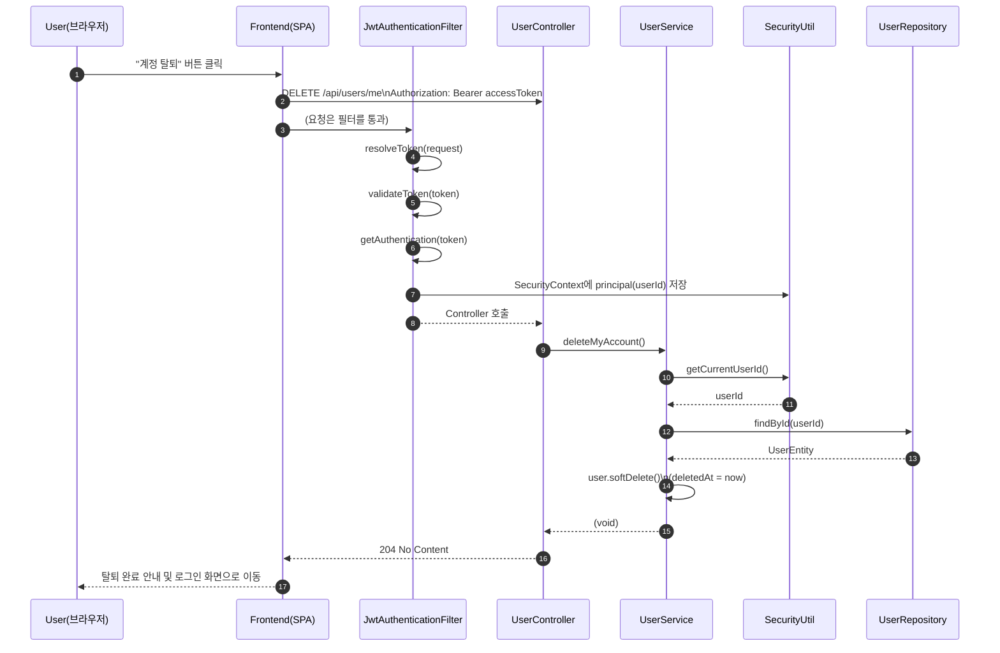
```mermaid
sequenceDiagram
    autonumber
    participant U as User(브라우저)
    participant FE as Frontend(SPA)
    participant JF as JwtAuthenticationFilter
    participant UC as UserController
    participant US as UserService
    participant SU as SecurityUtil
    participant UR as UserRepository

    U->>FE: "계정 탈퇴" 버튼 클릭
    FE->>UC: DELETE /api/users/me\nAuthorization: Bearer accessToken

    %% JWT 필터 인증
    FE->>JF: (요청은 필터를 통과)
    JF->>JF: resolveToken(request)
    JF->>JF: validateToken(token)
    JF->>JF: getAuthentication(token)
    JF->>SU: SecurityContext에 principal(userId) 저장
    JF-->>UC: Controller 호출

    UC->>US: deleteMyAccount()
    US->>SU: getCurrentUserId()
    SU-->>US: userId

    US->>UR: findById(userId)
    UR-->>US: UserEntity

    US->>US: user.softDelete()\n(deletedAt = now)
    US-->>UC: (void)
    UC-->>FE: 204 No Content
    FE-->>U: 탈퇴 완료 안내 및 로그인 화면으로 이동

```
사용자가 “계정 탈퇴” 기능을 선택하면, 프론트엔드는 Authorization 헤더와 함께 DELETE /api/users/me 요청을 보낸다. 이 요청도 먼저 JWT 인증 필터를 통과해 userId를 SecurityContext에 설정하고, 이후 UserController.deleteMyAccount()가 호출된다.

서비스 계층에서는 먼저 현재 로그인 중인 사용자를 조회한다. 이후 UserEntity의 softDelete() 메서드를 호출하여 deletedAt 필드를 현재 시각으로 설정한다. 이 방식은 실제로 데이터를 삭제하지 않고 계정이 비활성 상태임을 표시하는 소프트 삭제 방식이며, 탈퇴한 계정은 이후 로그인 시 “탈퇴한 계정입니다.” 예외를 발생시키도록 구현되어 있다. 컨트롤러는 204 No Content 응답을 보내 탈퇴 처리가 완료된다.

### 6. 로그아웃
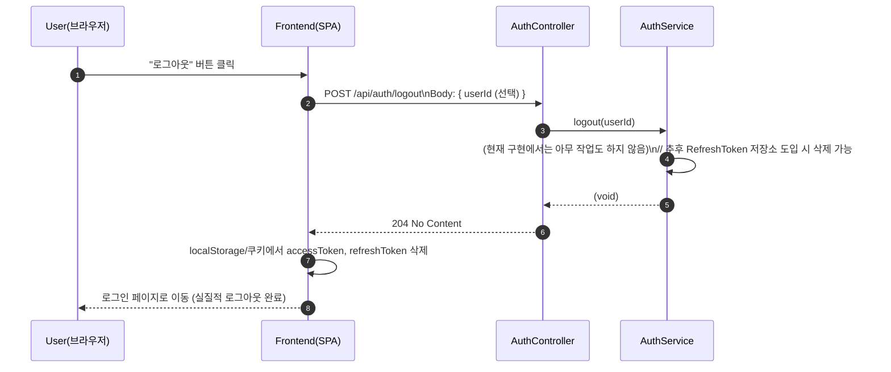
```mermaid
sequenceDiagram
    autonumber
    participant U as User(브라우저)
    participant FE as Frontend(SPA)
    participant AC as AuthController
    participant AS as AuthService

    U->>FE: "로그아웃" 버튼 클릭
    FE->>AC: POST /api/auth/logout\nBody: { userId (선택) }

    AC->>AS: logout(userId)
    AS->>AS: (현재 구현에서는 아무 작업도 하지 않음)\n// 추후 RefreshToken 저장소 도입 시 삭제 가능
    AS-->>AC: (void)

    AC-->>FE: 204 No Content

    FE->>FE: localStorage/쿠키에서 accessToken, refreshToken 삭제
    FE-->>U: 로그인 페이지로 이동 (실질적 로그아웃 완료)


```
로그아웃은 JWT 기반 stateless 방식이기 때문에, 별도의 서버 측 세션을 관리하지 않는다. 사용자가 로그아웃을 누르면 프론트엔드는 POST /api/auth/logout 요청을 보낼 수 있으나, 현재 구조에서는 서버가 수행해야 할 작업은 없다. 컨트롤러는 AuthService.logout()을 호출하지만 실제 구현은 비어 있으며, 추후 필요 시 Refresh Token 블랙리스트 또는 저장소를 도입했을 때 로그아웃 처리 로직이 추가될 수 있다.

실제 로그아웃의 핵심은 프론트엔드 측이 localStorage 또는 쿠키에서 Access Token과 Refresh Token을 삭제하는 것이다. 토큰이 삭제되면 다시 API 요청을 보낼 경우 필터에서 인증 실패가 발생하므로 로그인 상태는 종료된다.

### 7. 토큰 재발급 
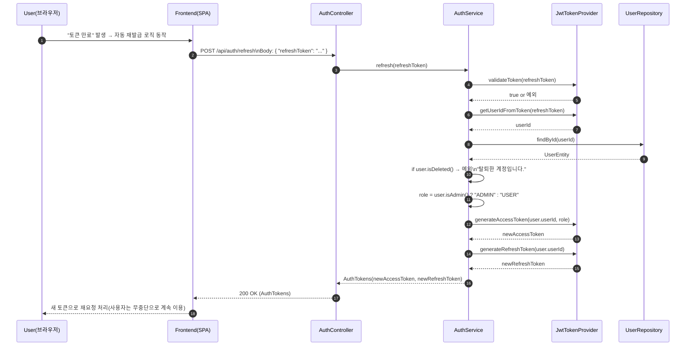
```mermaid
sequenceDiagram
    autonumber
    participant U as User(브라우저)
    participant FE as Frontend(SPA)
    participant AC as AuthController
    participant AS as AuthService
    participant JTP as JwtTokenProvider
    participant UR as UserRepository

    U->>FE: "토큰 만료" 발생 → 자동 재발급 로직 동작
    FE->>AC: POST /api/auth/refresh\nBody: { "refreshToken": "..." }

    AC->>AS: refresh(refreshToken)

    AS->>JTP: validateToken(refreshToken)
    JTP-->>AS: true or 예외

    AS->>JTP: getUserIdFromToken(refreshToken)
    JTP-->>AS: userId

    AS->>UR: findById(userId)
    UR-->>AS: UserEntity

    AS->>AS: if user.isDeleted() → 예외\n"탈퇴한 계정입니다."

    AS->>AS: role = user.isAdmin() ? "ADMIN" : "USER"

    AS->>JTP: generateAccessToken(user.userId, role)
    JTP-->>AS: newAccessToken
    AS->>JTP: generateRefreshToken(user.userId)
    JTP-->>AS: newRefreshToken

    AS-->>AC: AuthTokens(newAccessToken, newRefreshToken)
    AC-->>FE: 200 OK (AuthTokens)
    FE-->>U: 새 토큰으로 재요청 처리(사용자는 무중단으로 계속 이용)


```
Access Token이 만료되면 프론트엔드는 자동 또는 수동으로 저장된 Refresh Token을 사용해 POST /api/auth/refresh 요청을 보낸다. 요청 본문에는 { "refreshToken": "..." } 형식으로 전달된다.

컨트롤러에서 AuthService.refresh(refreshToken)이 호출되면, 서비스는 우선 JwtTokenProvider.validateToken(refreshToken)으로 토큰이 유효한지 검사한다. 유효하지 않다면 오류를 반환한다. 유효하다면 getUserIdFromToken(refreshToken)을 통해 userId를 추출하고, 해당 userId로 DB에서 사용자 엔터티를 조회한다. 탈퇴된 계정이면 예외를 던진다.

정상 사용자라면 기존과 동일한 방식으로 Access Token과 Refresh Token을 새로 발급한다. 즉, userId와 역할 정보를 기반으로 JWT를 새롭게 생성하고 AuthTokens 형태로 반환한다. 프론트는 새 토큰을 저장한 후, 방금 실패했던 API 요청을 다시 보내어 무중단으로 서비스를 이용할 수 있게 된다.

### 스터디

#### 스터디 생성
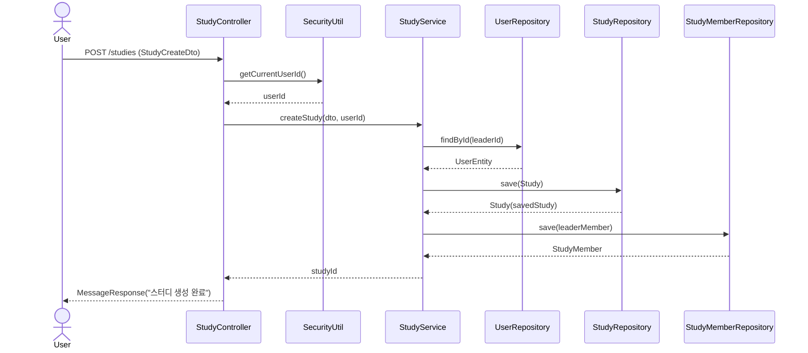
```mermaid
sequenceDiagram
    actor User
    User ->> StudyController: POST /studies (StudyCreateDto)
    StudyController ->> SecurityUtil: getCurrentUserId()
    SecurityUtil -->> StudyController: userId
    StudyController ->> StudyService: createStudy(dto, userId)

    StudyService ->> UserRepository: findById(leaderId)
    UserRepository -->> StudyService: UserEntity

    StudyService ->> StudyRepository: save(Study)
    StudyRepository -->> StudyService: Study(savedStudy)

    StudyService ->> StudyMemberRepository: save(leaderMember)
    StudyMemberRepository -->> StudyService: StudyMember

    StudyService -->> StudyController: studyId
    StudyController -->> User: MessageResponse("스터디 생성 완료")

```
사용자가 새 스터디를 생성하면 StudyController는 전달받은 StudyCreateDto와 현재 로그인한 사용자 ID를 StudyService로 전달한다.
StudyService는 리더 정보가 유효한지 UserRepository를 통해 조회하고, 새 Study 엔티티를 생성하여 StudyRepository에 저장한다.
저장된 스터디 정보를 기반으로 해당 사용자(리더)를 StudyMember로 자동 등록한다.
모든 처리 후 StudyService는 생성된 스터디의 ID를 반환하며, Controller는 최종적으로 “스터디 생성 완료”라는 메시지를 사용자에게 응답한다.
만약 리더 유저 ID가 존재하지 않는다면 예외가 발생하며, Controller는 오류 메시지를 반환하고 요청을 종료한다.

#### 전체 스터디 목록 조회
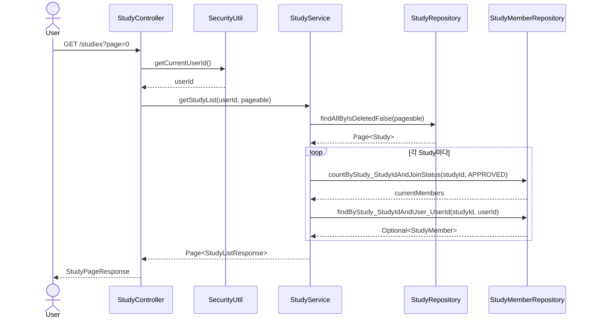
```mermaid
sequenceDiagram
    actor User
    User ->> StudyController: GET /studies?page=0
    StudyController ->> SecurityUtil: getCurrentUserId()
    SecurityUtil -->> StudyController: userId

    StudyController ->> StudyService: getStudyList(userId, pageable)
    StudyService ->> StudyRepository: findAllByIsDeletedFalse(pageable)
    StudyRepository -->> StudyService: Page<Study>

    loop 각 Study마다
        StudyService ->> StudyMemberRepository: countByStudy_StudyIdAndJoinStatus(studyId, APPROVED)
        StudyMemberRepository -->> StudyService: currentMembers

        StudyService ->> StudyMemberRepository: findByStudy_StudyIdAndUser_UserId(studyId, userId)
        StudyMemberRepository -->> StudyService: Optional<StudyMember>
    end

    StudyService -->> StudyController: Page<StudyListResponse>
    StudyController -->> User: StudyPageResponse

```
사용자가 스터디 목록 페이지에 접근하면 Controller는 사용자 ID와 페이지 정보를 StudyService에 전달한다.
StudyService는 StudyRepository로부터 삭제되지 않은 스터디 목록을 페이징 조회하고, 각 스터디마다 현재 승인된 멤버 수와 사용자 참여 상태를 조회한다.
조회된 결과들은 StudyListResponse 형태로 변환된다.
Controller는 이를 다시 StudyPageResponse로 구성해 사용자에게 반환한다.
만약 조회된 스터디가 하나도 없더라도 정상적으로 빈 목록이 응답된다.

#### 내가 가입한 스터디 목록 조회
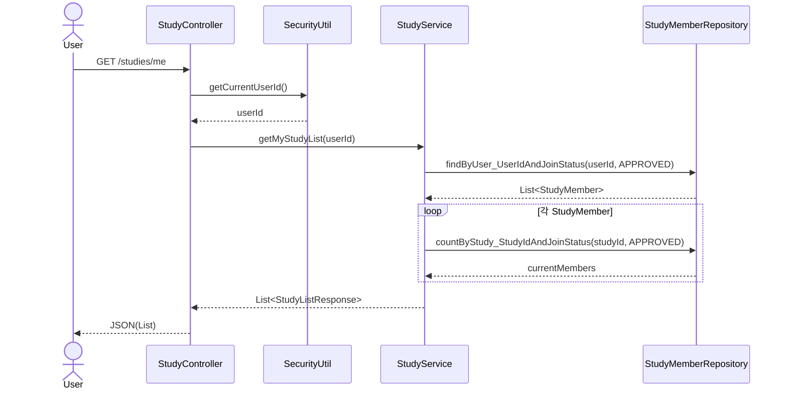
```mermaid
sequenceDiagram
    actor User
    User ->> StudyController: GET /studies/me
    StudyController ->> SecurityUtil: getCurrentUserId()
    SecurityUtil -->> StudyController: userId

    StudyController ->> StudyService: getMyStudyList(userId)
    StudyService ->> StudyMemberRepository: findByUser_UserIdAndJoinStatus(userId, APPROVED)
    StudyMemberRepository -->> StudyService: List<StudyMember>

    loop 각 StudyMember
        StudyService ->> StudyMemberRepository: countByStudy_StudyIdAndJoinStatus(studyId, APPROVED)
        StudyMemberRepository -->> StudyService: currentMembers
    end

    StudyService -->> StudyController: List<StudyListResponse>
    StudyController -->> User: JSON(List)

```
사용자가 자신의 스터디 목록을 조회하면 Controller는 사용자 ID를 StudyService로 전달한다.
StudyService는 StudyMemberRepository를 통해 승인된 상태(APPROVED)의 사용자가 포함된 스터디 목록을 조회한다.
각 스터디에 대해 현재 멤버 수 등을 계산한 뒤 StudyListResponse로 변환한다.
최종적으로 Controller는 사용자가 소속된 스터디 목록을 JSON 형태로 응답한다.
가입된 스터디가 하나도 없을 경우 빈 배열을 반환한다.

#### 스터디 관리 페이지 조회
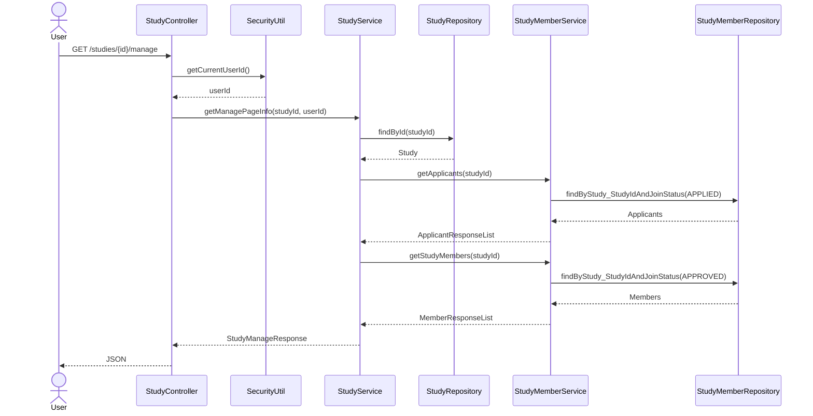
```mermaid
sequenceDiagram
    actor User
    User ->> StudyController: GET /studies/{id}/manage
    StudyController ->> SecurityUtil: getCurrentUserId()
    SecurityUtil -->> StudyController: userId

    StudyController ->> StudyService: getManagePageInfo(studyId, userId)
    StudyService ->> StudyRepository: findById(studyId)
    StudyRepository -->> StudyService: Study

    StudyService ->> StudyMemberService: getApplicants(studyId)
    StudyMemberService ->> StudyMemberRepository: findByStudy_StudyIdAndJoinStatus(APPLIED)
    StudyMemberRepository -->> StudyMemberService: Applicants

    StudyMemberService -->> StudyService: ApplicantResponseList

    StudyService ->> StudyMemberService: getStudyMembers(studyId)
    StudyMemberService ->> StudyMemberRepository: findByStudy_StudyIdAndJoinStatus(APPROVED)
    StudyMemberRepository -->> StudyMemberService: Members

    StudyMemberService -->> StudyService: MemberResponseList

    StudyService -->> StudyController: StudyManageResponse
    StudyController -->> User: JSON

```
사용자가 스터디 관리 페이지를 열면 Controller는 studyId와 userId를 StudyService에 전달한다.
StudyService는 StudyRepository로부터 스터디 존재 여부를 확인한 뒤, 스터디 정보와 가입 신청자 목록, 승인된 멤버 목록을 각각 조회한다.
조회된 데이터들은 StudyInfoResponse, StudyApplicantResponse, StudyMemberResponse로 포장된다.
StudyService는 이를 StudyManageResponse로 조합해 Controller로 반환한다.
Controller는 최종적으로 관리 페이지 전체 정보를 사용자에게 응답한다.

#### 스터디 정보 수정
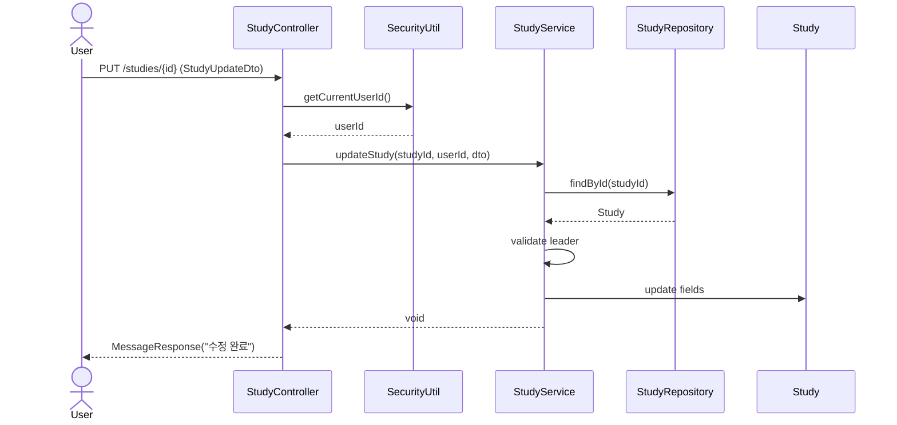
```mermaid
sequenceDiagram
    actor User
    User ->> StudyController: PUT /studies/{id} (StudyUpdateDto)
    StudyController ->> SecurityUtil: getCurrentUserId()
    SecurityUtil -->> StudyController: userId

    StudyController ->> StudyService: updateStudy(studyId, userId, dto)
    StudyService ->> StudyRepository: findById(studyId)
    StudyRepository -->> StudyService: Study

    StudyService ->> StudyService: validate leader
    StudyService ->> Study: update fields

    StudyService -->> StudyController: void
    StudyController -->> User: MessageResponse("수정 완료")

```
사용자가 스터디 정보를 수정하면 Controller는 studyId와 수정 요청 DTO, userId를 StudyService로 전달한다.
StudyService는 스터디가 존재하는지 조회하고, 요청한 사용자가 스터디 리더인지 검증한다.
검증이 완료되면 전달받은 DTO의 값으로 스터디 이름·설명·카테고리·정원 등을 업데이트한다.
업데이트된 데이터는 StudyRepository를 통해 저장된다.
Controller는 “스터디 정보가 수정되었습니다.”라는 메시지를 사용자에게 반환한다.

#### 스터디 메인 페이지 조회
```mermaid
sequenceDiagram
    actor User
    User ->> StudyController: GET /studies/{id}/main

    StudyController ->> StudyService: getStudyMainPage(studyId)
    StudyService ->> StudyRepository: findById(studyId)
    StudyRepository -->> StudyService: Study

    StudyService ->> StudyMemberRepository: countByStudy_StudyIdAndJoinStatus(APPROVED)
    StudyMemberRepository -->> StudyService: currentMembers

    StudyService ->> StudyMemberRepository: findByStudy_StudyIdAndJoinStatus(APPROVED)
    StudyMemberRepository -->> StudyService: List<StudyMember>

    StudyService ->> StudyScheduleRepository: findByStudy_StudyId(studyId)
    StudyScheduleRepository -->> StudyService: List<StudySchedule>

    StudyService -->> StudyController: StudyMainPageResponse
    StudyController -->> User: JSON

```
사용자가 특정 스터디의 메인 페이지를 열면 Controller는 studyId를 StudyService로 전달한다.
StudyService는 해당 스터디의 기본 정보와 현재 승인된 멤버 리스트를 조회한다.
또한 스터디에 연결된 모든 일정 데이터를 가져와 StudyMainScheduleResponse 리스트로 변환한다.
StudyService는 스터디 정보, 리더 깃허브 ID, 멤버 목록, 일정 목록을 포함한 StudyMainPageResponse를 생성하여 반환한다.
Controller는 최종 페이지 데이터를 클라이언트에 응답한다.

#### 스터디 삭제
```mermaid
sequenceDiagram
    actor User
    User ->> StudyController: DELETE /studies/{id}
    StudyController ->> SecurityUtil: getCurrentUserId()
    SecurityUtil -->> StudyController: userId

    StudyController ->> StudyService: deleteStudy(studyId, userId)

    StudyService ->> StudyRepository: findById(studyId)
    StudyRepository -->> StudyService: Study

    StudyService ->> StudyScheduleRepository: findAllByStudy_StudyId(studyId)
    StudyScheduleRepository -->> StudyService: schedules

    loop 각 Schedule
        StudyService ->> ScheduleParticipateRepository: deleteBySchedule_ScheduleId(scheduleId)
    end

    StudyService ->> StudyScheduleRepository: deleteByStudy_StudyId(studyId)
    StudyScheduleRepository -->> StudyService: void

    StudyService ->> StudyMemberRepository: deleteByStudy_StudyId(studyId)
    StudyMemberRepository -->> StudyService: void

    StudyService ->> StudyRepository: delete(study)
    StudyRepository -->> StudyService: void

    StudyService -->> StudyController: void
    StudyController -->> User: MessageResponse("삭제 완료")

```
사용자가 스터디를 삭제하면 Controller는 studyId와 userId를 StudyService로 전달한다.
StudyService는 먼저 해당 스터디가 존재하는지 찾고, 요청자가 리더인지 확인한다.
스터디에 포함된 모든 일정과 일정 참여기록, 그리고 스터디 멤버 엔티티를 순차적으로 삭제한다.
관련된 모든 하위 데이터 삭제 후 StudyRepository를 통해 스터디 엔티티도 최종 삭제한다.
Controller는 “스터디가 삭제되었습니다.”라는 메시지를 사용자에게 반환하며 요청을 종료한다.

#### 스터디 가입 신청
```mermaid
sequenceDiagram
    actor User
    User ->> StudyMemberController: POST /studies/{id}/apply
    StudyMemberController ->> SecurityUtil: getCurrentUserId()
    SecurityUtil -->> StudyMemberController: userId

    StudyMemberController ->> StudyMemberService: applyToStudy(studyId, userId)

    StudyMemberService ->> StudyRepository: findById(studyId)
    StudyRepository -->> StudyMemberService: Study

    StudyMemberService ->> UserRepository: findById(userId)
    UserRepository -->> StudyMemberService: UserEntity

    StudyMemberService ->> StudyMemberRepository: existsByStudy_StudyIdAndUser_UserId(studyId, userId)
    StudyMemberRepository -->> StudyMemberService: boolean(exists)

    alt 이미 존재할 때
        StudyMemberService -->> StudyMemberController: throw IllegalStateException
    end

    StudyMemberService ->> StudyMemberRepository: save(new StudyMember(APPLIED))
    StudyMemberRepository -->> StudyMemberService: StudyMember

    StudyMemberService -->> StudyMemberController: void
    StudyMemberController -->> User: MessageResponse("스터디 가입 신청 완료")

```
사용자가 특정 스터디에 가입을 신청하면 Controller는 로그인한 사용자 ID와 스터디 ID를 StudyMemberService에 전달한다.
StudyMemberService는 먼저 스터디가 존재하는지 확인하고, 신청 사용자가 실제 존재하는 사용자임을 UserRepository를 통해 검증한다.
이미 신청했거나 가입된 기록이 있는지 StudyMemberRepository에서 중복 여부를 검사한다.
중복이 없다면 joinStatus를 APPLIED로 설정한 StudyMember 엔티티를 생성하여 저장한다.
Controller는 “스터디 가입 신청 완료”라는 메시지를 사용자에게 응답하며 요청이 종료된다.

#### 가입 승인
```mermaid
sequenceDiagram
    actor User
    User ->> StudyMemberController: POST /studies/{id}/approve/{userId}
    
    StudyMemberController ->> StudyMemberService: approveMember(studyId, userId)

    StudyMemberService ->> StudyRepository: findById(studyId)
    StudyRepository -->> StudyMemberService: Study

    StudyMemberService ->> UserRepository: findById(userId)
    UserRepository -->> StudyMemberService: UserEntity

    StudyMemberService ->> StudyMemberRepository: findByStudy_StudyIdAndUser_UserId(studyId, userId)
    StudyMemberRepository -->> StudyMemberService: StudyMember

    alt joinStatus != APPLIED
        StudyMemberService -->> StudyMemberController: throw IllegalStateException
    end

    StudyMemberService ->> StudyMember: setJoinStatus(APPROVED)

    StudyMemberService -->> StudyMemberController: void
    StudyMemberController -->> User: MessageResponse("가입 승인 완료")

```
스터디장이 특정 사용자의 가입 신청을 승인하면 Controller는 studyId와 userId를 Service로 전달한다.
StudyMemberService는 해당 스터디와 유저가 실제 존재하는지 각각 StudyRepository와 UserRepository를 통해 확인한다.
StudyMemberRepository를 통해 요청한 멤버의 가입 신청 데이터를 조회하고, 상태가 APPLIED인지 검증한다.
검증을 통과하면 joinStatus를 APPROVED로 변경해 승인 처리한다.
Controller는 “가입 승인 완료”라는 메시지를 출력하며 작업은 정상적으로 완료된다.

#### 가입 거절
```mermaid
sequenceDiagram
    actor User
    User ->> StudyMemberController: POST /studies/{id}/reject/{userId}

    StudyMemberController ->> StudyMemberService: rejectMember(studyId, userId)

    StudyMemberService ->> StudyMemberRepository: findByStudy_StudyIdAndUser_UserId(studyId, userId)
    StudyMemberRepository -->> StudyMemberService: StudyMember

    alt joinStatus != APPLIED
        StudyMemberService -->> StudyMemberController: throw IllegalArgumentException
    end

    StudyMemberService ->> StudyMember: setJoinStatus(REJECTED)
    StudyMemberService ->> StudyMemberRepository: save(member)

    StudyMemberService -->> StudyMemberController: void
    StudyMemberController -->> User: MessageResponse("가입 거절 완료")

```
스터디장이 어떤 사용자의 가입을 거절하려 할 때 Controller는 studyId와 userId 정보를 서비스로 전달한다.
StudyMemberService는 해당 사용자가 실제로 APPLIED 상태인지 StudyMemberRepository를 통해 조회한다.
해당 사용자가 신청 상태가 아니라면 예외가 발생하고 Controller는 오류 메시지를 반환한다.
정상적인 신청 상태라면 joinStatus를 REJECTED로 변경하여 거절 처리한다.
Controller는 “가입 거절 완료” 메시지를 반환하며 처리를 종료한다.

#### 스터디 멤버 목록 조회
```mermaid
sequenceDiagram
    actor User
    User ->> StudyMemberController: GET /studies/{id}/members

    StudyMemberController ->> StudyMemberService: getStudyMembers(studyId)

    StudyMemberService ->> StudyMemberRepository: findByStudy_StudyIdAndJoinStatus(studyId, APPROVED)
    StudyMemberRepository -->> StudyMemberService: List<StudyMember>

    loop 각 멤버마다
        StudyMemberService ->> StudyMemberResponse: build(dto)
    end

    StudyMemberService -->> StudyMemberController: List<StudyMemberResponse>
    StudyMemberController -->> User: JSON

```
사용자가 스터디 멤버 목록을 조회하면 Controller는 studyId를 StudyMemberService로 전달한다.
Service는 해당 스터디의 승인된(APPROVED) 멤버들을 StudyMemberRepository에서 조회한다.
조회된 멤버 리스트는 StudyMemberResponse DTO로 변환되며, 멤버 ID·Github ID·역할·가입 상태 등이 담긴다.
Service는 DTO 리스트를 Controller에 반환하고, Controller는 이를 JSON 형태로 사용자에게 전송한다.
조회 대상이 없을 경우에도 빈 리스트로 정상 응답한다.

#### 스터디 탈퇴
```mermaid
sequenceDiagram
    actor User
    User ->> StudyMemberController: DELETE /studies/{id}/members/me
    StudyMemberController ->> SecurityUtil: getCurrentUserId()
    SecurityUtil -->> StudyMemberController: userId

    StudyMemberController ->> StudyMemberService: leaveStudy(studyId, userId)

    StudyMemberService ->> StudyMemberRepository: findByStudy_StudyIdAndUser_UserId(studyId, userId)
    StudyMemberRepository -->> StudyMemberService: StudyMember

    alt member is LEADER
        StudyMemberService ->> StudyMemberRepository: countByStudy_StudyIdAndJoinStatusIn(studyId, [APPROVED, APPLIED])
        StudyMemberRepository -->> StudyMemberService: activeCount

        alt activeCount > 1
            StudyMemberService -->> StudyMemberController: throw IllegalArgumentException
        end
    end

    StudyMemberService ->> StudyMember: setJoinStatus(LEFT)

    StudyMemberService -->> StudyMemberController: void
    StudyMemberController -->> User: MessageResponse("스터디 탈퇴 완료")

```
사용자가 스터디에서 탈퇴하면 Controller는 userId와 studyId를 StudyMemberService에 전달한다.
Service는 해당 사용자가 스터디 멤버인지 StudyMemberRepository를 통해 조회한다.
해당 사용자가 스터디 리더인 경우, 승인된 멤버가 2명 이상이면 리더는 탈퇴할 수 없도록 검증한다.
모든 조건을 통과하면 joinStatus를 LEFT로 변경하여 탈퇴 처리한다.
Controller는 “스터디 탈퇴가 완료되었습니다.”라는 메시지를 사용자에게 반환한다.

#### 스터디 강퇴
```mermaid
sequenceDiagram
    actor User
    User ->> StudyMemberController: DELETE /studies/{id}/members/{targetUserId}
    StudyMemberController ->> SecurityUtil: getCurrentUserId()
    SecurityUtil -->> StudyMemberController: leaderId

    StudyMemberController ->> StudyMemberService: kickMember(studyId, leaderId, targetUserId)

    StudyMemberService ->> StudyRepository: findById(studyId)
    StudyRepository -->> StudyMemberService: Study

    alt leaderId != study.leader.userId
        StudyMemberService -->> StudyMemberController: throw IllegalArgumentException
    end

    StudyMemberService ->> StudyMemberRepository: findByStudy_StudyIdAndUser_UserId(studyId, targetUserId)
    StudyMemberRepository -->> StudyMemberService: StudyMember(target)

    alt target.role == LEADER
        StudyMemberService -->> StudyMemberController: throw IllegalArgumentException
    end

    alt target.joinStatus != APPROVED
        StudyMemberService -->> StudyMemberController: throw IllegalArgumentException
    end

    StudyMemberService ->> StudyMember: setJoinStatus(LEFT)

    StudyMemberService -->> StudyMemberController: void
    StudyMemberController -->> User: MessageResponse("강퇴 완료")

```
스터디장이 특정 사용자를 강퇴하려 하면 Controller는 leaderId, studyId, targetUserId를 Service에 전달한다.
Service는 먼저 요청자가 해당 스터디의 실제 리더인지 StudyRepository를 통해 확인한다.
Target 사용자가 존재하는지 StudyMemberRepository로 조회하고, 리더를 강퇴하려는 요청이 아닌지 검사한다.
또한 대상 멤버가 APPROVED 상태인지 확인하며, 신청자나 이미 탈퇴한 멤버는 강퇴할 수 없다.
모든 조건이 충족되면 joinStatus를 LEFT로 변경하여 강퇴 처리하고, Controller는 “강퇴가 완료되었습니다.” 메시지를 반환한다.

#### 스터디 일정 생성
```mermaid
sequenceDiagram
    actor User
    User ->> StudyScheduleController: POST /studies/{studyId}/schedules\n(request)
    StudyScheduleController ->> SecurityUtil: getCurrentUserId()
    SecurityUtil -->> StudyScheduleController: userId

    StudyScheduleController ->> StudyScheduleService: createSchedule(studyId, userId, request)

    StudyScheduleService ->> StudyRepository: findById(studyId)
    StudyRepository -->> StudyScheduleService: Study

    alt userId != study.leader.userId
        StudyScheduleService -->> StudyScheduleController: throw IllegalArgumentException("스터디장만 생성 가능")
    end

    StudyScheduleService ->> StudyScheduleRepository: save(new StudySchedule)
    StudyScheduleRepository -->> StudyScheduleService: StudySchedule(savedSchedule)

    %% 스터디장 자동 참석
    StudyScheduleService ->> ScheduleParticipateRepository: save(leaderParticipate)
    ScheduleParticipateRepository -->> StudyScheduleService: ParticipateRecord

    StudyScheduleService -->> StudyScheduleController: scheduleId
    StudyScheduleController -->> User: MessageResponse("스터디 일정 생성 완료")

```
사용자가 특정 스터디에 일정을 생성하면 Controller는 로그인한 사용자 ID와 요청 데이터를 StudyScheduleService에 전달한다.
Service는 StudyRepository를 통해 스터디가 실제 존재하는지 확인하고, 일정 생성자가 스터디 리더인지 검사한다.
조건이 충족되면 요청 내용을 기반으로 새로운 StudySchedule 엔티티를 생성해 저장한다.
또한 스터디장이기 때문에 생성된 일정에 자동으로 참석하도록 ScheduleParticipate 엔티티도 함께 저장한다.
처리가 완료되면 Controller는 “스터디 일정 생성 완료”라는 메시지를 반환한다.

#### 일정 참여
```mermaid
sequenceDiagram
    actor User
    User ->> StudyScheduleController: POST /studies/{studyId}/schedules/{scheduleId}/participate
    StudyScheduleController ->> SecurityUtil: getCurrentUserId()
    SecurityUtil -->> StudyScheduleController: userId

    StudyScheduleController ->> StudyScheduleService: participate(studyId, scheduleId, userId)

    %% 1. 멤버 여부 및 승인 확인
    StudyScheduleService ->> StudyMemberRepository: findByStudy_StudyIdAndUser_UserId(studyId, userId)
    StudyMemberRepository -->> StudyScheduleService: StudyMember(member)

    alt member.joinStatus != APPROVED
        StudyScheduleService -->> StudyScheduleController: throw IllegalArgumentException("승인된 멤버만 참여 가능")
    end

    %% 2. 이미 참여했는지 확인
    StudyScheduleService ->> ScheduleParticipateRepository: existsBySchedule_ScheduleIdAndUser_UserId(scheduleId, userId)
    ScheduleParticipateRepository -->> StudyScheduleService: boolean(alreadyJoin)

    alt alreadyJoin == true
        StudyScheduleService -->> StudyScheduleController: throw IllegalArgumentException("이미 참여한 유저")
    end

    %% 3. 스케줄 조회
    StudyScheduleService ->> StudyScheduleRepository: findById(scheduleId)
    StudyScheduleRepository -->> StudyScheduleService: StudySchedule(schedule)

    %% 4. 참여 저장
    StudyScheduleService ->> ScheduleParticipateRepository: save(new Participate)
    ScheduleParticipateRepository -->> StudyScheduleService: ParticipateRecord

    StudyScheduleService -->> StudyScheduleController: void
    StudyScheduleController -->> User: MessageResponse("일정 참석 완료")

```
사용자가 특정 일정에 참석을 시도하면 Controller는 studyId, scheduleId, userId를 StudyScheduleService에 전달한다.
Service는 먼저 사용자가 해당 스터디에 가입된 멤버이며 승인된(APPROVED) 상태인지 검증한다.
이미 참여한 상태인지 ScheduleParticipateRepository를 통해 체크하여 중복 참여를 방지한다.
모든 검증이 끝나면 ScheduleParticipate 엔티티를 새로 저장하여 일정 참여를 완료한다.
Controller는 “일정 참석이 완료되었습니다.”라는 메시지를 사용자에게 응답한다.

#### 일정 목록 조회
```mermaid
sequenceDiagram
    actor User
    User ->> StudyScheduleController: GET /studies/{studyId}/schedules
    StudyScheduleController ->> SecurityUtil: getCurrentUserId()
    SecurityUtil -->> StudyScheduleController: userId

    StudyScheduleController ->> StudyScheduleService: getScheduleList(studyId, userId)

    %% 1. 전체 멤버 수 조회 (APPROVED)
    StudyScheduleService ->> StudyMemberRepository: countByStudy_StudyIdAndJoinStatus(studyId, APPROVED)
    StudyMemberRepository -->> StudyScheduleService: totalMembers

    %% 2. 일정 전체 조회
    StudyScheduleService ->> StudyScheduleRepository: findByStudy_StudyId(studyId)
    StudyScheduleRepository -->> StudyScheduleService: List<StudySchedule>

    loop 각 일정(schedule)
        %% 참여 인원 조회
        StudyScheduleService ->> ScheduleParticipateRepository: countBySchedule_ScheduleId(scheduleId)
        ScheduleParticipateRepository -->> StudyScheduleService: participateCount

        %% 본인 참여 여부
        StudyScheduleService ->> ScheduleParticipateRepository: existsBySchedule_ScheduleIdAndUser_UserId(scheduleId, userId)
        ScheduleParticipateRepository -->> StudyScheduleService: boolean(isParticipated)

        %% DTO 변환
        StudyScheduleService ->> ScheduleListResponse: build DTO
    end

    StudyScheduleService -->> StudyScheduleController: List<ScheduleListResponse>
    StudyScheduleController -->> User: JSON(list)

```
사용자가 특정 스터디의 전체 일정 목록을 요청하면 Controller는 studyId와 userId를 Service로 전달한다.
StudyScheduleService는 승인된(APPROVED) 멤버의 전체 수를 조회하고, 해당 스터디의 모든 스케줄을 가져온다.
각 스케줄마다 참여 인원 수와 현재 사용자가 참여했는지 여부를 추가로 조회하여 ScheduleListResponse 형태로 변환한다.
이 과정에서 스케줄 ID, 시작·종료시간, 코멘트, 참여 현황 등 필요한 데이터를 모두 포함한 DTO 리스트가 생성된다.
Controller는 이 리스트를 JSON 형태로 사용자에게 반환하며 목록 조회 요청을 완료한다.

## 게시판
### 게시글 작성
```mermaid
sequenceDiagram
    actor User
    User ->> PostController: POST /api/posts (githubId, request)

    %% 1. 사용자 조회/생성 (Controller 내부 로직)
    PostController ->> UserRepository: findByGithubId(githubId)
    UserRepository -->> PostController: Optional<UserEntity>

    alt User Not Found
        PostController ->> UserRepository: save(newUser)
        UserRepository -->> PostController: createdUser
    end
    PostController ->> PostController: getUserId()

    %% 2. Service 로직 위임
    PostController ->> PostManagementService: createPost(userId, request)

    PostManagementService ->> PostRepository: save(newPost)
    PostRepository -->> PostManagementService: createdPost

    PostManagementService -->> PostController: createdPost

    %% 3. 응답
    PostController ->> PostController: PostResponse.from(createdPost)
    PostController -->> User: 201 Created (PostResponse)
```
사용자가 GitHub ID와 게시글 데이터(title, content)를 담아 게시글 작성을 요청합니다. PostController는 가장 먼저 findOrCreateUser 헬퍼 로직을 통해 UserRepository에서 사용자를 조회하거나 없으면 생성하여 userId를 확보합니다. 확보된 userId와 요청 데이터를 PostManagementService의 createPost 메서드로 전달합니다. Service는 받은 데이터를 바탕으로 Post 엔티티를 생성하고 PostRepository에 저장합니다. 저장 완료 후 반환된 엔티티를 다시 Controller로 전달하며, Controller는 이를 PostResponse 형태로 변환하여 사용자에게 201 Created 응답과 함께 반환합니다.

### 게시글 수정
```mermaid
sequenceDiagram
    actor User
    User ->> PostController: PUT /api/posts/{postId} (githubId, request)

    %% 1. 사용자 조회
    PostController ->> UserRepository: findByGithubId(githubId)
    UserRepository -->> PostController: UserEntity user
    PostController ->> PostController: getUserId()

    %% 2. Service 로직 위임
    PostController ->> PostManagementService: updatePost(userId, postId, request)

    PostManagementService ->> PostRepository: findById(postId)
    PostRepository -->> PostManagementService: Post post

    Note right of PostManagementService: 권한 검증 (post.userId == userId)

    PostManagementService ->> Post: update(title, content)
    PostManagementService ->> PostRepository: save(post)
    PostRepository -->> PostManagementService: updatedPost

    PostManagementService -->> PostController: updatedPost

    %% 3. 응답
    PostController ->> PostController: PostResponse.from(updatedPost)
    PostController -->> User: 200 OK (PostResponse)
```
사용자가 특정 postId의 게시글 수정을 요청하면, Controller는 userId를 확보하여 PostManagementService의 updatePost 메서드에 전달합니다. Service는 PostRepository를 통해 해당 게시글 엔티티를 조회하고, 요청자의 userId와 엔티티의 userId를 비교하여 수정 권한을 검증합니다. 검증에 성공하면 엔티티의 update 오퍼레이션을 호출하여 상태를 변경하고 PostRepository에 저장합니다. 최종적으로 변경된 엔티티를 Controller가 PostResponse로 변환하여 사용자에게 200 OK 응답을 반환합니다.

### 게시글 삭제
```mermaid
sequenceDiagram
    actor User
    User ->> PostController: DELETE /api/posts/{postId} (githubId)

    %% 1. 사용자 조회
    PostController ->> UserRepository: findByGithubId(githubId)
    UserRepository -->> PostController: UserEntity user
    PostController ->> PostController: getUserId()

    %% 2. Service 로직 위임 (소프트 삭제)
    PostController ->> PostManagementService: deletePost(userId, postId)

    PostManagementService ->> PostRepository: findById(postId)
    PostRepository -->> PostManagementService: Post post

    Note right of PostManagementService: 권한 검증 (post.userId == userId)

    PostManagementService ->> Post: softDelete()
    PostManagementService ->> PostRepository: save(post) 
    PostRepository -->> PostManagementService: Success

    PostManagementService -->> PostController: Success

    %% 3. 응답
    PostController -->> User: 204 No Content
```
사용자가 특정 postId의 게시글 삭제를 요청하면, Controller는 userId를 확보하여 PostManagementService의 deletePost 메서드에 전달합니다. Service는 게시글을 조회하여 권한을 검증합니다. 검증에 성공하면 Post 엔티티의 softDelete() 오퍼레이션을 호출하여 deletedAt 필드에 현재 시간을 기록합니다. 이후 save를 통해 해당 변경 사항을 데이터베이스에 반영합니다. 이는 실제 데이터를 삭제하는 것이 아니라 논리적으로 삭제 처리하는 소프트 삭제 방식이며, 성공적으로 처리되면 Controller는 사용자에게 204 No Content 응답을 반환합니다.

### 게시글 목록 조회
```mermaid
sequenceDiagram
    actor User
    User ->> PostController: GET /api/posts?page=1&size=10

    PostController ->> PostQueryService: getPostList(pageable)

    %% 1. 게시글 목록 조회
    PostQueryService ->> PostRepository: findAll(pageable)
    PostRepository -->> PostQueryService: Page<Post> postPage

    Note right of PostQueryService: 2. postIds, userIds 추출

    %% 2. 댓글 수 일괄 조회
    PostQueryService ->> CommentRepository: countCommentsByPostIds(postIds)
    CommentRepository -->> PostQueryService: List<commentCounts>

    %% 3. 작성자 GitHub ID 일괄 조회
    PostQueryService ->> UserRepository: findAllByUserIdIn(userIds)
    UserRepository -->> PostQueryService: List<UserEntity> users

    %% 4. DTO 변환 및 취합
    PostQueryService ->> PostQueryService: Map to PostPageResponse
    PostQueryService -->> PostController: PostPageResponse

    PostController -->> User: 200 OK (JSON List)
```
사용자가 게시글 목록을 요청하면, PostController는 페이징 정보를 PostQueryService의 getPostList로 전달합니다. Service는 PostRepository에서 게시글 목록을 가져온 후, 목록에 포함된 모든 게시글 ID와 작성자 ID를 추출합니다.
성능을 위해 CommentRepository에 일괄적으로 댓글 수를 조회하고, UserRepository에 작성자 정보를 일괄 조회하여 GitHub ID를 가져옵니다. 최종적으로 이 세 가지 데이터(게시글, 댓글 수, 작성자 정보)를 합쳐 PostPageResponse DTO로 변환하여 Controller에 반환합니다. Controller는 이 DTO를 JSON 형태로 사용자에게 반환합니다.

### 게시글 상세 조회
```mermaid
sequenceDiagram
    actor User
    User ->> PostController: GET /api/posts/{postId}

    PostController ->> PostQueryService: getPostDetail(postId)

    %% 1. 게시글 조회 및 조회수 증가
    PostQueryService ->> PostRepository: findById(postId)
    PostRepository -->> PostQueryService: Post post
    PostQueryService ->> Post: incrementViewCount()

    %% 2. 댓글 목록 조회
    PostQueryService ->> CommentRepository: findByPostId(postId)
    CommentRepository -->> PostQueryService: List<Comment> comments

    Note right of PostQueryService: 3. 게시글 및 댓글 작성자 ID 추출

    %% 4. 작성자 GitHub ID 일괄 조회
    PostQueryService ->> UserRepository: findAllByUserIdIn(allUserIds)
    UserRepository -->> PostQueryService: List<UserEntity> users

    %% 5. DTO 변환 및 취합
    PostQueryService ->> PostQueryService: Map to PostDetailResponse
    PostQueryService -->> PostController: PostDetailResponse

    PostController -->> User: 200 OK (JSON Detail)
```
사용자가 특정 postId의 상세 조회를 요청하면, PostQueryService는 PostRepository에서 게시글을 조회하는 동시에 엔티티의 incrementViewCount() 오퍼레이션을 호출하여 조회수를 증가시킵니다. 이어서 CommentRepository를 통해 해당 게시글에 달린 모든 댓글 목록을 가져옵니다. Service는 게시글 작성자와 댓글 작성자 모두의 userId를 추출하여 UserRepository에서 GitHub ID를 일괄 조회합니다. 최종적으로 모든 정보를 취합하여 댓글 목록까지 포함하는 PostDetailResponse DTO를 생성하여 Controller에 반환하며, Controller는 이를 사용자에게 반환합니다.

### 댓글 작성
```mermaid
sequenceDiagram
    actor User
    User ->> CommentController: POST /api/posts/{postId}/comments (githubId, request)

    %% 1. 사용자 조회/생성 (Controller 내부 로직)
    CommentController ->> UserRepository: findByGithubId(githubId)
    UserRepository -->> CommentController: Optional<UserEntity>

    alt User Not Found
        CommentController ->> UserRepository: save(newUser)
        UserRepository -->> CommentController: createdUser
    end
    CommentController ->> CommentController: getUserId()

    %% 2. Service 로직 위임
    CommentController ->> CommentManagementService: createComment(postId, userId, request)

    CommentManagementService ->> CommentRepository: save(newComment)
    CommentRepository -->> CommentManagementService: createdComment

    CommentManagementService -->> CommentController: createdComment

    %% 3. 응답
    CommentController ->> CommentController: CommentResponse.from(createdComment)
    CommentController -->> User: 201 Created (CommentResponse)
```
사용자가 특정 게시글에 댓글 작성 요청을 보내면, CommentController는 userId를 확보한 후 CommentManagementService의 createComment 메서드에 postId, userId, content를 전달합니다. Service는 받은 정보로 Comment 엔티티를 생성하고 CommentRepository에 저장합니다. 저장 후 반환된 엔티티를 Controller가 CommentResponse로 변환하여 사용자에게 201 Created 응답과 함께 반환합니다.

### 댓글 삭제
```mermaid
sequenceDiagram
    actor User
    User ->> CommentController: DELETE /api/posts/{postId}/comments/{commentId}
    Note right of User: 사용자가 '삭제' 버튼 클릭 (requestDelete)

    %% 1. 사용자 정보 수집
    CommentController ->> UserRepository: findByGithubId(githubId)
    UserRepository -->> CommentController: UserEntity user

    %% 2. Control 위임 및 Entity 조회
    CommentController ->> CommentManagementService: deleteComment(user.userId, commentId)
    CommentManagementService ->> CommentRepository: findById(commentId)
    CommentRepository -->> CommentManagementService: Comment commentEntity

    Note right of CommentManagementService: 3. 권한 검증: (commentEntity.userId == user.userId) 비교

    alt 권한 검증 성공
        CommentManagementService ->> Comment: softDelete()
        CommentManagementService ->> CommentRepository: save(commentEntity)
        CommentRepository -->> CommentManagementService: Success
        CommentManagementService -->> CommentController: Success
        CommentController -->> User: 4a. 204 No Content (삭제 성공 메시지)
    else 권한 검증 실패
        CommentManagementService --x CommentController: 4b. AccessDeniedException 반환
        CommentController --x User: 5b. 403 Forbidden (권한 오류 메시지)
    end
```
사용자가 댓글의 '삭제' 버튼을 클릭(requestDelete)하면 이 과정이 시작되며, CommentController (Boundary)는 삭제할 댓글의 commentId를 수집하고 userId를 확보하여 CommentManagementService (Control)의 deleteComment 메서드로 전달합니다.

## 오픈소스 이슈 관리
### 굿 퍼스트 이슈 탐색
```mermaid
sequenceDiagram
    actor User as 사용자
    participant Client as 클라이언트 (Web)
    participant Controller as IssueController
    participant Service as IssueService
    participant APIClient as GithubApiClient
    participant GitHub as GitHub API

    User->>Client: 이슈 검색 요청 (키워드)
    Client->>Controller: GET /api/issues/good-first?keyword=...
    activate Controller
    
    Controller->>Service: searchGoodFirstIssues(keyword, page)
    activate Service
    
    Service->>APIClient: searchGoodFirstIssues(keyword, page)
    activate APIClient
    
    Note right of APIClient: WebClient로 외부 API 호출
    APIClient->>GitHub: GET /search/issues?q=label:"good first issue"...
    activate GitHub
    GitHub-->>APIClient: JSON 응답 (Items)
    deactivate GitHub
    
    APIClient-->>Service: GithubIssueSearchResponseDto
    deactivate APIClient
    
    Service-->>Controller: List<GithubIssueDto>
    deactivate Service
    
    Controller-->>Client: JSON 응답 (이슈 목록)
    deactivate Controller
    Client-->>User: 이슈 목록 표시
```
사용자가 이슈 검색 화면에서 키워드를 입력하면 요청이 시작된다. 이 요청은 IssueController의 getGoodFirstIssues 메서드로 전달되어 IssueService의 searchGoodFirstIssues 메서드를 호출한다. IssueService는 GithubApiClient를 통해 GitHub Search API에 요청을 보내고, label:good first issue 조건과 키워드가 포함된 이슈 목록을 조회한다. API로부터 응답받은 데이터는 GithubIssueSearchResponseDto 형태로 반환되며, 서비스 계층에서 필요한 정보만 추출된 GithubIssueDto 리스트로 변환된다. 최종적으로 IssueController는 이 리스트를 사용자에게 JSON 형태로 반환하여 화면에 검색 결과를 표시한다.

## 기여도 및 도전과제
### 내 기여도 조회
```mermaid
sequenceDiagram
    actor User as 사용자
    participant Controller as ContributionController
    participant Service as ContributionService
    participant UserRepo as UserRepository
    participant APIClient as GithubApiClient
    participant GitHub as GitHub API (GraphQL)
    participant C_Service as ChallengeService

    User->>Controller: GET /api/my/contributions
    activate Controller
    
    Controller->>Service: getMyContribution(userId)
    activate Service
    
    Service->>UserRepo: findById(userId)
    UserRepo-->>Service: UserEntity (Github ID 포함)
    
    Service->>APIClient: fetchContributionData(githubId)
    activate APIClient
    APIClient->>GitHub: POST /graphql (Query)
    GitHub-->>APIClient: GraphQL Response
    APIClient-->>Service: GraphQLResponseDto
    deactivate APIClient
    
    Service->>Service: transformToStats() & calculateScore()
    Note right of Service: 점수 기반 뱃지 계산
    
    Service->>UserRepo: save(updatedUser)
    
    Note right of Service: 도전과제 달성 여부 체크 트리거
    Service->>C_Service: updateChallengeStatus(userId, stats)
    activate C_Service
    C_Service-->>Service: void
    deactivate C_Service
    
    Service-->>Controller: MyContributionResponseDto
    deactivate Service
    
    Controller-->>User: 기여도 및 뱃지 정보 반환
    deactivate Controller
```
사용자가 마이페이지에 접속하여 기여도 조회를 요청하면 ContributionController가 이를 수신하여 ContributionService의 getMyContribution 메서드를 호출한다. ContributionService는 먼저 UserRepository를 통해 현재 사용자의 GitHub ID를 조회하고, 이를 기반으로 GithubApiClient에게 GraphQL API 호출을 위임하여 커밋, PR, 이슈 통계를 가져온다. 조회된 통계 데이터는 점수로 환산되어 적절한 뱃지 등급이 산정되며, 이 최신 정보는 다시 UserRepository를 통해 데이터베이스에 저장된다. 저장이 완료되면 ContributionService는 ChallengeService를 호출하여 도전과제 달성 여부를 체크하게 하고, 최종적으로 사용자의 통계와 뱃지 정보가 담긴 MyContributionResponseDto를 반환한다.

### 도전과제 목록 조회
```mermaid
sequenceDiagram
    actor User as 사용자
    participant Controller as ChallengeController
    participant Service as ChallengeService
    participant ChallengeRepo as ChallengeRepository
    participant UC_Repo as UserChallengeRepository

    User->>Controller: GET /api/challenges
    activate Controller
    
    Controller->>Service: getChallengeList(userId)
    activate Service
    
    Service->>ChallengeRepo: findAll()
    ChallengeRepo-->>Service: List<Challenge>
    
    loop 모든 도전과제 순회
        Service->>UC_Repo: existsByUserId...(userId, challenge)
        UC_Repo-->>Service: boolean (완료 여부)
        
        Service->>Service: getCurrentCountForChallenge()
        Note right of Service: 현재 진행률(커밋/PR수) 매핑
    end
    
    Service-->>Controller: List<ChallengeResponseDto>
    deactivate Service
    
    Controller-->>User: 도전과제 목록(진행률 포함) 반환
    deactivate Controller
```
사용자가 도전과제 리스트 메뉴에 진입하면 요청이 ChallengeController로 전달되어 ChallengeService의 getChallengeList 메서드가 실행된다. ChallengeService는 ChallengeRepository에서 시스템에 등록된 모든 도전과제 메타데이터를 조회한 뒤, 각 과제에 대해 반복문을 수행한다. 반복문 내부에서는 UserChallengeRepository를 통해 해당 사용자가 과제를 이미 완료했는지 확인하고, 사용자의 현재 활동 횟수(커밋, PR 등)를 목표치와 매핑한다. 이 과정이 끝나면 각 도전과제의 진행률과 완료 여부가 포함된 ChallengeResponseDto 리스트가 생성되어 컨트롤러를 통해 사용자에게 반환된다.

### 도전과제 달성
```mermaid
sequenceDiagram
    participant C_Service as ContributionService
    participant Service as ChallengeService
    participant ChallengeRepo as ChallengeRepository
    participant UC_Repo as UserChallengeRepository
    participant DB as Database

    Note over C_Service, Service: 기여도 조회 후 자동 호출됨
    C_Service->>Service: updateChallengeStatus(userId, stats)
    activate Service
    
    Service->>ChallengeRepo: findAll()
    ChallengeRepo-->>Service: List<Challenge>
    
    loop 모든 도전과제 체크
        Service->>UC_Repo: exists...(userId, challenge)
        
        alt 이미 완료함
            Service->>Service: 건너뜀 (continue)
        else 미완료
            Service->>Service: checkCondition(stats >= goal)
            
            opt 조건 달성 시
                Service->>UC_Repo: findBy... or builder()
                Service->>DB: save(UserChallenge with complete=true)
                Note right of DB: 완료 처리 및 시간 저장
            end
        end
    end
    
    Service-->>C_Service: 완료
    deactivate Service
```
기여도 조회 로직 수행 후 최신 통계 정보가 확보되면 ContributionService에 의해 ChallengeService의 updateChallengeStatus 메서드가 내부적으로 호출된다. ChallengeService는 전체 도전과제 목록을 순회하면서, UserChallengeRepository를 통해 사용자가 아직 달성하지 않은 과제들만 선별한다. 선별된 과제들에 대해 현재 사용자의 활동 통계(Stats)가 목표 횟수(Goal)를 초과했는지 비교하고, 조건을 만족하는 경우 UserChallenge 엔티티를 생성하여 completed=true 상태로 데이터베이스에 저장함으로써 달성 처리를 완료한다.

## Todo 리스트
### 할 일(Todo) 등록
```mermaid
 sequenceDiagram
    actor User as 사용자
    participant Controller as TodoController
    participant Service as TodoService
    participant Repo as TodoRepository

    User->>Controller: POST /api/todos (content)
    activate Controller
    
    Controller->>Service: createTodo(userId, request)
    activate Service
    
    Service->>Repo: save(Todo 엔티티)
    Repo-->>Service: Saved Todo
    
    Service-->>Controller: TodoResponseDto
    deactivate Service
    
    Controller-->>User: 생성된 할 일 정보 반환
    deactivate Controller
```
사용자가 할 일 내용을 입력하고 등록 버튼을 누르면 TodoController가 POST 요청을 받아 TodoService의 createTodo 메서드를 호출한다. TodoService는 전달받은 요청 데이터(TodoRequestDto)와 사용자 ID를 기반으로 새로운 Todo 엔티티를 생성한다. 생성된 엔티티는 TodoRepository의 save 메서드를 통해 데이터베이스에 영구 저장된다. 저장이 완료되면 서비스는 생성된 할 일의 ID와 내용을 담은 TodoResponseDto를 컨트롤러에게 반환하고, 컨트롤러는 이를 사용자에게 응답하여 목록 최상단에 새 할 일이 표시되도록 한다.

### 할 일 목록 조회
```mermaid
sequenceDiagram
    actor User as 사용자
    participant Controller as TodoController
    participant Service as TodoService
    participant Repo as TodoRepository

    User->>Controller: GET /api/todos?page=0&size=5
    activate Controller
    
    Controller->>Service: getTodos(userId, pageable)
    activate Service
    
    Service->>Repo: findByUserIdOrderByCreatedAtDesc(userId, pageable)
    Repo-->>Service: Slice<Todo>
    
    Service->>Service: map(TodoResponseDto::from)
    
    Service-->>Controller: Slice<TodoResponseDto>
    deactivate Service
    
    Controller-->>User: 할 일 목록 (Slice)
    deactivate Controller
```
사용자가 할 일 목록 화면에 진입하거나 스크롤을 내려 다음 페이지를 요청하면 TodoController의 getTodos 메서드가 호출된다. 이 요청은 TodoService로 전달되며, 서비스는 TodoRepository의 findByUserIdOrderByCreatedAtDesc 메서드를 호출하여 해당 사용자의 할 일들을 생성일 역순으로 조회한다. 이때 Pageable 객체를 통해 페이징 처리가 수행되며, 데이터베이스로부터 조회된 Todo 엔티티들은 Slice<TodoResponseDto> 형태로 변환된다. 변환된 데이터는 컨트롤러를 거쳐 사용자에게 전달되어 무한 스크롤 형태의 목록으로 렌더링된다.

### 할 일 체크 토글
```mermaid
sequenceDiagram
    actor User as 사용자
    participant Controller as TodoController
    participant Service as TodoService
    participant Repo as TodoRepository
    participant Entity as TodoEntity

    User->>Controller: PATCH /api/todos/{todoId}/check
    activate Controller
    
    Controller->>Service: toggleTodo(userId, todoId)
    activate Service
    
    Service->>Repo: findById(todoId)
    Repo-->>Service: Optional<Todo>
    
    alt 존재하지 않거나 소유자가 아님
        Service-->>Controller: Exception 발생
    else 정상 확인
        Service->>Entity: toggle()
        Note right of Entity: isChecked = !isChecked
        
        Service->>Repo: (Transactional 종료 시 Dirty Checking)
        Note right of Repo: Update Query 실행
    end
    
    Service-->>Controller: void
    deactivate Service
    
    Controller-->>User: 200 OK
    deactivate Controller
```
사용자가 특정 할 일의 체크박스를 클릭하면 TodoController가 PATCH 요청을 수신하여 TodoService의 toggleTodo 메서드를 실행한다. TodoService는 TodoRepository를 통해 해당 할 일(Todo)을 조회한 뒤, 현재 로그인한 사용자가 해당 할 일의 소유자인지 검증한다. 검증이 통과되면 Todo 엔티티의 toggle 메서드를 실행하여 완료 상태(isChecked)를 반전시킨다. 별도의 save 호출 없이도 트랜잭션 종료 시점에 변경 감지(Dirty Checking)가 동작하여 데이터베이스에 변경 사항이 반영되며, 요청 처리가 성공적으로 종료된다.

### 할 일 삭제
```mermaid
sequenceDiagram
    actor User as 사용자
    participant Controller as TodoController
    participant Service as TodoService
    participant Repo as TodoRepository

    User->>Controller: POST /api/todos/batch-delete (ids=[1,3,5])
    activate Controller
    
    Controller->>Service: deleteTodos(userId, ids)
    activate Service
    
    Service->>Repo: findAllById(ids)
    Repo-->>Service: List<Todo>
    
    Service->>Service: filter(todo -> todo.userId == myId)
    Note right of Service: 내 소유만 필터링
    
    opt 삭제할 항목이 존재하면
        Service->>Repo: deleteAll(myTodos)
    end
    
    Service-->>Controller: void
    deactivate Service
    
    Controller-->>User: 200 OK
    deactivate Controller
```
사용자가 완료된 할 일들을 선택하고 일괄 삭제 버튼을 클릭하면 TodoController가 삭제할 ID 목록을 받아 TodoService의 deleteTodos 메서드를 호출한다. TodoService는 먼저 요청된 ID들에 해당하는 모든 Todo 엔티티를 데이터베이스에서 조회한다. 조회된 목록 중에서 보안을 위해 실제 사용자 소유인 항목들만 스트림으로 필터링하여 추출한다. 필터링된 할 일 목록이 비어있지 않다면 TodoRepository의 deleteAll 메서드를 사용하여 데이터베이스에서 해당 항목들을 일괄적으로 영구 삭제한다.

---

## 5. State machine diagram
```mermaid
stateDiagram
    direction TB

    [*] --> 로그아웃상태 : 서비스 접속
    로그아웃상태 --> 로그인상태 : 로그인
    로그아웃상태 --> 로그인상태 : 회원가입
    로그인상태 --> 로그인상태 : 깃허브인증
    
    로그인상태 --> 로그아웃상태 : 로그아웃
    로그아웃상태 --> [*] : 서비스 종료
    
    state "프로필 관리" as ProfileManagement {
        direction LR
        [*] --> 프로필조회
        프로필조회 --> 프로필수정
        프로필조회 --> [*] : 종료
    }

    state "스터디 관리" as StudyManagement {
        direction LR
        [*] --> 스터디목록조회
        스터디목록조회 --> 스터디상세조회 : 상세 보기
        스터디목록조회 --> 스터디생성 : 스터디 생성
        스터디상세조회 --> 스터디수정 : 스터디장
        스터디상세조회 --> 스터디삭제 : 스터디장
        스터디상세조회 --> 참여신청 : 스터디 참여 신청
        참여신청 --> 참여신청대기 : 신청 완료
        참여신청대기 --> 참여승인 : 스터디장 승인
        참여신청대기 --> 참여거절 : 스터디장 거절
        참여승인 --> 스터디활동중
        참여거절 --> 스터디상세조회 : 스터디 페이지로
        스터디활동중 --> 스터디상세조회 : 활동 종료
        스터디목록조회 --> [*] : 종료
    }

    state "게시판" as Board {
        direction LR
        [*] --> 게시글목록조회
        게시글목록조회 --> 게시글상세조회 : 상세 보기
        게시글목록조회 --> 게시글작성 : 새 글 작성
        게시글수정 --> 게시글상세조회 : 수정 완료
        게시글삭제 --> 게시글상세조회 : 삭제 완료
        게시글상세조회 --> 댓글작성 : 댓글 작성
        댓글삭제 --> 게시글상세조회 : 삭제 완료
        게시글상세조회 --> 게시글신고 : 게시글 신고
        게시글목록조회 --> [*] : 종료
    }

    state "오픈소스 이슈" as OpenSource {
        direction LR
        [*] --> 굿퍼스트이슈검색
        [*] --> 기여도측정 : 커밋/PR 발생
        기여도측정 --> 도전과제_배지획득 : 특정 기여 달성
        도전과제_배지획득 --> 굿퍼스트이슈검색 : 다음 활동
        굿퍼스트이슈검색 --> [*] : 종료
    }

    state "관리자 기능" as Admin {
        direction LR
        [*] --> 신고승인 : 신고 처리
        [*] --> 회원목록조회 : 처리 완료
        [*] --> 스터디강제삭제 : 스터디 관리
        [*] --> 게시글강제삭제 : 게시글 관리
        [*] --> 댓글강제삭제 : 댓글 관리
        [*] --> [*] : 종료
    }

    로그인상태 --> ProfileManagement : 프로필 관리
    로그인상태 --> StudyManagement : 스터디 관리
    로그인상태 --> Board : 게시판 이용
    로그인상태 --> OpenSource : 오픈소스 기여
    로그인상태 --> Admin : 관리자 기능
```
**1. 로그인 및 인증 단계**
- 사용자는 서비스에 접근하기 위해 로그아웃상태에서 로그인 절차를 거칩니다. 사용자는 로그인을 시도하거나, 계정이 없을 경우 회원가입 절차를 통해 로그인상태로 진입할 수 있습니다. 로그인상태가 된 후, 사용자는 추가적으로 깃허브인증을 완료하여 계정을 연동할 수 있으며, 이 경우에도 로그인상태는 유지됩니다. 모든 주요 기능은 이 로그인상태에서 접근 가능하며, 로그아웃 시 다시 로그아웃상태로 돌아갑니다.

**2. 프로필 관리 기능**
- 로그인상태의 사용자는 자신의 개인 정보 관리를 위해 이 모듈로 이동할 수 있습니다. 이 기능은 프로필조회 상태에서 시작하여 사용자가 자신의 현재 정보를 즉시 확인할 수 있게 합니다. 사용자는 여기서 프로필수정 상태로 이동하여 정보를 원하는 대로 변경할 수 있으며, 종료를 통해 메인(로그인상태)으로 돌아갑니다.

**3. 스터디 관리 기능**
- 스터디 관리는 사용자가 그룹 학습을 생성하고 참여할 수 있는 핵심 모듈입니다. 스터디목록조회 화면은 사용자가 다양한 스터디를 탐색할 수 있는 출발점입니다. 사용자는 이곳에서 스터디생성을 통해 새로운 스터디를 개설하거나, 기존 스터디의 스터디상세조회로 이동할 수 있습니다. 상세조회 상태에서는 일반 사용자의 참여신청이 가능하며, 스터디장의 경우 스터디수정 및 스터디삭제 권한을 가집니다.
- 사용자가 참여신청을 하면 참여신청대기 상태로 전환되어 스터디장의 승인을 기다립니다. 스터디장은 이를 참여승인 하거나 참여거절 할 수 있습니다. 참여승인 시 사용자는 스터디활동중 상태가 되어 정식 멤버로 활동하게 되며, 참여거절되거나 스터디활동중 상태가 종료되면 스터디상세조회 화면으로 돌아옵니다.

**4. 게시판 기능**
- 게시판은 사용자 간의 자유로운 소통과 정보 공유를 위한 공간입니다. 게시판 기능은 게시글목록조회 상태에서 시작합니다.
사용자는 게시글목록조회 상태에서 게시글작성을 하거나 특정 게시글을 선택하여 게시글상세조회 상태로 이동할 수 있습니다.
게시글상세조회 상태는 가장 많은 상호작용이 일어나는 중심 상태입니다. 이 상태에서 댓글작성 및 게시글 신고가 가능합니다.
만약 게시글수정이나 댓글삭제가 완료되면, 사용자는 변경된 결과를 즉시 확인하기 위해 다시 게시글상세조회 상태로 돌아옵니다.
게시글삭제가 완료되는 경우는 해당 게시글 자체가 사라지므로, 사용자 흐름은 게시글목록조회 상태로 이동하여 목록에서 해당 글이 사라졌음을 확인합니다.

**5. 오픈소스 이슈 기능**
- 이 모듈은 사용자의 오픈소스 기여 활동을 지원하고 추적합니다. 사용자는 굿퍼스트이슈검색을 통해 기여할 이슈를 탐색하며 기능을 시작할 수 있습니다. 또는, 사용자의 커밋/PR 발생이 감지되면 기여도측정 상태가 자동으로 활성화됩니다. 기여도측정이 특정 조건을 만족하면 도전과제_배지획득 상태로 이어지며, 배지 획득 후에는 다음 활동을 위해 굿퍼스트이슈검색 상태로 전환됩니다.

**6. 관리자 기능**
- 관리자 기능은 서비스의 전반적인 운영과 건전성을 관리하기 위한 모듈입니다. 이 기능은 관리자 권한을 가진 사용자만 로그인상태에서 진입할 수 있습니다. 신고 처리, 회원목록조회, 스터디강제삭제, 게시글강제삭제, 댓글강제삭제 등 서비스 운영에 필요한 다양한 관리 작업을 즉시 수행할 수 있는 독립된 기능들의 집합으로 설계되었습니다.
  
---

## 6. User interface prototype
### 로그인 화면

위 그림은 로그인 화면이다.
사용자는 아이디(ID)와 비밀번호(PW)를 입력하여 로그인할 수 있다.
또한 하단의 ‘계정 등록’ 버튼을 눌러 회원가입 화면으로 이동할 수 있다.

### 회원가입 화면

위 그림은 회원가입 화면이다.
사용자는 아이디, 비밀번호, 비밀번호 확인, 닉네임, 선호 기술을 입력하여 계정을 등록할 수 있다.
아이디 입력 후 ‘중복 확인’ 버튼을 통해 사용 가능 여부를 확인할 수 있으며, ‘관리자 계정입니까?’ 항목을 선택하면 관리자 계정으로 가입할 수 있다.

### 메인화면

위 그림은 메인 화면이다.
상단바를 통해 홈, 커뮤니티, 스터디, 도전 과제 등의 페이지로 이동할 수 있다.
화면 중앙에서는 이슈 검색이 가능하며, ‘good-first-issue’ 목록은 기본으로 표시된다.
사용자는 원하는 이슈 키워드를 북마크로 추가하여 개인화된 이슈 목록을 구성할 수 있다.

### 마이페이지

위 그림은 마이페이지 화면이다.
화면 왼쪽의 네모난 박스는 프로필 사진 영역이며, 오른쪽에는 닉네임, 소속 스터디, 깃허브 인증 버튼이 표시된다.
닉네임 옆의 ‘수정’ 버튼을 통해 사용자 정보 수정이 가능하다.
하단에는 사용자가 획득한 뱃지들이 원형 아이콘 형태로 나열되어 있다.

### 게시글/QnA목록 화면

위 그림은 게시글 및 Q&A 목록 화면이다.
상단의 탭을 통해 Q&A게시판과 자유게시판을 전환할 수 있으며, 사용자는 ‘글 작성’ 버튼을 눌러 새 게시글을 등록할 수 있다.
화면 하단의 페이지 번호를 통해 게시글 목록을 페이지 단위로 탐색할 수 있다.

### 게시글 작성/수정 화면

위 그림은 게시글 작성 및 수정 화면이다.
사용자는 제목과 내용을 입력하여 새로운 게시글을 작성하거나, 기존 게시글의 내용을 수정할 수 있다.
입력이 완료되면 상단의 ‘저장’ 버튼을 눌러 게시글을 등록 또는 갱신할 수 있다.

### 스터디 목록 화면

위 그림은 스터디 목록 화면이다.
사용자는 등록된 스터디 목록을 확인할 수 있으며, 상단의 ‘내 스터디’ 버튼을 통해 자신이 속한 스터디만 조회할 수 있다.
하단의 ‘스터디 생성’ 버튼을 눌러 새로운 스터디를 만들 수 있으며, 페이지 번호를 통해 다른 목록으로 이동할 수 있다.

### 스터디 상세 화면

위 그림은 스터디 상세 화면이다.
상단에는 스터디 이름과 설정 버튼이 표시되며, 사용자는 스터디 정보를 수정할 수 있다.
화면 왼쪽에는 일정 관리 영역이 있어 스터디 일정을 등록하고 확인할 수 있고, 아래쪽에는 화상 채팅방 목록이 표시된다.
오른쪽 영역에서는 스터디원 간의 일반 채팅을 통해 실시간으로 소통할 수 있다.

### 스터디 화상채팅 화면

위 그림은 스터디 화상채팅 화면이다.
중앙에는 화상채팅방장의 화면이 송출되어 모든 참여자가 실시간으로 볼 수 있다.
오른쪽에는 참여자 목록이 표시되어, 현재 화상채팅에 접속한 사용자들을 확인할 수 있다.
상단의 메뉴를 통해 다른 페이지로 이동할 수도 있다.

### 스터디 유저 관리

위 그림은 스터디 유저 관리 화면이다.
스터디장은 각 멤버 옆의 ‘강퇴’ 버튼을 통해 특정 사용자를 스터디에서 내보낼 수 있다.
스터디 멤버는 언제든지 ‘스터디 나가기’ 버튼을 눌러 자유롭게 탈퇴할 수 있다.
단, 스터디장은 자신 외에 다른 멤버가 없을 때만 탈퇴가 가능하다.

### 도전과제 관리

위 그림은 도전 과제 화면이다.
사용자는 다양한 난이도의 과제 목록을 확인할 수 있으며, 각 과제는 커밋, PR, 이슈 등록 등의 목표로 구성되어 있다.
각 항목에는 목표 달성 횟수와 현재 진행 상황이 표시되어, 자신의 오픈소스 기여 현황을 한눈에 파악할 수 있다.

### 알림 페이지

위 그림은 알림 화면이다.
사용자는 스터디 관련 알림을 확인할 수 있으며, 예를 들어 신규 화상채팅방 개설이나 스터디 가입 요청 등의 알림이 표시된다.
가입 요청 알림의 경우 ‘승인’ 또는 ‘거절’ 버튼을 눌러 바로 처리할 수 있으며, 상단의 ‘모두 읽음’, ‘알림창 비우기’ 기능으로 알림을 관리할 수 있다.

---

## 7. Implementation requirements
- Frontend:
    - Framework: React.js
    - Language: JavaScript (ES6+), HTML5, CSS3
    - Environment: Node.js (v18 이상)
    - Browser Compatibility: Chrome, Edge, Firefox 최신 버전
- Backend:
    - Framework: Spring Boot (v3.x)
    - Language: Java (JDK 17 이상)
    - API Communication: RESTful API, GitHub OAuth2 연동
    - Build Tool: Gradle
- Database & Hosting:
    - Database: Supabase (PostgreSQL 기반)
    - Cloud Environment: Supabase Hosting 
- Development Environment:
    - IDE: IntelliJ IDEA, Visual Studio Code
    - Version Control: GitHub Organization Repository
    - OS: Windows 10/11, macOS, Linux 지원

---

## 8. Glossary
| 이름               | 설명                                                          |
| ---------------- | ----------------------------------------------------------- |
| 깃라잡이             | 플랫폼 이름으로 길라잡이와 깃허브를 합친 합성어로 사용자가 더 쉽게 오픈소스에 기여하자는 의미이다.     |
| 스터디              | 오픈소스 기여에 어려움을 느끼거나 공통된 관심사를 가진 유저가 모여 커뮤니케이션을 이루는 가상의 공간이다. |
| 도전과제(튜토리얼)       | 처음에 오픈소스 기여를 어떻게 시작해야하는지 모르는 입문자를 위해 최소한의 길라잡이 역할을 제공한다.    |
| vscode.dev       | 사용자가 더 빠른 코드편집을 위해 웹상의 코드편집기이다.                             |
| good-first-issue | 기여하기 좋은 issue를 지칭하는 태그이다.                                   |
---

## 9. References
이것이 취업을 위한 백엔드 개발이다.
https://product.kyobobook.co.kr/detail/S000211834105

webrtc(화상채팅)
https://terianp.tistory.com/178

스프링 시큐리티(로그인/회원가입)
https://eunbin00.tistory.com/202

Spring Boot 3.x 공식 레퍼런스 문서
https://docs.spring.io/spring-boot/index.html

Spring Security 6.x 공식 레퍼런스 (JWT 인증)
https://docs.spring.io/spring-security/reference/index.html

Spring Data JPA 공식 레퍼런스 (Repository 및 Entity 설계 참조)
https://docs.spring.io/spring-data/jpa/reference/index.html

GitHub API (v3 REST, v4 GraphQL) 공식 문서
https://docs.github.com/en/rest?apiVersion=2022-11-28
https://docs.github.com/en/graphql

