# Software Design Specification (SDS)

## 깃라잡이


**Team information:**
|    **Project title**    |                                                                                                                  깃라잡이                                                                                                                   |
| :---------------------: | :------------------------------------------------------------------------------------------------------------------------------------------------------------------------------------------------
|         **학번**          |                                                                                                                 **이름**                                                                                                                  |
|        22111138         |                                                                                                                   오원창                                                                                                                   |
|        22212006         |                                                                                                                   박솔                                                                                                                    |
|        22112018         |                                                                                                                   김관호                                                                                                                   |
|        22313542         |                                                                                                                   정동현                                                                                                                   |
|        22112084         |                                                                                                                   김동규                                                                                                                   |
|        22112110         |                                                                                                                   김성민     
---

## Revision history

| Revision date | Version # | Description | Author |
|---------------|-----------|-------------|--------|
| 11/07/2025    | 1.00      | 1차완성 | Author name |
| | | | |
| | | | |
| | | | |
| | | | |
---

## Contents
1. Introduction  -------------------[Introduction](#1-introduction)
2. Use case analysis  --------------[Use case analysis](#2-use-case-analysis)
3. Class diagram  ------------------[Class diagram](#3-class-diagram)
4. Sequence diagram  ---------------[Sequence diagram](#4-sequence-diagram)
5. State machine diagram  ----------[State machine diagram](#5-state-machine-diagram)
6. User interface prototype  -------[User interface prototype](#6-user-interface-prototype)
7. Implementation requirements  ----[Implementation requirements](#7-implementation-requirements)
8. Glossary  -----------------------[Glossary](#8-glossary)
9. References  ---------------------[References](#9-references)

---

## Authors for each section

- Introduction – 김관호, 김동규, 김성민, 박솔, 오원창, 정동현
- Use case analysis – 김성민, 김동규
- Class diagram – 김관호, 박솔, 오원창, 정동현
- Sequence diagram – 김관호, 박솔, 오원창, 정동현
- State machine diagram – 오원창
- User interface prototype – 정동현 
- Implementation requirements – 김관호, 김동규, 김성민, 박솔, 오원창, 정동현
- Glossary – 김관호, 김동규, 김성민, 박솔, 오원창, 정동현
- References – 김관호, 김동규, 김성민, 박솔, 오원창, 정동현

---

## 1. Introduction
본 문서는 우리 조가 개발하고자 하는 시스템인 깃라잡이의 설계 명세서(SDS)이다. 깃라잡이는 오픈소스에 처음 기여해보는 입문자에게 쉽게 참여하고 학습할 수 있도록 지원하는 플랫폼이다.

본 문서에서는 깃라잡이의 기능적 요구사항을 실현하기 위한 설계를 다양한 관점에서 제시한다. Use Case 분석은 사용자 관점에서 제공되는 주요 기능을 설명하고, Class Diagram은 시스템의 구조적 관점을, Sequence Diagram과 State Machine Diagram은 시스템의 동적 동작을 나타낸다. 또한 User Interface 설계를 통해 실제 사용자의 화면 구성과 상호작용을 시각적으로 표현하였다.

깃라잡이는 good-first-issue와 같은 사용자가 참여하기 적합한 이슈를 추천하고 튜토리얼을 제공함으로서 오픈소스 기여에 조금 더 흥미를 가지고 참여해봄으로서 건전하고 활발한 오픈소스 생태계를 목표로 한다. 또한 여러 사용자가 모여 스터디를 이루어 일정관리와 커뮤니케이션을 통해 이용의 어려움을 최소화하며 자유게시판, QnA게시판등을 통해 플램폼 전역에서의 의사소통이 가능하다.


---

## 2. Use case analysis
- Use case diagram
- 


## 회원관리
1. GitHub OAuth 회원가입
2. 로그인 (GitHub OAuth 재로그인)
3. 내 프로필 조회
4. 프로필 수정
5. 소프트 삭제(계정 탈퇴)
6. 로그아웃
7. 토큰 재발급

## 스터디 관리
8. 스터디 생성
9. 스터디 수정
10. 스터디 삭제
11. 스터디 목록 조회
12. 스터디 상세 조회
13. 스터디 참여 신청
14. 스터디 참여 승인/거절
15. 스터디 탈퇴
16. 스터디 강퇴
17. 스터디 일정 등록
18. 스터디 일정 수정
19. 스터디 일정 삭제
20. 스터디 실시간 채팅
21. 스터디 화상채팅방 생성
22. 스터디 화상채팅방 종료
23. 스터디 화상채팅방 입장
24. 스터디 화상채팅방 퇴장

## 알림
25. 알림 내역 조회
26. 알림 목록 삭제

## 게시판
27. 게시글 작성
28. 게시글 수정
29. 게시글 삭제 (작성자, 관리자)
30. 게시글 목록 조회
31. 게시글 상세 조회
32. 댓글 작성
33. 댓글 수정
34. 댓글 삭제
35. QnA 게시글 작성
36. QnA 게시글 답변 등록

## 오픈소스 이슈 관리
37. Good First Issue 이슈 목록 조회

## 기여도 및 도전과제
38. Good First Issue 검색: GitHub API를 통해 초보자용 이슈를 검색한다.
39. 내 기여도 조회: GitHub GraphQL API로 커밋/PR/이슈 통계를 조회하고 점수와 뱃지를 계산한다.
40. 도전과제 목록 조회: 현재 나의 기여도에 따른 도전과제 달성 현황(진행률)을 확인한다.
41. 도전과제 자동 달성: 기여도 갱신 시 조건이 충족된 도전과제를 자동으로 완료 처리한다.

## Todo List
42. 할 일(Todo) 등록: 개발 목표나 할 일을 생성한다.
43. 할 일 목록 조회: 무한 스크롤 방식으로 할 일 목록을 조회한다.
44. 할 일 체크 토글: 할 일의 완료 여부를 변경한다.
45. 할 일 일괄 삭제: 완료된 할 일들을 선택하여 한 번에 삭제한다.

---
## 회원 관리

### **Use case #1 : GitHub OAuth 회원가입**
#### GENERAL CHARACTERISTICS
- **Summary**  
  사용자가 “GitHub 로그인” 버튼을 클릭하면 GitHub OAuth 인증을 수행하고,
GitHub에서 전달받은 GitHub ID를 기반으로 자동으로 UserEntity를 생성한다.
이미 존재하는 GitHub ID일 경우 회원가입을 수행하지 않고 바로 로그인 처리한다.
GitHub OAuth 회원가입 과정은 JWT 발급까지 포함된 단일 프로세스이며,
따로 “회원가입 후 로그인” 절차가 존재하지 않는다.

- **Scope**  
  깃라잡이

- **Level**  
  User level  

- **Author**  
  박솔

- **Last Update**  
  2025. 10. 16

- **Status**  
  Design

- **Primary Actor**  
  Non-member User (비회원 사용자)

- **Preconditions**  
  1. 사용자는 GitHub 계정을 보유하고 있으며 GitHub 인증에 정상적으로 접근할 수 있어야 한다.
  2. 서버는 GitHub OAuth App(Client ID / Client Secret)과 연결된 상태여야 한다.
  3. 백엔드는 다음 엔드포인트를 제공한다.
   -GET /api/auth/github/login : GitHub 인증 요청
   - GET /api/auth/github/callback : GitHub Access Token & user info 처리
  4. Supabase PostgreSQL DB 연결이 정상이어야 한다.

- **Trigger**  
  사용자가 “GitHub 로그인” 버튼 클릭 → GitHub OAuth 흐름 시작.

- **Success Post Condition**  
  1. GitHub에서 제공한 github_id로 새로운 UserEntity가 자동 생성됨.
   - githubId: GitHub API에서 받은 고유 ID
   - isAdmin = false
   - createdAt = now
   - deletedAt = null
   - commitCount, issueCount, prCount = 0
  2. 생성된 유저는 DB(users 테이블)에 저장된다.
  3. 서버는 유저 정보 기반으로 JWT AccessToken + RefreshToken을 발급해 클라이언트에 반환한다.
  4. 사용자는 로그인된 상태로 서비스 메인 페이지로 이동한다.

- **Failed Post Condition**  
 1.  GitHub Access Token이 정상 발급되지 않음 (“GitHub 액세스 토큰이 응답에 없습니다.” 오류 포함)
  2.GitHub API 호출 실패
  3. DB 저장 실패
  4. OAuth redirect URL 오류
   → UserEntity 생성 X / JWT 발급 X
 클라이언트는 GitHub 오류 팝업 또는 ‘다시 시도’ 안내 메시지를 표시한다.

#### MAIN SUCCESS SCENARIO
| Step | Action                                                                                                |
| ---- | ----------------------------------------------------------------------------------------------------- |
| S    | 사용자가 “GitHub 로그인” 버튼을 클릭한다.                                                                           |
| 1    | 클라이언트는 GitHub Authorization Endpoint로 리다이렉트한다.                                                        |
| 2    | 사용자는 GitHub에서 로그인 및 권한 동의를 완료한다.                                                                      |
| 3    | GitHub은 `authorization_code`를 서버의 `/callback` URL로 전달한다.                                              |
| 4    | 서버의 `GithubAuthService`는 code를 이용해 GitHub Access Token을 요청한다.                                         |
| 5    | GitHub Access Token 획득 성공 시, 서버는 GitHub User API를 호출한다.                                               |
| 6    | GitHub API 응답에서 `github_id`(고유 식별자)를 추출한다.                                                            |
| 7    | 서버는 DB에서 `githubId`가 존재하는지 조회한다.<br> - 존재하면 → 기존 계정으로 로그인 처리<br> - 존재하지 않으면 → 새로운 `UserEntity`를 생성한다. |
| 8    | 생성된(or 조회된) UserEntity 정보를 기반으로 JWT AccessToken & RefreshToken을 생성한다.                                 |
| 9    | 서버는 200 OK와 함께 JWT 및 사용자 정보를 클라이언트에 반환한다.                                                             |
| 10   | 클라이언트는 로그인 성공 상태로 메인 화면 또는 대시보드로 이동한다.                                                                |


#### EXTENSION SCENARIOS
| Step | Branching Action                                                                           |
| ---- | ------------------------------------------------------------------------------------------ |
| 4a   | GitHub Access Token 응답에 `access_token`이 없으면 “GitHub 액세스 토큰이 응답에 없습니다.” 오류 반환(현재 네가 만난 오류). |
| 5a   | GitHub API 서버 장애 또는 rate limit 초과 시 “GitHub 사용자 정보를 가져올 수 없습니다.” 오류 반환.                    |
| 7a   | DB 조회 중 장애 발생 시 “계정 정보를 확인할 수 없습니다.” 메시지를 반환하고 OAuth 프로세스를 종료한다.                           |
| 7b   | UserEntity 저장 실패 시 트랜잭션 롤백 후 “회원 생성 과정에서 오류가 발생했습니다.” 안내.                                  |
| 8a   | JWT 생성 오류 시 클라이언트는 로그인 실패 메시지를 표시한다.                                                       |
| 9a   | 응답 파싱 실패 시 클라이언트는 “로그인 처리 중 오류가 발생했습니다.” 메시지를 표시하고 다시 시도하도록 한다.                            |


#### RELATED INFORMATION
- **Performance**: 회원가입 전체 과정(요청 ~ 응답)은 평균 5초 이내에 완료되어야 한다.
비밀번호 암호화 및 DB 저장은 1초 이내 처리되는 것을 목표로 한다.
- **Frequency**: 신규 사용자마다 최초 1회 실행.
동일 이메일로 중복 가입은 허용하지 않는다.
- **Concurrency**: 최대 500명 동시 가입 요청을 처리할 수 있도록 API 서버 및 DB connection pool을 설정한다.
- **Due Date**: 2025. 11. 01 (예정)

### **Use case #2 : 로그인 (GitHub OAuth 재로그인)**
#### GENERAL CHARACTERISTICS
- **Summary**    
  기존에 users 테이블에 등록된 GitHub 사용자가 다시 “GitHub 로그인”을 통해 접속하는 기능이다.
서버는 GitHub OAuth를 통해 github_id를 확인하고, DB에서 해당 UserEntity를 조회한 뒤
회원가입 과정 없이 곧바로 JWT Access/Refresh Token을 발급한다.
- **Scope**  
  깃라잡이

- **Level**  
  User level

- **Author**  
  박솔

- **Last Update**  
  2025. 10. 16

- **Status**  
  Design

- **Primary Actor**  
  Registered User (기존 가입자, GitHub 계정 연동 사용자)

- **Preconditions**  
  - 사용자의 github_id가 이미 users 테이블에 등록되어 있어야 한다.
  - 서버는 GitHub OAuth App 및 Supabase PostgreSQL DB와 정상 연결 상태여야 한다.
  - 백엔드는 다음 엔드포인트를 제공한다.
     - GET /api/auth/github/login
     - GET /api/auth/github/callback
       
- **Trigger**  
  사용자가 "GitHub 로그인" 버튼을 클릭했을 때 프로세스가 시작된다.
  
- **Success Post Condition**  
 -  users 테이블에서 기존 UserEntity가 조회된다.
 -  서버는 해당 유저 정보를 기반으로 JWT AccessToken 및 RefreshToken을 생성한다.
 -  클라이언트는 로그인 상태가 되며, 메인 화면 혹은 대시보드로 이동한다.
  
- **Failed Post Condition** 
   - GitHub OAuth 실패, GitHub Access Token 미수신, DB 조회 실패 등으로 인해 로그인에 실패한다.
   - JWT는 발급되지 않는다.
   - 클라이언트는 “로그인에 실패했습니다. 다시 시도해 주세요.” 등 안내 메시지를 표시한다.

  
#### MAIN SUCCESS SCENARIO
| Step | Action                                                                                              |
| Step | Action                                                                   |
| ---- | ------------------------------------------------------------------------ |
| S    | 사용자가 “GitHub 로그인” 버튼을 클릭한다.                                              |
| 1    | 클라이언트는 `GET /api/auth/github/login`으로 요청을 보내거나, GitHub 로그인 URL로 리다이렉트한다. |
| 2    | 사용자는 GitHub 로그인 및 권한 동의를 완료한다.                                           |
| 3    | GitHub은 `authorization_code`를 서버의 `/api/auth/github/callback`으로 전달한다.    |
| 4    | `GithubAuthService`는 이 code로 GitHub Access Token을 요청한다.                  |
| 5    | Access Token 획득 후, GitHub User API를 호출해 `github_id`를 가져온다.               |
| 6    | 서버는 `UserRepository.findByGithubId(githubId)`로 기존 유저를 조회한다.              |
| 7    | 유저가 존재하면, 해당 `UserEntity` 기반으로 JWT AccessToken 및 RefreshToken을 생성한다.     |
| 8    | 서버는 200 OK와 함께 토큰 및 유저 정보를 클라이언트에 반환한다.                                  |
| 9    | 클라이언트는 로그인 상태로 전환하고, 메인/대시보드 화면으로 이동시킨다.                                 |


#### EXTENSION SCENARIOS
| Step | Branching Action                                                                      |
| ---- | ------------------------------------------------------------------------------------- |
| 4a   | GitHub Access Token 응답에 토큰이 없을 경우, “GitHub 액세스 토큰이 응답에 없습니다.” 메시지를 반환하고 로그인 절차를 중단한다. |
| 5a   | GitHub User API 호출 실패 시, “GitHub 사용자 정보를 가져올 수 없습니다.” 메시지를 반환한다.                      |
| 6a   | `githubId`로 조회되는 사용자가 없을 경우, UC #1(회원가입 – GitHub OAuth 자동 생성) 플로우로 분기하여 신규 계정을 생성한다.  |
| 7a   | JWT 생성 중 서버 내부 오류 발생 시, “로그인 처리 중 문제가 발생했습니다.” 메시지를 반환한다.                             |


#### RELATED INFORMATION
- **Performance**:
로그인 요청 ~ 토큰 발급까지 평균 3초 이내 처리.
JWT 생성은 평균 100ms 이내를 목표로 한다.

- **Frequency**:
  일반 사용자는 하루에 수회 로그인 가능.
  세션 유지 전략(토큰 만료 시간)에 따라 로그인 빈도는 변경될 수 있다.

- **Concurrency**:최소 수백 건의 동시 로그인 요청을 처리할 수 있도록 API 서버 및 DB

- **Due Date**: 2025. 11. 01 (예정)

### **Use case #3 : 내 프로필 조회**
#### GENERAL CHARACTERISTICS
- **Summary**    
  - 로그인된 사용자가 자신의 프로필 정보를 조회하는 기능이다.
DB의 users 테이블에서 현재 인증된 사용자의 UserEntity를 조회하고,
응답 DTO를 통해 GitHub ID, 관리자 여부, 생성일, 통계 정보 등을 반환한다.
- **Scope**  
  깃라잡이

- **Level**  
  User level  

- **Author**  
  박솔

- **Last Update**  
  2025. 10. 16

- **Status**  
  Design

- **Primary Actor**  
  Registered User (로그인된 사용자)
  
- **Preconditions**  
  - 사용자는 유효한 JWT AccessToken을 보유한 로그인 상태여야 한다.
  - 서버는 토큰 검증 필터 혹은 Security 설정을 통해 인증된 사용자 정보를 조회할 수 있어야 한다.
  - 백엔드는 GET /api/users/me와 같은 엔드포인트를 통해 현재 사용자 조회 기능을 제공한다.
  
- **Trigger**  
  사용자가 “내 프로필” 버튼 또는 메뉴를 클릭했을 때.
  
- **Success Post Condition**  
  - DB에서 현재 사용자에 해당하는 UserEntity를 조회한다.
  - 서버는 UserProfileResponseDto 같은 형태로 프로필 정보를 반환한다.
  - 클라이언트는 프로필 화면에 유저 정보를 표시한다.
  
- **Failed Post Condition** 
  - 토큰이 유효하지 않거나 만료된 경우, 프로필 정보를 반환하지 못한다.
  - 삭제(soft delete)된 사용자일 경우, 조회를 제한할 수 있다.
  - 클라이언트는 로그인 재요청 또는 오류 메시지를 표시한다.
  
#### MAIN SUCCESS SCENARIO
| Step | Action                                                                     |
| ---- | -------------------------------------------------------------------------- |
| S    | 사용자가 “내 프로필” 메뉴를 클릭한다.                                                     |
| 1    | 클라이언트는 저장된 JWT AccessToken을 포함하여 `GET /api/users/me` 요청을 보낸다.              |
| 2    | 서버는 인증 필터를 통해 토큰을 검증하고, 현재 사용자 ID(또는 githubId)를 확인한다.                      |
| 3    | 서버는 `UserRepository.findById()` 또는 `findByGithubId()`로 `UserEntity`를 조회한다. |
| 4    | 서버는 조회한 엔티티를 `UserProfileResponseDto`로 변환한다.                               |
| 5    | 서버는 200 OK와 함께 프로필 정보를 응답한다.                                               |
| 6    | 클라이언트는 수신한 정보(닉네임, GitHub ID, 통계 정보 등)를 화면에 렌더링한다.                         |


#### EXTENSION SCENARIOS
| Step | Branching Action                                                         |
| ---- | ------------------------------------------------------------------------ |
| 2a   | 토큰이 누락되거나 만료된 경우, 서버는 401 Unauthorized를 반환한다. 클라이언트는 로그인 페이지로 이동시킨다.     |
| 3a   | 해당 유저가 `deletedAt`이 설정된 소프트 삭제 상태일 경우, “탈퇴 처리된 계정입니다.” 메시지와 함께 접근을 차단한다. |


#### RELATED INFORMATION
- **Performance**:
  - 프로필 조회 요청은 평균 2초 이내에 처리되어야 한다.
  - DB 조회 및 DTO 변환은 1초 이내에 완료되는 것을 목표로 한다.

- **Frequency**:
  - 사용자가 마이페이지에 접근할 때마다 실행될 수 있다.
  - 일반적으로 세션당 여러 번 조회가 발생할 수 있다.

- **Concurrency**:
  - 다수의 사용자가 동시에 자신의 프로필을 조회하더라도 성능 저하가 없어야 한다.

- **Due Date**: 2025. 11. 01 (예정)

### **Use case #4 : 내 프로필 수정**
#### GENERAL CHARACTERISTICS
- **Summary**    
  - 로그인된 사용자가 자신의 프로필 정보를 수정하는 기능이다.
예를 들어 닉네임, 자기소개(bio), 프로필 이미지 등의 변경 요청을 서버에 전달하고,
서버는 해당 UserEntity와 관련 부가 정보 테이블을 수정 후 최신 상태를 반환한다.

- **Scope**  
  깃라잡이

- **Level**  
  User level  

- **Author**  
  박솔

- **Last Update**  
  2025. 10. 16

- **Status**  
  Design

- **Primary Actor**  
  Registered User (로그인된 사용자)

- **Secondary Actor**
  GitHub
  
- **Preconditions**  
  - 사용자가 유효한 JWT를 가지고 로그인된 상태여야 한다.
  - 백엔드는 PATCH /api/users/me 또는 PUT /api/users/me 로 프로필 수정 API를 제공한다.
  
- **Trigger**  
  -사용자가 “프로필 수정” 버튼을 눌러 수정 폼을 제출할 때.
  
- **Success Post Condition**  
  - DB에 저장된 유저의 프로필 관련 정보가 요청값으로 갱신된다.
  - 서버는 갱신된 프로필 정보를 응답 DTO로 반환한다.
  
- **Failed Post Condition** 
  - 유효성 검증 실패, 권한 오류, DB 예외 발생 시 변경이 반영되지 않는다.
  - 기존 프로필 정보는 그대로 유지된다.
  
#### MAIN SUCCESS SCENARIO
| Step | Action                                                                      |
| ---- | --------------------------------------------------------------------------- |
| S    | 사용자가 “프로필 수정” 화면에서 닉네임/자기소개 등을 입력하고 “저장” 버튼을 누른다.                           |
| 1    | 클라이언트는 수정된 값들을 `UserProfileUpdateDto` JSON 형태로 `PATCH /api/users/me`에 전송한다. |
| 2    | 서버는 JWT를 검증해 현재 사용자 정보를 확인한다.                                               |
| 3    | 서버는 `UserRepository.findById()`로 해당 `UserEntity`를 조회한다.                     |
| 4    | 서버는 전달된 DTO의 값을 엔티티(또는 별도 Profile 엔티티)에 반영한다.                               |
| 5    | 서버는 변경된 엔티티를 저장한다.                                                          |
| 6    | 서버는 저장 결과를 `UserProfileResponseDto`로 만들어 반환한다.                              |
| 7    | 클라이언트는 성공 메시지와 함께 최신 프로필 정보를 다시 표시한다.                                       |


#### EXTENSION SCENARIOS
| Step | Branching Action                                               |
| ---- | -------------------------------------------------------------- |
| 2a   | JWT가 유효하지 않으면 서버는 401 Unauthorized를 반환하고, 클라이언트는 로그인을 다시 요구한다. |
| 4a   | 닉네임 길이 초과 등 유효성 검증 실패 시, 서버는 400 Bad Request와 오류 메시지를 반환한다.    |
| 5a   | DB 저장 중 예외 발생 시, 서버는 “프로필 수정 중 오류가 발생했습니다.” 메시지를 반환한다.         |


#### RELATED INFORMATION
- **Performance**:
  - 프로필 수정 요청은 평균 3초 이내에 처리되어야 한다.
  - DB 업데이트 및 트랜잭션 커밋은 1초 이내를 목표로 한다.

- **Frequency**: 
  - 사용자는 필요 시 여러 번 프로필 정보를 수정할 수 있다.
  - 일반적으로 닉네임/프로필 이미지는 빈번하지 않게 변경된다고 가정한다.

- **Concurrency**:
  - 동일 사용자가 여러 기기에서 동시에 프로필 수정을 시도할 경우, 마지막 요청의 값으로 저장되는 것을 기본 동작으로 한다.

- **Due Date**: 2025. 11. 01 (예정)

### **Use case #5 : 계정 탈퇴 (소프트 삭제)**
#### GENERAL CHARACTERISTICS
- **Summary**   
  - 사용자가 서비스 탈퇴를 요청할 경우, 실제 DB 레코드를 삭제하지 않고 UserEntity.deletedAt에 현재 시각을 기록하는 방식으로 소프트 삭제(비활성화) 처리한다.
  - 소프트 삭제된 사용자는 더 이상 로그인 및 서비스 이용이 불가능하다.
- **Scope**  
  깃라잡이

- **Level**  
  User level  

- **Author**  
  박솔

- **Last Update**  
  2025. 10. 16

- **Status**  
  Design

- **Primary Actor**  
  Registered User (로그인된 사용자)

- **Preconditions**  
  - 사용자는 로그인된 상태여야 한다.
  - 서버는 DELETE /api/users/me 또는 POST /api/users/me/deactivate 엔드포인트를 제공한다.
  
- **Trigger**  
  - 사용자가 “계정 탈퇴” 버튼을 클릭하고, 탈퇴 여부를 최종 확인했을 때 프로세스가 시작된다.
  
- **Success Post Condition**  
  -  해당 사용자의 UserEntity.deletedAt가 현재 시각으로 설정된다.
  - 이후 이 계정은 로그인 및 주요 기능 사용이 불가능하다.
  
- **Failed Post Condition** 
  - DB 예외 또는 권한 문제로 인해 deletedAt이 설정되지 않는다.
  - 계정은 여전히 활성 상태로 남는다.
  
#### MAIN SUCCESS SCENARIO
| Step | Action                                                      |
| ---- | ----------------------------------------------------------- |
| S    | 사용자가 “계정 탈퇴” 버튼을 클릭한다.                                      |
| 1    | 클라이언트는 확인 다이얼로그(“정말 탈퇴하시겠습니까?”)를 표시하고, 사용자가 확인을 누른다.        |
| 2    | 클라이언트는 JWT를 포함하여 `DELETE /api/users/me` 요청을 서버로 전송한다.       |
| 3    | 서버는 JWT를 검증하고 현재 사용자 정보를 확인한다.                              |
| 4    | 서버는 `UserRepository.findById()`로 `UserEntity`를 조회한다.        |
| 5    | 서버는 `user.softDelete()`를 호출하여 `deletedAt`에 현재 시각을 기록한다.     |
| 6    | 서버는 변경된 엔티티를 저장하고, 200 OK 또는 204 No Content를 반환한다.          |
| 7    | 클라이언트는 “계정이 탈퇴 처리되었습니다.” 메시지를 표시하고, 로그인 화면 또는 랜딩 페이지로 이동한다. |


#### EXTENSION SCENARIOS
| Step | Branching Action                                                         |
| ---- | ------------------------------------------------------------------------ |
| 3a   | JWT가 만료되었거나 유효하지 않을 경우, 서버는 401을 반환하고 탈퇴 요청을 거부한다.                       |
| 5a   | 이미 `deletedAt`이 설정된 계정이 다시 탈퇴를 시도한 경우, 서버는 “이미 탈퇴 처리된 계정입니다.” 메시지를 반환한다. |
| 6a   | DB 예외 발생 시, “계정 탈퇴 처리 중 오류가 발생했습니다.” 메시지를 반환한다.                          |

#### RELATED INFORMATION

- **Performance**:
  - 계정 탈퇴 요청은 평균 3초 이내에 처리되어야 한다.
  - soft delete 처리는 단일 row 업데이트로 1초 이내에 완료되는 것을 목표로 한다.

- **Frequency**: 
  - 일반적으로 사용자당 0~1회 실행되는 희소 이벤트이다.
  - 탈퇴 후에는 해당 계정으로의 재로그인이 제한된다(로그인 로직에서 추가 처리 가능).

- **Concurrency**:
  - 동시에 여러 탈퇴 요청이 들어올 가능성은 낮으나, 동일 사용자가 여러 기기에서 거의 동시에 탈퇴를 시도할 경우 마지막 요청 기준으로 처리된다고 본다.

- **Due Date**: 2025. 11. 01 (예정)

### **Use case #6 : 로그아웃**
#### GENERAL CHARACTERISTICS
- **Summary**   
  - 현재 로그인된 사용자가 로그아웃을 수행하는 기능이다. 서버는 저장된 RefreshToken(예: DB/Redis)을 무효화하거나 삭제하고, 클라이언트는 로컬 스토리지/쿠키에 저장된 JWT를 제거한다.
- **Scope**  
  깃라잡이

- **Level**  
  User level  

- **Author**  
  박솔

- **Last Update**  
  2025. 10. 16

- **Status**  
  Design

- **Primary Actor**  
  Registered User (로그인된 사용자)

- **Preconditions**  
  - 사용자는 로그인된 상태여야 한다.
  - 서버는 POST /api/auth/logout 엔드포인트를 제공한다.
  
- **Trigger**  
  - 사용자가 “로그아웃” 버튼을 클릭했을 때.
  
- **Success Post Condition**  
  -  서버에 저장된 해당 사용자의 RefreshToken 정보가 무효화/삭제된다.
  - 클라이언트는 로컬에 저장된 AccessToken/RefreshToken을 제거한다.
  - 사용자는 비로그인 상태로 전환된다.
  
- **Failed Post Condition** 
  - 서버가 RefreshToken 정보를 찾지 못하거나, 내부 오류로 삭제하지 못하는 경우
  → 클라이언트는 토큰을 제거하고 화면 상에서는 로그아웃 처리하되, 서버 측 세션/토큰 상태는 일부 남아 있을 수 있다.

  
#### MAIN SUCCESS SCENARIO
| Step | Action                                                                |
| ---- | --------------------------------------------------------------------- |
| S    | 사용자가 “로그아웃” 버튼을 클릭한다.                                                 |
| 1    | 클라이언트는 저장된 JWT(특히 RefreshToken)를 포함해 `POST /api/auth/logout` 요청을 보낸다. |
| 2    | 서버는 토큰을 검증하고, 해당 사용자/RefreshToken을 식별한다.                              |
| 3    | 서버는 DB/Redis 등에서 해당 RefreshToken 레코드를 삭제하거나 블랙리스트에 등록한다.              |
| 4    | 서버는 200 OK 또는 204 No Content를 반환한다.                                   |
| 5    | 클라이언트는 로컬/세션 스토리지 또는 쿠키에 저장된 AccessToken/RefreshToken을 삭제한다.          |
| 6    | 클라이언트는 로그인 페이지 또는 메인 비로그인 화면으로 이동한다.                                  |


#### EXTENSION SCENARIOS
| Step | Branching Action                                                           |
| ---- | -------------------------------------------------------------------------- |
| 2a   | 토큰이 누락되었을 경우, 서버는 401을 반환할 수 있으며, 클라이언트는 일단 로컬 토큰을 삭제하고 로그인 화면으로 보낸다.      |
| 3a   | 서버에 해당 RefreshToken 정보가 없는 경우(이미 로그아웃했거나 만료 등), 서버는 단순 성공 응답(멱등 처리)을 반환한다. |


#### RELATED INFORMATION

- **Performance**:
  - 로그아웃 요청은 서버에서 수행하는 작업(RefreshToken 삭제, 블랙리스트 등록 등)이 단순하므로
평균 1초 이내에 응답하는 것을 목표로 한다.
  - 네트워크 상태가 정상일 경우, 대부분의 요청은 500ms 이내 처리될 수 있어야 한다.

- **Frequency**: 
  - 일반 사용자는 세션 종료 시 1회 로그아웃을 수행하는 것이 일반적이다.
  - 브라우저/클라이언트에 토큰이 저장되는 구조이므로, 자주 접속하는 사용자 기준 하루 1~3회 정도 로그아웃이 발생할 수 있다.
  - 자동 로그아웃(토큰 만료)은 이 Use case에 포함하지 않고, 별도의 만료/재발급 정책으로 관리한다.

- **Concurrency**:
  - 로그아웃은 주로 피크 시간대(업무/스터디 종료 시각 등)에 몰릴 수 있으므로, 최소 수백 명(예: 500명 이상)이 동시에 로그아웃 요청을 보내도 DB/Redis의 토큰 삭제/무효화 처리에 병목이 생기지 않도록 설계해야 한다.
  - 특히 RefreshToken 저장소(예: Redis)의 쓰기 처리량(write throughput) 을 고려해 connection pool, timeout, 재시도 정책을 적절히 설정한다.

- **Due Date**: 2025. 11. 01 (예정)


### **Use case #7 : 토큰 재발급 (Refresh Token)**
#### GENERAL CHARACTERISTICS
- **Summary**    
  로그인 상태에서 Access Token이 만료되었을 때, 클라이언트가 보유중인 유효한 Refresh Token을 서버에 전송하여 새로운 Access Token (및 필요 시 새로운 Refresh Token)을 재발급받는 과정이다. 서버는 Refresh Token의 유효성을 검증하고 새로운 JWT를 생성한다.

- **Scope**  
  깃라잡이

- **Level**  
  User level 

- **Author**  
  박솔
  
- **Last Update**  
  2025. 10. 16

- **Status**  
  Design

- **Primary Actor**  
  Registered User (로그인된 사용자)

- **Preconditions**  
  - 사용자는 만료된 AccessToken과 유효한 RefreshToken을 보유하고 있어야 한다.
  - 백엔드는 POST /api/auth/refresh 엔드포인트를 제공한다.
  - 서버는 RefreshToken을 DB/Redis에 저장 및 검증할 수 있어야 한다.
  
- **Trigger**  
  클라이언트에서 API 호출 시 401(AccessToken 만료) 응답을 받았을 때,
자동 또는 수동으로 토큰 재발급 요청을 보낸다.
- **Success Post Condition**  
  - 서버는 RefreshToken의 유효성을 검증하고, 새로운 AccessToken(및 필요 시 RefreshToken)을 생성하여 반환한다.
  - 클라이언트는 기존 토큰을 새 토큰으로 교체한다.
  
- **Failed Post Condition** 
  - RefreshToken이 만료, 위조, DB에 없음 등의 이유로 유효하지 않다면 재발급이 실패한다.
  - 클라이언트는 로그인 페이지로 리다이렉트하여 전체 로그인 절차를 다시 수행해야 한다.

#### MAIN SUCCESS SCENARIO
| Step | Action                                                              |
| ---- | ------------------------------------------------------------------- |
| S    | 클라이언트가 API 요청 중 401(만료) 응답을 받고, 토큰 재발급을 시도한다.                       |
| 1    | 클라이언트는 저장된 RefreshToken을 포함해 `POST /api/auth/refresh` 요청을 서버로 전송한다. |
| 2    | 서버는 RefreshToken의 서명 유효성 및 만료 여부를 검증한다.                             |
| 3    | 서버는 DB/Redis에 저장된 RefreshToken과 비교하여 동일한지 확인한다.                     |
| 4    | 검증에 성공하면, 서버는 새로운 AccessToken(및 경우에 따라 RefreshToken도 갱신)을 생성한다.     |
| 5    | 서버는 200 OK와 함께 새 토큰들을 응답한다.                                         |
| 6    | 클라이언트는 기존 토큰을 새 토큰으로 교체하고, 중단된 요청을 재시도할 수 있다.                       |


#### EXTENSION SCENARIOS
| Step | Branching Action                                                      |
| ---- | --------------------------------------------------------------------- |
| 2a   | RefreshToken 자체가 만료된 경우, 서버는 401 또는 403을 반환하고 “다시 로그인하세요.” 메시지를 전달한다. |
| 3a   | DB/Redis에 해당 RefreshToken이 없거나 이미 폐기된 경우, 서버는 재발급을 거부한다.              |
| 4a   | 새로운 토큰 생성 중 서버 오류가 발생하면, “토큰 재발급 중 오류가 발생했습니다.” 메시지를 반환한다.            |


#### RELATED INFORMATION
- **Performance**:
  - 토큰 재발급 요청은 평균 2초 이내에 처리되어야 한다.
  - JWT 서명 검증 및 재생성은 수십 ms 수준에서 완료되는 것을 목표로 한다.

- **Frequency**:
  - 사용자 세션이 길어질수록 토큰 재발급 요청 빈도가 증가할 수 있다.
  - Access Token 만료 주기(예: 1시간)에 따라 사용자는 하루에 여러 번 해당 UC를 수행할 수 있다.
- **Concurrency**:
  - 여러 사용자가 동시에 토큰 재발급을 요청하더라도, 서버는 안정적으로 JWT 검증 및 생성 로직을 처리할 수 있어야 한다.

- **Due Date**: 2025. 11. 01 (예정)


---

## 스터디 관리
### **Use case #7 : 스터디 생성**
#### GENERAL CHARACTERISTICS
- **Summary**    
  사용자가 오픈소스 학습이나 프로젝트 협업을 위한 스터디를 새로 개설하는 기능이다.  

- **Scope**  
  깃라잡이

- **Level**  
  User level  

- **Author**  
  정동현

- **Last Update**  
  2025. 10. 12

- **Status**  
  Design

- **Primary Actor**  
  User

- **Preconditions**  
  사용자는 깃라잡이에 로그인한 상태여야 한다.
  
- **Trigger**  
  사용자가 “스터디 생성” 버튼을 클릭하여 새 스터디를 개설하려고 할 때
  
- **Success Post Condition**  
  새 스터디가 데이터베이스에 성공적으로 등록된다.
  스터디를 개설한 유저는 "스터디장"권한을 얻는다.
  생성된 스터디는 스터디 목록 및 상세 페이지에서 조회 가능해진다.
  스터디 생성 완료 메시지가 표시되며, 스터디 홈 화면으로 이동한다.
  
- **Failed Post Condition** 
  필수 입력 항목 누락, 중복된 스터디명, 서버 오류 등의 이유로 스터디 생성이 완료되지 않는다.
  오류 메시지가 표시되고, 사용자는 수정 후 다시 시도할 수 있다.
  
#### MAIN SUCCESS SCENARIO
| Step | Action                                       |
| ---- | -------------------------------------------- |
| S    | 사용자가 "스터디 생성" 버튼을 클릭한다.                      |
| 1    | 사용자가 스터디 생성 버튼을 클릭할 때 시작된다.                  |
| 2    | 사용자는 스터디명, 주제, 소개, 모집 인원, 기술 스택 등의 정보를 입력한다. |
| 3    | 사용자가 저장 버튼을 누르면 시스템은 입력값을 검증한다.              |
| 4    | 검증이 완료되면 시스템은 새로운 스터디 정보를 데이터베이스에 저장한다.      |
| 5    | 스터디 생성 완료 메시지를 표시하고 스터디 상세 페이지로 이동한다.        |
| 6    | 스터디가 성공적으로 생성되면 종료된다.                        |

#### EXTENSION SCENARIOS
| Step | Branching Action                           |
| ---- | ------------------------------------------ |
| 2a   | 필수 정보 누락 시 입력 오류 메시지를 표시하고 입력 단계로 되돌아간다.   |
| 3a   | 스터디명이 중복되면 오류 메시지를 표시하고 저장을 중단한다.          |
| 3b   | 형식 오류 발생 시 수정 안내 메시지를 표시한다.                |
| 4a   | 서버 또는 DB 오류 시 “생성 중 오류 발생” 메시지를 표시하고 종료한다. |
| 4b   | 로그인 세션 만료 시 로그인 페이지로 이동한다.                 |
| 5a   | 페이지 이동 실패 시 목록 페이지로 대체 이동한다.               |


  
#### RELATED INFORMATION

- **Performance**: １초 이내

- **Frequency**:사용자가 신규 스터디 개설 시에만 수행

- **Concurrency**: 동시 요청시 순차적 생성

- **Due Date**: 2025. 11. 07

### **Use case #8 : 스터디 수정**
#### GENERAL CHARACTERISTICS
- **Summary**    
  스터디장이 스터디의 정보, 상태를 변경할 수 있는 기능이다.
  
- **Scope**  
  깃라잡이

- **Level**  
  User level  

- **Author**  
  정동현

- **Last Update**  
  2025. 10. 14

- **Status**  
  Design

- **Primary Actor**  
  User

- **Preconditions**  
  사용자가 스터디장 권한을 가지고 있어야 한다
  
- **Trigger**  
  스터디장이 스터디 상세화면에서 "정보 수정"을 클릭할 때.
  
- **Success Post Condition**  
  수정된 스터디 정보가 데이터베이스에 저장되고, 최신 내용이 화면에 반영된다.
  
- **Failed Post Condition** 
  수정이 반영되지 않고 오류 메시지가 표시된다.
  
#### MAIN SUCCESS SCENARIO
| Step | Action                                           |
| ---- | ------------------------------------------------ |
| S    | 스터디장이 스터디 상세 페이지에서 "정보 수정" 버튼을 클릭한다.             |
| 1    | 스터디장이 수정 버튼을 클릭할 때 시작된다.                         |
| 2    | 시스템은 스터디장 권한을 확인하고, 기존 스터디 정보를 수정 가능한 입력창에 표시한다. |
| 3    | 스터디장은 스터디명, 설명, 모집 구분 등의 항목을 수정한다.               |
| 4    | 스터디장이 저장 버튼을 클릭하면 시스템은 입력값의 유효성을 검사한다.           |
| 5    | 검증이 완료되면 시스템은 변경된 정보를 데이터베이스에 반영한다.              |
| 6    | 수정 완료 메시지를 표시하고 갱신된 스터디 상세 페이지를 보여준다.            |
| 7    | 수정이 성공적으로 완료되면 종료된다.                             |

| Step | Branching Action                                                       |
| ---- | ---------------------------------------------------------------------- |
| 2a   | 스터디장이 아닌 사용자가 접근하면 “권한이 없습니다.” 메시지를 표시하고 요청을 차단한다.                     |
| 3a   | 필수 항목이 비어 있으면 “필수 정보를 입력해주세요.” 메시지를 표시하고 수정 단계로 되돌아간다.                 |
| 4a   | 잘못된 입력 형식이 포함된 경우 “입력 형식이 올바르지 않습니다.” 메시지를 표시하고 재입력을 요청한다.             |
| 5a   | 데이터베이스 오류 발생 시 “수정 중 오류가 발생했습니다.” 메시지를 표시하고 과정을 종료한다.                  |
| 6a   | 페이지 갱신 중 오류가 발생하면 “수정은 완료되었으나 페이지 갱신에 실패했습니다.” 메시지를 표시하고 목록 페이지로 이동한다. |

   
#### RELATED INFORMATION
- **Performance**: 일반적인 수정 요청은 1초 이내에 완료된다.

- **Frequency**: 스터디 정보 변경이 필요할 때 비정기적으로 수행된다.

- **Concurrency**: 동시에 여러 사용자가 수정 요청을 할 가능성은 낮다.

- **Due Date**: 2025. 11. 07

### **Use case #9 : 스터디 삭제**
#### GENERAL CHARACTERISTICS
- **Summary**  
  스터디장이 자신이 개설한 스터디를 삭제하는 기능이다.

- **Scope**  
  깃라잡이
  
- **Level**  
  User level  

- **Author**  
  정동현
 
- **Last Update**  
  2025. 10. 13

- **Status**  
  Design

- **Primary Actor**  
  User

- **Preconditions**  
  스터디장 권한을 가지고 있어야 한다.

- **Trigger**  
  스터디장이 "스터디 삭제"버튼을 클릭한 경우
  
- **Success Post Condition**  
  스터디와 관련된 모든 정보가 삭제되고, 스터디 목록 화면으로 이동한다.
  
- **Failed Post Condition** 
  권한이 없거나 오류가 발생하면 삭제되지 않고 오류 메시지가 표시된다.
  
#### MAIN SUCCESS SCENARIO
| Step | Action                                         |
| ---- | ---------------------------------------------- |
| S    | 스터디장이 스터디 상세 페이지에서 "스터디 삭제" 버튼을 클릭한다.          |
| 1    | 사용자가 스터디 삭제 버튼을 클릭할 때 시작된다.                    |
| 2    | 시스템은 스터디장 권한을 확인하고, 삭제 여부를 묻는 확인창을 표시한다.       |
| 3    | 사용자가 삭제를 확정하면 시스템은 해당 스터디의 데이터를 데이터베이스에서 삭제한다. |
| 4    | 시스템은 삭제 완료 메시지를 표시하고 스터디 목록 페이지로 이동시킨다.        |
| 5    | 스터디가 성공적으로 삭제되면 종료된다.                          |
  
| Step | Branching Action                                                          |
| ---- | ------------------------------------------------------------------------- |
| 2a   | 스터디장이 아닌 사용자가 삭제를 시도하면 “삭제 권한이 없습니다.” 메시지를 표시하고 요청을 차단한다.                 |
| 2b   | 사용자가 삭제 확인창에서 ‘취소’를 선택하면 삭제 과정을 중단하고 상세 페이지로 되돌아간다.                       |
| 3a   | 데이터베이스 오류로 삭제가 실패하면 “스터디 삭제 중 오류가 발생했습니다.” 메시지를 표시하고 과정을 종료한다.            |
| 4a   | 페이지 이동 중 오류가 발생하면 “삭제는 완료되었으나 페이지 이동에 실패했습니다.” 메시지를 표시하고 목록 페이지로 대체 이동한다. |

  

#### RELATED INFORMATION

- **Performance**: 삭제 요청 후 1초 이내로 처리되며, 관련 데이터가 즉시 반영된다.

- **Frequency**: 스터디 운영 종료 시 또는 불필요할 때 간헐적으로 발생한다.

- **Concurrency**: 동시에 여러 삭제 요청이 발생할 가능성은 매우 낮다.

- **Due Date**: 2025. 11. 07

### **Use case #10 : 스터디 목록 조회**
#### GENERAL CHARACTERISTICS
- **Summary**   
  사용자가 개설된 모든 스터디의 목록을 조회하는 기능이다.

- **Scope**  
  깃라잡이

- **Level**  
  User level  

- **Author**  
  정동현

- **Last Update**  
  2025. 10. 13

- **Status**  
  Design

- **Primary Actor**  
  User

- **Preconditions**  
  사용자가 로그인 상태여야 한다.
  
- **Trigger**  
  사용자가 "스터디 찾기"버튼을 누를 경우
  
- **Success Post Condition**  
  등록된 스터디 목록을 화면에 출력한다.
  
- **Failed Post Condition** 
  서버 오류나 네트워크 장애로 목록을 불러오지 못하면 오류 메시지를 표시한다.
  
#### MAIN SUCCESS SCENARIO
| Step | Action                                |
| ---- | ------------------------------------- |
| S    | 사용자가 "스터디 조회"를 클릭한다.                  |
| 1    | 사용자가 스터디 목록 페이지에 접근할 때 시작된다.          |
| 2    | 시스템은 데이터베이스에서 등록된 모든 스터디 정보를 조회한다.    |
| 3    | 조회된 스터디 목록을 이름과 주제로 정렬하여 화면에 표시한다.    |
| 4    | 사용자는 관심 있는 스터디를 선택하여 상세 조회로 이동할 수 있다. |
| 5    | 스터디 목록이 성공적으로 표시되면 종료된다.              |

#### EXTENSION SCENARIOS
| Step | Branching Action                                                  |
| ---- | ----------------------------------------------------------------- |
| 2a   | 데이터베이스 연결 오류 발생 시 “스터디 목록을 불러올 수 없습니다.” 메시지를 표시하고 과정을 종료한다.       |
| 2b   | 등록된 스터디가 없는 경우 “등록된 스터디가 없습니다.” 메시지를 표시한다.                        |
| 3a   | 정렬 기준 오류나 필터 조건이 잘못된 경우 기본 정렬 기준으로 목록을 표시한다.                      |
| 4a   | 네트워크 오류로 상세 페이지 이동이 실패하면 “페이지 이동에 실패했습니다.” 메시지를 표시하고 목록 화면을 유지한다. |


#### RELATED INFORMATION
- **Performance**: 목록 조회는 평균 1초 이내에 완료된다.

- **Frequency**: 사용자가 스터디 탐색 시 자주 발생한다.

- **Concurrency**: 다수 사용자가 동시에 조회하더라도 문제없이 처리된다.

- **Due Date**: 2025. 11. 07

### **Use case #11 : 스터디 상세 조회**
#### GENERAL CHARACTERISTICS
- **Summary**    
  사용자가 선택한 스터디의 상세 정보를 조회하는 기능이다.

- **Scope**  
  깃라잡이

- **Level**  
  User level

- **Author**  
  정동현

- **Last Update**  
  2025. 10. 13

- **Status**  
  Design

- **Primary Actor**  
  User

- **Preconditions**  
  사용자가 로그인 상태여야 한다.

- **Trigger**  
  사용자가 스터디 목록에서 특정 스터디를 클릭할 때.
  
- **Success Post Condition**  
  시스템이 해당 스터디의 상세 정보를 화면에 표시한다.
  
- **Failed Post Condition** 
  스터디 정보가 존재하지 않거나 서버 오류가 발생하면 오류 메시지를 표시한다.
  
#### MAIN SUCCESS SCENARIO
| Step | Action                             |
| ---- | ---------------------------------- |
| S    | 사용자가 스터디 목록에서 특정 스터디를 클릭한다.        |
| 1    | 사용자가 스터디를 선택할 때 시작된다.              |
| 2    | 시스템은 해당 스터디의 상세 정보를 데이터베이스에서 조회한다. |
| 3    | 조회된 정보를 화면에 표시한다.                  |
| 4    | 사용자는 표시된 상세 페이지에서 참가 신청을 할 수 있다.   |
| 5    | 스터디 정보가 정상적으로 표시되면 종료된다.           |

#### EXTENSION SCENARIOS
| Step | Branching Action                                                             |
| ---- | ---------------------------------------------------------------------------- |
| 2a   | 데이터베이스 오류로 스터디 정보를 불러오지 못한 경우 “스터디 정보를 조회할 수 없습니다.” 메시지를 표시하고 목록 페이지로 되돌아간다. |
| 2b   | 선택한 스터디가 존재하지 않거나 삭제된 경우 “존재하지 않는 스터디입니다.” 메시지를 표시하고 목록 페이지로 이동한다.           |
| 3a   | 조회된 정보 일부가 손상되었거나 누락된 경우 기본 값으로 대체하여 화면에 표시한다.                               |
| 4a   | 네트워크 오류나 세션 만료로 신청 버튼이 비활성화되면 “로그인이 필요한 서비스입니다.” 메시지를 표시한다.                  |


#### RELATED INFORMATION
- **Performance**: 상세 조회는 1초 이내로 완료되며, 화면 로딩은 즉시 이루어진다.

- **Frequency**: 사용자가 관심 있는 스터디를 선택할 때 자주 발생한다.

- **Concurrency**: 여러 사용자가 동시에 동일 스터디를 조회해도 문제없이 처리된다.

- **Due Date**: 2025. 11. 07

### **Use case #12 : 스터디 참여 신청**
#### GENERAL CHARACTERISTICS
- **Summary**    
  사용자가 스터디에 참여 신청을 하는 기능이다.
  
- **Scope**  
  깃라잡이

- **Level**  
  User level  

- **Author**  
  정동현

- **Last Update**  
  2025. 10. 14

- **Status**  
  Design

- **Primary Actor**  
  User

- **Preconditions**  
  사용자는 로그인 상태이며, 해당 스터디의 멤버가 아니어야 한다.
  
- **Trigger**  
  사용자가 스터디 상세 페이지에서 "스터디 참여 신청" 버튼을 클릭할 때.
  
- **Success Post Condition**  
  참여 신청 정보가 스터디장에게 알림으로 전송된다.
  
- **Failed Post Condition** 
  요청이 처리되지 않고 오류 메시지가 표시된다.
  
#### MAIN SUCCESS SCENARIO

| Step | Action                                      |
| ---- | ------------------------------------------- |
| S    | 사용자가 스터디 상세 페이지에서 "스터디 참여 신청" 버튼을 클릭한다.     |
| 1    | 사용자가 가입 신청 버튼을 클릭할 때 시작된다.                  |
| 2    | 시스템은 스터디에 속한 유저인지 확인한다.                     |
| 3    | 시스템은 신청 가능한 상태일 경우 스터디장에게 새 참여 신청 알림을 전송한다. |
| 4    | 사용자에게 "참여 신청이 완료되었습니다." 메시지를 표시한다.          |
| 5    | 신청이 정상적으로 접수되면 종료된다.                        |

#### EXTENSION SCENARIOS
| Step | Branching Action                                                        |
| ---- | ----------------------------------------------------------------------- |
| 2a   | 사용자가 이미 해당 스터디의 멤버일 경우 “이미 참여 중인 스터디입니다.” 메시지를 표시하고 요청을 중단한다.           |
| 2b   | 사용자가 이전에 신청했으나 승인 대기 상태일 경우 “이미 신청이 접수되었습니다.” 메시지를 표시한다.                |
| 3a   | 알림 전송 중 오류가 발생하면 “신청은 완료되었으나 알림 전송에 실패했습니다.” 메시지를 표시한다.                 |
| 4a   | 데이터베이스 오류나 서버 문제로 신청이 저장되지 않으면 “참여 신청 처리 중 오류가 발생했습니다.” 메시지를 표시하고 종료한다. |
| 4b   | 로그인 세션이 만료된 상태라면 “로그인이 필요한 서비스입니다.” 메시지를 표시하고 로그인 페이지로 이동한다.            |

  
#### RELATED INFORMATION
- **Performance**: 신청 요청은 평균 1초 이내로 처리된다.

- **Frequency**: 스터디 참여를 희망하는 사용자가 있을 때 수시로 발생한다.

- **Concurrency**: 여러 사용자가 동시에 신청해도 정상적으로 처리되도록 설계된다.

- **Due Date**: 2025. 11. 07

### **Use case #13 : 스터디 참여 승인/거절**
#### GENERAL CHARACTERISTICS
- **Summary**    
  스터디장이 참여 신청 목록을 확인하고, 신청자의 스터디 참여를 승인하거나 거절하는 기능이다.

- **Scope**  
  깃라잡이

- **Level**  
  User level  
  
- **Author**  
  정동현
  
- **Last Update**  
  2025. 10. 14

- **Status**  
  Design
  
- **Primary Actor**  
  User

- **Preconditions**  
  스터디장 권한을 가지고 있어야하며, 스터디에 참여 신청이 존재해야 한다.
  
- **Trigger**  
  스터디장이 알림 또는 스터디 상세 페이지에서 신청자 목록을 확인하고 "승인" 또는 "거절" 버튼을 클릭할 때.
  
- **Success Post Condition**  
  승인: 신청자가 스터디 멤버로 등록되고, 승인 알림이 전송된다.
  거절: 신청자에게 거절 알림이 전송된다.
  
- **Failed Post Condition** 
  요청이 처리되지 않고 오류 메시지가 표시된다.
  
#### MAIN SUCCESS SCENARIO
| Step | Action                                  |
| ---- | --------------------------------------- |
| S    | 스터디장이 스터디 참여 신청 목록을 확인한다.               |
| 1    | 스터디장이 스터디 참여 신청 목록에 접근할 때 시작된다.         |
| 2    | 시스템은 스터디장 권한을 확인하고, 대기 중인 신청자 목록을 표시한다. |
| 3    | 스터디장이 신청자 옆의 "승인" 또는 "거절" 버튼을 클릭한다.     |
| 4    | 선택된 동작에 따라 신청자의 상태를 "승인" 또는 "거절"로 변경한다. |
| 5    | 처리 결과를 신청자에게 알림으로 전송한다.                 |
| 6    | 참여 신청에 대한 처리가 완료되면 종료된다.                |

#### EXTENSION SCENARIOS
| Step | Branching Action                                                |
| ---- | --------------------------------------------------------------- |
| 2a   | 스터디장이 아닌 사용자가 접근하면 “권한이 없습니다.” 메시지를 표시하고 접근을 차단한다.              |
| 3a   | 스터디장이 이미 처리된 신청자를 다시 승인 또는 거절하려 할 경우 “이미 처리된 신청입니다.” 메시지를 표시한다. |
| 4a   | 데이터베이스 오류로 상태 변경이 실패하면 “처리 중 오류가 발생했습니다.” 메시지를 표시하고 과정을 종료한다.   |
| 5a   | 알림 전송 실패 시 “처리는 완료되었으나 알림 전송에 실패했습니다.” 메시지를 표시한다.               |
| 5b   | 네트워크 오류로 응답이 지연되면 “요청이 지연되고 있습니다.” 메시지를 표시하고 자동 새로고침을 유도한다.     |

  
#### RELATED INFORMATION
- **Performance**: 승인 또는 거절 처리 결과는 1초 이내로 반영된다.

- **Frequency**: 신규 참여 신청이 있을 때마다 발생한다.

- **Concurrency**: 여러 신청자가 동시에 처리될 수 있으나 충돌 가능성은 낮다.

- **Due Date**: 2025. 11. 07

### **Use case #14 : 스터디 탈퇴**
#### GENERAL CHARACTERISTICS
- **Summary**    
  스터디에 속한 사용자가 스터디를 탈퇴하는 기능이다.

- **Scope**  
  깃라잡이

- **Level**  
  User level  

- **Author**  
  정동현

- **Last Update**  
  2025. 10. 14

- **Status**  
  Design

- **Primary Actor**  
  User

- **Preconditions**  
  해당 스터디 멤버에 등록되어 있어야 한다.
  
- **Trigger**  
  사용자가 스터디 상세 페이지에서 "스터디 탈퇴" 버튼을 클릭할 때.
  
- **Success Post Condition**  
  사용자가 스터디 멤버 목록에서 제거된다.
  
- **Failed Post Condition** 
  탈퇴가 정상적으로 처리되지 않고 오류메시지를 표시된다.
  
#### MAIN SUCCESS SCENARIO
| Step | Action                                          |
| ---- | ----------------------------------------------- |
| S    | 사용자가 스터디 상세 페이지에서 "스터디 탈퇴" 버튼을 클릭한다.            |
| 1    | 사용자가 스터디 탈퇴 버튼을 클릭할 때 시작된다.                     |
| 2    | 시스템은 사용자의 로그인 상태와 스터디 멤버 여부를 확인한다.              |
| 3    | 시스템은 사용자에게 탈퇴 여부를 묻는 팝업창을 표시한다.                 |
| 4    | 사용자가 "확인"버튼을 누르면 시스템은 해당 사용자를 스터디 멤버 목록에서 제거한다. |
| 5    | 탈퇴 완료 팝업 메시지를 표시하고 스터디 목록 페이지로 이동시킨다.           |
| 6    | 탈퇴가 성공적으로 처리되면 종료된다.                            |

#### EXTENSION SCENARIOS
| Step | Branching Action                                                          |
| ---- | ------------------------------------------------------------------------- |
| 2a   | 로그인되지 않은 사용자가 탈퇴를 시도하면 “로그인이 필요한 서비스입니다.” 메시지를 표시하고 로그인 페이지로 이동한다.        |
| 2b   | 스터디 멤버가 아닌 사용자가 탈퇴를 시도하면 “스터디 멤버가 아닙니다.” 메시지를 표시하고 요청을 중단한다.              |
| 3a   | 사용자가 팝업창에서 ‘취소’를 선택하면 탈퇴 과정을 중단하고 상세 페이지로 되돌아간다.                          |
| 4a   | 데이터베이스 오류로 멤버 제거에 실패하면 “탈퇴 처리 중 오류가 발생했습니다.” 메시지를 표시하고 과정을 종료한다.          |
| 5a   | 페이지 이동 중 오류가 발생하면 “탈퇴는 완료되었으나 페이지 이동에 실패했습니다.” 메시지를 표시하고 목록 페이지로 대체 이동한다. |

  
#### RELATED INFORMATION
- **Performance**: 탈퇴 요청은 1초 이내에 처리된다.

- **Frequency**: 사용자가 스터디를 나가거나 종료할 때 가끔 발생한다.

- **Concurrency**: 동시에 여러 명이 탈퇴하더라도 문제없이 처리된다.

- **Due Date**: 2025. 11. 07

### **Use case #15 : 스터디 강퇴**
#### GENERAL CHARACTERISTICS
- **Summary**    
  스터디 리더가 특정 스터디 구성원을 강제로 탈퇴시키는 기능

- **Scope**  
  깃라잡이

- **Level**  
  User level  

- **Author**  
  김동규

- **Last Update**  
  2025. 10. 16

- **Status**  
  Design

- **Primary Actor**  
  User (팀 리더)

- **Preconditions**  
  스터디 리더 계정으로 로그인되어 있어야 한다.
  스터디가 존재하고, 강퇴 대상 사용자가 그 스터디의 구성원이어야 한다.
  리더 권한이 존재 해야한다.
  
- **Trigger**  
  사용자(리더)가 스터디 상세 페이지에서 "스터디 강퇴" 버튼을 클릭할 때.
  
- **Success Post Condition**  
  사용자가 스터디 멤버 목록에서 제거된다.
  강퇴된 사용자에게 알림이 전송된다.
  
- **Failed Post Condition** 
  권한이나 서버 오류 발생 시 오류 메시지가 표시된다.
  
#### MAIN SUCCESS SCENARIO
| Step | Action                                          |
| ---- | ----------------------------------------------- |
| S    | 리더가 스터디 구성원 목록에서 특정 사용자의 '강퇴' 버튼을 클릭한다.            |
| 1    | 시스템이 리더의 권한을 검증한다.                     |
| 2    | 시스템은 '정말 강퇴하시겠습니까?' 확인 메시지를 띄운다.              |
| 3    | 리더가 '확인'을 누른다.                 |
| 4    | 시스템은 해당 사용자를 스터디 멤버 목록에서 제거한다.     |
| 5    | 시스템은 강퇴된 사용자에게 알림을 전송한다.           |
| 6    | "구성원이 강퇴되었습니다." 메시지를 표시한다.                            |

#### EXTENSION SCENARIOS

| Step | Branching Action |
| ---- | ---------------- |
|   1a | 리더가 아닌 사용자가 강퇴 기능을 실행할 경우 "권한이 없습니다."를 출력한다. |
|   2a   | 리더가 '취소'를 선택하면 강퇴 요청이 취소된다.        |
  
#### RELATED INFORMATION

- **Performance**:

- **Frequency**:

- **Concurrency**:

- **Due Date**: 2025. 11. 07


### **Use case #16 : 스터디 일정 등록**
#### GENERAL CHARACTERISTICS
- **Summary**    
  사용자가 참여 중인 스터디의 새로운 일정을 등록하는 기능

- **Scope**  
  깃라잡이

- **Level**  
  User level  

- **Author**  
  김동규

- **Last Update**  
  2025. 10. 16

- **Status**  
  Design

- **Primary Actor**  
  User (리더 또는 권한자)

- **Preconditions**  
  사용자는 로그인 상태여야 한다
  해당 스터디 멤버에 등록되어 있어야 한다.
  일정등록 권한이 있어야 한다
  
- **Trigger**  
  사용자가 "일정 등록" 버튼을 클릭할 때.
  
- **Success Post Condition**  
  입련한 일정 정보가 저장되고 스터디 캘린더에 반영된다.
  등록 완료 메시지가 표시된다.
  
- **Failed Post Condition** 
  필수 입력값 누락시 오류 메시지가 표시된다.
  
#### MAIN SUCCESS SCENARIO
| Step | Action                                          |
| ---- | ----------------------------------------------- |
| S    | 사용자가 스터디 상세 페이지에서 "일정 등록" 버튼을 클릭한다.            |
| 1    | 시스템은 일정 등록 폼(날짜, 시간, 장소, 메모 등)을 표시한다.                    |
| 2    | 사용자는 일정 정보를 입력 후 '저장' 버튼을 클릭한다.
| 3    | 시스템은 입력값을 검증한다.              |
| 4    | 일정 등록이 성공하면 스터디 캘린더에 해당 일정이 표시된다.                 |
| 5    | 시스템은 '일정이 등록되었습니다.' 메시지를 표시한다. |
| 6    | 스터디 멤버들에게 알림이 전송된다.           |                            
  
#### EXTENSION SCENARIOS
| Step | Branching Action |
| 2a | 필수 입력 항목이 누락되면 '저장' 버튼이 비활성화된다.|
|      |                  |
|      |                  |

#### RELATED INFORMATION
- **Performance**:

- **Frequency**:

- **Concurrency**:

- **Due Date**: 2025. 11. 07


### **Use case #17 : 스터디 일정 수정**
#### GENERAL CHARACTERISTICS
- **Summary**    
  기존에 등록된 스터디 일정을 수정하는 기능이다.

- **Scope**  
  깃라잡이

- **Level** 
  User level  

- **Author**  
  김동규

- **Last Update**  
  2025. 10. 16

- **Status**  
  Design

- **Primary Actor**  
  User (스터디 리더 또는 권한자)

- **Preconditions**  
  사용자는 로그인 상태여야 한다
  수정하려는 일정이 존재해야 하고 권한이 있어야 한다.
  
- **Trigger**  
  사용자가 "수정" 버튼을 클릭할 때.
  
- **Success Post Condition**  
  수정된 일정 정보가 반영된다.
  
- **Failed Post Condition** 
  일정수정이 정상적으로 처리되지 않고 오류메시지가 표시된다.
  
#### MAIN SUCCESS SCENARIO
| Step | Action                                          |
| ---- | ----------------------------------------------- |
| S    | 사용자가 "수정" 버튼을 클릭한다.            |
| 1    | 시스템은 해당 일정의 기존 정보를 수정 폼에 표시한다.                    |
| 2    | 사용자는 변경할 내용을 입력하고 '저장' 버튼을 클릭한다.              |
| 3    | 시스템은 변경 사항을 검증한다.                 |
| 4    | 시스템은 수정된 정보를 업데이트 하고 변경사항을 반영한다. |
| 5    | 시스템이 "일정 수정 완료" 메시지를 표시한다          |
| 6    | 스터디 멤버에게 알림을 전송한다.                            |

#### EXTENSION SCENARIOS
| Step | Branching Action |
| ---- | ---------------- |
|   2a   |  필수 입력 항목 누락 시 저장이 제한된다.                |
|      |                  |
  

#### RELATED INFORMATION

- **Performance**:

- **Frequency**:

- **Concurrency**:

- **Due Date**: 2025. 11. 07

### **Use case #18 : 스터디 일정 삭제**
#### GENERAL CHARACTERISTICS
- **Summary**    
  기존에 등록된 스터디 일정을 삭제하는 기능이다.

- **Scope**  
  깃라잡이

- **Level**  
  User level  

- **Author**  
  김동규

- **Last Update**  
  2025. 10. 16

- **Status**  
  Design

- **Primary Actor**  
  User (스터디 리더 또는 권한자)

- **Preconditions**  
  사용자는 로그인 상태여야 한다
  수정하려는 일정이 존재해야 하고 권한이 있어야 한다.
  
- **Trigger**  
  사용자가 "삭제" 버튼을 클릭할 때.
  
- **Success Post Condition**  
  일정이 데이터베이스에서 삭제되고 화면에서 즉시 제거된다.
  
- **Failed Post Condition** 
  일정삭제가 정상적으로 처리되지 않고 오류메시지가 표시된다.
  
#### MAIN SUCCESS SCENARIO
| Step | Action                                          |
| ---- | ----------------------------------------------- |
| S    | 사용자가 "삭제" 버튼을 클릭한다.            |
| 1    | 시스템은 "정말 삭제하시겠습니까?" 확인 팝업을 표시한다.                   |
| 2    | 사용자가 삭제를 확정한다.             |
| 3    | 시스템은 해당 일정을 데이터베이스에서 삭제한다.               |
| 4    | 삭제가 완료되면 화면에서 즉시 반영된다. |
| 5    | 시스템이 "일정 삭제 완료" 메시지를 표시한다.         |
| 6    | 스터디 멤버에게 알림을 전송한다.                            |  
  
#### EXTENSION SCENARIOS
| Step | Branching Action |
| ---- | ---------------- |
|   1a   |  '취소' 선택 시 삭제 요청이 취소된다.             |
|      |                  |    

#### RELATED INFORMATION
- **Performance**:

- **Frequency**:

- **Concurrency**:

- **Due Date**: 2025. 11. 07

### **Use case #19 : 스터디 실시간 채팅**

#### GENERAL CHARACTERISTICS
- **Summary**    
  스터디 팀원들이 동일한 채팅방에서 실시간으로 메시지를 주고받을 수 있는 기능

- **Scope**  
  깃라잡이

- **Level**  
  User level  

- **Author**  
  김동규

- **Last Update**  
  2025. 10. 25

- **Status**  
  Design

- **Primary Actor**  
  User

- **Preconditions**  
  로그인되어 있어야 한다.
  해당 스터디에 가입 되어 있어야 한다.

- **Trigger**  
  사용자가 스터디 페이지 내에서 "채팅방 입장" 버튼을 눌렀을 때
  
- **Success Post Condition**  
  스터디 팀원 간 실시간 메시지 송수신이 가능하다. 새로운 메시지가 갱신 된다.
  
- **Failed Post Condition** 
  네트워크 오류 발생 시 오류 메시지를 출력한다.
  
#### MAIN SUCCESS SCENARIO
| Step | Action                                          |
| ---- | ----------------------------------------------- |
| S    | 사용자가 스터디 페이지에서 "채팅방 입장" 버튼을 클릭한다.           |
| 1    | 사용자는 웹소켓 연결을 통해 채팅방에 입장한다.            |
| 2    | 사용자가 메시지를 입력하고 "전송"버튼을 클릭한다.   |
| 3    | 시스템은 메시지를 서버로 전송하고, 채팅방 내 모든 사용자에게 실시간으로 메시지를 전파한다.       |
| 4    | 새로운 메시지가 전송될 때마다 채팅창이 자동으로 갱신되고, 최근 메시지로 스크롤 된다.       |
  
#### EXTENSION SCENARIOS

| Step | Branching Action |
| ---- | ---------------- |
|  2A    |  네트워크 불안정으로 연결이 끊어진 경우- 시스템은 "연결이 끊어졌습니다" 메시지를 표시하고 재연결을 시도한다.               |
|  3A    |    메시지 전송 실패 시- 시스템은 "전송 실패" 경고 메시지를 표시한다.               |

#### RELATED INFORMATION

- **Performance**:
최대 100명까지 동시입장 가능, 전송 지연시간은 1초 이내

- **Frequency**:

- **Concurrency**:
여러 스터디의 채팅방이 각각 동시에 운영될 수 있으며, 각 방은 독립적이다.
- **Due Date**:

### **Use case #20 : 스터디 화상채팅방 생성**
#### GENERAL CHARACTERISTICS
- **Summary**    
  스터디 구성원들이 참여할 수 있는 화상채팅방을 새로 개설하는 기능

- **Scope**  
  깃라잡이

- **Level**  
  User level  

- **Author**  
  김동규

- **Last Update**  
  2025. 10. 16

- **Status**  
  Design

- **Primary Actor**  
  User

- **Preconditions**  
  사용자는 로그인 상태여야 한다
  스터디가 존재해야 한다.
  
- **Trigger**  
  사용자가 스터디 페이지에서 "화상채팅방 생성" 버튼을 클릭할 때.
  
- **Success Post Condition**  
  화상채팅방이 생성되고, 고유 방 ID가 발급된다.
  스터디 구성원들에게 "화상 채팅방 개설" 알림이 전송된다.
  
- **Failed Post Condition** 
  화상채팅방 개설이 정상적으로 처리되지 않고 오류메시지가 표시된다.
  
#### MAIN SUCCESS SCENARIO
| Step | Action                                          |
| ---- | ----------------------------------------------- |
| S    | 사용자가 스터디 페이지에서 '화상채팅방 생성' 버튼을 클릭한다.           |
| 1    | 시스템은 새로운 화상채팅방을 생성한다.                   |
| 2    | 고유한 방 ID와 접근 URL을 발급한다.              |
| 3    | 생성된 방 정보를 데이터베이스에 저장한다.                |
| 4    | 스터디 구성원들에게 화상채팅방 초대 알림을 전송한다. |
| 5    | 시스템은 "화상채팅방이 생성되었습니다." 메시지를 표시한다.        |
  
#### EXTENSION SCENARIOS
| Step | Branching Action |
| ---- | ---------------- |
|      |                  |
|      |                  |
  
#### RELATED INFORMATION

- **Performance**:

- **Frequency**:

- **Concurrency**:

- **Due Date**:

### **Use case #21 : 스터디 화상채팅방 종료**

#### GENERAL CHARACTERISTICS
- **Summary**    
  화상채팅이 끝난 후 세션을 종료하는 기능

- **Scope**  
  깃라잡이

- **Level**  
  User level  

- **Author**  
  김동규

- **Last Update**  
  2025. 10. 16

- **Status**  
  Design

- **Primary Actor**  
  User

- **Preconditions**  
  방 생성자로 로그인 되어있어야 한다.
  해당 화상채팅방이 활성화된 상태여야 한다.

- **Trigger**  
  사용자가 화상채팅 중 "종료" 버튼을 클릭했을 때
  
- **Success Post Condition**  
  화상채팅방 세션이 종료되고, 모든 사용자가 퇴장 처리된다.
  
- **Failed Post Condition** 
  화상채팅방 종료가 정상적으로 처리되지 않고 오류메시지가 표시된다.
  
#### MAIN SUCCESS SCENARIO
| Step | Action                                          |
| ---- | ----------------------------------------------- |
| S    | 사용자가 화상채팅 인터페이스에서 '종료' 버튼을 클릭한다.           |
| 1    | 시스템은 현재 화상채팅 세션을 종료하고 모든 사용자를 강제 퇴장 시킨다.            |
| 2    | 고유한 방 ID와 접근 URL을 발급한다.              |
| 3    | 시스템은 "화상채팅방이 종료되었습니다." 메시지를 표시한다.        |
  
#### EXTENSION SCENARIOS

| Step | Branching Action |
| ---- | ---------------- |
|      |                  |
|      |                  |
  
#### RELATED INFORMATION

- **Performance**:

- **Frequency**:

- **Concurrency**:

- **Due Date**:

### **Use case #22 : 스터디 화상채팅방 입장**
#### GENERAL CHARACTERISTICS
- **Summary**    
  스터디 구성원이 생성된 화상채팅방에 입장하는 기능

- **Scope**  
  깃라잡이

- **Level**  
  User level  

- **Author**  
  김동규

- **Last Update**  
  2025. 10. 16

- **Status**  
  Design

- **Primary Actor**  
  User

- **Preconditions**  
  로그인 상태여야 한다.
  해당 스터디의 구성원이어야 하며, 화상채팅방이 활성 상태여야 한다.
  
- **Trigger**  
  사용자가 스터디 페이지 또는 초대 알림에서 "입장" 버튼을 클릭했을 때 시작된다.
  
- **Success Post Condition**  
  사용자가 화상채팅방에 정상적으로 입장하고, 오디오·비디오 스트림이 연결된다.
  
- **Failed Post Condition** 
  방이 존재하지 않거나 이미 종료된 경우 입장이 거부된다.
  
#### MAIN SUCCESS SCENARIO
| Step | Action                                          |
| ---- | ----------------------------------------------- |
| S    | 사용자가 스터디 페이지에서 '화상채팅방 입장' 버튼(또는 URL)을 클릭한다.        |
| 1    | 시스템은 사용자 로그인 및 스터디 참여 여부를 검증한다.         |
| 2    | 시스템은 해당 방의 활성 상태를 확인한다.             |
| 3    | 사용자가 방에 연결되고, 오디오/비디오 스트림이 초기화 된다.       |
| 4    | 시스템은 참가자 목록에 해당 사용자를 추가한다.       |
| 5    | "화상채팅방에 입장했습니다." 메시지가 표시된다.      |
  
#### EXTENSION SCENARIOS
| Step | Branching Action |
| ---- | ---------------- |
|   1a   |      비회원일 경우 로그인 페이지로 이동한다            |
|   1a   |      스터디 구성원이 아닐 경우 "입장 권한이 없습니다" 메시지를 표시한다.            |
|   2a   |      이미 종료된 경우 "화상채팅방이 종료되었습니다." 메시지를 표시한다.           |
|   3a   |      네트워크 오류 발생 시 '재접속' 옵션을 제공한다.           |
  
#### RELATED INFORMATION

- **Performance**:

- **Frequency**:

- **Concurrency**:

- **Due Date**:

### **Use case #23 : 스터디 화상채팅방 퇴장**

#### GENERAL CHARACTERISTICS
- **Summary**    
  사용자가 진행 중인 화상채팅방에서 퇴장하는 기능이다.

- **Scope**  
  깃라잡이

- **Level**  
  User level  

- **Author**  
  김성민

- **Last Update**  
  2025. 10. 17

- **Status**  
  Design

- **Primary Actor**  
  User

- **Preconditions**  
  사용자가 로그인 상태이며 활성화된 화상채팅방에 참여 중이어야 한다.

- **Trigger**  
  사용자가 화상채팅방 인터페이스에서 '퇴장' 버튼을 클릭했을 때
  
- **Success Post Condition**  
  사용자가 세션에서 정상적으로 분리되고 참가자 목록에서 제거된다.
  
- **Failed Post Condition** 
  네트워크/서버 오류로 퇴장이 완료되지 않으면 오류 메세지를 표시한다.
  
#### MAIN SUCCESS SCENARIO
| Step | Action                             |
| ---- | ---------------------------------- |
| S    | 사용자가 화상채팅방 화면에서 '퇴장' 버튼을 클릭한다.        |
| 1    | 시스템은 로그인 및 참여 상태를 검증한다.             |
| 2    | 시스템은 사용자의 화상채팅 세션 연결을 안전하게 종료한다.  |
| 3    | 시스템은 참가자 목록에서 사용자를 제거하고 남은 참가자에게 퇴장 알림을 전송한다.                 |
| 4    | 시스템은 사용자를 스터디 상세 페이지로 이동시키고 “퇴장했습니다.” 메시지를 표시한다.   |

#### EXTENSION SCENARIOS
| Step | Branching Action |
|  1a  | 이미 세션이 종료된 경우 안내 메시지만 표시한다. |
|  2a  | 네트워크 장애 발생 시 로컬 UI에서 “ 네트워크 오류발생 ” 상태 표시 후 재시도 옵션을 제공한다.          |
|  3a  | 퇴장 후 품질 평가(선택 사항) 팝업을 노출하여 피드백을 받는다.             |
  
#### RELATED INFORMATION

- **Performance**: 퇴장 처리 < 1초, 알림 전송 지연 < 2초

- **Frequency**: 세션 종료 시 사용자 수만큼 발생 가능

- **Concurrency**: 다중 퇴장 이벤트 동시 처리 가능해야 함

- **Due Date**: 2025. 11 .01 (예정)

## 알림
### **Use case #24 : 알림내역 조회**
#### GENERAL CHARACTERISTICS
- **Summary**    
  로그인한 사용자가 자신의 시스템 알림(멘션, 시스템 공지, 댓글/이슈 업데이트 등) 내역을 조회하는 기능이다.

- **Scope**  
  깃라잡이
  
- **Level**  
  User level  

- **Author**  
  박솔

- **Last Update**  
  2025. 10. 16

- **Status**  
  Design
  
- **Primary Actor**  
  User

- **Preconditions**  
 - 사용자가 깃라잡이에 계정이 등록되어 있어야 한다.
 - 사용자별 알림 데이터가 존재해야 한다(읽음/안읽음 상태 포함).
  
- **Trigger**  
 사용자가 상단 벨 아이콘 또는 “알림” 메뉴를 클릭한다.
  
- **Success Post Condition**  
  - 알림 리스트가 최신순으로 표시되고, 페이지네이션/필터가 동작한다.
  - 알림 클릭 시 해당 상세 화면으로 이동하고 읽음 처리된다.
  
- **Failed Post Condition** 
  조회 실패 시 오류 메시지를 표시하고 재시도 UI를 제공한다.
  
#### MAIN SUCCESS SCENARIO
| Step | Action |
| ---- | ------ |
| S    | 사용자가 상단의 벨 아이콘(또는 “알림” 메뉴)을 클릭한다.  |
| 1    | 시스템은 사용자 인증 상태(JWT/세션)를 확인한다.   |
| 2    | 시스템은 DB에서 사용자 알림을 최신순으로 조회하고, 기본 페이지 크기(N개)로 반환한다. |
| 3    | 시스템은 알림 드롭다운(또는 전용 페이지)에 리스트를 렌더링한다. |
| 4    |사용자는 필터(모두/읽지 않음/유형/기간)와 정렬 옵션을 적용할 수 있다.|
| 5    |사용자가 특정 알림을 클릭하면 관련 대상(이슈/댓글/프로필 등) 상세 화면으로 이동한다.|
| 6    |시스템은 클릭한 알림을 읽음 처리로 업데이트한다(배치 또는 실시간).|
| 7    |사용자는 무한 스크롤/“더 보기”로 추가 알림을 로드할 수 있다.|
| 8    |프로세스가 종료된다.|

#### EXTENSION SCENARIOS
| Step | Branching Action |
| ---- | ---------------- |
|  1a    |인증 만료 → “로그인이 필요합니다.” 알림 후 로그인 페이지로 이동.|
|   2a   |DB/네트워크 오류 → “알림을 불러올 수 없습니다.” + 재시도 버튼.|
|  3a    |알림 없음 → “새 알림이 없습니다.” 플레이스홀더 표시.|
|  5a    |대상 리소스가 삭제/권한 없음 → “대상을 표시할 수 없습니다.” 메시지와 홈으로 안내.|
|  6a    |읽음 처리 실패 → UI 롤백 후 재시도 안내(네트워크 복구 시 재시도).|  

#### RELATED INFORMATION

- **Performance**: 첫 페이지 로드 p95 ≤ 300ms, 추가 로드 p95 ≤ 200ms.

- **Frequency**: 잦음(일상적 사용 시 수회/일).

- **Concurrency**: 동시 조회 3,000 RPS 지원.

- **Due Date**: 2025. 11. 01 (예정)

### **Use case # : 알림내역 모두 삭제**
#### GENERAL CHARACTERISTICS
- **Summary**    
  사용자가 자신의 알림함을 비우는 기능이다.

- **Scope**  
  깃라잡이
  
- **Level**  
  User level  

- **Author**  
  정동현

- **Last Update**  
  2025. 10. 28

- **Status**  
  Design
  
- **Primary Actor**  
  User

- **Preconditions**  
 사용자는 로그인을 한 상태이다.
  
- **Trigger**  
 사용자가 알림함에서 "모두 삭제"버튼을 누른다.
  
- **Success Post Condition**  
  알림함이 성공적으로 비워진다.
  
- **Failed Post Condition** 
  알림 목록이 기존 상태로 유지된다.
  
#### MAIN SUCCESS SCENARIO
| Step | Action                                  |
| ---- | --------------------------------------- |
| S    | 사용자가 알림함을 연다.                           |
| 1    | 사용자가 "모두 삭제" 버튼을 클릭한다.                  |
| 2    | 시스템은 사용자에게 모두 삭제 확인 팝업을 표시한다.           |
| 3    | 사용자가 "확인"을 선택한다.                        |
| 4    | 시스템은 사용자의 알림 목록을 삭제한다.                  |
| 5    | 사용자에게 삭제 완료 팝업을 표시하고 알림 목록을 빈 상태로 갱신한다. |
| 6    | 갱신이 완료되면 종료된다.                          |

#### EXTENSION SCENARIOS
| Step | Branching Action |
| ---- | ---------------- |
|||
|||

#### RELATED INFORMATION

- **Performance**: 첫 페이지 로드 p95 ≤ 300ms, 추가 로드 p95 ≤ 200ms.

- **Frequency**: 잦음(일상적 사용 시 수회/일).

- **Concurrency**: 동시 조회 3,000 RPS 지원.

- **Due Date**: 2025. 11. 01 (예정)

---

## 게시판
### **Use case #25 : 게시글 작성**
#### GENERAL CHARACTERISTICS
- **Summary**    
  사용자가 게시판에 새로운 게시글을 등록하는 기능이다.

- **Scope**  
  깃라잡이

- **Level**  
  User level  

- **Author**  
  김관호

- **Last Update**  
  2025. 12. 01

- **Status**  
  Design

- **Primary Actor**  
  User

- **Preconditions**  
  사용자가 로그인 상태이며 쓰기 권한이 있어야 한다. 유효한 JWT Access Token을 보유하고 있어야 한다.

- **Trigger**  
  사용자가 게시판 목록/상단의 '새 글 작성' 버튼을 클릭 후 제목/본문(필수)을 작성하고 저장 버튼을 클릭할 때.
  
- **Success Post Condition**  
  게시글이 데이터베이스에 저장되고, 게시판 목록에 글이 노출된다.
  
- **Failed Post Condition** 
  검증/저장 실패 시 오류 메시지를 출력한다.
  
#### MAIN SUCCESS SCENARIO
| Step | Action                             |
| ---- | ---------------------------------- |
| S    | 사용자가 “새 글 작성”을 클릭하고 제목/본문(필수)를 입력한다.        |
| 1    | 시스템(클라이언트)이 토큰을 헤더에 담아 POST 요청을 전송한다             |
| 2    | 시스템(백엔드)이 JWT 토큰의 유효성 및 작성 권한을 검증한다.  |
| 3    | 시스템이 입력값(제목/본문 길이, 필수값 누락 등)을 검증한다.                |
| 4    | 게시글을 데이터베이스에 저장하고, 저장된 ID를 포함한 응답을 반환한다.   |
| 5    | "게시글이 등록되었습니다." 메시지를 표시하고 상세 화면으로 이동한다.   |

#### EXTENSION SCENARIOS
| Step | Branching Action                   |
| ---- | ---------------------------------- |
|  2a  | 유효한 JWT가 없거나 권한이 없는 경우 "작성 권한이 없습니다." 메시지를 출력한다 (401 Unauthorized 또는 403 Forbidden). |
|  3a  | 필수값 누락/길이 제한 초과의 경우 에러 메시지를 출력한다 (400 Bad Request).          |

#### RELATED INFORMATION
- **Performance**: 저장 < 500ms(텍스트 기준)

- **Frequency**: 중간

- **Concurrency**: 

- **Due Date**: 2025. 12 .01

### **Use case #26 : 게시글 수정**
#### GENERAL CHARACTERISTICS
- **Summary**    
  사용자가 본인이 작성한 게시글의 내용(제목, 본문)을 수정하는 기능이다.

- **Scope**  
  깃라잡이
  
- **Level**  
  User level  

- **Author**  
  김관호

- **Last Update**  
  2025. 12. 01

- **Status**  
  Design

- **Primary Actor**  
  User

- **Preconditions**  
  사용자가 로그인 상태이며, 수정하려는 게시글의 작성자여야 한다. 수정하려는 게시글이 존재해야 한다.
  
- **Trigger**  
  사용자가 게시글 상세 화면에서 '수정' 버튼 클릭 후, 내용을 변경하고 '저장' 버튼을 클릭할 때.
  
- **Success Post Condition**  
  게시글이 수정된 내용으로 데이터베이스에 갱신되고, 수정된 상세 화면이 노출된다.
  
- **Failed Post Condition** 
  수정 권한이 없거나, 검증/갱신 실패 시 오류 메시지를 출력한다.
  
#### MAIN SUCCESS SCENARIO
| Step | Action                             |
| ---- | ---------------------------------- |
| S    | 사용자가 게시글 내용을 수정하고, '저장' 버튼을 클릭한다.       |
| 1    | 시스템(클라이언트)이 토큰을 헤더에 담아 PUT 요청을 전송한다.             |
| 2    | 시스템(백엔드)이 JWT 토큰의 유효성, 게시글 존재 여부, 그리고 요청한 사용자가 작성자인지 검증한다.  |
| 3    | 시스템이 입력값(제목/본문 길이, 필수값 누락 등)을 검증한다.             |
| 4    | 게시글을 데이터베이스에 갱신하고, 갱신된 결과를 반환한다.             |
| 5    | "게시글이 수정되었습니다." 메시지를 표시하고 상세 화면으로 이동한다.            |

#### EXTENSION SCENARIOS
| Step | Branching Action                   |
| ---- | ---------------------------------- |
|  2a  | 유효한 JWT가 없거나 요청 사용자가 작성자가 아닌 경우 "수정 권한이 없습니다." 메시지를 출력한다 (403 Forbidden). |
|  2b  | 존재하지 않는 게시글 ID를 요청한 경우 "해당 게시글을 찾을 수 없습니다." 메시지를 출력한다 (404 Not Found).      |
|  3a  | 필수값 누락/길이 제한 초과의 경우 에러 메시지를 출력한다 (400 Bad Request).      |

#### RELATED INFORMATION
- **Performance**: 갱신 < 400ms

- **Frequency**: 중간

- **Concurrency**: 

- **Due Date**: 2025. 12 .01

### **Use case #27 : 게시글 삭제**
#### GENERAL CHARACTERISTICS
- **Summary**    
  사용자가 본인이 작성한 게시글을 삭제하거나, 관리자가 모든 게시글을 삭제하는 기능이다.

- **Scope**  
  깃라잡이

- **Level**  
  User/Admin level  

- **Author**  
  김관호

- **Last Update**  
  2025. 12. 01

- **Status**  
  Design

- **Primary Actor**  
  User / Admin

- **Preconditions**  
  사용자가 로그인 상태이며, 삭제하려는 게시글의 작성자이거나 관리자 권한을 보유해야 한다.
  
- **Trigger**  
  사용자가 게시글 상세 화면에서 '삭제' 버튼 클릭 후 확인 메시지에 동의할 때.
  
- **Success Post Condition**  
  게시글과 연관된 모든 댓글이 데이터베이스에서 삭제되고, 게시판 목록으로 이동한다.
  
- **Failed Post Condition** 
  삭제 권한이 없거나, 대상 게시글이 존재하지 않을 시 오류 메시지를 출력한다.
  
#### MAIN SUCCESS SCENARIO
| Step | Action                             |
| ---- | ---------------------------------- |
| S    | 사용자가 '삭제' 버튼을 클릭하고 삭제 의사를 최종 확인한다.       |
| 1    | 시스템(클라이언트)이 토큰을 헤더에 담아 DELETE 요청을 전송한다.             |
| 2    | 시스템(백엔드)이 JWT 토큰의 유효성, 게시글 존재 여부, 그리고 요청 사용자가 작성자 또는 관리자인지 검증한다.  |
| 3    | 게시글 및 연관된 모든 데이터를 데이터베이스에서 삭제한다.             |
| 4    | "게시글이 삭제되었습니다." 메시지를 표시하고 게시판 목록 화면으로 이동한다.             |

#### EXTENSION SCENARIO
| Step | Branching Action                   |
| ---- | ---------------------------------- |
|  2a  | 유효한 JWT가 없거나 삭제 권한이 없는 경우 "삭제 권한이 없습니다." 메시지를 출력한다 (403 Forbidden). |
|  2b  | 존재하지 않는 게시글 ID를 요청한 경우 "해당 게시글을 찾을 수 없습니다." 메시지를 출력한다 (404 Not Found).  |

#### RELATED INFORMATION

- **Performance**: 삭제 < 500ms (연관 댓글 삭제 포함)

- **Frequency**: 낮음 

- **Concurrency**: 

- **Due Date**: 2025. 12 .01
 
### **Use case #28 : 게시글 목록 조회**
#### GENERAL CHARACTERISTICS
- **Summary**    
  사용자가 등록된 게시글의 목록을 페이징 및 정렬 기준으로 조회한다.

- **Scope**  
  깃라잡이

- **Level**  
  User/Admin level  

- **Author**  
  김관호

- **Last Update**  
  2025. 12. 01

- **Status**  
  Design

- **Primary Actor**  
  User / Admin

- **Preconditions**  
  시스템에 게시글이 존재하거나, 최소한 빈 게시판이 구성되어 있어야 한다.
  
- **Trigger**  
  사용자가 게시판 목록 페이지에 접속하거나, 페이지네이션 버튼을 클릭할 때.
  
- **Success Post Condition**  
  요청된 페이지의 게시글 목록과 페이징 정보를 성공적으로 반환한다.
  
- **Failed Post Condition** 
  서버 오류 발생 시 빈 목록 또는 오류 메시지를 출력한다.
  
#### MAIN SUCCESS SCENARIO
| Step | Action                             |
| ---- | ---------------------------------- |
| S    | 사용자가 페이지 번호, 페이지 크기, 정렬 기준을 포함한 GET 요청을 보낸다.       |
| 1    | 시스템이 요청 파라미터(페이지 번호가 양수인지 등)를 검증한다.          |
| 2    | 시스템이 데이터베이스에서 조건에 맞는 게시글 목록을 조회한다 (페이징, 정렬 적용). |
| 3    | 조회된 게시글 목록(Post ID, 제목, 작성자, 작성일, 조회수 등)과 총 개수를 포함하는 객체를 반환한다.         |
| 4    | 사용자에게 게시글 목록과 페이지네이션 UI가 표시된다.        |

#### EXTENSION SCENARIO
| Step | Branching Action                   |
| ---- | ---------------------------------- |
|  1a  | 잘못된 페이지 번호(음수 등)를 요청한 경우 (400 Bad Request) 오류 메시지를 출력한다. |
|  3a  |조회 결과가 없는 경우 빈 목록([])과 총 개수 0을 반환하고, 클라이언트는 "등록된 게시글이 없습니다." 메시지를 출력한다.  |

#### RELATED INFORMATION

- **Performance**: 조회 < 300ms (단순 목록 조회 기준)

- **Frequency**: 높음

- **Concurrency**: 

- **Due Date**: 2025. 12 .01

  ### **Use case #29 : 게시글 상세 조회**
#### GENERAL CHARACTERISTICS
- **Summary**    
  사용자가 특정 게시글을 선택하여 제목, 본문, 댓글 목록 등을 상세하게 조회하는 기능이다.

- **Scope**  
  깃라잡이

- **Level**  
  User/Admin level  

- **Author**  
  김관호

- **Last Update**  
  2025. 12. 01

- **Status**  
  Design

- **Primary Actor**  
  User / Admin

- **Preconditions**  
  사용자가 깃라잡이 시스템에 접근이 가능하여야 한다.
  사용자가 게시글 조회 권한 또는 관리자 권한을 가져야 한다.
  
- **Trigger**  
  사용자가 게시글 목록에서 특정 게시글의 '제목'을 클릭할 때
  
- **Success Post Condition**  
  게시글의 상세 내용(제목, 본문, 작성자, 댓글 등)이 출력되고 조회수가 1 증가한다.
  
- **Failed Post Condition** 
  대상 게시글이 존재하지 않을 시 오류 메시지를 출력한다.
  
#### MAIN SUCCESS SCENARIO
| Step | Action                             |
| ---- | ---------------------------------- |
| S    | 사용자가 게시글 ID를 포함한 GET 요청을 전송한다.      |
| 1    | 시스템이 요청된 게시글 ID의 존재 여부를 확인한다.            |
| 2    | 시스템이 해당 게시글의 조회수(Views Count)를 1 증가시킨 후 데이터베이스에 반영한다. |
| 3    | 시스템이 게시글 상세 정보(제목, 본문, 작성자, 작성일, 조회수)와 해당 게시글에 달린 댓글 목록을 반환한다.          |
| 4    | 사용자에게 게시글 상세 화면이 표시된다.         |

#### EXTENSION SCENARIO
| Step | Branching Action                   |
| ---- | ---------------------------------- |
|  1a  | 존재하지 않는 게시글 ID를 요청한 경우 "해당 게시글을 찾을 수 없습니다." 메시지를 출력한다 (404 Not Found). |

#### RELATED INFORMATION

- **Performance**: 조회 < 400ms (조회수 갱신 및 댓글 조회 포함)

- **Frequency**: 높음

- **Concurrency**: 

- **Due Date**: 2025. 12 .01 

### **Use case # : 게시글 신고**
#### GENERAL CHARACTERISTICS
- **Summary**    
  사용자가 게시판의 게시글을 신고한다.
  
- **Scope**  
  깃라잡이

- **Level**  
  User level  

- **Author**  
  정동현

- **Last Update**  
  2025. 10. 27

- **Status**  
  Design

- **Primary Actor**  
  User
  
- **Preconditions**
  사용자가 로그인 상태여야 한다.
  
- **Trigger**  
 사용자가 게시글 상세 페이지에서 "신고"버튼을 눌렀을 때.

- **Success Post Condition**  
  관리자에게 게시글 신고 알림이 전송된다.

- **Failed Post Condition** 
  신고 정보가 전송되지 않는다.
  
#### MAIN SUCCESS SCENARIO
| Step | Action                           |
| ---- | -------------------------------- |
| S    | 사용자가 게시글을 신고한다.                  |
| 1    | 사용자가 게시글 상세페이지에서 "신고"버튼을 클릭한다.   |
| 2    | 시스템은 신고 팝업창을 보여준다.               |
| 3    | 신고 사유를 선택후 제출버튼을 누른다.            |
| 4    | 시스템은 중복 신고 여부를 검사한다.             |
| 5    | 중복 신고가 아닐경우 데이터베이스에 신고 정보를 저장한다. |
| 6    | 시스템은 관리자에게 신고 내용을 알림으로 전송한다.     |
| 7    | 신고자에게 신고 완료 팝업창을 보여준다.           |
| 8    | 신고가 정상적으로 완료되면 종료한다.             |

#### EXTENSION SCENARIOS
| Step | Branching Action                          |
| ---- | ----------------------------------------- |
| 3a   | 신고 사유를 선택하지 않고 제출시 오류 팝업창을 표시하고 제출을 중단한다. |
| 4a   | 동일 ID로 중복된 신고 제출시 오류 팝업창을 표시하고 신고를 중단한다.  |
| 5a   | 데이터베이스 저장중 오류 발생시 오류 팝업창을 표시하고 신고를 중단한다.  |

#### RELATED INFORMATION

- **Performance**: 
  
- **Frequency**: 

- **Concurrency**: 

- **Due Date**: 
---

### **Use case #30 : 댓글 작성**
#### GENERAL CHARACTERISTICS
- **Summary**    
  사용자가 특정 게시글에 댓글을 등록하는 기능이다.

- **Scope**  
  깃라잡이

- **Level**  
  User/Admin level  

- **Author**  
  김관호 

- **Last Update**  
  2025. 12. 01

- **Status**  
  Design

- **Primary Actor**  
  User(댓글 작성자)

- **Preconditions**  
  사용자가 로그인 상태여야 하며, 댓글을 달 게시글이 존재해야 한다.
  
- **Trigger**  
  사용자가 게시글 상세 화면에서 댓글 내용을 입력하고 '등록' 버튼을 클릭할 때.
  
- **Success Post Condition**  
  댓글이 게시글의 댓글 목록에 추가되고, 데이터베이스에 저장된다.
  
- **Failed Post Condition** 
  댓글 내용 누락 또는 권한 문제로 인해 등록에 실패할 경우 오류 메시지를 출력한다.
  
#### MAIN SUCCESS SCENARIO
| Step | Action                             |
| ---- | ---------------------------------- |
| S    | 사용자가 댓글 본문(필수)을 입력하고 '등록' 버튼을 클릭한다.        |
| 1    | 시스템(클라이언트)이 JWT를 헤더에 담아 POST 요청(/comments)을 전송한다.           |
| 2    | 시스템(백엔드)이 로그인 상태(JWT 유효성) 및 댓글 작성 권한을 검증한다.  |
| 3    | 시스템이 입력값(본문 길이, 필수값 누락 등)을 검증한다.           |
| 4    | 댓글을 해당 게시글 ID에 연결하여 데이터베이스에 저장한다.   |
| 5    | "댓글이 등록되었습니다." 메시지를 표시하고 클라이언트의 댓글 목록을 갱신한다.   |


#### EXTENSION SCENARIOS
| Step | Branching Action |
|------|------------------|
|  2a  | 로그인 상태가 아닌 경우 "로그인 후 이용해 주세요." 메시지를 출력한다 (401 Unauthorized). |
|  3a  | 댓글 본문이 누락된 경우 "댓글 내용을 입력해 주세요." 메시지를 출력한다 (400 Bad Request).      |
|  4a  | 존재하지 않는 게시글 ID에 댓글을 달려고 시도한 경우 "대상 게시글을 찾을 수 없습니다." 메시지를 출력한다 (404 Not Found). |


#### RELATED INFORMATION
- **Performance**: 저장 < 300ms

- **Frequency**: 높음

- **Concurrency**: 

- **Due Date**: 2025. 12 .01

### **Use case #31 : 댓글 수정**
#### GENERAL CHARACTERISTICS
- **Summary**    
  사용자가 본인이 작성한 댓글의 내용을 수정하는 기능이다.

- **Scope**  
  깃라잡이

- **Level**  
  User level  

- **Author**  
  김관호 

- **Last Update**  
  2025. 12. 01

- **Status**  
  Design

- **Primary Actor**  
  User(댓글 작성자)

- **Preconditions**  
  사용자가 로그인 상태이며, 수정하려는 댓글의 작성자여야 한다.
  
- **Trigger**  
  사용자가 댓글 옆의 '수정' 버튼 클릭 후, 내용을 변경하고 '저장' 버튼을 클릭할 때.
  
- **Success Post Condition**  
  댓글이 수정된 내용으로 데이터베이스에 갱신되고, 댓글 목록이 갱신된다.
  
- **Failed Post Condition** 
  수정 권한이 없거나, 검증/갱신 실패 시 오류 메시지를 출력한다.
  
#### MAIN SUCCESS SCENARIO
| Step | Action                             |
| ---- | ---------------------------------- |
| S    | 사용자가 댓글의 '수정' 버튼을 클릭하고 내용을 변경한다.        |
| 1    | 시스템(클라이언트)이 토큰을 헤더에 담아 PUT 요청(/comments/{id})을 전송한다.           |
| 2    | 시스템(백엔드)이 JWT 토큰의 유효성, 댓글 존재 여부, 그리고 요청한 사용자가 댓글 작성자인지 검증한다.  |
| 3    | 시스템이 입력값(본문 길이, 필수값 누락 등)을 검증한다.           |
| 4    | 댓글을 데이터베이스에 갱신하고, 갱신된 결과를 반환한다.   |
| 5    | "댓글이 수정되었습니다." 메시지를 표시하고 댓글 목록을 갱신한다.   |


#### EXTENSION SCENARIOS
| Step | Branching Action |
|------|------------------|
|  2a  | 유효한 JWT가 없거나 요청 사용자가 작성자가 아닌 경우 "수정 권한이 없습니다." 메시지를 출력한다 (403 Forbidden). |
|  2b  | 존재하지 않는 댓글 ID를 요청한 경우 "해당 댓글을 찾을 수 없습니다." 메시지를 출력한다 (404 Not Found).      |
|  3a  | 필수값 누락/길이 제한 초과의 경우 에러 메시지를 출력한다 (400 Bad Request).      |


#### RELATED INFORMATION
- **Performance**: 갱신 < 300ms

- **Frequency**: 중간

- **Concurrency**: 

- **Due Date**: 2025. 12 .01 

### **Use case #32 : 댓글 삭제**
#### GENERAL CHARACTERISTICS
- **Summary**    
  사용자가 본인이 작성한 댓글을 삭제하는 기능이다. (게시글 작성자 및 관리자도 삭제 가능)

- **Scope**  
  깃라잡이

- **Level**  
  User/Admin level  

- **Author**  
  김관호

- **Last Update**  
  2025. 12. 01

- **Status**  
  Design

- **Primary Actor**  
  User(댓글 작성자)/Admin(관리자)

- **Preconditions**  
  사용자가 로그인 상태이며, 삭제하려는 댓글의 작성자이거나 게시글 작성자 또는 관리자 권한을 보유해야 한다.
  
- **Trigger**  
  사용자가 댓글 옆의 '삭제' 버튼 클릭 후 확인 메시지에 동의할 때.
  
- **Success Post Condition**  
  댓글이 데이터베이스에서 삭제되고, 댓글 목록이 갱신된다.
  
- **Failed Post Condition** 
  삭제 권한이 없거나, 대상 댓글이 존재하지 않을 시 오류 메시지를 출력한다.
  
#### MAIN SUCCESS SCENARIO
| Step | Action                             |
| ---- | ---------------------------------- |
| S    | 사용자가 댓글의 '삭제' 버튼을 클릭하고 삭제 의사를 최종 확인한다.        |
| 1    | 시스템(클라이언트)이 토큰을 헤더에 담아 DELETE 요청(/comments/{id})을 전송한다.           |
| 2    | 시스템(백엔드)이 JWT 토큰의 유효성, 댓글 존재 여부, 그리고 요청 사용자가 댓글 작성자 또는 관리자/게시글 작성자인지 검증다.  |
| 3    | 댓글을 데이터베이스에서 삭제한다.           |
| 4    | "댓글이 삭제되었습니다." 메시지를 표시하고 댓글 목록을 갱신한다.   |

#### EXTENSION SCENARIOS
| Step | Branching Action |
|------|------------------|
|  2a  | 유효한 JWT가 없거나 삭제 권한이 없는 경우 "삭제 권한이 없습니다." 메시지를 출력한다 (403 Forbidden). |
|  2b  | 존재하지 않는 댓글 ID를 요청한 경우 "해당 댓글을 찾을 수 없습니다." 메시지를 출력한다 (404 Not Found).      |

#### RELATED INFORMATION
- **Performance**: 삭제 < 300ms

- **Frequency**: 발생 빈도는 비교적 낮으나, 비매너 댓글 신고 처리 시 관리자에 의해 빈번할 수 있음. 빈도 보통.

- **Concurrency**: 동일 댓글에 대한 동시 삭제 요청은 발생하기 어려우므로, 단일 트랜잭션의 무결성에 중점

- **Due Date**: 2025. 12 .01 

### **Use case #33 : QnA 게시글 작성**
#### GENERAL CHARACTERISTICS
- **Summary**    
  사용자가 특정 기술이나 오픈소스 기여에 관련된 질문을 게시판에 등록하는 기능이다.

- **Scope**  
  깃라잡이

- **Level**  
  User level  

- **Author**  
  김관호

- **Last Update**  
  2025. 10. 27

- **Status**  
  Design

- **Primary Actor**  
  User

- **Preconditions**  
  사용자가 깃라잡이에 로그인되어 있어야 한다.
  사용자가 질문할 내용을 준비해야 한다.
  
- **Trigger**  
  사용자가 QnA 게시판에서 "질문 작성" 버튼을 클릭했을 때 프로세스가 시작된다.
  
- **Success Post Condition**  
  질문 게시글이 DB에 성공적으로 등록되고, 게시글 작성 상세 화면으로 이동하며 등록 성공 메시지가 표시된다.
  
- **Failed Post Condition** 
  제목/내용 누락, 비속어 포함, DB 저장 오류 등으로 인해 게시글 등록에 실패하며, 오류 메시지가 출력된다.
  
#### MAIN SUCCESS SCENARIO
| Step | Action                             |
| ---- | ---------------------------------- |
| S    | 사용자가 QnA 게시판에서 "질문 작성" 버튼을 클릭하여 작성 화면으로 진입한다.       |
| 1    | 시스템은 빈 게시글 작성 폼을 제공한다.         |
| 2    | 사용자는 게시글의 제목, 내용(질문), 관련 기술 태그를 입력한다.  |
| 3    | 사용자가 "등록" 버튼을 클릭한다.         |
| 4    | 시스템은 제목 및 내용의 필수 입력 여부와 **내부 정책(금지어, 형식)**을 검증한다.   |
| 5    | 시스템은 검증을 통과한 게시글 내용을 작성자 정보와 함께 DB에 신규 게시글로 등록한다. |
| 6    | 시스템은 "질문이 성공적으로 등록되었습니다." 메시지를 표시하고, 새로 작성된 게시글 상세 화면으로 이동시킨다.   |
| 7    | 프로세스가 종료된다.       |


#### EXTENSION SCENARIOS
| Step | Branching Action |
|------|------------------|
|  2a  | 사용자가 임시 저장 기능 활성화 시, 시스템은 현재까지 작성된 내용을 로컬 스토리지나 임시 저장 DB에 저장한다. |
|  4a  | 필수 필드(제목/내용) 누락 시, 해당 필드에 강조 표시와 함께 "필수 항목을 입력해 주세요." 오류 메시지를 표시한다.     |
|  5a  | DB 저장 중 오류 발생 시, "게시글 등록 중 오류가 발생했습니다. 다시 시도해 주세요." 오류 메시지를 표시한다.|
|  6a  | 질문 등록 후, 해당 질문과 관련된 유사 질문 목록을 사용자에게 추천하여 중복 질문을 방지한다.   |

#### RELATED INFORMATION
- **Performance**: 게시글 작성 후 DB 등록 완료까지 < 1s

- **Frequency**: 일반 커뮤니티 게시글 대비 빈도는 낮으나, 기술적 이슈 발생 시 급증할 수 있음. 빈도 보통.

- **Concurrency**: 다수의 사용자가 동시에 질문을 등록하는 경우를 대비하여 DB 쓰기 처리 성능을 확보 필요

- **Due Date**: 2025. 11 .01 (예정)

### **Use case #34 : QnA 게시글 답변 등록**
#### GENERAL CHARACTERISTICS
- **Summary**    
  사용자가 등록된 QnA 질문에 대한 답변을 작성하여 등록하는 기능이다.

- **Scope**  
  깃라잡이

- **Level**  
  User level  

- **Author**  
  김관호

- **Last Update**  
  2025. 10. 27

- **Status**  
  Design

- **Primary Actor**  
  User

- **Preconditions**  
  사용자가 깃라잡이에 로그인되어 있어야 한다.
  답변할 QnA 질문 게시글이 존재해야 한다.
  질문 게시글 상세 화면에 진입해 있어야 한다.
  
- **Trigger**  
  사용자가 질문 게시글 상세 화면의 답변 입력 창에서 내용을 입력하고 "답변 등록" 버튼을 클릭했을 때 프로세스가 시작된다.
  
- **Success Post Condition**  
  답변 내용이 DB에 성공적으로 등록되고, 게시글 상세 화면의 답변 목록에 추가된다.
  
- **Failed Post Condition** 
  내용 누락, 형식 오류, DB 저장 오류 등으로 인해 답변 등록에 실패하며, 오류 메시지가 출력된다.
  
#### MAIN SUCCESS SCENARIO
| Step | Action                             |
| ---- | ---------------------------------- |
| S    | 사용자가 답변을 달 질문 게시글 상세 화면으로 이동한다.      |
| 1    | 사용자는 답변 입력 창에 질문에 대한 해결책 또는 의견을 내용으로 입력한다.     |
| 2    | 사용자가 "답변 등록" 버튼을 클릭한다.  |
| 3    | 시스템은 답변 내용의 필수 입력 여부를 검증한다.       |
| 4    | 시스템은 답변 내용을 작성자 정보 및 원본 게시글 ID와 함께 DB에 신규 답변으로 등록한다.   |
| 5    | 시스템은 답변 등록 성공 메시지를 표시하고, 게시글 상세 화면의 답변 목록을 최신 내용으로 갱신한다. |
| 6    | (선택) 시스템은 원본 질문 작성자에게 새로운 답변 알림을 발송한다.   |
| 7    | 프로세스가 종료된다.    |


#### EXTENSION SCENARIOS
| Step | Branching Action |
|------|------------------|
|  3a  | 내용이 누락된 경우, 답변 입력 창에 강조 표시와 함께 "답변 내용을 입력해 주세요." 오류 메시지를 표시한다. |
|  4a  | DB 저장 중 오류 발생 시, "답변 등록 중 오류가 발생했습니다. 다시 시도해 주세요." 오류 메시지를 표시한다.    |
|  5a  | 답변 목록 갱신에 실패하더라도 DB에 저장된 경우, "답변이 등록되었으나, 화면 갱신에 문제가 있습니다." 메시지를 표시하고 새로고침을 유도한다.|
|  6a  | 답변 등록 후, 답변 작성자에게 답변 채택 알림 설정 옵션을 제공할 수 있다.  |

#### RELATED INFORMATION
- **Performance**: 답변 등록 후 DB 처리 및 화면 갱신까지 < 1s

- **Frequency**: 질문 게시글의 인기도에 따라 빈도가 달라지며, 답변이 달리기 시작하면 집중적으로 발생할 수 있음. 빈도 보통-높음.

- **Concurrency**: 하나의 질문에 여러 사용자가 동시에 답변을 달 수 있으므로, DB Lock 및 트랜잭션 처리가 중요

- **Due Date**: 2025. 11 .01 (예정)
  
## 오픈소스 이슈 관리
### **Use case #37 : Good First Issue 검색**
#### GENERAL CHARACTERISTICS
- **Summary** 사용자가 키워드를 입력하여 GitHub의 'good first issue' 라벨이 붙은 초보자용 이슈를 검색하는 기능

- **Scope** 깃라잡이

- **Level** User level  

- **Author** 오원창  

- **Last Update** 2025. 11. 30.  

- **Status** Design

- **Primary Actor** User

- **Preconditions** 사용자가 깃라잡이에 로그인한 상태여야 한다.

- **Trigger** 사용자가 ‘이슈 검색’ 화면에서 키워드를 입력할 때  

- **Success Post Condition** 검색 조건(키워드, good first issue 라벨)에 맞는 GitHub 이슈 목록이 화면에 표시된다.  

- **Failed Post Condition** GitHub API 호출 실패 또는 네트워크 오류로 인해 검색 결과를 불러오지 못한다.  

#### MAIN SUCCESS SCENARIO
| Step | Action |
|------|--------|
| S | 사용자가 이슈를 검색한다. |
| 1 | 이 Use case는 사용자가 키워드를 입력하고 검색을 요청할 때 시작된다. |
| 2 | 시스템은 GitHub Search API를 호출하여 `label:"good first issue"` 조건과 키워드를 포함한 이슈를 조회한다. |
| 3 | 조회된 이슈 목록(제목, URL, 작성자 등)을 가공하여 사용자 화면에 표시한다. |
| 4 | 이 Use case는 검색 결과 목록이 정상적으로 표시되면 종료된다. |

#### EXTENSION SCENARIOS
| Step | Branching Action |
|------|------------------|
| 2 | 2a. 외부 API 호출 실패 시 <br>…2a1. “이슈 정보를 불러오는 데 실패했습니다.” 라는 오류 메시지를 출력한다. |

#### RELATED INFORMATION
- **Performance**: ≤ 3 seconds (GitHub API 응답 속도에 의존)  
- **Frequency**: 수시로 발생  
- **Concurrency**: 제한 없음  
- **Due Date**: 2025. 11. 30.

## 기여도 및 도전과제
### **Use case #38 : 내 기여도 조회**
#### GENERAL CHARACTERISTICS
- **Summary** GitHub API를 통해 사용자의 최신 활동(커밋, PR, 이슈)을 조회하고, 이를 바탕으로 점수와 뱃지를 계산하여 보여주는 기능  

- **Scope** 깃라잡이  

- **Level** User level  

- **Author** 오원창  

- **Last Update** 2025. 11. 30.  

- **Status** Design

- **Primary Actor** User

- **Preconditions** 사용자의 GitHub ID가 시스템에 연동되어 있어야 한다.  

- **Trigger** 사용자가 ‘마이페이지’ 또는 ‘기여도 확인’ 메뉴에 진입할 때  

- **Success Post Condition** 최신 기여 횟수가 DB에 업데이트되고, 계산된 점수에 따른 뱃지 등급(Bronze~Ruby)이 화면에 표시된다.  

- **Failed Post Condition** GitHub API 연동 실패로 최신 정보를 가져오지 못하는 경우, 기존 DB에 저장된 정보를 표시하거나 오류 메시지를 출력한다.  

#### MAIN SUCCESS SCENARIO
| Step | Action |
|------|--------|
| S | 사용자가 자신의 기여도를 조회한다. |
| 1 | 이 Use case는 사용자가 기여도 조회 화면에 진입할 때 시작된다. |
| 2 | 시스템은 사용자의 GitHub ID를 이용해 GraphQL API를 호출하여 커밋, PR, 이슈 횟수를 조회한다. |
| 3 | 조회된 통계 데이터를 DB에 갱신하고, 활동 점수를 계산하여 적절한 뱃지 등급을 산정한다. |
| 4 | 사용자의 기여 횟수(Stats)와 획득한 뱃지(Badge) 정보를 화면에 표시한다. |
| 5 | 이 Use case는 기여도 정보가 정상적으로 표시되면 종료된다. |

#### EXTENSION SCENARIOS
| Step | Branching Action |
|------|------------------|
| 2 | 2a. GitHub ID가 없는 경우 <br>…2a1. “GitHub 계정 연동이 필요합니다.” 메시지를 표시한다. |

#### RELATED INFORMATION
- **Performance**: ≤ 2 seconds  
- **Frequency**: 사용자당 하루 수 회  
- **Concurrency**: 제한 없음  
- **Due Date**: 2025. 11. 30.


### **Use case #39 : 도전과제 목록 조회**
#### GENERAL CHARACTERISTICS
- **Summary** 사용자가 현재 도전과제의 목록과 나의 달성 현황(진행률)을 확인하는 기능  

- **Scope** 깃라잡이  

- **Level** User level  

- **Author** 오원창  

- **Last Update** 2025. 11. 30.  

- **Status** Design

- **Primary Actor** User

- **Preconditions** 사용자가 로그인 상태여야 한다.  

- **Trigger** 사용자가 ‘도전과제 리스트’ 메뉴를 클릭할 때  

- **Success Post Condition** 전체 도전과제 목록과 함께 각 과제의 목표 횟수 대비 현재 사용자의 횟수가 표시된다.  

- **Failed Post Condition** 시스템 오류로 목록을 불러오지 못한다.  

#### MAIN SUCCESS SCENARIO
| Step | Action |
|------|--------|
| S | 사용자가 도전과제 목록을 조회한다. |
| 1 | 이 Use case는 사용자가 도전과제 메뉴에 접근할 때 시작된다. |
| 2 | 시스템은 DB에서 모든 도전과제 정보와 사용자의 현재 활동 횟수(커밋, PR 등)를 조회한다. |
| 3 | 각 과제별로 달성 여부(완료/미완료)와 진행률을 계산하여 목록 형태로 표시한다. |
| 4 | 이 Use case는 목록이 정상적으로 렌더링되면 종료된다. |

#### EXTENSION SCENARIOS
| Step | Branching Action |
|------|------------------|
| 2 | 2a. DB 연결 실패 시 <br>…2a1. “도전과제 정보를 불러올 수 없습니다.” 메시지를 표시한다. |

#### RELATED INFORMATION
- **Performance**: ≤ 1 second  
- **Frequency**: 수시로 발생  
- **Concurrency**: 제한 없음  
- **Due Date**: 2025. 11. 30.


### **Use case #40 : 도전과제 자동 달성**
#### GENERAL CHARACTERISTICS
- **Summary** 사용자의 기여도 정보가 갱신될 때, 조건이 충족된 도전과제를 시스템이 자동으로 ‘완료’ 처리하는 기능  

- **Scope** 깃라잡이  

- **Level** System level (Backend Process)  

- **Author** 오원창  

- **Last Update** 2025. 11. 30.  

- **Status** Design

- **Primary Actor** System

- **Preconditions** 기여도 조회(Use case #38)가 성공적으로 수행되어 최신 통계 데이터가 확보되어야 한다.  

- **Trigger** 기여도 정보 갱신 직후 시스템 내부적으로 호출된다.  

- **Success Post Condition** 목표 횟수를 달성한 도전과제에 대해 `UserChallenge` 데이터가 생성되고 완료 상태(Completed)로 저장된다.  

- **Failed Post Condition** DB 업데이트 실패 시 달성 처리가 누락될 수 있다.  

#### MAIN SUCCESS SCENARIO
| Step | Action |
|------|--------|
| S | 시스템이 도전과제 달성 여부를 판단한다. |
| 1 | 이 Use case는 기여도 정보가 갱신된 직후 자동으로 시작된다. |
| 2 | 시스템은 미완료된 도전과제들의 목표 조건과 현재 사용자의 활동 횟수를 비교한다. |
| 3 | 조건(예: 커밋 100회)을 충족한 과제가 있다면, 해당 과제를 ‘완료’ 상태로 DB에 저장한다. |
| 4 | 이 Use case는 모든 과제에 대한 체크가 끝나면 종료된다. |

#### EXTENSION SCENARIOS
| Step | Branching Action |
|------|------------------|
| 3 | 3a. 이미 완료된 과제인 경우 <br>…3a1. 중복 처리를 하지 않고 건너뛴다. |

#### RELATED INFORMATION
- **Performance**: < 500ms (Internal Transaction)  
- **Frequency**: 기여도 조회 시마다 수행  
- **Concurrency**: Transaction 관리 필요  
- **Due Date**: 2025. 11. 30.

## Todo 리스트
### **Use case #41 : 할 일(Todo) 등록**
#### GENERAL CHARACTERISTICS
- **Summary** 사용자가 개인적인 개발 목표나 할 일을 등록하는 기능  

- **Scope** 깃라잡이  

- **Level** User level  

- **Author** 오원창  

- **Last Update** 2025. 11. 30.  

- **Status** Design

- **Primary Actor** User

- **Preconditions** 사용자가 로그인 상태여야 한다.  

- **Trigger** 사용자가 할 일 입력창에 내용을 입력하고 ‘등록’ 버튼을 클릭할 때  

- **Success Post Condition** 새로운 할 일이 DB에 저장되고, 할 일 목록의 최상단에 추가된다.  

- **Failed Post Condition** 내용이 비어있거나 시스템 오류 시 등록되지 않는다.  

#### MAIN SUCCESS SCENARIO
| Step | Action |
|------|--------|
| S | 사용자가 할 일을 등록한다. |
| 1 | 이 Use case는 사용자가 내용을 입력하고 엔터 키 또는 등록 버튼을 누를 때 시작된다. |
| 2 | 시스템은 입력된 내용을 받아 유효성을 검증(공백 여부 등)한다. |
| 3 | 검증이 통과되면 `Todo` 데이터를 생성하여 DB에 저장한다. |
| 4 | 저장된 할 일 정보를 화면 목록에 즉시 추가하여 표시한다. |
| 5 | 이 Use case는 등록된 할 일이 화면에 나타나면 종료된다. |

#### EXTENSION SCENARIOS
| Step | Branching Action |
|------|------------------|
| 2 | 2a. 내용이 없는 경우 <br>…2a1. “할 일 내용을 입력해주세요.” 경고 메시지를 표시한다. |

#### RELATED INFORMATION
- **Performance**: ≤ 1 second  
- **Frequency**: 수시로 발생  
- **Concurrency**: 제한 없음  
- **Due Date**: 2025. 11. 30.


### **Use case #42 : 할 일 목록 조회**
#### GENERAL CHARACTERISTICS
- **Summary** 사용자가 등록한 할 일 목록을 최신순으로 조회하는 기능 (무한 스크롤 지원)  

- **Scope** 깃라잡이  

- **Level** User level  

- **Author** 오원창  

- **Last Update** 2025. 11. 30.  

- **Status** Design

- **Primary Actor** User

- **Preconditions** 사용자가 로그인 상태여야 한다.  

- **Trigger** 사용자가 메인 화면 또는 할 일 관리 섹션에 진입할 때  

- **Success Post Condition** 사용자의 할 일 목록이 최신순으로 슬라이스(Slice) 형태로 로드되어 표시된다.  

- **Failed Post Condition** 시스템 오류로 목록을 불러오지 못한다.  

#### MAIN SUCCESS SCENARIO
| Step | Action |
|------|--------|
| S | 사용자가 할 일 목록을 확인한다. |
| 1 | 이 Use case는 할 일 관리 화면이 로드될 때 시작된다. |
| 2 | 시스템은 사용자의 ID로 등록된 할 일을 생성일 역순(최신순)으로 조회한다. |
| 3 | 페이징 처리가 적용된 목록 데이터를 사용자에게 반환한다. |
| 4 | 사용자가 스크롤을 내리면 다음 페이지의 데이터를 추가로 로드한다. |
| 5 | 이 Use case는 데이터 로딩이 완료되면 종료된다. |

#### EXTENSION SCENARIOS
| Step | Branching Action |
|------|------------------|
| 2 | 2a. 등록된 할 일이 없는 경우 <br>…2a1. “등록된 할 일이 없습니다.” 메시지를 표시한다. |

#### RELATED INFORMATION
- **Performance**: ≤ 1 second  
- **Frequency**: 매우 빈번함  
- **Concurrency**: 제한 없음  
- **Due Date**: 2025. 11. 30.


### **Use case #43 : 할 일 체크 토글**
#### GENERAL CHARACTERISTICS
- **Summary** 사용자가 등록된 할 일의 완료 여부(Check/Uncheck)를 변경하는 기능  

- **Scope** 깃라잡이  

- **Level** User level  

- **Author** 오원창  

- **Last Update** 2025. 11. 30.  

- **Status** Design

- **Primary Actor** User

- **Preconditions** 할 일 목록이 조회되어 있어야 하며, 본인이 작성한 할 일이어야 한다.  

- **Trigger** 사용자가 할 일 항목의 체크박스를 클릭할 때  

- **Success Post Condition** DB에서 해당 할 일의 `isChecked` 상태가 반전되고 화면에 반영된다.  

- **Failed Post Condition** 본인 소유가 아니거나 삭제된 항목일 경우 변경되지 않는다.  

#### MAIN SUCCESS SCENARIO
| Step | Action |
|------|--------|
| S | 사용자가 할 일을 완료 처리한다. |
| 1 | 이 Use case는 사용자가 할 일의 체크박스를 클릭할 때 시작된다. |
| 2 | 시스템은 요청된 할 일의 소유자가 현재 사용자인지 검증한다. |
| 3 | 검증이 통과되면 해당 할 일의 완료 상태를 토글(True <-> False)하여 DB에 저장한다. |
| 4 | 변경된 상태가 화면 UI(취소선 등)에 반영된다. |
| 5 | 이 Use case는 UI 업데이트가 완료되면 종료된다. |

#### EXTENSION SCENARIOS
| Step | Branching Action |
|------|------------------|
| 2 | 2a. 소유자가 아닌 경우 <br>…2a1. “권한이 없습니다.” 오류를 반환하고 변경을 거부한다. |

#### RELATED INFORMATION
- **Performance**: < 500ms  
- **Frequency**: 빈번함  
- **Concurrency**: Optimistic Locking 고려 가능 (현재는 단순 Update)  
- **Due Date**: 2025. 11. 30.


### **Use case #44 : 할 일 일괄 삭제**
#### GENERAL CHARACTERISTICS
- **Summary** 사용자가 선택한(주로 완료된) 여러 개의 할 일을 한 번에 삭제하는 기능  

- **Scope** 깃라잡이  

- **Level** User level  

- **Author** 오원창  

- **Last Update** 2025. 11. 30.  

- **Status** Design

- **Primary Actor** User

- **Preconditions** 삭제할 할 일 항목들이 선택되어 있어야 한다.  

- **Trigger** 사용자가 완료된 항목들을 선택하고 ‘일괄 삭제’ 버튼을 클릭할 때  

- **Success Post Condition** 요청된 할 일들이 DB에서 삭제되고 목록에서 사라진다.  

- **Failed Post Condition** 시스템 오류 또는 권한 문제로 삭제에 실패한다.  

#### MAIN SUCCESS SCENARIO
| Step | Action |
|------|--------|
| S | 사용자가 완료된 할 일들을 정리한다. |
| 1 | 이 Use case는 사용자가 ‘선택 삭제’ 또는 ‘일괄 삭제’ 버튼을 누를 때 시작된다. |
| 2 | 시스템은 요청된 할 일 ID 목록을 받아, 실제 사용자가 소유한 항목인지 필터링한다. |
| 3 | 본인 소유로 확인된 할 일들을 DB에서 일괄 삭제(Batch Delete)한다. |
| 4 | 삭제된 항목들을 화면 목록에서 제거한다. |
| 5 | 이 Use case는 목록 갱신이 완료되면 종료된다. |

#### EXTENSION SCENARIOS
| Step | Branching Action |
|------|------------------|
| 2 | 2a. 삭제할 대상이 없는 경우 <br>…2a1. 별도의 동작 없이 종료한다. |

#### RELATED INFORMATION
- **Performance**: ≤ 1 second  
- **Frequency**: 가끔 발생  
- **Concurrency**: 제한 없음  
- **Due Date**: 2025. 11. 07.

---

## 3. Class diagram
### 유저 관리
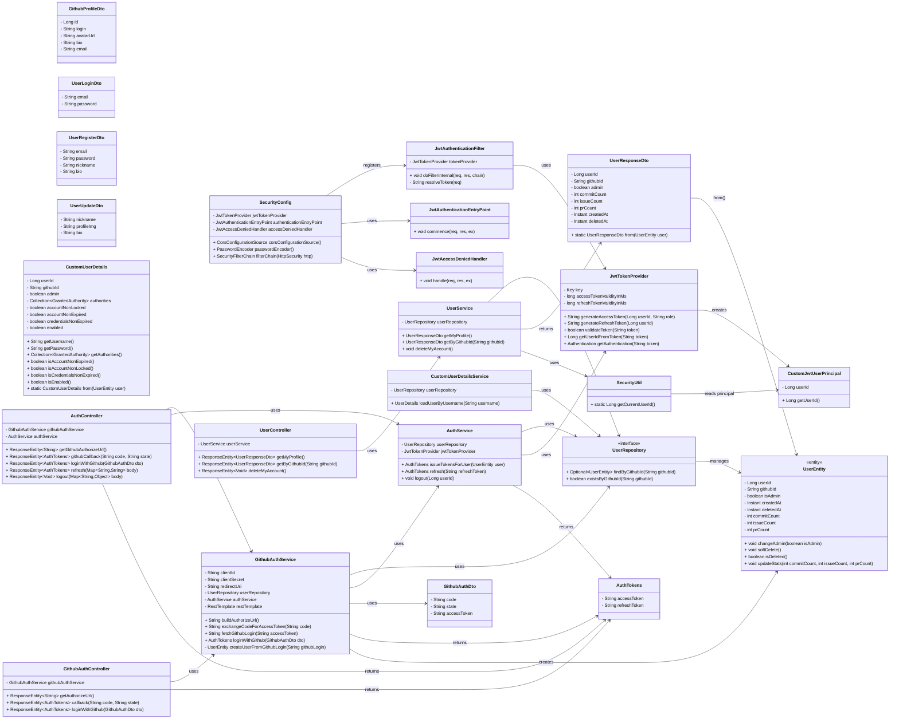


#### Entity Class

| Class Name        | UserEntity                         |         |            |
| ----------------- | ---------------------------------- | ------- | ---------- |
| Class Description | GitHub 계정 기반 사용자 정보를 저장하고 관리하는 엔티티 |         |            |
| 구분        | Name        | Type    | Visibility | Description                                   |
| --------- | ----------- | ------- | ---------- | --------------------------------------------- |
| Attribute | userId      | Long    | Private    | PK, 자동 증가(`IDENTITY`), ERD: `user_id`         |
| Attribute | githubId    | String  | Private    | GitHub 로그인 ID, 고유값, ERD: `github_id`          |
| Attribute | isAdmin     | boolean | Private    | 관리자 여부, ERD: `is_admin`                       |
| Attribute | createdAt   | Instant | Private    | 생성 시간, 최초 생성 시 자동 세팅, ERD: `created_at`       |
| Attribute | deletedAt   | Instant | Private    | 소프트 삭제 시간, 삭제되지 않은 경우 null, ERD: `deleted_at` |
| Attribute | commitCount | int     | Private    | 커밋 횟수, ERD: `commit_count`                    |
| Attribute | issueCount  | int     | Private    | 이슈 개수, ERD: `issue_count`                     |
| Attribute | prCount     | int     | Private    | PR 개수, ERD: `pr_count`                        |
| 구분       | Name       | Description                                   |
| -------- | ---------- | --------------------------------------------- |
| Callback | onCreate() | `@PrePersist` — createdAt 자동 세팅 및 통계 필드 0 초기화 |
| 구분     | Name                                                      | Return Type | Description                      |
| ------ | --------------------------------------------------------- | ----------- | -------------------------------- |
| Method | changeAdmin(boolean isAdmin)                              | void        | 사용자의 관리자 여부 변경                   |
| Method | softDelete()                                              | void        | 현재 시간을 deletedAt에 기록하여 소프트 삭제 처리 |
| Method | isDeleted()                                               | boolean     | deletedAt이 null이 아니면 탈퇴한 사용자로 판단 |
| Method | updateStats(int commitCount, int issueCount, int prCount) | void        | GitHub 통계 일괄 업데이트                |


#### DTO Class

| Class Name        | AuthTokens                             |        |            |
| ----------------- | ----------------------------------------- | ------ | ---------- |
| Class Description | 인증 후 발급되는 Access Token / Refresh Token 묶음 DTO |        |            |
| 구분        | Name         | Type   | Visibility | Description                        |
| --------- | ------------ | ------ | ---------- | ---------------------------------- |
| Attribute | accessToken  | String | Private    | 클라이언트 요청에 사용되는 JWT Access Token    |
| Attribute | refreshToken | String | Private    | Access Token 갱신용 JWT Refresh Token |


| Class Name        | GithubAuthDto                             |        |            |
| ----------------- | ----------------------------------------- | ------ | ---------- |
| Class Description | 깃허브 OAuth 인증 시 전달되는 인증 코드 및 상태 정보를 담는 DTO |        |            |
| 구분        | Name        | Type   | Visibility | Description                          |
| --------- | ----------- | ------ | ---------- | ------------------------------------ |
| Attribute | code        | String | Private    | GitHub 인증 과정에서 받은 authorization code |
| Attribute | state       | String | Private    | CSRF 방지용 state 값                     |
| Attribute | accessToken | String | Private    | GitHub에서 발급한 OAuth Access Token      |


| Class Name        | GithubProfileDto              |         |            |
| ----------------- | ----------------------------- | ------- | ---------- |
| Class Description | GitHub 사용자 프로필 정보를 담는 DTO |         |            |
| 구분        | Name      | Type   | Visibility | Description                |
| --------- | --------- | ------ | ---------- | -------------------------- |
| Attribute | id        | Long   | Private    | GitHub numeric id (고유 번호)  |
| Attribute | login     | String | Private    | GitHub username (로그인 ID)   |
| Attribute | avatarUrl | String | Private    | GitHub 프로필 이미지 URL         |
| Attribute | bio       | String | Private    | GitHub 프로필 소개 문구           |
| Attribute | email     | String | Private    | GitHub 이메일 (비공개 시 null 가능) |


| Class Name        | UserLoginDto                           |        |            |
| ----------------- | ------------------------------------- | ------ | ---------- |
| Class Description | 일반 이메일/비밀번호 기반 로그인 요청 DTO |        |            |
| 구분        | Name     | Type   | Visibility | Description               |
| --------- | -------- | ------ | ---------- | ------------------------- |
| Attribute | email    | String | Private    | 사용자 로그인 이메일               |
| Attribute | password | String | Private    | 사용자 비밀번호(평문, 서버에서 암호화 처리) |

| Class Name        | UserRegisterDto                           |        |            |
| ----------------- | ------------------------------------- | ------ | ---------- |
| Class Description | 일반 이메일/비밀번호 기반 로그인 요청 DTO |        |            |
| 구분        | Name     | Type   | Visibility | Description            |
| --------- | -------- | ------ | ---------- | ---------------------- |
| Attribute | email    | String | Private    | 회원가입 이메일(로그인 ID)       |
| Attribute | password | String | Private    | 회원 비밀번호(저장 전 해시 처리 예정) |
| Attribute | nickname | String | Private    | 서비스 내에서 사용할 닉네임        |
| Attribute | bio      | String | Private    | 한 줄 소개 / 자기소개          |


| Class Name        | UserResponseDto                           |        |            |
| ----------------- | ------------------------------------- | ------ | ---------- |
| Class Description | 클라이언트로 반환하는 사용자 정보 응답 DTO |        |            |
| 구분        | Name        | Type    | Visibility | Description              |
| --------- | ----------- | ------- | ---------- | ------------------------ |
| Attribute | userId      | Long    | Private    | 사용자 PK                   |
| Attribute | githubId    | String  | Private    | 사용자 GitHub ID (연동 계정)    |
| Attribute | admin       | boolean | Private    | 관리자 여부                   |
| Attribute | commitCount | int     | Private    | 누적 커밋 수                  |
| Attribute | issueCount  | int     | Private    | 누적 이슈 개수                 |
| Attribute | prCount     | int     | Private    | 누적 PR 개수                 |
| Attribute | createdAt   | Instant | Private    | 계정 생성 시각                 |
| Attribute | deletedAt   | Instant | Private    | 계정 삭제(탈퇴) 시각, 미탈퇴 시 null |
| 구분     | Name                  | Return Type     | Description                              |
| ------ | --------------------- | --------------- | ---------------------------------------- |
| Method | from(UserEntity user) | UserResponseDto | UserEntity를 기반으로 응답 DTO로 변환하는 정적 팩토리 메서드 |

| Class Name        | UserUpdateDto                           |        |            |
| ----------------- | ------------------------------------- | ------ | ---------- |
| Class Description | 마이페이지 등에서 사용자 프로필 수정 요청에 사용하는 DTO |        |            |
| 구분        | Name       | Type   | Visibility | Description     |
| --------- | ---------- | ------ | ---------- | --------------- |
| Attribute | nickname   | String | Private    | 변경할 닉네임         |
| Attribute | profileImg | String | Private    | 변경할 프로필 이미지 URL |
| Attribute | bio        | String | Private    | 변경할 자기소개/한 줄 소개 |


#### Repository Class

| Class Name        | UserRepository                                           |                      |            |
| ----------------- | -------------------------------------------------------- | -------------------- | ---------- |
| Class Description | UserEntity에 대한 CRUD 및 사용자 검색용 JPA Repository |                      |            |
| 구분     | Name                              | Return Type          | Description        |
| ------ | --------------------------------- | -------------------- | ------------------ |
| Method | findByGithubId(String githubId)   | Optional<UserEntity> | github_id로 사용자 조회  |
| Method | existsByGithubId(String githubId) | boolean              | github_id 존재 여부 확인 |


#### Security Class

| Class Name        | JwtTokenProvider                          |        |            |
| ----------------- | ----------------------------------------- | ------ | ---------- |
| Class Description | JWT Access/Refresh 토큰 생성·검증·파싱 담당         |        |            |
| 구분        | Name                     | Type | Visibility | Description      |
| --------- | ------------------------ | ---- | ---------- | ---------------- |
| Attribute | key                      | Key  | Private    | 서명 검증용 Key 객체    |
| Attribute | accessTokenValidityInMs  | long | Private    | 액세스토큰 유효 시간(ms)  |
| Attribute | refreshTokenValidityInMs | long | Private    | 리프레시토큰 유효 시간(ms) |
| 구분     | Name                                          | Return Type    | Description                            |
| ------ | --------------------------------------------- | -------------- | ---------------------------------------- |
| Method | generateAccessToken(Long userId, String role) | String         | Access Token 생성                          |
| Method | generateRefreshToken(Long userId)             | String         | Refresh Token 생성                         |
| Method | validateToken(String token)                   | boolean        | JWT 서명 및 만료 검증                           |
| Method | getUserIdFromToken(String token)              | Long           | JWT Payload에서 userId(subject) 추출         |
| Method | getAuthentication(String token)               | Authentication | SecurityContext에 넣을 Authentication 객체 생성 |


| Class Name        | JwtAuthenticationFilter                                              |                  |            |
| ----------------- | -------------------------------------------------------------------- | ---------------- | ---------- |
| 구분        | Name          | Type             | Visibility    | Description   |
| --------- | ------------- | ---------------- | ------------- | ------------- |
| Attribute | tokenProvider | JwtTokenProvider | Private/Final | JWT 생성·검증 제공자 |
| 구분     | Name                                 | Return Type | Description                                 |
| ------ | ------------------------------------ | ----------- | ------------------------------------------- |
| Method | doFilterInternal(...)                | void        | JWT 검증 후 SecurityContext에 Authentication 저장 |
| Method | resolveToken(HttpServletRequest req) | String      | Authorization 헤더에서 Bearer Token 추출          |


| Class Name        | JwtAuthenticationEntryPoint                                     |                        |            |
| ----------------- | -------------------------------------------------------- | ---------------------- | ---------- |
| 구분                    | Name                            | Type | Visibility |
| --------------------- | ------------------------------- | ---- | ---------- |
| **Class Name**        | JwtAuthenticationEntryPoint     |      |            |
| **Class Description** | 인증 실패(401 Unauthorized) 시 처리 담당 |      |            |
| 구분     | Name          | Return Type | Description       |
| ------ | ------------- | ----------- | ----------------- |
| Method | commence(...) | void        | 인증 실패 시 401 응답 전송 |


| Class Name        | JwtAccessDeniedHandler                                           |                             |            |
| ----------------- | --------------------------------------------------------- | --------------------------- | ---------- |
| 구분                    | Name                         | Type | Visibility |
| --------------------- | ---------------------------- | ---- | ---------- |
| **Class Name**        | JwtAccessDeniedHandler       |      |            |
| **Class Description** | 인가 실패(403 Forbidden) 시 처리 담당 |      |            |
| 구분     | Name        | Return Type | Description       |
| ------ | ----------- | ----------- | ----------------- |
| Method | handle(...) | void        | 권한 부족 시 403 응답 전송 |


| Class Name        | CustomUserDetailsService            |      |            |
| ----------------- | -------------------------------------- | ---- | ---------- |
| 구분                    | Name                                       | Type | Visibility |
| --------------------- | ------------------------------------------ | ---- | ---------- |
| **Class Name**        | CustomUserDetailsService                   |      |            |
| **Class Description** | GitHub ID 기반 사용자 조회(UserDetailsService 구현) |      |            |
| 구분        | Name           | Type           | Visibility    | Description        |
| --------- | -------------- | -------------- | ------------- | ------------------ |
| Attribute | userRepository | UserRepository | Private/Final | 사용자 조회용 Repository |
| 구분     | Name                                | Return Type | Description                             |
| ------ | ----------------------------------- | ----------- | --------------------------------------- |
| Method | loadUserByUsername(String githubId) | UserDetails | github_id로 유저 조회 후 CustomUserDetails 생성 |


| Class Name        | CustomUserDetails                |      | ---------- |
| ----------------- | ------------------------------------- | ---- | ---------- |
| 구분                    | Name                                             | Type | Visibility |
| --------------------- | ------------------------------------------------ | ---- | ---------- |
| **Class Name**        | CustomUserDetails                                |      |            |
| **Class Description** | UserEntity를 Spring Security의 UserDetails로 변환한 객체 |      |            |
| 구분        | Name                  | Type                                   | Visibility | Description             |
| --------- | --------------------- | -------------------------------------- | ---------- | ----------------------- |
| Attribute | userId                | Long                                   | Private    | 사용자 PK                  |
| Attribute | githubId              | String                                 | Private    | GitHub ID (username 대체) |
| Attribute | admin                 | boolean                                | Private    | 관리자 여부                  |
| Attribute | authorities           | Collection<? extends GrantedAuthority> | Private    | 역할/권한                   |
| Attribute | accountNonLocked      | boolean                                | Private    | 계정 잠김 여부                |
| Attribute | accountNonExpired     | boolean                                | Private    | 계정 만료 여부                |
| Attribute | credentialsNonExpired | boolean                                | Private    | 자격 만료 여부                |
| Attribute | enabled               | boolean                                | Private    | 활성화 여부(탈퇴 user=false)   |
| 구분     | Name                      | Return Type       | Description          |
| ------ | ------------------------- | ----------------- | -------------------- |
| Method | from(UserEntity user)     | CustomUserDetails | 엔티티 → UserDetails 변환 |
| Method | getAuthorities()          | Collection        | 권한 반환                |
| Method | getUsername()             | String            | GitHub ID 반환         |
| Method | getPassword()             | String            | (OAuth만 사용 → null)   |
| Method | isAccountNonLocked()      | boolean           | 잠김 여부                |
| Method | isAccountNonExpired()     | boolean           | 만료 여부                |
| Method | isCredentialsNonExpired() | boolean           | 자격증명 만료 여부           |
| Method | isEnabled()               | boolean           | 계정 활성 여부             |

| Class Name        | SecurityConfig                                      |                        |            |
| ----------------- | -------------------------------------------------------- | ---------------------- | ---------- |
| 구분                    | Name                               | Type | Visibility |
| --------------------- | ---------------------------------- | ---- | ---------- |
| **Class Name**        | SecurityConfig                     |      |            |
| **Class Description** | Spring Security 설정(필터, 권한, CORS 등) |      |            |
| 구분        | Name                     | Type                        | Visibility    | Description  |
| --------- | ------------------------ | --------------------------- | ------------- | ------------ |
| Attribute | jwtTokenProvider         | JwtTokenProvider            | Private/Final | JWT Provider |
| Attribute | authenticationEntryPoint | JwtAuthenticationEntryPoint | Private/Final | 401 에러 처리    |
| Attribute | accessDeniedHandler      | JwtAccessDeniedHandler      | Private/Final | 403 에러 처리    |
| 구분     | Name                           | Return Type             | Description            |
| ------ | ------------------------------ | ----------------------- | ---------------------- |
| Method | corsConfigurationSource()      | CorsConfigurationSource | CORS 설정 생성             |
| Method | passwordEncoder()              | PasswordEncoder         | BCrypt PasswordEncoder |
| Method | filterChain(HttpSecurity http) | SecurityFilterChain     | 전체 Security 설정 로직      |

| Class Name        | SecurityUtil                                    |                        |            |
| ----------------- | -------------------------------------------------------- | ---------------------- | ---------- |
| 구분                    | Name                                          | Type | Visibility |
| --------------------- | --------------------------------------------- | ---- | ---------- |
| **Class Name**        | SecurityUtil                                  |      |            |
| **Class Description** | SecurityContext에서 현재 로그인한 userId를 가져오는 유틸 클래스 |      |            |
| 구분     | Name               | Return Type | Description                            |
| ------ | ------------------ | ----------- | -------------------------------------- |
| Method | getCurrentUserId() | Long        | SecurityContext의 principal에서 userId 추출 |


#### Service Class

| Class Name        | AuthService                                                        |            |            |
| ----------------- | ------------------------------------------------------------------ | ---------- | ---------- |
| Class Description | GitHub 로그인, 로그아웃, 토큰 재발급 등 인증 관련 핵심 로직 담당                          |            |            |
| 구분        | Name             | Type             | Visibility      | Description         |
| --------- | ---------------- | ---------------- | --------------- | ------------------- |
| Attribute | userRepository   | UserRepository   | Private / Final | 사용자 조회용 JPA 리포지토리   |
| Attribute | jwtTokenProvider | JwtTokenProvider | Private / Final | JWT 생성 및 검증 담당 컴포넌트 |
| 구분     | Name                                | Return Type | Description                                                                      |
| ------ | ----------------------------------- | ----------- | -------------------------------------------------------------------------------- |
| Method | issueTokensForUser(UserEntity user) | AuthTokens  | GitHub OAuth 등을 통해 확보된 UserEntity 기반으로 역할(is_admin) 확인 후 Access/Refresh 토큰 세트 발급 |
| Method | refresh(String refreshToken)        | AuthTokens  | 전달받은 Refresh Token을 검증 후, 유저 상태를 확인하고 새 Access/Refresh Token 재발급                 |
| Method | logout(Long userId)                 | void        | 현재 구조에서는 stateless JWT 이므로 별도 처리 없이 로그아웃 훅 제공(추후 블랙리스트/저장소 도입 시 확장 가능)           |


| Class Name        | GithubAuthService                                                           |            |            |
| ----------------- | --------------------------------------------------------------------------- | ---------- | ---------- |
| Class Description | 깃허브 OAuth 인증 절차 및 GitHub 사용자 정보 연동 로직 수행                                    |            |            |
| 구분        | Name           | Type           | Visibility      | Description                               |
| --------- | -------------- | -------------- | --------------- | ----------------------------------------- |
| Attribute | clientId       | String         | Private         | GitHub OAuth Client ID (환경설정에서 주입)        |
| Attribute | clientSecret   | String         | Private         | GitHub OAuth Client Secret (환경설정에서 주입)    |
| Attribute | redirectUri    | String         | Private         | GitHub OAuth Redirect URI                 |
| Attribute | userRepository | UserRepository | Private / Final | GitHub 로그인(github_id) 기준 사용자 조회/저장용 리포지토리 |
| Attribute | authService    | AuthService    | Private / Final | 인증 토큰 발급 로직(AuthTokens 생성) 담당 서비스         |
| Attribute | restTemplate   | RestTemplate   | Private / Final | GitHub API 호출용 HTTP 클라이언트                 |
| 구분     | Name                                          | Return Type | Description                                                                                    |
| ------ | --------------------------------------------- | ----------- | ---------------------------------------------------------------------------------------------- |
| Method | buildAuthorizeUrl()                           | String      | 프론트에서 GitHub 로그인 버튼 클릭 시 사용할 `https://github.com/login/oauth/authorize` URL 생성                 |
| Method | exchangeCodeForAccessToken(String code)       | String      | GitHub가 넘겨준 인가 코드(code)를 이용해 Access Token으로 교환                                                 |
| Method | fetchGithubLogin(String accessToken)          | String      | GitHub API(`/user`) 호출로 프로필 조회 후 `login` 값을 github_id로 사용                                      |
| Method | loginWithGithub(GithubAuthDto dto)            | AuthTokens  | ① accessToken 없으면 code로 교환 → ② GitHub login 조회 → ③ 기존 유저 조회 or 신규 생성 → ④ AuthService 통해 JWT 발급 |
| Method | createUserFromGithubLogin(String githubLogin) | UserEntity  | GitHub로 처음 로그인한 사용자를 ERD 규칙에 맞게 생성 후 저장 (is_admin=false, 통계 0, createdAt=now 등)                |

| Class Name        | UserService                                        |                 |            |
| ----------------- | -------------------------------------------------- | --------------- | ---------- |
| Class Description | 사용자 정보 조회, 탈퇴(소프트 삭제) 등 일반 사용자 관리 로직 담당            |                 |            |
| 구분        | Name           | Type           | Visibility      | Description          |
| --------- | -------------- | -------------- | --------------- | -------------------- |
| Attribute | userRepository | UserRepository | Private / Final | 사용자 조회/저장용 JPA 리포지토리 |
| 구분     | Name                           | Return Type     | Description                                                     |
| ------ | ------------------------------ | --------------- | --------------------------------------------------------------- |
| Method | getMyProfile()                 | UserResponseDto | SecurityContext의 userId를 기준으로 내 프로필과 GitHub 통계 정보를 조회하여 DTO로 반환 |
| Method | getByGithubId(String githubId) | UserResponseDto | github_id 기준 사용자 정보를 조회하여 DTO로 반환(관리자/내부용)                      |
| Method | deleteMyAccount()              | void            | 현재 로그인한 사용자를 조회 후 soft delete(`user.softDelete()`) 수행           |


#### Controller Class

| Class Name        | AuthController                                                  |                            |            |
| ----------------- | --------------------------------------------------------------- | -------------------------- | ---------- |
| Class Description | GitHub 로그인, 로그아웃, 토큰 재발급 요청을 처리하는 컨트롤러                          |                            |            |
| 구분        | Name              | Type              | Visibility      | Description                   |
| --------- | ----------------- | ----------------- | --------------- | ----------------------------- |
| Attribute | githubAuthService | GithubAuthService | Private / Final | GitHub OAuth 및 로그인 처리 서비스     |
| Attribute | authService       | AuthService       | Private / Final | 토큰 재발급, 로그아웃 등 인증 비즈니스 로직 서비스 |
| 구분     | Name                                      | Return Type                | Description                                                                                 |
| ------ | ----------------------------------------- | -------------------------- | ------------------------------------------------------------------------------------------- |
| Method | getGithubAuthorizeUrl()                   | ResponseEntity<String>     | 프론트에서 GitHub 로그인 버튼 클릭 시, GitHub 인증 페이지로 이동할 authorize URL 반환 (`GET /github/authorize-url`) |
| Method | githubCallback(String code, String state) | ResponseEntity<AuthTokens> | GitHub에서 콜백으로 넘겨준 code/state로 GitHub 인증 및 JWT 발급 수행 (`GET /github/callback`)                |
| Method | loginWithGithub(GithubAuthDto dto)        | ResponseEntity<AuthTokens> | SPA 환경 등에서 code를 body로 받아 GitHub 로그인 처리 (`POST /github/login`)                              |
| Method | refresh(Map<String,String> body)          | ResponseEntity<AuthTokens> | 리프레시 토큰을 이용해 Access/Refresh 토큰 재발급 (`POST /refresh`)                                        |
| Method | logout(Map<String,Object> body)           | ResponseEntity<Void>       | 로그아웃 요청 처리, 필요 시 userId 기반 후처리 가능 (`POST /logout`)                                          |

| Class Name        | GithubAuthController                                                  |                            |            |
| ----------------- | --------------------------------------------------------------- | -------------------------- | ---------- |
| Class Description | GitHub OAuth 로그인 전용 엔드포인트를 제공하는 컨트롤러                          |                            |            |
| 구분        | Name              | Type              | Visibility      | Description                  |
| --------- | ----------------- | ----------------- | --------------- | ---------------------------- |
| Attribute | githubAuthService | GithubAuthService | Private / Final | GitHub OAuth 인증 및 로그인 처리 서비스 |
| 구분     | Name                                | Return Type                | Description                                                                |
| ------ | ----------------------------------- | -------------------------- | -------------------------------------------------------------------------- |
| Method | getAuthorizeUrl()                   | ResponseEntity<String>     | GitHub 로그인 버튼 클릭 시 사용할 authorize URL 반환 (`GET /authorize-url`)             |
| Method | callback(String code, String state) | ResponseEntity<AuthTokens> | GitHub OAuth 콜백 처리, code/state로 로그인 후 JWT 토큰 반환 (`GET /callback`)          |
| Method | loginWithGithub(GithubAuthDto dto)  | ResponseEntity<AuthTokens> | 프론트에서 이미 code → accessToken 교환 완료 후 accessToken만 보내는 경우 처리 (`POST /login`) |


| Class Name        | UserController                                 |                                 |            |
| ----------------- | ---------------------------------------------- | ------------------------------- | ---------- |
| Class Description | 현재 사용자 정보 조회, 계정 탈퇴 요청을 처리하는 컨트롤러              |                                 |            |
| 구분        | Name        | Type        | Visibility      | Description                    |
| --------- | ----------- | ----------- | --------------- | ------------------------------ |
| Attribute | userService | UserService | Private / Final | 사용자 정보 조회 및 계정 삭제 로직을 처리하는 서비스 |
| 구분     | Name                           | Return Type                     | Description                                                       |
| ------ | ------------------------------ | ------------------------------- | ----------------------------------------------------------------- |
| Method | getMyProfile()                 | ResponseEntity<UserResponseDto> | 현재 로그인한 사용자의 프로필 정보 조회 (`GET /me`)                                |
| Method | getByGithubId(String githubId) | ResponseEntity<UserResponseDto> | github_id 기준 특정 사용자 정보 조회 (관리자용 예시) (`GET /by-github/{githubId}`) |
| Method | deleteMyAccount()              | ResponseEntity<Void>            | 현재 로그인한 사용자의 소프트 삭제(탈퇴) 처리 (`DELETE /me`)                         |


### 스터디 관리


#### Entity Class

| Class Name        | StudyEntity               |               |            |
| ----------------- | ------------------------- | ------------- | ---------- |
| Class Description | 스터디 기본 정보를 표현하는 엔티티       |               |            |
| 구분                | Name                      | Type          | Visibility |
| Attribute         | study_id<br>스터디 식별자(PK)   | Long          | Private    |
|                   | leader_id<br>스터디 리더       | UserEntity    | Private    |
|                   | title<br>스터디 제목           | String        | Private    |
|                   | description<br>스터디 설명     | String        | Private    |
|                   | category<br>스터디 카테고리      | StudyCategory | Private    |
|                   | max_member<br>최대 인원 수     | int           | Private    |
|                   | current_member<br>현재 인원 수 | int           | Private    |
|                   | status<br>스터디 상태          | StudyStatus   | Private    |
|                   | created_at<br>생성 일시       | LocalDateTime | Private    |
|                   | updated_at<br>수정 일시       | LocalDateTime | Private    |
| 구분                | Name                      | Type          | Visibility |
| Operations        |                           |               |            |

#### Repository Class

| Class Name        | StudyRepository                                     |                       |            |
| ----------------- | --------------------------------------------------- | --------------------- | ---------- |
| Class Description | StudyEntity에 대한 데이터 접근을 담당하는 인터페이스                  |                       |            |
| 구분                | Name                                                | Type                  | Visibility |
| Attribute         |                                                     |                       |            |
| 구분                | Name                                                | Type                  | Visibility |
| Operations        | findByCategory(category: String)<br>카테고리별 스터디 목록 조회 | List<StudyEntity>     | Public     |
|                   | findByIdWithLeader(studyId: Long)<br>리더 포함 상세 조회    | Optional<StudyEntity> | Public     |
|                   | existsByTitle(title: String)<br>스터디명 중복 여부 검사       | boolean               | Public     |
|                   | save(entity: StudyEntity)<br>스터디 생성 및 수정            | StudyEntity           | Public     |
|                   | deleteById(studyId: Long)<br>스터디 삭제                 | void                  | Public     |

#### Service Class

| Class Name        | StudyService                                                   |                            |            |
| ----------------- | -------------------------------------------------------------- | -------------------------- | ---------- |
| Class Description | 스터디 생성, 수정, 삭제등을 수정하는 클래스                                      |                            |            |
| 구분                | Name                                                           | Type                       | Visibility |
| Attribute         | studyRepository<br>스터디 DB 접근 객체                                | StudyRepository            | Private    |
| 구분                | Name                                                           | Type                       | Visibility |
| Operations        | createStudy(dto: StudyCreateDto, leaderId: String)<br>새 스터디 생성 | StudyDetailResponseDto     | Public     |
|                   | updateStudy(studyId: Long, dto: StudyUpdateDto)<br>스터디 정보 수정   | StudyDetailResponseDto     | Public     |
|                   | deleteStudy(studyId: Long)<br>스터디 삭제                           | void                       | Public     |
|                   | getStudyList(category: String)<br>카테고리별 스터디 목록 조회              | List<StudyListResponseDto> | Public     |
|                   | getStudyDetail(studyId: Long)<br>스터디 상세 조회                     | StudyDetailResponseDto     | Public     |

#### Controller Class

| Class Name        | StudyController                                                 |                        |            |
| ----------------- | --------------------------------------------------------------- | ---------------------- | ---------- |
| Class Description | 클라이언트로부터 스터디 관련 요청을 받아 Service를 호출하고 처리하는 컨트롤러                  |                        |            |
| 구분                | Name                                                            | Type                   | Visibility |
| Attribute         | studyService<br>스터디 서비스 객체                                      | StudyService           | Private    |
| 구분                | Name                                                            | Type                   | Visibility |
| Operations        | getStudyList(category: String)<br>스터디 목록 요청 처리                  | List<StudyResponseDto> | Public     |
|                   | getStudyDetail(studyId: Long)<br>스터디 상세 요청 처리                   | StudyDetailDto         | Public     |
|                   | createStudy(dto: StudyCreateDto)<br>스터디 생성 요청 처리                | StudyResponseDto       | Public     |
|                   | updateStudy(studyId: Long, dto: StudyUpdateDto)<br>스터디 수정 요청 처리 | StudyResponseDto       | Public     |
|                   | deleteStudy(studyId: Long)<br>스터디 삭제 요청 처리                      | void                   | Public     |

#### DTO Class

| Class Name        | StudyCreateDto        |        |            |
| ----------------- | --------------------- | ------ | ---------- |
| Class Description | 스터디 생성 요청 시 전달되는 dto  |        |            |
| 구분                | Name                  | Type   | Visibility |
| Attribute         | title<br>스터디 제목       | String | Private    |
|                   | description<br>스터디 설명 | String | Private    |
|                   | category<br>스터디 카테고리  | String | Private    |
|                   | maxMember<br>최대 인원    | int    | Private    |
| 구분                | Name                  | Type   | Visibility |
| Operations        |                       |        |            |

| Class Name        | StudyUpdateDto        |        |            |
| ----------------- | --------------------- | ------ | ---------- |
| Class Description | 스터디 수정 요청 시 전달되는 dto  |        |            |
| 구분                | Name                  | Type   | Visibility |
| Attribute         | title<br>스터디 제목       | String | Private    |
|                   | description<br>스터디 설명 | String | Private    |
|                   | category<br>스터디 카테고리  | String | Private    |
|                   | status<br>스터디 상태      | String | Private    |
| 구분                | Name                  | Type   | Visibility |
| Operations        |                       |        |            |

| Class Name        | StudyListResponseDto    |        |            |
| ----------------- | ----------------------- | ------ | ---------- |
| Class Description | 스터디 목록 조회 시 반환되는 dto    |        |            |
| 구분                | Name                    | Type   | Visibility |
| Attribute         | study_id<br>스터디 식별자     | Long   | Private    |
|                   | title<br>스터디 제목         | String | Private    |
|                   | category<br>스터디 카테고리    | String | Private    |
|                   | leader_name<br>리더 닉네임   | String | Private    |
|                   | current_member<br>현재 인원 | int    | Private    |
|                   | max_member<br>최대 인원     | int    | Private    |
|                   | status<br>스터디 상태        | String | Private    |
| 구분                | Name                    | Type   | Visibility |
| Operations        |                         |        |            |

| Class Name        | StudyDetailResponseDto   |                                |            |
| ----------------- | ------------------------ | ------------------------------ | ---------- |
| Class Description | 스터디 상세 조회 시 반환되는 dto     |                                |            |
| 구분                | Name                     | Type                           | Visibility |
| Attribute         | study_id<br>스터디 식별자      | Long                           | Private    |
|                   | title<br>스터디 제목          | String                         | Private    |
|                   | description<br>스터디 설명    | String                         | Private    |
|                   | category<br>스터디 카테고리     | String                         | Private    |
|                   | status<br>스터디 상태         | String                         | Private    |
|                   | currentMember<br>현재 인원 수 | int                            | Private    |
|                   | maxMember<br>최대 인원 수     | int                            | Private    |
|                   | schedules<br>스터디 일정 목록   | List<StudyScheduleResponseDto> | Private    |
|                   | members<br>스터디 멤버 목록     | List<StudyMemberResponseDto>   | Private    |
|                   | myRole<br>현재 사용자 역할      | String                         | Private    |
| 구분                | Name                     | Type                           | Visibility |
| Operations        |                          |                                |            |

#### Repository Class

| Class Name        | StudyRepository |               |            |
| ----------------- | ---------------- | ------------- | ---------- |
| Class Description | 스터디 기본 정보(StudyEntity)에 대한 CRUD 및 검색 기능을 수행하는 Repository 인터페이스 |               |            |
| 구분 | Name | Type | Visibility |
| Attribute | — | — | — |
| Operations | save(study: StudyEntity) | StudyEntity | public |
|  | findById(studyId: Long) | Optional<StudyEntity> | public |
|  | findAll() | List<StudyEntity> | public |
|  | findByCategory(category: StudyCategory) | List<StudyEntity> | public |
|  | findByStatus(status: StudyStatus) | List<StudyEntity> | public |
|  | delete(study: StudyEntity) | void | public |
| Return | 스터디 엔티티 데이터 접근 계층 | — | — |

---

#### Repository Class

| Class Name        | StudyMemberRepository |               |            |
| ----------------- | --------------------- | ------------- | ---------- |
| Class Description | 스터디 멤버(참여자, 신청자)에 대한 데이터 접근 및 상태 관리 Repository |               |            |
| 구분 | Name | Type | Visibility |
| Attribute | — | — | — |
| Operations | findByStudyId(studyId: Long) | List<StudyMemberEntity> | public |
|  | findByUserId(userId: Long) | List<StudyMemberEntity> | public |
|  | existsByStudyIdAndUserId(studyId: Long, userId: Long) | boolean | public |
|  | save(member: StudyMemberEntity) | StudyMemberEntity | public |
|  | delete(member: StudyMemberEntity) | void | public |
| Return | 스터디 참여자 데이터 접근 계층 | — | — |

---

#### Repository Class

| Class Name        | StudyScheduleRepository |               |            |
| ----------------- | ----------------------- | ------------- | ---------- |
| Class Description | 스터디 일정 등록, 수정, 삭제, 조회를 담당하는 Repository 인터페이스 |               |            |
| 구분 | Name | Type | Visibility |
| Attribute | — | — | — |
| Operations | findByStudyId(studyId: Long) | List<StudyScheduleEntity> | public |
|  | findById(scheduleId: Long) | Optional<StudyScheduleEntity> | public |
|  | save(schedule: StudyScheduleEntity) | StudyScheduleEntity | public |
|  | delete(schedule: StudyScheduleEntity) | void | public |
| Return | 일정 데이터 접근 계층 | — | — |

---

#### Repository Class

| Class Name        | NotificationRepository |               |            |
| ----------------- | ---------------------- | ------------- | ---------- |
| Class Description | 알림 생성, 조회, 읽음 상태 변경을 위한 데이터 접근 Repository |               |            |
| 구분 | Name | Type | Visibility |
| Attribute | — | — | — |
| Operations | findByUserId(userId: Long) | List<NotificationEntity> | public |
|  | findUnreadByUserId(userId: Long) | List<NotificationEntity> | public |
|  | save(notification: NotificationEntity) | NotificationEntity | public |
|  | deleteById(notificationId: Long) | void | public |
| Return | 알림 데이터 접근 계층 | — | — |

---

#### Service Class

| Class Name        | StudyService |               |            |
| ----------------- | ------------- | ------------- | ---------- |
| Class Description | 스터디 생성, 수정, 삭제, 상세 조회 등의 비즈니스 로직 담당 |               |            |
| 구분 | Name | Type | Visibility |
| Attribute | studyRepository | StudyRepository | private |
|  | userRepository | UserRepository | private |
| Operations | createStudy(dto: StudyCreateDto, leaderId: Long) | StudyEntity | public |
|  | updateStudy(studyId: Long, dto: StudyUpdateDto) | StudyEntity | pu러 |               |            |
| 구분 | Name | Type | Visibility |
| Attribute | studyMemberService | StudyMemberService | private |
| Operations | applyJoin(dto: StudyApplyRequestDto) | ResponseEntity<Void> | public |
|  | approveJoin(dto: StudyApproveRequestDto) | ResponseEntity<Void> | public |
|  | leaveStudy(studyId: Long) | ResponseEntity<Void> | public |
|  | kickMember(studyId: Long, userId: Long) | ResponseEntity<Void> | public |
| Return | 멤버 관련 요청 처리 컨트롤러 | — | — |

---

#### Controller Class

| Class Name        | StudyScheduleController |               |            |
| ----------------- | ----------------------- | ------------- | ---------- |
| Class Description | 스터디 일정 등록, 수정, 삭제, 조회 요청을 처리하는 컨트롤러 |               |            |
| 구분 | Name | Type | Visibility |
| Attribute | studyScheduleService | StudyScheduleService | private |
| Operations | createSchedule(dto: StudyScheduleCreateDto, studyId: Long) | ResponseEntity<Void> | public |
|  | updateSchedule(scheduleId: Long, dto: StudyScheduleUpdateDto) | ResponseEntity<Void> | public |
|  | deleteSchedule(scheduleId: Long) | ResponseEntity<Void> | public |
|  | getSchedules(studyId: Long) | ResponseEntity<List<StudyScheduleResponseDto>> | public |
| Return | 일정 요청 처리 컨트롤러 | — | — |

---

#### Controller Class

| Class Name        | NotificationController |               |            |
| ----------------- | ---------------------- | ------------- | ---------- |
| Class Description | 알림 목록 조회 및 읽음 처리 요청을 처리하는 REST Controller |               |            |
| 구분 | Name | Type | Visibility |
| Attribute | notificationService | NotificationService | private |
| Operations | getNotifications(userId: Long) | ResponseEntity<List<NotificationResponseDto>> | public |
|  | markAsRead(notificationId: Long) | ResponseEntity<Void> | public |
|  | deleteNotification(notificationId: Long) | ResponseEntity<Void> | public |
| Return | 알림 요청 처리 컨트롤러 | — | — |


### 스터디 멤버 관리


#### Entity Class

| Class Name        | StudyMemberEntity           |                 |            |
| ----------------- | --------------------------- | --------------- | ---------- |
| Class Description | 특정 스터디에 참여하는 회원 정보를 저장는 엔티티 |                 |            |
| 구분                | Name                        | Type            | Visibility |
| Attribute         | memberId<br>스터디 멤버 식별자(PK)  | Long            | Private    |
|                   | study<br>소속 스터디 참조          | StudyEntity     | Private    |
|                   | userId<br>회원 참조             | UserEntity      | Private    |
|                   | role<br>스터디 내 역할            | StudyRole       | Private    |
|                   | status<br>참여 상태             | StudyJoinStatus | Private    |
|                   | joinedAt<br>가입일시            | LocalDateTime   | Private    |
| 구분                | Name                        | Type            | Visibility |
| Operations        |                             |                 |            |


#### DTO Class

| Class Name        | StudyApplyRequestDto        |        |            |
| ----------------- | --------------------------- | ------ | ---------- |
| Class Description | 스터디 참여 신청 시 요청 정보를 전달하는 dto |        |            |
| 구분                | Name                        | Type   | Visibility |
| Attribute         | studyId<br>스터디 식별자          | Long   | Private    |
|                   | leaderId<br>리더 식별자          | String | Private    |
|                   | userId<br>신청자 식별자           | String | Private    |

| Class Name        | StudyApproveRequestDto       |                |            |
| ----------------- | ---------------------------- | -------------- | ---------- |
| Class Description | 스터디장의 승인/거절 요청 데이터를 전달하는 dto |                |            |
| 구분                | Name                         | Type           | Visibility |
| Attribute         | memberId<br>신청 멤버 식별자        | Long           | Private    |
|                   | action<br>처리 결과(승인/거절)       | String or Enum | Private    |

| Class Name        | StudyKickRequestDto    |      |            |
| ----------------- | ---------------------- | ---- | ---------- |
| Class Description | 스터디 강퇴 요청 시 전달되는 dto   |      |            |
| 구분                | Name                   | Type | Visibility |
| Attribute         | memberId<br>강퇴할 멤버 식별자 | Long | Private    |

| Class Name        | StudyLeaveRequestDto  |        |            |
| ----------------- | --------------------- | ------ | ---------- |
| Class Description | 스터디 탈퇴 요청 시 전달되는 dto  |        |            |
| 구분                | Name                  | Type   | Visibility |
| Attribute         | studyId<br>소속 스터디 식별자 | Long   | Private    |
|                   | userId<br>탈퇴할 사용자 식별자 | String | Private    |

| Class Name        | StudyMemberResponseDto         |        |            |
| ----------------- | ------------------------------ | ------ | ---------- |
| Class Description | 스터디 멤버 목록 조회 시 반환되는 응답 데이터 dto |        |            |
| 구분                | Name                           | Type   | Visibility |
| Attribute         | memberId                       | Long   | Private    |
|                   | userId                         | String | Private    |
|                   | nickname                       | String | Private    |
|                   | role                           | String | Private    |
|                   | status                         | String | Private    |


#### Repository Class

| Class Name        | StudyMemberRepository                                                     |                             |            |
| ----------------- | ------------------------------------------------------------------------- | --------------------------- | ---------- |
| Class Description | 스터디 멤버 정보를 저장, 조회, 삭제하는 데이터 접근 인터페이스                                      |                             |            |
| 구분                | Name                                                                      | Type                        | Visibility |
| Operations        | findByStudyIdAndUserId(Long studyId, String userId)<br>특정 스터디 내 사용자 관계 조회 | Optional<StudyMemberEntity> | Public     |
|                   | findByStudyId(Long studyId)<br>스터디 전체 멤버 목록 조회                            | List<StudyMemberEntity>     | Public     |
|                   | countMembers(Long studyId)<br>현재 스터디 인원 수 반환                              | int                         | Public     |
|                   | deleteByStudyIdAndUserId(Long studyId, String userId)<br>멤버 탈퇴/강퇴 시 관계 삭제 | void                        | Public     |


#### Service Class

| Class Name        | StudyMemberService                                     |                              |            |
| ----------------- | ------------------------------------------------------ | ---------------------------- | ---------- |
| Class Description | 스터디 멤버의 신청, 승인, 거절, 탈퇴, 강퇴 등 멤버 관리 로직을 수행              |                              |            |
| 구분                | Name                                                   | Type                         | Visibility |
| Attribute         | studyMemberRepository<br>스터디 멤버 데이터 접근 계층              | StudyMemberRepository        | Private    |
|                   | notificationService<br>알림 기능 연동                        | NotificationService          | Private    |
| 구분                | Name                                                   | Type                         | Visibility |
| Operations        | applyStudy(StudyApplyRequestDto dto)<br>스터디 참여 신청 처리   | void                         | Public     |
|                   | approveMember(StudyApproveRequestDto dto)<br>스터디 가입 승인 | void                         | Public     |
|                   | rejectMember(StudyApproveRequestDto dto)<br>스터디 가입 거절  | void                         | Public     |
|                   | leaveStudy(StudyLeaveRequestDto dto)<br>스터디 탈퇴         | void                         | Public     |
|                   | kickMember(StudyKickRequestDto dto)<br>스터디 강퇴          | void                         | Public     |
|                   | getMembers(Long studyId)<br>스터디 멤버 목록 조회               | List<StudyMemberResponseDto> | Public     |


#### Controller Class

| Class Name        | StudyMemberController                                          |                              |            |
| ----------------- | -------------------------------------------------------------- | ---------------------------- | ---------- |
| Class Description | 클라이언트로부터 스터디 멤버 관리 요청을 받아 Service를 호출하고 처리하는 컨트롤러              |                              |            |
| 구분                | Name                                                           | Type                         | Visibility |
| Attribute         | studyMemberService<br>스터디 멤버 서비스 계층                            | StudyMemberService           | Private    |
| 구분                | Name                                                           | Type                         | Visibility |
| Operations        | getMembers(Long studyId)<br>스터디 멤버 목록 조회                       | List<StudyMemberResponseDto> | Public     |
|                   | checkDuplicateJoin(Long studyId, String userId)<br>중복 가입 여부 확인 | boolean                      | Public     |
|                   | requestJoinStudy(StudyApplyRequestDto dto)<br>스터디 참여 신청        | StudyMemberResponseDto       | Public     |
|                   | approveJoin(StudyApproveRequestDto dto)<br>스터디 참여 승인           | void                         | Public     |
|                   | rejectJoin(StudyApproveRequestDto dto)<br>스터디 참여 거절            | void                         | Public     |
|                   | leaveStudy(StudyLeaveRequestDto dto)<br>스터디 탈퇴                 | void                         | Public     |
|                   | expelMember(StudyKickRequestDto dto)<br>스터디 강퇴                 | void                         | Public     |


### 스터디 일정 관리


#### Entity Class

| Class Name            | StudyScheduleEntity                                                                                       |               |                |
| --------------------- | --------------------------------------------------------------------------------------------------------- | ------------- | -------------- |
| **Class Description** | 스터디의 일정 정보를 저장하고 관리하는 엔티티                                                                                 |               |                |
| **구분**                | **Name**                                                                                                  | **Type**      | **Visibility** |
| **Attribute**         | scheduleId<br>스터디 일정 식별자(PK)                                                                              | Long          | Private        |
|                       | study<br>소속 스터디 참조                                                                                        | StudyEntity   | Private        |
|                       | title<br>일정 제목                                                                                            | String        | Private        |
|                       | description<br>일정 설명                                                                                      | String        | Private        |
|                       | startTime<br>시작 일시                                                                                        | LocalDateTime | Private        |
|                       | endTime<br>종료 일시                                                                                          | LocalDateTime | Private        |
|                       | createdAt<br>생성 일시                                                                                        | LocalDateTime | Private        |
|                       | updatedAt<br>수정 일시                                                                                        | LocalDateTime | Private        |
| **구분**                | **Name**                                                                                                  | **Type**      | **Visibility** |
| **Operations**        | updateSchedule(String title, String description, LocalDateTime startTime, LocalDateTime endTime)<br>일정 수정 | void          | Public         |
|                       | getDuration()<br>일정 기간 계산                                                                                 | Duration      | Public         |

#### DTO Class

| Class Name            | StudyScheduleCreateDto                      |                     |                |
| --------------------- | ------------------------------------------- | ------------------- | -------------- |
| **Class Description** | 일정 등록 시 클라이언트로부터 입력받는 데이터를 전달하는 DTO         |                     |                |
| **구분**                | **Name**                                    | **Type**            | **Visibility** |
| **Attribute**         | title<br>일정 제목                              | String              | Private        |
|                       | description<br>일정 설명                        | String              | Private        |
|                       | startTime<br>시작 일시                          | LocalDateTime       | Private        |
|                       | endTime<br>종료 일시                            | LocalDateTime       | Private        |
| **구분**                | **Name**                                    | **Type**            | **Visibility** |
| **Operations**        | toEntity(StudyEntity study)<br>DTO를 엔티티로 변환 | StudyScheduleEntity | Public         |

| Class Name            | StudyScheduleUpdateDto                                           |               |                |
| --------------------- | ---------------------------------------------------------------- | ------------- | -------------- |
| **Class Description** | 일정 수정 시 변경할 정보를 전달하는 DTO                                         |               |                |
| **구분**                | **Name**                                                         | **Type**      | **Visibility** |
| **Attribute**         | scheduleId<br>수정 대상 일정 식별자                                       | Long          | Private        |
|                       | title<br>일정 제목                                                   | String        | Private        |
|                       | description<br>일정 설명                                             | String        | Private        |
|                       | startTime<br>시작 일시                                               | LocalDateTime | Private        |
|                       | endTime<br>종료 일시                                                 | LocalDateTime | Private        |
| **구분**                | **Name**                                                         | **Type**      | **Visibility** |
| **Operations**        | applyToEntity(StudyScheduleEntity entity)<br>기존 일정 데이터에 수정 내용 반영 | void          | Public         |


| Class Name            | StudyScheduleResponseDto                                   |                          |                |
| --------------------- | ---------------------------------------------------------- | ------------------------ | -------------- |
| **Class Description** | 일정 조회 시 클라이언트로 반환되는 응답 데이터 DTO                             |                          |                |
| **구분**                | **Name**                                                   | **Type**                 | **Visibility** |
| **Attribute**         | scheduleId<br>일정 식별자                                       | Long                     | Private        |
|                       | title<br>일정 제목                                             | String                   | Private        |
|                       | description<br>일정 설명                                       | String                   | Private        |
|                       | startTime<br>시작 일시                                         | LocalDateTime            | Private        |
|                       | endTime<br>종료 일시                                           | LocalDateTime            | Private        |
|                       | createdAt<br>생성 일시                                         | LocalDateTime            | Private        |
|                       | updatedAt<br>수정 일시                                         | LocalDateTime            | Private        |
| **구분**                | **Name**                                                   | **Type**                 | **Visibility** |
| **Operations**        | fromEntity(StudyScheduleEntity entity)<br>엔티티 데이터를 DTO로 변환 | StudyScheduleResponseDto | Public         |


#### Repository Class

| Class Name            | StudyScheduleRepository                                                    |                               |                |
| --------------------- | -------------------------------------------------------------------------- | ----------------------------- | -------------- |
| **Class Description** | 스터디 일정 데이터를 저장, 조회, 수정, 삭제하는 데이터 접근 인터페이스                                  |                               |                |
| **구분**                | **Name**                                                                   | **Type**                      | **Visibility** |
| **Operations**        | findByStudyId(Long studyId)<br>스터디별 일정 목록 조회                               | List<StudyScheduleEntity>     | Public         |
|                       | findById(Long scheduleId)<br>단일 일정 조회                                      | Optional<StudyScheduleEntity> | Public         |
|                       | save(StudyScheduleEntity entity)<br>일정 등록 및 수정                             | StudyScheduleEntity           | Public         |
|                       | deleteByStudyIdAndScheduleId(Long studyId, Long scheduleId)<br>스터디 내 일정 삭제 | void                          | Public         |


#### Service Class

| Class Name            | StudyScheduleService                                                  |                                |                |
| --------------------- | --------------------------------------------------------------------- | ------------------------------ | -------------- |
| **Class Description** | 스터디 일정을 관리하느 ㄴ로직                                                      |                                |                |
| **구분**                | **Name**                                                              | **Type**                       | **Visibility** |
| **Attribute**         | studyScheduleRepository<br>일정 데이터 접근 계층                               | StudyScheduleRepository        | Private        |
|                       | notificationService                                                   | NotificationService            | Private        |
| **구분**                | **Name**                                                              | **Type**                       | **Visibility** |
| **Operations**        | createSchedule(StudyScheduleCreateDto dto, Long studyId)<br>스터디 일정 등록 | StudyScheduleResponseDto       | Public         |
|                       | updateSchedule(StudyScheduleUpdateDto dto)<br>스터디 일정 수정               | StudyScheduleResponseDto       | Public         |
|                       | deleteSchedule(Long studyId, Long scheduleId)<br>스터디 일정 삭제            | void                           | Public         |
|                       | getSchedules(Long studyId)<br>스터디 일정 목록 조회                            | List<StudyScheduleResponseDto> | Public         |
|                       | getScheduleById(Long scheduleId)<br>스터디 일정 상세 조회                      | StudyScheduleResponseDto       | Public         |


#### Controller Class

| Class Name            | StudyScheduleController                                               |                                |                |
| --------------------- | --------------------------------------------------------------------- | ------------------------------ | -------------- |
| **Class Description** | 클라이언트 요청을 받아 Service를 호출하고 일정 데이터를 반환하는 컨트롤러                          |                                |                |
| **구분**                | **Name**                                                              | **Type**                       | **Visibility** |
| **Attribute**         | studyScheduleService<br>스터디 일정 서비스 계층                                 | StudyScheduleService           | Private        |
| **구분**                | **Name**                                                              | **Type**                       | **Visibility** |
| **Operations**        | getSchedules(Long studyId)<br>스터디 일정 목록 조회                            | List<StudyScheduleResponseDto> | Public         |
|                       | getSchedule(Long scheduleId)<br>스터디 일정 상세 조회                          | StudyScheduleResponseDto       | Public         |
|                       | createSchedule(Long studyId, StudyScheduleCreateDto dto)<br>스터디 일정 등록 | StudyScheduleResponseDto       | Public         |
|                       | updateSchedule(StudyScheduleUpdateDto dto)<br>스터디 일정 수정               | StudyScheduleResponseDto       | Public         |
|                       | deleteSchedule(Long studyId, Long scheduleId)<br>스터디 일정 삭제            | void                           | Public         |


### 알림


### Entity Class

| Class Name        | NotificationEntity               |                  |            |
| ----------------- | -------------------------------- | ---------------- | ---------- |
| Class Description | 사용자에게 전달되는 시스템 알림 정보를 저장하는 엔티티   |                  |            |
| 구분                | Name                             | Type             | Visibility |
| Attribute         | notificationId<br>알림 고유 식별자 (PK) | Long             | Private    |
|                   | user<br>수신자 정보                   | UserEntity       | Private    |
|                   | message<br>알림 내용                 | String           | Private    |
|                   | type<br>알림 유형                    | NotificationType | Private    |
|                   | isRead<br>읽음 여부                  | Boolean          | Private    |
|                   | createdAt<br>생성 시각               | LocalDateTime    | Private    |
| Operations        | markAsRead()                     | void             | Public     |
|                   | getMessageSummary()              | String           | Public     |

### DTO Class

| Class Name        | NotificationResponseDto       |                         |            |
| ----------------- | ----------------------------- | ----------------------- | ---------- |
| Class Description | 알림 데이터를 사용자에게 전달하기 위한 DTO     |                         |            |
| 구분                | Name                          | Type                    | Visibility |
| Attribute         | notificationId                | Long                    | Private    |
|                   | message                       | String                  | Private    |
|                   | type                          | String                  | Private    |
|                   | isRead                        | Boolean                 | Private    |
|                   | createdAt                     | LocalDateTime           | Private    |
| Operations        | of(NotificationEntity entity) | NotificationResponseDto | Public     |
#### Repository Class

| Class Name        | NotificationRepository                    |                          |            |
| ----------------- | ----------------------------------------- | ------------------------ | ---------- |
| Class Description | 알림 엔티티에 대한 데이터베이스 접근을 담당                  |                          |            |
| 구분                | Name                                      | Return Type              | Visibility |
| Operations        | findByUser(UserEntity user)               | List<NotificationEntity> | Public     |
|                   | findByUserAndIsReadFalse(UserEntity user) | List<NotificationEntity> | Public     |
|                   | save(NotificationEntity entity)           | NotificationEntity       | Public     |
|                   | deleteById(Long id)                       | void                     | Public     |
#### Service Class

| Class Name        | NotificationService                           |                               |            |
| ----------------- | --------------------------------------------- | ----------------------------- | ---------- |
| Class Description | 알림 생성, 조회, 상태 변경 등 비즈니스 로직을 담당                |                               |            |
| 구분                | Name                                          | Return Type                   | Visibility |
| Operations        | notifyJoinRequest(Long studyId, Long userId)  | void                          | Public     |
|                   | notifyJoinApproved(Long memberId)             | void                          | Public     |
|                   | notifyJoinDenied(Long memberId)               | void                          | Public     |
|                   | notifyMemberLeft(Long studyId, Long userId)   | void                          | Public     |
|                   | notifyMemberKicked(Long memberId)             | void                          | Public     |
|                   | notifyMembersNewSchedule(Long studyId)        | void                          | Public     |
|                   | notifyMembersScheduleUpdated(Long scheduleId) | void                          | Public     |
|                   | notifyMembersScheduleDeleted(Long scheduleId) | void                          | Public     |
|                   | getNotifications(Long userId)                 | List<NotificationResponseDto> | Public     |
|                   | markAsRead(Long notificationId)               | void                          | Public     |
#### Controller Class

| Class Name        | NotificationController                  |                                               |            |
| ----------------- | --------------------------------------- | --------------------------------------------- | ---------- |
| Class Description | 클라이언트 요청을 받아 알림을 조회하거나 읽음 처리하는 컨트롤러     |                                               |            |
| 구분                | Name                                    | Return Type                                   | Visibility |
| Operations        | getUserNotifications(Long userId)       | ResponseEntity<List<NotificationResponseDto>> | Public     |
|                   | markAsRead(Long notificationId)         | ResponseEntity<Void>                          | Public     |
|                   | deleteNotification(Long notificationId) | ResponseEntity<Void>                          | Public     |


### 게시판


- 바운더리 클래스와의 연결은 표시하지 않음
- 컨트롤 클래스와 엔티티 클래스의 의존성 표시
  
### Entity Class
| Class Name        | User |               |            |
| ----------------- | ------------ | ------------- | ---------- |
| Class Description | 시스템 사용자 계정 정보를 관리하는 엔티티 |               |            |
| 구분 | Name | Type | Visibility |
| Attribute | user_id<br>사용자 고유 ID (PK)| String | private |
|  | user_name<br>사용자 닉네임 | String | private |
|  | role<br>사용자 역할 (USER, ADMIN) | String | private |
| 구분 | Name | Type | Visibility |
| Operations | isAdmin()<br>관리자 역할 여부 확인 | boolean | public |

| Class Name        | Post |               |            |
| ----------------- | ------------ | ------------- | ---------- |
| Class Description | 일반 커뮤니티 게시글 데이터를 저장하는 엔티티 |               |            |
| 구분 | Name | Type | Visibility |
| Attribute | post_id<br>게시글 식별자(PK)| Long | private |
|  | user_id<br>작성자 식별자(FK) | String | private |
|  | title<br>게시글 제목 | String| private |
|  | viewCount<br>게시글 조회수 | int| private |
| 구분 | Name | Type | Visibility |
| Operations | increaseViewCount()<br>게시글의 조회수를 1 증가 | void | public |
|  | update(data)<br>게시글 데이터 수정| void | Public |

| Class Name        | QnAPost |               |            |
| ----------------- | ------------ | ------------- | ---------- |
| Class Description | QnA 질문 게시글 데이터를 저장하는 엔티티 (Post 상속) |               |            |
| 구분 | Name | Type | Visibility |
| Attribute | post_id<br>게시글 식별자(PK)| Long | private |
|  | isAnswered<br>답변 완료 여부 | bool | private |
|  | techTag<br>질문과 관련된 기술 태그 | List<String>| private |
| 구분 | Name | Type | Visibility |
| Operations | markAsAnswered())<br>답변 상태를 '완료'로 변경 | void | public |

| Class Name        | Comment |               |            |
| ----------------- | ------------ | ------------- | ---------- |
| Class Description | 일반 게시글에 종속되는 댓글 데이터를 저장하는 엔티티|               |            |
| 구분 | Name | Type | Visibility |
| Attribute | comment_id<br>댓글 식별자(PK)| Long | private |
|  | post_id<br>원본 게시글 식별자(FK) | Long | private |
|  | user_id<br>작성자 식별자(FK) | String | private |
|  | content<br>댓글 내용 | String| private |
| 구분 | Name | Type | Visibility |
| Operations | updateContent(content)<br>댓글 내용 수정 | void | public |

| Class Name        | Answer |               |            |
| ----------------- | ------------ | ------------- | ---------- |
| Class Description | QnA 질문에 종속되는 답변 데이터를 저장하는 엔티티 |               |            |
| 구분 | Name | Type | Visibility |
| Attribute | answer_id<br>답 식별자(PK)| Long | private |
|  | qnaPost_id<br>원본 QnA 게시글 식별자(FK) | Long | private |
|  | user_id<br>작성자 식별자(FK) | String | private |
|  | isAdopted<br>채택 여부 | bool| private |
| 구분 | Name | Type | Visibility |
| Operations | adopt())<br>답변 채택 상태로 변경 | void | public |

### Control Class
| Class Name        | PostManagementService |               |            |
| ----------------- | ------------ | ------------- | ---------- |
| Class Description | 게시글 및 QnA 질문의 작성, 수정, 삭제와 관련된 모든 업무 로직을 담당하는 제어 클래스 |       |            |
| 구분 | Name | Type | Visibility |
| Attribute | postRepository<br>게시글(Post/QnAPost) 데이터 접근 객체 | PostRepository | private |
| 구분 | Name | Type | Visibility |
| Operations | createPost(User user, Post data)()<br>게시글 작성 및 QnA 게시글 작성을 처리(유효성 검증 포함) | Post | public |
|  | updatePost(User user, Long postId, Post updateData)<br>게시글 수정을 처리 (권한 및 내용 검증 포함) | Post | Public |
|  | deletePost(User user, Long postId)<br>게시글 삭제를 처리(작성자/관리자 권한 검증 포함) | void | Public |

| Class Name        | PostQueryService |               |            |
| ----------------- | ------------ | ------------- | ---------- |
| Class Description | 게시글의 목록 조회 및 상세 조회와 관련된 모든 읽기 로직을 담당하는 제어 클래스 |       |            |
| 구분 | Name | Type | Visibility |
| Attribute | postRepository<br>게시글(Post/QnAPost) 데이터 접근 객체 | PostRepository | private |
|  | commentRepository<br>댓글/답변 데이터 접근 객체(상세 조회시 사용) | CommentRepository | private |
| 구분 | Name | Type | Visibility |
| Operations | getPostList(BoardType type, int page)<br>게시글 목록 조회를 처리(페이징,정렬 포함) | List<Post> | public |
|  | getPostDetail(Long postId)<br>게시글 상세 조회를 처리(조회수 증가 및 댓글 조회 포함) | Post | Public |

| Class Name        | CommentManagementService |               |            |
| ----------------- | ------------ | ------------- | ---------- |
| Class Description | 댓글 및 답변의 작성, 수정, 삭제와 관련된 모든 로직을 담당하는 제어 클래스 |       |            |
| 구분 | Name | Type | Visibility |
| Attribute | commentRepository<br>댓글/답변 데이터 접근 객체 | CommentRepository | private |
| 구분 | Name | Type | Visibility |
| Operations | createComment(User user, Long postId, String content)<br>댓글 작성을 처리 | Comment | public |
|  | updateComment(User user, Long commentId, String content)<br>댓글 수정을 처리 | Comment | Public |
|  | deleteComment(User user, Long commentId)<br>댓글 삭제를 처리 | Void | Public |
|  | registerAnswer(User user, Long qnaPostId, String content)<br>QnA 게시글 답변 등록을 처리 | Answer | Public |

### Boundary Class
| Class Name        | PostListView |               |            |
| ----------------- | ------------ | ------------- | ---------- |
| Class Description | 게시글 목록 화면을 담당하는 경계 클래스 (UI/API Layer) |       |            |
| 구분 | Name | Type | Visibility |
| Attribute | postQueryService<br>목록 조회 로직을 호출할 제어 객체 | PostQueryService | private |
| 구분 | Name | Type | Visibility |
| Operations | requestPostList(type, page)<br>게시글 목록 조회 요청을 서비스로 전달 | void | public |
|  | updateComment(User user, Long commentId, String content)<br>댓글 수정을 처리 | void | Public |
|  | displayPostList(List<Post>)<br>조회된 게시글 목록을 사용자에게 표시 | Void | Public |

| Class Name        | PostDetailView |               |            |
| ----------------- | ------------ | ------------- | ---------- |
| Class Description | 게시글 상세 화면을 담당하는 경계 클래스 (UI/API Layer) |       |            |
| 구분 | Name | Type | Visibility |
| Attribute | postQueryService<br>상세조회 로직을 호출할 제어 객체 | PostQueryService | private |
|  | postManagementService<br>삭제/수정 요청을 호출할 제어 객체 | PostManagementService| private |
| 구분 | Name | Type | Visibility |
| Operations | requestPostDetail(postId)<br>게시글 상세조회 요청을 서비스로 전달 | void | public |
|  | requestDeletePost(postId)<br>게시글 삭제 요청을 서비스로 전달 | void | Public |
|  | displayDetail(Post, List<Comment>)<br>상세 내용 및 댓글 목록을 사용자에게 표시 | Void | Public |

| Class Name        | PostWriteUI |               |            |
| ----------------- | ------------ | ------------- | ---------- |
| Class Description | 게시글 작성/수정 폼을 담당하는 경계 클래스 (UI/API Layer) |       |            |
| 구분 | Name | Type | Visibility |
| Attribute | postManagementService<br>작성/수정 로직을 호출할 제어 객체 | PostManagementService | private |
| 구분 | Name | Type | Visibility |
| Operations | collectPostData()<br>사용자 입력 데이터 (제목/내용) 수집 | Post | public |
|  | submitPost(data)<br>게시글 작성/수정 요청을 서비스로 전달 | void | Public |

| Class Name        | CommentForm |               |            |
| ----------------- | ------------ | ------------- | ---------- |
| Class Description | 댓글/답변 작성/수정 폼을 담당하는 경계 클래스 (UI/API Layer) |       |            |
| 구분 | Name | Type | Visibility |
| Attribute | commentManagementService<br>댓글/답변 로직을 호출할 제어 객체 | CommentManagementService | private |
| 구분 | Name | Type | Visibility |
| Operations | collectCommentData()<br>사용자 입력 댓글 내용 수집 | String | public |
|  | submitComment(postId, content)<br>댓글 작성/답변 등록 요청을 서비스로 전달 | void | Public |

### 오픈소스 이슈 관리


- 엔티티 클래스의 연결은 표시하지 않음
- 컨트롤 클래스와 바운더리 클래스의 의존성 표시

#### Entity Class
| Class Name | Issue |   |   |
|---|---|---|---|
| Class Description | 오픈소스 리포지토리의 개별 이슈를 표현하고 상태·라벨·메타정보를 관리 |   |   |
| 구분 | Name | Type | Visibility |
| Attribute | issueId<br>플랫폼 전역 이슈 식별자(예: GitHub issue node/id) | String | Private |
|  | repositoryId<br>소속 리포지토리 식별자(owner/name 또는 내부 PK) | String | Private |
|  | title<br>이슈 제목 | String | Private |
|  | state<br>이슈 상태(OPEN/CLOSED 등) | String | Private |
|  | labels<br>이슈에 부착된 라벨 집합(중복 없음) | Set<IssueLabel> | Private |
|  | language<br>주요 언어(추천/필터링 보조용) | String | Private |
|  | createdAt<br>이슈 생성 시각 | Instant | Private |
|  | updatedAt<br>최근 업데이트 시각 | Instant | Private |
|  | comments<br>댓글(코멘트) 수 | Integer | Private |
|  | reactions<br>리액션 합계 | Integer | Private |
|  | authorId<br>작성자 식별자 | String | Private |
| 구분 | Name | Type | Visibility |
| Operations | isOpen()<br>현재 상태가 OPEN인지 여부 반환 | boolean | Public |
|  | hasLabel(String name)<br>라벨 존재 여부 | boolean | Public |
|  | labelCount()<br>UI·정렬 보조 | int | Public |
|  | age()<br>생성 이후 경과 시간. 정렬·스코어링 보조 | java.time.Duration | Public |

| Class Name | IssueBookmark |   |   |
|---|---|---|---|
| Class Description | 사용자별 이슈 북마크 상태 엔티티 |   |   |
| 구분 | Name | Type | Visibility |
| Attribute | userId<br>사용자 식별 | String | Private |
|  | issueId<br>이슈 식별 | String | Private |
|  | createdAt<br>북마크 생성 시각 | Instant | Private |
| 구분 | Name | Type | Visibility |
| Operations | getUserId()<br>userid 읽기 | String | Public |
|  | getIssueId()<br>issueid 읽기 | String | Public |
|  | getCreatedAt()<br>북마크 시각 | Instant | Public |
|  | equals(Object o)<br>(userId,issueId) 비교 | boolean | Public |
|  | hashCode()<br>(userId,issueId) 기반 | int | Public |

| Class Name | Repository |   |   |
|---|---|---|---|
| Class Description | 레포지토리 단위 식별, 정보 |   |   |
| 구분 | Name | Type | Visibility |
| Attribute | owner<br>리포 소유자 | String | Private |
|  | name<br>리포 명 | String | Private |
|  | url<br>리포 전체 URL | String | Private |
|  | defaultBranch<br>기본 브랜치명 | String | Private |
|  | topics<br>주제 태그 집합 | Set<String> | Private |
|  | syncedAt<br>최신 동기화 시각 | Instant | Private |
| 구분 | Name | Type | Visibility |
| Operations | getFullName()<br>owner와 name을 결합한 전체 이름 반환 | String | Public |

| Class Name | IssueLabel |   |   |
|---|---|---|---|
| Class Description | 이슈에 부착되는 라벨 단위 |   |   |
| 구분 | Name | Type | Visibility |
| Attribute | name<br>라벨명 | String | Private |
|  | color<br>표시 색상 코드 | String | Private |
|  | description<br>라벨 설명 | String | Private |
| 구분 | Name | Type | Visibility |
| Operations | isNamed(String n)<br>이름 비교 | boolean | Public |

#### Control Class
| Class Name | IssueService |   |   |
|---|---|---|---|
| Class Description | Issue 검색과 북마크 변경을 조합하는 도메인 제어 |   |   |
| 구분 | Name | Type | Visibility |
| Attribute | issueStore<br>DB 접근 | IssueStore | Private |
|  | searchIndex<br>검색 인덱스 | SearchIndex | Private |
| 구분 | Name | Type | Visibility |
| Operations | search(String keyword,List<String> labels,int limit)<br>검색 인덱스 기반 이슈 조회 | List<Issue> | Public |
|  | addBookmark(String userId,String issueId)<br>북마크 저장 | void | Public |
|  | removeBookmark(String userId,String issueId)<br>북마크 제거 | void | Public |

| Class Name | SyncService |   |   |
|---|---|---|---|
| Class Description | GitHub에서 가져온 최신 데이터를 DB와 인덱스를 동기화 |   |   |
| 구분 | Name | Type | Visibility |
| Attribute | gitHubGateway<br>github api 호출 | GitHubGateway | Private |
|  | repositoryStore<br>repository: 저장, 조회 포트 | RepositoryStore | Private |
|  | issueStore<br>issue: 저장, 조회 포트 | IssueStore | Private |
|  | searchIndex<br>검색 인덱스 갱신 포트 | SearchIndex | Private |
| 구분 | Name | Type | Visibility |
| Operations | syncRepository(String repositoryId)<br>지정 리포를 가져와 저장과 인덱싱까지 실행 | void | Public |

#### Boundary Class
| Class Name | IssueApi |   |   |
|---|---|---|---|
| Class Description | HTTP요청을 받아 IssueService 호출 |   |   |
| 구분 | Name | Type | Visibility |
| Attribute | issueService<br>컨트롤 계층 진입점 | IssueService | Private |
|  | userId<br>요청에서 추출한 사용자 식별 | String | Private |
| 구분 | Name | Type | Visibility |
| Operations | getIssues(IssueQuerySpec spec)<br>목록 조회 요청 처리 | List<Issue> | Public |
|  | addBookmark(String issueId)<br>북마크 추가 요청 처리 | void | Public |
|  | removeBookmark(String issueId)<br>북마크 삭제 요청 처리 | void | Public |

| Class Name | IssueStore |   |   |
|---|---|---|---|
| Class Description | Issue, IssueBookmark 접근 |   |   |
| 구분 | Name | Type | Visibility |
| 구분 | Name | Type | Visibility |
| Operations | find(IssueQuerySpec spec)<br>조건으로 이슈 페이지 조회 | List<Issue> | Public |
|  | saveIssue(Issue i)<br>이슈 insert or update | void | Public |
|  | saveBookmark(String userId,String issueId)<br>북마크 저장 | void | Public |
|  | deleteBookmark(String userId,String issueId)<br>북마크 삭제 | void | Public |
|  | existsBookmark(String userId,String issueId)<br>존재 여부 확인 | boolean | Public |

| Class Name | RepositoryStore |   |   |
|---|---|---|---|
| Class Description | 레포지토리 저장, 조회 |   |   |
| 구분 | Name | Type | Visibility |
| 구분 | Name | Type | Visibility |
| Operations | upsert(Repository repo)<br>단건 생성/갱신 | void | Public |
|  | findById(String repositoryId)<br>ID로 조회 | Optional<Repository> | Public |
|  | deleteByOwner(String owner)<br>소유자 기준 삭제 | long | Public |

| Class Name | GitHubGateway |   |   |
|---|---|---|---|
| Class Description | GitHub REST / GraphQL API 호출 |   |   |
| 구분 | Name | Type | Visibility |
| Attribute | httpClient<br>HTTP 클라이언트 | String | Private |
|  | token<br>액세스 토큰 | String | Private |
|  | baseUrl<br>GitHub API base | String | Private |
| 구분 | Name | Type | Visibility |
| Operations | fetchIssues(IssueQuerySpec spec)<br>GitHub 이슈 목록 호출 | List<Issue> | Public |
|  | fetchRepository(String owner,String name)<br>리포 조회 | Repository | Public |
|  | fetchLabels(String owner,String name)<br>라벨 목록 조회 | Set<IssueLabel> | Public |

| Class Name | SearchIndex |   |   |
|---|---|---|---|
| Class Description | 키워드 기반 이슈 검색 인덱스 어댑터 |   |   |
| 구분 | Name | Type | Visibility |
| Attribute | indexPath<br>인덱스 파일 저장 위치 | String | Private |
|  | language<br>형태소 분석 언어 | String | Private |
|  | defaultLimit<br>기본 검색 상한 | int | Private |
|  | timeoutMillis<br>타임아웃 ms | long | Private |
|  | highlightEnabled<br>하이라이트 사용 여부 | boolean | Private |
| 구분 | Name | Type | Visibility |
| Operations | putIssue(Issue issue)<br>단일 이슈 인덱싱 | void | Public |
|  | putAll(List<Issue> issues)<br>여러 이슈 일괄 인덱싱 | void | Public |
|  | searchIds(String keyword,List<String> labels,int limit)<br>조건으로 issueId 검색 | List<String> | Public |
|  | deleteIssue(String issueId)<br>이슈 인덱스 삭제 | void | Public |
|  | deleteByRepository(String repositoryId)<br>리포지토리 단위 인덱스 삭제 | void | Public |
|  | rebuild(List<Issue> issues)<br>전체 재인덱싱 | void | Public |
|  | healthy()<br>상태 확인 | boolean | Public |

### 기여도 및 도전과제


- 엔티티 클래스의 연결은 표시하지 않음
- 컨트롤 클래스와 바운더리 클래스의 의존성 표시

#### Entity Class
| Class Name | Challenge |   |   |
|---|---|---|---|
| Class Description | 도전과제 정의 |   |   |
| 구분 | Name | Type | Visibility |
| Attribute | challengeId<br>과제 식별 | String | Private |
|  | title<br>이름 | String | Private |
|  | conditions<br>완료 조건 텍스트 목록 | List<String> | Private |
|  | reward<br>보상 설명 | String | Private |
|  | active<br>활성 여부 | boolean | Private |
| 구분 | Name | Type | Visibility |
| Operations | isActive()<br>활성 여부 반환 | boolean | Public |

| Class Name | ChallengeProgress |   |   |
|---|---|---|---|
| Class Description | 사용자별 특정 과제 진행 상태 |   |   |
| 구분 | Name | Type | Visibility |
| Attribute | userId<br>사용자 식별 | String | Private |
|  | challengeId<br>과제 식별 | String | Private |
|  | progressRate<br>진행률 0~100 | int | Private |
|  | completedAt<br>완료 시각 null 가능 | Instant | Private |
|  | updatedAt<br>최근 갱신 시각 | Instant | Private |
| 구분 | Name | Type | Visibility |
| Operations | updateRate(int r)<br>진행률 갱신 0~100 범위 강제 | void | Public |
|  | isCompleted()<br>완료 여부 반환 | boolean | Public |
|  | markCompleted()<br>완료 플래그 처리 completedAt 설정 | void | Public |

| Class Name | ContributionBadge |   |   |
|---|---|---|---|
| Class Description | 기여 배지 |   |   |
| 구분 | Name | Type | Visibility |
| Attribute | userId<br>사용자 식별 | String | Private |
|  | badgeCode<br>배지 코드 식별 | String | Private |
|  | awardedAt<br>부여 시각 | Instant | Private |
|  | reason<br>부여 사유 | String | Private |
| 구분 | Name | Type | Visibility |
| Operations | getUserId()<br>사용자 식별 반환 | String | Public |
|  | getBadgeCode()<br>배지 코드 반환 | String | Public |
|  | getAwardedAt()<br>부여 시각 반환 | Instant | Public |
|  | getReason()<br>사유 텍스트 반환 | String | Public |
|  | equals(Object o)<br>(userId,badgeCode) 동일성 판단 | boolean | Public |
|  | hashCode()<br>(userId,badgeCode) 기반 | int | Public |

| Class Name | UserContributionStats |   |   |
|---|---|---|---|
| Class Description | 사용자별 기여 지표 집계 |   |   |
| 구분 | Name | Type | Visibility |
| Attribute | userId<br>사용자 식별 | String | Private |
|  | commits<br>커밋 수 | int | Private |
|  | prs<br>PR 수 | int | Private |
|  | issues<br>이슈 생성/해결 수 | int | Private |
|  | reviews<br>리뷰 수 | int | Private |
|  | score<br>종합 점수 | int | Private |
|  | ranking<br>전체 사용자 내 순위 | int | Private |
|  | period<br>집계 기간 식별 | String | Private |
| 구분 | Name | Type | Visibility |
| Operations | calcScore()<br>점수 재계산 | void | Public |
|  | setRanking(int r)<br>순위 갱신 | void | Public |

| Class Name | News |   |   |
|---|---|---|---|
| Class Description | OSS 뉴스 항목 |   |   |
| 구분 | Name | Type | Visibility |
| Attribute | newsId<br>뉴스 식별자 | String | Private |
|  | title<br>제목 | String | Private |
|  | url<br>원문 링크 | String | Private |
|  | source<br>제공 매체명 | String | Private |
|  | publishedAtEpochMillis<br>게시 시각 | long | Private |
|  | updatedAtEpochMillis<br>갱신 시각 | long | Private |
|  | tags<br>태그 목록 | List<String> | Private |
|  | thumbnailUrl<br>썸네일 이미지 링크 | String | Private |
| 구분 | Name | Type | Visibility |
| Operations | hasTag(String tag)<br>특정 태그 포함 여부 | boolean | Public |

#### Control Class
| Class Name | ChallengeService |   |   |
|---|---|---|---|
| Class Description | 도전과제 진행률 갱신과 완료 판정을 제어 |   |   |
| 구분 | Name | Type | Visibility |
| Attribute | challengeStore<br>DB 접근 | ChallengeStore | Private |
| 구분 | Name | Type | Visibility |
| Operations | listActive()<br>활성 과제 목록 조회 | List<Challenge> | Public |
|  | getMyProgress(String challengeId)<br>내 진행률 조회 | ChallengeProgress | Public |
|  | updateMyProgress(String challengeId,int rate)<br>내 진행률 갱신 | void | Public |
|  | completeMyChallenge(String challengeId)<br>내 과제 완료 처리 | void | Public |

| Class Name | ContributionService |   |   |
|---|---|---|---|
| Class Description | 기여 통계 조회·저장과 배지·랭킹 조회 |   |   |
| 구분 | Name | Type | Visibility |
| Attribute | challengeStore<br>DB 접근 | ChallengeStore | Private |
| 구분 | Name | Type | Visibility |
| Operations | getMyStats()<br>내 통계 조회 | UserContributionStats | Public |
|  | saveMyStats(UserContributionStats stats)<br>내 통계 저장 | void | Public |
|  | myBadges()<br>내 배지 목록 조회 | List<ContributionBadge> | Public |
|  | getBadge(String badgeCode)<br>배지 한 건 조회 | ContributionBadge | Public |
|  | applyDelta(String userId,int commits,int prs,int issues,int reviews)<br>증가량 반영 점수 재계산 저장 | void | Public |
|  | addCommits(String userId,int n)<br>커밋 n 증가 점수 재계산 저장 | void | Public |
|  | addPRs(String userId,int n)<br>PR n 증가 점수 재계산 저장 | void | Public |
|  | addIssues(String userId,int n)<br>이슈 n 증가 점수 재계산 저장 | void | Public |
|  | addReviews(String userId,int n)<br>리뷰 n 증가 점수 재계산 저장 | void | Public |

| Class Name | NewsService |   |   |
|---|---|---|---|
| Class Description | 뉴스 검색 정렬 페이징 조합 이동 URL 반환 |   |   |
| 구분 | Name | Type | Visibility |
| 구분 | Name | Type | Visibility |
| Operations | find(int page,int size,String keyword,List<String> tags,boolean recentFirst)<br>조건에 맞는 뉴스 목록 반환 | List<News> | Public |
|  | newsUrl(String newsId)<br>원문 URL 생성 | String | Public |

#### Boundary Class
| Class Name | ChallengeApi |   |   |
|---|---|---|---|
| Class Description | HTTP 요청을 받아 ChallengeService를 거쳐 도전과제 관련 서비스 호출 ChallengeStore로 전달 |   |   |
| 구분 | Name | Type | Visibility |
| Attribute | userId<br>인증 사용자 식별자 | String | Private |
|  | challengeStore<br>DB 게이트웨이 | ChallengeStore | Private |
| 구분 | Name | Type | Visibility |
| Operations | listActive()<br>활성 과제 목록 조회 | List<Challenge> | Public |
|  | getProgress(String challengeId)<br>특정 과제 진행 조회 | ChallengeProgress | Public |
|  | updateProgress(String challengeId,int rate)<br>진행률 갱신 | void | Public |
|  | complete(String challengeId)<br>완료 처리 | void | Public |

| Class Name | BadgeApi |   |   |
|---|---|---|---|
| Class Description | HTTP 요청을 받아 ChallengeService를 거쳐 ChallengeStore를 통해 배지 조회 |   |   |
| 구분 | Name | Type | Visibility |
| Attribute | userId<br>인증 사용자 식별자 | String | Private |
|  | challengeStore<br>DB 게이트웨이 | ChallengeStore | Private |
| 구분 | Name | Type | Visibility |
| Operations | listBadges()<br>내 배지 목록 조회 | List<ContributionBadge> | Public |
|  | getBadge(String badgeCode)<br>배지 한 건 조회 | ContributionBadge | Public |

| Class Name | RankingApi |   |   |
|---|---|---|---|
| Class Description | HTTP 요청 입력을 받아 ChallengeService를 거쳐 ChallengeStore를 통해 랭킹 조회 |   |   |
| 구분 | Name | Type | Visibility |
| Attribute | userId<br>인증 사용자 식별자 | String | Private |
|  | challengeStore<br>DB 게이트웨이 | ChallengeStore | Private |
| 구분 | Name | Type | Visibility |
| Operations | top(int limit)<br>상위 N 사용자 기여도 반환 | List<UserContributionStats> | Public |
|  | myRank()<br>authUserId 기준 내 랭킹 반환 | UserContributionStats | Public |

| Class Name | ChallengeStore |   |   |
|---|---|---|---|
| Class Description | 챌린지 관련 클래스에 대한 DB접근 게이트 웨이 |   |   |
| 구분 | Name | Type | Visibility |
| 구분 | Name | Type | Visibility |
| Operations | findActiveChallenges()<br>활성 Challenge 목록 조회 | List<Challenge> | Public |
|  | findProgress(String userId,String challengeId)<br>한 사용자 한 과제 진행 조회 | ChallengeProgress | Public |
|  | saveProgress(ChallengeProgress progress)<br>진행률 insert or update | void | Public |
|  | saveComplete(String userId,String challengeId)<br>완료 처리 | void | Public |
|  | findBadges(String userId)<br>사용자의 배지 목록 조회 | List<ContributionBadge> | Public |
|  | findBadge(String userId,String badgeCode)<br>배지 한 건 조회 | ContributionBadge | Public |
|  | saveBadge(ContributionBadge badge)<br>배지 insert | void | Public |
|  | findTop(int limit)<br>상위 기여도 순위 N명 조회 | List<UserContributionStats> | Public |
|  | findStats(String userId)<br>특정 사용자 기여 통계 조회 | UserContributionStats | Public |
|  | saveStats(UserContributionStats stats)<br>통계 insert or update | void | Public |

| Class Name | NewsApi |   |   |
|---|---|---|---|
| Class Description | HTTP요청을 받아 목록 조회 이동 기능을 NewsService로 |   |   |
| 구분 | Name | Type | Visibility |
| Attribute | newsService<br>컨트롤 계층 | NewsService | Private |
| 구분 | Name | Type | Visibility |
| Operations | list(int page,int size,String keyword,List<String> tags,boolean recentFirst)<br>뉴스 목록 조회 | List<News> | Public |
|  | goTo(String newsId)<br>뉴스 상세 원문으로 이동할 URL 반환 | String | Public |


---
## 4. Sequence diagram
## 유저
### 1. 회원가입

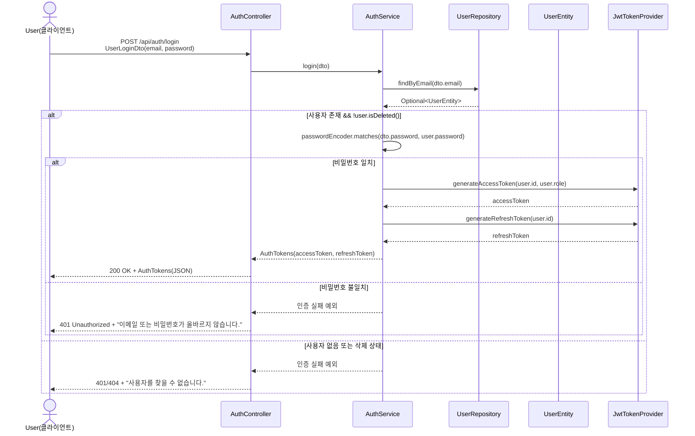

사용자가 웹에서 회원가입 페이지에 접속하면, 이메일과 비밀번호, 닉네임, 자기소개를 입력한 뒤 “회원가입” 버튼을 누른다. 이때 클라이언트는 사용자가 입력한 값들을 UserRegisterDto 형태의 JSON으로 만들어 POST /api/auth/register 요청을 서버로 보낸다. 이 요청을 받는 것은 AuthController이고, 컨트롤러는 HTTP 요청 본문을 DTO로 매핑한 뒤 실질적인 비즈니스 로직을 담당하는 AuthService.register(dto)를 호출한다.

AuthService 내부에서는 먼저 중복 가입을 막기 위해 UserRepository.existsByEmail(dto.getEmail())를 호출하여 동일한 이메일이 이미 DB에 존재하는지 확인한다. 만약 이미 가입된 이메일이라면 예외를 던져 컨트롤러를 통해 “이미 사용 중인 이메일입니다.”와 같은 에러 응답을 돌려보내고, 회원가입 절차는 여기서 종료된다. 중복이 아니라면, 서비스는 비밀번호를 평문 그대로 저장하지 않고 PasswordEncoder(BCrypt)를 사용하여 해시값으로 암호화한다. 그런 다음 이메일, 암호화된 비밀번호, 닉네임, bio, 기본 권한(Role.USER) 등을 포함하여 UserEntity를 생성한 후, 이를 UserRepository.save(user)를 통해 Supabase PostgreSQL의 users 테이블에 저장한다.

저장이 성공하면, 서비스는 방금 저장된 엔티티를 기반으로 UserResponseDto.from(user)를 호출하여 클라이언트에 전달할 응답 DTO를 만든다. 이 DTO에는 ID, 이메일, 닉네임, 권한, 생성일 등 사용자 정보가 담긴다. AuthController는 이 DTO를 응답 본문에 담고 HTTP 상태 코드는 201 Created로 설정하여 클라이언트에게 반환한다. 클라이언트는 응답을 받은 뒤 “회원가입이 완료되었습니다.” 같은 메시지를 띄우고, 사용자를 로그인 페이지나 메인 화면으로 이동시키는 식으로 마무리한다. 이 단계에서는 JWT 토큰은 발급되지 않고, 실제 로그인은 별도의 로그인 흐름에서 처리된다는 점이 특징이다.

### 2. 로그인(이메일/비밀번호)


사용자가 이미 가입된 계정으로 로그인하려고 할 때는 로그인 화면에서 이메일과 비밀번호를 입력하고 “로그인” 버튼을 클릭한다. 그러면 클라이언트는 이메일과 비밀번호를 담은 UserLoginDto JSON을 POST /api/auth/login 엔드포인트로 전송한다. 이 요청을 받은 AuthController는 DTO로 매핑된 로그인 정보를 들고 AuthService.login(dto)를 호출한다.

AuthService는 먼저 UserRepository.findByEmail(dto.getEmail())을 호출하여 해당 이메일을 가진 사용자가 DB에 존재하는지 확인한다. 사용자가 없으면 “등록되지 않은 이메일입니다.” 또는 “이메일 또는 비밀번호가 올바르지 않습니다.”와 같은 메시지를 담은 인증 실패 예외를 발생시키고, 컨트롤러가 이를 받아 401 Unauthorized 응답을 반환한다. 사용자가 존재한다면, 다음으로 PasswordEncoder.matches(dto.getPassword(), user.getPassword())를 호출하여 사용자가 입력한 비밀번호와 DB에 저장된 해시된 비밀번호가 실제로 일치하는지 확인한다. 이때 계정이 소프트 삭제 상태(deletedAt이 설정된 상태)라면, 비밀번호가 맞더라도 로그인 자체를 거부하는 로직을 둘 수 있다.

비밀번호 검증까지 성공하면, 이제 JwtTokenProvider가 등장한다. 서비스는 jwtTokenProvider.generateAccessToken(user.getId(), user.getRole().name())을 호출하여 사용자 ID와 권한 정보를 담은 Access Token을 생성하고, 이어서 jwtTokenProvider.generateRefreshToken(user.getId())로 Refresh Token을 생성한다. 두 토큰은 AuthTokens라는 DTO로 묶여서 AuthService에서 반환되고, AuthController는 이를 200 OK 상태와 함께 클라이언트로 보낸다. 클라이언트는 받은 Access Token과 Refresh Token을 LocalStorage나 쿠키와 같은 적절한 저장소에 보관하고, 이후 보호된 API를 호출할 때 Access Token을 Authorization: Bearer ... 형태로 헤더에 실어 인증에 사용한다.


### 3. GitHub 로그인(OAuth)
### 3-1. GitHub 로그인 URL 요청
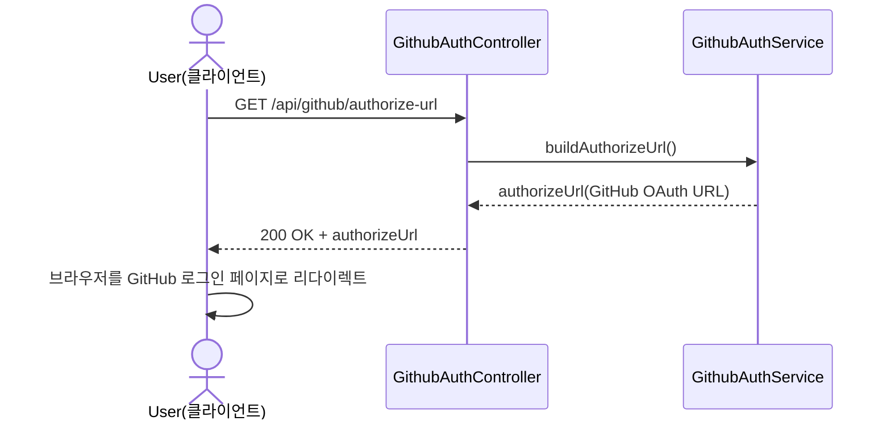
### GitHub 콜백 & 로그인 처리
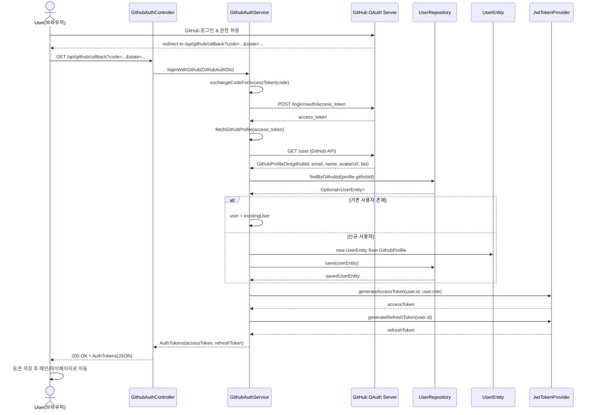
GitHub 로그인의 과정은 크게 두 단계로 나뉜다. 첫 번째는 “GitHub 로그인 URL을 받아오는 단계”이고, 두 번째는 “GitHub에서 콜백으로 전달한 코드로 실제 로그인을 처리하는 단계”이다. 사용자가 화면에서 “GitHub로 로그인” 버튼을 클릭하면, 클라이언트는 먼저 GET /api/github/authorize-url 요청을 보낸다. 이 요청은 GithubAuthController.getAuthorizeUrl()로 들어가고, 컨트롤러는 내부적으로 GithubAuthService.buildAuthorizeUrl()을 호출한다. 서비스는 GitHub에서 발급받은 clientId, redirectUri, 필요한 scope, 그리고 CSRF 방지를 위한 state 값을 조합하여 GitHub OAuth 인증 페이지의 URL을 동적으로 생성한 뒤 컨트롤러로 반환한다. 컨트롤러는 이 URL을 그대로 응답에 실어 보내고, 클라이언트는 사용자를 해당 GitHub 로그인 페이지로 리다이렉트한다.

사용자가 GitHub 로그인과 권한 동의를 모두 완료하면, GitHub는 프로젝트에 설정된 redirect-uri로 code와 state를 포함해 리다이렉트 요청을 보낸다. 이 요청은 GET /api/github/callback?code=...&state=... 형태로 서버의 GithubAuthController.callback()에 도착한다. 컨트롤러는 전달받은 code와 state 값을 GithubAuthDto에 담아 GithubAuthService.loginWithGithub(dto)를 호출한다. 서비스는 먼저 exchangeCodeForAccessToken(code)를 통해 GitHub 토큰 엔드포인트에 HTTP 요청을 보내 Authorization Code를 Access Token으로 교환한다. 이 Access Token을 이용해 fetchGithubProfile(accessToken)에서 GitHub API(/user 등)를 호출하여 GitHub 사용자 프로필 정보를 받아온다. 이때 얻는 정보에는 githubId, email, 이름, 아바타 URL, bio 등이 포함된다.

그 다음, 서비스는 UserRepository.findByGithubId(profile.getGithubId())를 호출해서 이 GitHub 계정이 이미 기존 사용자와 연동되어 있는지 확인한다. 이미 연동된 사용자가 있다면 그 엔티티를 그대로 사용하고, 없다면 GitHub 프로필 정보를 기반으로 새로운 UserEntity를 생성해서 save()를 통해 DB에 저장한다. 이렇게 로그인에 사용할 UserEntity가 준비되면, 로그인 흐름과 마찬가지로 JwtTokenProvider를 이용해 Access Token과 Refresh Token을 생성하고, 이를 AuthTokens로 포장하여 컨트롤러로 반환한다. 컨트롤러는 200 OK와 함께 이 토큰을 클라이언트에 전송하고, 클라이언트는 토큰을 저장한 뒤 메인 페이지나 마이페이지 등으로 사용자를 이동시켜 GitHub 계정 기반으로 로그인된 상태를 유지하게 된다.


### 4. 내 프로필 조회
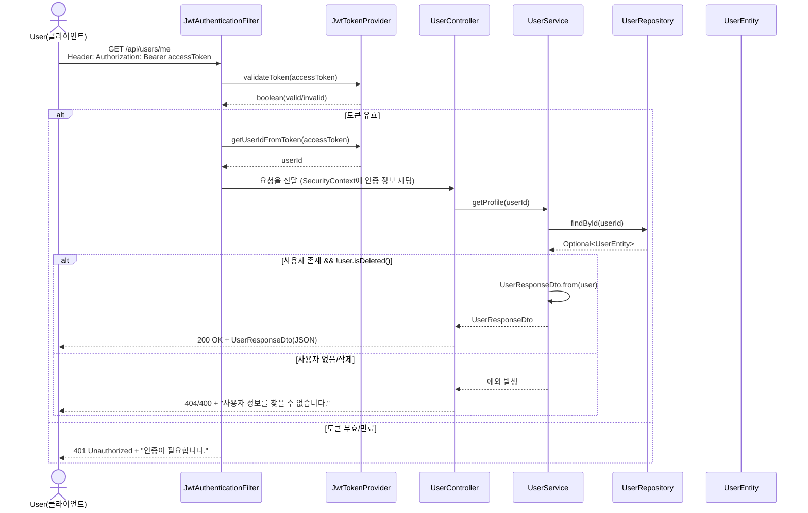

로그인한 사용자가 마이페이지에서 자신의 프로필 정보를 확인하려고 할 때, 클라이언트는 먼저 저장해 둔 Access Token을 Authorization: Bearer {token} 형태의 헤더에 포함하여 GET /api/users/me 요청을 보낸다. 이 요청은 Spring Security 필터 체인을 거치면서 JwtAuthenticationFilter에 의해 가로채진다. 필터는 헤더에서 JWT를 추출한 뒤 JwtTokenProvider.validateToken(token)을 사용해 이 토큰의 서명과 만료 여부를 검증한다. 토큰이 유효하지 않으면, 필터는 JwtAuthenticationEntryPoint를 호출하여 401 Unauthorized 응답을 반환하고, 이후 컨트롤러까지 요청이 도달하지 않도록 막는다.

토큰이 유효하다면, 필터는 다시 JwtTokenProvider.getUserIdFromToken(token)을 호출하여 토큰 내부에 저장된 사용자 ID를 추출한다. 추출된 userId는 Authentication 객체에 포함되어 SecurityContext에 저장되고, 이후 애플리케이션 계층에서 현재 로그인한 사용자의 정보를 획득하는 기준이 된다. 필터를 통과한 요청은 이제 UserController.getMyProfile()에 도달한다. 컨트롤러는 SecurityContext나 주입된 인증 객체에서 userId를 확인한 후, UserService.getProfile(userId)를 호출하여 실제 사용자 정보를 가져오도록 한다.

UserService는 UserRepository.findById(userId)를 사용해 DB에서 해당 ID를 가진 UserEntity를 조회한다. 사용자가 존재하고 삭제 상태가 아니라면, 서비스는 이 엔티티를 UserResponseDto.from(user)로 변환해 프로필용 DTO를 생성한다. DTO에는 이메일, 닉네임, GitHub 연동 여부, 프로필 이미지 URL, bio, 권한, 가입일 등의 정보가 담긴다. 이 DTO는 컨트롤러로 반환되고, 컨트롤러는 이를 이용해 200 OK와 함께 JSON 응답을 클라이언트로 보낸다. 클라이언트는 이 데이터를 화면에 렌더링하여 사용자가 자신의 정보를 확인할 수 있게 한다.


### 5. 내 프로필 수정
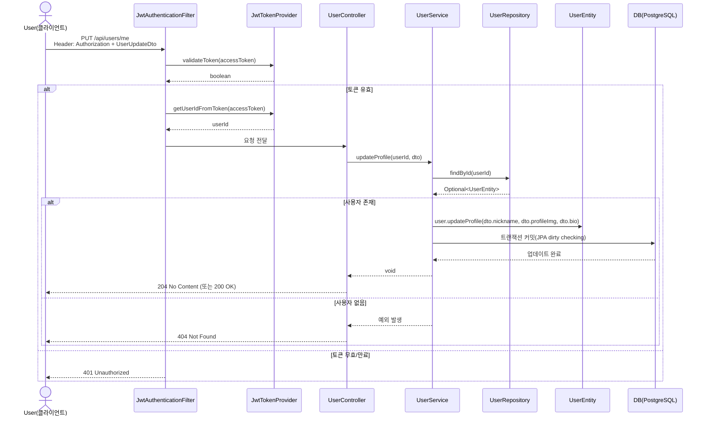

프로필 수정은 조회와 마찬가지로 JWT 기반 인증 위에서 동작하지만, DB에 저장된 UserEntity의 필드가 실제로 변경된다는 점이 다르다. 사용자가 프로필 수정 화면에서 새로운 닉네임, 프로필 이미지 URL, 자기소개 텍스트를 입력하고 “저장” 버튼을 클릭하면, 클라이언트는 이 정보를 UserUpdateDto로 묶어 Access Token과 함께 PUT /api/users/me 요청을 보낸다. 요청은 다시 JwtAuthenticationFilter를 통과하면서 토큰 검증과 userId 추출이 수행되고, 토큰이 유효할 경우 해당 userId가 인증 정보로 설정된 상태로 컨트롤러에 전달된다.

UserController.updateMyProfile()는 현재 로그인한 사용자의 userId와 전달받은 UserUpdateDto를 이용해 UserService.updateProfile(userId, dto)를 호출한다. 서비스는 우선 UserRepository.findById(userId)를 호출하여 실제 DB에 저장된 사용자를 가져온다. 만약 사용자가 존재하지 않으면 예외를 발생시키고, 컨트롤러를 통해 404 Not Found 응답을 반환한다. 사용자가 존재한다면, 서비스는 엔티티의 비즈니스 메서드인 user.updateProfile(dto.getNickname(), dto.getProfileImg(), dto.getBio())를 호출하여 해당 필드들을 변경한다. 구현 방식에 따라, DTO에 null 값이 들어온 필드는 무시하고 기존 값을 유지하는 방식도 가능하다.

이 수정 작업은 트랜잭션 안에서 이루어지며, 메서드가 끝나고 트랜잭션이 커밋될 때 JPA의 dirty checking 메커니즘에 의해 변경된 필드들만 자동으로 UPDATE 쿼리로 반영된다. 별도의 save() 호출이 없더라도, 영속 상태 엔티티에 대해 필드를 변경하는 것만으로 DB 업데이트가 수행된다. 수정이 완료되면 UserService는 별도의 반환값 없이 종료되고, UserController는 보통 204 No Content 또는 단순 200 OK 응답을 클라이언트에게 보낸다. 클라이언트는 응답을 받은 뒤 “프로필이 수정되었습니다.” 같은 메시지를 띄우고, 서버에서 다시 가져온 최신 프로필 정보를 화면에 보여주거나 현재 화면의 상태를 즉시 갱신한다.


### 6. 계정 탈퇴( 소프트 삭제)
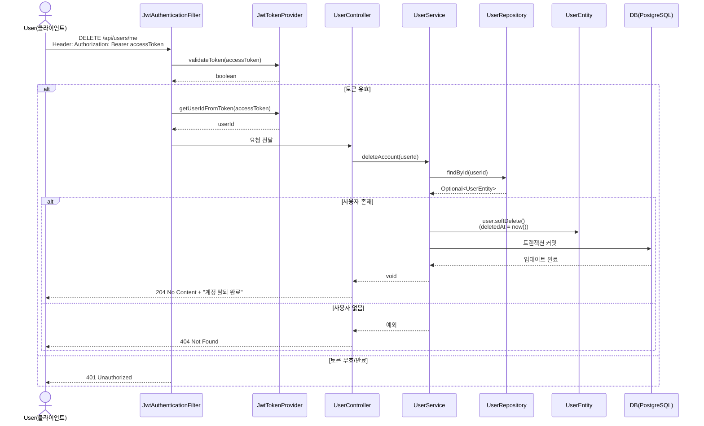
계정 탈퇴는 실제로 DB에서 사용자를 삭제하지 않고, deletedAt 필드만 채워서 “비활성화된 계정”으로 만드는 소프트 삭제 방식으로 처리된다. 사용자가 설정 화면에서 “계정 탈퇴” 버튼을 클릭하고 최종 확인을 마치면, 클라이언트는 Access Token을 담은 DELETE /api/users/me 요청을 서버로 보낸다. 이 요청 역시 JWT 인증 필터를 거쳐 토큰 검증과 userId 추출이 이뤄진 뒤 UserController.deleteMyAccount()에 도달한다.

컨트롤러는 현재 로그인한 사용자의 userId를 이용해 UserService.deleteAccount(userId)를 호출한다. UserService는 UserRepository.findById(userId)로 DB에서 해당 사용자를 검색하고, 사용자가 존재하지 않으면 예외를 발생시켜 404 응답을 반환하도록 한다. 사용자가 존재하고 아직 삭제되지 않은 정상 계정이라면, 서비스는 엔티티의 softDelete() 메서드를 호출한다. 이 메서드는 내부적으로 deletedAt 필드를 현재 시각으로 설정하여 “이 계정은 탈퇴했다”라는 상태 정보를 남긴다. 실제 DELETE 쿼리가 실행되는 것이 아니라 UPDATE로 deletedAt만 채우는 형태이기 때문에, 향후 필요 시 데이터 복구나 통계 분석에 활용할 수 있다.

트랜잭션이 커밋되면 변경된 deletedAt 값이 DB에 반영된다. 이후 로그인 로직에서 user.isDeleted() 같은 메서드를 통해 deletedAt이 null인지 여부를 검사함으로써, 탈퇴 처리된 계정으로는 다시 로그인하지 못하게 막을 수 있다. 서비스 호출이 문제 없이 끝나면 UserController는 204 No Content 또는 200 OK 응답을 클라이언트에 보내고, 클라이언트는 이 응답을 받은 후 저장되어 있던 JWT 토큰들을 삭제한 뒤 로그인 페이지나 메인 화면으로 사용자를 이동시킨다. 결과적으로 사용자는 더 이상 서비스의 인증된 기능들을 사용할 수 없는 상태가 된다.

### 7. 토큰 재발급
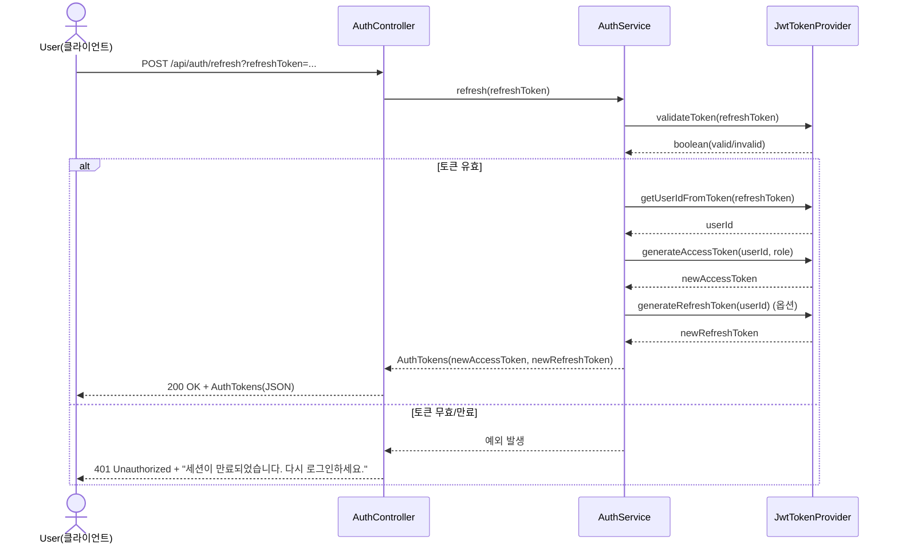
Access Token은 상대적으로 짧은 유효 기간을 가지기 때문에, 사용자가 서비스를 오래 이용하다 보면 토큰이 만료될 수 있다. 이때 매번 로그인 화면으로 보내지 않고, 백그라운드에서 Refresh Token을 사용해 새로운 Access Token을 발급받는 과정이 토큰 재발급 흐름이다. 클라이언트가 보호된 API를 호출했다가 401 Unauthorized 응답을 받아 Access Token 만료를 감지하면, 클라이언트는 자신이 보관하고 있는 Refresh Token을 읽어와 POST /api/auth/refresh?refreshToken=... 요청을 서버로 보낸다. 이 요청은 AuthController.refresh(String refreshToken)에서 수신되고, AuthService.refresh(refreshToken)으로 위임된다.

AuthService는 우선 jwtTokenProvider.validateToken(refreshToken)을 호출하여 전달받은 Refresh Token이 서명 검증과 만료 시간 기준으로 유효한지 확인한다. 유효하지 않을 경우, 서비스는 예외를 던지고 컨트롤러는 401 Unauthorized 응답과 함께 “세션이 만료되었습니다. 다시 로그인해 주세요.” 같은 메시지를 클라이언트에 전달한다. Refresh Token이 유효하다면, 이어서 jwtTokenProvider.getUserIdFromToken(refreshToken)을 호출해 토큰에 들어있는 userId를 추출한다. 이 userId를 바탕으로 generateAccessToken(userId, role)을 호출하여 새로운 Access Token을 발급한다. 구현에 따라 Refresh Token도 함께 새로 발급할 수 있으며, 이 경우 generateRefreshToken(userId)를 추가로 호출한다.

새로 발급된 Access Token과 (옵션으로) Refresh Token은 다시 AuthTokens 객체에 담겨 컨트롤러로 반환된다. AuthController는 이를 200 OK 상태와 함께 JSON으로 클라이언트에 보낸다. 클라이언트는 기존에 저장되어 있던 Access Token을 새 토큰으로 교체하고, 필요할 경우 Refresh Token도 함께 갱신한다. 그 후 직전에 실패했던 API 요청을 새로운 Access Token으로 다시 시도하여, 사용자가 추가 로그인 절차 없이도 서비스를 계속 이용할 수 있도록 한다. 이렇게 해서 토큰 재발급 흐름은 사용자의 편의성과 보안성을 동시에 만족시키는 중요한 구성 요소로 작동하게 된다.


### 8. 로그아웃 
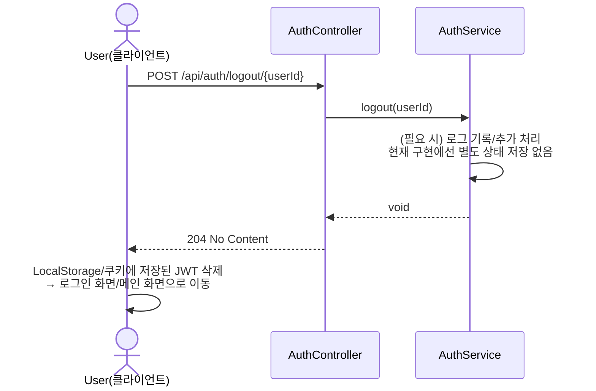
로그아웃은 기본적으로 “서버에게 이 사용자의 세션을 종료하겠다고 알린 뒤, 클라이언트 쪽에서 토큰을 삭제하는 행위”로 구성된다. 사용자가 화면에서 “로그아웃” 버튼을 클릭하면, 클라이언트는 현재 로그인된 사용자 ID를 포함하거나 또는 JWT에서 추출한 userId를 이용해 POST /api/auth/logout/{userId} 요청을 보낸다. 이 요청은 AuthController.logout(Long userId)로 들어가고, 컨트롤러는 내부적으로 AuthService.logout(userId)를 호출한다.

현재 구현에서는 서버 측에 Refresh Token을 별도로 저장해두는 저장소나 블랙리스트가 없기 때문에, AuthService.logout() 내부에서는 특별한 상태 변경을 수행하지 않거나, 단순히 로그를 남기는 수준으로 처리될 수 있다. 중요한 동작은 오히려 클라이언트 쪽에서 일어난다. AuthService 호출이 정상적으로 끝나면, AuthController는 204 No Content 또는 200 OK를 응답으로 반환한다. 클라이언트는 이 응답을 받는 즉시 LocalStorage나 쿠키에 저장된 Access Token과 Refresh Token을 삭제하여 더 이상 인증된 요청을 보낼 수 없도록 만든다. 이후 보호된 API를 호출하면 JWT가 없거나 무효하기 때문에 401 Unauthorized 응답을 받게 되고, 자연스럽게 로그인 페이지로 유도된다. 이로써 사용자는 애플리케이션에서 완전히 로그아웃된 상태가 된다.

## 스터디디
### 스터디 생성

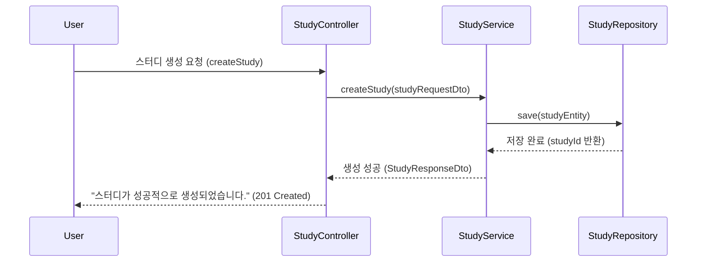
사용자가 스터디 생성 폼에서 ‘생성’ 버튼을 클릭하면 요청이 시작된다. 사용자가 입력한 스터디 정보(studyRequestDto)는 StudyController로 전달된다. Controller는 전달받은 요청 데이터를 StudyService에 넘기며 서비스 계층의 createStudy 메서드를 호출한다. StudyService는 전달된 데이터의 유효성을 검증하고 제목, 카테고리, 설명 등의 누락 여부를 확인한다. 검증이 통과되면 새로운 StudyEntity를 생성하고, StudyRepository를 통해 데이터베이스에 저장한다. 저장이 완료되면 StudyService는 생성된 스터디의 정보를 StudyResponseDto 형태로 반환하고, Controller는 이를 사용자에게 “스터디가 성공적으로 생성되었습니다.”라는 메시지와 함께 응답한다. 만약 유효성 검증 단계에서 오류가 발생하면 StudyService는 예외를 반환하고, Controller는 사용자에게 오류 메시지를 표시하며 프로세스를 종료한다.


### 스터디 수정

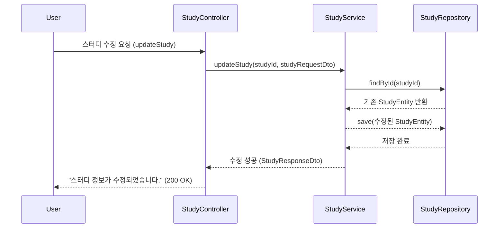
사용자가 스터디 상세 페이지에서 ‘수정’ 버튼을 클릭하면 수정 요청이 시작된다. 사용자가 입력한 변경된 정보(studyRequestDto)는 StudyController로 전달된다. Controller는 이 데이터를 StudyService의 updateStudy 메서드에 전달하여 수정 처리를 요청한다. StudyService는 먼저 StudyRepository를 통해 전달된 studyId로 기존 스터디 엔티티를 조회한다. 조회된 데이터가 존재하면 입력된 내용으로 엔티티의 필드를 수정하고, 수정된 StudyEntity를 다시 StudyRepository의 save 메서드를 통해 데이터베이스에 저장한다. 저장이 성공적으로 완료되면 StudyService는 수정된 스터디 정보를 StudyResponseDto 형태로 반환하고, Controller는 “스터디 정보가 수정되었습니다.”라는 메시지를 사용자에게 응답한다. 만약 스터디가 존재하지 않거나 유효성 검증에 실패한 경우, StudyService는 오류를 반환하고 Controller는 사용자에게 오류 메시지를 표시하며 프로세스를 종료한다.

### 스터디 삭제
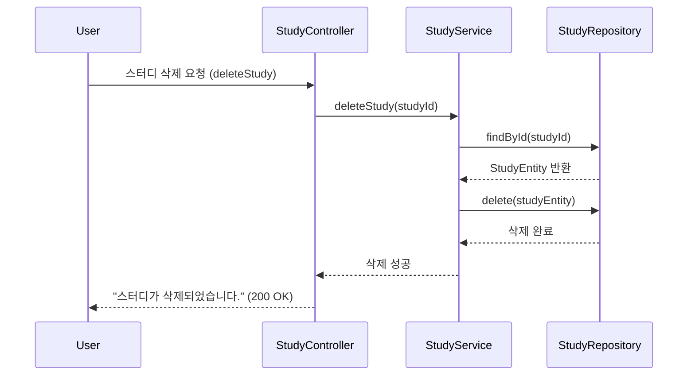
사용자가 스터디 상세 화면에서 ‘삭제’ 버튼을 클릭하면 삭제 요청이 시작된다. 요청은 StudyController로 전달되며, Controller는 전달받은 스터디 식별자(studyId)를 이용해 StudyService의 deleteStudy 메서드를 호출한다. StudyService는 StudyRepository를 통해 해당 스터디의 존재 여부를 확인하고, 조회 결과가 존재할 경우 delete 메서드를 호출하여 데이터베이스에서 해당 스터디를 삭제한다. 삭제가 완료되면 StudyService는 처리 결과를 반환하고, Controller는 “스터디가 삭제되었습니다.”라는 메시지를 사용자에게 전송한다. 만약 존재하지 않는 스터디이거나 삭제 과정에서 오류가 발생하면, StudyService는 예외를 발생시키고 Controller는 사용자에게 오류 메시지를 표시하며 과정을 종료한다.


### 스터디 목록 조회
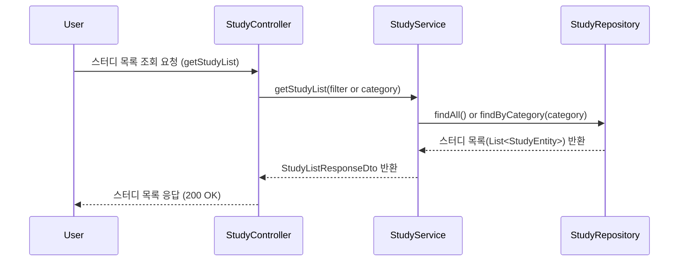
사용자가 스터디 목록 페이지에 접근하거나 필터를 선택하면 목록 조회 요청이 시작된다. 요청은 StudyController로 전달되며, Controller는 StudyService의 getStudyList 메서드를 호출하여 서비스 계층에 처리를 위임한다. StudyService는 전달받은 필터 조건이나 카테고리를 기반으로 StudyRepository의 findAll 또는 findByCategory 메서드를 호출한다. Repository는 조건에 맞는 스터디 엔티티 목록을 조회하여 Service로 반환한다. StudyService는 반환된 데이터를 StudyListResponseDto로 변환하고 Controller에 전달한다. Controller는 스터디 목록 데이터를 사용자 화면에 표시하며, 응답 결과가 없을 경우 빈 목록 또는 안내 메시지를 출력한다. 데이터베이스 오류나 통신 오류가 발생한 경우, Controller는 오류 메시지를 사용자에게 보여주고 흐름을 종료한다.

### 스터디 상세조회
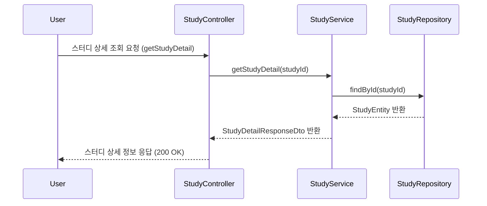
사용자가 특정 스터디를 클릭하면 상세 조회 요청이 시작된다. StudyController는 전달받은 studyId를 StudyService의 getStudyDetail 메서드에 전달한다. StudyService는 StudyRepository를 통해 해당 ID의 스터디 엔티티를 조회하고, 조회 결과가 존재할 경우 이를 StudyDetailResponseDto로 변환한다. 변환된 DTO는 Controller에 전달되고, Controller는 이를 사용자에게 상세 정보 페이지 형태로 응답한다. 만약 요청한 스터디가 존재하지 않거나 이미 삭제된 경우 StudyService는 예외를 반환하며, Controller는 사용자에게 “요청하신 스터디 정보를 찾을 수 없습니다.”라는 오류 메시지를 표시하고 프로세스를 종료한다.


### 스터디 참여 신청
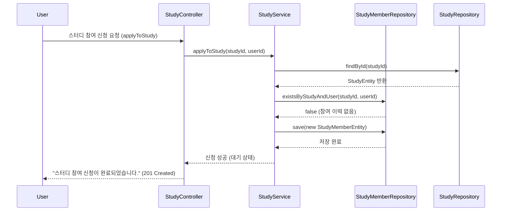
사용자가 특정 스터디의 상세 페이지에서 ‘참여 신청’ 버튼을 클릭하면 참여 요청이 시작된다. 이 요청은 StudyController로 전달되며, Controller는 사용자 정보(userId)와 스터디 식별자(studyId)를 StudyService의 applyToStudy 메서드에 전달한다. StudyService는 먼저 StudyRepository를 통해 해당 스터디의 존재 여부를 확인하고, 존재할 경우 StudyMemberRepository를 통해 사용자의 기존 신청 여부를 조회한다. 만약 기존에 참여 이력이 없다면 새로운 StudyMemberEntity를 생성하고 상태를 ‘대기(PENDING)’로 설정하여 StudyMemberRepository의 save 메서드를 통해 저장한다. 저장이 완료되면 StudyService는 신청 결과를 반환하고, Controller는 “스터디 참여 신청이 완료되었습니다.”라는 메시지를 사용자에게 전달한다. 만약 이미 신청된 상태이거나 스터디가 존재하지 않을 경우 StudyService는 예외를 발생시키며, Controller는 사용자에게 오류 메시지를 표시하고 프로세스를 종료한다.

### 스터디 참여 승인/거절
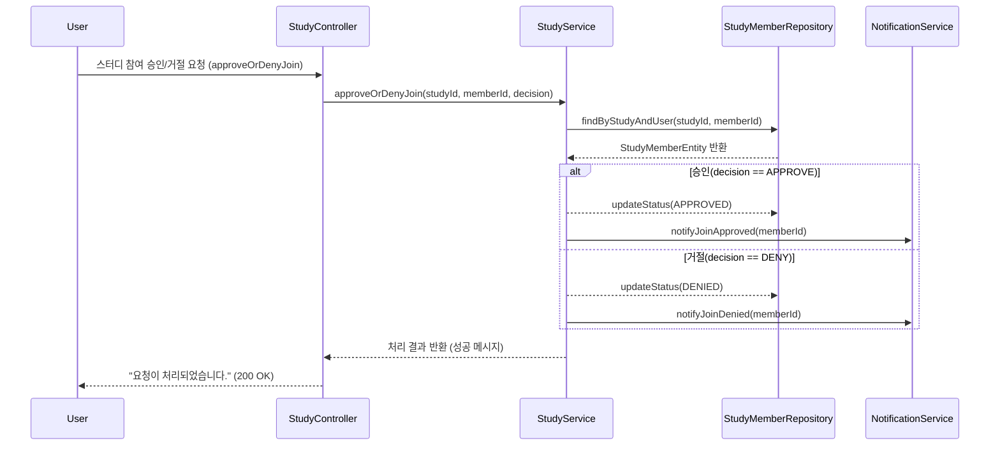
스터디 리더가 스터디 관리 화면에서 참여 신청자 목록을 확인하고 ‘승인’ 또는 ‘거절’ 버튼을 클릭하면 요청이 시작된다. 요청은 StudyController를 거쳐 StudyService의 approveOrDenyJoin 메서드로 전달되며, 스터디 ID와 신청자 ID, 그리고 승인 여부(decision)가 함께 전달된다. StudyService는 StudyMemberRepository를 통해 해당 신청자의 엔티티를 조회하고, 전달받은 decision 값이 승인일 경우 상태를 ‘승인(APPROVED)’으로, 거절일 경우 ‘거절(DENIED)’으로 변경한다. 변경된 상태는 save 메서드를 통해 데이터베이스에 반영되며, 이후 NotificationService를 호출하여 해당 사용자에게 승인 또는 거절 알림을 전송한다. 알림 전송이 완료되면 StudyService는 결과를 Controller에 반환하고, Controller는 “요청이 처리되었습니다.”라는 메시지를 리더에게 표시한다. 만약 존재하지 않는 신청자이거나 이미 처리된 요청일 경우 StudyService는 오류를 발생시키고, Controller는 오류 메시지를 출력한다.
### 스터디 탈퇴
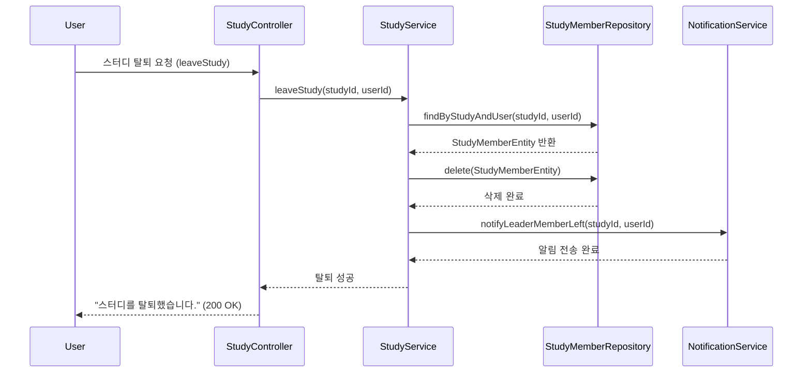
스터디에 참여 중인 사용자가 ‘스터디 탈퇴’ 버튼을 클릭하면 요청이 시작된다. 요청은 StudyController를 통해 StudyService의 leaveStudy 메서드로 전달되며, 스터디 식별자와 사용자 정보가 함께 전달된다. StudyService는 StudyMemberRepository를 통해 해당 사용자의 스터디 참여 정보를 조회하고, 조회 결과가 존재하면 delete 메서드를 호출하여 데이터베이스에서 해당 멤버 정보를 삭제한다. 삭제가 완료되면 StudyService는 NotificationService를 호출하여 스터디 리더에게 탈퇴 알림을 전송한다. 알림이 전송되면 StudyService는 결과를 반환하고, Controller는 사용자에게 “스터디를 탈퇴했습니다.”라는 메시지를 출력한다. 만약 스터디 참여 정보가 존재하지 않거나 삭제 중 오류가 발생할 경우, StudyService는 예외를 발생시키며 Controller는 사용자에게 오류 메시지를 표시하고 흐름을 종료한다.
### 스터디 강퇴
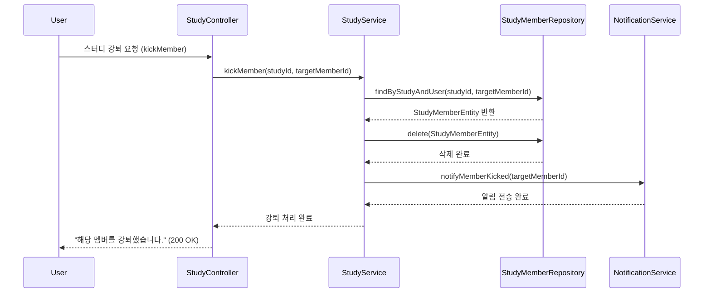
스터디 리더가 관리 화면에서 특정 멤버를 선택하고 ‘강퇴’ 버튼을 클릭하면 요청이 시작된다. 이 요청은 StudyController로 전달되어 StudyService의 kickMember 메서드로 전달된다. StudyService는 StudyMemberRepository를 통해 해당 멤버의 참여 정보를 조회하고, 조회 결과가 존재하면 delete 메서드를 호출하여 데이터베이스에서 해당 멤버의 정보를 삭제한다. 삭제가 완료되면 StudyService는 NotificationService를 호출하여 강퇴된 멤버에게 알림을 전송한다. 알림이 정상적으로 전송되면 StudyService는 처리 결과를 반환하고, Controller는 “해당 멤버를 강퇴했습니다.”라는 메시지를 리더에게 표시한다. 만약 강퇴 대상이 존재하지 않거나 이미 탈퇴한 사용자일 경우 StudyService는 예외를 발생시키고, Controller는 오류 메시지를 출력하며 과정을 종료한다.

## 일정
### 일정 등록
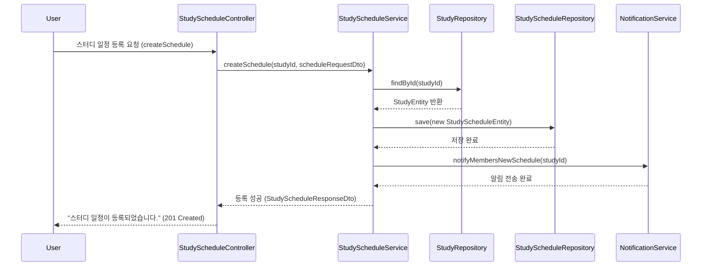
스터디 리더가 일정 관리 화면에서 ‘일정 등록’ 버튼을 클릭하면 요청이 시작된다. 사용자가 입력한 일정 정보(scheduleRequestDto)는 StudyScheduleController로 전달된다. Controller는 전달받은 스터디 식별자와 일정 데이터를 StudyScheduleService의 createSchedule 메서드로 넘겨 일정 등록을 요청한다. StudyScheduleService는 StudyRepository를 통해 해당 스터디가 존재하는지 확인한 후, 새로운 StudyScheduleEntity를 생성하고 일정 제목, 내용, 시작일, 종료일 등을 초기화한다. 생성된 엔티티는 StudyScheduleRepository의 save 메서드를 통해 데이터베이스에 저장된다. 저장이 완료되면 StudyScheduleService는 NotificationService를 호출하여 스터디 멤버들에게 새로운 일정 알림을 전송한다. 알림 전송이 끝나면 StudyScheduleService는 결과를 Controller에 반환하고, Controller는 사용자에게 “스터디 일정이 등록되었습니다.”라는 메시지를 표시한다. 만약 스터디가 존재하지 않거나 필수 정보가 누락된 경우 StudyService는 예외를 반환하며, Controller는 사용자에게 오류 메시지를 출력하고 프로세스를 종료한다.
### 일정 수정
```mermaid
sequenceDiagram
    participant User
    participant StudyScheduleController
    participant StudyScheduleService
    participant StudyScheduleRepository
    participant NotificationService

    User->>StudyScheduleController: 스터디 일정 수정 요청 (updateSchedule)
    StudyScheduleController->>StudyScheduleService: updateSchedule(scheduleId, scheduleRequestDto)
    StudyScheduleService->>StudyScheduleRepository: findById(scheduleId)
    StudyScheduleRepository-->>StudyScheduleService: StudyScheduleEntity 반환
    StudyScheduleService->>StudyScheduleRepository: save(수정된 StudyScheduleEntity)
    StudyScheduleRepository-->>StudyScheduleService: 저장 완료
    StudyScheduleService->>NotificationService: notifyMembersScheduleUpdated(scheduleId)
    NotificationService-->>StudyScheduleService: 알림 전송 완료
    StudyScheduleService-->>StudyScheduleController: 수정 성공 (StudyScheduleResponseDto)
    StudyScheduleController-->>User: "스터디 일정이 수정되었습니다." (200 OK)

```
스터디 리더가 기존 일정을 수정하기 위해 일정 목록에서 수정 대상을 선택하고 ‘수정’ 버튼을 클릭하면 요청이 시작된다. 사용자가 변경한 일정 정보(scheduleRequestDto)는 StudyScheduleController로 전달되고, Controller는 이를 StudyScheduleService의 updateSchedule 메서드에 전달한다. StudyScheduleService는 StudyScheduleRepository를 통해 일정 ID로 기존 일정을 조회한다. 조회된 StudyScheduleEntity가 존재하면 전달된 데이터로 제목, 내용, 시간 등을 수정하고, 수정된 엔티티를 save 메서드를 통해 데이터베이스에 반영한다. 저장이 완료되면 StudyScheduleService는 NotificationService를 호출하여 스터디 멤버들에게 일정이 변경되었음을 알린다. 알림 전송이 끝나면 StudyScheduleService는 처리 결과를 반환하고, Controller는 사용자에게 “스터디 일정이 수정되었습니다.”라는 메시지를 표시한다. 만약 해당 일정이 존재하지 않거나 수정 권한이 없는 경우 StudyScheduleService는 예외를 발생시키고, Controller는 사용자에게 오류 메시지를 보여준다.

### 일정 삭제
```mermaid
sequenceDiagram
    participant User
    participant StudyScheduleController
    participant StudyScheduleService
    participant StudyScheduleRepository
    participant NotificationService

    User->>StudyScheduleController: 스터디 일정 삭제 요청 (deleteSchedule)
    StudyScheduleController->>StudyScheduleService: deleteSchedule(scheduleId)
    StudyScheduleService->>StudyScheduleRepository: findById(scheduleId)
    StudyScheduleRepository-->>StudyScheduleService: StudyScheduleEntity 반환
    StudyScheduleService->>StudyScheduleRepository: delete(StudyScheduleEntity)
    StudyScheduleRepository-->>StudyScheduleService: 삭제 완료
    StudyScheduleService->>NotificationService: notifyMembersScheduleDeleted(scheduleId)
    NotificationService-->>StudyScheduleService: 알림 전송 완료
    StudyScheduleService-->>StudyScheduleController: 삭제 성공
    StudyScheduleController-->>User: "스터디 일정이 삭제되었습니다." (200 OK)

```
스터디 리더가 일정 관리 화면에서 삭제할 일정을 선택하고 ‘삭제’ 버튼을 클릭하면 요청이 시작된다. 삭제 요청은 StudyScheduleController로 전달되며, Controller는 전달받은 일정 ID를 StudyScheduleService의 deleteSchedule 메서드로 전달한다. StudyScheduleService는 StudyScheduleRepository를 통해 해당 일정이 존재하는지 확인하고, 존재할 경우 delete 메서드를 호출하여 데이터베이스에서 해당 일정을 삭제한다. 삭제가 완료되면 StudyScheduleService는 NotificationService를 호출하여 스터디 멤버들에게 해당 일정이 삭제되었음을 알린다. 알림이 정상적으로 전송되면 StudyScheduleService는 처리 결과를 반환하고, Controller는 사용자에게 “스터디 일정이 삭제되었습니다.”라는 메시지를 표시한다. 만약 일정이 존재하지 않거나 삭제 중 오류가 발생할 경우, StudyScheduleService는 예외를 발생시키며 Controller는 사용자에게 오류 메시지를 표시하고 프로세스를 종료한다.


## 게시판
### 게시글 작성
```mermaid
sequenceDiagram
    participant User as 사용자
    participant Boundary as PostWriteUI
    participant Control as PostManagementService
    participant Repository_P as PostRepository
    participant Entity_P as Post / QnAPost
    
    Title: Use case #27: 게시글 작성
    
    User->>Boundary: submitPost(newPostData)
    activate Boundary
    
    Note over Boundary: PostWriteUI가 사용자 입력 데이터 수집
    
    Boundary->>Control: createPost(User user, Post newPostData)
    activate Control
    
    Note over Control: 2. 데이터 유효성 및 권한 검증
    
    alt 유효성 검증 성공
        
        Note over Control: Post Entity 생성 및 초기화
        Control->>Entity_P: create(user_id, title, content)
        
        Note over Control: 게시글 데이터베이스 저장 (Persistence)
        Control->>Repository_P: save(Post/QnAPost)
        activate Repository_P
        Repository_P-->>Control: Persisted Post Entity 반환
        deactivate Repository_P
        
        Control-->>Boundary: Created Post Entity 반환
        Boundary->>User: displaySuccessMessage()
    else 유효성 검증 실패 (제목/내용 누락 등)
        Control-->>Boundary: Error Message 반환
        Boundary->>User: displayErrorMessage("필수 항목을 입력해주세요.")
    end
    
    deactivate Control
    deactivate Boundary
```
사용자가 게시글 작성 폼에서 '작성' 버튼을 클릭(submitPost)하면 이 과정이 시작됩니다. 이 요청은 PostWriteUI (Boundary)로 전달되어 사용자의 입력 데이터(newPostData)가 수집됩니다. PostWriteUI는 수집된 데이터를 사용자 정보(User user)와 함께 PostManagementService (Control)의 createPost 메서드를 호출하며 전달합니다.
PostManagementService는 게시글 제목이나 내용의 누락 여부 등 입력된 데이터의 유효성을 검증하는 핵심 로직을 수행합니다. 유효성 검증에 성공하면, PostManagementService는 Post 또는 QnAPost Entity를 생성하고 작성자 ID와 내용을 초기화합니다. 이어서 Control은 생성된 Entity를 PostRepository에 넘겨 데이터베이스에 저장합니다. 저장소에서 데이터 저장이 완료되면, 저장된 Entity가 PostManagementService를 거쳐 PostWriteUI로 최종 반환됩니다. PostWriteUI는 사용자에게 성공 메시지를 표시하며 프로세스를 완료합니다.
만약 유효성 검증에 실패했다면, PostManagementService는 데이터 저장 과정 없이 즉시 PostWriteUI로 Error Message를 반환하고, PostWriteUI는 사용자에게 오류 메시지를 표시하며 흐름을 종료합니다.

### 게시글 수정
```mermaid
sequenceDiagram
    participant User as 사용자
    participant Boundary as PostWriteUI
    participant Control as PostManagementService
    participant Repository_P as PostRepository
    participant Entity_P as Post
    
    Title: Use case #28: 게시글 수정
    
    User->>Boundary: requestUpdate(postId, updateData)
    activate Boundary
    
    Boundary->>Control: updatePost(User user, Long postId, Post updateData)
    activate Control
    
    Note over Control: 1. 기존 게시글 조회 및 권한 확인을 위한 데이터 요청
    
    Control->>Repository_P: findById(postId)
    activate Repository_P
    Repository_P-->>Control: Post Entity 반환 (originalPost)
    deactivate Repository_P
    
    alt user.user_id == originalPost.user_id (작성자 또는 관리자인 경우)
        
        Note over Control: 3. 게시글 내용 유효성 검증 및 Entity 상태 변경
        Control->>Entity_P: update(updateData)
        
        Note over Control: 4. 변경 내용 데이터베이스 저장
        Control->>Repository_P: save(originalPost)
        activate Repository_P
        Repository_P-->>Control: Updated Post 반환
        deactivate Repository_P
        
        Control-->>Boundary: Updated Post 반환
        Boundary->>User: displayUpdateSuccess()
    else 수정 권한 없음
        Control-->>Boundary: Error: Forbidden (권한 오류)
        Boundary->>User: displayErrorMessage("수정 권한이 없습니다.")
    end
    
    deactivate Control
    deactivate Boundary
```
사용자가 수정 폼에서 '수정 완료' 버튼을 클릭(requestUpdate)하면 이 과정이 시작되며, PostWriteUI (Boundary)는 수정에 필요한 데이터(postId, updateData)를 수집합니다. PostWriteUI는 이 정보를 PostManagementService (Control)의 updatePost 메서드로 전달합니다. PostManagementService는 가장 먼저 PostRepository에 postId를 전달하여 기존 게시글 Entity를 조회하여 가져옵니다.
Control은 조회된 Entity를 바탕으로, 현재 요청을 보낸 User의 ID와 게시글의 user_id를 비교하여 수정 권한을 검증합니다. 권한 검증에 성공하면, PostManagementService는 게시글 Entity 객체의 update 메서드를 호출하여 메모리 상의 Entity 상태를 변경합니다. 이후 Control은 변경된 Entity를 PostRepository에 넘겨 **데이터베이스에 변경 내용을 저장(save)**하고, 저장된 최종 Entity를 PostWriteUI로 반환합니다. PostWriteUI는 사용자에게 수정 성공 메시지를 표시하며 완료됩니다.
만약 권한 검증에 실패하면, PostManagementService는 저장 과정을 생략하고 즉시 PostWriteUI로 권한 오류 메시지를 반환하며, PostWriteUI는 사용자에게 오류 메시지를 표시하고 흐름을 종료합니다.

### 게시글 삭제
```mermaid
sequenceDiagram
    participant User as 사용자
    participant Boundary as PostDetailView
    participant Control as PostManagementService
    participant Repository_P as PostRepository
    
    Title: Use case #29: 게시글 삭제
    
    User->>Boundary: requestDelete(postId)
    activate Boundary
    
    Boundary->>Control: deletePost(User user, Long postId)
    activate Control
    
    Note over Control: 1. 기존 게시글 조회 및 권한 확인을 위한 데이터 요청
    
    Control->>Repository_P: findById(postId)
    activate Repository_P
    Repository_P-->>Control: Post Entity 반환 (originalPost)
    deactivate Repository_P
    
    alt user.user_id == originalPost.user_id (작성자 또는 관리자인 경우)
        
        Note over Control: 2. 게시글 데이터베이스에서 영구 삭제
        Control->>Repository_P: delete(originalPost)
        activate Repository_P
        Repository_P-->>Control: Success Confirmation
        deactivate Repository_P
        
        Control-->>Boundary: Success Confirmation 반환
        Boundary->>User: displayDeleteSuccess()
    else 삭제 권한 없음
        Control-->>Boundary: Error: Forbidden (권한 오류)
        Boundary->>User: displayErrorMessage("삭제 권한이 없습니다.")
    end
    
    deactivate Control
    deactivate Boundary
```
사용자가 게시글 상세 화면에서 '삭제' 버튼을 클릭(requestDelete)하면 이 과정이 시작되며, PostDetailView (Boundary)는 삭제할 게시글의 postId를 수집합니다. PostDetailView는 이 정보를 PostManagementService (Control)의 deletePost 메서드로 전달합니다.
PostManagementService는 가장 먼저 PostRepository에 postId를 전달하여 기존 게시글 Entity를 조회하여 가져옵니다. Control은 조회된 Entity를 바탕으로, 현재 요청을 보낸 User의 ID와 게시글의 user_id를 비교하여 삭제 권한을 검증합니다. 권한 검증에 성공하면, PostManagementService는 조회한 Entity를 PostRepository에 넘겨 데이터베이스에서 해당 게시글 데이터를 영구적으로 삭제하도록 요청합니다. 삭제가 완료되면, Control을 거쳐 PostDetailView로 성공 응답이 반환되고, PostDetailView는 사용자에게 삭제 성공 메시지를 표시하며 완료됩니다.
만약 권한 검증에 실패하면, PostManagementService는 삭제 과정을 생략하고 즉시 PostDetailView로 권한 오류 메시지를 반환하며, PostDetailView는 사용자에게 오류 메시지를 표시하고 흐름을 종료합니다.

### 게시글 목록 조회
```mermaid
sequenceDiagram
    participant User as 사용자
    participant Boundary as PostListView
    participant Control as PostQueryService
    participant Repository_P as PostRepository
    
    Title: Use case #30: 게시글 목록 조회
    
    User->>Boundary: requestPostList(type, page)
    activate Boundary
    
    Note over Boundary: 1. PostListView가 조회 조건 (페이지, 타입) 수집
    
    Boundary->>Control: getPostList(type, page)
    activate Control
    
    Note over Control: 2. 페이징 및 필터링 조건 설정
    
    Control->>Repository_P: findList(spec)
    activate Repository_P
    Repository_P-->>Control: List<Post> 목록 데이터 반환
    deactivate Repository_P
    
    Note over Control: 3. 반환된 데이터를 정렬 및 가공 (선택적)
    
    Control-->>Boundary: List<Post> 목록 데이터 반환
    deactivate Control
    
    Boundary->>User: displayPostList(List<Post>)
    deactivate Boundary
```
사용자가 게시판 메뉴를 클릭하거나 페이지 번호를 선택(requestPostList)하면 이 과정이 시작됩니다. 이 요청은 PostListView (Boundary)로 전달되어 현재 요청된 게시판 타입(type)과 페이지 번호(page) 등의 조회 조건이 수집됩니다. PostListView는 이 조회 조건을 PostQueryService (Control)의 getPostList 메서드를 호출하며 전달합니다.
PostQueryService는 전달받은 조건을 바탕으로 **데이터베이스 조회에 필요한 상세 스펙(spec)**을 설정하는 핵심 로직을 수행합니다. Control은 설정된 스펙을 PostRepository에 전달하여 게시글 목록 데이터를 요청합니다. PostRepository는 데이터베이스에서 조건에 맞는 게시글 목록(List<Post>)을 조회하여 Control로 반환합니다. Control은 반환된 목록 데이터를 최종적으로 **화면에 표시하기 위해 필요한 형태로 가공(정렬 또는 추가 정보 로딩 등)**한 후, PostListView로 반환합니다. PostListView는 최종 목록 데이터를 사용자에게 **화면에 표시(displayPostList)**하며 흐름을 완료합니다.

### 게시글 상세 조회
```mermaid
sequenceDiagram
    participant User as 사용자
    participant Boundary as PostDetailView
    participant Control as PostQueryService
    participant Repository_P as PostRepository
    participant Entity_P as Post
    participant Repository_C as CommentRepository
    
    Title: Use case #31: 게시글 상세 조회
    
    User->>Boundary: clickPostTitle(postId)
    activate Boundary
    
    Boundary->>Control: getPostDetail(postId)
    activate Control
    
    Note over Control: 1. 게시글 데이터베이스 조회
    
    Control->>Repository_P: findById(postId)
    activate Repository_P
    Repository_P-->>Control: Post Entity 반환 (originalPost)
    deactivate Repository_P
    
    Note over Control: 2. 조회수 증가 및 DB에 반영
    
    Control->>Entity_P: increaseViewCount()
    Control->>Repository_P: save(originalPost)
    
    Note over Control: 3. 댓글 목록 데이터베이스 조회
    
    Control->>Repository_C: findByPostId(postId)
    activate Repository_C
    Repository_C-->>Control: List<Comment> 반환
    deactivate Repository_C
    
    Control-->>Boundary: DetailData(Post, Comments) 반환
    deactivate Control
    
    Boundary->>User: displayDetail(DetailData)
    deactivate Boundary
```
사용자가 목록 화면에서 게시글 제목을 클릭(clickPostTitle)하면 이 과정이 시작되며, PostDetailView (Boundary)는 조회할 게시글의 postId를 수집합니다. PostDetailView는 이 정보를 PostQueryService (Control)의 getPostDetail 메서드를 호출하며 전달합니다. PostQueryService는 가장 먼저 PostRepository에 postId를 전달하여 게시글 Entity를 조회하여 가져옵니다.
게시글 Entity를 성공적으로 조회하면, Control은 이 Entity 객체의 increaseViewCount 메서드를 호출하여 메모리 상의 조회수를 1 증가시킨 후, PostRepository를 통해 데이터베이스에 변경된 조회수를 반영합니다. 이후 Control은 CommentRepository를 호출하여 해당 postId에 종속된 댓글 목록 데이터를 함께 조회합니다. PostQueryService는 조회된 게시글 Entity와 댓글 목록을 묶어 최종 상세 데이터(DetailData)로 구성한 후, PostDetailView로 반환합니다. PostDetailView는 이 데이터를 사용자에게 **화면에 표시(displayDetail)**하며 흐름을 완료합니다.

### 댓글 작성
```mermaid
sequenceDiagram
    participant User as 사용자
    participant Boundary as CommentForm
    participant Control as CommentManagementService
    participant Repository_C as CommentRepository
    participant Entity_C as Comment
    
    Title: Use case #32: 댓글 작성
    
    User->>Boundary: submitComment(postId, content)
    activate Boundary
    
    Note over Boundary: 사용자 입력 데이터 수집
    
    Boundary->>Control: createComment(User user, Long postId, String content)
    activate Control
    
    Note over Control: 입력 내용 유효성 및 권한 검증
    
    alt 유효성 검증 성공
        
        Note over Control: Comment Entity 생성 및 초기화
        Control->>Entity_C: create(user_id, postId, content)
        
        Note over Control: 댓글 데이터베이스 저장
        Control->>Repository_C: save(Comment)
        activate Repository_C
        Repository_C-->>Control: Persisted Comment Entity 반환
        deactivate Repository_C
        
        Control-->>Boundary: Created Comment Entity 반환
        Boundary->>User: displaySuccessMessage()
    else 유효성 검증 실패
        Control-->>Boundary: Error Message 반환
        Boundary->>User: displayErrorMessage("댓글 내용을 입력해주세요.")
    end
    
    deactivate Control
    deactivate Boundary
```
사용자가 댓글 입력 폼에서 '등록' 버튼을 클릭(submitComment)하면 이 과정이 시작되며, CommentForm (Boundary)는 댓글 내용(content)과 대상 게시글 ID(postId)를 수집합니다. CommentForm은 이 정보를 사용자 정보와 함께 CommentManagementService (Control)의 createComment 메서드로 전달합니다. CommentManagementService는 댓글 내용의 길이, 비속어 포함 여부 등 입력된 데이터의 유효성을 검증하는 핵심 로직을 수행합니다.
유효성 검증에 성공하면, CommentManagementService는 새로운 Comment Entity를 생성하고 작성자 ID, 대상 게시글 ID, 내용을 초기화합니다. 이후 Control은 생성된 Entity를 CommentRepository에 넘겨 **데이터베이스에 저장(save)**하도록 요청합니다. 저장소에서 데이터 저장이 완료되면, Control을 거쳐 CommentForm으로 성공 응답이 반환되고, CommentForm은 사용자에게 댓글 등록 성공 메시지를 표시하며 흐름을 완료합니다.
만약 유효성 검증에 실패하면, CommentManagementService는 데이터 저장 과정 없이 즉시 CommentForm으로 오류 메시지를 반환하고, CommentForm은 사용자에게 오류 메시지를 표시하며 흐름을 종료합니다.

### 댓글 수정
```mermaid
sequenceDiagram
    participant User as 사용자
    participant Boundary as CommentForm
    participant Control as CommentManagementService
    participant Repository_C as CommentRepository
    participant Entity_C as Comment
    
    Title: Use case #33: 댓글 수정
    
    User->>Boundary: requestUpdate(commentId, newContent)
    activate Boundary
    
    Boundary->>Control: updateComment(User user, Long commentId, String newContent)
    activate Control
    
    Note over Control: 1. 기존 댓글 조회 및 권한 확인을 위한 데이터 요청
    
    Control->>Repository_C: findById(commentId)
    activate Repository_C
    Repository_C-->>Control: Comment Entity 반환 (originalComment)
    deactivate Repository_C
    
    alt user.user_id == originalComment.user_id (작성자 또는 관리자인 경우)
        
        Note over Control: 2. 댓글 내용 유효성 검증 및 Entity 상태 변경
        Control->>Entity_C: updateContent(newContent)
        
        Note over Control: 3. 변경 내용 데이터베이스 저장
        Control->>Repository_C: save(originalComment)
        activate Repository_C
        Repository_C-->>Control: Updated Comment 반환
        deactivate Repository_C
        
        Control-->>Boundary: Updated Comment 반환
        Boundary->>User: displayUpdateSuccess()
    else 수정 권한 없음
        Control-->>Boundary: Error: Forbidden (권한 오류)
        Boundary->>User: displayErrorMessage("수정 권한이 없습니다.")
    end
    
    deactivate Control
    deactivate Boundary
```
사용자가 댓글 영역에서 수정 버튼을 클릭하고 새 내용을 입력한 후 '수정 완료'를 요청(requestUpdate)하면 이 과정이 시작되며, CommentForm (Boundary)은 수정할 댓글의 ID(commentId)와 새 내용(newContent)을 수집합니다. CommentForm은 이 정보를 사용자 정보와 함께 CommentManagementService (Control)의 updateComment 메서드로 전달합니다.
CommentManagementService는 가장 먼저 CommentRepository에 commentId를 전달하여 기존 댓글 Entity를 조회하여 가져옵니다. Control은 조회된 Entity를 바탕으로, 현재 요청을 보낸 User의 ID와 댓글의 user_id를 비교하여 수정 권한을 검증합니다. 권한 검증에 성공하면, CommentManagementService는 새 내용에 대한 유효성 검증을 거친 후, 댓글 Entity 객체의 updateContent 메서드를 호출하여 메모리 상의 Entity 상태를 변경합니다. 이후 Control은 변경된 Entity를 CommentRepository에 넘겨 **데이터베이스에 변경 내용을 저장(save)**하고, 저장된 최종 Entity를 CommentForm으로 반환합니다. CommentForm은 사용자에게 수정 성공 메시지를 표시하며 완료됩니다.
만약 권한 검증에 실패하면, CommentManagementService는 저장 과정을 생략하고 즉시 CommentForm으로 권한 오류 메시지를 반환하며, CommentForm은 사용자에게 오류 메시지를 표시하고 흐름을 종료합니다.

### 댓글 삭제
```mermaid
sequenceDiagram
    participant User as 사용자
    participant Boundary as CommentForm
    participant Control as CommentManagementService
    participant Repository_C as CommentRepository
    
    Title: Use case #34: 댓글 삭제
    
    User->>Boundary: requestDelete(commentId)
    activate Boundary
    
    Boundary->>Control: deleteComment(User user, Long commentId)
    activate Control
    
    Note over Control: 1. 기존 댓글 조회 및 권한 확인을 위한 데이터 요청
    
    Control->>Repository_C: findById(commentId)
    activate Repository_C
    Repository_C-->>Control: Comment Entity 반환 (originalComment)
    deactivate Repository_C
    
    alt user.user_id == originalComment.user_id (작성자 또는 관리자인 경우)
        
        Note over Control: 2. 댓글 데이터베이스에서 영구 삭제
        Control->>Repository_C: delete(originalComment)
        activate Repository_C
        Repository_C-->>Control: Success Confirmation
        deactivate Repository_C
        
        Control-->>Boundary: Success Confirmation 반환
        Boundary->>User: displayDeleteSuccess()
    else 삭제 권한 없음
        Control-->>Boundary: Error: Forbidden (권한 오류)
        Boundary->>User: displayErrorMessage("삭제 권한이 없습니다.")
    end
    
    deactivate Control
    deactivate Boundary
```
사용자가 댓글의 '삭제' 버튼을 클릭(requestDelete)하면 이 과정이 시작되며, CommentForm (Boundary)은 삭제할 댓글의 commentId를 수집합니다. CommentForm은 이 정보를 사용자 정보와 함께 CommentManagementService (Control)의 deleteComment 메서드로 전달합니다. CommentManagementService는 CommentRepository를 통해 해당 commentId의 기존 댓글 Entity를 조회하여 가져옵니다.
Control은 조회된 Entity를 바탕으로, 현재 요청을 보낸 User의 ID와 댓글의 user_id를 비교하여 삭제 권한을 검증합니다. 권한 검증에 성공하면, CommentManagementService는 Entity를 CommentRepository에 넘겨 데이터베이스에서 해당 댓글 데이터를 영구적으로 삭제하도록 요청합니다. 삭제가 완료되면, Control을 거쳐 CommentForm으로 성공 응답이 반환되고, CommentForm은 사용자에게 삭제 성공 메시지를 표시하며 완료됩니다. 만약 권한 검증에 실패하면, CommentManagementService는 삭제 과정을 생략하고 즉시 CommentForm으로 권한 오류 메시지를 반환하며, CommentForm은 사용자에게 오류 메시지를 표시하고 흐름을 종료합니다.

### QnA 게시글 작성
```mermaid
sequenceDiagram
    participant User as 사용자
    participant Boundary as PostWriteUI
    participant Control as PostManagementService
    participant Repository_P as PostRepository
    participant Entity_Q as QnAPost
    
    Title: Use case #35_Q: QnA 게시글 작성
    
    User->>Boundary: submitQnAPost(newQnAPostData)
    activate Boundary
    
    Note over Boundary: PostWriteUI가 QnA 특화 데이터 수집 (Tech Tag 포함)
    
    Boundary->>Control: createPost(User user, Post newQnAPostData)
    activate Control
    
    Note over Control: 1. 데이터 유효성 및 QnA 특화 검증 (Tag 포함)
    
    alt 유효성 검증 성공
        
        Note over Control: 2. QnAPost Entity 생성 및 초기화 (isAnswered = false)
        Control->>Entity_Q: create(user_id, title, content, techTag)
        
        Note over Control: 3. QnA 게시글 데이터베이스 저장
        Control->>Repository_P: save(QnAPost)
        activate Repository_P
        Repository_P-->>Control: Persisted QnAPost Entity 반환
        deactivate Repository_P
        
        Control-->>Boundary: Created QnAPost Entity 반환
        Boundary->>User: displaySuccessMessage()
    else 유효성 검증 실패
        Control-->>Boundary: Error Message 반환
        Boundary->>User: displayErrorMessage("QnA 필수 항목을 입력해주세요.")
    end
    
    deactivate Control
    deactivate Boundary
```
사용자가 QnA 작성 폼에서 '작성' 버튼을 클릭(submitQnAPost)하면 이 과정이 시작되며, PostWriteUI (Boundary)는 일반 게시글 외에 기술 태그(Tech Tag)를 포함한 QnA 데이터를 수집합니다. PostWriteUI는 이 데이터를 PostManagementService (Control)의 createPost 메서드를 호출하며 전달합니다. PostManagementService는 QnA 게시글에 특화된 유효성 검증 (예: 기술 태그 필수 여부)을 수행합니다.
유효성 검증에 성공하면, PostManagementService는 새로운 QnAPost Entity를 생성하고 isAnswered 필드를 false로 초기화합니다. 이후 Control은 생성된 Entity를 PostRepository에 넘겨 데이터베이스에 저장하도록 요청하며, PostRepository는 QnAPost를 저장한 후 Control로 반환합니다. Control을 거쳐 PostWriteUI로 성공 응답이 반환되고, PostWriteUI는 사용자에게 작성 성공 메시지를 표시하며 흐름을 완료합니다. 만약 유효성 검증에 실패하면, Control에서 Error Message가 Boundary를 거쳐 사용자에게 전달됩니다.

### QnA 게시글 답변 등록
```mermaid
sequenceDiagram
    participant User as 사용자
    participant Boundary as CommentForm
    participant Control as CommentManagementService
    participant Repository_C as CommentRepository
    participant Entity_A as Answer
    participant Entity_Q as QnAPost
    
    Title: Use case #36: QnA 게시글 답변 등록
    
    User->>Boundary: submitComment(qnaPostId, content)
    activate Boundary
    
    Boundary->>Control: registerAnswer(User user, Long qnaPostId, String content)
    activate Control
    
    Note over Control: 1. QnA 게시글 존재 및 답변 권한 검증
    
    alt 유효성 및 권한 검증 성공
        
        Note over Control: 2. Answer Entity 생성 및 초기화 (isAdopted = false)
        Control->>Entity_A: create(user_id, qnaPostId, content)
        
        Note over Control: 3. Answer 데이터베이스 저장
        Control->>Repository_C: save(Answer)
        activate Repository_C
        Repository_C-->>Control: Persisted Answer Entity 반환
        deactivate Repository_C
        
        Note over Control: 4. (선택적) QnA 게시글 상태 업데이트 로직 (markAsAnswered)
        
        Control-->>Boundary: Created Answer Entity 반환
        Boundary->>User: displaySuccessMessage()
    else 유효성 검증 실패 (내용 누락, 답변 마감 등)
        Control-->>Boundary: Error Message 반환
        Boundary->>User: displayErrorMessage("답변 등록에 실패했습니다.")
    end
    
    deactivate Control
    deactivate Boundary
```
사용자가 QnA 게시글 하단에서 답변 내용을 입력하고 '등록' 버튼을 클릭(submitComment)하면 이 과정이 시작되며, CommentForm (Boundary)은 대상 QnA 게시글 ID(qnaPostId)와 답변 내용(content)을 수집합니다. CommentForm은 이 정보를 CommentManagementService (Control)의 registerAnswer 메서드를 호출하며 전달합니다. CommentManagementService는 QnA 게시글의 존재 여부 및 답변 내용의 유효성을 검증합니다.
검증에 성공하면, CommentManagementService는 새로운 Answer Entity를 생성하고 isAdopted 필드를 false로 초기화합니다. 이후 Control은 생성된 Answer Entity를 CommentRepository에 넘겨 **데이터베이스에 저장(save)**하도록 요청합니다. 저장이 완료되면, Control은 필요에 따라 **QnAPost Entity의 상태(예: 답변이 달렸음을 표시)**를 업데이트하는 로직을 수행할 수 있습니다. Control을 거쳐 CommentForm으로 성공 응답이 반환되고, CommentForm은 사용자에게 답변 등록 성공 메시지를 표시하며 흐름을 완료합니다. 만약 검증에 실패하면, Control에서 오류 메시지가 Boundary를 거쳐 사용자에게 전달됩니다.


## 오픈소스 이슈 관리
### Good First Issue 목록 조회
```mermaid
sequenceDiagram
    participant User
    participant IssueApi
    participant IssueService
    participant IssueStore

    activate User
    User->>+IssueApi: S: "Good First Issue 목록" 메뉴 클릭 (getIssues)
    
    IssueApi->>+IssueService: getIssues(spec)
    
    IssueService->>+IssueStore: 2: find(spec)
    IssueStore-->>-IssueService: 3: List<Issue> issues (조회된 목록)
    
    IssueService-->>-IssueApi: List<Issue> issues
    
    IssueApi-->>-User: 4: (200 OK) 이슈 목록 데이터
    deactivate User
```
사용자가 'Good First Issue 목록' 메뉴를 클릭하면 이 과정이 시작됩니다. 이 요청은 IssueApi로 전달되어 getIssues가 호출되며, API는 IssueService에 쿼리 스펙(spec)을 넘깁니다. IssueService는 이 스펙을 바탕으로 IssueStore의 find 메서드를 호출하여 "Good First Issue" 라벨과 "OPEN" 상태 등의 조건에 맞는 이슈 목록을 데이터베이스에서 조회합니다. IssueStore가 이슈 목록을 반환하면, IssueService와 IssueApi를 거쳐 최종적으로 사용자에게 목록 데이터가 전달되어 화면에 표시됩니다.

### 이슈 북마크 저장
```mermaid
sequenceDiagram
    participant User
    participant IssueApi
    participant IssueService
    participant IssueStore

    activate User
    User->>+IssueApi: S: "북마크" 아이콘 클릭 (addBookmark)
    
    IssueApi->>+IssueService: 1: addBookmark(userId, issueId)
    
    IssueService->>+IssueStore: 2: existsBookmark(userId, issueId)
    IssueStore-->>-IssueService: false (북마크 없음)
    
    IssueService->>+IssueStore: 3: saveBookmark(userId, issueId)
    IssueStore-->>-IssueService: (저장 완료)
    
    IssueService-->>-IssueApi: (200 OK)
    
    IssueApi-->>User: 4: "북마크에 저장되었습니다."
    deactivate IssueApi
    deactivate User
```
사용자가 특정 이슈의 '북마크' 아이콘을 클릭하면 IssueApi의 addBookmark가 호출됩니다. IssueApi는 IssueService에 userId와 issueId를 전달하여 addBookmark를 요청합니다. IssueService는 먼저 IssueStore의 existsBookmark를 호출해 중복 여부를 확인합니다. 중복이 아닐 경우(false), IssueService는 IssueStore의 saveBookmark를 호출하여 데이터베이스에 정보를 저장합니다. 저장이 완료되면, IssueApi를 통해 사용자에게 "북마크에 저장되었습니다."라는 확인 메시지가 전달됩니다.

### 이슈 북마크 삭제
```mermaid
sequenceDiagram
    participant User
    participant IssueApi
    participant IssueService
    participant IssueStore

    activate User
    User->>+IssueApi: S: 활성화된 "북마크" 아이콘 클릭 (removeBookmark)
    
    IssueApi->>+IssueService: 1: removeBookmark(userId, issueId)
    
    IssueService->>+IssueStore: 2: deleteBookmark(userId, issueId)
    IssueStore-->>-IssueService: (삭제 완료)
    
    IssueService-->>-IssueApi: (200 OK)
    
    IssueApi-->>User: 3: "북마크에서 삭제되었습니다."
    deactivate IssueApi
    deactivate User
```
사용자가 이미 활성화된 북마크 아이콘을 다시 클릭하면 IssueApi의 removeBookmark가 호출됩니다. IssueApi는 IssueService에 userId와 issueId를 전달하여 removeBookmark를 요청합니다. IssueService는 즉시 IssueStore의 deleteBookmark를 호출하여 데이터베이스에서 해당 북마크 데이터를 삭제합니다. 삭제가 성공적으로 완료되면, IssueApi를 통해 사용자에게 "북마크에서 삭제되었습니다."라는 확인 메시지가 전달됩니다.

### 키워드 검색
```mermaid
sequenceDiagram
    participant User
    participant IssueApi
    participant IssueService
    participant SearchIndex
    participant IssueStore

    activate User
    User->>+IssueApi: S: 키워드 입력 후 검색 (getIssues with spec)
    
    IssueApi->>+IssueService: 2: search(keyword, labels, limit)
    
    IssueService->>+SearchIndex: searchIds(keyword, labels, limit)
    SearchIndex-->>-IssueService: List<String> issueIds
    
    IssueService->>+IssueStore: 3: find(spec_with_ids)
    IssueStore-->>-IssueService: List<Issue> issues
    
    IssueService-->>-IssueApi: List<Issue> issues (정렬/가공된 결과)
    
    IssueApi-->>User: 4: (200 OK) 검색 결과 목록
    deactivate IssueApi
    deactivate User
```
사용자가 키워드를 입력하고 검색을 요청하면 IssueApi가 IssueService의 search 메서드를 호출합니다. IssueService는 SearchIndex의 searchIds를 호출하여 검색 인덱스로부터 키워드와 일치하는 이슈 ID 목록(issueIds)을 먼저 받아옵니다. 그 후, 이 ID 목록을 포함한 쿼리 스펙을 IssueStore의 find 메서드로 전달하여 데이터베이스에서 실제 Issue 객체 목록을 조회합니다. IssueService는 이 결과를 정렬하고 가공하여 IssueApi를 통해 사용자에게 최종 검색 결과 목록을 반환합니다.

### OSS 이슈 이동
```mermaid
sequenceDiagram
    participant User
    participant System (Client)
    participant GitHub

    activate User
    User->>System (Client): S: "GitHub에서 보기" 버튼 클릭
    
    System (Client)->>System (Client): 1: 클릭된 이슈의 GitHub URL 식별
    
    System (Client)->>+GitHub: 2: URL로 리다이렉트 (새 탭)
    
    GitHub-->>-System (Client): 3: GitHub 이슈 페이지 반환
    
    System (Client)-->>User: 4: 이슈 페이지 표시
    deactivate User
```
사용자가 이슈 상세 화면에서 "GitHub에서 보기" 버튼을 클릭하면, 시스템(클라이언트)은 해당 이슈가 가지고 있는 고유한 GitHub URL을 식별합니다. 시스템은 즉시 사용자의 웹 브라우저에 새 탭을 열어 식별된 URL로 리다이렉트시킵니다. GitHub 서버는 이 요청에 응답하여 해당 이슈의 원본 페이지를 사용자 브라우저에 표시합니다.

### vscode.dev 열기
```mermaid
sequenceDiagram
    participant User
    participant System (Client)
    participant vscode.dev
    participant GitHub

    activate User
    User->>System (Client): S, 1: "vscode.dev 열기" 버튼 클릭
    
    System (Client)->>System (Client): 2: 대상 리포(owner/repo)로 URL 구성
    
    System (Client)->>+vscode.dev: 3: 새 탭으로 URL 이동 (https://vscode.dev/github/...)
```
사용자가 "vscode.dev 열기" 버튼을 클릭하면, 시스템(클라이언트)은 현재 리포지토리의 owner와 name 정보를 바탕으로 https://vscode.dev/github/{owner}/{name} 형식의 URL을 동적으로 구성합니다. 시스템은 이 URL로 새 탭을 열어 vscode.dev로 이동시킵니다. 만약 대상 리포지토리가 Private인 경우, vscode.dev는 사용자에게 GitHub 인증을 요구하며, 사용자가 이를 승인하면 vscode.dev가 리포지토리의 파일 트리를 로드하여 웹 에디터를 렌더링합니다.

## 기여도 및 도전과제
### 도전과제 진행 상태 조회
```mermaid
sequenceDiagram
    participant User
    participant ChallengeApi
    participant ChallengeService
    participant ChallengeStore

    activate User
    User->>+ChallengeApi: 1: '도전과제 진행 현황' 클릭 (listActive)
    
    ChallengeApi->>+ChallengeService: listActive()
    ChallengeService->>+ChallengeStore: 2: findActiveChallenges()
    ChallengeStore-->>-ChallengeService: List<Challenge> activeChallenges
    
    loop for each challenge in activeChallenges
        ChallengeService->>+ChallengeStore: 2: findProgress(userId, C.challengeId)
        ChallengeStore-->>-ChallengeService: ChallengeProgress progress
    end
    
    ChallengeService-->>-ChallengeApi: List<CombinedChallengeProgress>
    
    ChallengeApi-->>User: 3: (200 OK) 도전과제 목록 및 진행률
    deactivate ChallengeApi
    deactivate User
```
사용자가 '도전과제 진행 현황' 메뉴를 클릭하면 ChallengeApi의 listActive가 호출됩니다. ChallengeApi는 ChallengeService를 호출하고, ChallengeService는 ChallengeStore의 findActiveChallenges를 통해 현재 활성화된 모든 과제 목록을 가져옵니다. 그 다음, ChallengeService는 이 목록을 반복(loop)하면서 각 과제 ID에 대해 ChallengeStore의 findProgress를 호출하여 해당 사용자의 진행률(ChallengeProgress) 데이터를 개별적으로 조회합니다. 모든 과제 정보와 진행률이 조합되면, ChallengeApi를 통해 사용자에게 최종 목록이 반환됩니다.

### 도전과제 완료
```mermaid
sequenceDiagram
    participant User
    participant ChallengeApi
    participant ChallengeService
    participant ChallengeStore

    activate User
    User->>+ChallengeApi: S, 1: '완료하기' 버튼 클릭 (complete)
    
    ChallengeApi->>+ChallengeService: completeMyChallenge(challengeId)
    
    ChallengeService->>+ChallengeStore: 2: findProgress(userId, challengeId)
    ChallengeStore-->>-ChallengeService: ChallengeProgress (진행 상태)
    
    ChallengeService->>+ChallengeStore: 3: saveComplete(userId, challengeId)
    ChallengeStore-->>-ChallengeService: (완료 상태 저장)
    
    ChallengeService-->>-ChallengeApi: (완료 성공)
    
    ChallengeApi-->>User: 4: "과제가 완료되었습니다."
    deactivate ChallengeApi
    deactivate User
```
사용자가 '완료하기' 버튼을 클릭하면 ChallengeApi의 complete 메서드가 호출됩니다. ChallengeApi는 ChallengeService의 completeMyChallenge를 호출합니다. ChallengeService는 먼저 ChallengeStore의 findProgress를 통해 해당 과제의 진행률이 100%인지 내부적으로 검증합니다. 검증이 완료되면, ChallengeService는 ChallengeStore의 saveComplete를 호출하여 데이터베이스의 과제 상태를 '완료'(예: completedAt 시각 기록)로 갱신하고 보상 지급 로직을 처리합니다. 모든 과정이 성공하면 ChallengeApi를 통해 사용자에게 "과제가 완료되었습니다."라는 메시지가 반환됩니다.

### 오픈소스 기여 배지 획득
```mermaid
sequenceDiagram
    participant User
    participant System(Scheduler)
    participant ContributionService
    participant ChallengeStore

    activate System(Scheduler)
    System(Scheduler)->>+ContributionService: 1: (Event) 기여도/배지 조건 확인 (userId)
    
    ContributionService->>+ChallengeStore: findStats(userId)
    ChallengeStore-->>-ContributionService: UserContributionStats
    
    ContributionService->>ContributionService: 2: (내부 로직) 배지 획득 조건 검증
    
    alt 조건 충족 시
        ContributionService->>+ChallengeStore: 2: saveBadge(newBadge)
        ChallengeStore-->>-ContributionService: (배지 저장 완료)
        
        ContributionService-->>User: 3: (Push) "배지 획득" 알림
    end
    
    deactivate ContributionService
    deactivate System(Scheduler)
```
이 과정은 사용자가 아닌 시스템 스케줄러에 의해 주기적으로 시작됩니다. 스케줄러가 ContributionService를 호출하여 특정 사용자의 배지 획득 조건 확인을 요청합니다. ContributionService는 ChallengeStore의 findStats를 호출하여 사용자의 기여 통계(UserContributionStats)를 조회합니다. 이 통계를 바탕으로 내부 로직을 통해 새로운 배지 획득 조건을 충족했는지 검증합니다. 만약 조건을 충족했다면, ContributionService는 ChallengeStore의 saveBadge를 호출하여 새 배지를 데이터베이스에 저장하고, 사용자에게 푸시 알림 등을 통해 배지 획득 사실을 알립니다.

### 오픈소스 기여 배지 조회
```mermaid
sequenceDiagram
    participant User
    participant BadgeApi
    participant ContributionService
    participant ChallengeStore

    activate User
    User->>+BadgeApi: 1: '내 배지 보기' 클릭 (listBadges)
    
    BadgeApi->>+ContributionService: myBadges()
    
    ContributionService->>+ChallengeStore: 2: findBadges(userId)
    ChallengeStore-->>-ContributionService: List<ContributionBadge> badgeList
    
    ContributionService-->>-BadgeApi: List<ContributionBadge> badgeList
    
    BadgeApi-->>User: 3: (200 OK) 보유 배지 목록
    deactivate BadgeApi
    deactivate User
```
사용자가 '내 배지 보기' 메뉴를 클릭하면 BadgeApi의 listBadges가 호출됩니다. BadgeApi는 ContributionService의 myBadges 메서드를 호출합니다. ContributionService는 ChallengeStore의 findBadges를 호출하여 데이터베이스에서 현재 로그인한 사용자의 모든 ContributionBadge 목록을 조회합니다. 이 목록은 ContributionService와 BadgeApi를 거쳐 사용자에게 반환되어 화면에 표시됩니다.

### 오픈소스 기여도 랭킹 확인
```mermaid
sequenceDiagram
    participant User
    participant RankingApi
    participant ContributionService
    participant ChallengeStore

    activate User
    User->>+RankingApi: 1: '기여도 랭킹 보기' 클릭 (top + myRank)
    
    RankingApi->>+ContributionService: top(limit)
    ContributionService->>+ChallengeStore: 2: findTop(limit)
    ChallengeStore-->>-ContributionService: List<UserContributionStats> topList
    ContributionService-->>-RankingApi: topList
    
    RankingApi->>+ContributionService: myRank()
    ContributionService->>+ChallengeStore: 2: findStats(userId)
    ChallengeStore-->>-ContributionService: UserContributionStats myStats
    ContributionService-->>-RankingApi: myStats
    
    RankingApi-->>User: 3, 4: (200 OK) 랭킹 목록 및 내 순위
    deactivate RankingApi
    deactivate User
```
사용자가 '기여도 랭킹 보기'를 클릭하면 RankingApi가 호출됩니다. RankingApi는 먼저 ContributionService의 top 메서드를 호출하고, 이는 ChallengeStore의 findTop을 통해 상위 N명의 랭킹 목록(UserContributionStats 리스트)을 조회합니다. 동시에 RankingApi는 ContributionService의 myRank 메서드를 호출하고, 이는 ChallengeStore의 findStats를 통해 '내' 기여 통계 및 순위 정보를 조회합니다. RankingApi는 이 두 정보를 조합하여 사용자에게 전체 랭킹 목록과 자신의 순위를 함께 반환합니다.

### OSS 뉴스 목록 조회
```mermaid
sequenceDiagram
    participant User
    participant NewsApi
    participant NewsService

    activate User
    User->>+NewsApi: S, 1: 'OSS 뉴스 보기' 클릭 (list)
    
    NewsApi->>+NewsService: list(page, size, keyword, tags, recentFirst)
    
    NewsService->>NewsService: 2, 3: (내부 로직) 외부 API 호출 및<br/>뉴스 데이터 목록 가공
    
    NewsService-->>-NewsApi: List<News> newsList
    
    NewsApi-->>User: 4: (200 OK) 뉴스 목록
    deactivate NewsApi
    deactivate User
```
사용자가 'OSS 뉴스 보기' 메뉴를 클릭하면 NewsApi의 list가 호출됩니다. NewsApi는 NewsService의 list 메서드를 호출합니다. NewsService는 (필요시 외부 API를 호출하거나 DB를 조회하는) 내부 로직을 통해 최신 뉴스 데이터를 가져와 News 객체 목록으로 가공합니다. 이 가공된 목록은 NewsApi를 거쳐 사용자에게 반환되어 화면에 표시됩니다.

### OSS 뉴스 페이지로 이동
```mermaid
sequenceDiagram
    participant User
    participant NewsApi
    participant NewsService
    participant ExternalNewsPage

    activate User
    User->>+NewsApi: 1: 뉴스 항목 클릭 (goTo)
    
    NewsApi->>+NewsService: 2: newsUrl(newsId)
    NewsService-->>-NewsApi: String url (원문 URL 반환)
    
    NewsApi-->>User: 3: (Redirect) URL 전달
    
    User->>+ExternalNewsPage: 3: (Browser) 새 탭으로 URL 요청
    ExternalNewsPage-->>-User: 4: 원문 페이지 표시
    deactivate User
```
사용자가 뉴스 목록에서 특정 항목을 클릭하면 NewsApi의 goTo 메서드가 호출됩니다. NewsApi는 NewsService의 newsUrl을 호출하여 해당 newsId의 원본 URL(문자열)을 요청합니다. NewsService가 이 URL을 반환하면, NewsApi는 사용자에게 이 URL로 리다이렉트하라는 응답을 보냅니다. 사용자의 브라우저는 이 응답을 받아 새 탭을 열고 해당 외부 뉴스 원문 페이지(ExternalNewsPage)로 이동하여 기사를 표시합니다.

---

## 5. State machine diagram
```mermaid
stateDiagram
    direction TB

    [*] --> 로그아웃상태 : 서비스 접속
    로그아웃상태 --> 로그인상태 : 로그인
    로그아웃상태 --> 로그인상태 : 회원가입
    로그인상태 --> 로그인상태 : 깃허브인증
    
    로그인상태 --> 로그아웃상태 : 로그아웃
    로그아웃상태 --> [*] : 서비스 종료
    
    state "프로필 관리" as ProfileManagement {
        direction LR
        [*] --> 프로필조회
        프로필조회 --> 프로필수정
        프로필조회 --> [*] : 종료
    }

    state "스터디 관리" as StudyManagement {
        direction LR
        [*] --> 스터디목록조회
        스터디목록조회 --> 스터디상세조회 : 상세 보기
        스터디목록조회 --> 스터디생성 : 스터디 생성
        스터디상세조회 --> 스터디수정 : 스터디장
        스터디상세조회 --> 스터디삭제 : 스터디장
        스터디상세조회 --> 참여신청 : 스터디 참여 신청
        참여신청 --> 참여신청대기 : 신청 완료
        참여신청대기 --> 참여승인 : 스터디장 승인
        참여신청대기 --> 참여거절 : 스터디장 거절
        참여승인 --> 스터디활동중
        참여거절 --> 스터디상세조회 : 스터디 페이지로
        스터디활동중 --> 스터디상세조회 : 활동 종료
        스터디목록조회 --> [*] : 종료
    }

    state "게시판" as Board {
        direction LR
        [*] --> 게시글목록조회
        게시글목록조회 --> 게시글상세조회 : 상세 보기
        게시글목록조회 --> 게시글작성 : 새 글 작성
        게시글수정 --> 게시글상세조회 : 수정 완료
        게시글삭제 --> 게시글상세조회 : 삭제 완료
        게시글상세조회 --> 댓글작성 : 댓글 작성
        댓글삭제 --> 게시글상세조회 : 삭제 완료
        게시글상세조회 --> 게시글신고 : 게시글 신고
        게시글목록조회 --> [*] : 종료
    }

    state "오픈소스 이슈" as OpenSource {
        direction LR
        [*] --> 굿퍼스트이슈검색
        [*] --> 기여도측정 : 커밋/PR 발생
        기여도측정 --> 도전과제_배지획득 : 특정 기여 달성
        도전과제_배지획득 --> 굿퍼스트이슈검색 : 다음 활동
        굿퍼스트이슈검색 --> [*] : 종료
    }

    state "관리자 기능" as Admin {
        direction LR
        [*] --> 신고승인 : 신고 처리
        [*] --> 회원목록조회 : 처리 완료
        [*] --> 스터디강제삭제 : 스터디 관리
        [*] --> 게시글강제삭제 : 게시글 관리
        [*] --> 댓글강제삭제 : 댓글 관리
        [*] --> [*] : 종료
    }

    로그인상태 --> ProfileManagement : 프로필 관리
    로그인상태 --> StudyManagement : 스터디 관리
    로그인상태 --> Board : 게시판 이용
    로그인상태 --> OpenSource : 오픈소스 기여
    로그인상태 --> Admin : 관리자 기능
```
**1. 로그인 및 인증 단계**
- 사용자는 서비스에 접근하기 위해 로그아웃상태에서 로그인 절차를 거칩니다. 사용자는 로그인을 시도하거나, 계정이 없을 경우 회원가입 절차를 통해 로그인상태로 진입할 수 있습니다. 로그인상태가 된 후, 사용자는 추가적으로 깃허브인증을 완료하여 계정을 연동할 수 있으며, 이 경우에도 로그인상태는 유지됩니다. 모든 주요 기능은 이 로그인상태에서 접근 가능하며, 로그아웃 시 다시 로그아웃상태로 돌아갑니다.

**2. 프로필 관리 기능**
- 로그인상태의 사용자는 자신의 개인 정보 관리를 위해 이 모듈로 이동할 수 있습니다. 이 기능은 프로필조회 상태에서 시작하여 사용자가 자신의 현재 정보를 즉시 확인할 수 있게 합니다. 사용자는 여기서 프로필수정 상태로 이동하여 정보를 원하는 대로 변경할 수 있으며, 종료를 통해 메인(로그인상태)으로 돌아갑니다.

**3. 스터디 관리 기능**
- 스터디 관리는 사용자가 그룹 학습을 생성하고 참여할 수 있는 핵심 모듈입니다. 스터디목록조회 화면은 사용자가 다양한 스터디를 탐색할 수 있는 출발점입니다. 사용자는 이곳에서 스터디생성을 통해 새로운 스터디를 개설하거나, 기존 스터디의 스터디상세조회로 이동할 수 있습니다. 상세조회 상태에서는 일반 사용자의 참여신청이 가능하며, 스터디장의 경우 스터디수정 및 스터디삭제 권한을 가집니다.
- 사용자가 참여신청을 하면 참여신청대기 상태로 전환되어 스터디장의 승인을 기다립니다. 스터디장은 이를 참여승인 하거나 참여거절 할 수 있습니다. 참여승인 시 사용자는 스터디활동중 상태가 되어 정식 멤버로 활동하게 되며, 참여거절되거나 스터디활동중 상태가 종료되면 스터디상세조회 화면으로 돌아옵니다.

**4. 게시판 기능**
- 게시판은 사용자 간의 자유로운 소통과 정보 공유를 위한 공간입니다. 게시글목록조회에서 시작하여 사용자는 게시글작성을 하거나 게시글상세조회로 이동할 수 있습니다. 상세조회 상태에서는 댓글작성 및 게시글신고가 가능합니다. 만약 게시글수정이나 게시글삭제, 댓글삭제가 완료되면, 사용자는 변경된 결과를 확인하기 위해 다시 게시글상세조회 상태로 돌아옵니다.

**5. 오픈소스 이슈 기능**
- 이 모듈은 사용자의 오픈소스 기여 활동을 지원하고 추적합니다. 사용자는 굿퍼스트이슈검색을 통해 기여할 이슈를 탐색하며 기능을 시작할 수 있습니다. 또는, 사용자의 커밋/PR 발생이 감지되면 기여도측정 상태가 자동으로 활성화됩니다. 기여도측정이 특정 조건을 만족하면 도전과제_배지획득 상태로 이어지며, 배지 획득 후에는 다음 활동을 위해 굿퍼스트이슈검색 상태로 전환됩니다.

**6. 관리자 기능**
- 관리자 기능은 서비스의 전반적인 운영과 건전성을 관리하기 위한 모듈입니다. 이 기능은 관리자 권한을 가진 사용자만 로그인상태에서 진입할 수 있습니다. 신고 처리, 회원목록조회, 스터디강제삭제, 게시글강제삭제, 댓글강제삭제 등 서비스 운영에 필요한 다양한 관리 작업을 즉시 수행할 수 있는 독립된 기능들의 집합으로 설계되었습니다.
  
---

## 6. User interface prototype
### 로그인 화면


위 그림은 로그인 화면이다.
사용자는 아이디(ID)와 비밀번호(PW)를 입력하여 로그인할 수 있다.
또한 하단의 ‘계정 등록’ 버튼을 눌러 회원가입 화면으로 이동할 수 있다.

### 회원가입 화면


위 그림은 회원가입 화면이다.
사용자는 아이디, 비밀번호, 비밀번호 확인, 닉네임, 선호 기술을 입력하여 계정을 등록할 수 있다.
아이디 입력 후 ‘중복 확인’ 버튼을 통해 사용 가능 여부를 확인할 수 있으며, ‘관리자 계정입니까?’ 항목을 선택하면 관리자 계정으로 가입할 수 있다.

### 메인화면


위 그림은 메인 화면이다.
상단바를 통해 홈, 커뮤니티, 스터디, 도전 과제 등의 페이지로 이동할 수 있다.
화면 중앙에서는 이슈 검색이 가능하며, ‘good-first-issue’ 목록은 기본으로 표시된다.
사용자는 원하는 이슈 키워드를 북마크로 추가하여 개인화된 이슈 목록을 구성할 수 있다.

### 마이페이지


위 그림은 마이페이지 화면이다.
화면 왼쪽의 네모난 박스는 프로필 사진 영역이며, 오른쪽에는 닉네임, 소속 스터디, 깃허브 인증 버튼이 표시된다.
닉네임 옆의 ‘수정’ 버튼을 통해 사용자 정보 수정이 가능하다.
하단에는 사용자가 획득한 뱃지들이 원형 아이콘 형태로 나열되어 있다.


### 게시글/QnA목록 화면


위 그림은 게시글 및 Q&A 목록 화면이다.
상단의 탭을 통해 Q&A게시판과 자유게시판을 전환할 수 있으며, 사용자는 ‘글 작성’ 버튼을 눌러 새 게시글을 등록할 수 있다.
화면 하단의 페이지 번호를 통해 게시글 목록을 페이지 단위로 탐색할 수 있다.

### 게시글 작성/수정 화면


위 그림은 게시글 작성 및 수정 화면이다.
사용자는 제목과 내용을 입력하여 새로운 게시글을 작성하거나, 기존 게시글의 내용을 수정할 수 있다.
입력이 완료되면 상단의 ‘저장’ 버튼을 눌러 게시글을 등록 또는 갱신할 수 있다.

### 스터디 목록 화면


위 그림은 스터디 목록 화면이다.
사용자는 등록된 스터디 목록을 확인할 수 있으며, 상단의 ‘내 스터디’ 버튼을 통해 자신이 속한 스터디만 조회할 수 있다.
하단의 ‘스터디 생성’ 버튼을 눌러 새로운 스터디를 만들 수 있으며, 페이지 번호를 통해 다른 목록으로 이동할 수 있다.

### 스터디 상세 화면


위 그림은 스터디 상세 화면이다.
상단에는 스터디 이름과 설정 버튼이 표시되며, 사용자는 스터디 정보를 수정할 수 있다.
화면 왼쪽에는 일정 관리 영역이 있어 스터디 일정을 등록하고 확인할 수 있고, 아래쪽에는 화상 채팅방 목록이 표시된다.
오른쪽 영역에서는 스터디원 간의 일반 채팅을 통해 실시간으로 소통할 수 있다.

### 스터디 화상채팅 화면


위 그림은 스터디 화상채팅 화면이다.
중앙에는 화상채팅방장의 화면이 송출되어 모든 참여자가 실시간으로 볼 수 있다.
오른쪽에는 참여자 목록이 표시되어, 현재 화상채팅에 접속한 사용자들을 확인할 수 있다.
상단의 메뉴를 통해 다른 페이지로 이동할 수도 있다.

### 스터디 유저 관리


위 그림은 스터디 유저 관리 화면이다.
스터디장은 각 멤버 옆의 ‘강퇴’ 버튼을 통해 특정 사용자를 스터디에서 내보낼 수 있다.
스터디 멤버는 언제든지 ‘스터디 나가기’ 버튼을 눌러 자유롭게 탈퇴할 수 있다.
단, 스터디장은 자신 외에 다른 멤버가 없을 때만 탈퇴가 가능하다.

### 도전과제 관리


위 그림은 도전 과제 화면이다.
사용자는 다양한 난이도의 과제 목록을 확인할 수 있으며, 각 과제는 커밋, PR, 이슈 등록 등의 목표로 구성되어 있다.
각 항목에는 목표 달성 횟수와 현재 진행 상황이 표시되어, 자신의 오픈소스 기여 현황을 한눈에 파악할 수 있다.

### 알림 페이지

위 그림은 알림 화면이다.
사용자는 스터디 관련 알림을 확인할 수 있으며, 예를 들어 신규 화상채팅방 개설이나 스터디 가입 요청 등의 알림이 표시된다.
가입 요청 알림의 경우 ‘승인’ 또는 ‘거절’ 버튼을 눌러 바로 처리할 수 있으며, 상단의 ‘모두 읽음’, ‘알림창 비우기’ 기능으로 알림을 관리할 수 있다.


---

## 7. Implementation requirements
- Frontend:
    - Framework: React.js
    - Language: JavaScript (ES6+), HTML5, CSS3
    - Environment: Node.js (v18 이상)
    - Browser Compatibility: Chrome, Edge, Firefox 최신 버전
- Backend:
    - Framework: Spring Boot (v3.x)
    - Language: Java (JDK 17 이상)
    - API Communication: RESTful API, GitHub OAuth2 연동
    - Build Tool: Gradle
- Database & Hosting:
    - Database: Supabase (PostgreSQL 기반)
    - Cloud Environment: Supabase Hosting 
- Development Environment:
    - IDE: IntelliJ IDEA, Visual Studio Code
    - Version Control: GitHub Organization Repository
    - OS: Windows 10/11, macOS, Linux 지원

---

## 8. Glossary
| 이름               | 설명                                                          |
| ---------------- | ----------------------------------------------------------- |
| 깃라잡이             | 플랫폼 이름으로 길라잡이와 깃허브를 합친 합성어로 사용자가 더 쉽게 오픈소스에 기여하자는 의미이다.     |
| 스터디              | 오픈소스 기여에 어려움을 느끼거나 공통된 관심사를 가진 유저가 모여 커뮤니케이션을 이루는 가상의 공간이다. |
| 도전과제(튜토리얼)       | 처음에 오픈소스 기여를 어떻게 시작해야하는지 모르는 입문자를 위해 최소한의 길라잡이 역할을 제공한다.    |
| vscode.dev       | 사용자가 더 빠른 코드편집을 위해 웹상의 코드편집기이다.                             |
| good-first-issue | 기여하기 좋은 issue를 지칭하는 태그이다.                                   |
---

## 9. References
이것이 취업을 위한 백엔드 개발이다.
https://product.kyobobook.co.kr/detail/S000211834105

webrtc(화상채팅)
https://terianp.tistory.com/178

스프링 시큐리티(로그인/회원가입)
https://eunbin00.tistory.com/202

Spring Boot 3.x 공식 레퍼런스 문서
https://docs.spring.io/spring-boot/index.html

Spring Security 6.x 공식 레퍼런스 (JWT 인증)
https://docs.spring.io/spring-security/reference/index.html

Spring Data JPA 공식 레퍼런스 (Repository 및 Entity 설계 참조)
https://docs.spring.io/spring-data/jpa/reference/index.html

GitHub API (v3 REST, v4 GraphQL) 공식 문서
https://docs.github.com/en/rest?apiVersion=2022-11-28
https://docs.github.com/en/graphql

