# Software Design Specification (SDS)

## (Project Title)

(Logo) - option

**Team information:**
|    **Project title**    |                                                                                                                  깃라잡이                                                                                                                   |
| :---------------------: | :------------------------------------------------------------------------------------------------------------------------------------------------------------------------------------------------
|         **학번**          |                                                                                                                 **이름**                                                                                                                  |
|        22111138         |                                                                                                                   오원창                                                                                                                   |
|        22212006         |                                                                                                                   박솔                                                                                                                    |
|        22112018         |                                                                                                                   김관호                                                                                                                   |
|        22313542         |                                                                                                                   정동현                                                                                                                   |
|        22112084         |                                                                                                                   김동규                                                                                                                   |
|        22112110         |                                                                                                                   김성민     
---

## Revision history

| Revision date | Version # | Description | Author |
|---------------|-----------|-------------|--------|
| MM/DD/YYYY    | 0.00      | Type brief description here | Author name |
| | | | |
| | | | |
| | | | |
| | | | |
---

## Contents
1. Introduction  -------------------
2. Use case analysis  --------------
3. Class diagram  ------------------
4. Sequence diagram  ---------------
5. State machine diagram  ----------
6. User interface prototype  -------
7. Implementation requirements  ----
8. Glossary  -----------------------
9. References  ---------------------

---

## Authors for each section

- Introduction – XXX, XXX, XXX  
- Use case analysis – XXX  
- Class diagram – XXX, XXX  
- Sequence diagram – XXX, XXX  
- State machine diagram – XXX, XXX  
- User interface prototype – XXX, XXX  
- Implementation requirements – XXX, XXX  
- Glossary – XXX, XXX  
- References – XXX, XXX  

---

## 1. Introduction
- Summarize the contents of this document.  
- Describe the important points of your design.  
- 12pt, 160%.  

---

## 2. Use case analysis
- Build a use case diagram.  
- Make detailed description for each use case (Use case description).  
- 12pt, 160%.
- Use case diagram
- 


## 회원관리
1. 회원가입
2. 로그인
3. 로그아웃
4. 깃허브 인증
5. 회원 탈퇴
6. 프로필 조회
7. 프로필 수정

## 스터디 관리
8. 스터디 생성
9. 스터디 수정
10. 스터디 삭제
11. 스터디 목록 조회
12. 스터디 상세 조회
13. 스터디 참여 신청
14. 스터디 참여 승인/거절
15. 스터디 탈퇴
16. 스터디 강퇴
17. 스터디 일정 등록
18. 스터디 일정 수정
19. 스터디 일정 삭제
20. 스터디 실시간 채팅
21. 스터디 화상채팅방 생성
22. 스터디 화상채팅방 종료
23. 스터디 화상채팅방 입장
24. 스터디 화상채팅방 퇴장

## 알림
25. 알림 내역 조회
26. 알림 목록 삭제

## 게시판
27. 게시글 작성
28. 게시글 수정
29. 게시글 삭제 (작성자, 관리자)
30. 게시글 목록 조회
31. 게시글 상세 조회
32. 댓글 작성
33. 댓글 수정
34. 댓글 삭제
35. QnA 게시글 작성
36. QnA 게시글 답변 등록

## 오픈소스 이슈 관리
37. Good First Issue 이슈 목록 조회
38. 이슈 북마크 저장
39. 이슈 북마크 삭제
40. 키워드 검색
41. OSS 이슈 이동
42. vscode.dev 열기

## 기여도 및 도전과제
43. 도전과제 진행 상태 조회
44. 도전과제 완료
45. 오픈소스 기여 배지 획득
46. 오픈소스 기여 배지 조회
47. 오픈소스 기여도 랭킹 확인
48. OSS 뉴스 목록 조회
49. OSS 뉴스 페이지로 이동

---
## 회원 관리

### **Use case #1 : 회원가입**
#### GENERAL CHARACTERISTICS
- **Summary**  
  신규 사용자가 깃라잡이를 이용하기 위해 회원으로 등록하는 기능

- **Scope**  
  깃라잡이

- **Level**  
  User level  

- **Author**  
  박솔

- **Last Update**  
  2025. 10. 16

- **Status**  
  Design

- **Primary Actor**  
  User

- **Preconditions**  
  깃라잡이에 접속한 상태여야 한다.
  로그인을 하지 않은 상태여야 한다.

- **Trigger**  
  사용자가 "회원가입" 버튼을 클릭했을 때 프로세스가 시작된다.

- **Success Post Condition**  
  데이터베이스 회원 정보가 추가된다.
  이후 닉네임·선호분야·언어 설정 완료 후 프로필이 자동 생성된다.
  시스템은 회원가입 완료 메시지를 표시하고 메인페이지로 이동시킨다.

- **Failed Post Condition**  
  오류 유형에 따라 재시도 버튼 또는 관리자 문의 안내가 제공된다.


#### MAIN SUCCESS SCENARIO
| Step | Action                                                 |
| ---- | ------------------------------------------------------ |
| S    | 사용자가 회원가입 페이지에 접속한다.                                   |
| 1    | 사용자가 ID, 비밀번호, 닉네임, 선호 기술등을 입력한다.                      |
| 2    | 사용자가 "회원가입" 버튼을 클릭한다.                                  |
| 3    | 시스템은 ID 중복 여부를 검사한다.                                   |
| 4    | 중복이 없을 경우, 비밀번호를 암호화(BCrypt)하여 DB에 저장한다.               |
| 5    | 시스템은 해당 사용자 정보로 JWT Access Token과 Refresh Token을 생성한다. |
| 6    | 서버는 JWT를 클라이언트로 전송한다.                                  |
| 7    | 클라이언트는 JWT를 로컬 스토리지 또는 쿠키에 저장한다.                       |
| 8    | 시스템은 사용자에게 "회원가입이 완료되었습니다." 메시지를 표시하고 홈 화면으로 이동시킨다.    |


#### EXTENSION SCENARIOS
| Step | Branching Action                                                                   |
| ---- | ---------------------------------------------------------------------------------- |
| 1a   | 서버가 응답 불가 상태일 경우 "서버에 연결할 수 없습니다." 메시지를 표시한다.                                      |
| 3a   | 이미 존재하는 ID일 경우 "이미 사용 중인 ID입니다." 메시지를 표시한다.                                        |
| 4a   | 비밀번호가 보안 정책(8자 이상, 특수문자 포함 등)을 만족하지 않으면 "비밀번호 형식이 올바르지 않습니다." 메시지를 표시한다.           |
| 5a   | JWT 생성 중 예외가 발생하면 회원가입을 중단하고 "회원가입에 실패했습니다." 메시지를 표시한다.                            |
| 6a   | 클라이언트 측 저장소(LocalStorage, 쿠키 등) 쓰기 권한이 없는 경우, 시스템은 “로그인 세션을 유지할 수 없습니다.” 경고를 표시한다. |
| 8a   | 리다이렉트 과정에서 네트워크 오류가 발생하면 재시도 버튼을 표시하고 로그인 페이지로 이동시킨다.                              |


#### RELATED INFORMATION
- **Performance**: 회원가입 전체 과정은 평균 5초 이내에 완료되어야 하며, OAuth 인증 과정은 3초 이내 처리된다.
- **Frequency**: 신규 사용자 최초 1회 실행. (GitHub 계정으로만 가입 가능)
- **Concurrency**: 최대 500명 동시 가입 처리 가능하도록 서버 및 API 스케일링 설정.
- **Due Date**: 2025. 11. 01 (예정)

### **Use case #2 : 로그인**
#### GENERAL CHARACTERISTICS
- **Summary**    
  기존 사용자가 로그인하여 개인화된 서비스를 이용하는 기능이다.

- **Scope**  
  깃라잡이

- **Level**  
  User level

- **Author**  
  박솔

- **Last Update**  
  2025. 10. 16

- **Status**  
  Design

- **Primary Actor**  
  User

- **Preconditions**  
  깃라잡이에 회원가입이 완료된 상태여야 한다.

- **Trigger**  
  사용자가 "로그인" 버튼을 클릭했을 때 프로세스가 시작된다.
  
- **Success Post Condition**  
  서버는 사용자를 인증하고 JWT Access Token과 Refresh Token을 발급한다.
  클라이언트는 토큰을 저장하고 로그인 상태로 전환한다.
  사용자는 인증이 필요한 기능(스터디, 게시글 작성 등)을 사용할 수 있다.
  
- **Failed Post Condition** 
  인증 실패 시 JWT가 발급되지 않는다.

  
#### MAIN SUCCESS SCENARIO
| Step | Action                                                              |
| ---- | ------------------------------------------------------------------- |
| S    | 사용자가 로그인 페이지에 접속한다.                                                 |
| 1    | 사용자가 ID와 비밀번호를 입력한다.                                                |
| 2    | 사용자가 “로그인” 버튼을 클릭한다.                                                |
| 3    | 시스템은 입력된 ID가 존재하는지 DB에서 조회한다.                                       |
| 4    | ID가 존재하면, 입력된 비밀번호와 DB의 암호화된 비밀번호를 비교한다.                            |
| 5    | 비밀번호가 일치하면 시스템은 사용자 정보를 기반으로 JWT Access Token과 Refresh Token을 생성한다. |
| 6    | 시스템은 생성된 토큰을 클라이언트에 응답으로 전달한다.                                      |
| 7    | 클라이언트는 토큰을 로컬 스토리지 또는 쿠키에 저장한다.                                     |
| 8    | 시스템은 “로그인 성공” 메시지를 표시하고 메인 페이지로 이동시킨다.                              |


#### EXTENSION SCENARIOS
| Step | Branching Action                                                |
| ---- | --------------------------------------------------------------- |
| 3a   | 입력한 ID가 존재하지 않으면, “존재하지 않는 아이디입니다.” 메시지를 표시한다.                  |
| 4a   | 비밀번호가 일치하지 않으면, “비밀번호가 올바르지 않습니다.” 메시지를 표시한다.                   |
| 5a   | JWT 생성 중 오류 발생 시 로그인 절차를 중단하고 “로그인에 실패했습니다.” 메시지를 표시한다.         |
| 6a   | 네트워크 오류로 인해 JWT 응답이 손실되면, 시스템은 재시도 버튼을 표시한다.                    |
| 7a   | 토큰 저장소(LocalStorage, 쿠키 등) 접근 불가 시 “세션 유지에 실패했습니다.” 경고를 표시한다.   |
| 8a   | 로그인 성공 후 리다이렉트 중 네트워크 오류가 발생하면, 재시도 버튼을 표시하고 메인 페이지로 이동을 재시도한다. |


#### RELATED INFORMATION
- **Performance**:
- 전체 로그인 프로세스는 평균 3초 이내에 완료되어야 한다.
- 세션 또는 JWT 발급은 1초 이내에 처리되어야 한다.

- **Frequency**:사용자는 필요 시 여러 번 로그인할 수 있다.
(자동 로그인 설정 시 로그인 빈도는 감소함)

- **Concurrency**:최대 5,000명 동시 로그인 요청을 처리할 수 있어야 한다.

- **Due Date**: 2025. 11. 01 (예정)

### **Use case #3 : 로그아웃**
#### GENERAL CHARACTERISTICS
- **Summary**    
  로그인한 사용자가 깃라잡이에서 자신의 세션을 종료하여 로그아웃하는 기능이다.

- **Scope**  
  깃라잡이

- **Level**  
  User level
  
- **Author**  
  박솔

- **Last Update**  
  2025. 10. 16

- **Status**  
  Design

- **Primary Actor**  
  User

- **Preconditions**  
 - 사용자는 깃라잡이에 로그인된 상태여야 한다.
 - 활성화된 세션 또는 JWT토큰이 존재해야 한다.

- **Trigger**  
  사용자가 “로그아웃” 버튼을 클릭했을 때 프로세스가 시작된다.
  
- **Success Post Condition**  
  - 로그아웃 완료 후 로그인 페이지 또는 메인 랜딩 페이지로 이동한다.
  - 이후 사용자는 인증이 필요한 페이지에 접근할 수 없다.
  
- **Failed Post Condition** 
  - 네트워크 오류나 서버 내부 오류로 인해 세션 종료가 정상적으로 처리되지 않을 수 있다.
  - 오류 메시지가 표시되고, 사용자는 재시도할 수 있다.
  
#### MAIN SUCCESS SCENARIO
| Step | Action                            |
| ---- | --------------------------------- |
| S    | 사용자가 상단 메뉴 또는 프로필 메뉴에서 “로그아웃” 버튼을 클릭한다.    |
| 1    | 시스템은 사용자에게 “정말 로그아웃하시겠습니까?” 확인 팝업을 표시한다.         |
| 2    | 사용자가 확인을 선택하면 로그아웃 요청이 서버로 전송된다.            |
| 3    | 시스템은 서버 세션(또는 리프레시 토큰)을 무효화한다.. |
| 4    | 클라이언트 측(LocalStorage/Cookie)에 저장된 인증 정보를 삭제한다.           |
| 5    | 시스템은 “정상적으로 로그아웃되었습니다.” 메시지를 표시한다.   |
| 6    | 사용자를 로그인 페이지 또는 메인 랜딩 페이지로 리다이렉트한다.  |
| 7    | 로그아웃 프로세스가 완료된다.  |

#### EXTENSION SCENARIOS
| Step | Branching Action |
| ---- | ---------------- |
|  2a    |   사용자가 “취소”를 선택하면 로그아웃 요청이 취소되고, 현재 페이지에 머무른다.               |
|  3a    | 서버 연결 실패 또는 타임아웃 발생 시, “로그아웃 중 오류가 발생했습니다.” 메시지를 표시하고 재시도 버튼을 제공한다.                 |
|  4a    | 클라이언트 저장소 삭제 실패 시(브라우저 보안 제한 등), 사용자에게 수동 로그아웃 안내를 표시한다.   |
|  6a    | 다중 기기 세션이 존재할 경우, “모든 기기에서 로그아웃” 옵션을 추가로 제공한다.   |
  
#### RELATED INFORMATION
- **Performance**: 로그아웃 요청 처리 및 리다이렉트는 평균 1초 이내에 완료되어야 한다.

- **Frequency**:
  - 일반적으로 사용자는 세션 종료 시 1회 수행한다.
  - 자동 로그아웃(세션 만료)은 시스템에 의해 주기적으로 발생할 수 있다.
  
- **Concurrency**: 동시 로그아웃 요청 2,000 RPS까지 안정적으로 처리 가능해야 한다.

- **Due Date**: 2025. 11. 01 (예정)

### **Use case #4 : 회원 탈퇴**
#### GENERAL CHARACTERISTICS
- **Summary**    
  - 사용자가 깃라잡이에서 자신의 계정을 영구적으로 삭제하는 기능이다. 사용자는 탈퇴 시 모든 개인 데이터가 삭제되며, 이후 동일한 GitHub 계정으로 재가입이 필요하다.

- **Scope**  
  깃라잡이

- **Level**  
  User level  

- **Author**  
  박솔

- **Last Update**  
  2025. 10. 16

- **Status**  
  Design

- **Primary Actor**  
  User
  
- **Preconditions**  
  - 사용자가 깃라잡이에 로그인된 상태여야 한다.
  - 사용자 계정이 활성 상태여야 한다.
  - 탈퇴 시 삭제되는 데이터(프로필, 알림, 활동, 로그 등)에 대한 안내가 사전에 제공 되어야 한다.
  
- **Trigger**  
  사용자가 "회원 탈퇴" 버튼을 클릭할 때 프로세스가 시작된다.
  
- **Success Post Condition**  
  - 사용자의 계정 정보가 데이터베이스에서 삭제(또는 비활성화) 된다.
  - 로그인 세션 및 인증 토큰이 즉시 만료된다.
  - 탙퇴 완료 메시지가 표시되고 메인 페이지(비로그인 상태)로 이동한다.
  
- **Failed Post Condition** 
  - 서버 오류 또는 데이터 삭제 중 문제 발생 시, 탈퇴가 완료되지 않고 오류 메시지가 표시된다.
  - 시스템은 오류 로그를 남기고 사용자는 재시도할 수 있다.
  
#### MAIN SUCCESS SCENARIO
| Step | Action                                     |
| ---- | ------------------------------------------ |
| S    | 사용자가 마이페이지 또는 설정 화면에서 “회원 탈퇴” 버튼을 클릭한다.                    |
| 1    | 시스템은 “정말로 탈퇴하시겠습니까? 탈퇴 시 모든 데이터가 삭제됩니다.”라는 확인 팝업을 표시한다.                   |
| 2    | 사용자가 “예”를 클릭하여 탈퇴를 확정한다.         |
| 3    | 시스템은 사용자의 본인 인증(GitHub OAuth 재확인 또는 비밀번호 입력)을 요청한다.  |
| 4    | 사용자가 인증을 완료하면, 시스템은 관련 데이터 삭제 프로세스를 시작한다. |
| 5    | 시스템은 사용자의 프로필, 알림, 즐겨찾기, 활동 기록 등을 삭제하거나 익명화한다.|
| 6    | 시스템은 세션 및 JWT 토큰을 무효화한다.                     |
| 7    | 데이터베이스에서 사용자의 계정 상태를 “Deleted”로 변경하거나 완전 삭제한다.                   |
| 8    | 시스템은 “회원 탈퇴가 완료되었습니다.” 메시지를 표시한다.  |
| 9    | 사용자는 로그인 페이지 또는 메인 랜딩 페이지로 리다이렉트된다.  |
| 10    | 회원 탈퇴 프로세스가 종료된다.  |

#### EXTENSION SCENARIOS
| Step | Branching Action |
| ---- | ---------------- |
|  1a    |   사용자가 “아니오”를 클릭하면 탈퇴 절차가 중단되고 설정 페이지로 복귀한다.              |
|  3a    |  본인 인증 실패 시 “인증에 실패했습니다. 다시 시도해주세요.” 메시지를 표시한다.                |
|  5a    | 일부 데이터(법적 보존 데이터, 로그 등)는 정책상 일정 기간 보관 후 자동 삭제된다.   |
|  6a    | 세션 만료 요청 실패 시, 클라이언트 측에서 강제 로그아웃 처리를 수행한다.   |
|  7a    | DB 접근 오류나 트랜잭션 실패 발생 시 “탈퇴 중 오류가 발생했습니다.” 메시지와 함께 재시도 안내를 표시한다.   |

#### RELATED INFORMATION
- **Performance**:
  - 데이터 삭제 및 세션 종료눈 평균 3초 이내에 완료되어야 한다.
  - 대량 데이터 삭제는 백그라운드(비동기 큐) 처리로 전환 가능하다.

- **Frequency**: 낮음 (일반적으로 사용자당 1회 미만)

- **Concurrency**: 동시 탈퇴 요청 100 RPS까지 안정적으로 처리 가능해야 한다.

- **Due Date**: 2025. 11. 01 (예정)

### **Use case # : 깃허브 인증**
#### GENERAL CHARACTERISTICS
- **Summary**    
  사용자가 마이페이지에서 자신의 깃허브 계정을 연결(인증)한다.
  인증이 완료되면 서버는 깃허브의 Access Token을 저장하고, 해당 계정으로 깃허브 API를 호출할 수 있다.

- **Scope**  
  깃라잡이

- **Level**  
  User level  

- **Author**  
  박솔

- **Last Update**  
  2025. 10. 16

- **Status**  
  Design

- **Primary Actor**  
  User

- **Secondary Actor**
  GitHub
  
- **Preconditions**  
  - 사용자가 깃라잡이에 로그인된 상태여야 한다.
  
- **Trigger**  
  사용자가 "깃허브 계정 연결" 버튼을 클릭한다..
  
- **Success Post Condition**  
  깃허브 OAuth 인증이 완료되고, 서버는 Access Token을 안전하게 저장한다.
  사용자 계정과 깃허브 계정이 연동된다.
  깃허브 api호출이 가능해진다.
  
- **Failed Post Condition** 
  인증이 거부되거나 오류 발생 시, 깃허브 토큰은 저장되지 않는다.
  
#### MAIN SUCCESS SCENARIO
| Step | Action                                                 |
| ---- | ------------------------------------------------------ |
| S    | 사용자가 마이페이지에서 깃허브 계정 연결버튼을 클릭한다.                 |
| 1    | 시스템은 GitHub OAuth 인증 URL로 리다이렉트 한다.                    |
| 2    | 사용자는 GitHub 로그인 페이지에서 아이디/비밀번호를 입력하고 권한 요청을 승인한다.      |
| 3    | GitHub는 인증 코드를 포함하여 깃라잡이 서버의 리다이렉트 URL로 이동시킨다.         |
| 4    | 깃라잡이 서버는 받은 코드를 사용해 GitHub 서버에 Access Token을 요청한다. |
| 5    | GitHub는 Access Token을 발급하고 응답으로 반환한다.                  |
| 6    | 서버는 Access Token을 암호화하여 DB에 저장한다.                      |
| 7    | 서버는 GitHub API를 호출해 사용자의 깃허브 이름, 프로필, 기여도 정보를 조회한다.    |
| 8    | 사용자 계정에 깃허브 인증 여부 등 정보를 업데이트한다.                        |
| 9    | 시스템은 "깃허브 계정이 성공적으로 연결되었습니다." 메시지를 표시하고 마이페이지로 돌아간다.   |

#### EXTENSION SCENARIOS
| Step | Branching Action                                                               |
| ---- | ------------------------------------------------------------------------------ |
| 2a   | 사용자가 GitHub 로그인 또는 권한 요청을 거부하면, "인증이 취소되었습니다." 메시지를 표시하고 과정을 종료한다.             |
| 3a   | GitHub에서 redirect 시 인증 코드 코드가 누락되면 "인증 코드가 유효하지 않습니다." 메시지를 표시한다.              |
| 4a   | 깃라잡이 서버와 GitHub 서버 간 네트워크 오류 발생 시 "깃허브 서버에 연결할 수 없습니다." 메시지를 표시한다.             |
| 5a   | Access Token 발급 실패 시 "인증에 실패했습니다. 잠시 후 다시 시도해주세요." 메시지를 표시한다.                  |
| 6a   | DB 저장 오류 발생 시, 인증 절차를 롤백하고 "서버 오류로 인해 인증이 완료되지 않았습니다." 메시지를 표시한다.              |
| 7a   | GitHub API 호출이 실패하면(403, 401 등), 저장된 토큰을 폐기하고 "API 접근 권한이 만료되었습니다." 메시지를 표시한다. |

#### RELATED INFORMATION
- **Performance**:
  - 데이터 삭제 및 세션 종료눈 평균 3초 이내에 완료되어야 한다.
  - 대량 데이터 삭제는 백그라운드(비동기 큐) 처리로 전환 가능하다.

- **Frequency**: 낮음 (일반적으로 사용자당 1회 미만)

- **Concurrency**: 동시 탈퇴 요청 100 RPS까지 안정적으로 처리 가능해야 한다.

- **Due Date**: 2025. 11. 01 (예정)

### **Use case #5 : 프로필 조회**
#### GENERAL CHARACTERISTICS
- **Summary**   
  사용자가 자신의 프로필 정보를 조회하는 기능이다. 사용자는 닉네임, 기술 스택, 선호 언어, 활동 내역 등 기본 정보를 조회할 수 있다.

- **Scope**  
  깃라잡이

- **Level**  
  User level  

- **Author**  
  박솔

- **Last Update**  
  2025. 10. 16

- **Status**  
  Design

- **Primary Actor**  
  User

- **Preconditions**  
  - 사용자는 깃라잡이에 로그인된 상태여야 한다.
  - 사용자의 프로필 데이터가 데이터베이스에 저장되어 있어야 한다.
  
- **Trigger**  
  사용자가 “프로필 보기” 또는 자신의 아바타/닉네임을 클릭했을 때 프로세스가 시작된다.
  
- **Success Post Condition**  
   -  "내 프로필" 페이지로 이동하고, 닉네임, 기술 스택, 선호 언어, OSS기여도등을 보여준다.
   -  사용자가 “프로필 보기” 또는 자신의 아바타/닉네임을 클릭했을 때 프로세스가 시작된다.
   -  사용자는 자신의 프로필 정보를 확인할 수 있다.
  
- **Failed Post Condition** 
  데이터베이스 연결 오류 또는 사용자 정보 불러오기 실패 시, 프로필 페이지가 표시되지 않고 오류 메시지가 나타난다.
  
#### MAIN SUCCESS SCENARIO
| Step | Action                              |
| ---- | ----------------------------------- |
| S    | 용자가 상단 메뉴에서 자신의 아바타 또는 닉네임을 클릭한다.                |
| 1    | 시스템은 사용자의 인증 토큰을 확인하여 로그인 상태를 검증한다.            |
| 2    | 시스템은 사용자 ID를 기반으로 데이터베이스에서 프로필 데이터를 조회한다. |
| 3    | 조회된 정보에는 닉네임, GitHub 아이디, 기술 스택, 선호 언어, 활동 내역 등이 포함된다.                  |
| 4    | 시스템은 조회한 정보를 프로필 화면(UI)에 표시한다.            |
| 5    | 사용자는 프로필 페이지에서 자신의 기본 정보를 확인한다.  |
| 6    | 사용자가 프로필 페이지에서 “수정하기” 버튼을 클릭하면, 프로필 수정(Use case #6)으로 연결된다.  |
| 7    | 프로필 조회 프로세스가 종료된다.  |

#### EXTENSION SCENARIOS
| Step | Branching Action |
| ---- | ---------------- |
|  1a    |   인증 토큰이 만료되었을 경우, “로그인이 필요합니다.” 메시지를 표시하고 로그인 페이지로 이동한다.               |
|  2a    |  데이터베이스 접근 실패 시, “프로필 정보를 불러올 수 없습니다.” 메시지를 표시하고 재시도 버튼을 활성화한다.                |
|  3a    | 일부 필드 값이 누락된 경우, 시스템은 기본값(예: “미입력”)을 표시한다.  |
|  4a    | 네트워크 지연으로 정보 표시가 늦어질 경우, 로딩 스피너를 표시한다.  |

#### RELATED INFORMATION

- **Performance**: 프로필 데이터 로딩은 평균 1초 이내에 완료되어야 한다.

- **Frequency**: 사용자는 로그인 후 프로필 페이지를 자주 조회할 수 있다.

- **Concurrency**: 2,000명의 사용자가 동시에 프로필을 조회해도 서버 성능이 저하되지 않아야 한다.

- **Due Date**: 2025. 11. 01 (예정)

### **Use case #6 : 프로필 수정**
#### GENERAL CHARACTERISTICS
- **Summary**    
  로그인한 사용자가 자신의 프로필(닉네임, 소개, 기술 스택, 선호 언어, 프로필 이미지 등)을 수정하는 기능이다.

- **Scope**  
  깃라잡이

- **Level**  
  User level 

- **Author**  
  박솔
  
- **Last Update**  
  2025. 10. 16

- **Status**  
  Design

- **Primary Actor**  
  User

- **Preconditions**  
  - 사용자는 깃라잡이에 로그인된 상태여야 한다.
  - 사용자 프로필 데이터가 DB에 존재해야 한다.
  - (이미지 업로드 시) 허용 확장자/용량/가로세로 제한 정책이 사전에 정의돼 있어야 한다. -> 선택사항
  
- **Trigger**  
  사용자가 "프로필 수정" 버튼을 클릭할 때, 프로세스가 시작된다.
  
- **Success Post Condition**  
  - 수정된 프로필 정보가 DB에 저장되고 화면에 즉시 반영된다.
  - 최근 수정 시각이 갱신된다.
  
- **Failed Post Condition** 
  - 검증 실패, 업로드 실패, DB 오류 등으로 저장이 되지 않으며 오류 메시지가 표시된다.
  - 기존 프로필 값은 유지된다.
  
#### MAIN SUCCESS SCENARIO
| Step | Action                                             |
| ---- | -------------------------------------------------- |
| S    | 사용자가 프로필 페이지에서 “프로필 수정” 버튼을 클릭한다.                            |
| 1    | 시스템은 현재 저장된 프로필 값을 로드하여 수정 폼(닉네임, 소개, 기술 스택, 선호 언어, 프로필 이미지)을 표시한다.                       |
| 2    | 사용자가 하나 이상의 필드를 수정하고 “저장”을 클릭한다.           |
| 3    | 시스템(프론트)은 필수/형식 검증을 수행한다(닉네임 길이·금칙어, 소개 글자수, 기술 스택 선택 수, 파일 용량/확장자 등).   |
| 4    | 시스템(백엔드)은 서버 측 재검증을 수행하고, 동시 수정 방지(버전/etag) 확인을 한다.|
| 5    | 이미지가 포함된 경우, 시스템은 파일을 스토리지에 업로드하고 URL을 발급한다.  |
| 6    | 시스템은 변경 필드만 선택적으로 업데이트하는 트랜잭션을 수행한다. |
| 7    | 시스템은 성공 메시지를 표시하고, 최신 프로필 데이터를 다시 조회하여 화면에 반영한다.  |
| 8    | 프로필 수정 이력이 감사 로그에 기록된다.  |
| 9    | 프로세스가 종료된다. |

#### EXTENSION SCENARIOS
| Step | Branching Action |
| ---- | ---------------- |
| 3a     | 검증 실패(닉네임 중복/금칙어, 글자수 초과, 기술 스택 최대 개수 초과 등) → 필드별 에러 메시지와 포커스 이동 후 재입력 유도. |
| 4a     | 인증 토큰 만료 → “로그인이 필요합니다” 메시지와 함께 로그인 페이지로 이동. |
| 4b   | 동시 수정 충돌(낙관적 락/버전 불일치) → “다른 세션에서 수정되었습니다” 안내, 최신값 불러오기 후 병합/다시 저장 유도. |
| 5a   | 이미지 업로드 실패(용량 초과, 형식 불가, 네트워크 오류) → 실패 사유 표시, 이전 이미지 유지, 재시도 버튼 제공.  |
| 6a   | DB 트랜잭션 실패/타임아웃 → “저장 중 오류가 발생했습니다” 메시지와 재시도 버튼 제공. |
| 7a   | 캐시 미갱신/지연 → 강제 새로고침 안내 또는 최신 데이터 재조회 처리. |
| 7b   | 일부 필드만 저장됨(부분 실패) → 롤백 정책에 따라 전체 취소 후 사용자에게 재시도 안내. |

#### RELATED INFORMATION
- **Performance**: 저장 API p95 ≤ 500ms(이미지 업로드 제외), 이미지 업로드 포함 p95 ≤ 2.5s.

- **Frequency**: 사용자는 필요 시 수시로 수정할 수 있다(일 0~3회 예상).

- **Concurrency**: 동시 수정 요청 500 RPS 처리 가능(낙관적 락/버전 관리).

- **Due Date**: 2025. 11. 01 (예정)

---

## 스터디 관리
### **Use case #7 : 스터디 생성**
#### GENERAL CHARACTERISTICS
- **Summary**    
  사용자가 오픈소스 학습이나 프로젝트 협업을 위한 스터디를 새로 개설하는 기능이다.  

- **Scope**  
  깃라잡이

- **Level**  
  User level  

- **Author**  
  정동현

- **Last Update**  
  2025. 10. 12

- **Status**  
  Design

- **Primary Actor**  
  User

- **Preconditions**  
  사용자는 깃라잡이에 로그인한 상태여야 한다.
  
- **Trigger**  
  사용자가 “스터디 생성” 버튼을 클릭하여 새 스터디를 개설하려고 할 때
  
- **Success Post Condition**  
  새 스터디가 데이터베이스에 성공적으로 등록된다.
  스터디를 개설한 유저는 "스터디장"권한을 얻는다.
  생성된 스터디는 스터디 목록 및 상세 페이지에서 조회 가능해진다.
  스터디 생성 완료 메시지가 표시되며, 스터디 홈 화면으로 이동한다.
  
- **Failed Post Condition** 
  필수 입력 항목 누락, 중복된 스터디명, 서버 오류 등의 이유로 스터디 생성이 완료되지 않는다.
  오류 메시지가 표시되고, 사용자는 수정 후 다시 시도할 수 있다.
  
#### MAIN SUCCESS SCENARIO
| Step | Action                                       |
| ---- | -------------------------------------------- |
| S    | 사용자가 "스터디 생성" 버튼을 클릭한다.                      |
| 1    | 사용자가 스터디 생성 버튼을 클릭할 때 시작된다.                  |
| 2    | 사용자는 스터디명, 주제, 소개, 모집 인원, 기술 스택 등의 정보를 입력한다. |
| 3    | 사용자가 저장 버튼을 누르면 시스템은 입력값을 검증한다.              |
| 4    | 검증이 완료되면 시스템은 새로운 스터디 정보를 데이터베이스에 저장한다.      |
| 5    | 스터디 생성 완료 메시지를 표시하고 스터디 상세 페이지로 이동한다.        |
| 6    | 스터디가 성공적으로 생성되면 종료된다.                        |

#### EXTENSION SCENARIOS
| Step | Branching Action |
| ---- | ---------------- |
|      |                  |
|      |                  |
  
#### RELATED INFORMATION

- **Performance**:

- **Frequency**:

- **Concurrency**:

- **Due Date**:

### **Use case #8 : 스터디 수정**
#### GENERAL CHARACTERISTICS
- **Summary**    
  스터디장이 스터디의 정보, 상태를 변경할 수 있는 기능이다.
  
- **Scope**  
  깃라잡이

- **Level**  
  User level  

- **Author**  
  정동현

- **Last Update**  
  2025. 10. 14

- **Status**  
  Design

- **Primary Actor**  
  User

- **Preconditions**  
  사용자가 스터디장 권한을 가지고 있어야 한다
  
- **Trigger**  
  스터디장이 스터디 상세화면에서 "정보 수정"을 클릭할 때.
  
- **Success Post Condition**  
  수정된 스터디 정보가 데이터베이스에 저장되고, 최신 내용이 화면에 반영된다.
  
- **Failed Post Condition** 
  수정이 반영되지 않고 오류 메시지가 표시된다.
  
#### MAIN SUCCESS SCENARIO
| Step | Action                                           |
| ---- | ------------------------------------------------ |
| S    | 스터디장이 스터디 상세 페이지에서 "정보 수정" 버튼을 클릭한다.             |
| 1    | 스터디장이 수정 버튼을 클릭할 때 시작된다.                         |
| 2    | 시스템은 스터디장 권한을 확인하고, 기존 스터디 정보를 수정 가능한 입력창에 표시한다. |
| 3    | 스터디장은 스터디명, 설명, 모집 구분 등의 항목을 수정한다.               |
| 4    | 스터디장이 저장 버튼을 클릭하면 시스템은 입력값의 유효성을 검사한다.           |
| 5    | 검증이 완료되면 시스템은 변경된 정보를 데이터베이스에 반영한다.              |
| 6    | 수정 완료 메시지를 표시하고 갱신된 스터디 상세 페이지를 보여준다.            |
| 7    | 수정이 성공적으로 완료되면 종료된다.                             |

#### EXTENSION SCENARIOS
| Step | Branching Action |
| ---- | ---------------- |
|      |                  |
|      |                  |
   
#### RELATED INFORMATION
- **Performance**:

- **Frequency**:

- **Concurrency**:

- **Due Date**:

### **Use case #9 : 스터디 삭제**
#### GENERAL CHARACTERISTICS
- **Summary**  
  스터디장이 자신이 개설한 스터디를 삭제하는 기능이다.

- **Scope**  
  깃라잡이
  
- **Level**  
  User level  

- **Author**  
  정동현
 
- **Last Update**  
  2025. 10. 13

- **Status**  
  Design

- **Primary Actor**  
  User

- **Preconditions**  
  스터디장 권한을 가지고 있어야 한다.

- **Trigger**  
  스터디장이 "스터디 삭제"버튼을 클릭한 경우
  
- **Success Post Condition**  
  스터디와 관련된 모든 정보가 삭제되고, 스터디 목록 화면으로 이동한다.
  
- **Failed Post Condition** 
  권한이 없거나 오류가 발생하면 삭제되지 않고 오류 메시지가 표시된다.
  
#### MAIN SUCCESS SCENARIO
| Step | Action                                         |
| ---- | ---------------------------------------------- |
| S    | 스터디장이 스터디 상세 페이지에서 "스터디 삭제" 버튼을 클릭한다.          |
| 1    | 사용자가 스터디 삭제 버튼을 클릭할 때 시작된다.                    |
| 2    | 시스템은 스터디장 권한을 확인하고, 삭제 여부를 묻는 확인창을 표시한다.       |
| 3    | 사용자가 삭제를 확정하면 시스템은 해당 스터디의 데이터를 데이터베이스에서 삭제한다. |
| 4    | 시스템은 삭제 완료 메시지를 표시하고 스터디 목록 페이지로 이동시킨다.        |
| 5    | 스터디가 성공적으로 삭제되면 종료된다.                          |
  
#### EXTENSION SCENARIOS
| Step | Branching Action |
| ---- | ---------------- |
|      |                  |
|      |                  |
  

#### RELATED INFORMATION

- **Performance**:

- **Frequency**:

- **Concurrency**:

- **Due Date**:

### **Use case #10 : 스터디 목록 조회**
#### GENERAL CHARACTERISTICS
- **Summary**   
  사용자가 개설된 모든 스터디의 목록을 조회하는 기능이다.

- **Scope**  
  깃라잡이

- **Level**  
  User level  

- **Author**  
  정동현

- **Last Update**  
  2025. 10. 13

- **Status**  
  Design

- **Primary Actor**  
  User

- **Preconditions**  
  사용자가 로그인 상태여야 한다.
  
- **Trigger**  
  사용자가 "스터디 찾기"버튼을 누를 경우
  
- **Success Post Condition**  
  등록된 스터디 목록을 화면에 출력한다.
  
- **Failed Post Condition** 
  서버 오류나 네트워크 장애로 목록을 불러오지 못하면 오류 메시지를 표시한다.
  
#### MAIN SUCCESS SCENARIO
| Step | Action                                |
| ---- | ------------------------------------- |
| S    | 사용자가 "스터디 조회"를 클릭한다.                  |
| 1    | 사용자가 스터디 목록 페이지에 접근할 때 시작된다.          |
| 2    | 시스템은 데이터베이스에서 등록된 모든 스터디 정보를 조회한다.    |
| 3    | 조회된 스터디 목록을 이름과 주제로 정렬하여 화면에 표시한다.    |
| 4    | 사용자는 관심 있는 스터디를 선택하여 상세 조회로 이동할 수 있다. |
| 5    | 스터디 목록이 성공적으로 표시되면 종료된다.              |

#### EXTENSION SCENARIOS
| Step | Branching Action |
| ---- | ---------------- |
|      |                  |
|      |                  |

#### RELATED INFORMATION
- **Performance**:

- **Frequency**:

- **Concurrency**:

- **Due Date**:

### **Use case #11 : 스터디 상세 조회**
#### GENERAL CHARACTERISTICS
- **Summary**    
  사용자가 선택한 스터디의 상세 정보를 조회하는 기능이다.

- **Scope**  
  깃라잡이

- **Level**  
  User level

- **Author**  
  정동현

- **Last Update**  
  2025. 10. 13

- **Status**  
  Design

- **Primary Actor**  
  User

- **Preconditions**  
  사용자가 로그인 상태여야 한다.

- **Trigger**  
  사용자가 스터디 목록에서 특정 스터디를 클릭할 때.
  
- **Success Post Condition**  
  시스템이 해당 스터디의 상세 정보를 화면에 표시한다.
  
- **Failed Post Condition** 
  스터디 정보가 존재하지 않거나 서버 오류가 발생하면 오류 메시지를 표시한다.
  
#### MAIN SUCCESS SCENARIO
| Step | Action                             |
| ---- | ---------------------------------- |
| S    | 사용자가 스터디 목록에서 특정 스터디를 클릭한다.        |
| 1    | 사용자가 스터디를 선택할 때 시작된다.              |
| 2    | 시스템은 해당 스터디의 상세 정보를 데이터베이스에서 조회한다. |
| 3    | 조회된 정보를 화면에 표시한다.                  |
| 4    | 사용자는 표시된 상세 페이지에서 참가 신청을 할 수 있다.   |
| 5    | 스터디 정보가 정상적으로 표시되면 종료된다.           |

#### EXTENSION SCENARIOS
| Step | Branching Action |
| ---- | ---------------- |
|      |                  |
|      |                  |

#### RELATED INFORMATION
- **Performance**:

- **Frequency**:

- **Concurrency**:

- **Due Date**:

### **Use case #12 : 스터디 참여 신청**
#### GENERAL CHARACTERISTICS
- **Summary**    
  사용자가 스터디에 참여 신청을 하는 기능이다.
  
- **Scope**  
  깃라잡이

- **Level**  
  User level  

- **Author**  
  정동현

- **Last Update**  
  2025. 10. 14

- **Status**  
  Design

- **Primary Actor**  
  User

- **Preconditions**  
  사용자는 로그인 상태이며, 해당 스터디의 멤버가 아니어야 한다.
  
- **Trigger**  
  사용자가 스터디 상세 페이지에서 "스터디 참여 신청" 버튼을 클릭할 때.
  
- **Success Post Condition**  
  참여 신청 정보가 스터디장에게 알림으로 전송된다.
  
- **Failed Post Condition** 
  요청이 처리되지 않고 오류 메시지가 표시된다.
  
#### MAIN SUCCESS SCENARIO

| Step | Action                                      |
| ---- | ------------------------------------------- |
| S    | 사용자가 스터디 상세 페이지에서 "스터디 참여 신청" 버튼을 클릭한다.     |
| 1    | 사용자가 가입 신청 버튼을 클릭할 때 시작된다.                  |
| 2    | 시스템은 스터디에 속한 유저인지 확인한다.                     |
| 3    | 시스템은 신청 가능한 상태일 경우 스터디장에게 새 참여 신청 알림을 전송한다. |
| 4    | 사용자에게 "참여 신청이 완료되었습니다." 메시지를 표시한다.          |
| 5    | 신청이 정상적으로 접수되면 종료된다.                        |

#### EXTENSION SCENARIOS
| Step | Branching Action |
| ---- | ---------------- |
|      |                  |
|      |                  |
  
#### RELATED INFORMATION
- **Performance**:

- **Frequency**:

- **Concurrency**:

- **Due Date**:

### **Use case #13 : 스터디 참여 승인/거절**
#### GENERAL CHARACTERISTICS
- **Summary**    
  스터디장이 참여 신청 목록을 확인하고, 신청자의 스터디 참여를 승인하거나 거절하는 기능이다.

- **Scope**  
  깃라잡이

- **Level**  
  User level  
  
- **Author**  
  정동현
  
- **Last Update**  
  2025. 10. 14

- **Status**  
  Design
  
- **Primary Actor**  
  User

- **Preconditions**  
  스터디장 권한을 가지고 있어야하며, 스터디에 참여 신청이 존재해야 한다.
  
- **Trigger**  
  스터디장이 알림 또는 스터디 상세 페이지에서 신청자 목록을 확인하고 "승인" 또는 "거절" 버튼을 클릭할 때.
  
- **Success Post Condition**  
  승인: 신청자가 스터디 멤버로 등록되고, 승인 알림이 전송된다.
  거절: 신청자에게 거절 알림이 전송된다.
  
- **Failed Post Condition** 
  요청이 처리되지 않고 오류 메시지가 표시된다.
  
#### MAIN SUCCESS SCENARIO
| Step | Action                                  |
| ---- | --------------------------------------- |
| S    | 스터디장이 스터디 참여 신청 목록을 확인한다.               |
| 1    | 스터디장이 스터디 참여 신청 목록에 접근할 때 시작된다.         |
| 2    | 시스템은 스터디장 권한을 확인하고, 대기 중인 신청자 목록을 표시한다. |
| 3    | 스터디장이 신청자 옆의 "승인" 또는 "거절" 버튼을 클릭한다.     |
| 4    | 선택된 동작에 따라 신청자의 상태를 "승인" 또는 "거절"로 변경한다. |
| 5    | 처리 결과를 신청자에게 알림으로 전송한다.                 |
| 6    | 참여 신청에 대한 처리가 완료되면 종료된다.                |

#### EXTENSION SCENARIOS
| Step | Branching Action |
| ---- | ---------------- |
|      |                  |
|      |                  |
  
#### RELATED INFORMATION
- **Performance**:

- **Frequency**:

- **Concurrency**:

- **Due Date**:

### **Use case #14 : 스터디 탈퇴**
#### GENERAL CHARACTERISTICS
- **Summary**    
  스터디에 속한 사용자가 스터디를 탈퇴하는 기능이다.

- **Scope**  
  깃라잡이

- **Level**  
  User level  

- **Author**  
  정동현

- **Last Update**  
  2025. 10. 14

- **Status**  
  Design

- **Primary Actor**  
  User

- **Preconditions**  
  해당 스터디 멤버에 등록되어 있어야 한다.
  
- **Trigger**  
  사용자가 스터디 상세 페이지에서 "스터디 탈퇴" 버튼을 클릭할 때.
  
- **Success Post Condition**  
  사용자가 스터디 멤버 목록에서 제거된다.
  
- **Failed Post Condition** 
  탈퇴가 정상적으로 처리되지 않고 오류메시지를 표시된다.
  
#### MAIN SUCCESS SCENARIO
| Step | Action                                          |
| ---- | ----------------------------------------------- |
| S    | 사용자가 스터디 상세 페이지에서 "스터디 탈퇴" 버튼을 클릭한다.            |
| 1    | 사용자가 스터디 탈퇴 버튼을 클릭할 때 시작된다.                     |
| 2    | 시스템은 사용자의 로그인 상태와 스터디 멤버 여부를 확인한다.              |
| 3    | 시스템은 사용자에게 탈퇴 여부를 묻는 팝업창을 표시한다.                 |
| 4    | 사용자가 "확인"버튼을 누르면 시스템은 해당 사용자를 스터디 멤버 목록에서 제거한다. |
| 5    | 탈퇴 완료 팝업 메시지를 표시하고 스터디 목록 페이지로 이동시킨다.           |
| 6    | 탈퇴가 성공적으로 처리되면 종료된다.                            |

#### EXTENSION SCENARIOS
| Step | Branching Action |
| ---- | ---------------- |
|      |                  |
|      |                  |
  
#### RELATED INFORMATION
- **Performance**:

- **Frequency**:

- **Concurrency**:

- **Due Date**:

### **Use case #15 : 스터디 강퇴**
#### GENERAL CHARACTERISTICS
- **Summary**    
  스터디 리더가 특정 스터디 구성원을 강제로 탈퇴시키는 기능

- **Scope**  
  깃라잡이

- **Level**  
  User level  

- **Author**  
  김동규

- **Last Update**  
  2025. 10. 16

- **Status**  
  Design

- **Primary Actor**  
  User (팀 리더)

- **Preconditions**  
  스터디 리더 계정으로 로그인되어 있어야 한다.
  스터디가 존재하고, 강퇴 대상 사용자가 그 스터디의 구성원이어야 한다.
  리더 권한이 존재 해야한다.
  
- **Trigger**  
  사용자(리더)가 스터디 상세 페이지에서 "스터디 강퇴" 버튼을 클릭할 때.
  
- **Success Post Condition**  
  사용자가 스터디 멤버 목록에서 제거된다.
  강퇴된 사용자에게 알림이 전송된다.
  
- **Failed Post Condition** 
  권한이나 서버 오류 발생 시 오류 메시지가 표시된다.
  
#### MAIN SUCCESS SCENARIO
| Step | Action                                          |
| ---- | ----------------------------------------------- |
| S    | 리더가 스터디 구성원 목록에서 특정 사용자의 '강퇴' 버튼을 클릭한다.            |
| 1    | 시스템이 리더의 권한을 검증한다.                     |
| 2    | 시스템은 '정말 강퇴하시겠습니까?' 확인 메시지를 띄운다.              |
| 3    | 리더가 '확인'을 누른다.                 |
| 4    | 시스템은 해당 사용자를 스터디 멤버 목록에서 제거한다.     |
| 5    | 시스템은 강퇴된 사용자에게 알림을 전송한다.           |
| 6    | "구성원이 강퇴되었습니다." 메시지를 표시한다.                            |

#### EXTENSION SCENARIOS

| Step | Branching Action |
| ---- | ---------------- |
|   1a | 리더가 아닌 사용자가 강퇴 기능을 실행할 경우 "권한이 없습니다."를 출력한다. |
|   2a   | 리더가 '취소'를 선택하면 강퇴 요청이 취소된다.        |
  
#### RELATED INFORMATION

- **Performance**:

- **Frequency**:

- **Concurrency**:

- **Due Date**:


### **Use case #16 : 스터디 일정 등록**
#### GENERAL CHARACTERISTICS
- **Summary**    
  사용자가 참여 중인 스터디의 새로운 일정을 등록하는 기능

- **Scope**  
  깃라잡이

- **Level**  
  User level  

- **Author**  
  김동규

- **Last Update**  
  2025. 10. 16

- **Status**  
  Design

- **Primary Actor**  
  User (리더 또는 권한자)

- **Preconditions**  
  사용자는 로그인 상태여야 한다
  해당 스터디 멤버에 등록되어 있어야 한다.
  일정등록 권한이 있어야 한다
  
- **Trigger**  
  사용자가 "일정 등록" 버튼을 클릭할 때.
  
- **Success Post Condition**  
  입련한 일정 정보가 저장되고 스터디 캘린더에 반영된다.
  등록 완료 메시지가 표시된다.
  
- **Failed Post Condition** 
  필수 입력값 누락시 오류 메시지가 표시된다.
  
#### MAIN SUCCESS SCENARIO
| Step | Action                                          |
| ---- | ----------------------------------------------- |
| S    | 사용자가 스터디 상세 페이지에서 "일정 등록" 버튼을 클릭한다.            |
| 1    | 시스템은 일정 등록 폼(날짜, 시간, 장소, 메모 등)을 표시한다.                    |
| 2    | 사용자는 일정 정보를 입력 후 '저장' 버튼을 클릭한다.
| 3    | 시스템은 입력값을 검증한다.              |
| 4    | 일정 등록이 성공하면 스터디 캘린더에 해당 일정이 표시된다.                 |
| 5    | 시스템은 '일정이 등록되었습니다.' 메시지를 표시한다. |
| 6    | 스터디 멤버들에게 알림이 전송된다.           |                            
  
#### EXTENSION SCENARIOS
| Step | Branching Action |
| 2a | 필수 입력 항목이 누락되면 '저장' 버튼이 비활성화된다.|
|      |                  |
|      |                  |

#### RELATED INFORMATION
- **Performance**:

- **Frequency**:

- **Concurrency**:

- **Due Date**:


### **Use case #17 : 스터디 일정 수정**
#### GENERAL CHARACTERISTICS
- **Summary**    
  기존에 등록된 스터디 일정을 수정하는 기능이다.

- **Scope**  
  깃라잡이

- **Level** 
  User level  

- **Author**  
  김동규

- **Last Update**  
  2025. 10. 16

- **Status**  
  Design

- **Primary Actor**  
  User (스터디 리더 또는 권한자)

- **Preconditions**  
  사용자는 로그인 상태여야 한다
  수정하려는 일정이 존재해야 하고 권한이 있어야 한다.
  
- **Trigger**  
  사용자가 "수정" 버튼을 클릭할 때.
  
- **Success Post Condition**  
  수정된 일정 정보가 반영된다.
  
- **Failed Post Condition** 
  일정수정이 정상적으로 처리되지 않고 오류메시지가 표시된다.
  
#### MAIN SUCCESS SCENARIO
| Step | Action                                          |
| ---- | ----------------------------------------------- |
| S    | 사용자가 "수정" 버튼을 클릭한다.            |
| 1    | 시스템은 해당 일정의 기존 정보를 수정 폼에 표시한다.                    |
| 2    | 사용자는 변경할 내용을 입력하고 '저장' 버튼을 클릭한다.              |
| 3    | 시스템은 변경 사항을 검증한다.                 |
| 4    | 시스템은 수정된 정보를 업데이트 하고 변경사항을 반영한다. |
| 5    | 시스템이 "일정 수정 완료" 메시지를 표시한다          |
| 6    | 스터디 멤버에게 알림을 전송한다.                            |

#### EXTENSION SCENARIOS
| Step | Branching Action |
| ---- | ---------------- |
|   2a   |  필수 입력 항목 누락 시 저장이 제한된다.                |
|      |                  |
  

#### RELATED INFORMATION

- **Performance**:

- **Frequency**:

- **Concurrency**:

- **Due Date**:

### **Use case #18 : 스터디 일정 삭제**
#### GENERAL CHARACTERISTICS
- **Summary**    
  기존에 등록된 스터디 일정을 삭제하는 기능이다.

- **Scope**  
  깃라잡이

- **Level**  
  User level  

- **Author**  
  김동규

- **Last Update**  
  2025. 10. 16

- **Status**  
  Design

- **Primary Actor**  
  User (스터디 리더 또는 권한자)

- **Preconditions**  
  사용자는 로그인 상태여야 한다
  수정하려는 일정이 존재해야 하고 권한이 있어야 한다.
  
- **Trigger**  
  사용자가 "삭제" 버튼을 클릭할 때.
  
- **Success Post Condition**  
  일정이 데이터베이스에서 삭제되고 화면에서 즉시 제거된다.
  
- **Failed Post Condition** 
  일정삭제가 정상적으로 처리되지 않고 오류메시지가 표시된다.
  
#### MAIN SUCCESS SCENARIO
| Step | Action                                          |
| ---- | ----------------------------------------------- |
| S    | 사용자가 "삭제" 버튼을 클릭한다.            |
| 1    | 시스템은 "정말 삭제하시겠습니까?" 확인 팝업을 표시한다.                   |
| 2    | 사용자가 삭제를 확정한다.             |
| 3    | 시스템은 해당 일정을 데이터베이스에서 삭제한다.               |
| 4    | 삭제가 완료되면 화면에서 즉시 반영된다. |
| 5    | 시스템이 "일정 삭제 완료" 메시지를 표시한다.         |
| 6    | 스터디 멤버에게 알림을 전송한다.                            |  
  
#### EXTENSION SCENARIOS
| Step | Branching Action |
| ---- | ---------------- |
|   1a   |  '취소' 선택 시 삭제 요청이 취소된다.             |
|      |                  |    

#### RELATED INFORMATION
- **Performance**:

- **Frequency**:

- **Concurrency**:

- **Due Date**:

### **Use case #19 : 스터디 실시간 채팅**

#### GENERAL CHARACTERISTICS
- **Summary**    
  스터디 팀원들이 동일한 채팅방에서 실시간으로 메시지를 주고받을 수 있는 기능

- **Scope**  
  깃라잡이

- **Level**  
  User level  

- **Author**  
  김동규

- **Last Update**  
  2025. 10. 25

- **Status**  
  Design

- **Primary Actor**  
  User

- **Preconditions**  
  로그인되어 있어야 한다.
  해당 스터디에 가입 되어 있어야 한다.

- **Trigger**  
  사용자가 스터디 페이지 내에서 "채팅방 입장" 버튼을 눌렀을 때
  
- **Success Post Condition**  
  스터디 팀원 간 실시간 메시지 송수신이 가능하다. 새로운 메시지가 갱신 된다.
  
- **Failed Post Condition** 
  네트워크 오류 발생 시 오류 메시지를 출력한다.
  
#### MAIN SUCCESS SCENARIO
| Step | Action                                          |
| ---- | ----------------------------------------------- |
| S    | 사용자가 스터디 페이지에서 "채팅방 입장" 버튼을 클릭한다.           |
| 1    | 사용자는 웹소켓 연결을 통해 채팅방에 입장한다.            |
| 2    | 사용자가 메시지를 입력하고 "전송"버튼을 클릭한다.   |
| 3    | 시스템은 메시지를 서버로 전송하고, 채팅방 내 모든 사용자에게 실시간으로 메시지를 전파한다.       |
| 4    | 새로운 메시지가 전송될 때마다 채팅창이 자동으로 갱신되고, 최근 메시지로 스크롤 된다.       |
  
#### EXTENSION SCENARIOS

| Step | Branching Action |
| ---- | ---------------- |
|  2A    |  네트워크 불안정으로 연결이 끊어진 경우- 시스템은 "연결이 끊어졌습니다" 메시지를 표시하고 재연결을 시도한다.               |
|  3A    |    메시지 전송 실패 시- 시스템은 "전송 실패" 경고 메시지를 표시한다.               |

#### RELATED INFORMATION

- **Performance**:
최대 100명까지 동시입장 가능, 전송 지연시간은 1초 이내

- **Frequency**:

- **Concurrency**:
여러 스터디의 채팅방이 각각 동시에 운영될 수 있으며, 각 방은 독립적이다.
- **Due Date**:

### **Use case #20 : 스터디 화상채팅방 생성**
#### GENERAL CHARACTERISTICS
- **Summary**    
  스터디 구성원들이 참여할 수 있는 화상채팅방을 새로 개설하는 기능

- **Scope**  
  깃라잡이

- **Level**  
  User level  

- **Author**  
  김동규

- **Last Update**  
  2025. 10. 16

- **Status**  
  Design

- **Primary Actor**  
  User

- **Preconditions**  
  사용자는 로그인 상태여야 한다
  스터디가 존재해야 한다.
  
- **Trigger**  
  사용자가 스터디 페이지에서 "화상채팅방 생성" 버튼을 클릭할 때.
  
- **Success Post Condition**  
  화상채팅방이 생성되고, 고유 방 ID가 발급된다.
  스터디 구성원들에게 "화상 채팅방 개설" 알림이 전송된다.
  
- **Failed Post Condition** 
  화상채팅방 개설이 정상적으로 처리되지 않고 오류메시지가 표시된다.
  
#### MAIN SUCCESS SCENARIO
| Step | Action                                          |
| ---- | ----------------------------------------------- |
| S    | 사용자가 스터디 페이지에서 '화상채팅방 생성' 버튼을 클릭한다.           |
| 1    | 시스템은 새로운 화상채팅방을 생성한다.                   |
| 2    | 고유한 방 ID와 접근 URL을 발급한다.              |
| 3    | 생성된 방 정보를 데이터베이스에 저장한다.                |
| 4    | 스터디 구성원들에게 화상채팅방 초대 알림을 전송한다. |
| 5    | 시스템은 "화상채팅방이 생성되었습니다." 메시지를 표시한다.        |
  
#### EXTENSION SCENARIOS
| Step | Branching Action |
| ---- | ---------------- |
|      |                  |
|      |                  |
  
#### RELATED INFORMATION

- **Performance**:

- **Frequency**:

- **Concurrency**:

- **Due Date**:

### **Use case #21 : 스터디 화상채팅방 종료**

#### GENERAL CHARACTERISTICS
- **Summary**    
  화상채팅이 끝난 후 세션을 종료하는 기능

- **Scope**  
  깃라잡이

- **Level**  
  User level  

- **Author**  
  김동규

- **Last Update**  
  2025. 10. 16

- **Status**  
  Design

- **Primary Actor**  
  User

- **Preconditions**  
  방 생성자로 로그인 되어있어야 한다.
  해당 화상채팅방이 활성화된 상태여야 한다.

- **Trigger**  
  사용자가 화상채팅 중 "종료" 버튼을 클릭했을 때
  
- **Success Post Condition**  
  화상채팅방 세션이 종료되고, 모든 사용자가 퇴장 처리된다.
  
- **Failed Post Condition** 
  화상채팅방 종료가 정상적으로 처리되지 않고 오류메시지가 표시된다.
  
#### MAIN SUCCESS SCENARIO
| Step | Action                                          |
| ---- | ----------------------------------------------- |
| S    | 사용자가 화상채팅 인터페이스에서 '종료' 버튼을 클릭한다.           |
| 1    | 시스템은 현재 화상채팅 세션을 종료하고 모든 사용자를 강제 퇴장 시킨다.            |
| 2    | 고유한 방 ID와 접근 URL을 발급한다.              |
| 3    | 시스템은 "화상채팅방이 종료되었습니다." 메시지를 표시한다.        |
  
#### EXTENSION SCENARIOS

| Step | Branching Action |
| ---- | ---------------- |
|      |                  |
|      |                  |
  
#### RELATED INFORMATION

- **Performance**:

- **Frequency**:

- **Concurrency**:

- **Due Date**:

### **Use case #22 : 스터디 화상채팅방 입장**
#### GENERAL CHARACTERISTICS
- **Summary**    
  스터디 구성원이 생성된 화상채팅방에 입장하는 기능

- **Scope**  
  깃라잡이

- **Level**  
  User level  

- **Author**  
  김동규

- **Last Update**  
  2025. 10. 16

- **Status**  
  Design

- **Primary Actor**  
  User

- **Preconditions**  
  로그인 상태여야 한다.
  해당 스터디의 구성원이어야 하며, 화상채팅방이 활성 상태여야 한다.
  
- **Trigger**  
  사용자가 스터디 페이지 또는 초대 알림에서 "입장" 버튼을 클릭했을 때 시작된다.
  
- **Success Post Condition**  
  사용자가 화상채팅방에 정상적으로 입장하고, 오디오·비디오 스트림이 연결된다.
  
- **Failed Post Condition** 
  방이 존재하지 않거나 이미 종료된 경우 입장이 거부된다.
  
#### MAIN SUCCESS SCENARIO
| Step | Action                                          |
| ---- | ----------------------------------------------- |
| S    | 사용자가 스터디 페이지에서 '화상채팅방 입장' 버튼(또는 URL)을 클릭한다.        |
| 1    | 시스템은 사용자 로그인 및 스터디 참여 여부를 검증한다.         |
| 2    | 시스템은 해당 방의 활성 상태를 확인한다.             |
| 3    | 사용자가 방에 연결되고, 오디오/비디오 스트림이 초기화 된다.       |
| 4    | 시스템은 참가자 목록에 해당 사용자를 추가한다.       |
| 5    | "화상채팅방에 입장했습니다." 메시지가 표시된다.      |
  
#### EXTENSION SCENARIOS
| Step | Branching Action |
| ---- | ---------------- |
|   1a   |      비회원일 경우 로그인 페이지로 이동한다            |
|   1a   |      스터디 구성원이 아닐 경우 "입장 권한이 없습니다" 메시지를 표시한다.            |
|   2a   |      이미 종료된 경우 "화상채팅방이 종료되었습니다." 메시지를 표시한다.           |
|   3a   |      네트워크 오류 발생 시 '재접속' 옵션을 제공한다.           |
  
#### RELATED INFORMATION

- **Performance**:

- **Frequency**:

- **Concurrency**:

- **Due Date**:

### **Use case #23 : 스터디 화상채팅방 퇴장**

#### GENERAL CHARACTERISTICS
- **Summary**    
  사용자가 진행 중인 화상채팅방에서 퇴장하는 기능이다.

- **Scope**  
  깃라잡이

- **Level**  
  User level  

- **Author**  
  김성민

- **Last Update**  
  2025. 10. 17

- **Status**  
  Design

- **Primary Actor**  
  User

- **Preconditions**  
  사용자가 로그인 상태이며 활성화된 화상채팅방에 참여 중이어야 한다.

- **Trigger**  
  사용자가 화상채팅방 인터페이스에서 '퇴장' 버튼을 클릭했을 때
  
- **Success Post Condition**  
  사용자가 세션에서 정상적으로 분리되고 참가자 목록에서 제거된다.
  
- **Failed Post Condition** 
  네트워크/서버 오류로 퇴장이 완료되지 않으면 오류 메세지를 표시한다.
  
#### MAIN SUCCESS SCENARIO
| Step | Action                             |
| ---- | ---------------------------------- |
| S    | 사용자가 화상채팅방 화면에서 '퇴장' 버튼을 클릭한다.        |
| 1    | 시스템은 로그인 및 참여 상태를 검증한다.             |
| 2    | 시스템은 사용자의 화상채팅 세션 연결을 안전하게 종료한다.  |
| 3    | 시스템은 참가자 목록에서 사용자를 제거하고 남은 참가자에게 퇴장 알림을 전송한다.                 |
| 4    | 시스템은 사용자를 스터디 상세 페이지로 이동시키고 “퇴장했습니다.” 메시지를 표시한다.   |

#### EXTENSION SCENARIOS
| Step | Branching Action |
|  1a  | 이미 세션이 종료된 경우 안내 메시지만 표시한다. |
|  2a  | 네트워크 장애 발생 시 로컬 UI에서 “ 네트워크 오류발생 ” 상태 표시 후 재시도 옵션을 제공한다.          |
|  3a  | 퇴장 후 품질 평가(선택 사항) 팝업을 노출하여 피드백을 받는다.             |
  
#### RELATED INFORMATION

- **Performance**: 퇴장 처리 < 1초, 알림 전송 지연 < 2초

- **Frequency**: 세션 종료 시 사용자 수만큼 발생 가능

- **Concurrency**: 다중 퇴장 이벤트 동시 처리 가능해야 함

- **Due Date**: 2025. 11 .01 (예정)

## 알림
### **Use case #24 : 알림내역 조회**
#### GENERAL CHARACTERISTICS
- **Summary**    
  로그인한 사용자가 자신의 시스템 알림(멘션, 시스템 공지, 댓글/이슈 업데이트 등) 내역을 조회하는 기능이다.

- **Scope**  
  깃라잡이
  
- **Level**  
  User level  

- **Author**  
  박솔

- **Last Update**  
  2025. 10. 16

- **Status**  
  Design
  
- **Primary Actor**  
  User

- **Preconditions**  
 - 사용자가 깃라잡이에 계정이 등록되어 있어야 한다.
 - 사용자별 알림 데이터가 존재해야 한다(읽음/안읽음 상태 포함).
  
- **Trigger**  
 사용자가 상단 벨 아이콘 또는 “알림” 메뉴를 클릭한다.
  
- **Success Post Condition**  
  - 알림 리스트가 최신순으로 표시되고, 페이지네이션/필터가 동작한다.
  - 알림 클릭 시 해당 상세 화면으로 이동하고 읽음 처리된다.
  
- **Failed Post Condition** 
  조회 실패 시 오류 메시지를 표시하고 재시도 UI를 제공한다.
  
#### MAIN SUCCESS SCENARIO
| Step | Action |
| ---- | ------ |
| S    | 사용자가 상단의 벨 아이콘(또는 “알림” 메뉴)을 클릭한다.  |
| 1    | 시스템은 사용자 인증 상태(JWT/세션)를 확인한다.   |
| 2    | 시스템은 DB에서 사용자 알림을 최신순으로 조회하고, 기본 페이지 크기(N개)로 반환한다. |
| 3    | 시스템은 알림 드롭다운(또는 전용 페이지)에 리스트를 렌더링한다. |
| 4    |사용자는 필터(모두/읽지 않음/유형/기간)와 정렬 옵션을 적용할 수 있다.|
| 5    |사용자가 특정 알림을 클릭하면 관련 대상(이슈/댓글/프로필 등) 상세 화면으로 이동한다.|
| 6    |시스템은 클릭한 알림을 읽음 처리로 업데이트한다(배치 또는 실시간).|
| 7    |사용자는 무한 스크롤/“더 보기”로 추가 알림을 로드할 수 있다.|
| 8    |프로세스가 종료된다.|

#### EXTENSION SCENARIOS
| Step | Branching Action |
| ---- | ---------------- |
|  1a    |인증 만료 → “로그인이 필요합니다.” 알림 후 로그인 페이지로 이동.|
|   2a   |DB/네트워크 오류 → “알림을 불러올 수 없습니다.” + 재시도 버튼.|
|  3a    |알림 없음 → “새 알림이 없습니다.” 플레이스홀더 표시.|
|  5a    |대상 리소스가 삭제/권한 없음 → “대상을 표시할 수 없습니다.” 메시지와 홈으로 안내.|
|  6a    |읽음 처리 실패 → UI 롤백 후 재시도 안내(네트워크 복구 시 재시도).|  

#### RELATED INFORMATION

- **Performance**: 첫 페이지 로드 p95 ≤ 300ms, 추가 로드 p95 ≤ 200ms.

- **Frequency**: 잦음(일상적 사용 시 수회/일).

- **Concurrency**: 동시 조회 3,000 RPS 지원.

- **Due Date**: 2025. 11. 01 (예정)

### **Use case # : 알림내역 모두 삭제**
#### GENERAL CHARACTERISTICS
- **Summary**    
  사용자가 자신의 알림함을 비우는 기능이다.

- **Scope**  
  깃라잡이
  
- **Level**  
  User level  

- **Author**  
  정동현

- **Last Update**  
  2025. 10. 28

- **Status**  
  Design
  
- **Primary Actor**  
  User

- **Preconditions**  
 사용자는 로그인을 한 상태이다.
  
- **Trigger**  
 사용자가 알림함에서 "모두 삭제"버튼을 누른다.
  
- **Success Post Condition**  
  알림함이 성공적으로 비워진다.
  
- **Failed Post Condition** 
  알림 목록이 기존 상태로 유지된다.
  
#### MAIN SUCCESS SCENARIO
| Step | Action                                  |
| ---- | --------------------------------------- |
| S    | 사용자가 알림함을 연다.                           |
| 1    | 사용자가 "모두 삭제" 버튼을 클릭한다.                  |
| 2    | 시스템은 사용자에게 모두 삭제 확인 팝업을 표시한다.           |
| 3    | 사용자가 "확인"을 선택한다.                        |
| 4    | 시스템은 사용자의 알림 목록을 삭제한다.                  |
| 5    | 사용자에게 삭제 완료 팝업을 표시하고 알림 목록을 빈 상태로 갱신한다. |
| 6    | 갱신이 완료되면 종료된다.                          |

#### EXTENSION SCENARIOS
| Step | Branching Action |
| ---- | ---------------- |
|||
|||

#### RELATED INFORMATION

- **Performance**: 첫 페이지 로드 p95 ≤ 300ms, 추가 로드 p95 ≤ 200ms.

- **Frequency**: 잦음(일상적 사용 시 수회/일).

- **Concurrency**: 동시 조회 3,000 RPS 지원.

- **Due Date**: 2025. 11. 01 (예정)

---

## 게시판
### **Use case #25 : 게시글 작성**
#### GENERAL CHARACTERISTICS
- **Summary**    
  사용자가 게시판에 새로운 게시글을 등록하는 기능이다.

- **Scope**  
  깃라잡이

- **Level**  
  User level  

- **Author**  
  김성민

- **Last Update**  
  2025. 10. 17

- **Status**  
  Design

- **Primary Actor**  
  User

- **Preconditions**  
  사용자가 로그인 상태이며 쓰기 권한이 있어야 한다.

- **Trigger**  
  사용자가 게시판 목록/상단의 '새 글 작성' 버튼을 클릭 후 제목/본문(필수)/첨부(선택)를 작성하고 저장 버튼을 클릭할 때
  
- **Success Post Condition**  
  게시글이 저장되고 게시판 목록에 글이 노출된다.
  필요 시 구독자에게 알림이 전송된다.
  
- **Failed Post Condition** 
  검증/저장 실패 시 오류 메시지를 출력한다.
  
#### MAIN SUCCESS SCENARIO
| Step | Action                             |
| ---- | ---------------------------------- |
| S    | 사용자가 “새 글 작성”을 클릭하고 제목/본문(필수), 첨부(선택)를 입력한다.        |
| 1    | 시스템이 로그인·쓰기 권한을 검증한다.             |
| 2    | 시스템이 입력값(길이, 금칙어, 파일 형식/용량)을 검증한다.  |
| 3    | 게시글을 저장한다.                |
| 4    | “게시글이 등록되었습니다.” 메시지를 표시하고 상세 화면으로 이동한다.   |

#### EXTENSION SCENARIOS
| Step | Branching Action |
|  2a  | 쓰기 권한이 없는 경우 "작성 권한이 없습니다." 메시지를 출력한다. |
|  2b  | 필수값 누락/제한 초과/첨부 업로드 실패의 경우 에러 메시지를 출력한다.          |

#### RELATED INFORMATION
- **Performance**: 저장 < 500ms(텍스트 기준)

- **Frequency**: 중간~높음

- **Concurrency**: 

- **Due Date**: 2025. 11 .01 (예정)

### **Use case #26 : 게시글 수정**
#### GENERAL CHARACTERISTICS
- **Summary**    
  사용자가 게시판의 게시글을 수정한다.

- **Scope**  
  깃라잡이
  
- **Level**  
  User level  

- **Author**  
  김성민

- **Last Update**  
  2025. 10. 17

- **Status**  
  Design

- **Primary Actor**  
  User

- **Preconditions**  
  사용자가 로그인 상태이며 작성자 본인이거나 게시판 관리 권한을 보유하여야 한다.
  
- **Trigger**  
  사용자가 게시글 상세의 '수정' 버튼을 클릭할 때
  
- **Success Post Condition**  
  사용자가 내용을 수정하고 변경 사항을 저장한다.
  
- **Failed Post Condition** 
  권한/검증/저장 오류 시 오류 메시지를 출력한다.
  
#### MAIN SUCCESS SCENARIO
| Step | Action                             |
| ---- | ---------------------------------- |
| S    | 사용자가 “수정”을 클릭하여 수정 폼을 연다.       |
| 1    | 시스템이 권한을 검증하고 기존 데이터/첨부를 로드한다.             |
| 2    | 사용자가 변경 후 “저장”을 클릭한다.  |
| 3    | 시스템이 검증 후 저장하고 “수정이 완료되었습니다.” 메시지를 표시한다.              |

#### EXTENSION SCENARIOS
| Step | Branching Action |
|  1a  | 수정 권한이 없는 경우 "수정 권한이 없습니다." 메시지를 출력한다. |
|      |                                                             |

#### RELATED INFORMATION
- **Performance**: 로드 < 300ms, 저장 < 500ms

- **Frequency**: 게시글당 0~N회

- **Concurrency**: 

- **Due Date**: 2025. 11 .01 (예정)

### **Use case #27 : 게시글 삭제**
#### GENERAL CHARACTERISTICS
- **Summary**    
  사용자가 게시판의 게시글을 삭제한다.

- **Scope**  
  깃라잡이

- **Level**  
  User/Admin level  

- **Author**  
  김성민

- **Last Update**  
  2025. 10. 17

- **Status**  
  Design

- **Primary Actor**  
  User / Admin

- **Preconditions**  
  사용자가 로그인 상태이며 작성자 본인이거나 게시판 관리 권한을 보유하여야 한다.
  
- **Trigger**  
  사용자가 게시글 상세의 '삭제' 버튼을 클릭할 때
  
- **Success Post Condition**  
  게시글이 목록에서 삭제된다.
  
- **Failed Post Condition** 
  권한/검증/저장 오류 시 삭제 불가 메시지를 출력한다.
  
#### MAIN SUCCESS SCENARIO
| Step | Action                             |
| ---- | ---------------------------------- |
| S    | 사용자가 “삭제” 클릭 후 확인한다.       |
| 1    | 시스템이 권한을 검증한다.             |
| 2    | 게시글이 목록에서 영구 삭제된다.  |
| 3    | “삭제되었습니다.” 메시지 표시 후 목록으로 이동한다.             |

#### EXTENSION SCENARIO
| Step | Branching Action |
|  1a  | 수정 권한이 없는 경우 "수정 권한이 없습니다." 메시지를 출력한다. |
|      |                                                             |

#### RELATED INFORMATION

- **Performance**: Delete < 300ms

- **Frequency**: 게시글당 0~N회

- **Concurrency**: 

- **Due Date**: 2025. 11 .01 (예정)
 
### **Use case #28 : 게시글 목록 조회**
#### GENERAL CHARACTERISTICS
- **Summary**    
  사용자가 게시판의 게시글 목록을 조회한다.

- **Scope**  
  깃라잡이

- **Level**  
  User/Admin level  

- **Author**  
  김성민

- **Last Update**  
  2025. 10. 27

- **Status**  
  Design

- **Primary Actor**  
  User / Admin

- **Preconditions**  
  사용자가 깃라잡이 시스템에 접근이 가능하여야 한다.
  
- **Trigger**  
  사용자가 게시판 메뉴를 클릭할 때 
  
- **Success Post Condition**  
  해당 게시판의 게시글 목록(1페이지)이 페이징과 함께 출력된다.
  
- **Failed Post Condition** 
  네트워크/DB 오류 시 목록 조회 실패 메시지를 출력한다.
  
#### MAIN SUCCESS SCENARIO
| Step | Action                             |
| ---- | ---------------------------------- |
| S    | 사용자가 '게시판' 메뉴를 클릭한다.       |
| 1    | 시스템이 해당 게시판의 게시글 목록을 데이터베이스에서 조회한다.            |
| 2    | 시스템이 조회된 데이터를 페이징 처리(기본 1페이지)하여 사용자에게 반환한다. |
| 3    | 사용자가 게시글 목록(제목, 작성자, 작성일, 조회수 등)을 확인한다.          |

#### EXTENSION SCENARIO
| Step | Branching Action |
|  1a  | 게시글이 하나도 없는 경우 "등록된 게시글이 없습니다." 메시지를 출력한다. |
|  2a  | 사용자가 특정 페이지 번호를 클릭하면, 시스템은 해당 페이지의 목록을 조회하여 반환한다.  |

#### RELATED INFORMATION

- **Performance**: Load < 500ms

- **Frequency**: 매우 높음

- **Concurrency**: 

- **Due Date**: 2025. 11 .01 (예정)

  ### **Use case #29 : 게시글 상세 조회**
#### GENERAL CHARACTERISTICS
- **Summary**    
  사용자가 게시판 목록에서 특정 게시글의 상세 내용을 조회한다.

- **Scope**  
  깃라잡이

- **Level**  
  User/Admin level  

- **Author**  
  김성민

- **Last Update**  
  2025. 10. 27

- **Status**  
  Design

- **Primary Actor**  
  User / Admin

- **Preconditions**  
  사용자가 깃라잡이 시스템에 접근이 가능하여야 한다.
  사용자가 게시글 조회 권한 또는 관리자 권한을 가져야 한다.
  
- **Trigger**  
  사용자가 게시글 목록에서 특정 게시글의 '제목'을 클릭할 때
  
- **Success Post Condition**  
  게시글의 상세 내용(제목, 본문, 작성자, 댓글 등)이 출력되고 조회수가 1 증가한다.
  
- **Failed Post Condition** 
  게시글이 없거나 접근 권한이 없는 경우(예: 비밀글) 오류 메시지를 출력한다.
  
#### MAIN SUCCESS SCENARIO
| Step | Action                             |
| ---- | ---------------------------------- |
| S    | 사용자가 목록에서 특정 게시글의 제목을 클릭한다.       |
| 1    | 시스템이 해당 게시글 ID의 상세 내용을 데이터베이스에서 조회한다.            |
| 2    | 시스템이 해당 게시글의 댓글 목록을 함께 조회한다. |
| 3    | 시스템이 해당 게시글의 조회수를 1 증가시킨다.          |
| 4    | 시스템이 게시글 상세 내용과 댓글 목록을 사용자에게 표시한다.          |

#### EXTENSION SCENARIO
| Step | Branching Action |
|  1a  | 존재하지 않는 게시글 ID일 경우 "존재하지 않는 게시글입니다." 메시지를 출력하고 목록으로 이동한다. |
|  1b  | 접근 권한이 없는 게시글일 경우 "접근 권한이 없습니다." 메시지를 출력한다.  |

#### RELATED INFORMATION

- **Performance**: Load < 400ms

- **Frequency**: 높음

- **Concurrency**: 

- **Due Date**: 2025. 11 .01 (예정)

### **Use case # : 게시글 신고**
#### GENERAL CHARACTERISTICS
- **Summary**    
  사용자가 게시판의 게시글을 신고한다.
  
- **Scope**  
  깃라잡이

- **Level**  
  User level  

- **Author**  
  정동현

- **Last Update**  
  2025. 10. 27

- **Status**  
  Design

- **Primary Actor**  
  User
  
- **Preconditions**
  사용자가 로그인 상태여야 한다.
  
- **Trigger**  
 사용자가 게시글 상세 페이지에서 "신고"버튼을 눌렀을 때.

- **Success Post Condition**  
  관리자에게 게시글 신고 알림이 전송된다.

- **Failed Post Condition** 
  신고 정보가 전송되지 않는다.
  
#### MAIN SUCCESS SCENARIO
| Step | Action                           |
| ---- | -------------------------------- |
| S    | 사용자가 게시글을 신고한다.                  |
| 1    | 사용자가 게시글 상세페이지에서 "신고"버튼을 클릭한다.   |
| 2    | 시스템은 신고 팝업창을 보여준다.               |
| 3    | 신고 사유를 선택후 제출버튼을 누른다.            |
| 4    | 시스템은 중복 신고 여부를 검사한다.             |
| 5    | 중복 신고가 아닐경우 데이터베이스에 신고 정보를 저장한다. |
| 6    | 시스템은 관리자에게 신고 내용을 알림으로 전송한다.     |
| 7    | 신고자에게 신고 완료 팝업창을 보여준다.           |
| 8    | 신고가 정상적으로 완료되면 종료한다.             |

#### EXTENSION SCENARIOS
| Step | Branching Action                          |
| ---- | ----------------------------------------- |
| 3a   | 신고 사유를 선택하지 않고 제출시 오류 팝업창을 표시하고 제출을 중단한다. |
| 4a   | 동일 ID로 중복된 신고 제출시 오류 팝업창을 표시하고 신고를 중단한다.  |
| 5a   | 데이터베이스 저장중 오류 발생시 오류 팝업창을 표시하고 신고를 중단한다.  |

#### RELATED INFORMATION

- **Performance**: 
  
- **Frequency**: 

- **Concurrency**: 

- **Due Date**: 
---

### **Use case #30 : 댓글 작성**
#### GENERAL CHARACTERISTICS
- **Summary**    
  사용자가 특정 게시글에 댓글을 작성한다.

- **Scope**  
  깃라잡이

- **Level**  
  User/Admin level  

- **Author**  
  김성민

- **Last Update**  
  2025. 10. 27

- **Status**  
  Design

- **Primary Actor**  
  User(댓글 작성자)/Admin(관리자)

- **Preconditions**  
  사용자가 깃라잡이에 로그인되어 있어야 한다.
  사용자가 게시글 상세 조회를 하고 있어야 한다.
  
- **Trigger**  
  사용자가 댓글 입력 후 '등록' (또는 '작성') 버튼을 클릭할 때
  
- **Success Post Condition**  
  댓글이 작성되어 해당 게시글의 댓글 목록 하단에 추가된다.
  
- **Failed Post Condition** 
 로그인/권한/검증/저장 오류 시 댓글 작성 실패 메시지를 출력한다.
  
#### MAIN SUCCESS SCENARIO
| Step | Action                             |
| ---- | ---------------------------------- |
| S    | 사용자가 게시글의 댓글 입력 폼에 내용을 입력하고 '등록' 버튼을 클릭한다.        |
| 1    | 시스템이 사용자 로그인 상태(권한)를 검증한다.           |
| 2    | 시스템이 댓글 내용의 유효성을 검증한다. (예: 비어있는지)  |
| 3    | 시스템이 댓글을 데이터베이스에 저장한다. (게시글 ID, 작성자 정보 포함)           |
| 4    | "댓글이 등록되었습니다." 메시지를 표시하고, 댓글 목록을 갱신하여 새 댓글을 표시한다.   |


#### EXTENSION SCENARIOS
| Step | Branching Action |
|------|------------------|
|  1a  | 로그인 상태가 아닌 경우 "로그인이 필요합니다." 메시지를 출력하고 로그인 페이지로 유도한다. |
|  2a  | 내용이 비어있는 등 유효성 검증에 실패한 경우 "댓글 내용을 입력해주세요." 메시지를 출력한다.      |
|  3a  | DB 저장에 실패한 경우 "댓글 등록에 실패했습니다. 다시 시도해주세요." 메시지를 출력한다. |


#### RELATED INFORMATION
- **Performance**: Create < 300ms

- **Frequency**: 보통

- **Concurrency**: 

- **Due Date**: 2025. 11 .01 (예정)

### **Use case #31 : 댓글 수정**
#### GENERAL CHARACTERISTICS
- **Summary**    
  사용자가 자신이 작성한 댓글을 수정한다.

- **Scope**  
  깃라잡이

- **Level**  
  User level  

- **Author**  
  김성민

- **Last Update**  
  2025. 10. 27

- **Status**  
  Design

- **Primary Actor**  
  User(댓글 작성자)/Admin(관리자)

- **Preconditions**  
  사용자가 로그인 상태이며 수정하려는 댓글의 작성자 본인이거나 관리자 권한을 보유해야 한다.
  
- **Trigger**  
  사용자가 댓글의 '수정' 버튼 클릭 후, 수정 모드에서 '저장' 버튼을 클릭할 때
  
- **Success Post Condition**  
  댓글 내용이 수정된 내용으로 변경되어 표시된다.
  
- **Failed Post Condition** 
 권한/검증/저장 오류 시 수정 불가 메시지를 출력한다.
  
#### MAIN SUCCESS SCENARIO
| Step | Action                             |
| ---- | ---------------------------------- |
| S    | 사용자가 자신의 댓글에서 '수정' 버튼을 클릭한다.        |
| 1    | 시스템이 해당 댓글을 수정 모드(입력 폼)로 전환한다.           |
| 2    | 사용자가 내용을 수정한 후 '저장' 버튼을 클릭한다.  |
| 3    | 시스템이 사용자 권한을 검증한다. (작성자 본인 또는 관리자)           |
| 4    | 시스템이 수정된 내용을 데이터베이스에 저장한다.   |
| 5    | "수정되었습니다." 메시지 표시 후, 해당 댓글 내용을 갱신하여 표시한다.   |


#### EXTENSION SCENARIOS
| Step | Branching Action |
|------|------------------|
|  3a  | 수정 권한이 없는 경우 "수정 권한이 없습니다." 메시지를 출력한다. |
|  4a  | DB 저장에 실패한 경우 "수정에 실패했습니다." 메시지를 출력한다.      |


#### RELATED INFORMATION
- **Performance**: Update < 300ms

- **Frequency**: 댓글당 0~N회

- **Concurrency**: 

- **Due Date**: 2025. 11 .01 (예정)

### **Use case #32 : 댓글 삭제**
#### GENERAL CHARACTERISTICS
- **Summary**    
  사용자가 커뮤니티 게시글에 달린 본인이 작성한 댓글을 삭제하는 기능이다. (관리자는 모든 댓글 삭제 가능)

- **Scope**  
  깃라잡이

- **Level**  
  User/Admin level  

- **Author**  
  김관호

- **Last Update**  
  2025. 10. 27

- **Status**  
  Design

- **Primary Actor**  
  User(댓글 작성자)/Admin(관리자)

- **Preconditions**  
  사용자가 깃라잡이에 로그인되어 있어야 한다.
  삭제할 댓글이 게시글 상세 화면에 표시되어 있어야 한다.
  일반 사용자는 본인이 작성한 댓글에만 삭제 권한이 있어야 한다.
  
- **Trigger**  
  사용자가 게시글 상세 화면에서 특정 댓글 옆의 "삭제" 버튼을 클릭했을 때 프로세스가 시작된다.
  
- **Success Post Condition**  
  해당 댓글이 데이터베이스에서 삭제(또는 숨김 처리)되고, 댓글 목록에서 즉시 사라진다.
  
- **Failed Post Condition** 
  권한 부족, 댓글 조회 실패 또는 DB 처리 오류로 인해 삭제에 실패하며, 오류 메시지가 사용자에게 출력된다.
  
#### MAIN SUCCESS SCENARIO
| Step | Action                             |
| ---- | ---------------------------------- |
| S    | 사용자가 댓글이 있는 게시글 상세 화면에서 삭제할 댓글 옆의 "삭제" 버튼을 클릭한다.        |
| 1    | 시스템은 현재 사용자가 해당 댓글의 작성자이거나 관리자인지 권한을 확인한다.           |
| 2    | 시스템은 사용자에게 "정말로 삭제하시겠습니까?" 확인 팝업을 제공한다.  |
| 3    | 사용자가 팝업에서 **"확인"**을 선택한다.           |
| 4    | 시스템은 해당 댓글의 데이터를 DB에서 삭제 처리하거나, is_deleted 상태를 'True'로 갱신한다.   |
| 5    | 시스템은 사용자에게 "댓글이 삭제되었습니다." 메시지를 표시하고 댓글 목록을 갱신한다. |
| 6    | 프로세스가 종료된다.           |


#### EXTENSION SCENARIOS
| Step | Branching Action |
|------|------------------|
|  1a  | 일반 사용자가 다른 사람의 댓글을 삭제하려 할 경우, "삭제 권한이 없습니다." 오류 메시지를 표시하고 프로세스를 종료한다. |
|  2a  | 사용자가 팝업에서 **"취소"**를 선택하면, 삭제 프로세스가 중단되고 화면을 유지한다.      |
|  4a  | DB 처리 중 오류 발생 시, "댓글 삭제 중 오류가 발생했습니다. 잠시 후 다시 시도해 주세요." 오류 메시지를 표시한다. |
|  5a  | 댓글이 삭제된 후, 게시글의 댓글 수 카운트도 자동으로 1 감소하여 반영된다.     |

#### RELATED INFORMATION
- **Performance**: 삭제 요청부터 DB 처리 완료 및 화면 갱신 < 1s

- **Frequency**: 발생 빈도는 비교적 낮으나, 비매너 댓글 신고 처리 시 관리자에 의해 빈번할 수 있음. 빈도 보통.

- **Concurrency**: 동일 댓글에 대한 동시 삭제 요청은 발생하기 어려우므로, 단일 트랜잭션의 무결성에 중점

- **Due Date**: 2025. 11 .01 (예정)

### **Use case #33 : QnA 게시글 작성**
#### GENERAL CHARACTERISTICS
- **Summary**    
  사용자가 특정 기술이나 오픈소스 기여에 관련된 질문을 게시판에 등록하는 기능이다.

- **Scope**  
  깃라잡이

- **Level**  
  User level  

- **Author**  
  김관호

- **Last Update**  
  2025. 10. 27

- **Status**  
  Design

- **Primary Actor**  
  User

- **Preconditions**  
  사용자가 깃라잡이에 로그인되어 있어야 한다.
  사용자가 질문할 내용을 준비해야 한다.
  
- **Trigger**  
  사용자가 QnA 게시판에서 "질문 작성" 버튼을 클릭했을 때 프로세스가 시작된다.
  
- **Success Post Condition**  
  질문 게시글이 DB에 성공적으로 등록되고, 게시글 작성 상세 화면으로 이동하며 등록 성공 메시지가 표시된다.
  
- **Failed Post Condition** 
  제목/내용 누락, 비속어 포함, DB 저장 오류 등으로 인해 게시글 등록에 실패하며, 오류 메시지가 출력된다.
  
#### MAIN SUCCESS SCENARIO
| Step | Action                             |
| ---- | ---------------------------------- |
| S    | 사용자가 QnA 게시판에서 "질문 작성" 버튼을 클릭하여 작성 화면으로 진입한다.       |
| 1    | 시스템은 빈 게시글 작성 폼을 제공한다.         |
| 2    | 사용자는 게시글의 제목, 내용(질문), 관련 기술 태그를 입력한다.  |
| 3    | 사용자가 "등록" 버튼을 클릭한다.         |
| 4    | 시스템은 제목 및 내용의 필수 입력 여부와 **내부 정책(금지어, 형식)**을 검증한다.   |
| 5    | 시스템은 검증을 통과한 게시글 내용을 작성자 정보와 함께 DB에 신규 게시글로 등록한다. |
| 6    | 시스템은 "질문이 성공적으로 등록되었습니다." 메시지를 표시하고, 새로 작성된 게시글 상세 화면으로 이동시킨다.   |
| 7    | 프로세스가 종료된다.       |


#### EXTENSION SCENARIOS
| Step | Branching Action |
|------|------------------|
|  2a  | 사용자가 임시 저장 기능 활성화 시, 시스템은 현재까지 작성된 내용을 로컬 스토리지나 임시 저장 DB에 저장한다. |
|  4a  | 필수 필드(제목/내용) 누락 시, 해당 필드에 강조 표시와 함께 "필수 항목을 입력해 주세요." 오류 메시지를 표시한다.     |
|  5a  | DB 저장 중 오류 발생 시, "게시글 등록 중 오류가 발생했습니다. 다시 시도해 주세요." 오류 메시지를 표시한다.|
|  6a  | 질문 등록 후, 해당 질문과 관련된 유사 질문 목록을 사용자에게 추천하여 중복 질문을 방지한다.   |

#### RELATED INFORMATION
- **Performance**: 게시글 작성 후 DB 등록 완료까지 < 1s

- **Frequency**: 일반 커뮤니티 게시글 대비 빈도는 낮으나, 기술적 이슈 발생 시 급증할 수 있음. 빈도 보통.

- **Concurrency**: 다수의 사용자가 동시에 질문을 등록하는 경우를 대비하여 DB 쓰기 처리 성능을 확보 필요

- **Due Date**: 2025. 11 .01 (예정)

### **Use case #34 : QnA 게시글 답변 등록**
#### GENERAL CHARACTERISTICS
- **Summary**    
  사용자가 등록된 QnA 질문에 대한 답변을 작성하여 등록하는 기능이다.

- **Scope**  
  깃라잡이

- **Level**  
  User level  

- **Author**  
  김관호

- **Last Update**  
  2025. 10. 27

- **Status**  
  Design

- **Primary Actor**  
  User

- **Preconditions**  
  사용자가 깃라잡이에 로그인되어 있어야 한다.
  답변할 QnA 질문 게시글이 존재해야 한다.
  질문 게시글 상세 화면에 진입해 있어야 한다.
  
- **Trigger**  
  사용자가 질문 게시글 상세 화면의 답변 입력 창에서 내용을 입력하고 "답변 등록" 버튼을 클릭했을 때 프로세스가 시작된다.
  
- **Success Post Condition**  
  답변 내용이 DB에 성공적으로 등록되고, 게시글 상세 화면의 답변 목록에 추가된다.
  
- **Failed Post Condition** 
  내용 누락, 형식 오류, DB 저장 오류 등으로 인해 답변 등록에 실패하며, 오류 메시지가 출력된다.
  
#### MAIN SUCCESS SCENARIO
| Step | Action                             |
| ---- | ---------------------------------- |
| S    | 사용자가 답변을 달 질문 게시글 상세 화면으로 이동한다.      |
| 1    | 사용자는 답변 입력 창에 질문에 대한 해결책 또는 의견을 내용으로 입력한다.     |
| 2    | 사용자가 "답변 등록" 버튼을 클릭한다.  |
| 3    | 시스템은 답변 내용의 필수 입력 여부를 검증한다.       |
| 4    | 시스템은 답변 내용을 작성자 정보 및 원본 게시글 ID와 함께 DB에 신규 답변으로 등록한다.   |
| 5    | 시스템은 답변 등록 성공 메시지를 표시하고, 게시글 상세 화면의 답변 목록을 최신 내용으로 갱신한다. |
| 6    | (선택) 시스템은 원본 질문 작성자에게 새로운 답변 알림을 발송한다.   |
| 7    | 프로세스가 종료된다.    |


#### EXTENSION SCENARIOS
| Step | Branching Action |
|------|------------------|
|  3a  | 내용이 누락된 경우, 답변 입력 창에 강조 표시와 함께 "답변 내용을 입력해 주세요." 오류 메시지를 표시한다. |
|  4a  | DB 저장 중 오류 발생 시, "답변 등록 중 오류가 발생했습니다. 다시 시도해 주세요." 오류 메시지를 표시한다.    |
|  5a  | 답변 목록 갱신에 실패하더라도 DB에 저장된 경우, "답변이 등록되었으나, 화면 갱신에 문제가 있습니다." 메시지를 표시하고 새로고침을 유도한다.|
|  6a  | 답변 등록 후, 답변 작성자에게 답변 채택 알림 설정 옵션을 제공할 수 있다.  |

#### RELATED INFORMATION
- **Performance**: 답변 등록 후 DB 처리 및 화면 갱신까지 < 1s

- **Frequency**: 질문 게시글의 인기도에 따라 빈도가 달라지며, 답변이 달리기 시작하면 집중적으로 발생할 수 있음. 빈도 보통-높음.

- **Concurrency**: 하나의 질문에 여러 사용자가 동시에 답변을 달 수 있으므로, DB Lock 및 트랜잭션 처리가 중요

- **Due Date**: 2025. 11 .01 (예정)
  
## 오픈소스 이슈 관리
### **Use case #35 : Good First Issue 이슈 목록 조회**
#### GENERAL CHARACTERISTICS
- **Summary**    
  사용자가 초보자에게 적합한 Good First Issue 태그가 지정된 오픈소스 이슈 목록을 확인하고 필터링하는 기능이다.

- **Scope**  
  깃라잡이

- **Level**  
  User level  

- **Author**  
  김관호

- **Last Update**  
  2025. 10. 17

- **Status**  
  Design

- **Primary Actor**  
  User

- **Preconditions**  
  사용자가 깃라잡이에 로그인되어 있어야 한다.
  깃라잡이 서버가 GitHub API를 통해 이슈 데이터를 주기적으로 동기화하고 있어야 한다.
  
- **Trigger**  
  사용자가 메인 페이지 또는 별도의 메뉴에서 "Good First Issue" 목록 메뉴를 클릭했을 때 프로세스가 시작된다.
  
- **Success Post Condition**  
  사용자의 선호 설정(언어, 기술 스택)에 기반한 필터링 및 정렬된 Good First Issue 목록이 화면에 성공적으로 표시된다.
  
- **Failed Post Condition** 
  GitHub API 호출 실패 또는 데이터베이스 조회 오류로 인해 목록을 불러올 수 없으며, 오류 메시지가 사용자에게 출력된다.
  
#### MAIN SUCCESS SCENARIO
| Step | Action                             |
| ---- | ---------------------------------- |
| S    | 사용자가 메인 화면에서 "Good First Issue 목록" 메뉴를 클릭한다.        |
| 1    | 시스템은 사용자 선호 설정(언어, 분야)을 확인하여 기본 필터 조건을 설정한다.             |
| 2    | 시스템은 데이터베이스에서 Good First Issue 라벨이 있는 활성화된(Open) 이슈 목록을 조회한다.  |
| 3    | 조회된 이슈 목록을 최신 업데이트 순으로 정렬하여 사용자에게 전송한다.            |
| 4    | 시스템은 각 이슈의 제목, 리포지토리명, 주요 언어, 생성일, 라벨 정보를 목록 형태로 화면에 표시한다.   |
| 5    | 프로세스가 종료된다.  |

#### EXTENSION SCENARIOS
| Step | Branching Action |
|------|------------------|
|  2a  | DB 조회 결과 이슈 목록이 비어있는 경우, “현재 추천할 수 있는 Good First Issue가 없습니다.” 메시지를 표시한다. |
|  3a  | 목록 로딩 시간이 5초를 초과할 경우, 로딩 지연 알림을 표시하고 백그라운드에서 로딩을 계속한다.      |
|  4a  | 시스템은 목록 상단에 언어/기술 스택별 필터를 제공하여 사용자가 목록을 재구성할 수 있도록 한다. |

#### RELATED INFORMATION
- **Performance**: 목록 데이터 조회 및 화면 렌더링 < 3s  필터링 및 정렬 변경 시 재조회 시간 < 2s

- **Frequency**: 높음

- **Concurrency**: 최대 1,000명의 동시 접속 사용자가 목록을 조회할 수 있도록 DB 연결 및 캐시 전략이 설계

- **Due Date**: 2025. 11 .01 (예정)

### **Use case #36 : 이슈 북마크 저장**
#### GENERAL CHARACTERISTICS
- **Summary**    
  사용자가 관심 있는 이슈를 개인 북마크 목록에 저장하여 나중에 쉽게 접근할 수 있게 하는 기능이다.

- **Scope**  
  깃라잡이

- **Level**  
  User level  

- **Author**  
  김관호

- **Last Update**  
  2025. 10. 17

- **Status**  
  Design

- **Primary Actor**  
  User

- **Preconditions**  
  사용자가 깃라잡이에 로그인되어 있어야 한다.
  북마크하려는 이슈가 화면에 표시되어 있어야 한다.
  
- **Trigger**  
  사용자가 특정 이슈 옆의 "북마크" 아이콘을 클릭했을 때

- **Preconditions**  
  사용자가 깃라잡이에 로그인되어 있어야 한다.
  깃라잡이 서버가 GitHub API를 통해 이슈 데이터를 주기적으로 동기화하고 있어야 한다.
  
- **Failed Post Condition** 
  GitHub API 호출 실패 또는 데이터베이스 조회 오류로 인해 목록을 불러올 수 없으며, 오류 메시지가 사용자에게 출력된다.
  
#### MAIN SUCCESS SCENARIO
| Step | Action                             |
| ---- | ---------------------------------- |
| S    | 사용자가 메인 화면에서 "Good First Issue 목록" 메뉴를 클릭한다.        |
| 1    | 시스템은 사용자 선호 설정(언어, 분야)을 확인하여 기본 필터 조건을 설정한다.             |
| 2    | 시스템은 데이터베이스에서 Good First Issue 라벨이 있는 활성화된(Open) 이슈 목록을 조회한다.  |
| 3    | 조회된 이슈 목록을 최신 업데이트 순으로 정렬하여 사용자에게 전송한다.            |
| 4    | 시스템은 각 이슈의 제목, 리포지토리명, 주요 언어, 생성일, 라벨 정보를 목록 형태로 화면에 표시한다.   |
| 5    | 프로세스가 종료된다.  |

#### EXTENSION SCENARIOS
| Step | Branching Action |
|------|------------------|
|  2a  | DB 조회 결과 이슈 목록이 비어있는 경우, “현재 추천할 수 있는 Good First Issue가 없습니다.” 메시지를 표시한다. |
|  3a  | 목록 로딩 시간이 5초를 초과할 경우, 로딩 지연 알림을 표시하고 백그라운드에서 로딩을 계속한다.      |
|  4a  | 시스템은 목록 상단에 언어/기술 스택별 필터를 제공하여 사용자가 목록을 재구성할 수 있도록 한다. |

#### RELATED INFORMATION

- **Performance**: 목록 데이터 조회 및 화면 렌더링 < 3s  필터링 및 정렬 변경 시 재조회 시간 < 2s

- **Frequency**: 높음

- **Concurrency**: 최대 1,000명의 동시 접속 사용자가 목록을 조회할 수 있도록 DB 연결 및 캐시 전략이 설계

- **Due Date**: 2025. 11 .01 (예정)

### **Use case #37 : 이슈 북마크 삭제**
#### GENERAL CHARACTERISTICS
- **Summary**    
  사용자가 이전에 저장했던 이슈 북마크를 개인 목록에서 제거하는 기능이다.

- **Scope**  
  깃라잡이

- **Level**  
  User level  

- **Author**  
  김관호

- **Last Update**  
  2025. 10. 18

- **Status**  
  Design

- **Primary Actor**  
  User

- **Preconditions**  
  사용자가 깃라잡이에 로그인되어 있어야 한다.
  삭제하려는 이슈가 이미 북마크 목록에 저장되어 있어야 한다.
  
- **Trigger**  
  사용자가 북마크됨 상태의 아이콘을 다시 클릭했을 때 프로세스가 시작된다.
  
- **Success Post Condition**  
  이슈 정보가 해당 사용자의 북마크 목록에서 제거되고, 아이콘의 상태가 "북마크 안 함" 상태로 변경된다.
  
- **Failed Post Condition** 
  DB 삭제 오류로 인해 북마크 제거에 실패하며, 오류 메시지가 사용자에게 표시된다.
  
#### MAIN SUCCESS SCENARIO
| Step | Action                             |
| ---- | ---------------------------------- |
| S    | 사용자가 북마크 목록 또는 이슈 상세 화면에서 활성화된 북마크 아이콘을 클릭한다.        |
| 1    | 시스템은 해당 이슈의 고유 ID와 현재 사용자 ID를 식별한다.             |
| 2    | 시스템은 해당 이슈-사용자 조합의 정보를 사용자 북마크 DB 테이블에서 삭제한다.  |
| 3    | 시스템은 북마크 아이콘의 상태를 비활성화 상태로 업데이트하고, "북마크에서 삭제되었습니다." 알림 메시지를 표시한다. |
| 4    | 사용자가 북마크 목록 화면에서 삭제를 수행했다면, 해당 항목을 목록에서 즉시 제거한다.   |
| 5    | 프로세스가 종료된다.  |

#### EXTENSION SCENARIOS
| Step | Branching Action |
|------|------------------|
|  2a  | DB 삭제 중 오류 발생 시, "북마크 삭제에 실패했습니다. 관리자에게 문의하세요." 오류 메시지를 표시한다. |
|  3a  | 북마크 삭제에 성공했으나 아이콘 업데이트가 실패한 경우, 로그를 기록하고 목록만 업데이트한다.      |

#### RELATED INFORMATION

- **Performance**: 북마크 삭제 요청 후 DB 삭제 및 화면 업데이트 < 500ms

- **Frequency**: 보통

- **Concurrency**: 개인 DB에 대한 삭제 작업이므로, 데이터 무결성에 중점을 둔 트랜잭션 처리가 필요

- **Due Date**: 2025. 11 .01 (예정)

### **Use case #38 : 키워드 검색**
#### GENERAL CHARACTERISTICS
- **Summary**    
  사용자가 입력한 키워드를 기반으로 오픈소스 이슈 및 리포지토리를 검색하는 기능이다.

- **Scope**  
  깃라잡이

- **Level**  
  User level  

- **Author**  
  김관호

- **Last Update**  
  2025. 10. 18

- **Status**  
  Design

- **Primary Actor**  
  User

- **Preconditions**  
  사용자가 검색 기능을 이용할 수 있는 화면에 진입해 있어야 한다.

- **Trigger**  
  사용자가 검색 입력 창에 키워드를 입력하고 검색 버튼을 클릭하거나 Enter 키를 눌렀을 때 프로세스가 시작된다.
  
- **Success Post Condition**  
  검색 결과가 이슈, 리포지토리 등 카테고리별로 분리되어 목록 형태로 화면에 표시된다.
  
- **Failed Post Condition** 
  검색 서버와의 통신 오류, 유효하지 않은 검색어로 인해 검색 결과를 반환하지 못하며, 오류 메시지가 표시된다.
  
#### MAIN SUCCESS SCENARIO
| Step | Action                             |
| ---- | ---------------------------------- |
| S    | 사용자가 검색 입력 창에 검색 키워드를 입력하고 검색을 요청한다.       |
| 1    | 시스템은 입력된 키워드의 유효성을 검사한다 (최소 길이, 특수 문자 등).           |
| 2    | 시스템은 키워드를 포함하여 GitHub Search API 또는 내부 검색 인덱스에 검색 요청을 보낸다.  |
| 3    | 시스템은 검색 결과를 수신하고, 이를 이슈, 리포지토리 등 카테고리별로 구분하여 정렬한다.          |
| 4    | 검색 결과를 페이지네이션 형태로 사용자에게 표시하며, 각 결과 항목에는 제목, 출처, 간단한 요약 정보가 포함된다.   |
| 5    | 프로세스가 종료된다.  |

#### EXTENSION SCENARIOS
| Step | Branching Action |
|------|------------------|
|  1a  | 키워드 유효성 검사 실패 시, “유효하지 않은 검색어입니다. 다시 확인해 주세요.” 메시지를 표시한다. |
|  3a  | 검색 결과가 없는 경우, “일치하는 검색 결과가 없습니다.” 메시지를 표시하고, 관련 추천 검색어를 제시한다.    |
|  4a  | GitHub API의 속도 제한(Rate Limit)에 걸린 경우, 사용자에게 잠시 후 다시 시도하도록 안내한다. |

#### RELATED INFORMATION

- **Performance**: 검색 요청부터 결과 표시 < 2s

- **Frequency**: 매우 높음

- **Concurrency**: 최대 2,000명의 동시 검색 요청을 처리할 수 있도록 설계되어야 하며, API Rate Limit 관리가 핵심

- **Due Date**: 2025. 11 .01 (예정)

### **Use case #39 : OSS 이슈 이동**
#### GENERAL CHARACTERISTICS
- **Summary**  
  깃라잡이에서 확인한 이슈를 실제 GitHub의 해당 이슈 페이지로 이동하여 상세 내용을 확인하고 기여할 수 있게 하는 기능이다.

- **Scope**  
  깃라잡이, Github

- **Level**  
  User level  

- **Author**  
  김관호

- **Last Update**  
  2025. 10. 18

- **Status**  
  Design

- **Primary Actor**  
  User

- **Preconditions**  
  사용자가 이슈 목록 또는 상세 화면을 보고 있어야 한다.
  해당 이슈가 유효한 GitHub URL을 가지고 있어야 한다.
  
- **Trigger**  
  사용자가 이슈 상세 화면 또는 목록에서 “GitHub에서 보기” 버튼을 클릭했을 때 프로세스가 시작된다.
  
- **Success Post Condition**  
  사용자의 웹 브라우저가 GitHub의 해당 이슈 페이지로 성공적으로 리다이렉트된다.
  
- **Failed Post Condition** 
  유효하지 않은 URL이거나 네트워크 오류 발생 시, 이동에 실패하며 오류 메시지가 표시된다.
  
#### MAIN SUCCESS SCENARIO
| Step | Action                             |
| ---- | ---------------------------------- |
| S    | 사용자가 이슈 상세 화면에서 “GitHub에서 보기” 버튼을 클릭한다.        |
| 1    | 시스템은 클릭된 이슈에 연결된 고유 GitHub URL을 식별한다.             |
| 2    | 시스템은 해당 URL로 사용자를 새 탭에 리다이렉트한다.  |
| 3    | GitHub 서버는 해당 이슈 페이지를 사용자에게 표시한다.           |
| 4    | 프로세스가 종료된다.   |

#### EXTENSION SCENARIOS
| Step | Branching Action |
|------|------------------|
|  1a  | 이슈에 연결된 GitHub URL이 유효하지 않거나 누락된 경우, “GitHub 이슈 링크를 찾을 수 없습니다.” 메시지를 표시한다. |
|  2a  | 브라우저 설정(팝업 차단 등)으로 인해 새 탭을 열 수 없는 경우, 사용자에게 팝업 차단 해제를 유도하는 메시지를 표시한다.     |

#### RELATED INFORMATION

- **Performance**: 버튼 클릭부터 리다이렉트 처리 < 300ms 

- **Frequency**: 보통 

- **Concurrency**: 단순 리다이렉션이므로 서버 부하에 큰 영향은 없으나, 로그 기록 시 동시 트래픽을 고려

- **Due Date**: 2025. 11 .01 (예정)

### **Use case #40 : vscode.dev 열기 **  
#### GENERAL CHARACTERISTICS
- **Summary**    
  사용자가 브라우저에서 vscode.dev을 열어 지정된 GitHub 리포지토리를 즉시 편집/탐색하는 기능이다.

- **Scope**  
  깃라잡이

- **Level**
  User level  
  
- **Author**  
  박솔

- **Last Update** 
  2025. 10. 16

- **Status** 
  Design

- **Primary Actor** 
  User

- **Preconditions**  
 - 지원 브라우저 환경(팝업 허용, 3rd-party 쿠키 설정 등)이어야 한다.
 - 열 대상 리포지토리의 owner/repo 또는 URL이 확보되어 있어야 한다.
 - Private 리포의 경우 GitHub 인증 권한이 있어야 한다.
  
- **Trigger**  
  사용자가 “vscode.dev 열기” 버튼을 클릭한다.
  
- **Success Post Condition**  
  새 탭에서 https://vscode.dev/github/{owner}/{repo}가 열리고, 파일 트리가 로드된다.
  
- **Failed Post Condition** 
  팝업 차단/권한 부족/리포 파라미터 누락 시 오류 메시지를 표시하고 재시도 또는 설정 변경을 안내한다.
  
#### MAIN SUCCESS SCENARIO
| Step | Action |
| ---- | ------ |
| S    |  사용자가 리포지토리 컨텍스트 화면에서 “vscode.dev 열기” 버튼을 본다.      |
| 1    |사용자가 버튼을 클릭한다.|
| 2    |시스템은 대상 리포의 owner/repo 정보를 확인하고 vscode.dev URL을 구성한다.|
| 3    |브라우저가 새 탭을 열어 vscode.dev으로 이동한다.|
| 4    |(Private 리포) vscode.dev은 GitHub 인증을 요구하고 사용자는 권한 승인을 진행한다.|
| 5    |vscode.dev이 리포 파일 트리/에디터를 렌더링한다.|
| 6    |사용자는 브라우저 내에서 코드 탐색/편집(웹 권한 범위 내)을 수행한다.|
| 7    |프로세스가 종료된다.|


#### EXTENSION SCENARIOS
| Step | Branching Action |
| ---- | ---------------- |
|  2a    |리포 파라미터 누락 → 최근 사용 리포 선택 모달 표시 또는 입력 유도.|
|  3a    |팝업 차단으로 새 탭이 열리지 않음 → “팝업을 허용해 주세요” 토스트와 재시도 버튼.|
|  4a    |권한 부족/404 → “접근 권한이 없습니다” 메시지와 권한 요청/로그인 유도.|
|  5a    |	네트워크 지연/로드 실패 → 로딩 재시도, 네트워크 확인 안내.|
  
  
#### RELATED INFORMATION

- **Performance**: 새 탭 오픈 즉시, vscode.dev 초기 로드 p95 ≤ 3s(네트워크 의존).

- **Frequency**: 잦음(개발자 워크플로에서 수시 사용).

- **Concurrency**: 클라이언트 측 동작으로 서버 부하는 경미(로그/메트릭 수집 정도).

- **Due Date**: 2025. 11. 01 (예정)

## 기여도 및 도전과제

  ----
  
### **Use case #41 : 도전과제 진행 상태 조회**
#### GENERAL CHARACTERISTICS
- **Summary**  
  사용자가 현재 진행 중인 오픈소스 도전과제의 목록과 달성률을 확인하는 기능  

- **Scope**  
  깃라잡이 시스템  

- **Level**  
  User level  

- **Author**  
  오원창  

- **Last Update**  
  2025. 10. 20.  

- **Status**  
  Design

- **Primary Actor**  
  User

- **Preconditions**  
  사용자가 깃라잡이에 로그인한 상태여야 하며, 하나 이상의 도전과제가 등록되어 있어야 한다.  

- **Trigger**  
  사용자가 ‘도전과제 진행 현황’ 메뉴를 클릭할 때  

- **Success Post Condition**  
  사용자에게 현재 진행 중인 도전과제 목록과 각 과제의 진행률이 표시된다.  

- **Failed Post Condition**  
  시스템 오류로 인해 도전과제 진행 상태를 불러오지 못한다.  

#### MAIN SUCCESS SCENARIO
| Step | Action |
|------|--------|
| S | 사용자가 도전과제 진행 현황을 확인한다. |
| 1 | 이 Use case는 사용자가 ‘도전과제 진행 현황’ 버튼을 클릭할 때 시작된다. |
| 2 | 시스템은 DB에서 사용자의 도전과제 데이터를 조회한다. |
| 3 | 각 과제의 이름, 진행률, 달성 조건을 사용자 화면에 표시한다. |
| 4 | 이 Use case는 모든 과제의 정보가 정상적으로 표시되면 종료된다. |

#### EXTENSION SCENARIOS
| Step | Branching Action |
|------|------------------|
| 2 | 2a. DB 연결이 실패한 경우 <br>…2a1. “진행 현황을 불러올 수 없습니다.” 라는 오류 메시지를 출력한다. |

#### RELATED INFORMATION
- **Performance**: ≤ 2 seconds  
- **Frequency**: 사용자당 하루 1회  
- **Concurrency**: 제한 없음  
- **Due Date**: 2025. 11. 03.

### **Use case #42 : 도전과제 완료**
#### GENERAL CHARACTERISTICS
- **Summary**  
  사용자가 도전과제의 모든 조건을 충족했을 때 과제를 완료 처리하는 기능  

- **Scope**  
  깃라잡이 시스템  

- **Level**  
  User level  

- **Author**  
  오원창  

- **Last Update**  
  2025. 10. 20.  

- **Status**  
  Design

- **Primary Actor**  
  User  

- **Preconditions**  
  사용자가 로그인한 상태이며, 특정 도전과제의 모든 조건을 달성해야 한다.  

- **Trigger**  
  도전과제 조건을 충족했을 때 또는 ‘완료하기’ 버튼을 클릭했을 때  

- **Success Post Condition**  
  과제 상태가 ‘완료됨’으로 변경되고 보상이 지급된다.  

- **Failed Post Condition**  
  보상 지급 과정에서 오류가 발생한다.
  
#### MAIN SUCCESS SCENARIO
| Step | Action |
|------|--------|
| S | 사용자가 도전과제를 완료한다. |
| 1 | 이 Use case는 사용자가 과제 조건을 충족했을 때 시작된다. |
| 2 | 시스템은 조건 검증 후 완료 여부를 판정한다. |
| 3 | 완료된 과제 상태를 DB에 갱신하고 보상을 지급한다. |
| 4 | 사용자 화면에 “과제가 완료되었습니다.” 메시지를 표시한다. |
| 5 | Use case 종료. |

#### EXTENSION SCENARIOS
| Step | Branching Action |
|------|------------------|
| 2 | 2a. 일부 조건이 충족되지 않은 경우 <br>…2a1. “아직 완료 조건을 만족하지 않았습니다.” 메시지를 표시한다. |

#### RELATED INFORMATION
- **Performance**: ≤ 3 seconds  
- **Frequency**: 과제별 1회  
- **Concurrency**: 제한 없음  
- **Due Date**: 2025. 11. 03.

### **Use case #43 : 오픈소스 기여 배지 획득**
#### GENERAL CHARACTERISTICS
- **Summary**  
  사용자가 일정 조건을 만족할 때 자동으로 오픈소스 기여 배지를 획득하는 기능  

- **Scope**  
  깃라잡이 시스템  

- **Level**  
  User level  

- **Author**  
  오원창  

- **Last Update**  
  2025. 10. 20.  

- **Status**  
  Design

- **Primary Actor**  
  User 

- **Preconditions**  
  사용자가 로그인 상태이며, 배지 획득 조건(기여도, 완료 과제 수 등)을 충족해야 한다.  

- **Trigger**  
  조건 충족 시 자동 또는 이벤트 발생 시 서버에 의해 실행  

- **Success Post Condition**  
  신규 배지가 사용자 계정에 추가된다.  

- **Failed Post Condition**  
  시스템 오류로 인해 배지 등록에 실패한다.  

#### MAIN SUCCESS SCENARIO
| Step | Action |
|------|--------|
| S | 사용자가 배지를 획득한다. |
| 1 | 시스템이 배지 조건 충족 여부를 주기적으로 점검한다. |
| 2 | 조건을 만족하면 해당 배지를 생성하여 사용자 계정에 추가한다. |
| 3 | 사용자 화면에 배지 획득 알림을 표시한다. |
| 4 | Use case 종료. |

#### EXTENSION SCENARIOS
| Step | Branching Action |
|------|------------------|
| 2 | 2a. 동일한 배지를 이미 보유 중인 경우 <br>…2a1. “이미 획득한 배지입니다.” 메시지를 표시한다. |


#### RELATED INFORMATION
- **Performance**: ≤ 3 seconds  
- **Frequency**: 사용자당 월 1–3회  
- **Concurrency**: 제한 없음  
- **Due Date**: 2025. 11. 03.

### **Use case #44 : 오픈소스 기여 배지 조회**
#### GENERAL CHARACTERISTICS
- **Summary**  
  사용자가 보유 중인 오픈소스 기여 배지를 목록으로 확인하는 기능  

- **Scope**  
  깃라잡이 시스템  

- **Level**  
  User level  

- **Author**  
  오원창  

- **Last Update**  
  2025. 10. 20.  

- **Status**  
  Design

- **Primary Actor**  
  User 

- **Preconditions**  
  사용자가 로그인되어 있어야 한다.  

- **Trigger**  
  사용자가 ‘내 배지 보기’ 메뉴를 클릭할 때  

- **Success Post Condition**  
  보유 배지 목록과 획득일, 배지 설명이 화면에 표시된다.  

- **Failed Post Condition**  
  배지 목록을 불러오지 못한다.  

#### MAIN SUCCESS SCENARIO
| Step | Action |
|------|--------|
| S | 사용자가 보유 배지를 조회한다. |
| 1 | 사용자가 ‘내 배지 보기’ 버튼을 클릭한다. |
| 2 | 시스템이 사용자 ID를 기반으로 DB에서 배지 정보를 조회한다. |
| 3 | 사용자 화면에 배지 이름, 획득일, 설명이 목록 형태로 표시된다. |
| 4 | Use case 종료. |

#### EXTENSION SCENARIOS
| Step | Branching Action |
|------|------------------|
| 2 | 2a. 서버 연결 실패 <br>…2a1. “배지 목록을 불러올 수 없습니다.” 메시지를 표시한다. |

#### RELATED INFORMATION
- **Performance**: ≤ 2 seconds  
- **Frequency**: 사용자당 주 1회  
- **Concurrency**: 제한 없음  
- **Due Date**: 2025. 11. 03.

### **Use case #45 : 오픈소스 기여도 랭킹 확인**
#### GENERAL CHARACTERISTICS
- **Summary**  
  사용자가 전체 사용자 중 자신의 오픈소스 기여 순위를 확인하는 기능  

- **Scope**  
  깃라잡이 시스템  

- **Level**  
  User level  

- **Author**  
  오원창  

- **Last Update**  
  2025. 10. 20.  

- **Status**  
  Design  

- **Primary Actor**  
  User 

- **Preconditions**  
  시스템에 여러 사용자의 기여도 데이터가 저장되어 있어야 한다.  

- **Trigger**  
  사용자가 ‘기여도 랭킹 보기’ 메뉴를 클릭할 때  

- **Success Post Condition**  
  전체 사용자 순위표와 자신의 순위가 화면에 표시된다.  

- **Failed Post Condition**  
  랭킹 정보를 불러오지 못한다.  

#### MAIN SUCCESS SCENARIO
| Step | Action |
|------|--------|
| S | 사용자가 오픈소스 기여도 랭킹을 확인한다. |
| 1 | 사용자가 ‘기여도 랭킹 보기’ 버튼을 클릭한다. |
| 2 | 시스템이 모든 사용자 기여 데이터를 조회하고 점수를 기준으로 정렬한다. |
| 3 | 사용자 화면에 순위, 닉네임, 점수가 표시된다. |
| 4 | 사용자의 현재 순위를 강조하여 표시한다. |
| 5 | Use case 종료. |

#### EXTENSION SCENARIOS
| Step | Branching Action |
|------|------------------|
| 2 | 2a. 서버 연결 실패 시 <br>…2a1. “랭킹 정보를 불러올 수 없습니다.” 메시지를 표시한다. |

#### RELATED INFORMATION
- **Performance**: ≤ 3 seconds  
- **Frequency**: 사용자당 주 1회  
- **Concurrency**: 제한 없음  
- **Due Date**: 2025. 11. 03.

### **Use case #46 : OSS 뉴스 목록 조회**
#### GENERAL CHARACTERISTICS
- **Summary**  
  사용자가 최신 오픈소스 관련 뉴스 피드를 조회하는 기능  

- **Scope**  
  깃라잡이 시스템  

- **Level**  
  User level  

- **Author**  
  오원창  

- **Last Update**  
  2025. 10. 20.  

- **Status**  
  Design 

- **Primary Actor**  
  User

- **Preconditions**  
  시스템이 외부 OSS 뉴스 API 또는 내부 뉴스 DB와 연결되어 있어야 한다.  

- **Trigger**  
  사용자가 ‘OSS 뉴스 보기’ 메뉴를 클릭할 때  

- **Success Post Condition**  
  최신 뉴스 목록이 화면에 제목, 출처, 발행일과 함께 표시된다.  

- **Failed Post Condition**  
  뉴스 목록을 불러오지 못한다.  

#### MAIN SUCCESS SCENARIO
| Step | Action |
|------|--------|
| S | 사용자가 오픈소스 뉴스를 조회한다. |
| 1 | 사용자가 ‘OSS 뉴스 보기’ 버튼을 클릭한다. |
| 2 | 시스템이 외부 뉴스 API를 호출하여 최신 데이터를 받아온다. |
| 3 | 받아온 뉴스 정보를 목록 형태로 가공한다. |
| 4 | 사용자 화면에 뉴스 제목, 출처, 발행일, 링크를 표시한다. |
| 5 | Use case 종료. |

#### EXTENSION SCENARIOS
| Step | Branching Action |
|------|------------------|
| 2 | 2a. API 호출 실패 시 <br>…2a1. “뉴스를 불러올 수 없습니다.” 메시지를 표시한다. |
| 3 | 3a. 뉴스 데이터가 비어 있을 경우 <br>…3a1. “표시할 뉴스가 없습니다.” 메시지를 표시한다. |

#### RELATED INFORMATION
- **Performance**: ≤ 2 seconds  
- **Frequency**: 사용자당 하루 1회  
- **Concurrency**: 제한 없음  
- **Due Date**: 2025. 11. 03.

### **Use case #47 : OSS 뉴스 페이지로 이동**
#### GENERAL CHARACTERISTICS
- **Summary**  
  사용자가 선택한 뉴스 항목의 원문 페이지로 이동하는 기능  

- **Scope**  
  깃라잡이 시스템  

- **Level**  
  User level  

- **Author**  
  오원창  

- **Last Update**  
  2025. 10. 20.  

- **Status**  
  Design  

- **Primary Actor**  
  User  

- **Preconditions**  
  사용자가 뉴스 목록을 조회한 상태여야 한다.  

- **Trigger**  
  사용자가 뉴스 항목을 클릭했을 때  

- **Success Post Condition**  
  선택한 뉴스의 외부 링크로 브라우저 새 탭이 열리고 원문 페이지로 이동한다.  

- **Failed Post Condition**  
  링크 오류로 인해 뉴스 페이지 이동에 실패한다.  

#### MAIN SUCCESS SCENARIO
| Step | Action |
|------|--------|
| S | 사용자가 선택한 뉴스의 원문 페이지로 이동한다. |
| 1 | 뉴스 목록 화면에서 이동할 뉴스 항목을 클릭한다. |
| 2 | 시스템이 해당 뉴스의 URL을 확인한다. |
| 3 | 브라우저 새 탭에서 해당 링크를 연다. |
| 4 | 뉴스 원문 페이지가 정상적으로 표시된다. |
| 5 | Use case 종료. |

#### EXTENSION SCENARIOS
| Step | Branching Action |
|------|------------------|
| 3 | 3a. 링크가 유효하지 않거나 만료된 경우 <br>…3a1. “잘못된 링크입니다.” 메시지를 표시한다. |
| 3 | 3b. 외부 페이지 연결이 차단된 경우 <br>…3b1. “페이지를 불러올 수 없습니다.” 메시지를 표시한다. |

#### RELATED INFORMATION
- **Performance**: ≤ 2 seconds  
- **Frequency**: 사용자당 하루 1–2회  
- **Concurrency**: 제한 없음  
- **Due Date**: 2025. 11. 03.

---

## 3. Class diagram
- Draw class diagrams.  
- Describe each class in detail (attributes, methods, others) (table type).  
- 12pt, 160%.

### 유저 관리

#### Entity Class

| Class Name        | StudyEntity |               |            |
| ----------------- | ------------ | ------------- | ---------- |
| Class Description | 스터디 기본 정보를 표현하는 엔티티 |               |            |
| 구분 | Name | Type | Visibility |
| Attribute | studyId<br>스터디 식별자(PK) | Long | private |
|  | leaderId<br>스터디 리더 | UserEntity | private |
|  | title<br>스터디 제목 | String | private |
|  | description<br>스터디 설명 | String | private |
|  | category<br>스터디 카테고리 | StudyCategory | private |
|  | maxMember<br>최대 인원 수 | int | private |
|  | currentMember<br>현재 인원 수 | int | private |
|  | status<br>스터디 상태 | StudyStatus | private |
|  | createdAt<br>생성 일시 | LocalDateTime | private |
|  | updatedAt<br>수정 일시 | LocalDateTime | private |
| 구분 | Name | Type | Visibility |
| Operations | createStudy(title:String, description:String, category:StudyCategory, maxMember:int, leader:UserEntity) | StudyEntity | public |
|  | updateStudy(title:String, description:String, category:StudyCategory, maxMember:int, status:StudyStatus) | void | public |
|  | changeStatus(status:StudyStatus) | void | public |
|  | incrementMember() | void | public |
|  | decrementMember() | void | public |
|  | isFull() | boolean | public |
|  | isRecruiting() | boolean | public |
|  | closeRecruitment() | void | public |

#### DTO Class

| Class Name        | StudyCreateDto |               |            |
| ----------------- | --------------- | ------------- | ---------- |
| Class Description | 스터디 생성 요청 시 입력받는 정보를 전달하는 DTO |               |            |
| 구분 | Name | Type | Visibility |
| Attribute | title<br>스터디 제목 | String | private |
|  | description<br>스터디 설명 | String | private |
|  | category<br>스터디 카테고리 | String | private |
|  | maxMember<br>최대 인원 수 | int | private |
| Operations | — | — | — |
| Return | 사용자가 입력한 스터디 생성 데이터 전달용 | — | — |

---

#### DTO Class

| Class Name        | StudyUpdateDto |               |            |
| ----------------- | --------------- | ------------- | ---------- |
| Class Description | 스터디 정보 수정 시 변경할 필드를 전달하는 DTO |               |            |
| 구분 | Name | Type | Visibility |
| Attribute | title<br>스터디 제목 | String | private |
|  | description<br>스터디 설명 | String | private |
|  | category<br>스터디 카테고리 | String | private |
|  | maxMember<br>최대 인원 수 | int | private |
|  | status<br>스터디 상태 | String | private |
| Operations | — | — | — |
| Return | 수정 요청 데이터 전달용 | — | — |

---

#### DTO Class

| Class Name        | StudyListResponseDto |               |            |
| ----------------- | -------------------- | ------------- | ---------- |
| Class Description | 스터디 목록 조회 시 반환되는 응답 데이터 |               |            |
| 구분 | Name | Type | Visibility |
| Attribute | studyId<br>스터디 식별자 | Long | private |
|  | title<br>스터디 제목 | String | private |
|  | leaderNickname<br>리더 닉네임 | String | private |
|  | category<br>스터디 카테고리 | String | private |
|  | status<br>모집 상태 | String | private |
| Operations | — | — | — |
| Return | 스터디 목록 요약 응답용 | — | — |

---

#### DTO Class

| Class Name        | StudyDetailResponseDto |               |            |
| ----------------- | ---------------------- | ------------- | ---------- |
| Class Description | 스터디 상세 조회 시 상세 정보, 일정, 참여자 목록을 포함하여 반환하는 DTO |               |            |
| 구분 | Name | Type | Visibility |
| Attribute | studyId | Long | private |
|  | title | String | private |
|  | description | String | private |
|  | leaderNickname | String | private |
|  | category | String | private |
|  | status | String | private |
|  | currentMember | int | private |
|  | maxMember | int | private |
|  | schedules | List<StudyScheduleResponseDto> | private |
|  | members | List<StudyMemberResponseDto> | private |
| Operations | — | — | — |
| Return | 스터디 상세 응답용 | — | — |

---

#### DTO Class

| Class Name        | StudyApplyRequestDto |               |            |
| ----------------- | -------------------- | ------------- | ---------- |
| Class Description | 스터디 가입 신청 시 요청 데이터를 전달하는 DTO |               |            |
| 구분 | Name | Type | Visibility |
| Attribute | studyId<br>스터디 식별자 | Long | private |
|  | userId<br>신청자 ID | Long | private |
|  | message<br>신청 메시지 | String | private |
| Operations | — | — | — |
| Return | 가입 신청 요청용 DTO | — | — |

---

#### DTO Class

| Class Name        | StudyMemberResponseDto |               |            |
| ----------------- | ---------------------- | ------------- | ---------- |
| Class Description | 스터디 멤버 목록 조회 시 반환되는 멤버 정보 DTO |               |            |
| 구분 | Name | Type | Visibility |
| Attribute | userId<br>회원 ID | Long | private |
|  | nickname<br>닉네임 | String | private |
|  | role<br>역할(리더/멤버) | String | private |
|  | status<br>참여 상태 | String | private |
| Operations | — | — | — |
| Return | 멤버 목록 응답용 | — | — |

---

#### DTO Class

| Class Name        | StudyApproveRequestDto |               |            |
| ----------------- | ---------------------- | ------------- | ---------- |
| Class Description | 스터디장의 승인/거절 처리 시 사용되는 DTO |               |            |
| 구분 | Name | Type | Visibility |
| Attribute | studyId | Long | private |
|  | applicantId | Long | private |
|  | approved | boolean | private |
| Operations | — | — | — |
| Return | 승인/거절 처리 요청용 DTO | — | — |

---

#### DTO Class

| Class Name        | StudyScheduleCreateDto |               |            |
| ----------------- | ---------------------- | ------------- | ---------- |
| Class Description | 스터디 일정 등록 시 입력받는 정보를 전달하는 DTO |               |            |
| 구분 | Name | Type | Visibility |
| Attribute | title<br>일정 제목 | String | private |
|  | content<br>일정 내용 | String | private |
|  | startTime<br>시작 시간 | LocalDateTime | private |
|  | endTime<br>종료 시간 | LocalDateTime | private |
| Operations | — | — | — |
| Return | 일정 생성 요청용 DTO | — | — |

---

#### DTO Class

| Class Name        | StudyScheduleUpdateDto |               |            |
| ----------------- | ---------------------- | ------------- | ---------- |
| Class Description | 스터디 일정 수정 시 변경할 정보를 전달하는 DTO |               |            |
| 구분 | Name | Type | Visibility |
| Attribute | title<br>일정 제목 | String | private |
|  | content<br>일정 내용 | String | private |
|  | startTime<br>시작 시간 | LocalDateTime | private |
|  | endTime<br>종료 시간 | LocalDateTime | private |
| Operations | — | — | — |
| Return | 일정 수정 요청용 DTO | — | — |

---

#### DTO Class

| Class Name        | StudyScheduleResponseDto |               |            |
| ----------------- | ------------------------ | ------------- | ---------- |
| Class Description | 스터디 일정 조회 시 반환되는 일정 정보 DTO |               |            |
| 구분 | Name | Type | Visibility |
| Attribute | scheduleId<br>일정 식별자 | Long | private |
|  | title<br>일정 제목 | String | private |
|  | content<br>일정 내용 | String | private |
|  | startTime<br>시작 시간 | LocalDateTime | private |
|  | endTime<br>종료 시간 | LocalDateTime | private |
| Operations | — | — | — |
| Return | 일정 조회 응답용 DTO | — | — |

---

#### DTO Class

| Class Name        | NotificationResponseDto |               |            |
| ----------------- | ----------------------- | ------------- | ---------- |
| Class Description | 알림 내역 조회 시 반환되는 응답 DTO |               |            |
| 구분 | Name | Type | Visibility |
| Attribute | notificationId<br>알림 식별자 | Long | private |
|  | content<br>알림 내용 | String | private |
|  | createdAt<br>생성 시각 | LocalDateTime | private |
|  | isRead<br>읽음 여부 | boolean | private |
| Operations | — | — | — |
| Return | 알림 목록 응답용 DTO | — | — |

### 스터디 관리


#### Entity Class

| Class Name        | StudyEntity               |               |            |
| ----------------- | ------------------------- | ------------- | ---------- |
| Class Description | 스터디 기본 정보를 표현하는 엔티티       |               |            |
| 구분                | Name                      | Type          | Visibility |
| Attribute         | study_id<br>스터디 식별자(PK)   | Long          | Private    |
|                   | leader_id<br>스터디 리더       | UserEntity    | Private    |
|                   | title<br>스터디 제목           | String        | Private    |
|                   | description<br>스터디 설명     | String        | Private    |
|                   | category<br>스터디 카테고리      | StudyCategory | Private    |
|                   | max_member<br>최대 인원 수     | int           | Private    |
|                   | current_member<br>현재 인원 수 | int           | Private    |
|                   | status<br>스터디 상태          | StudyStatus   | Private    |
|                   | created_at<br>생성 일시       | LocalDateTime | Private    |
|                   | updated_at<br>수정 일시       | LocalDateTime | Private    |
| 구분                | Name                      | Type          | Visibility |
| Operations        |                           |               |            |

#### Repository Class

| Class Name        | StudyRepository                                     |                       |            |
| ----------------- | --------------------------------------------------- | --------------------- | ---------- |
| Class Description | StudyEntity에 대한 데이터 접근을 담당하는 인터페이스                  |                       |            |
| 구분                | Name                                                | Type                  | Visibility |
| Attribute         |                                                     |                       |            |
| 구분                | Name                                                | Type                  | Visibility |
| Operations        | findByCategory(category: String)<br>카테고리별 스터디 목록 조회 | List<StudyEntity>     | Public     |
|                   | findByIdWithLeader(studyId: Long)<br>리더 포함 상세 조회    | Optional<StudyEntity> | Public     |
|                   | existsByTitle(title: String)<br>스터디명 중복 여부 검사       | boolean               | Public     |
|                   | save(entity: StudyEntity)<br>스터디 생성 및 수정            | StudyEntity           | Public     |
|                   | deleteById(studyId: Long)<br>스터디 삭제                 | void                  | Public     |

#### Service Class

| Class Name        | StudyService                                                   |                            |            |
| ----------------- | -------------------------------------------------------------- | -------------------------- | ---------- |
| Class Description | 스터디 생성, 수정, 삭제등을 수정하는 클래스                                      |                            |            |
| 구분                | Name                                                           | Type                       | Visibility |
| Attribute         | studyRepository<br>스터디 DB 접근 객체                                | StudyRepository            | Private    |
| 구분                | Name                                                           | Type                       | Visibility |
| Operations        | createStudy(dto: StudyCreateDto, leaderId: String)<br>새 스터디 생성 | StudyDetailResponseDto     | Public     |
|                   | updateStudy(studyId: Long, dto: StudyUpdateDto)<br>스터디 정보 수정   | StudyDetailResponseDto     | Public     |
|                   | deleteStudy(studyId: Long)<br>스터디 삭제                           | void                       | Public     |
|                   | getStudyList(category: String)<br>카테고리별 스터디 목록 조회              | List<StudyListResponseDto> | Public     |
|                   | getStudyDetail(studyId: Long)<br>스터디 상세 조회                     | StudyDetailResponseDto     | Public     |

#### Controller Class

| Class Name        | StudyController                                                 |                        |            |
| ----------------- | --------------------------------------------------------------- | ---------------------- | ---------- |
| Class Description | 클라이언트로부터 스터디 관련 요청을 받아 Service를 호출하고 처리하는 컨트롤러                  |                        |            |
| 구분                | Name                                                            | Type                   | Visibility |
| Attribute         | studyService<br>스터디 서비스 객체                                      | StudyService           | Private    |
| 구분                | Name                                                            | Type                   | Visibility |
| Operations        | getStudyList(category: String)<br>스터디 목록 요청 처리                  | List<StudyResponseDto> | Public     |
|                   | getStudyDetail(studyId: Long)<br>스터디 상세 요청 처리                   | StudyDetailDto         | Public     |
|                   | createStudy(dto: StudyCreateDto)<br>스터디 생성 요청 처리                | StudyResponseDto       | Public     |
|                   | updateStudy(studyId: Long, dto: StudyUpdateDto)<br>스터디 수정 요청 처리 | StudyResponseDto       | Public     |
|                   | deleteStudy(studyId: Long)<br>스터디 삭제 요청 처리                      | void                   | Public     |

#### DTO Class

| Class Name        | StudyCreateDto        |        |            |
| ----------------- | --------------------- | ------ | ---------- |
| Class Description | 스터디 생성 요청 시 전달되는 dto  |        |            |
| 구분                | Name                  | Type   | Visibility |
| Attribute         | title<br>스터디 제목       | String | Private    |
|                   | description<br>스터디 설명 | String | Private    |
|                   | category<br>스터디 카테고리  | String | Private    |
|                   | maxMember<br>최대 인원    | int    | Private    |
| 구분                | Name                  | Type   | Visibility |
| Operations        |                       |        |            |

| Class Name        | StudyUpdateDto        |        |            |
| ----------------- | --------------------- | ------ | ---------- |
| Class Description | 스터디 수정 요청 시 전달되는 dto  |        |            |
| 구분                | Name                  | Type   | Visibility |
| Attribute         | title<br>스터디 제목       | String | Private    |
|                   | description<br>스터디 설명 | String | Private    |
|                   | category<br>스터디 카테고리  | String | Private    |
|                   | status<br>스터디 상태      | String | Private    |
| 구분                | Name                  | Type   | Visibility |
| Operations        |                       |        |            |

| Class Name        | StudyListResponseDto    |        |            |
| ----------------- | ----------------------- | ------ | ---------- |
| Class Description | 스터디 목록 조회 시 반환되는 dto    |        |            |
| 구분                | Name                    | Type   | Visibility |
| Attribute         | study_id<br>스터디 식별자     | Long   | Private    |
|                   | title<br>스터디 제목         | String | Private    |
|                   | category<br>스터디 카테고리    | String | Private    |
|                   | leader_name<br>리더 닉네임   | String | Private    |
|                   | current_member<br>현재 인원 | int    | Private    |
|                   | max_member<br>최대 인원     | int    | Private    |
|                   | status<br>스터디 상태        | String | Private    |
| 구분                | Name                    | Type   | Visibility |
| Operations        |                         |        |            |

| Class Name        | StudyDetailResponseDto   |                                |            |
| ----------------- | ------------------------ | ------------------------------ | ---------- |
| Class Description | 스터디 상세 조회 시 반환되는 dto     |                                |            |
| 구분                | Name                     | Type                           | Visibility |
| Attribute         | study_id<br>스터디 식별자      | Long                           | Private    |
|                   | title<br>스터디 제목          | String                         | Private    |
|                   | description<br>스터디 설명    | String                         | Private    |
|                   | category<br>스터디 카테고리     | String                         | Private    |
|                   | status<br>스터디 상태         | String                         | Private    |
|                   | currentMember<br>현재 인원 수 | int                            | Private    |
|                   | maxMember<br>최대 인원 수     | int                            | Private    |
|                   | schedules<br>스터디 일정 목록   | List<StudyScheduleResponseDto> | Private    |
|                   | members<br>스터디 멤버 목록     | List<StudyMemberResponseDto>   | Private    |
|                   | myRole<br>현재 사용자 역할      | String                         | Private    |
| 구분                | Name                     | Type                           | Visibility |
| Operations        |                          |                                |            |

#### Repository Class

| Class Name        | StudyRepository |               |            |
| ----------------- | ---------------- | ------------- | ---------- |
| Class Description | 스터디 기본 정보(StudyEntity)에 대한 CRUD 및 검색 기능을 수행하는 Repository 인터페이스 |               |            |
| 구분 | Name | Type | Visibility |
| Attribute | — | — | — |
| Operations | save(study: StudyEntity) | StudyEntity | public |
|  | findById(studyId: Long) | Optional<StudyEntity> | public |
|  | findAll() | List<StudyEntity> | public |
|  | findByCategory(category: StudyCategory) | List<StudyEntity> | public |
|  | findByStatus(status: StudyStatus) | List<StudyEntity> | public |
|  | delete(study: StudyEntity) | void | public |
| Return | 스터디 엔티티 데이터 접근 계층 | — | — |

---

#### Repository Class

| Class Name        | StudyMemberRepository |               |            |
| ----------------- | --------------------- | ------------- | ---------- |
| Class Description | 스터디 멤버(참여자, 신청자)에 대한 데이터 접근 및 상태 관리 Repository |               |            |
| 구분 | Name | Type | Visibility |
| Attribute | — | — | — |
| Operations | findByStudyId(studyId: Long) | List<StudyMemberEntity> | public |
|  | findByUserId(userId: Long) | List<StudyMemberEntity> | public |
|  | existsByStudyIdAndUserId(studyId: Long, userId: Long) | boolean | public |
|  | save(member: StudyMemberEntity) | StudyMemberEntity | public |
|  | delete(member: StudyMemberEntity) | void | public |
| Return | 스터디 참여자 데이터 접근 계층 | — | — |

---

#### Repository Class

| Class Name        | StudyScheduleRepository |               |            |
| ----------------- | ----------------------- | ------------- | ---------- |
| Class Description | 스터디 일정 등록, 수정, 삭제, 조회를 담당하는 Repository 인터페이스 |               |            |
| 구분 | Name | Type | Visibility |
| Attribute | — | — | — |
| Operations | findByStudyId(studyId: Long) | List<StudyScheduleEntity> | public |
|  | findById(scheduleId: Long) | Optional<StudyScheduleEntity> | public |
|  | save(schedule: StudyScheduleEntity) | StudyScheduleEntity | public |
|  | delete(schedule: StudyScheduleEntity) | void | public |
| Return | 일정 데이터 접근 계층 | — | — |

---

#### Repository Class

| Class Name        | NotificationRepository |               |            |
| ----------------- | ---------------------- | ------------- | ---------- |
| Class Description | 알림 생성, 조회, 읽음 상태 변경을 위한 데이터 접근 Repository |               |            |
| 구분 | Name | Type | Visibility |
| Attribute | — | — | — |
| Operations | findByUserId(userId: Long) | List<NotificationEntity> | public |
|  | findUnreadByUserId(userId: Long) | List<NotificationEntity> | public |
|  | save(notification: NotificationEntity) | NotificationEntity | public |
|  | deleteById(notificationId: Long) | void | public |
| Return | 알림 데이터 접근 계층 | — | — |

---

#### Service Class

| Class Name        | StudyService |               |            |
| ----------------- | ------------- | ------------- | ---------- |
| Class Description | 스터디 생성, 수정, 삭제, 상세 조회 등의 비즈니스 로직 담당 |               |            |
| 구분 | Name | Type | Visibility |
| Attribute | studyRepository | StudyRepository | private |
|  | userRepository | UserRepository | private |
| Operations | createStudy(dto: StudyCreateDto, leaderId: Long) | StudyEntity | public |
|  | updateStudy(studyId: Long, dto: StudyUpdateDto) | StudyEntity | pu러 |               |            |
| 구분 | Name | Type | Visibility |
| Attribute | studyMemberService | StudyMemberService | private |
| Operations | applyJoin(dto: StudyApplyRequestDto) | ResponseEntity<Void> | public |
|  | approveJoin(dto: StudyApproveRequestDto) | ResponseEntity<Void> | public |
|  | leaveStudy(studyId: Long) | ResponseEntity<Void> | public |
|  | kickMember(studyId: Long, userId: Long) | ResponseEntity<Void> | public |
| Return | 멤버 관련 요청 처리 컨트롤러 | — | — |

---

#### Controller Class

| Class Name        | StudyScheduleController |               |            |
| ----------------- | ----------------------- | ------------- | ---------- |
| Class Description | 스터디 일정 등록, 수정, 삭제, 조회 요청을 처리하는 컨트롤러 |               |            |
| 구분 | Name | Type | Visibility |
| Attribute | studyScheduleService | StudyScheduleService | private |
| Operations | createSchedule(dto: StudyScheduleCreateDto, studyId: Long) | ResponseEntity<Void> | public |
|  | updateSchedule(scheduleId: Long, dto: StudyScheduleUpdateDto) | ResponseEntity<Void> | public |
|  | deleteSchedule(scheduleId: Long) | ResponseEntity<Void> | public |
|  | getSchedules(studyId: Long) | ResponseEntity<List<StudyScheduleResponseDto>> | public |
| Return | 일정 요청 처리 컨트롤러 | — | — |

---

#### Controller Class

| Class Name        | NotificationController |               |            |
| ----------------- | ---------------------- | ------------- | ---------- |
| Class Description | 알림 목록 조회 및 읽음 처리 요청을 처리하는 REST Controller |               |            |
| 구분 | Name | Type | Visibility |
| Attribute | notificationService | NotificationService | private |
| Operations | getNotifications(userId: Long) | ResponseEntity<List<NotificationResponseDto>> | public |
|  | markAsRead(notificationId: Long) | ResponseEntity<Void> | public |
|  | deleteNotification(notificationId: Long) | ResponseEntity<Void> | public |
| Return | 알림 요청 처리 컨트롤러 | — | — |


### 스터디 멤버 관리


#### Entity Class

| Class Name        | StudyMemberEntity           |                 |            |
| ----------------- | --------------------------- | --------------- | ---------- |
| Class Description | 특정 스터디에 참여하는 회원 정보를 저장는 엔티티 |                 |            |
| 구분                | Name                        | Type            | Visibility |
| Attribute         | memberId<br>스터디 멤버 식별자(PK)  | Long            | Private    |
|                   | study<br>소속 스터디 참조          | StudyEntity     | Private    |
|                   | userId<br>회원 참조             | UserEntity      | Private    |
|                   | role<br>스터디 내 역할            | StudyRole       | Private    |
|                   | status<br>참여 상태             | StudyJoinStatus | Private    |
|                   | joinedAt<br>가입일시            | LocalDateTime   | Private    |
| 구분                | Name                        | Type            | Visibility |
| Operations        |                             |                 |            |


#### DTO Class

| Class Name        | StudyApplyRequestDto        |        |            |
| ----------------- | --------------------------- | ------ | ---------- |
| Class Description | 스터디 참여 신청 시 요청 정보를 전달하는 dto |        |            |
| 구분                | Name                        | Type   | Visibility |
| Attribute         | studyId<br>스터디 식별자          | Long   | Private    |
|                   | leaderId<br>리더 식별자          | String | Private    |
|                   | userId<br>신청자 식별자           | String | Private    |

| Class Name        | StudyApproveRequestDto       |                |            |
| ----------------- | ---------------------------- | -------------- | ---------- |
| Class Description | 스터디장의 승인/거절 요청 데이터를 전달하는 dto |                |            |
| 구분                | Name                         | Type           | Visibility |
| Attribute         | memberId<br>신청 멤버 식별자        | Long           | Private    |
|                   | action<br>처리 결과(승인/거절)       | String or Enum | Private    |

| Class Name        | StudyKickRequestDto    |      |            |
| ----------------- | ---------------------- | ---- | ---------- |
| Class Description | 스터디 강퇴 요청 시 전달되는 dto   |      |            |
| 구분                | Name                   | Type | Visibility |
| Attribute         | memberId<br>강퇴할 멤버 식별자 | Long | Private    |

| Class Name        | StudyLeaveRequestDto  |        |            |
| ----------------- | --------------------- | ------ | ---------- |
| Class Description | 스터디 탈퇴 요청 시 전달되는 dto  |        |            |
| 구분                | Name                  | Type   | Visibility |
| Attribute         | studyId<br>소속 스터디 식별자 | Long   | Private    |
|                   | userId<br>탈퇴할 사용자 식별자 | String | Private    |

| Class Name        | StudyMemberResponseDto         |        |            |
| ----------------- | ------------------------------ | ------ | ---------- |
| Class Description | 스터디 멤버 목록 조회 시 반환되는 응답 데이터 dto |        |            |
| 구분                | Name                           | Type   | Visibility |
| Attribute         | memberId                       | Long   | Private    |
|                   | userId                         | String | Private    |
|                   | nickname                       | String | Private    |
|                   | role                           | String | Private    |
|                   | status                         | String | Private    |


#### Repository Class

| Class Name        | StudyMemberRepository                                                     |                             |            |
| ----------------- | ------------------------------------------------------------------------- | --------------------------- | ---------- |
| Class Description | 스터디 멤버 정보를 저장, 조회, 삭제하는 데이터 접근 인터페이스                                      |                             |            |
| 구분                | Name                                                                      | Type                        | Visibility |
| Operations        | findByStudyIdAndUserId(Long studyId, String userId)<br>특정 스터디 내 사용자 관계 조회 | Optional<StudyMemberEntity> | Public     |
|                   | findByStudyId(Long studyId)<br>스터디 전체 멤버 목록 조회                            | List<StudyMemberEntity>     | Public     |
|                   | countMembers(Long studyId)<br>현재 스터디 인원 수 반환                              | int                         | Public     |
|                   | deleteByStudyIdAndUserId(Long studyId, String userId)<br>멤버 탈퇴/강퇴 시 관계 삭제 | void                        | Public     |


#### Service Class

| Class Name        | StudyMemberService                                     |                              |            |
| ----------------- | ------------------------------------------------------ | ---------------------------- | ---------- |
| Class Description | 스터디 멤버의 신청, 승인, 거절, 탈퇴, 강퇴 등 멤버 관리 로직을 수행              |                              |            |
| 구분                | Name                                                   | Type                         | Visibility |
| Attribute         | studyMemberRepository<br>스터디 멤버 데이터 접근 계층              | StudyMemberRepository        | Private    |
|                   | notificationService<br>알림 기능 연동                        | NotificationService          | Private    |
| 구분                | Name                                                   | Type                         | Visibility |
| Operations        | applyStudy(StudyApplyRequestDto dto)<br>스터디 참여 신청 처리   | void                         | Public     |
|                   | approveMember(StudyApproveRequestDto dto)<br>스터디 가입 승인 | void                         | Public     |
|                   | rejectMember(StudyApproveRequestDto dto)<br>스터디 가입 거절  | void                         | Public     |
|                   | leaveStudy(StudyLeaveRequestDto dto)<br>스터디 탈퇴         | void                         | Public     |
|                   | kickMember(StudyKickRequestDto dto)<br>스터디 강퇴          | void                         | Public     |
|                   | getMembers(Long studyId)<br>스터디 멤버 목록 조회               | List<StudyMemberResponseDto> | Public     |


#### Controller Class

| Class Name        | StudyMemberController                                          |                              |            |
| ----------------- | -------------------------------------------------------------- | ---------------------------- | ---------- |
| Class Description | 클라이언트로부터 스터디 멤버 관리 요청을 받아 Service를 호출하고 처리하는 컨트롤러              |                              |            |
| 구분                | Name                                                           | Type                         | Visibility |
| Attribute         | studyMemberService<br>스터디 멤버 서비스 계층                            | StudyMemberService           | Private    |
| 구분                | Name                                                           | Type                         | Visibility |
| Operations        | getMembers(Long studyId)<br>스터디 멤버 목록 조회                       | List<StudyMemberResponseDto> | Public     |
|                   | checkDuplicateJoin(Long studyId, String userId)<br>중복 가입 여부 확인 | boolean                      | Public     |
|                   | requestJoinStudy(StudyApplyRequestDto dto)<br>스터디 참여 신청        | StudyMemberResponseDto       | Public     |
|                   | approveJoin(StudyApproveRequestDto dto)<br>스터디 참여 승인           | void                         | Public     |
|                   | rejectJoin(StudyApproveRequestDto dto)<br>스터디 참여 거절            | void                         | Public     |
|                   | leaveStudy(StudyLeaveRequestDto dto)<br>스터디 탈퇴                 | void                         | Public     |
|                   | expelMember(StudyKickRequestDto dto)<br>스터디 강퇴                 | void                         | Public     |


### 스터디 일정 관리


#### Entity Class

| Class Name            | StudyScheduleEntity                                                                                       |               |                |
| --------------------- | --------------------------------------------------------------------------------------------------------- | ------------- | -------------- |
| **Class Description** | 스터디의 일정 정보를 저장하고 관리하는 엔티티                                                                                 |               |                |
| **구분**                | **Name**                                                                                                  | **Type**      | **Visibility** |
| **Attribute**         | scheduleId<br>스터디 일정 식별자(PK)                                                                              | Long          | Private        |
|                       | study<br>소속 스터디 참조                                                                                        | StudyEntity   | Private        |
|                       | title<br>일정 제목                                                                                            | String        | Private        |
|                       | description<br>일정 설명                                                                                      | String        | Private        |
|                       | startTime<br>시작 일시                                                                                        | LocalDateTime | Private        |
|                       | endTime<br>종료 일시                                                                                          | LocalDateTime | Private        |
|                       | createdAt<br>생성 일시                                                                                        | LocalDateTime | Private        |
|                       | updatedAt<br>수정 일시                                                                                        | LocalDateTime | Private        |
| **구분**                | **Name**                                                                                                  | **Type**      | **Visibility** |
| **Operations**        | updateSchedule(String title, String description, LocalDateTime startTime, LocalDateTime endTime)<br>일정 수정 | void          | Public         |
|                       | getDuration()<br>일정 기간 계산                                                                                 | Duration      | Public         |

#### DTO Class

| Class Name            | StudyScheduleCreateDto                      |                     |                |
| --------------------- | ------------------------------------------- | ------------------- | -------------- |
| **Class Description** | 일정 등록 시 클라이언트로부터 입력받는 데이터를 전달하는 DTO         |                     |                |
| **구분**                | **Name**                                    | **Type**            | **Visibility** |
| **Attribute**         | title<br>일정 제목                              | String              | Private        |
|                       | description<br>일정 설명                        | String              | Private        |
|                       | startTime<br>시작 일시                          | LocalDateTime       | Private        |
|                       | endTime<br>종료 일시                            | LocalDateTime       | Private        |
| **구분**                | **Name**                                    | **Type**            | **Visibility** |
| **Operations**        | toEntity(StudyEntity study)<br>DTO를 엔티티로 변환 | StudyScheduleEntity | Public         |

| Class Name            | StudyScheduleUpdateDto                                           |               |                |
| --------------------- | ---------------------------------------------------------------- | ------------- | -------------- |
| **Class Description** | 일정 수정 시 변경할 정보를 전달하는 DTO                                         |               |                |
| **구분**                | **Name**                                                         | **Type**      | **Visibility** |
| **Attribute**         | scheduleId<br>수정 대상 일정 식별자                                       | Long          | Private        |
|                       | title<br>일정 제목                                                   | String        | Private        |
|                       | description<br>일정 설명                                             | String        | Private        |
|                       | startTime<br>시작 일시                                               | LocalDateTime | Private        |
|                       | endTime<br>종료 일시                                                 | LocalDateTime | Private        |
| **구분**                | **Name**                                                         | **Type**      | **Visibility** |
| **Operations**        | applyToEntity(StudyScheduleEntity entity)<br>기존 일정 데이터에 수정 내용 반영 | void          | Public         |


| Class Name            | StudyScheduleResponseDto                                   |                          |                |
| --------------------- | ---------------------------------------------------------- | ------------------------ | -------------- |
| **Class Description** | 일정 조회 시 클라이언트로 반환되는 응답 데이터 DTO                             |                          |                |
| **구분**                | **Name**                                                   | **Type**                 | **Visibility** |
| **Attribute**         | scheduleId<br>일정 식별자                                       | Long                     | Private        |
|                       | title<br>일정 제목                                             | String                   | Private        |
|                       | description<br>일정 설명                                       | String                   | Private        |
|                       | startTime<br>시작 일시                                         | LocalDateTime            | Private        |
|                       | endTime<br>종료 일시                                           | LocalDateTime            | Private        |
|                       | createdAt<br>생성 일시                                         | LocalDateTime            | Private        |
|                       | updatedAt<br>수정 일시                                         | LocalDateTime            | Private        |
| **구분**                | **Name**                                                   | **Type**                 | **Visibility** |
| **Operations**        | fromEntity(StudyScheduleEntity entity)<br>엔티티 데이터를 DTO로 변환 | StudyScheduleResponseDto | Public         |


#### Repository Class

| Class Name            | StudyScheduleRepository                                                    |                               |                |
| --------------------- | -------------------------------------------------------------------------- | ----------------------------- | -------------- |
| **Class Description** | 스터디 일정 데이터를 저장, 조회, 수정, 삭제하는 데이터 접근 인터페이스                                  |                               |                |
| **구분**                | **Name**                                                                   | **Type**                      | **Visibility** |
| **Operations**        | findByStudyId(Long studyId)<br>스터디별 일정 목록 조회                               | List<StudyScheduleEntity>     | Public         |
|                       | findById(Long scheduleId)<br>단일 일정 조회                                      | Optional<StudyScheduleEntity> | Public         |
|                       | save(StudyScheduleEntity entity)<br>일정 등록 및 수정                             | StudyScheduleEntity           | Public         |
|                       | deleteByStudyIdAndScheduleId(Long studyId, Long scheduleId)<br>스터디 내 일정 삭제 | void                          | Public         |


#### Service Class

| Class Name            | StudyScheduleService                                                  |                                |                |
| --------------------- | --------------------------------------------------------------------- | ------------------------------ | -------------- |
| **Class Description** | 스터디 일정을 관리하느 ㄴ로직                                                      |                                |                |
| **구분**                | **Name**                                                              | **Type**                       | **Visibility** |
| **Attribute**         | studyScheduleRepository<br>일정 데이터 접근 계층                               | StudyScheduleRepository        | Private        |
|                       | notificationService                                                   | NotificationService            | Private        |
| **구분**                | **Name**                                                              | **Type**                       | **Visibility** |
| **Operations**        | createSchedule(StudyScheduleCreateDto dto, Long studyId)<br>스터디 일정 등록 | StudyScheduleResponseDto       | Public         |
|                       | updateSchedule(StudyScheduleUpdateDto dto)<br>스터디 일정 수정               | StudyScheduleResponseDto       | Public         |
|                       | deleteSchedule(Long studyId, Long scheduleId)<br>스터디 일정 삭제            | void                           | Public         |
|                       | getSchedules(Long studyId)<br>스터디 일정 목록 조회                            | List<StudyScheduleResponseDto> | Public         |
|                       | getScheduleById(Long scheduleId)<br>스터디 일정 상세 조회                      | StudyScheduleResponseDto       | Public         |


#### Controller Class

| Class Name            | StudyScheduleController                                               |                                |                |
| --------------------- | --------------------------------------------------------------------- | ------------------------------ | -------------- |
| **Class Description** | 클라이언트 요청을 받아 Service를 호출하고 일정 데이터를 반환하는 컨트롤러                          |                                |                |
| **구분**                | **Name**                                                              | **Type**                       | **Visibility** |
| **Attribute**         | studyScheduleService<br>스터디 일정 서비스 계층                                 | StudyScheduleService           | Private        |
| **구분**                | **Name**                                                              | **Type**                       | **Visibility** |
| **Operations**        | getSchedules(Long studyId)<br>스터디 일정 목록 조회                            | List<StudyScheduleResponseDto> | Public         |
|                       | getSchedule(Long scheduleId)<br>스터디 일정 상세 조회                          | StudyScheduleResponseDto       | Public         |
|                       | createSchedule(Long studyId, StudyScheduleCreateDto dto)<br>스터디 일정 등록 | StudyScheduleResponseDto       | Public         |
|                       | updateSchedule(StudyScheduleUpdateDto dto)<br>스터디 일정 수정               | StudyScheduleResponseDto       | Public         |
|                       | deleteSchedule(Long studyId, Long scheduleId)<br>스터디 일정 삭제            | void                           | Public         |

### 게시판
```mermaid
classDiagram
    direction LR

    %% 1. <<Entity>> Classes (데이터 계층)
    class User {
        <<Entity>>
        -String user_id
        -String user_name
        -String role
        +boolean isAdmin()
    }
    class Post {
        <<Entity>>
        -Long post_id
        -String user_id
        -String title
        -int viewCount
        +void increaseViewCount()
        +void update(data)
    }
    class QnAPost {
        <<Entity>>
        -bool isAnswered
        -List<String> techTag
        +void markAsAnswered()
    }
    class Comment {
        <<Entity>>
        -Long comment_id
        -Long post_id
        -String user_id
        -String content
        +void updateContent(content)
    }
    class Answer {
        <<Entity>>
        -Long answer_id
        -Long qnaPost_id
        -String user_id
        -bool isAdopted
        +void adopt()
    }

    %% 2. <<Control>> Classes (업무 로직 계층)
    class PostManagementService {
        <<Control>>
        -PostRepository postRepository
        +Post createPost(User user, Post data)
        +Post updatePost(User user, Long postId, Post updateData)
        +void deletePost(User user, Long postId)
    }
    class PostQueryService {
        <<Control>>
        -PostRepository postRepository
        -CommentRepository commentRepository
        +List~Post~ getPostList(BoardType type, int page)
        +Post getPostDetail(Long postId)
    }
    class CommentManagementService {
        <<Control>>
        -CommentRepository commentRepository
        +Comment createComment(User user, Long postId, String content)
        +void deleteComment(User user, Long commentId)
        +Answer registerAnswer(User user, Long qnaPostId, String content)
    }

    %% 3. <<Boundary>> Classes (UI/API 계층)
    class PostListView {
        <<Boundary>>
        -PostQueryService postQueryService
        +void requestPostList(type, page)
        +void displayPostList(List~Post~)
    }
    class PostDetailView {
        <<Boundary>>
        -PostQueryService postQueryService
        -PostManagementService postManagementService
        +void requestPostDetail(postId)
        +void requestDeletePost(postId)
        +void displayDetail(Post, List~Comment~)
    }
    class PostWriteUI {
        <<Boundary>>
        -PostManagementService postManagementService
        +Post collectPostData()
        +void submitPost(data)
    }
    class CommentForm {
        <<Boundary>>
        -CommentManagementService commentManagementService
        +String collectCommentData()
        +void submitComment(postId, content)
    }

    %% Relationships (관계 설정)

    %% A. Generalization (상속/일반화)
    QnAPost --|> Post : inherits

    %% B. Association (연관: 데이터 구조)
    User "1" --> "0..*" Post : writes
    User "1" --> "0..*" Comment : writes
    User "1" --> "0..*" Answer : writes

    Post "1" --> "0..*" Comment : contains
    QnAPost "1" --> "0..*" Answer : contains

    %% C. Boundary to Control (연관/의존: UI가 로직 사용)
    PostListView --> PostQueryService
    PostDetailView --> PostQueryService
    PostDetailView --> PostManagementService
    PostWriteUI --> PostManagementService
    CommentForm --> CommentManagementService

    %% D. Control to Entity (의존: 로직이 데이터 조작)
    PostManagementService ..> User
    PostManagementService ..> Post
    PostManagementService ..> QnAPost

    PostQueryService ..> Post
    PostQueryService ..> QnAPost
    PostQueryService ..> Comment
    PostQueryService ..> Answer

    CommentManagementService ..> User
    CommentManagementService ..> Comment
    CommentManagementService ..> Answer
  
### Entity Class
| Class Name        | User |               |            |
| ----------------- | ------------ | ------------- | ---------- |
| Class Description | 시스템 사용자 계정 정보를 관리하는 엔티티 |               |            |
| 구분 | Name | Type | Visibility |
| Attribute | user_id<br>사용자 고유 ID (PK)| String | private |
|  | user_name<br>사용자 닉네임 | String | private |
|  | role<br>사용자 역할 (USER, ADMIN) | String | private |
| 구분 | Name | Type | Visibility |
| Operations | isAdmin()<br>관리자 역할 여부 확인 | boolean | public |

| Class Name        | Post |               |            |
| ----------------- | ------------ | ------------- | ---------- |
| Class Description | 일반 커뮤니티 게시글 데이터를 저장하는 엔티티 |               |            |
| 구분 | Name | Type | Visibility |
| Attribute | post_id<br>게시글 식별자(PK)| Long | private |
|  | user_id<br>작성자 식별자(FK) | String | private |
|  | title<br>게시글 제목 | String| private |
|  | viewCount<br>게시글 조회수 | int| private |
| 구분 | Name | Type | Visibility |
| Operations | increaseViewCount()<br>게시글의 조회수를 1 증가 | void | public |
|  | update(data)<br>게시글 데이터 수정| void | Public |

| Class Name        | QnAPost |               |            |
| ----------------- | ------------ | ------------- | ---------- |
| Class Description | QnA 질문 게시글 데이터를 저장하는 엔티티 (Post 상속) |               |            |
| 구분 | Name | Type | Visibility |
| Attribute | post_id<br>게시글 식별자(PK)| Long | private |
|  | isAnswered<br>답변 완료 여부 | bool | private |
|  | techTag<br>질문과 관련된 기술 태그 | List<String>| private |
| 구분 | Name | Type | Visibility |
| Operations | markAsAnswered())<br>답변 상태를 '완료'로 변경 | void | public |

| Class Name        | Comment |               |            |
| ----------------- | ------------ | ------------- | ---------- |
| Class Description | 일반 게시글에 종속되는 댓글 데이터를 저장하는 엔티티|               |            |
| 구분 | Name | Type | Visibility |
| Attribute | comment_id<br>댓글 식별자(PK)| Long | private |
|  | post_id<br>원본 게시글 식별자(FK) | Long | private |
|  | user_id<br>작성자 식별자(FK) | String | private |
|  | content<br>댓글 내용 | String| private |
| 구분 | Name | Type | Visibility |
| Operations | updateContent(content)<br>댓글 내용 수정 | void | public |

| Class Name        | Answer |               |            |
| ----------------- | ------------ | ------------- | ---------- |
| Class Description | QnA 질문에 종속되는 답변 데이터를 저장하는 엔티티 |               |            |
| 구분 | Name | Type | Visibility |
| Attribute | answer_id<br>답 식별자(PK)| Long | private |
|  | qnaPost_id<br>원본 QnA 게시글 식별자(FK) | Long | private |
|  | user_id<br>작성자 식별자(FK) | String | private |
|  | isAdopted<br>채택 여부 | bool| private |
| 구분 | Name | Type | Visibility |
| Operations | adopt())<br>답변 채택 상태로 변경 | void | public |

### Control Class
| Class Name        | PostManagementService |               |            |
| ----------------- | ------------ | ------------- | ---------- |
| Class Description | 게시글 및 QnA 질문의 작성, 수정, 삭제와 관련된 모든 업무 로직을 담당하는 제어 클래스 |       |            |
| 구분 | Name | Type | Visibility |
| Attribute | postRepository<br>게시글(Post/QnAPost) 데이터 접근 객체 | PostRepository | private |
| 구분 | Name | Type | Visibility |
| Operations | createPost(User user, Post data)()<br>게시글 작성 및 QnA 게시글 작성을 처리(유효성 검증 포함) | Post | public |
|  | updatePost(User user, Long postId, Post updateData)<br>게시글 수정을 처리 (권한 및 내용 검증 포함) | Post | Public |
|  | deletePost(User user, Long postId)<br>게시글 삭제를 처리(작성자/관리자 권한 검증 포함) | void | Public |

| Class Name        | PostQueryService |               |            |
| ----------------- | ------------ | ------------- | ---------- |
| Class Description | 게시글의 목록 조회 및 상세 조회와 관련된 모든 읽기 로직을 담당하는 제어 클래스 |       |            |
| 구분 | Name | Type | Visibility |
| Attribute | postRepository<br>게시글(Post/QnAPost) 데이터 접근 객체 | PostRepository | private |
|  | commentRepository<br>댓글/답변 데이터 접근 객체(상세 조회시 사용) | CommentRepository | private |
| 구분 | Name | Type | Visibility |
| Operations | getPostList(BoardType type, int page)<br>게시글 목록 조회를 처리(페이징,정렬 포함) | List<Post> | public |
|  | getPostDetail(Long postId)<br>게시글 상세 조회를 처리(조회수 증가 및 댓글 조회 포함) | Post | Public |

| Class Name        | CommentManagementService |               |            |
| ----------------- | ------------ | ------------- | ---------- |
| Class Description | 댓글 및 답변의 작성, 수정, 삭제와 관련된 모든 로직을 담당하는 제어 클래스 |       |            |
| 구분 | Name | Type | Visibility |
| Attribute | commentRepository<br>댓글/답변 데이터 접근 객체 | CommentRepository | private |
| 구분 | Name | Type | Visibility |
| Operations | createComment(User user, Long postId, String content)<br>댓글 작성을 처리 | Comment | public |
|  | updateComment(User user, Long commentId, String content)<br>댓글 수정을 처리 | Comment | Public |
|  | deleteComment(User user, Long commentId)<br>댓글 삭제를 처리 | Void | Public |
|  | registerAnswer(User user, Long qnaPostId, String content)<br>QnA 게시글 답변 등록을 처리 | Answer | Public |

### Boundary Class
| Class Name        | PostListView |               |            |
| ----------------- | ------------ | ------------- | ---------- |
| Class Description | 게시글 목록 화면을 담당하는 경계 클래스 (UI/API Layer) |       |            |
| 구분 | Name | Type | Visibility |
| Attribute | postQueryService<br>목록 조회 로직을 호출할 제어 객체 | PostQueryService | private |
| 구분 | Name | Type | Visibility |
| Operations | requestPostList(type, page)<br>게시글 목록 조회 요청을 서비스로 전달 | void | public |
|  | updateComment(User user, Long commentId, String content)<br>댓글 수정을 처리 | void | Public |
|  | displayPostList(List<Post>)<br>조회된 게시글 목록을 사용자에게 표시 | Void | Public |

| Class Name        | PostDetailView |               |            |
| ----------------- | ------------ | ------------- | ---------- |
| Class Description | 게시글 상세 화면을 담당하는 경계 클래스 (UI/API Layer) |       |            |
| 구분 | Name | Type | Visibility |
| Attribute | postQueryService<br>상세조회 로직을 호출할 제어 객체 | PostQueryService | private |
|  | postManagementService<br>삭제/수정 요청을 호출할 제어 객체 | PostManagementService| private |
| 구분 | Name | Type | Visibility |
| Operations | requestPostDetail(postId)<br>게시글 상세조회 요청을 서비스로 전달 | void | public |
|  | requestDeletePost(postId)<br>게시글 삭제 요청을 서비스로 전달 | void | Public |
|  | displayDetail(Post, List<Comment>)<br>상세 내용 및 댓글 목록을 사용자에게 표시 | Void | Public |

| Class Name        | PostWriteUI |               |            |
| ----------------- | ------------ | ------------- | ---------- |
| Class Description | 게시글 작성/수정 폼을 담당하는 경계 클래스 (UI/API Layer) |       |            |
| 구분 | Name | Type | Visibility |
| Attribute | postManagementService<br>작성/수정 로직을 호출할 제어 객체 | PostManagementService | private |
| 구분 | Name | Type | Visibility |
| Operations | collectPostData()<br>사용자 입력 데이터 (제목/내용) 수집 | Post | public |
|  | submitPost(data)<br>게시글 작성/수정 요청을 서비스로 전달 | void | Public |

| Class Name        | CommentForm |               |            |
| ----------------- | ------------ | ------------- | ---------- |
| Class Description | 댓글/답변 작성/수정 폼을 담당하는 경계 클래스 (UI/API Layer) |       |            |
| 구분 | Name | Type | Visibility |
| Attribute | commentManagementService<br>댓글/답변 로직을 호출할 제어 객체 | CommentManagementService | private |
| 구분 | Name | Type | Visibility |
| Operations | collectCommentData()<br>사용자 입력 댓글 내용 수집 | String | public |
|  | submitComment(postId, content)<br>댓글 작성/답변 등록 요청을 서비스로 전달 | void | Public |

### 오픈소스 이슈 관리


- 엔티티 클래스의 연결은 표시하지 않음
- 컨트롤 클래스와 바운더리 클래스의 의존성 표시

#### Entity Class
| Class Name | Issue |   |   |
|---|---|---|---|
| Class Description | 오픈소스 리포지토리의 개별 이슈를 표현하고 상태·라벨·메타정보를 관리 |   |   |
| 구분 | Name | Type | Visibility |
| Attribute | issueId<br>플랫폼 전역 이슈 식별자(예: GitHub issue node/id) | String | Private |
|  | repositoryId<br>소속 리포지토리 식별자(owner/name 또는 내부 PK) | String | Private |
|  | title<br>이슈 제목 | String | Private |
|  | state<br>이슈 상태(OPEN/CLOSED 등) | String | Private |
|  | labels<br>이슈에 부착된 라벨 집합(중복 없음) | Set<IssueLabel> | Private |
|  | language<br>주요 언어(추천/필터링 보조용) | String | Private |
|  | createdAt<br>이슈 생성 시각 | Instant | Private |
|  | updatedAt<br>최근 업데이트 시각 | Instant | Private |
|  | comments<br>댓글(코멘트) 수 | Integer | Private |
|  | reactions<br>리액션 합계 | Integer | Private |
|  | authorId<br>작성자 식별자 | String | Private |
| 구분 | Name | Type | Visibility |
| Operations | isOpen()<br>현재 상태가 OPEN인지 여부 반환 | boolean | Public |
|  | hasLabel(String name)<br>라벨 존재 여부 | boolean | Public |
|  | labelCount()<br>UI·정렬 보조 | int | Public |
|  | age()<br>생성 이후 경과 시간. 정렬·스코어링 보조 | java.time.Duration | Public |

| Class Name | IssueBookmark |   |   |
|---|---|---|---|
| Class Description | 사용자별 이슈 북마크 상태 엔티티 |   |   |
| 구분 | Name | Type | Visibility |
| Attribute | userId<br>사용자 식별 | String | Private |
|  | issueId<br>이슈 식별 | String | Private |
|  | createdAt<br>북마크 생성 시각 | Instant | Private |
| 구분 | Name | Type | Visibility |
| Operations | getUserId()<br>userid 읽기 | String | Public |
|  | getIssueId()<br>issueid 읽기 | String | Public |
|  | getCreatedAt()<br>북마크 시각 | Instant | Public |
|  | equals(Object o)<br>(userId,issueId) 비교 | boolean | Public |
|  | hashCode()<br>(userId,issueId) 기반 | int | Public |

| Class Name | Repository |   |   |
|---|---|---|---|
| Class Description | 레포지토리 단위 식별, 정보 |   |   |
| 구분 | Name | Type | Visibility |
| Attribute | owner<br>리포 소유자 | String | Private |
|  | name<br>리포 명 | String | Private |
|  | url<br>리포 전체 URL | String | Private |
|  | defaultBranch<br>기본 브랜치명 | String | Private |
|  | topics<br>주제 태그 집합 | Set<String> | Private |
|  | syncedAt<br>최신 동기화 시각 | Instant | Private |
| 구분 | Name | Type | Visibility |
| Operations | getFullName()<br>owner와 name을 결합한 전체 이름 반환 | String | Public |

| Class Name | IssueLabel |   |   |
|---|---|---|---|
| Class Description | 이슈에 부착되는 라벨 단위 |   |   |
| 구분 | Name | Type | Visibility |
| Attribute | name<br>라벨명 | String | Private |
|  | color<br>표시 색상 코드 | String | Private |
|  | description<br>라벨 설명 | String | Private |
| 구분 | Name | Type | Visibility |
| Operations | isNamed(String n)<br>이름 비교 | boolean | Public |

#### Control Class
| Class Name | IssueService |   |   |
|---|---|---|---|
| Class Description | Issue 검색과 북마크 변경을 조합하는 도메인 제어 |   |   |
| 구분 | Name | Type | Visibility |
| Attribute | issueStore<br>DB 접근 | IssueStore | Private |
|  | searchIndex<br>검색 인덱스 | SearchIndex | Private |
| 구분 | Name | Type | Visibility |
| Operations | search(String keyword,List<String> labels,int limit)<br>검색 인덱스 기반 이슈 조회 | List<Issue> | Public |
|  | addBookmark(String userId,String issueId)<br>북마크 저장 | void | Public |
|  | removeBookmark(String userId,String issueId)<br>북마크 제거 | void | Public |

| Class Name | SyncService |   |   |
|---|---|---|---|
| Class Description | GitHub에서 가져온 최신 데이터를 DB와 인덱스를 동기화 |   |   |
| 구분 | Name | Type | Visibility |
| Attribute | gitHubGateway<br>github api 호출 | GitHubGateway | Private |
|  | repositoryStore<br>repository: 저장, 조회 포트 | RepositoryStore | Private |
|  | issueStore<br>issue: 저장, 조회 포트 | IssueStore | Private |
|  | searchIndex<br>검색 인덱스 갱신 포트 | SearchIndex | Private |
| 구분 | Name | Type | Visibility |
| Operations | syncRepository(String repositoryId)<br>지정 리포를 가져와 저장과 인덱싱까지 실행 | void | Public |

#### Boundary Class
| Class Name | IssueApi |   |   |
|---|---|---|---|
| Class Description | HTTP요청을 받아 IssueService 호출 |   |   |
| 구분 | Name | Type | Visibility |
| Attribute | issueService<br>컨트롤 계층 진입점 | IssueService | Private |
|  | userId<br>요청에서 추출한 사용자 식별 | String | Private |
| 구분 | Name | Type | Visibility |
| Operations | getIssues(IssueQuerySpec spec)<br>목록 조회 요청 처리 | List<Issue> | Public |
|  | addBookmark(String issueId)<br>북마크 추가 요청 처리 | void | Public |
|  | removeBookmark(String issueId)<br>북마크 삭제 요청 처리 | void | Public |

| Class Name | IssueStore |   |   |
|---|---|---|---|
| Class Description | Issue, IssueBookmark 접근 |   |   |
| 구분 | Name | Type | Visibility |
| 구분 | Name | Type | Visibility |
| Operations | find(IssueQuerySpec spec)<br>조건으로 이슈 페이지 조회 | List<Issue> | Public |
|  | saveIssue(Issue i)<br>이슈 insert or update | void | Public |
|  | saveBookmark(String userId,String issueId)<br>북마크 저장 | void | Public |
|  | deleteBookmark(String userId,String issueId)<br>북마크 삭제 | void | Public |
|  | existsBookmark(String userId,String issueId)<br>존재 여부 확인 | boolean | Public |

| Class Name | RepositoryStore |   |   |
|---|---|---|---|
| Class Description | 레포지토리 저장, 조회 |   |   |
| 구분 | Name | Type | Visibility |
| 구분 | Name | Type | Visibility |
| Operations | upsert(Repository repo)<br>단건 생성/갱신 | void | Public |
|  | findById(String repositoryId)<br>ID로 조회 | Optional<Repository> | Public |
|  | deleteByOwner(String owner)<br>소유자 기준 삭제 | long | Public |

| Class Name | GitHubGateway |   |   |
|---|---|---|---|
| Class Description | GitHub REST / GraphQL API 호출 |   |   |
| 구분 | Name | Type | Visibility |
| Attribute | httpClient<br>HTTP 클라이언트 | String | Private |
|  | token<br>액세스 토큰 | String | Private |
|  | baseUrl<br>GitHub API base | String | Private |
| 구분 | Name | Type | Visibility |
| Operations | fetchIssues(IssueQuerySpec spec)<br>GitHub 이슈 목록 호출 | List<Issue> | Public |
|  | fetchRepository(String owner,String name)<br>리포 조회 | Repository | Public |
|  | fetchLabels(String owner,String name)<br>라벨 목록 조회 | Set<IssueLabel> | Public |

| Class Name | SearchIndex |   |   |
|---|---|---|---|
| Class Description | 키워드 기반 이슈 검색 인덱스 어댑터 |   |   |
| 구분 | Name | Type | Visibility |
| Attribute | indexPath<br>인덱스 파일 저장 위치 | String | Private |
|  | language<br>형태소 분석 언어 | String | Private |
|  | defaultLimit<br>기본 검색 상한 | int | Private |
|  | timeoutMillis<br>타임아웃 ms | long | Private |
|  | highlightEnabled<br>하이라이트 사용 여부 | boolean | Private |
| 구분 | Name | Type | Visibility |
| Operations | putIssue(Issue issue)<br>단일 이슈 인덱싱 | void | Public |
|  | putAll(List<Issue> issues)<br>여러 이슈 일괄 인덱싱 | void | Public |
|  | searchIds(String keyword,List<String> labels,int limit)<br>조건으로 issueId 검색 | List<String> | Public |
|  | deleteIssue(String issueId)<br>이슈 인덱스 삭제 | void | Public |
|  | deleteByRepository(String repositoryId)<br>리포지토리 단위 인덱스 삭제 | void | Public |
|  | rebuild(List<Issue> issues)<br>전체 재인덱싱 | void | Public |
|  | healthy()<br>상태 확인 | boolean | Public |

### 기여도 및 도전과제


- 엔티티 클래스의 연결은 표시하지 않음
- 컨트롤 클래스와 바운더리 클래스의 의존성 표시

#### Entity Class
| Class Name | Challenge |   |   |
|---|---|---|---|
| Class Description | 도전과제 정의 |   |   |
| 구분 | Name | Type | Visibility |
| Attribute | challengeId<br>과제 식별 | String | Private |
|  | title<br>이름 | String | Private |
|  | conditions<br>완료 조건 텍스트 목록 | List<String> | Private |
|  | reward<br>보상 설명 | String | Private |
|  | active<br>활성 여부 | boolean | Private |
| 구분 | Name | Type | Visibility |
| Operations | isActive()<br>활성 여부 반환 | boolean | Public |

| Class Name | ChallengeProgress |   |   |
|---|---|---|---|
| Class Description | 사용자별 특정 과제 진행 상태 |   |   |
| 구분 | Name | Type | Visibility |
| Attribute | userId<br>사용자 식별 | String | Private |
|  | challengeId<br>과제 식별 | String | Private |
|  | progressRate<br>진행률 0~100 | int | Private |
|  | completedAt<br>완료 시각 null 가능 | Instant | Private |
|  | updatedAt<br>최근 갱신 시각 | Instant | Private |
| 구분 | Name | Type | Visibility |
| Operations | updateRate(int r)<br>진행률 갱신 0~100 범위 강제 | void | Public |
|  | isCompleted()<br>완료 여부 반환 | boolean | Public |
|  | markCompleted()<br>완료 플래그 처리 completedAt 설정 | void | Public |

| Class Name | ContributionBadge |   |   |
|---|---|---|---|
| Class Description | 기여 배지 |   |   |
| 구분 | Name | Type | Visibility |
| Attribute | userId<br>사용자 식별 | String | Private |
|  | badgeCode<br>배지 코드 식별 | String | Private |
|  | awardedAt<br>부여 시각 | Instant | Private |
|  | reason<br>부여 사유 | String | Private |
| 구분 | Name | Type | Visibility |
| Operations | getUserId()<br>사용자 식별 반환 | String | Public |
|  | getBadgeCode()<br>배지 코드 반환 | String | Public |
|  | getAwardedAt()<br>부여 시각 반환 | Instant | Public |
|  | getReason()<br>사유 텍스트 반환 | String | Public |
|  | equals(Object o)<br>(userId,badgeCode) 동일성 판단 | boolean | Public |
|  | hashCode()<br>(userId,badgeCode) 기반 | int | Public |

| Class Name | UserContributionStats |   |   |
|---|---|---|---|
| Class Description | 사용자별 기여 지표 집계 |   |   |
| 구분 | Name | Type | Visibility |
| Attribute | userId<br>사용자 식별 | String | Private |
|  | commits<br>커밋 수 | int | Private |
|  | prs<br>PR 수 | int | Private |
|  | issues<br>이슈 생성/해결 수 | int | Private |
|  | reviews<br>리뷰 수 | int | Private |
|  | score<br>종합 점수 | int | Private |
|  | ranking<br>전체 사용자 내 순위 | int | Private |
|  | period<br>집계 기간 식별 | String | Private |
| 구분 | Name | Type | Visibility |
| Operations | calcScore()<br>점수 재계산 | void | Public |
|  | setRanking(int r)<br>순위 갱신 | void | Public |

| Class Name | News |   |   |
|---|---|---|---|
| Class Description | OSS 뉴스 항목 |   |   |
| 구분 | Name | Type | Visibility |
| Attribute | newsId<br>뉴스 식별자 | String | Private |
|  | title<br>제목 | String | Private |
|  | url<br>원문 링크 | String | Private |
|  | source<br>제공 매체명 | String | Private |
|  | publishedAtEpochMillis<br>게시 시각 | long | Private |
|  | updatedAtEpochMillis<br>갱신 시각 | long | Private |
|  | tags<br>태그 목록 | List<String> | Private |
|  | thumbnailUrl<br>썸네일 이미지 링크 | String | Private |
| 구분 | Name | Type | Visibility |
| Operations | hasTag(String tag)<br>특정 태그 포함 여부 | boolean | Public |

#### Control Class
| Class Name | ChallengeService |   |   |
|---|---|---|---|
| Class Description | 도전과제 진행률 갱신과 완료 판정을 제어 |   |   |
| 구분 | Name | Type | Visibility |
| Attribute | challengeStore<br>DB 접근 | ChallengeStore | Private |
| 구분 | Name | Type | Visibility |
| Operations | listActive()<br>활성 과제 목록 조회 | List<Challenge> | Public |
|  | getMyProgress(String challengeId)<br>내 진행률 조회 | ChallengeProgress | Public |
|  | updateMyProgress(String challengeId,int rate)<br>내 진행률 갱신 | void | Public |
|  | completeMyChallenge(String challengeId)<br>내 과제 완료 처리 | void | Public |

| Class Name | ContributionService |   |   |
|---|---|---|---|
| Class Description | 기여 통계 조회·저장과 배지·랭킹 조회 |   |   |
| 구분 | Name | Type | Visibility |
| Attribute | challengeStore<br>DB 접근 | ChallengeStore | Private |
| 구분 | Name | Type | Visibility |
| Operations | getMyStats()<br>내 통계 조회 | UserContributionStats | Public |
|  | saveMyStats(UserContributionStats stats)<br>내 통계 저장 | void | Public |
|  | myBadges()<br>내 배지 목록 조회 | List<ContributionBadge> | Public |
|  | getBadge(String badgeCode)<br>배지 한 건 조회 | ContributionBadge | Public |
|  | applyDelta(String userId,int commits,int prs,int issues,int reviews)<br>증가량 반영 점수 재계산 저장 | void | Public |
|  | addCommits(String userId,int n)<br>커밋 n 증가 점수 재계산 저장 | void | Public |
|  | addPRs(String userId,int n)<br>PR n 증가 점수 재계산 저장 | void | Public |
|  | addIssues(String userId,int n)<br>이슈 n 증가 점수 재계산 저장 | void | Public |
|  | addReviews(String userId,int n)<br>리뷰 n 증가 점수 재계산 저장 | void | Public |

| Class Name | NewsService |   |   |
|---|---|---|---|
| Class Description | 뉴스 검색 정렬 페이징 조합 이동 URL 반환 |   |   |
| 구분 | Name | Type | Visibility |
| 구분 | Name | Type | Visibility |
| Operations | find(int page,int size,String keyword,List<String> tags,boolean recentFirst)<br>조건에 맞는 뉴스 목록 반환 | List<News> | Public |
|  | newsUrl(String newsId)<br>원문 URL 생성 | String | Public |

#### Boundary Class
| Class Name | ChallengeApi |   |   |
|---|---|---|---|
| Class Description | HTTP 요청을 받아 ChallengeService를 거쳐 도전과제 관련 서비스 호출 ChallengeStore로 전달 |   |   |
| 구분 | Name | Type | Visibility |
| Attribute | userId<br>인증 사용자 식별자 | String | Private |
|  | challengeStore<br>DB 게이트웨이 | ChallengeStore | Private |
| 구분 | Name | Type | Visibility |
| Operations | listActive()<br>활성 과제 목록 조회 | List<Challenge> | Public |
|  | getProgress(String challengeId)<br>특정 과제 진행 조회 | ChallengeProgress | Public |
|  | updateProgress(String challengeId,int rate)<br>진행률 갱신 | void | Public |
|  | complete(String challengeId)<br>완료 처리 | void | Public |

| Class Name | BadgeApi |   |   |
|---|---|---|---|
| Class Description | HTTP 요청을 받아 ChallengeService를 거쳐 ChallengeStore를 통해 배지 조회 |   |   |
| 구분 | Name | Type | Visibility |
| Attribute | userId<br>인증 사용자 식별자 | String | Private |
|  | challengeStore<br>DB 게이트웨이 | ChallengeStore | Private |
| 구분 | Name | Type | Visibility |
| Operations | listBadges()<br>내 배지 목록 조회 | List<ContributionBadge> | Public |
|  | getBadge(String badgeCode)<br>배지 한 건 조회 | ContributionBadge | Public |

| Class Name | RankingApi |   |   |
|---|---|---|---|
| Class Description | HTTP 요청 입력을 받아 ChallengeService를 거쳐 ChallengeStore를 통해 랭킹 조회 |   |   |
| 구분 | Name | Type | Visibility |
| Attribute | userId<br>인증 사용자 식별자 | String | Private |
|  | challengeStore<br>DB 게이트웨이 | ChallengeStore | Private |
| 구분 | Name | Type | Visibility |
| Operations | top(int limit)<br>상위 N 사용자 기여도 반환 | List<UserContributionStats> | Public |
|  | myRank()<br>authUserId 기준 내 랭킹 반환 | UserContributionStats | Public |

| Class Name | ChallengeStore |   |   |
|---|---|---|---|
| Class Description | 챌린지 관련 클래스에 대한 DB접근 게이트 웨이 |   |   |
| 구분 | Name | Type | Visibility |
| 구분 | Name | Type | Visibility |
| Operations | findActiveChallenges()<br>활성 Challenge 목록 조회 | List<Challenge> | Public |
|  | findProgress(String userId,String challengeId)<br>한 사용자 한 과제 진행 조회 | ChallengeProgress | Public |
|  | saveProgress(ChallengeProgress progress)<br>진행률 insert or update | void | Public |
|  | saveComplete(String userId,String challengeId)<br>완료 처리 | void | Public |
|  | findBadges(String userId)<br>사용자의 배지 목록 조회 | List<ContributionBadge> | Public |
|  | findBadge(String userId,String badgeCode)<br>배지 한 건 조회 | ContributionBadge | Public |
|  | saveBadge(ContributionBadge badge)<br>배지 insert | void | Public |
|  | findTop(int limit)<br>상위 기여도 순위 N명 조회 | List<UserContributionStats> | Public |
|  | findStats(String userId)<br>특정 사용자 기여 통계 조회 | UserContributionStats | Public |
|  | saveStats(UserContributionStats stats)<br>통계 insert or update | void | Public |

| Class Name | NewsApi |   |   |
|---|---|---|---|
| Class Description | HTTP요청을 받아 목록 조회 이동 기능을 NewsService로 |   |   |
| 구분 | Name | Type | Visibility |
| Attribute | newsService<br>컨트롤 계층 | NewsService | Private |
| 구분 | Name | Type | Visibility |
| Operations | list(int page,int size,String keyword,List<String> tags,boolean recentFirst)<br>뉴스 목록 조회 | List<News> | Public |
|  | goTo(String newsId)<br>뉴스 상세 원문으로 이동할 URL 반환 | String | Public |


---
## 4. Sequence diagram
- Draw sequence diagrams for the whole functions of your system.  
- Explain each sequence diagram.  
- 12pt, 160%.  


## 오픈소스 이슈 관리
### Good First Issue 목록 조회
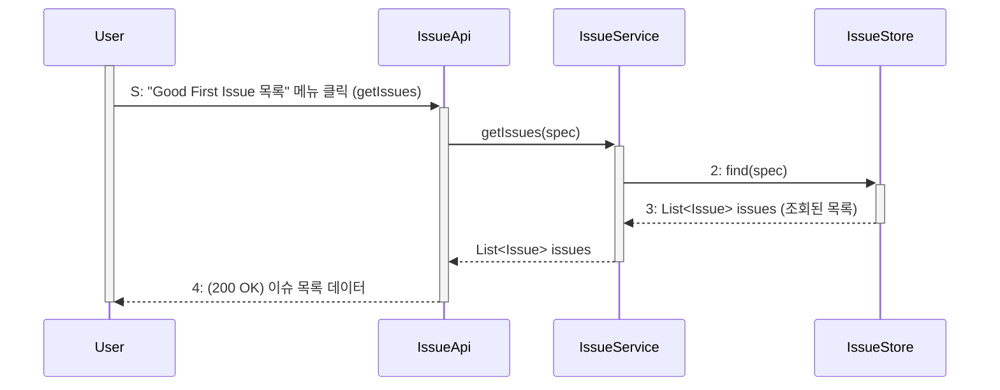
사용자가 'Good First Issue 목록' 메뉴를 클릭하면 이 과정이 시작됩니다. 이 요청은 IssueApi로 전달되어 getIssues가 호출되며, API는 IssueService에 쿼리 스펙(spec)을 넘깁니다. IssueService는 이 스펙을 바탕으로 IssueStore의 find 메서드를 호출하여 "Good First Issue" 라벨과 "OPEN" 상태 등의 조건에 맞는 이슈 목록을 데이터베이스에서 조회합니다. IssueStore가 이슈 목록을 반환하면, IssueService와 IssueApi를 거쳐 최종적으로 사용자에게 목록 데이터가 전달되어 화면에 표시됩니다.

### 이슈 북마크 저장
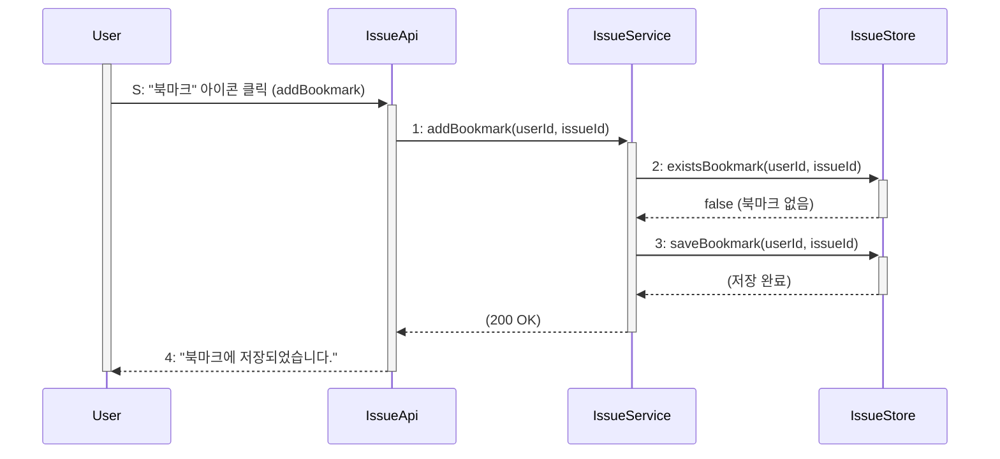
사용자가 특정 이슈의 '북마크' 아이콘을 클릭하면 IssueApi의 addBookmark가 호출됩니다. IssueApi는 IssueService에 userId와 issueId를 전달하여 addBookmark를 요청합니다. IssueService는 먼저 IssueStore의 existsBookmark를 호출해 중복 여부를 확인합니다. 중복이 아닐 경우(false), IssueService는 IssueStore의 saveBookmark를 호출하여 데이터베이스에 정보를 저장합니다. 저장이 완료되면, IssueApi를 통해 사용자에게 "북마크에 저장되었습니다."라는 확인 메시지가 전달됩니다.

### 이슈 북마크 삭제
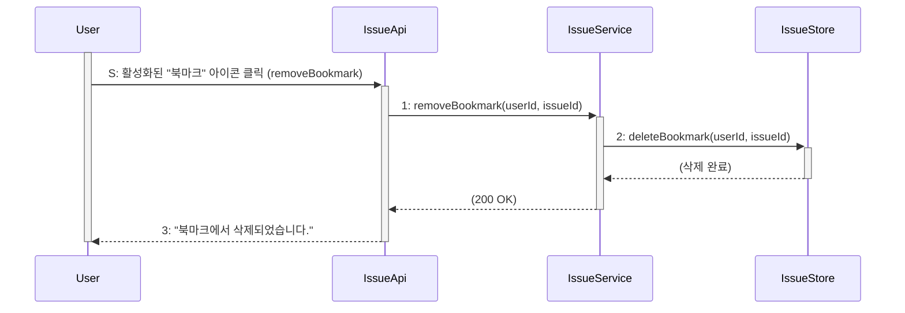
사용자가 이미 활성화된 북마크 아이콘을 다시 클릭하면 IssueApi의 removeBookmark가 호출됩니다. IssueApi는 IssueService에 userId와 issueId를 전달하여 removeBookmark를 요청합니다. IssueService는 즉시 IssueStore의 deleteBookmark를 호출하여 데이터베이스에서 해당 북마크 데이터를 삭제합니다. 삭제가 성공적으로 완료되면, IssueApi를 통해 사용자에게 "북마크에서 삭제되었습니다."라는 확인 메시지가 전달됩니다.

### 키워드 검색
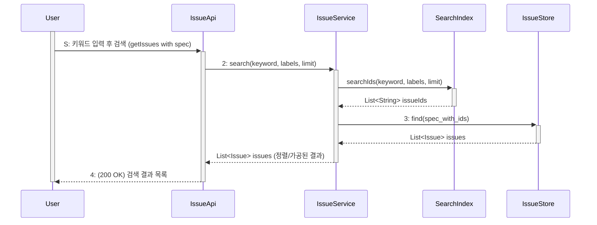
사용자가 키워드를 입력하고 검색을 요청하면 IssueApi가 IssueService의 search 메서드를 호출합니다. IssueService는 SearchIndex의 searchIds를 호출하여 검색 인덱스로부터 키워드와 일치하는 이슈 ID 목록(issueIds)을 먼저 받아옵니다. 그 후, 이 ID 목록을 포함한 쿼리 스펙을 IssueStore의 find 메서드로 전달하여 데이터베이스에서 실제 Issue 객체 목록을 조회합니다. IssueService는 이 결과를 정렬하고 가공하여 IssueApi를 통해 사용자에게 최종 검색 결과 목록을 반환합니다.

### OSS 이슈 이동
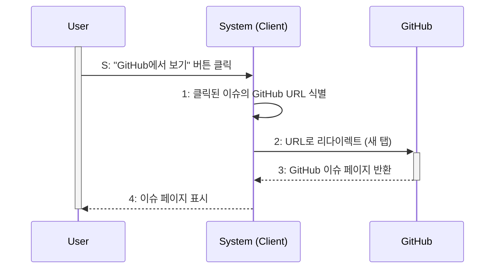
사용자가 이슈 상세 화면에서 "GitHub에서 보기" 버튼을 클릭하면, 시스템(클라이언트)은 해당 이슈가 가지고 있는 고유한 GitHub URL을 식별합니다. 시스템은 즉시 사용자의 웹 브라우저에 새 탭을 열어 식별된 URL로 리다이렉트시킵니다. GitHub 서버는 이 요청에 응답하여 해당 이슈의 원본 페이지를 사용자 브라우저에 표시합니다.

### vscode.dev 열기
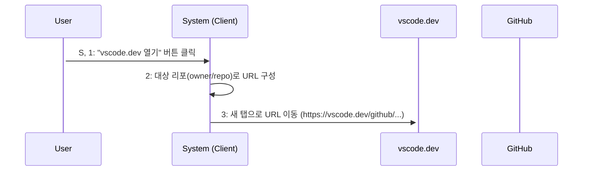
사용자가 "vscode.dev 열기" 버튼을 클릭하면, 시스템(클라이언트)은 현재 리포지토리의 owner와 name 정보를 바탕으로 https://vscode.dev/github/{owner}/{name} 형식의 URL을 동적으로 구성합니다. 시스템은 이 URL로 새 탭을 열어 vscode.dev로 이동시킵니다. 만약 대상 리포지토리가 Private인 경우, vscode.dev는 사용자에게 GitHub 인증을 요구하며, 사용자가 이를 승인하면 vscode.dev가 리포지토리의 파일 트리를 로드하여 웹 에디터를 렌더링합니다.

## 기여도 및 도전과제
### 도전과제 진행 상태 조회
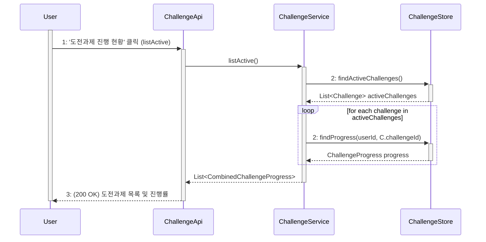
사용자가 '도전과제 진행 현황' 메뉴를 클릭하면 ChallengeApi의 listActive가 호출됩니다. ChallengeApi는 ChallengeService를 호출하고, ChallengeService는 ChallengeStore의 findActiveChallenges를 통해 현재 활성화된 모든 과제 목록을 가져옵니다. 그 다음, ChallengeService는 이 목록을 반복(loop)하면서 각 과제 ID에 대해 ChallengeStore의 findProgress를 호출하여 해당 사용자의 진행률(ChallengeProgress) 데이터를 개별적으로 조회합니다. 모든 과제 정보와 진행률이 조합되면, ChallengeApi를 통해 사용자에게 최종 목록이 반환됩니다.

### 도전과제 완료
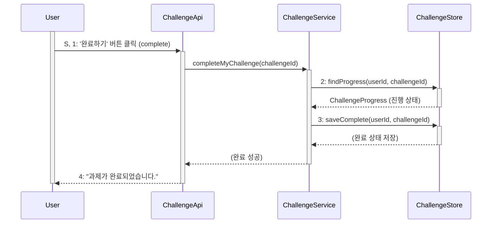
사용자가 '완료하기' 버튼을 클릭하면 ChallengeApi의 complete 메서드가 호출됩니다. ChallengeApi는 ChallengeService의 completeMyChallenge를 호출합니다. ChallengeService는 먼저 ChallengeStore의 findProgress를 통해 해당 과제의 진행률이 100%인지 내부적으로 검증합니다. 검증이 완료되면, ChallengeService는 ChallengeStore의 saveComplete를 호출하여 데이터베이스의 과제 상태를 '완료'(예: completedAt 시각 기록)로 갱신하고 보상 지급 로직을 처리합니다. 모든 과정이 성공하면 ChallengeApi를 통해 사용자에게 "과제가 완료되었습니다."라는 메시지가 반환됩니다.

### 오픈소스 기여 배지 획득
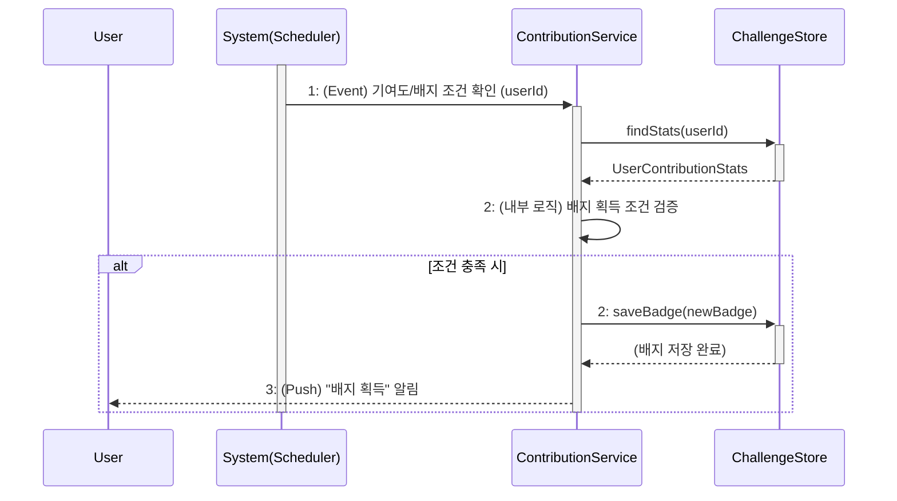
이 과정은 사용자가 아닌 시스템 스케줄러에 의해 주기적으로 시작됩니다. 스케줄러가 ContributionService를 호출하여 특정 사용자의 배지 획득 조건 확인을 요청합니다. ContributionService는 ChallengeStore의 findStats를 호출하여 사용자의 기여 통계(UserContributionStats)를 조회합니다. 이 통계를 바탕으로 내부 로직을 통해 새로운 배지 획득 조건을 충족했는지 검증합니다. 만약 조건을 충족했다면, ContributionService는 ChallengeStore의 saveBadge를 호출하여 새 배지를 데이터베이스에 저장하고, 사용자에게 푸시 알림 등을 통해 배지 획득 사실을 알립니다.

### 오픈소스 기여 배지 조회
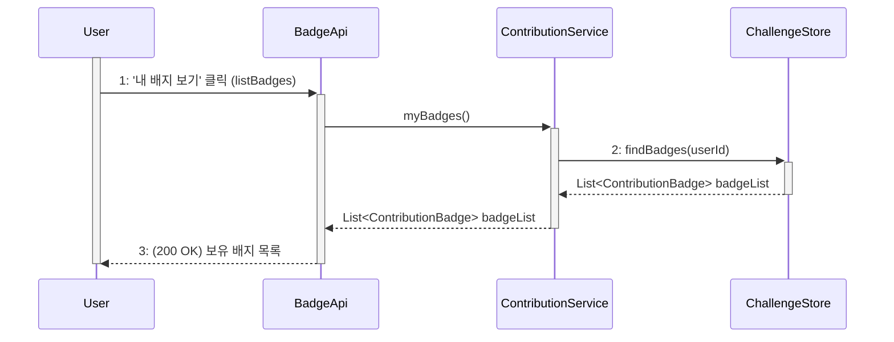
사용자가 '내 배지 보기' 메뉴를 클릭하면 BadgeApi의 listBadges가 호출됩니다. BadgeApi는 ContributionService의 myBadges 메서드를 호출합니다. ContributionService는 ChallengeStore의 findBadges를 호출하여 데이터베이스에서 현재 로그인한 사용자의 모든 ContributionBadge 목록을 조회합니다. 이 목록은 ContributionService와 BadgeApi를 거쳐 사용자에게 반환되어 화면에 표시됩니다.

### 오픈소스 기여도 랭킹 확인
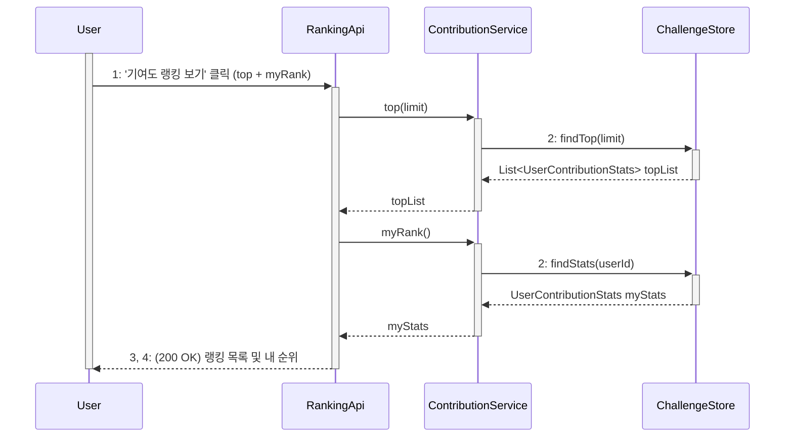
사용자가 '기여도 랭킹 보기'를 클릭하면 RankingApi가 호출됩니다. RankingApi는 먼저 ContributionService의 top 메서드를 호출하고, 이는 ChallengeStore의 findTop을 통해 상위 N명의 랭킹 목록(UserContributionStats 리스트)을 조회합니다. 동시에 RankingApi는 ContributionService의 myRank 메서드를 호출하고, 이는 ChallengeStore의 findStats를 통해 '내' 기여 통계 및 순위 정보를 조회합니다. RankingApi는 이 두 정보를 조합하여 사용자에게 전체 랭킹 목록과 자신의 순위를 함께 반환합니다.

### OSS 뉴스 목록 조회
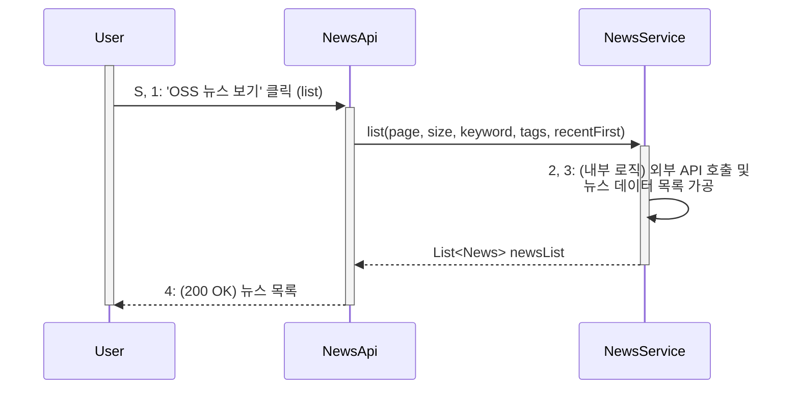
사용자가 'OSS 뉴스 보기' 메뉴를 클릭하면 NewsApi의 list가 호출됩니다. NewsApi는 NewsService의 list 메서드를 호출합니다. NewsService는 (필요시 외부 API를 호출하거나 DB를 조회하는) 내부 로직을 통해 최신 뉴스 데이터를 가져와 News 객체 목록으로 가공합니다. 이 가공된 목록은 NewsApi를 거쳐 사용자에게 반환되어 화면에 표시됩니다.

### OSS 뉴스 페이지로 이동
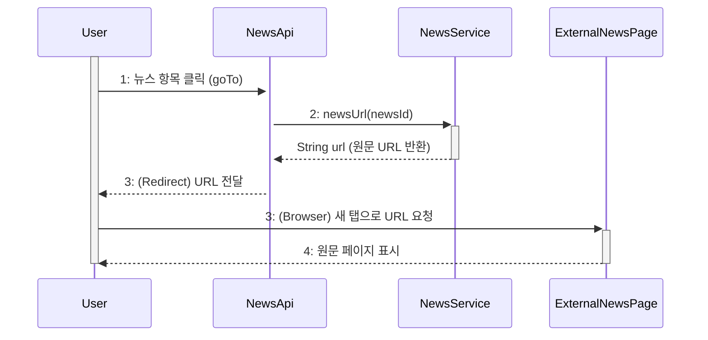
사용자가 뉴스 목록에서 특정 항목을 클릭하면 NewsApi의 goTo 메서드가 호출됩니다. NewsApi는 NewsService의 newsUrl을 호출하여 해당 newsId의 원본 URL(문자열)을 요청합니다. NewsService가 이 URL을 반환하면, NewsApi는 사용자에게 이 URL로 리다이렉트하라는 응답을 보냅니다. 사용자의 브라우저는 이 응답을 받아 새 탭을 열고 해당 외부 뉴스 원문 페이지(ExternalNewsPage)로 이동하여 기사를 표시합니다.

---

## 5. State machine diagram
- Draw state machine diagrams for the client and the server system.  
- Explain each state machine diagram.  
- 12pt, 160%.  

---

## 6. User interface prototype
- Design user interface for your software system.  
- It will be easy if you just think that you make a preliminary user manual of your system based on your user interface.  
- 12pt, 160%.  

---

## 7. Implementation requirements
- Describe operating environments to implement your system.  
- 12pt, 160%.  

---

## 8. Glossary
- Specifically describe all of the terms used in this document.  
- 12pt, 160%.  

---

## 9. References
- Describe all of your references (book, paper, technical report etc).  
- 12pt, 160%.  
